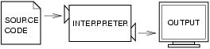
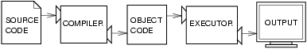

..  Copyright (C)  Jeffrey Elkner, Allen B. Downey and Chris Meyers.
    Permission is granted to copy, distribute and/or modify this document
    under the terms of the GNU Free Documentation License, Version 1.3
    or any later version published by the Free Software Foundation;
    with Invariant Sections being Forward, Preface, and Contributor List, no
    Front-Cover Texts, and no Back-Cover Texts.  A copy of the license is
    included in the section entitled "GNU Free Documentation License".

The way of the program
======================

The goal of this book is to teach you to think like a computer scientist. This
way of thinking combines some of the best features of mathematics, engineering,
and natural science. Like mathematicians, computer scientists use formal
languages to denote ideas (specifically computations). Like engineers, they
design things, assembling components into systems and evaluating tradeoffs
among alternatives.  Like scientists, they observe the behavior of complex
systems, form hypotheses, and test predictions.

The single most important skill for a computer scientist is **problem
solving**. Problem solving means the ability to formulate problems, think
creatively about solutions, and express a solution clearly and accurately. As
it turns out, the process of learning to program is an excellent opportunity to
practice problem-solving skills. That's why this chapter is called, The way of
the program.

On one level, you will be learning to program, a useful skill by itself. On
another level, you will use programming as a means to an end. As we go along,
that end will become clearer.

.. index:: programming language, portable, high-level language,
           low-level language, compile, interpret

The Python programming language
-------------------------------

The programming language you will be learning is Python. Python is an example
of a **high-level language**; other high-level languages you might have heard
of are C++, PHP, and Java.

As you might infer from the name high-level language, there are also
**low-level languages**, sometimes referred to as machine languages or assembly
languages. Loosely speaking, computers can only execute programs written in
low-level languages. Thus, programs written in a high-level language have to be
processed before they can run. This extra processing takes some time, which is
a small disadvantage of high-level languages.

But the advantages are enormous. First, it is much easier to program in a
high-level language. Programs written in a high-level language take less time
to write, they are shorter and easier to read, and they are more likely to be
correct. Second, high-level languages are **portable**, meaning that they can
run on different kinds of computers with few or no modifications. Low-level
programs can run on only one kind of computer and have to be rewritten to run
on another.

Due to these advantages, almost all programs are written in high-level
languages. Low-level languages are used only for a few specialized
applications.

Two kinds of programs process high-level languages into low-level languages:
**interpreters** and **compilers**. An interpreter reads a high-level program
and executes it, meaning that it does what the program says. It processes the
program a little at a time, alternately reading lines and performing
computations.

A compiler reads the program and translates it completely before the program
starts running. In this case, the high-level program is called the **source
code**, and the translated program is called the **object code** or the
**executable**. Once a program is compiled, you can execute it repeatedly
without further translation.

Many modern languages use both processes. They are first compiled into a lower
level language, called **byte code**, and then interpreted by a program called
a **virtual machine**. Python uses both processes, but because of the way
programmers interact with it, it is usually considered an interpreted language.

There are two ways to use the Python interpreter: *shell mode* and *script
mode*. In shell mode, you type Python statements into the **Python shell** and
the interpreter immediately prints the result:

.. sourcecode:: python
    
    $ python
    Python 2.5.1 (r251:54863, May  2 2007, 16:56:35) 
    [GCC 4.1.2 (Ubuntu 4.1.2-0ubuntu4)] on linux2
    Type "help", "copyright", "credits" or "license" for more information.
    >>> print 1 + 1
    2

The first line of this example is the command that starts the Python
interpreter at a Unix command prompt. The next three lines are messages from
the interpreter. The fourth line starts with ``>>>``, which is the **Python
prompt**. The interpreter uses the prompt to indicate that it is ready for
instructions. We typed ``print 1 + 1``, and the interpreter replied ``2``.

Alternatively, you can write a program in a file and use the interpreter to
execute the contents of the file. Such a file is called a **script**. For
example, we used a text editor to create a file named ``firstprogram.py`` with
the following contents:

.. sourcecode:: python
    
    print 1 + 1

By convention, files that contain Python programs have names that end with
``.py``.

To execute the program, we have to tell the interpreter the name of the script:

.. sourcecode:: python
    
    $ python firstprogram.py
    2

These examples show Python being run from a Unix command line. In other
development environments, the details of executing programs may differ. Also,
most programs are more interesting than this one.

The examples in this book use both the Python interpreter and scripts.  You
will be able to tell which is intended since shell mode examples will always
start with the Python prompt.

Working in shell mode is convenient for testing short bits of code because you
get immediate feedback. Think of it as scratch paper used to help you work out
problems. Anything longer than a few lines should be put into a script.

.. index:: program, algorithm

What is a program?
------------------

A **program** is a sequence of instructions that specifies how to perform a
computation. The computation might be something mathematical, such as solving a
system of equations or finding the roots of a polynomial, but it can also be a
symbolic computation, such as searching and replacing text in a document or
(strangely enough) compiling a program.

The details look different in different languages, but a few basic instructions
appear in just about every language:

input
    Get data from the keyboard, a file, or some other device.

output
    Display data on the screen or send data to a file or other device.

math
    Perform basic mathematical operations like addition and multiplication.

conditional execution
    Check for certain conditions and execute the appropriate sequence of
    statements.

repetition
    Perform some action repeatedly, usually with some variation.

Believe it or not, that's pretty much all there is to it. Every program you've
ever used, no matter how complicated, is made up of instructions that look more
or less like these. Thus, we can describe programming as the process of
breaking a large, complex task into smaller and smaller subtasks until the
subtasks are simple enough to be performed with one of these basic
instructions.

That may be a little vague, but we will come back to this topic later when we
talk about **algorithms**.

.. index:: debugging, bug

What is debugging?
------------------

Programming is a complex process, and because it is done by human beings, it
often leads to errors. For whimsical reasons, programming errors are called
**bugs** and the process of tracking them down and correcting them is called
**debugging**.

Three kinds of errors can occur in a program: `syntax errors
<http://en.wikipedia.org/wiki/Syntax_error>`__, `runtime errors
<http://en.wikipedia.org/wiki/Runtime_error>`__, and `semantic errors
<http://en.wikipedia.org/wiki/Logic_error>`__.  It is useful to
distinguish between them in order to track them down more quickly.

.. index:: syntax, syntax error

Syntax errors
-------------

Python can only execute a program if the program is syntactically correct;
otherwise, the process fails and returns an error message.  **syntax** refers
to the structure of a program and the rules about that structure. For example,
in English, a sentence must begin with a capital letter and end with a period.
this sentence contains a **syntax error**. So does this one

For most readers, a few syntax errors are not a significant problem, which is
why we can read the poetry of e. e. cummings without spewing error messages.
Python is not so forgiving. If there is a single syntax error anywhere in your
program, Python will print an error message and quit, and you will not be able
to run your program. During the first few weeks of your programming career, you
will probably spend a lot of time tracking down syntax errors. As you gain
experience, though, you will make fewer errors and find them faster.

.. index:: runtime error, exception, safe language

Runtime errors
--------------

The second type of error is a runtime error, so called because the error does
not appear until you run the program. These errors are also called
**exceptions** because they usually indicate that something exceptional (and
bad) has happened.

Runtime errors are rare in the simple programs you will see in the first few
chapters, so it might be a while before you encounter one.

.. index:: semantics, semantic error

Semantic errors
---------------

The third type of error is the **semantic error**. If there is a semantic error
in your program, it will run successfully, in the sense that the computer will
not generate any error messages, but it will not do the right thing. It will do
something else. Specifically, it will do what you told it to do.

The problem is that the program you wrote is not the program you wanted to
write. The meaning of the program (its semantics) is wrong.  Identifying
semantic errors can be tricky because it requires you to work backward by
looking at the output of the program and trying to figure out what it is doing.

.. index::
    single: Holmes, Sherlock
    single: Doyle, Arthur Conan 
    single: Linux

Experimental debugging
----------------------

One of the most important skills you will acquire is debugging.  Although it
can be frustrating, debugging is one of the most intellectually rich,
challenging, and interesting parts of programming.

In some ways, debugging is like detective work. You are confronted with clues,
and you have to infer the processes and events that led to the results you see.

Debugging is also like an experimental science. Once you have an idea what is
going wrong, you modify your program and try again. If your hypothesis was
correct, then you can predict the result of the modification, and you take a
step closer to a working program. If your hypothesis was wrong, you have to
come up with a new one. As Sherlock Holmes pointed out, When you have
eliminated the impossible, whatever remains, however improbable, must be the
truth. (A. Conan Doyle, *The Sign of Four*)

For some people, programming and debugging are the same thing. That is,
programming is the process of gradually debugging a program until it does what
you want. The idea is that you should start with a program that does
*something* and make small modifications, debugging them as you go, so that you
always have a working program.

For example, Linux is an operating system kernel that contains millions of
lines of code, but it started out as a simple program Linus Torvalds used to
explore the Intel 80386 chip. According to Larry Greenfield, one of Linus's
earlier projects was a program that would switch between printing AAAA and
BBBB. This later evolved to Linux (*The Linux Users' Guide* Beta Version 1).

Later chapters will make more suggestions about debugging and other programming
practices.

.. index:: formal language, natural language, parse

Formal and natural languages
----------------------------

**Natural languages** are the languages that people speak, such as English,
Spanish, and French. They were not designed by people (although people try to
impose some order on them); they evolved naturally.

**Formal languages** are languages that are designed by people for specific
applications. For example, the notation that mathematicians use is a formal
language that is particularly good at denoting relationships among numbers and
symbols. Chemists use a formal language to represent the chemical structure of
molecules. And most importantly:

    *Programming languages are formal languages that have been designed to
    express computations.*

Formal languages tend to have strict rules about syntax. For example, ``3+3=6``
is a syntactically correct mathematical statement, but ``3=+6$`` is not.
H\ :sub:`2`\ O is a syntactically correct chemical name, but :sub:`2`\ Zz is
not.

Syntax rules come in two flavors, pertaining to **tokens** and structure.
Tokens are the basic elements of the language, such as words, numbers, and
chemical elements. One of the problems with ``3=+6$`` is that ``$`` is not a
legal token in mathematics (at least as far as we know). Similarly,
:sub:`2`\ Zz is not legal because there is no element with the abbreviation
``Zz``.

The second type of syntax rule pertains to the structure of a statement--- that
is, the way the tokens are arranged. The statement ``3=+6$`` is structurally
illegal because you can't place a plus sign immediately after an equal sign.
Similarly, molecular formulas have to have subscripts after the element name,
not before.

When you read a sentence in English or a statement in a formal language, you
have to figure out what the structure of the sentence is (although in a natural
language you do this subconsciously). This process is called **parsing**.

For example, when you hear the sentence, The other shoe fell, you understand
that the other shoe is the subject and fell is the verb.  Once you have parsed
a sentence, you can figure out what it means, or the semantics of the sentence.
Assuming that you know what a shoe is and what it means to fall, you will
understand the general implication of this sentence.

Although formal and natural languages have many features in common --- tokens,
structure, syntax, and semantics --- there are many differences:

.. glossary::

    ambiguity
        Natural languages are full of ambiguity, which people deal with by
        using contextual clues and other information. Formal languages are
        designed to be nearly or completely unambiguous, which means that any
        statement has exactly one meaning, regardless of context.

    redundancy
        In order to make up for ambiguity and reduce misunderstandings, natural
        languages employ lots of redundancy. As a result, they are often
        verbose.  Formal languages are less redundant and more concise.

    literalness
        Natural languages are full of idiom and metaphor. If someone says, The
        other shoe fell, there is probably no shoe and nothing falling. Formal
        languages mean exactly what they say.

People who grow up speaking a natural language---everyone---often have a hard
time adjusting to formal languages. In some ways, the difference between formal
and natural language is like the difference between poetry and prose, but more
so:

.. glossary::

    Poetry
        Words are used for their sounds as well as for their meaning, and the
        whole poem together creates an effect or emotional response. Ambiguity
        is not only common but often deliberate.

    Prose
        The literal meaning of words is more important, and the structure
        contributes more meaning. Prose is more amenable to analysis than
        poetry but still often ambiguous.

    Programs
        The meaning of a computer program is unambiguous and literal, and can
        be understood entirely by analysis of the tokens and structure.

Here are some suggestions for reading programs (and other formal languages).
First, remember that formal languages are much more dense than natural
languages, so it takes longer to read them. Also, the structure is very
important, so it is usually not a good idea to read from top to bottom, left to
right. Instead, learn to parse the program in your head, identifying the tokens
and interpreting the structure.  Finally, the details matter. Little things
like spelling errors and bad punctuation, which you can get away with in
natural languages, can make a big difference in a formal language.

.. index:: "hello world!", print statement

The first program
-----------------

Traditionally, the first program written in a new language is called Hello,
World! because all it does is display the words, Hello, World!  In Python, it
looks like this:

.. sourcecode:: python
    
    print "Hello, World!"

This is an example of a **print statement**, which doesn't actually print
anything on paper. It displays a value on the screen. In this case, the result
is the words

.. sourcecode:: python
    
    Hello, World!

The quotation marks in the program mark the beginning and end of the value;
they don't appear in the result.

Some people judge the quality of a programming language by the simplicity of
the Hello, World! program. By this standard, Python does about as well as
possible.

Glossary
--------

.. glossary::

    algorithm
        A general process for solving a category of problems.

    bug
        An error in a program.

    byte code
        An intermediate language between source code and object code. Many
        modern languages first compile source code into byte code and then
        interpret the byte code with a program called a *virtual machine*.

    compile
        To translate a program written in a high-level language into a
        low-level language all at once, in preparation for later execution.

    debugging
        The process of finding and removing any of the three kinds of
        programming errors.

    exception
        Another name for a runtime error.

    executable
        Another name for object code that is ready to be executed.

    formal language
        Any one of the languages that people have designed for specific
        purposes, such as representing mathematical ideas or computer programs;
        all programming languages are formal languages.

    high-level language
        A programming language like Python that is designed to be easy for
        humans to read and write.

    interpret
        To execute a program in a high-level language by translating it one
        line at a time.

    low-level language
        A programming language that is designed to be easy for a computer to
        execute; also called machine language or assembly language.

    natural language
        Any one of the languages that people speak that evolved naturally.

    object code
        The output of the compiler after it translates the program.

    parse
        To examine a program and analyze the syntactic structure.

    portability
        A property of a program that can run on more than one kind of computer.

    print statement
        An instruction that causes the Python interpreter to display a value on
        the screen.

    problem solving
        The process of formulating a problem, finding a solution, and
        expressing the solution.

    program
        a sequence of instructions that specifies to a computer actions and
        computations to be performed.

    Python shell
        An interactive user interface to the Python interpreter. The user of a
        Python shell types commands at the prompt (>>>), and presses the return
        key to send these commands immediately to the interpreter for
        processing.

    runtime error
        An error that does not occur until the program has started to execute
        but that prevents the program from continuing.

    script
        A program stored in a file (usually one that will be interpreted).

    semantic error
        An error in a program that makes it do something other than what the
        programmer intended.

    semantics
        The meaning of a program.

    source code
        A program in a high-level language before being compiled.

    syntax
        The structure of a program.

    syntax error
        An error in a program that makes it impossible to parse --- and
        therefore impossible to interpret.

    token
        One of the basic elements of the syntactic structure of a program,
        analogous to a word in a natural language.

Exercises
---------

#. Write an English sentence with understandable semantics but incorrect
   syntax. Write another sentence which has correct syntax but has semantic
   errors.
#. Start a Python shell. Type ``1 + 2`` and then hit return. Python *evaluates* 
   this *expression*, prints the result, and then prints another prompt. ``*``
   is the *multiplication operator*, and ``**`` is the
   *exponentiation operator*. Experiment by entering different expressions and
   recording what is printed by the Python interpreter.  What happens if you
   use the ``/`` operator? Are the results what you expect? Explain.
#. Type ``1 2`` and then hit return. Python tries to evaluate the expression,
   but it can't because the expression is not syntactically legal. Instead, it
   prints the error message::

          File "<stdin>", line 1
            1 2
              ^
        SyntaxError: invalid syntax

   In many cases, Python indicates where the syntax error occurred, but it is
   not always right, and it doesn't give you much information about what is
   wrong.
   
   So, for the most part, the burden is on you to learn the syntax rules.
   
   In this case, Python is complaining because there is no operator between the
   numbers.
   
   Write down three more examples of strings that will produce error messages
   when you enter them at the Python prompt. Explain why each example is not
   valid Python syntax.
#. Type `print 'hello'`. Python executes this statement, which has the effect
   of printing the letters h-e-l-l-o. Notice that the quotation marks that you
   used to enclose the string are not part of the output.  Now type ``"hello"``
   and describe and explain your result.
#. Type ``print cheese`` without the quotation marks. The output will look
   something like this::

        Traceback (most recent call last):
          File "<stdin>", line 1, in ?
        NameError: name 'cheese' is not defined

   This is a run-time error; specifically, it is a NameError, and even more
   specifically, it is an error because the name `cheese` is not defined. If
   you don't know what that means yet, you will soon.
#. Type ``'This is a test...'`` at the Python prompt and hit enter.  Record what
   happens.
   
   Now create a python script named ``test1.py`` with the following contents
   (be sure to save it before you try to run it):

   .. sourcecode:: python
    
       'This is a test...'

   What happens when you run this script? Now change the contents to:

   .. sourcecode:: python
    
       print 'This is a test...'

   and run it again.
   
   What happened this time?
   
   Whenever an *expression* is typed at the Python prompt, it is *evaluated*
   and the result is printed on the line below. ``'This is a test...'`` is an
   expression, which evaluates to ``'This is a test...'`` (just like the
   expression ``42`` evaluates to ``42``). In a script, however, evaluations of
   expressions are not sent to the program output, so it is necessary to
   explicitly print it.
