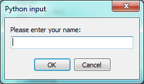
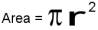

..  Copyright (C)  Peter Wentworth, Jeffrey Elkner, Allen B. Downey and Chris Meyers.
    Permission is granted to copy, distribute and/or modify this document
    under the terms of the GNU Free Documentation License, Version 1.3
    or any later version published by the Free Software Foundation;
    with Invariant Sections being Foreword, Preface, and Contributor List, no
    Front-Cover Texts, and no Back-Cover Texts.  A copy of the license is
    included in the section entitled "GNU Free Documentation License".

.. |rle_start| image:: illustrations/rle_start.png
   
.. |rle_end| image:: illustrations/rle_end.png
 
.. |rle_open| image:: illustrations/rle_open.png
   
.. |rle_close| image:: illustrations/rle_close.png
    
    
Variables, expressions and statements
=====================================

.. index:: value, data type, string, integer, int, float, class

.. index::
    single: triple quoted string

.. _values_n_types:

Values and data types
---------------------

A **value** is one of the fundamental things --- like a letter or a number ---
that a program manipulates. The values we have seen so far are ``4`` (the
result when we added ``2 + 2``), and ``"Hello, World!"``.

These values are classified into different **classes**, or **data types**: ``4`` 
is an *integer*, and ``"Hello, World!"`` is a *string*, 
so-called because it contains a string of
letters. You (and the interpreter) can identify strings because they are
enclosed in quotation marks.

If you are not sure what class a value falls into, Python has a function 
called **type** which can tell you.

.. sourcecode:: python
    
    >>> type("Hello, World!")
    <class 'str'>
    >>> type(17)
    <class 'int'>

Not surprisingly, strings belong to the class **str** and integers belong to the
class **int**. Less obviously, numbers with a decimal point belong to a class
called **float**, because these numbers are represented in a format called
*floating-point*.  At this stage, you can treat the words *class* and *type*
interchangeably.  We'll come back to a deeper understanding of what a class 
is in later chapters. 

.. sourcecode:: python
    
    >>> type(3.2)
    <class 'float'>

What about values like ``"17"`` and ``"3.2"``? They look like numbers, but they
are in quotation marks like strings.

.. sourcecode:: python
    
    >>> type("17")
    <class 'str'>
    >>> type("3.2")
    <class 'str'>
    
They're strings!

Strings in Python can be enclosed in either single quotes (``'``) or double quotes
(``"``), or three of each (``'''`` or ``"""``)

.. sourcecode:: python
    
    >>> type('This is a string.')
    <class 'str'>
    >>> type("And so is this.")
    <class 'str'>
    >>> type("""and this.""")
    <class 'str'>
    >>> type('''and even this...''')
    <class 'str'>
    
Double quoted strings can contain single quotes inside them, as in
``"Bruce's beard"``, and single quoted strings can have double quotes
inside them, as in ``'The knights who say "Ni!"'``. 

Strings enclosed with three occurrences of either quote symbol are
called triple quoted strings.  They can 
contain either single or double quotes: 

.. sourcecode:: python
    
    >>> print('''"Oh no", she exclaimed, "Ben's bike is broken!"''')
    "Oh no", she exclaimed, "Ben's bike is broken!"
    >>>

Triple quoted strings can even span multiple lines:

.. sourcecode:: python
    
    >>> message = """This message will
    ... span several
    ... lines."""
    >>> print(message)
    This message will
    span several
    lines.
    >>>
    

Python doesn't care whether you use single or double quotes or 
the three-of-a-kind quotes to surround your strings: 
once it has parsed the text of your program or command, the way it stores the
value is identical in all cases, and the surrounding quotes are not part of
the value. But when the interpreter wants to display a string, it has to 
decide which quotes to use to make it look like a string. 

.. sourcecode:: python

    >>> 'This is a string.'
    'This is a string.'
    >>> """And so is this."""
    'And so is this.'

So the Python language designers usually chose to surround their strings 
by single quotes.  What do think would happen if the string already 
contained single quotes?

When you type a large integer, you might be tempted to use commas between
groups of three digits, as in ``42,000``. This is not a legal integer in
Python, but it does mean something else, which is legal:

.. sourcecode:: python
    
    >>> 42000
    42000
    >>> 42,000
    (42, 0)

Well, that's not what we expected at all! Because of the comma, Python chose to 
treat this as a *pair* of values.  We'll come back to learn about pairs later.   
But, for the moment, remember not to put commas or spaces in your integers, no matter
how big they are. Also revisit what we said in the previous chapter: formal languages are 
strict, the notation is concise, and even the smallest change might
mean something quite different from what you intended. 
    

.. index:: variable, assignment, assignment statement, state snapshot

Variables
---------

One of the most powerful features of a programming language is the ability to
manipulate **variables**. A variable is a name that refers to a value.

The **assignment statement** creates new variables and gives them
values:

.. sourcecode:: python
    
    >>> message = "What's up, Doc?"
    >>> n = 17
    >>> pi = 3.14159

This example makes three assignments. The first assigns the string value ``"What's
up, Doc?"`` to a new variable named ``message``. The second gives the integer
``17`` to ``n``, and the third assigns the floating-point number ``3.14159`` to
a variable called ``pi``.

The **assignment token**, ``=``, should not be confused with *equals*, which uses
the token `==`.  The assignment statement links a *name*,
on the left hand side of the operator, with a *value*, on the right hand side.
This is why you will get an error if you enter:

.. sourcecode:: python
    
    >>> 17 = n
    
.. tip::
   When reading or writing code, say to yourself "n is assigned 17"
   or "n gets the value 17".  Don't say "n equals 17".
      

A common way to represent variables on paper is to write the name with an arrow
pointing to the variable's value. This kind of figure is called a **state
snapshot** because it shows what state each of the variables is in at a particular
instant in time.  (Think of it as the variable's state of mind). 
This diagram shows the result of executing the assignment statements:

.. image:: illustrations/state.png
   :alt: State snapshot

If you ask the interpreter to evaluate a variable, it will produce the value that is currently 
linked to the variable:

.. sourcecode:: python
    
    >>> message
    'What's up, Doc?'
    >>> n
    17
    >>> pi
    3.14159

In each case the result is the value of the variable. Variables also have
types; again, we can ask the interpreter what they are.

.. sourcecode:: python
    
    >>> type(message)
    <class 'str'>
    >>> type(n)
    <class 'int'>
    >>> type(pi)
    <class 'float'>

The type of a variable is the type of the value it currently refers to.

We use variables in a program to "remember" things, like the current score at the football game.
But variables are *variable*. This means they can change over time, just like the scoreboard at a football game. 
You can assign a value to a variable, and later assign a different value to the same variable.  
(*This is different from maths. In maths, if you give `x` the value 3, it
cannot change to link to a different value half-way through your calculations!*)

.. sourcecode:: python
    
    >>> day = "Thursday"
    >>> day
    'Thursday'
    >>> day = "Friday"
    >>> day
    'Friday'
    >>> day = 21
    >>> day
    21

You'll notice we changed the value of `day` three times, and on the third assignment we even gave it a value
that was of a different type.   

A great deal of programming is about having the computer remember things, e.g. *The number of missed calls on your phone*, and then arranging to update or change the variable when you miss another call. 

.. index:: keyword, underscore character

Variable names and keywords
---------------------------

**Variable names** can be arbitrarily long. They can contain both letters and
digits, but they have to begin with a letter or an underscore. Although it is legal to use
uppercase letters, by convention we don't. If you do, remember that case
matters. ``Bruce`` and ``bruce`` are different variables.

The underscore character ( ``_``) can appear in a name. It is often used in
names with multiple words, such as ``my_name`` or ``price_of_tea_in_china``.

There are some situations in which names beginning with an underscore have
special meaning, so a safe rule for beginners is to start all names with a letter.
 
If you give a variable an illegal name, you get a syntax error:

.. sourcecode:: python
    
    >>> 76trombones = "big parade"
    SyntaxError: invalid syntax
    >>> more$ = 1000000
    SyntaxError: invalid syntax
    >>> class = "Computer Science 101"
    SyntaxError: invalid syntax

``76trombones`` is illegal because it does not begin with a letter.  ``more$``
is illegal because it contains an illegal character, the dollar sign. But
what's wrong with ``class``?

It turns out that ``class`` is one of the Python **keywords**. Keywords define
the language's syntax rules and structure, and they cannot be used as variable names.

Python has thirty-something keywords (and every now and again improvements to Python
introduce or eliminate one or two):

======== ======== ======== ======== ======== ========
and      as       assert   break    class    continue
def      del      elif     else     except   exec
finally  for      from     global   if       import
in       is       lambda   nonlocal not      or       
pass     raise    return   try      while    with
yield    True     False    None
======== ======== ======== ======== ======== ========

You might want to keep this list handy. If the interpreter complains about one
of your variable names and you don't know why, see if it is on this list.

Programmers generally choose names for their variables that are meaningful to 
the human readers of the program ---
they help the programmer document, or remember, what the variable is used for.

.. caution::
   Beginners sometimes confuse "meaningful to the human readers" with "meaningful to the computer".
   So they'll wrongly think that because they've called some variable ``average`` or ``pi``, it will
   somehow automagically calculate an average, or automagically associate the variable ``pi`` with 
   the value 3.14159.  No! The computer doesn't attach semantic 
   meaning to your variable names. 
   
   So you'll find some instructors who deliberately don't choose meaningful 
   names when they teach beginners --- not because they don't think it is a good habit,
   but because they're trying to reinforce the message that you, the programmer, have
   to write some program code to calculate the average, or you must write an assignment 
   statement to give a variable the value you want it to have.

.. index:: statement

Statements
----------

A **statement** is an instruction that the Python interpreter can execute. We
have only seen the assignment statement so far.  Some other kinds of statements that 
we'll see shortly are ``while`` statements, ``for`` statements, ``if`` statements,  
and ``import`` statements.  (There are other kinds too!)

When you type a statement on the command line, Python executes it.  Statements
don't produce any result. 

.. index:: expression

Evaluating expressions
----------------------

An **expression** is a combination of values, variables, operators, and calls to functions. If you
type an expression at the Python prompt, the interpreter **evaluates** it and
displays the result:

.. sourcecode:: python
    
    >>> 1 + 1
    2
    >>> len("hello")
    5
    
In this example ``len`` is a built-in Python function that returns the number of characters in a string. 
We've previously seen the ``print`` and the ``type`` functions, so this is our third example of a function! 

The *evaluation of an expression* produces a value, which is why expressions
can appear on the right hand side of assignment statements. A value all by
itself is a simple expression, and so is a variable.

.. sourcecode:: python
    
    >>> 17
    17
    >>> y = 3.14
    >>> x = len("hello")
    >>> x
    5
    >>> y
    3.14

.. index:: operator, operand, expression, integer division

Operators and operands
----------------------

**Operators** are special tokens that represent computations like addition,
multiplication and division. The values the operator uses are called **operands**.

The following are all legal Python expressions whose meaning is more or less
clear::
    
    20+32   hour-1   hour*60+minute   minute/60   5**2   (5+9)*(15-7)

The tokens ``+``, ``-``, and ``*``, and the use of parenthesis for grouping,
mean in Python what they mean in mathematics. The asterisk (``*``) is the
token for multiplication, and ``**`` is the token for exponentiation.

.. sourcecode:: python
    
    >>> 2 ** 3
    8
    >>> 3 ** 2
    9
    
When a variable name appears in the place of an operand, it is replaced with
its value before the operation is performed.

Addition, subtraction, multiplication, and exponentiation all do what you
expect.

Example: so let us convert 645 minutes into hours:

.. sourcecode:: python
    
    >>> minutes = 645
    >>> hours = minutes/60
    >>> hours
    10.75

Oops! In Python 3, the division operator `/` always yields a floating point result. 
What we might have wanted to know was how many *whole* hours there are, and how many minutes remain.
Python gives us two different flavours of the division operator.  
The second, called **integer division** uses the token `//`.  
It always *truncates* its result down to the next smallest integer (to the
left on the number line).  

.. sourcecode:: python
    
    >>> 7 / 4
    1.75
    >>> 7 // 4
    1
    >>> minutes = 645
    >>> hours = minutes//60
    >>> hours
    10
    
Take care that you choose the correct falvour of the division operator.  If you're
working with expressions where you need floating point values, use the division operator
that does the division accurately.

.. index:: type converter functions, int, float, str, truncation

Type converter functions
------------------------
    
Here we'll look at three more Python functions, `int`, `float` and `str`, which will (attempt to)
convert their arguments into types `int`, `float` and `str` respectively.  We call these
**type converter** functions.  

The `int` function can take a floating point number or a string, and turn
it into an int. For floating point numbers, it *discards* the decimal portion 
of the number - a process we call *truncation towards zero* on
the number line.  Let us see this in action:

.. sourcecode:: python
    
    >>> int(3.14)
    3
    >>> int(3.9999)             # This doesn't round to the closest int! 
    3
    >>> int(3.0)
    3
    >>> int(-3.999)             # Note that the result is closer to zero
    -3
    >>> int(minutes/60)
    10
    >>> int("2345")             # parse a string to produce an int
    2345
    >>> int(17)                 # int even works if its argument is already an int
    17
    >>> int("23 bottles")     
    Traceback (most recent call last):
    File "<interactive input>", line 1, in <module>
    ValueError: invalid literal for int() with base 10: '23 bottles'

The last case shows that a string has to be a syntactically legal number,
otherwise you'll get one of those pesky runtime errors.

The type converter `float` can turn an integer, a float, or a syntactically legal
string into a float.

.. sourcecode:: python
    
    >>> float(17)
    17.0
    >>> float("123.45")
    123.45

The type converter `str` turns its argument into a string:
    
    >>> str(17)
    '17'
    >>> str(123.45)
    '123.45'

  

.. index:: order of operations, rules of precedence

Order of operations
-------------------

When more than one operator appears in an expression, the order of evaluation
depends on the **rules of precedence**. Python follows the same precedence
rules for its mathematical operators that mathematics does. The acronym PEMDAS
is a useful way to remember the order of operations:

#. **P**\ arentheses have the highest precedence and can be used to force an
   expression to evaluate in the order you want. Since expressions in
   parentheses are evaluated first, ``2 * (3-1)`` is 4, and ``(1+1)**(5-2)`` is
   8. You can also use parentheses to make an expression easier to read, as in
   ``(minute * 100) / 60``, even though it doesn't change the result.
#. **E**\ xponentiation has the next highest precedence, so ``2**1+1`` is 3 and
   not 4, and ``3*1**3`` is 3 and not 27.
#. **M**\ ultiplication and both **D**\ ivision operators have the same precedence, which is
   higher than **A**\ ddition and **S**\ ubtraction, which also have the same
   precedence. So ``2*3-1`` yields 5 rather than 4, and ``5-2*2`` is 1, not 6.
#. Operators with the *same* precedence are evaluated from left-to-right. In algebra
   we say they are *left-associative*.  So in
   the expression ``6-3+2``, the subtraction happens first, yielding 3. We then add
   2 to get the result 5. If the operations had been evaluated from
   right to left, the result would have been ``6-(3+2)``, which is 1.  (The acronym
   PEDMAS could mislead you to thinking that division has higher precedence than multiplication, 
   and addition is done ahead of subtraction - don't be misled.  
   Subtraction and addition are at the same precedence, and the left-to-right rule applies.)
   
   - Due to some historical quirk, an exception to the left-to-right left-associative rule 
     is the exponentiation operator `**`, so a useful hint is to always use 
     parentheses to force exactly the order you want when exponentiation is involved:
   
   .. sourcecode:: python
    
      >>> 2 ** 3 ** 2        # the right-most ** operator gets done first!
      512
      >>> (2 ** 3) ** 2      # It is sensible to use parentheses to force the order you want!
      64

The immediate mode command prompt of Python is great for exploring and experimenting
with expressions like this.       

.. index:: string operations, concatenation

Operations on strings
---------------------

In general, you cannot perform mathematical operations on strings, even if the
strings look like numbers. The following are illegal (assuming that ``message``
has type string):

.. sourcecode:: python
    
    message-1   "Hello"/123   message*"Hello"   "15"+2

Interestingly, the ``+`` operator does work with strings, but for strings, 
the ``+`` operator represents **concatenation**, not addition.  
Concatenation means joining the two operands by linking them end-to-end. For example:

.. sourcecode:: python
    
    fruit = "banana"
    baked_good = " nut bread"
    print(fruit + baked_good)

The output of this program is ``banana nut bread``. The space before the word
``nut`` is part of the string, and is necessary to produce the space between
the concatenated strings. 

The ``*`` operator also works on strings; it performs repetition. For example,
``'Fun'*3`` is ``'FunFunFun'``. One of the operands has to be a string; the
other has to be an integer.

On one hand, this interpretation of ``+`` and ``*`` makes sense by analogy with
addition and multiplication. Just as ``4*3`` is equivalent to ``4+4+4``, we
expect ``"Fun"*3`` to be the same as ``"Fun"+"Fun"+"Fun"``, and it is. On the
other hand, there is a significant way in which string concatenation and
repetition are different from integer addition and multiplication. Can you
think of a property that addition and multiplication have that string
concatenation and repetition do not?

.. index:: input, input dialog

.. _input:

Input
-----

There is a built-in function in Python for getting input from the user:

.. sourcecode:: python
    
    n = input("Please enter your name: ")

A sample run of this script in PyScripter would pop up a dialog window like this:

The user of the program can enter the name and click `OK`, and when this happens
the text that has been entered is returned from the `input` function, and in this
case assigned to the variable `n`.

Even if you asked the user to enter their age, you would get back a string like ``"17"``.
It would be your job, as the programmer, to convert that string into a int or a float,
using the `int` or `float` converter functions we saw earlier.

.. index:: composition of functions

Composition
-----------

So far, we have looked at the elements of a program --- variables, expressions,
statements, and function calls --- in isolation, without talking about how to combine them.

One of the most useful features of programming languages is their ability to
take small building blocks and **compose** them into larger chunks. 

For example, we know how to get the user to enter some input, we know how to
convert the string we get into a float, we know how to write a complex expression, and
we know how to print values. Let's put these together in a small four-step program that
asks the user to input a value for the radius of a circle, and then 
computes the area of the circle from the formula  

 

Firstly, we'll do the four steps one at a time: 

.. sourcecode:: python
   
   response = input("What is your radius? ")
   r = float(response)
   area = 3.14159 * r**2
   print("The area is ", area)
   
Now let's compose the first two lines into a single line of code, and compose the
second two lines into another line of code.
    
.. sourcecode:: python
   
   r = float( input("What is your radius? ") )
   print("The area is ", 3.14159 * r**2)
   
If we really wanted to be tricky, we could write it all in one statement:

.. sourcecode:: python
   
   print("The area is ", 3.14159*float(input("What is your radius?"))**2)

Such compact code may not be most understandable for humans, but it does
illustrate how we can compose bigger chunks from our building blocks.

If you're ever in doubt about whether to compose code or fragment it into smaller steps,
try to make it as simple as you can for the human to follow.  My choice would
be the first case above, with four separate steps.  

Glossary
--------

.. glossary::

    assignment statement
        A statement that assigns a value to a name (variable). To the left of
        the assignment operator, ``=``, is a name. To the right of the
        assignment token is an expression which is evaluated by the Python
        interpreter and then assigned to the name. The difference between the
        left and right hand sides of the assignment statement is often
        confusing to new programmers. In the following assignment:

        .. sourcecode:: python
    
             n = n + 1

        ``n`` plays a very different role on each side of the ``=``. On the
        right it is a *value* and makes up part of the *expression* which will
        be evaluated by the Python interpreter before assigning it to the name
        on the left.
        
    assignment token
        ``=`` is Python's assignment token, which should not be confused
        with the mathematical comparison operator using the same symbol.    

    comment
        Information in a program that is meant for other programmers (or anyone
        reading the source code) and has no effect on the execution of the
        program.

    composition
        The ability to combine simple expressions and statements into compound
        statements and expressions in order to represent complex computations
        concisely.

    concatenate
        To join two strings end-to-end.

    data type
        A set of values. The type of a value determines how it can be used in
        expressions. So far, the types you have seen are integers (``int``), 
        floating-point numbers (``float``), and strings (``str``).

    evaluate
        To simplify an expression by performing the operations in order to
        yield a single value.

    expression
        A combination of variables, operators, and values that represents a
        single result value.

    float
        A Python data type which stores *floating-point* numbers.
        Floating-point numbers are stored internally in two parts: a *base* and
        an *exponent*. When printed in the standard format, they look like
        decimal numbers. Beware of rounding errors when you use ``float``\ s,
        and remember that they are only approximate values.

    int
        A Python data type that holds positive and negative whole numbers.

    integer division
        An operation that divides one integer by another and yields an integer.
        Integer division yields only the whole number of times that the
        numerator is divisible by the denominator and discards any remainder.

    keyword
        A reserved word that is used by the compiler to parse program; you
        cannot use keywords like ``if``, ``def``, and ``while`` as variable
        names.

    operand
        One of the values on which an operator operates.

    operator
        A special symbol that represents a simple computation like addition,
        multiplication, or string concatenation.

    rules of precedence
        The set of rules governing the order in which expressions involving
        multiple operators and operands are evaluated.

    state snapshot
        A graphical representation of a set of variables and the values to
        which they refer, taken at a particular instant during the program's execution.

    statement
        An instruction that the Python interpreter can execute.  So far we have
        only seen the assignment statement, but we will soon meet the ``import`` 
        statement and the ``for`` statement.

    str
        A Python data type that holds a string of characters.

    value
        A number or string (or other things to be named later) that can be
        stored in a variable or computed in an expression.  

    variable
        A name that refers to a value.

    variable name
        A name given to a variable. Variable names in Python consist of a
        sequence of letters (a..z, A..Z, and _) and digits (0..9) that begins
        with a letter.  In best programming practice, variable names should be
        chosen so that they describe their use in the program, making the
        program *self documenting*.

Exercises
---------

#. Take the sentence: *All work and no play makes Jack a dull boy.*
   Store each word in a separate variable, then print out the sentence on
   one line using ``print``.
#. Add parenthesis to the expression ``6 * 1 - 2`` to change its value
   from 4 to -6.
#. Place a comment before a line of code that previously worked, and
   record what happens when you rerun the program.
#. Start the Python interpreter and enter ``bruce + 4`` at the prompt.
   This will give you an error:

   .. sourcecode:: python
    
        NameError: name 'bruce' is not defined

   Assign a value to ``bruce`` so that ``bruce + 4`` evaluates to ``10``.
#. The formula for computing the final amount if one is earning
   compound interest is given on Wikipedia as

   .. image:: illustrations/compoundInterest.png
      :alt: formula for compound interest

   Write a Python program that assigns the principal amount of R10000 to variable `a`, 
   assign to `n` the value 12, and assign to `r` the interest rate of 8%.
   Then have the program prompt the user for the number of months `t` that the money will
   be compounded for.  Calculate and print the final amount after `t` months.      
 