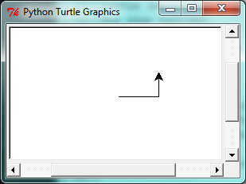
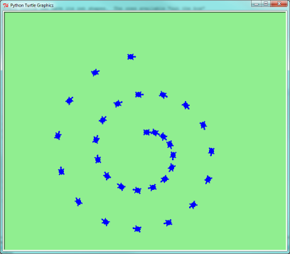

..  Copyright (C)  Jeffrey Elkner, Allen B. Downey and Chris Meyers.
    Permission is granted to copy, distribute and/or modify this document
    under the terms of the GNU Free Documentation License, Version 1.3
    or any later version published by the Free Software Foundation;
    with Invariant Sections being Foreword, Preface, and Contributor List, no
    Front-Cover Texts, and no Back-Cover Texts.  A copy of the license is
    included in the section entitled "GNU Free Documentation License".
    
.. |rle_start| image:: illustrations/rle_start.png
   
.. |rle_end| image:: illustrations/rle_end.png
 
.. |rle_open| image:: illustrations/rle_open.png
   
.. |rle_close| image:: illustrations/rle_close.png    
 
|

 
Hello, little turtles!
======================

.. index::  
    single: module
    single: function
    single: function definition
    single: definition; function
    single: turtle module

There are many *modules* in Python that provide very powerful features that we
can use in our own programs.  Some of these can send email, or fetch web pages.
The one we'll look at in this chapter allows us to create turtles and get them
to draw shapes and patterns.

The turtles are fun, but the real purpose of the chapter is to teach ourselves
a little more Python, and to develop our theme of *computational thinking*, 
or *thinking like a computer scientist*.  Most of the Python covered here 
will be explored in more depth later.

.. index:: object, invoke, method, attribute, state, canvas

Our first turtle program
------------------------

Let's write a couple of lines of Python program to create a new
turtle and start drawing a rectangle. (We'll call the variable that 
refers to our first turtle `alex`, but you can choose another 
name if you follow the naming rules from the previous chapter).

.. sourcecode:: python
   :linenos:

    import turtle                    # allows us to use turtles
    wn = turtle.Screen()             # creates a playground for turtles
    alex = turtle.Turtle()           # create a turtle, assign to alex

    alex.forward(50)                 # tell alex to move forward by 50 units
    alex.left(90)                    # turn by 90 degrees
    alex.forward(30)                 # complete the second side of a rectangle

    wn.exitonclick()                 # Wait for a mouseclick, then exit
    
When we run this program, a new window pops up:

    
Here are a couple of things you'll need to understand about this program. 
  
The first line tells Python to load a module named ``turtle``.  
That module brings us two new types that we can use: 
the ``Turtle`` type, and the ``Screen`` type.  The dot
notation ``turtle.Turtle`` means *"The Turtle type that is defined within
the turtle module"*.   (Remember that Python is case sensitive, so the 
module name, with a lowercase `t`, is different from the type Turtle.)
 
We then create and open what it calls a screen (we would perfer to call it 
a window), which we assign to variable `wn`. Every window contains 
a **canvas**, which is the area inside the window on which we can draw. 

In line 3 we create a turtle. The variable `alex` is made to refer to this turtle.   
These first three lines set us up, ready for doing some useful things.
    
In lines 5-7, we instruct the **object** alex to move, and to turn. We
do this by **invoking**, or activating, alex's **methods** --- these are 
the instructions that all turtles know how to respond to.

The last line plays a part too: the `wn` variable refers to
the window shown above. When we invoke its `exitonclick` method, it pauses
the execution of the program, and waits for the user to click the mouse in
somewhere the window.  When this click event occurs, the response is to close the 
turtle window and exit (stop execution of) the Python program.   
    
An object can have various methods --- things it can do --- and it can also have
**attributes** --- (sometimes called *properties*).  For example, each turtle has
a *color* attribute.  The method invocation  
`alex.color("red")` will make alex red, and drawing will be red too.
(Note the word `color`  is spelled the American way!) 

The colour of the turtle, the width of its pen, the position of the
turtle within the window, which way it is facing, and so on are all part of its 
current **state**.   Similarly, the window object has a background colour, and
some text in the title bar, and a size and position on the screen.  These are all
part of the state of the window object. 

Quite a number of methods exist that allow us to modify the turtle and the
window objects.  We'll just show a couple. We've only commented those
lines that are different from the previous example (and we've used a different
variable name for this turtle):
    
.. sourcecode:: python
    
    import turtle
    wn = turtle.Screen()
    wn.bgcolor("lightgreen")         # set the window background colour
    wn.title("Hello, Tess!")         # set the window title

    tess = turtle.Turtle()
    tess.color("blue")               # make tess blue
    tess.pensize(3)                  # set the width of her pen

    tess.forward(50)
    tess.left(120)
    tess.forward(50)

    wn.exitonclick()
  
When we run this program, this new window pops up, and will remain on the 
screen until we click on it.

.. image:: illustrations/tess02.png 

  
.. admonition:: Extend this program ...
    
    #. Modify this program so that before it creates the window, it prompts
       the user to enter the desired background colour. It should store the user's 
       responses in a variable, and modify the colour of the window 
       according to the user's wishes.
       (Hint: you can find a list of permitted colour names at 
       http://www.tcl.tk/man/tcl8.4/TkCmd/colors.htm.  It includes some quite unusual
       ones, like "peach puff"  and "HotPink".)    
    #. Do similar changes to allow the user, at runtime, to set tess' colour.
    #. Do the same for the width of tess' pen.  *Hint:* your dialog with the 
       user will return a string, but tess' ``pensize`` method 
       expects its argument to be an int.  So you'll need to convert 
       the string to an int before you pass it to ``pensize``.   
 
.. index:: instance
  
Instances --- a herd of turtles
-------------------------------

Just like we can have many different integers in a program, we can have many turtles.
Each of them is called an **instance**.  Each instance has its own attributes and 
methods --- so alex might draw with a thin black pen and be at some position,
while tess might be going in her own direction with a fat pink pen.  So here is
what happens when alex completes his rectangle, and tess completes her triangle:

.. sourcecode:: python
   :linenos:

    import turtle
    wn = turtle.Screen()             # Set up the window and its attributes
    wn.bgcolor("lightgreen")
    wn.title("Tess & Alex")

    tess = turtle.Turtle()           # create tess and set some attributes
    tess.color("hotpink")
    tess.pensize(5)

    alex = turtle.Turtle()           # create alex

    tess.forward(80)                 # Let tess draw an equilateral triangle
    tess.left(120)
    tess.forward(80)
    tess.left(120)
    tess.forward(80)
    tess.left(120)                   # complete the triangle

    tess.right(180)                  # turn tess around
    tess.forward(80)                 # and move her away from the origin
 
    alex.forward(50)                 # make alex draw a square
    alex.left(90)
    alex.forward(50)
    alex.left(90)
    alex.forward(50)
    alex.left(90)
    alex.forward(50)
    alex.left(90)

    wn.exitonclick()

.. image:: illustrations/tess03.png  
  
Here are some *How to think like a computer scientist* observations:

* There are 360 degrees in a full circle.  If you add up all the turns that a turtle makes,
  *no matter what steps occurred between the turns*, you can easily figure out if they
  add up to some multiple of 360.  This should convince you that alex is facing in 
  exactly the same direction as he was when he was first created. (Geometry
  conventions have 0 degrees facing East, and that is the case here too!)
* We could have left out the last turn for alex, but that would not have been
  as satisfying.  If you're asked to draw a closed shape like a 
  square or a rectangle, it is a good idea to
  complete all the turns and to leave the turtle back where it started, facing the
  same direction as it started in.  
  This makes reasoning about the program and composing chunks of code into bigger programs
  easier for us humans! 
* We did the same with tess: she drew her triangle, and turned through a full 360 degress.
  Then we turned her around and moved her aside.  Even the blank line 18 
  is a hint about how the programmer's *mental chunking* is working:
  in big terms, tess' movements were chunked as "draw the triangle"  
  (lines 12-17) and then "move away from the origin" (lines 19 and 20). 
* One of the key uses for comments is to record your mental chunking, and big ideas.   
  They're not always explicit in the code.  
* And, uh-huh, two turtles may not be enough for a herd, but you get the idea! 

.. index:: for loop
  
The **for** loop
----------------

When we drew the square, it was quite tedious.  We had to move then turn, move then turn,
etc. etc. four times.  If we were drawing a hexagon, or an octogon, or a polygon with 42 sides,
it would have been a nightmare.

So a basic building block of all programs is to be able to repeat some code, over and 
over again.  

Python's **for** loop solves this for us.   Let's say we have some friends, and
we'd like to send them each an email inviting them to our party.  We'll we don't
quite know how to send email yet, so for the moment we'll just print a message for each friend:

.. sourcecode:: python
    :linenos:

    for f in ["Joe", "Amy", "Brad", "Angelina", "Zuki", "Thandi", "Paris"]:
        invitation = "Hi " + f + ".  Please come to my party on Saturday!"
        print(invitation) 
      

When we run this, the output looks like this:

.. image:: illustrations/partyInvite.png  

* **f** in this ``for`` statement is called the **loop variable**.  
* Lines 2 and 3 are the **loop body**.  The loop body is always
  indented. The indentation determines exactly what statements are "in the loop".
* On each *iteration* or *pass* of the loop, first a check is done to see if there are 
  still more items to be processed.  If there are none left (this is called
  the **terminating condition** of the loop), the loop has finished.
  Program execution continues at the next statement after the loop body. 
* If there are items still to be processed, the loop variable is updated to refer to the
  next item in the list.  This means, in this case, that the loop body is executed 
  here 7 times, and each time `f` will refer to a different friend. 
* At the end of each execution of the body of the loop, Python returns 
  to the ``for`` statement, to see if there are more items to be handled.

.. index:: control flow, flow of execution
  
Flow of Execution of the for loop
---------------------------------

.. sidebar:: Flowchart of a **for** loop

   .. image:: illustrations/flowchart_for.png  
 
As a program executes, the interpreter always keeps track of which statement is
about to be executed.  We call this the **control flow**, of the **flow of execution** 
of the program.  When humans execute programs, they often use their finger to point 
to each statement in turn.  So you could think of control flow as "Python's moving finger". 

Control flow until now has been strictly
top to bottom, one statement at a time.  The ``for`` loop changes this. 

Control flow is often easy to visualize and understand if we draw a flowchart.
This shows the exact steps and logic of how the ``for`` statement executes.

.. index:: range function, chunking

The loop simplifies our turtle program
--------------------------------------

To draw a square we'd like to do the same thing four times --- move the turtle, and turn.
We previously used 8 lines to have alex draw the four sides of a square.  
This does exactly the same, but using just three lines:

.. sourcecode:: python

   for i in [0,1,2,3]:
       alex.forward(50)
       alex.left(90) 

* While "saving some lines of code" might be convenient, it is not the big deal here.
  What is much more important is that we've found a "repeating pattern" of statements,
  and reorganized our program to repeat the pattern.  Finding the chunks and somehow
  getting our programs arranged around those chunks is a vital  
  skill in *How to think like a computer scientist*.  
* The values [0,1,2,3] were provided to make the loop body execute 4 times. 
  We could
  have used any four values, but these are the conventional ones to use.  In fact, they are
  so popular that Python gives us special built-in ``range`` objects:

.. sourcecode:: python

    for i in range(4):
        # Executes the body with i = 0, then 1, then 2, then 3
    for x in range(10):
        # sets x to each of ... [0, 1, 2, 3, 4, 5, 6, 7, 8, 9]
   
* Computer scientists like to count from 0!
* ``range`` creates an object that can deliver a sequence of values to the ``for`` loop.
  They start at 0, and in these cases do not include the 4 or the 10. 
* Our little trick earlier to make sure that alex did the final turn to complete
  360 degrees has paid off: if we had not done that, then we would not have been
  able to use a loop for the fourth side of the square. 
  It would have become a "special case",
  different from the other sides.  When possible, we'd much prefer to make 
  our code fit a general pattern, rather than have to create a special case.
  
So to repeat something four times, a good Python programmer would do this:

.. sourcecode:: python

   for i in range(4):
       alex.forward(50)
       alex.left(90)

By now you should be able to see how to change our previous program so that
tess can also use a ``for`` loop to draw her equilateral triangle.

.. admonition:: What would happen if we made this change ...
    
   .. sourcecode:: python

      for c in ["yellow", "red", "purple", "blue"]:
          alex.color(c)
          alex.forward(50)
          alex.left(90)
 
   A variable can also be assigned a value that is a list.  So lists can also be used in
   situations other than the ``for`` loop.  The code above could be rewritten like this:
 
   .. sourcecode:: python

      clrs = ["yellow", "red", "purple", "blue"]   # make the variable refer to this list
      for c in clrs:
          alex.color(c)
          alex.forward(50)
          alex.left(90)
 
A few more turtle methods and tricks
------------------------------------

* Turtle methods can use negative angles or distances.  So ``tess.foward(-100)``
  will move tess backwards, and ``tess.left(-30)`` turns her to the right.  Additionally,
  because there are 360 degrees in a circle, turning 30 to the left will get you facing
  in the same direction as turning 330 to the right!  (The on-screen animation will differ,
  though --- you will be able to tell if tess is turning clockwise or counter-clockwise!)

  This suggests that we don't need both a left and a right turn method --- we could be 
  minimalists, and just have one method.  There is also a *backward*
  method.  (If you are very nerdy, you might enjoy saying ``alex.backward(-100)`` to
  move alex forward!)   

  Part of *thinking like a scientist* is to understand more of the structure and rich
  relationships in your field.  So revising a few basic facts about
  geometry and number lines, like we're done here is a good start 
  if we're going to play with turtles. 

* A turtle's pen can be picked up or put down.  This allows us to move a turtle
  to a different place without drawing a line.   The methods are 

  .. sourcecode:: python

     alex.penup()
     alex.forward(100)     # this moves alex, but no line is drawn
     alex.pendown()   
       
* Every turtle can have its own shape.  The ones available "out of the box"
  are ``arrow``, ``blank``, ``circle``, ``classic``, ``square``, ``triangle``, ``turtle``.

  .. sourcecode:: python

     ...            
     alex.shape("turtle")           
     ...                 

  .. image:: illustrations/alex06.png

* You can speed up or slow down the turtle's animation speed. (Animation controls how
  quickly the turtle turns and moves forward).  Speed settings can be set
  between 1 (slowest) to 10 (fastest).  But if you set the speed to 0, it has 
  a special meaning --- turn off animation and go as fast as possible. 

  .. sourcecode:: python
       
     alex.speed(10)
          
* A turtle can "stamp" its footprint onto the canvas, 
  and this will remain after the turtle has moved somewhere else. 
  Stamping works, even when the pen is up. 
    
Let's do an example that shows off some of these new features:

.. sourcecode:: python
   :linenos:
   
   import turtle
   wn = turtle.Screen()             
   wn.bgcolor("lightgreen")
   tess = turtle.Turtle()            
   tess.shape("turtle")
   tess.color("blue")

   tess.penup()                    # this is new
   size = 20
   for i in range(30):
       tess.stamp()                # leave an impression on the canvas
       size = size + 3             # increase the size on every iteration
       tess.forward(size)          # move tess along  
       tess.right(24)              # and turn her

   wn.exitonclick()
   

Be careful now: all except one of the shapes you see on the screen here
are footprints created by ``stamp``.  But the program still only has *one* turtle
instance --- can you figure out which one is the real tess?  (Hint: if you're not
sure, write a new line of code after the ``for`` loop to change tess' colour,
or to put her pen down and draw a line, or to change her shape, etc.)
   
Glossary
--------

.. glossary::

    attribute
        Some state or value that belongs to a particular object.  For example, tess has
        a color. 
        
    canvas
        A surface within a window where drawing takes place.
        
    control flow
        See *flow of execution* in the next chapter.
        
    for loop
        A statement in Python for convenient repetition of statements in the *body* of the loop.
        
    loop body
        Any number of statements nested inside a loop. The nesting is indicated
        by the fact that the statements are indented under the for loop statement.
    
    loop variable
        A variable used as part of a for loop. It is assigned a different value on
        each iteration of the loop, and is used as part of the terminating condition of the loop,
    
    instance
        An object that belongs to a class.  `tess` and `alex` are different instances of
        the class `Turtle` 
    
    method
        A function that is attached to an object.  Invoking or activating the method
        causes the object to respond in some way, e.g. ``forward`` is the method
        when we say ``tess.forward(100)``.

    invoke
        An object has methods.  We use the verb invoke to mean *activate the
        method*.  Invoking a method is done by putting parentheses after the method
        name, with some possible arguments.  So  ``wn.exitonclick()`` is an invocation
        of the ``exitonclick`` method.  
         
    module
        A file containing Python definitions and statements intended for use in other 
        Python programs. The contents of a module are made available to the other 
        program by using the *import* statement.
        
    object
        A "thing" to which a variable can refer.  This could be a screen window,
        or one of the turtles you have created.        
    
    range
        A built-in function in Python for generating sequences of integers.  It is especially
        useful when we need to write a for loop that executes a fixed number of times.
 
    terminating condition
        A condition that occurs which causes a loop to stop repeating its body.
        In the ``for`` loops we saw in this chapter, the terminating condition 
        has been when there are no more elements to assign to the loop variable.
    

Exercises
---------
#. Write a program that prints ``We like Python's turtles!`` 1000 times. 

#. Give three attributes of your cellphone object.  Give three methods of your cellphone.  

#. Write a program that uses a for loop to print
     |  ``One of the months of the year is January``
     |  ``One of the months of the year is February``
     |  ... etc
     
#. Assume you have the assignment ``xs = [12, 10, 32, 3, 66, 17, 42, 99, 20]``
    
   a. Write a loop that prints each of the numbers on a new line.
   b. Write a loop that prints each number and its square on a new line.
   c. Write a loop that adds all the numbers from the list into a variable called `total`.
      You should set the `total` variable to have the value 0 before you start adding them up,
      and print the value in ``total`` after the loop has completed.  
   d. Print the product of all the numbers in the list. 
      (product means all multiplied together)   
      
#. Use ``for`` loops to make a turtle draw these regular polygons 
   (regular means all sides the same lengths, all angles the same):  
  
   * An equilateral triangle    
   * A square    
   * A hexagon (six sides)    
   * An octagon (eight sides)
      
#. .. _drunk_student_problem:

   A drunk student makes a random turn and then takes 100 steps forward, makes another random turn, 
   takes another 100 steps, turns another random amount, etc.  A social science student records the angle of each turn
   before the next 100 steps are taken. Her experimental data is ``[160, -43, 270, -97, -43, 200, -940, 17, -86]``.  
   (Positive angles are counter-clockwise.)  Use a turtle to draw the path taken by our drunk friend.   
   
#. Enhance your program above to also tell us what the drunk student's heading is after he has finished stumbling
   around.  (Assume he begins at heading 0).   
 
#. If you were going to draw a regular polygon with 18 sides, what angle would you need to 
   turn the turtle at each corner?
   
#. At the interactive prompt, anticipate what each of the following lines will do, and 
   then record what happens. Score yourself, giving yourself one point for each one you 
   anticipate correctly::
   
        >>> import turtle
        >>> wn = turtle.Screen()
        >>> tess = turtle.Turtle()
        >>> tess.right(90)
        >>> tess.left(3600)
        >>> tess.right(-90)
        >>> tess.speed(10)
        >>> tess.left(3600)
        >>> tess.speed(0)
        >>> tess.left(3645)
        >>> tess.forward(-100)
   
#. Write a program to draw a shape like this:

   .. image:: illustrations/star.png
   
   Hints: 
   
   * Try this on a piece of paper, moving and turning your cellphone as if it was a 
     turtle.  Watch how many complete rotations your cellphone makes before you complete the 
     star.  Since each full rotation is 360 degrees, you can figure out the total 
     number of degrees that your phone was rotated through.  If you divide that by 5, because
     there are five points to the star, you'll know how many degrees to turn the turtle at each point.
   * You can hide a turtle behind its invisibility cloak if you don't want it shown.  It will still
     draw its lines if its pen is down.  The method is invoked as ``tess.hideturtle()``.  
     ``tess.showturtle()`` makes the turtle visible again.
     
#. Write a program to draw a face of a clock that looks something like this:
    
   .. image:: illustrations/tess_clock1.png
      
   
#. Create a turtle, and assign it to a variable.  When you ask for its type, what do you get?

#. What is the collective noun for turtles?  (Hint: they don't come in *herds*.)

#. What the collective noun for pythons?  Is a python a viper?  Is a python venomous?  
    
