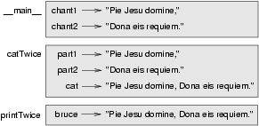

..  Copyright (C)  Jeffrey Elkner, Allen B. Downey and Chris Meyers.
    Permission is granted to copy, distribute and/or modify this document
    under the terms of the GNU Free Documentation License, Version 1.3
    or any later version published by the Free Software Foundation;
    with Invariant Sections being Foreward, Preface, and Contributor List, no
    Front-Cover Texts, and no Back-Cover Texts.  A copy of the license is
    included in the section entitled "GNU Free Documentation License".

Functions
=========

.. index::
    single: function
    single: function definition
    single: definition; function

Definitions and use
-------------------

In the context of programming, a **function** is a named sequence of statements
that performs a desired operation. This operation is specified in a **function
definition**. In Python, the syntax for a function definition is:

.. sourcecode:: python
    
    def NAME( LIST OF PARAMETERS ):
        STATEMENTS

You can make up any names you want for the functions you create, except that
you can't use a name that is a Python keyword. The list of parameters specifies
what information, if any, you have to provide in order to use the new function.

There can be any number of statements inside the function, but they have to be
indented from the ``def``. In the examples in this book, we will use the
standard indentation of four spaces. Function definitions are the first of
several **compound statements** we will see, all of which have the same
pattern:

#. A **header**, which begins with a keyword and ends with a colon.
#. A **body** consisting of one or more Python statements, each
   indented the same amount -- *4 spaces is the Python standard* -- from
   the header.

In a function definition, the keyword in the header is ``def``, which is
followed by the name of the function and a list of *parameters* enclosed in
parentheses. The parameter list may be empty, or it may contain any number of
parameters. In either case, the parentheses are required.

The first couple of functions we are going to write have no parameters, so the
syntax looks like this:

.. sourcecode:: python
    
    def new_line():
        print          # a print statement with no arguments prints a new line

This function is named ``new_line``. The empty parentheses indicate that it has
no parameters. Its body contains only a single statement, which outputs a
newline character. (That's what happens when you use a ``print`` command
without any arguments.)

Defining a new function does not make the function run. To do that we need a
**function call**. Function calls contain the name of the function being
executed followed by a list of values, called *arguments*, which are assigned
to the parameters in the function definition. Our first examples have an empty
parameter list, so the function calls do not take any arguments. Notice,
however, that the *parentheses are required in the function call*:

.. sourcecode:: python
    
    print "First Line."
    new_line()
    print "Second Line."

The output of this program is:

.. sourcecode:: python
    
    First line.
    
    Second line.

The extra space between the two lines is a result of the ``new_line()``
function call. What if we wanted more space between the lines? We could call
the same function repeatedly:

.. sourcecode:: python
    
    print "First Line."
    new_line()
    new_line()
    new_line()
    print "Second Line."

Or we could write a new function named ``three_lines`` that prints three new
lines:

.. sourcecode:: python
    
    def three_lines():
        new_line()
        new_line()
        new_line()
    
    print "First Line."
    three_lines()
    print "Second Line."

This function contains three statements, all of which are indented by four
spaces. Since the next statement is not indented, Python knows that it is not
part of the function.

You should notice a few things about this program:

* You can call the same procedure repeatedly. In fact, it is quite common and
  useful to do so.
* You can have one function call another function; in this case ``three_lines`` 
  calls ``new_line``.

So far, it may not be clear why it is worth the trouble to create all of these
new functions. Actually, there are a lot of reasons, but this example
demonstrates two:

#. Creating a new function gives you an opportunity to name a group of
   statements. Functions can simplify a program by hiding a complex computation 
   behind a single command and by using English words in place of arcane code.
#. Creating a new function can make a program smaller by eliminating repetitive 
   code. For example, a short way to print nine consecutive new lines is to
   call ``three_lines`` three times.

Pulling together the code fragments from the previous section into a script
named ``tryme1.py``, the whole program looks like this:

.. sourcecode:: python
    
    def new_line():
        print
    
    def three_lines():
        new_line()
        new_line()
        new_line()
    
    print "First Line."
    three_lines()
    print "Second Line."

This program contains two function definitions: ``new_line`` and
``three_lines``. Function definitions get executed just like other statements,
but the effect is to create the new function. The statements inside the
function do not get executed until the function is called, and the function
definition generates no output.

As you might expect, you have to create a function before you can execute it.
In other words, the function definition has to be executed before the first
time it is called.

.. index:: flow of execution

Flow of execution
-----------------

In order to ensure that a function is defined before its first use, you have to
know the order in which statements are executed, which is called the **flow of
execution**.

Execution always begins at the first statement of the program.  Statements are
executed one at a time, in order from top to bottom.

Function definitions do not alter the flow of execution of the program, but
remember that statements inside the function are not executed until the
function is called. Although it is not common, you can define one function
inside another. In this case, the inner definition isn't executed until the
outer function is called.

Function calls are like a detour in the flow of execution. Instead of going to
the next statement, the flow jumps to the first line of the called function,
executes all the statements there, and then comes back to pick up where it left
off.

That sounds simple enough, until you remember that one function can call
another. While in the middle of one function, the program might have to execute
the statements in another function. But while executing that new function, the
program might have to execute yet another function!

Fortunately, Python is adept at keeping track of where it is, so each time a
function completes, the program picks up where it left off in the function that
called it. When it gets to the end of the program, it terminates.

What's the moral of this sordid tale? When you read a program, don't read from
top to bottom. Instead, follow the flow of execution.

.. index::
    single: parameter
    single: function; parameter
    single: argument
    single: function; argument
    single: import
    single: import statement

Parameters, arguments, and the ``import`` statement
---------------------------------------------------

Most functions require arguments, values that control how the function does its
job. For example, if you want to find the absolute value of a number, you have
to indicate what the number is. Python has a built-in function for computing
the absolute value:

.. sourcecode:: python
    
    >>> abs(5)
    5
    >>> abs(-5)
    5

In this example, the arguments to the ``abs`` function are 5 and -5.

Some functions take more than one argument. For example the built-in function
``pow`` takes two arguments, the base and the exponent. Inside the function,
the values that are passed get assigned to variables called **parameters**.

.. sourcecode:: python
    
    >>> pow(2, 3)
    8
    >>> pow(7, 4)
    2401

Another built-in function that takes more than one argument is ``max``.

.. sourcecode:: python
    
    >>> max(7, 11)
    11
    >>> max(4, 1, 17, 2, 12)
    17
    >>> max(3 * 11, 5**3, 512 - 9, 1024**0)
    503

``max`` can be sent any number of arguments, separated by commas, and will
return the maximum value sent. The arguments can be either simple values or
expressions. In the last example, 503 is returned, since it is larger than 33,
125, and 1.

Here is an example of a user-defined function that has a parameter:

.. sourcecode:: python
    
    def print_twice(param):
        print param, param 

This function takes a single **argument** and assigns it to the parameter named
``param``. The value of the parameter (at this point we have no idea what it
will be) is printed twice, followed by a newline.  The name ``param`` was
chosen to reinforce the idea that it is a *parameter*, but in general, you will
want to choose a name for your parameters that describes their use in the
function.

The interactive Python shell provides us with a convenient way to test our
functions. We can use the **import statement** to bring the functions we have
defined in a script into the interpreter session. To see how this works, assume
the ``print_twice`` function is defined in a script named ``chap03.py``. We can
now test it interactively by *importing* it into our Python shell session:

.. sourcecode:: python
    
    >>> from chap03 import *
    >>> print_twice('Spam')
    Spam Spam
    >>> print_twice(5)
    5 5
    >>> print_twice(3.14159)
    3.14159 3.14159

In a function call, the value of the argument is assigned to the corresponding
parameter in the function definition. In effect, it is if ``param = 'Spam'`` is
executed when ``print_twice('Spam')`` is called, ``param = 5`` in
``print_twice(5)``, and ``param = 3.14159`` in ``print_twice(3.14159)``.

Any type of argument that can be printed can be sent to ``print_twice`` In the
first function call, the argument is a string. In the second, it's an integer.
In the third, it's a ``float``.

As with built-in functions, we can use an expression as an argument for
``print_twice``:

.. sourcecode:: python
    
    >>> print_twice('Spam' * 4)
    SpamSpamSpamSpam SpamSpamSpamSpam

``'Spam'*4`` is first evaluated to ``'SpamSpamSpamSpam'``, which is then
passed as an argument to ``print_twice``.

.. index::
    single: composition
    single: function; composition

Composition
-----------

Just as with mathematical functions, Python functions can be **composed**,
meaning that you use the result of one function as the input to another.

.. sourcecode:: python
    
    >>> print_twice(abs(-7))
    7 7
    >>> print_twice(max(3, 1, abs(-11), 7))
    11 11

In the first example, ``abs(-7)`` evaluates to 7, which then becomes the
argument to ``print_twice``. In the second example we have two levels of
composition, since ``abs(-11)`` is first evaluated to 11 before ``max(3,
1, 11, 7)`` is evaluated to 11 and ``print_twice(11)`` then displays the
result.

We can also use a variable as an argument:

.. sourcecode:: python
    
    >>> sval = 'Eric, the half a bee.'
    >>> print_twice(sval)
    Eric, the half a bee. Eric, the half a bee.

Notice something very important here. The name of the variable we pass as an
argument (``sval``) has nothing to do with the name of the parameter
(``param``).  Again, it is as if  ``param = sval`` is executed when
``print_twice(sval)`` is called. It doesn't matter what the value was named in
the caller, in ``print_twice`` it's name is ``param``.

.. index::
    single: local variable
    single: variable; local

Variables and parameters are local
----------------------------------

When you create a **local variable** inside a function, it only exists inside
the function, and you cannot use it outside. For example:

.. sourcecode:: python
    
    def cat_twice(part1, part2):
        cat = part1 + part2
        print_twice(cat)

This function takes two arguments, concatenates them, and then prints the
result twice. We can call the function with two strings:

.. sourcecode:: python
    
    >>> chant1 = "Pie Jesu domine, "
    >>> chant2 = "Dona eis requiem."
    >>> cat_twice(chant1, chant2)
    Pie Jesu domine, Dona eis requiem. Pie Jesu domine, Dona eis requiem.

When ``cat_twice`` terminates, the variable ``cat`` is destroyed. If we
try to print it, we get an error:

.. sourcecode:: python
    
    >>> print cat
    NameError: name 'cat' is not defined

Parameters are also local. For example, outside the function ``print_twice``,
there is no such thing as ``param``. If you try to use it, Python will
complain.

.. index::
    single: stack diagram
    single: function frame
    single: frame
    single: traceback
    single: stack trace

Stack diagrams
--------------

To keep track of which variables can be used where, it is sometimes useful to
draw a **stack diagram**. Like state diagrams, stack diagrams show the value of
each variable, but they also show the function to which each variable belongs.

Each function is represented by a **frame**. A frame is a box with the name of
a function beside it and the parameters and variables of the function inside
it. The stack diagram for the previous example looks like this:

The order of the stack shows the flow of execution. ``print_twice`` was called
by ``cat_twice``, and ``cat_twice`` was called by ``__main__``, which is a
special name for the topmost function. When you create a variable outside of
any function, it belongs to ``__main__``.

Each parameter refers to the same value as its corresponding argument.  So,
``part1`` has the same value as ``chant1``, ``part2`` has the same value as
``chant2``, and ``param`` has the same value as ``cat``.

If an error occurs during a function call, Python prints the name of the
function, and the name of the function that called it, and the name of the
function that called *that*, all the way back to the top most function.

To see how this works, create a Python script named ``tryme2.py`` that looks
like this:

.. sourcecode:: python
    
    def print_twice(param):
        print param, param 
        print cat
    
    def cat_twice(part1, part2):
        cat = part1 + part2
        print_twice(cat)
    
    chant1 = "Pie Jesu domine, "
    chant2 = "Dona eis requim."
    cat_twice(chant1, chant2)

We've added the statement, ``print cat`` inside the ``print_twice`` function,
but ``cat`` is not defined there. Running this script will produce an error
message like this:

.. sourcecode:: python
    
    Traceback (innermost last):
      File "tryme2.py", line 11, in <module>
        cat_twice(chant1, chant2)
      File "tryme2.py", line 7, in cat_twice
        print_twice(cat)
      File "tryme2.py", line 3, in print_twice
        print cat
    NameError: global name 'cat' is not defined

This list of functions is called a **traceback**. It tells you what program
file the error occurred in, and what line, and what functions were executing at
the time. It also shows the line of code that caused the error.

Notice the similarity between the traceback and the stack diagram.  It's not a
coincidence. In fact, another common name for a traceback is a *stack trace*.

Glossary
--------

.. glossary::

    argument
        A value provided to a function when the function is called. This value
        is assigned to the corresponding parameter in the function.

    body
        The second part of a compound statement. The body consists of a
        sequence of statements all indented the same amount from the beginning
        of the header.  The standard amount of indentation used within the
        Python community is 4 spaces.

    compound statement
        A statement that consists of two parts:

        #. header - which begins with a keyword determining the statement
           type, and ends with a colon.
        #. body - containing one or more statements indented the same amount
           from the header.

        The syntax of a compound statement looks like this:

        .. sourcecode:: python
        
            keyword expression:
                statement
                statement ...

    flow of execution
        The order in which statements are executed during a program run.

    frame
        A box in a stack diagram that represents a function call. It contains
        the local variables and parameters of the function.

    function
        A named sequence of statements that performs some useful operation.
        Functions may or may not take parameters and may or may not produce a
        result.

    function call
        A statement that executes a function. It consists of the name of the
        function followed by a list of arguments enclosed in parentheses.

    function composition
        Using the output from one function call as the input to another.

    function definition
        A statement that creates a new function, specifying its name,
        parameters, and the statements it executes.

    header
        The first part of a compound statement. Headers begin with a keyword and
        end with a colon (:)

    import
        A statement which permits functions and variables defined in a Python
        script to be brought into the environment of another script or a
        running Python shell.For example, assume the following is in a script
        named ``tryme.py``:

        .. sourcecode:: python
        
            def print_thrice(thing):
                print thing, thing, thing
        
            n = 42
            s = "And now for something completely different..."

        Now begin a python shell from within the same directory where
        ``tryme.py`` is located::

            $ ls
            tryme.py  
            $ python
            >>>

        Three names are defined in ``tryme.py``: ``print_thrice``, ``n``, and
        ``s``.  If we try to access any of these in the shell without first
        importing, we get an error:

        .. sourcecode:: python

            >>> n
            Traceback (most recent call last):
              File "<stdin>", line 1, in <module> 
            NameError: name 'n' is not defined
            >>> print_thrice("ouch!")
            Traceback (most recent call last):
              File "<stdin>", line 1, in <module>
            NameError: name 'print_thrice' is not defined

        If we import everything from ``tryme.py``, however, we can use
        everything defined in it:

        .. sourcecode:: python
        
            >>> from tryme import *
            >>> n
            42
            >>> s
            'And now for something completely different...'
            >>> print_thrice("Yipee!")
            Yipee! Yipee! Yipee!
            >>>

        Note that you do not include the ``.py`` from the script name in the
        import statement.

    local variable
        A variable defined inside a function. A local variable can only be used
        inside its function.

    parameter
        A name used inside a function to refer to the value passed as an
        argument.

    stack diagram
        A graphical representation of a stack of functions, their variables,
        and the values to which they refer.

    traceback
        A list of the functions that are executing, printed when a runtime
        error occurs. A traceback is also commonly refered to as a
        *stack trace*, since it lists the functions in the order in which they
        are stored in the
        `runtime stack <http://en.wikipedia.org/wiki/Runtime_stack>`__.

Exercises
---------

#. Using a text editor, create a Python script named ``tryme3.py`` .  Write a
   function in this file called ``nine_lines`` that uses ``three_lines`` to
   print nine blank lines. Now add a function named ``clear_screen`` that
   prints out twenty-five blank lines. The last line of your program should be
   a *call* to ``clear_screen``.
#. Move the last line of ``tryme3.py`` to the top of the program, so the
   *function call* to ``clear_screen`` appears before the *function
   definition*.   Run the program and record what error message you get.  Can
   you state a rule about *function definitions* and *function calls* which
   describes where they can appear relative to each other in a program?
#. Starting with a working version of ``tryme3.py`` , move the definition of
   ``new_line`` after the definition of ``three_lines``. Record what happens
   when you run this program. Now move the definition of ``new_line`` below a
   call to ``three_lines()``. Explain how this is an example of the rule you
   stated in the previous exercise.
#. Fill in the *body* of the *function definition* for ``cat_n_times`` so that
   it will print the string, s, n times:

   .. sourcecode:: python
    
       def cat_n_times(s, n):
           <fill in your code here> 

   Save this function in a script named ``import_test.py``. Now at a unix
   prompt, make sure you are in the same directory where the
   ``import_test.py`` is located ( ``ls`` should show ``import_test.py``).
   Start a Python shell and try the following:

   .. sourcecode:: python
    
        >>> from import_test import *
        >>> cat_n_times('Spam', 7)
        SpamSpamSpamSpamSpamSpamSpam

   If all is well, your session should work the same as this one.  Experiment
   with other calls to ``cat_n_times`` until you feel comfortable with how it
   works.
