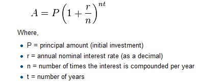

..  Copyright (C)  Peter Wentworth, Jeffrey Elkner, Allen B. Downey and Chris Meyers.
    Permission is granted to copy, distribute and/or modify this document
    under the terms of the GNU Free Documentation License, Version 1.3
    or any later version published by the Free Software Foundation;
    with Invariant Sections being Foreword, Preface, and Contributor List, no
    Front-Cover Texts, and no Back-Cover Texts.  A copy of the license is
    included in the section entitled "GNU Free Documentation License".

    
.. |rle_start| image:: illustrations/rle_start.png
   
.. |rle_end| image:: illustrations/rle_end.png
 
.. |rle_open| image:: illustrations/rle_open.png
   
.. |rle_close| image:: illustrations/rle_close.png    
 
|
     

Functions
=========

.. index::
    single: function
    single: function definition
    single: definition; function

Functions
---------
      
     
In Python, a **function** is a named sequence of statements
that belong together.  Their primary purpose is to help us
organize programs into chunks that match how we think about
the problem. 
 
The syntax for a **function definition** is:

.. sourcecode:: python
    
    def NAME( PARAMETERS ):
        STATEMENTS

You can make up any names you want for the functions you create, except that
you can't use a name that is a Python keyword, and the names must follow the rules
for legal identifiers. The parameters specifies
what information, if any, you have to provide in order to use the new function.

There can be any number of statements inside the function, but they have to be
indented from the ``def``. In the examples in this book, we will use the
standard indentation of four spaces. Function definitions are the second of
several **compound statements** we will see, all of which have the same
pattern:

#. A header line which begins with a keyword and ends with a colon.
#. A **body** consisting of one or more Python statements, each
   indented the same amount -- *4 spaces is the Python standard* -- from
   the header line.

We've already seen the `for` loop which follows this pattern.   
   
In a function definition, the keyword in the header is ``def``, which is
followed by the name of the function and some *parameters* enclosed in
parentheses. The parameter list may be empty, or it may contain any number of
parameters separated from one another by commas. In either case, the parentheses are required.

Suppose we're working with turtles, and a common operation we need is to draw
squares.   "Draw a square* is an *abstraction*, or a mental
chunk, of a number of smaller steps.  So let's write a function to capture the pattern
of this "building block": 

.. sourcecode:: python
   :linenos:
    
    import turtle 

    def draw_square(t, sz):
        """Make turtle t draw a square of sz."""    
        
        for i in range(4):
            t.forward(sz)             
            t.left(90)
      
      
    wn = turtle.Screen()              # Set up the window and its attributes
    wn.bgcolor("lightgreen")
    wn.title("Alex meets a function")

    alex = turtle.Turtle()            # create alex
    draw_square(alex, 50)             # Call the function to draw the square
    wn.exitonclick()

        
.. image:: illustrations/alex04.png 

        
This function is named ``draw_square``.  It has two parameters --- one to tell 
the function which turtle to move around, and the other to tell it the size
of the square we want drawn.   Make sure you know where the body of the function
ends --- it depends on the indentation, and the blank lines don't count for
this purpose!   

.. admonition::  docstrings 

    If the first thing after the function header is a string (some tools insist that
    it must be a triple-quoted string), it is called a **docstring** 
    and gets special treatment in Python and in some of the programming tools.  
    For example, when using PyScripter, when you type a function name it will pop up a 
    tooltip showing the parameters of the function, and the text from the docstring.

    Another way to retrieve this information is to use the interactive
    interpreter, and enter the expression ``<function_name>.__doc__``, which will retrieve the
    docstring for the function.  So the string you write as documentation at the start of a function is
    retrievable by python tools *at runtime*.  This is different from comments in your code,
    which are completely eliminated when the program is parsed. 
    
    By convention, Python programmers use docstrings for the key documentation of
    their functions.    

Defining a new function does not make the function run. To do that we need a
**function call**. We've already seen how to call some built-in functions like
**print**, **range** and **int**. Function calls contain the name of the function being
executed followed by a list of values, called *arguments*, which are assigned
to the parameters in the function definition.  So in the second last line of
the program, we call the function, and pass alex as the turtle to be manipulated,
and 50 as the size of the square we want. 

Once we've defined a function, we can call it as often as we like, and its 
statements will be executed each time we call it.  And we could use it to get
any of our turtles to draw a square.   In the next example, we've changed the ``draw_square``
function a little, and we get tess to draw 15 squares, with some variations.

.. sourcecode:: python

    import turtle

    def draw_multicolour_square(t, sz):  
        """Make turtle t draw a multi-colour square of sz."""
        for i in ['red','purple','hotpink','blue']:
            t.color(i)
            t.forward(sz)
            t.left(90)
 
    wn = turtle.Screen()             # Set up the window and its attributes
    wn.bgcolor("lightgreen")

    tess = turtle.Turtle()           # create tess and set some attributes
    tess.pensize(3)

    size = 20                        # size of the smallest square
    for i in range(15):
        draw_multicolour_square(tess, size)
        size = size + 10             # increase the size for next time
        tess.forward(10)             # move tess along a little
        tess.right(18)               # and give her some extra turn

    wn.exitonclick()

.. image:: illustrations/tess05.png 

Functions can call other functions
----------------------------------

Let's assume now we want a function to draw a rectangle.  We need to be able to call
the function with different arguments for width and height.  And, unlike the case of the
square, we cannot repeat the same thing 4 times, because the four sides are not equal.

So we eventually come up with this rather nice code that can draw a rectangle.

.. sourcecode:: python

    def draw_rectangle(t, w, h):
        """Get turtle t to draw a rectangle of width w and height h."""
        for i in range(2):
            t.forward(w)             
            t.left(90)
            t.forward(h)
            t.left(90)
            
The parameter names are deliberately chosen as single letters to ensure they're not misunderstood.
In real programs, once you've had more experience, we will insist on better variable names than this.
But the point is that the program doesn't "understand" that you're drawing a rectangle, or that the
parameters represent the width and the height.  Concepts like rectangle, width, and height are 
the meaning we humans have, not concepts that the program or the computer understands.    

*Thinking like a scientist* involves looking for patterns and 
relationships.  In the code above, we've done that to some extent.  We did not just draw four sides.
Instead, we spotted that we could draw the rectangle as two halves, and used a loop to
repeat that pattern twice.

But now we might spot that a square is a special kind of rectangle.
We already have a function that draws a rectangle, so we can use that to draw
our square. 

.. sourcecode:: python

    def draw_square(tx, sz):        # a new version of draw_square
        draw_rectangle(tx, sz, sz)

There are some points worth noting here:

* Functions can call other functions.
* Rewriting `draw_square` like this captures the relationship
  that we've spotted.  
* A caller of this function might say `draw_square(tess, 50)`.  The parameters
  of this function, ``tx`` and ``sz``, are assigned the values of the tess object, and
  the int 50 respectively.
* In the body of the function they are just like any other variable. 
* When the call is made to `draw_rectangle`, the values in variables `tx` and `sz`
  are fetched first, then the call happens.  So as we enter the top of
  function `draw_rectangle`, its variable `t` is assigned the tess object, and `w` and
  `h` in that function are both given the value 50.

So far, it may not be clear why it is worth the trouble to create all of these
new functions. Actually, there are a lot of reasons, but this example
demonstrates two:

#. Creating a new function gives you an opportunity to name a group of
   statements. Functions can simplify a program by hiding a complex computation 
   behind a single command. The function (including its name) can capture your 
   mental chunking, or *abstraction*, of the problem.  
#. Creating a new function can make a program smaller by eliminating repetitive 
   code.  

As you might expect, you have to create a function before you can execute it.
In other words, the function definition has to be executed before the first
time it is called.

.. index:: flow of execution

Flow of execution
-----------------

In order to ensure that a function is defined before its first use, you have to
know the order in which statements are executed, which is called the **flow of
execution**.   We've already talked about this a little in the previous chapter.

Execution always begins at the first statement of the program.  Statements are
executed one at a time, in order from top to bottom.

Function definitions do not alter the flow of execution of the program, but
remember that statements inside the function are not executed until the
function is called. Although it is not common, you can define one function
inside another. In this case, the inner definition isn't executed until the
outer function is called.

Function calls are like a detour in the flow of execution. Instead of going to
the next statement, the flow jumps to the first line of the called function,
executes all the statements there, and then comes back to pick up where it left
off.

That sounds simple enough, until you remember that one function can call
another. While in the middle of one function, the program might have to execute
the statements in another function. But while executing that new function, the
program might have to execute yet another function!

Fortunately, Python is adept at keeping track of where it is, so each time a
function completes, the program picks up where it left off in the function that
called it. When it gets to the end of the program, it terminates.

What's the moral of this sordid tale? When you read a program, don't read from
top to bottom. Instead, follow the flow of execution.

.. index:: PyScripter; single stepping

.. admonition:: Watch the flow of execution in action

   In PyScripter, you can watch the flow of execution by "single-stepping" through
   any program.  PyScripter will highlight each line of code just before it is about to
   be executed.  
   
   PyScripter also lets you hover the mouse over any
   variable in the program, and it will pop up the current value of that variable. 
   So this makes it easy to inspect the "state snapshot" of the program --- the
   current values that are assigned to the program's variables.
   
   This is a powerful mechanism for building a deep and thorough understanding of
   what is happening at each step of the way.  Learn to use the single-stepping 
   feature well, and be mentally proactive:  as you work through the code,
   challenge yourself before each step: *"What changes will this line make to 
   any variables in the program?"* and *"Where will flow of execution go next?"* 

   Let us go back and see how this works with the program above that draws 15 
   multicolour squares.  First, we're going to add one line of magic below
   the import statement --- not strictly necessary, but it will make our lives
   much simpler, because it prevents stepping into the module containing 
   the turtle code.   
   
   .. sourcecode:: python

       import turtle
       __import__('turtle').__traceable__ = False

   Now we're ready to begin.  Put the mouse cursor on the line of the program
   where we create the turtle screen, and press the *F4* key.  This will run the Python
   program up to, but not including, the line where you have the cursor.   Your program 
   will "break" now, and provide a highlight on the next line to be executed, something like this:

   .. image:: illustrations/breakpoint.png
 
   At this point you can press the *F7* key (*step into*) repeatedly to single step through
   the code.  Observe as you execute lines 10, 11, 12, ... how the turtle window gets 
   created, how its canvas colour is changed, how the title
   gets changed, how the turtle is created on the canvas, and then how the flow of execution gets into the loop, and from there into the function, 
   and into the function's loop, and then repeatedly through the body of that loop.
   
   While you do this, also hover your mouse over some of the variables in the program, and confirm that
   their values match your conceptual model of what is happening.
   
   After a few loops, when you're about to execute line 20 and you're starting to get bored, you can use the key *F8*
   to "step over" the function you are calling.  This executes all the statements in the function, but without
   having to step through each one.   You always have the choice to either 
   "go for the detail", or to "take the high-level view" and execute the function as a single chunk.
   
   There are some other options, including one that allow you to *resume* execution without further stepping.
   Find them under the *Run* menu of PyScripter.

.. index::
    single: parameter
    single: function; parameter
    single: argument
    single: function; argument
    single: import statement
    single: statement; import
    single: composition
    single: function; composition
    
Functions that return values
----------------------------

Most functions require arguments, values that control how the function does its
job. For example, if you want to find the absolute value of a number, you have
to indicate what the number is. Python has a built-in function for computing
the absolute value:

.. sourcecode:: python
    
    >>> abs(5)
    5
    >>> abs(-5)
    5

In this example, the arguments to the ``abs`` function are 5 and -5.

       
Some functions take more than one argument. For example the built-in function
``pow`` takes two arguments, the base and the exponent. Inside the function,
the values that are passed get assigned to variables called **parameters**.

.. sourcecode:: python
    
    >>> pow(2, 3)
    8
    >>> pow(7, 4)
    2401

Another built-in function that takes more than one argument is ``max``.

.. sourcecode:: python
    
    >>> max(7, 11)
    11
    >>> max(4, 1, 17, 2, 12)
    17
    >>> max(3 * 11, 5**3, 512 - 9, 1024**0)
    503

``max`` can be sent any number of arguments, separated by commas, and will
return the maximum value sent. The arguments can be either simple values or
expressions. In the last example, 503 is returned, since it is larger than 33,
125, and 1.

Furthermore, functions like ``range``, ``int``, ``abs`` all return values that
can be used to build more complex expressions.  

So an important difference between these functions and one like ``draw_square`` is that
``draw_square`` was not executed because we wanted it to compute a value --- on the contrary,
we wrote ``draw_square`` because we wanted it to execute a sequence of steps that caused
the turtle to draw.  

Functions that return values are called **fruitful functions** in this course.
In many other languages, a chunk that doesn't return a value is called a **procedure**,
but we will stick here with the Python way of also calling it a function, or if we want
to stress it, a *non-fruitful* function.  (Would the term *barren function* be easier?)  

How do we write our own fruitful function?  In the exercises at the end of chapter 2 we saw
the standard formula for compound interest, which we'll now write as a fruitful function:   

.. sourcecode:: python

   def final_amt(p, r, n, t):
       """
         Apply the compound interest formula to p
          to produce the final amount.
       """
       
       a = p * (1 + r/n) ** (n*t)
       return a           # This is new, and makes the function fruitful.
                     
   # now that we have the function above, let us call it.  
   toInvest = float(input("How much do you want to invest?"))
   fnl = final_amt(toInvest, 0.08, 12, 5)
   print("At the end of the period you'll have R", fnl)

* The **return** statement is followed an expression which is evaluated.  Its
  result is returned to the caller as the "fruit" of calling this function.
* We prompted the user for the principal amount.  The type of ``toInvest`` is a string, but
  we need a number before we can work with it.  Because it is money, and could have decimal places,
  we've used the ``float`` type converter function to parse the string and return a float.
* Notice how we entered the arguments for 8% interest, compounded 12 times per year, for 5 years.
* When we run this, we get the output 

      *At the end of the period you'll have R 14898.457083*
 
  This is a bit messy with all these decimal places, but remember that
  Python doesn't understand that you're working with money: it just does the calculation to
  the best of its ability, without rounding.  Later we'll show you how to format the string that
  is printed in such a way that it does get nicely rounded to two decimal places before printing. 
* The line `toInvest = float(input("How much do you want to invest?"))` 
  also shows yet another example
  of *composition* --- we can call a function like `float`, and its arguments 
  can be the results of other function calls (like `input`) that we've called along the way.
  
Notice something else very important here. The name of the variable we pass as an
argument --- `toInvest` --- has nothing to do with the name of the parameter
--- `p`.  It is as if  `p = toInvest` is executed when `final_amt` is called. 
It doesn't matter what the value was named in 
the caller, in `final_amt` it's name is `p`.  
         
These short variable names are getting quite tricky, so perhaps you'd prefer one of these
versions instead:       

.. sourcecode:: python
 
   def final_amt_v2(principalAmount, nominalPercentageRate, numTimesPerYear, years):
       a = principalAmount * (1 + nominalPercentageRate/numTimesPerYear) ** (numTimesPerYear*years)
       return a
       
   def final_amt_v3(amt, rate, compounded, years):
       a = amt * (1 + rate/compounded) ** (componded*years)
       return a                  

They all do the same thing.   Use your judgement to write code that can be best 
understood by other humans!  
Short variable names are more economical and sometimes make 
code easier to read: 
E = mc\ :sup:`2` would not be nearly so memorable if Einstein had
used longer variable names!  If you do prefer short names, 
make sure you also have some comments to enlighten the reader 
about what the variables are used for.
  

.. index::
    single: local variable
    single: variable; local
    single: lifetime
    
Variables and parameters are local
----------------------------------

When you create a **local variable** inside a function, it only exists inside
the function, and you cannot use it outside. For example, consider again this function:

.. sourcecode:: python

   def final_amt(p, r, n, t):
       a = p * (1 + r/n) ** (n*t)
       return a           
 
If we try to use `a`, outside the function, we'll get an error:

.. sourcecode:: python
    
    >>> a
    NameError: name 'a' is not defined
    
 
The variable `a` is local to `final_amt`, and is not visible
outside the function.

Additionally, ``a`` only exists while the function is being executed --- 
we call this its **lifetime**. 
When the execution of the function terminates, 
the local variables  are destroyed. 

Parameters are also local, and act like local variables. 
For example, the lifetimes of `p`, `r`, `n`, `t` begin when `final_amt` is called, 
and the lifetime ends when the function completes its execution.   

So it is not possible for a function to set some local variable to a 
value, complete its execution, and then when it is called again next
time, recover the local variable.  Each call of the function creates
new local variables, and their lifetimes expire when the function returns
to the caller. 
    
.. index:: refactoring code, chunking    

Turtles Revisited
-----------------

Now that we have fruitful functions, we can focus our attention on 
reorganizing our code so that it fits more nicely into our mental chunks.  
This process of rearrangement is called **refactoring** the code.  
 
Two things we're always going to want to do when working with turtles
is to create the window for the turtle, and to create one or more turtles.
We could write some functions to make these tasks easier in future:

.. sourcecode:: python

   def make_window(colr, ttle):   
       """
         Set up the window with the given background colour and title. 
         Returns the new window.
       """
       w = turtle.Screen()             
       w.bgcolor(colr)
       w.title(ttle)
       return w
       
       
   def make_turtle(colr, sz):      
       """
         Set up a turtle with the given colour and pensize.
         Returns the new turtle.
       """
       t = turtle.Turtle()
       t.color(colr)
       t.pensize(sz)
       return t

       
   wn = make_window("lightgreen", "Tess and Alex dancing")
   tess = make_turtle("hotpink", 5)
   alex = make_turtle("black", 1)
   dave = make_turtle("yellow", 2)  
   
The trick about refactoring code is to see which things you are likely to want to change
each time you call the function: these should become the parameters, or changeable bits,
of the functions you write.

Glossary
--------

.. glossary::

    argument
        A value provided to a function when the function is called. This value
        is assigned to the corresponding parameter in the function.  The argument
        can be the result of an expression which may involve operators, 
        operands and calls to other fruitful functions.

    body
        The second part of a compound statement. The body consists of a
        sequence of statements all indented the same amount from the beginning
        of the header.  The standard amount of indentation used within the
        Python community is 4 spaces.

    compound statement
        A statement that consists of two parts:

        #. header - which begins with a keyword determining the statement
           type, and ends with a colon.
        #. body - containing one or more statements indented the same amount
           from the header.

        The syntax of a compound statement looks like this:

        .. sourcecode:: python
        
            keyword expression:
                statement
                statement ...
                                               
    docstring
        If the first thing in a function body is a string (or, we'll see later, in other situations
        too) that is attached to the function as its ``__doc__`` attribute,
        and can be used by tools like PyScripter.

    flow of execution
        The order in which statements are executed during a program run.

    frame
        A box in a stack diagram that represents a function call. It contains
        the local variables and parameters of the function.

    function
        A named sequence of statements that performs some useful operation.
        Functions may or may not take parameters and may or may not produce a
        result.

    function call
        A statement that executes a function. It consists of the name of the
        function followed by a list of arguments enclosed in parentheses.

    function composition
        Using the output from one function call as the input to another.

    function definition
        A statement that creates a new function, specifying its name,
        parameters, and the statements it executes.
        
    fruitful function
        A function that returns a value when it is called.

    header line
        The first part of a compound statement. A header line begins with a keyword and
        ends with a colon (:)

    import statement
        A statement which permits functions and variables defined in another Python
        module to be brought into the environment of another script.  To use the 
        features of the turtle, we need to first import the turtle module.
        
    lifetime
        Variables and objects have lifetimes --- they are created at some point during
        program execution, and will be destroyed at some time. 
        
    local variable
        A variable defined inside a function. A local variable can only be used
        inside its function.  Parameters of a function are also a special kind
        of local variable.

    parameter
        A name used inside a function to refer to the value which was passed 
        to it as an argument.
           
    refactor
        A fancy word to describe reorganizing your program code, usually to make 
        it more understandable.  Typically, we have a program that is already working,
        then we go back to "tidy it up".  It often involves choosing better variable
        names, or spotting repeated patterns and moving that code into a function.    
        
    stack diagram
        A graphical representation of a stack of functions, their variables,
        and the values to which they refer.

    traceback
        A list of the functions that are executing, printed when a runtime
        error occurs. A traceback is also commonly refered to as a
        *stack trace*, since it lists the functions in the order in which they
        are stored in the
        `runtime stack <http://en.wikipedia.org/wiki/Runtime_stack>`__.

Exercises
---------

#.  Write a non-fruitful function to draw a square.  Use it in a program to draw the image shown below. 
    Assume each side is 20 units.
    (Hint: notice that the turtle has already moved away from the ending point of the last 
    square when the program ends.)
    
    .. image:: illustrations/five_squares.png
    
#.  Write a program to draw this. Assume the innermost square is 20 units per side,
    and each successive square is 20 units bigger, per side, than the one inside it.   
    
    .. image:: illustrations/nested_squares.png

#.  Write a non-fruitful function `draw_poly(t, n, sz)` which makes a turtle 
    draw a regular polygon. 
    When called with `draw_poly(tess, 8, 50)`, it will draw a shape like this:
    
    .. image:: illustrations/regularpolygon.png

#. Draw this pretty pattern.

   .. image:: illustrations/tess08.png    
   
#.  The two spirals in this picture differ only by the turn angle.  Draw both.

    .. image:: illustrations/tess_spirals.png
       :height: 240
       
#.  Write a non-fruitful function `draw_equitriangle(t, sz)` which calls `draw_poly` from the 
    previous question to have its turtle draw a equilateral triangle. 
    
#.  Write a fruitful function `sum_to(n)` that returns the sum of all integer numbers up to and 
    including `n`.   So `sum_to(10)` would be `1+2+3...+10` which would return the value 55.
    
#.  Write a function `area_of_circle(r)` which returns the area of a circle of radius `r`.

#.  Write a non-fruitful function to draw a star, where the length of each side is 100 units.
    (Hint: You should turn the turtle by 144 degrees at each point.)  
    
     .. image:: illustrations/star.png
     
#.  Extend your program above.  Draw five stars, but between each, pick up the pen, 
    move forward by 350 units, turn right by 144, put the pen down, and draw the next star.
    You'll get something like this:
    
    .. image:: illustrations/five_stars.png
    
    What would it look like if you didn't pick up the pen?

    
