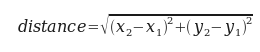

..  Copyright (C)  Jeffrey Elkner, Allen B. Downey and Chris Meyers.
    Permission is granted to copy, distribute and/or modify this document
    under the terms of the GNU Free Documentation License, Version 1.3
    or any later version published by the Free Software Foundation;
    with Invariant Sections being Forward, Preface, and Contributor List, no
    Front-Cover Texts, and no Back-Cover Texts.  A copy of the license is
    included in the section entitled "GNU Free Documentation License".

Fruitful functions
==================

.. index:: return, return statement, return value, temporary variable,
           dead code, None, NoneType

.. index::
    single: value; None
    single: variable; temporary 

Return values
-------------

The built-in functions we have used, such as ``abs``, ``pow``, and ``max``,
have produced results. Calling each of these functions generates a value, which
we usually assign to a variable or use as part of an expression.

.. sourcecode:: python
    
    biggest = max(3, 7, 2, 5)
    x = abs(3 - 11) + 10 

But so far, none of the functions we have written has returned a value.

In this chapter, we are going to write functions that return values, which we
will call *fruitful functions*, for want of a better name.  The first example
is ``area``, which returns the area of a circle with the given radius:

.. sourcecode:: python
    
    def area(radius):
        temp = 3.14159 * radius**2
        return temp

We have seen the ``return`` statement before, but in a fruitful function the
``return`` statement includes a **return value**. This statement means: Return
immediately from this function and use the following expression as a return
value. The expression provided can be arbitrarily complicated, so we could have
written this function more concisely:

.. sourcecode:: python
    
    def area(radius):
        return 3.14159 * radius**2

On the other hand, **temporary variables** like ``temp`` often make debugging
easier.

Sometimes it is useful to have multiple return statements, one in each branch
of a conditional. We have already seen the built-in ``abs``, now we see how to
write our own:

.. sourcecode:: python
    
    def absolute_value(x):
        if x < 0:
            return -x
        else:
            return x

Since these ``return`` statements are in an alternative conditional, only one
will be executed. As soon as one is executed, the function terminates without
executing any subsequent statements.

Another way to write the above function is to leave out the ``else`` and just
follow the ``if`` condition by the second ``return`` statement.

.. sourcecode:: python
    
    def absolute_value(x):
        if x < 0:
            return -x
        return x

Think about this version and convince yourself it works the same as the first
one.

Code that appears after a ``return`` statement, or any other place the flow of
execution can never reach, is called **dead code**.

In a fruitful function, it is a good idea to ensure that every possible path
through the program hits a ``return`` statement. The following version of
``absolute_value`` fails to do this:

.. sourcecode:: python
    
    def absolute_value(x):
        if x < 0:
            return -x
        elif x > 0:
            return x

This version is not correct because if ``x`` happens to be 0, neither condition
is true, and the function ends without hitting a ``return`` statement. In this
case, the return value is a special value called **None**:

.. sourcecode:: python
    
    >>> print absolute_value(0)
    None

``None`` is the unique value of a type called the ``NoneType``:

.. sourcecode:: python
    
    >>> type(None)

All Python functions return ``None`` whenever they do not return another value.

.. index:: scaffolding, incremental development

Program development
-------------------

At this point, you should be able to look at complete functions and tell what
they do. Also, if you have been doing the exercises, you have written some
small functions. As you write larger functions, you might start to have more
difficulty, especially with runtime and semantic errors.

To deal with increasingly complex programs, we are going to suggest a technique
called **incremental development**. The goal of incremental development is to
avoid long debugging sessions by adding and testing only a small amount of code
at a time.

As an example, suppose you want to find the distance between two points, given
by the coordinates (x\ :sub:`1`\ , y\ :sub:`1`\ ) and
(x\ :sub:`2`\ , y\ :sub:`2`\ ).  By the Pythagorean theorem, the distance is:

The first step is to consider what a ``distance`` function should look like in
Python. In other words, what are the inputs (parameters) and what is the output
(return value)?

In this case, the two points are the inputs, which we can represent using four
parameters. The return value is the distance, which is a floating-point value.

Already we can write an outline of the function:

.. sourcecode:: python
    
    def distance(x1, y1, x2, y2):
        return 0.0

Obviously, this version of the function doesn't compute distances; it always
returns zero. But it is syntactically correct, and it will run, which means
that we can test it before we make it more complicated.

To test the new function, we call it with sample values:

.. sourcecode:: python
    
    >>> distance(1, 2, 4, 6)
    0.0

We chose these values so that the horizontal distance equals 3 and the vertical
distance equals 4; that way, the result is 5 (the hypotenuse of a 3-4-5
triangle). When testing a function, it is useful to know the right answer.

At this point we have confirmed that the function is syntactically correct, and
we can start adding lines of code. After each incremental change, we test the
function again. If an error occurs at any point, we know where it must be --- in
the last line we added.

A logical first step in the computation is to find the differences
x\ :sub:`2`\ - x\ :sub:`1`\ and y\ :sub:`2`\ - y\ :sub:`1`\ .  We will store
those values in temporary variables named ``dx`` and ``dy`` and print them.

.. sourcecode:: python
    
    def distance(x1, y1, x2, y2):
        dx = x2 - x1
        dy = y2 - y1
        print "dx is", dx
        print "dy is", dy
        return 0.0

If the function is working, the outputs should be 3 and 4. If so, we know that
the function is getting the right parameters and performing the first
computation correctly. If not, there are only a few lines to check.

Next we compute the sum of squares of ``dx`` and ``dy``:

.. sourcecode:: python
    
    def distance(x1, y1, x2, y2):
        dx = x2 - x1
        dy = y2 - y1
        dsquared = dx**2 + dy**2
        print "dsquared is: ", dsquared
        return 0.0

Notice that we removed the ``print`` statements we wrote in the previous step.
Code like that is called **scaffolding** because it is helpful for building the
program but is not part of the final product.

Again, we would run the program at this stage and check the output (which
should be 25).

Finally, using the fractional exponent ``0.5`` to find the square root,
we compute and return the result:

.. sourcecode:: python
    
    def distance(x1, y1, x2, y2):
        dx = x2 - x1
        dy = y2 - y1
        dsquared = dx**2 + dy**2
        result = dsquared**0.5
        return result

If that works correctly, you are done. Otherwise, you might want to print the
value of ``result`` before the return statement.

When you start out, you should add only a line or two of code at a time. As you
gain more experience, you might find yourself writing and debugging bigger
chunks. Either way, the incremental development process can save you a lot of
debugging time.

The key aspects of the process are:

#. Start with a working program and make small incremental changes. At any
   point, if there is an error, you will know exactly where it is.
#. Use temporary variables to hold intermediate values so you can output and
   check them.
#. Once the program is working, you might want to remove some of the
   scaffolding or consolidate multiple statements into compound expressions,
   but only if it does not make the program difficult to read.

.. index:: composition, function composition

Composition
-----------

As you should expect by now, you can call one function from within another.
This ability is called **composition**.

As an example, we'll write a function that takes two points, the center of the
circle and a point on the perimeter, and computes the area of the circle.

Assume that the center point is stored in the variables ``xc`` and ``yc``, and
the perimeter point is in ``xp`` and ``yp``. The first step is to find the
radius of the circle, which is the distance between the two points.
Fortunately, we've just written a function, ``distance``, that does just that,
so now all we have to do is use it:

.. sourcecode:: python
    
    radius = distance(xc, yc, xp, yp)

The second step is to find the area of a circle with that radius and return it.
Again we will use one of our earlier functions:

.. sourcecode:: python
    
    result = area(radius)
    return result

Wrapping that up in a function, we get:

.. sourcecode:: python
    
    def area2(xc, yc, xp, yp):
        radius = distance(xc, yc, xp, yp)
        result = area(radius)
        return result

We called this function ``area2`` to distinguish it from the ``area`` function
defined earlier. There can only be one function with a given name within a
given module.

The temporary variables ``radius`` and ``result`` are useful for development
and debugging, but once the program is working, we can make it more concise by
composing the function calls:

.. sourcecode:: python
    
    def area2(xc, yc, xp, yp):
        return area(distance(xc, yc, xp, yp))

.. index:: boolean function

Boolean functions
-----------------

Functions can return boolean values, which is often convenient for hiding
complicated tests inside functions. For example:

.. sourcecode:: python
    
    def is_divisible(x, y):
        if x % y == 0:
            return True 
        else:
            return False 

The name of this function is ``is_divisible``. It is common to give **boolean
functions** names that sound like yes/no questions.  ``is_divisible`` returns
either ``True`` or ``False`` to indicate whether the ``x`` is or is not
divisible by ``y``.

We can make the function more concise by taking advantage of the fact that the
condition of the ``if`` statement is itself a boolean expression. We can return
it directly, avoiding the ``if`` statement altogether:

.. sourcecode:: python
    
    def is_divisible(x, y):
        return x % y == 0

This session shows the new function in action:

.. sourcecode:: python
    
    >>> is_divisible(6, 4)
    False
    >>> is_divisible(6, 3)
    True

Boolean functions are often used in conditional statements:

.. sourcecode:: python
    
    if is_divisible(x, y):
        print "x is divisible by y"
    else:
        print "x is not divisible by y"

It might be tempting to write something like:

.. sourcecode:: python
    
    if is_divisible(x, y) == True:

but the extra comparison is unnecessary.

The ``function`` type
---------------------

A function is another type in Python, joining ``int``, ``float``, ``str``,
``bool``, and ``NoneType``.

.. sourcecode:: python
    
    >>> def func():
    ...    return "function func was called..."
    ...
    >>> type(func)
    <type 'function'> 
    >>>

Just like the other types, functions can be passed as arguments to other
functions:

.. sourcecode:: python
    
    def f(n):
        return 3*n - 6
    
    def g(n):
        return 5*n + 2
    
    def h(n):
        return -2*n + 17
    
    def doto(value, func):
        return func(value)
        
    print doto(7, f)
    print doto(7, g)
    print doto(7, h)

``doto`` is called three times. 7 is the argument for value each time, and the
functions ``f``, ``g``, and ``h`` are passed in for ``func`` in turn.  The
output of this script is::
    
    15
    37
    3

This example is a bit contrived, but we will see situations later where it is
quite useful to pass a function to a function.

Programming with style
----------------------

Readability is very important to programmers, since in practice programs are
read and modified far more often then they are written.  All the code examples
in this book will be consistent with the *Python Enhancement Proposal 8*
(`PEP 8 <http://www.python.org/dev/peps/pep-0008/>`__), a style guide developed by the Python community.

We'll have more to say about style as our programs become more complex, but a
few pointers will be helpful already:

* use 4 spaces for indentation
* imports should go at the top of the file
* separate function definitions with two blank lines
* keep function definitions together
* keep top level statements, including function calls, together at the
  bottom of the program

.. index::
    single: triple quoted string

Triple quoted strings
---------------------

In addition to the single and double quoted strings we first saw in
:ref:`values_n_types`, Python also has *triple quoted strings*:

.. sourcecode:: python
    
    >>> type("""This is a triple quoted string using 3 double quotes.""")
    <type 'str'> 
    >>> type('''This triple quoted strings uses 3 single quotes.''')
    <type 'str'> 
    >>>

Triple quoted strings can contain both single and double quotes inside them:

.. sourcecode:: python
    
    >>> print '''"Oh no", she exclaimed, "Ben's bike is broken!"'''
    "Oh no", she exclaimed, "Ben's bike is broken!"
    >>>

Finally, triple quoted strings can span multiple lines:

.. sourcecode:: python
    
    >>> message = """This message will
    ... span several
    ... lines."""
    >>> print message
    This message will
    span several
    lines.
    >>>

.. index:: unit testing, doctest

Unit testing with ``doctest``
-----------------------------

It is a common best practice in software development these days to include
automatic **unit testing** of source code. Unit testing provides a way to
automatically verify that individual pieces of code, such as functions, are
working properly. This makes it possible to change the implimentation of a
function at a later time and quickly test that it still does what it was
intended to do.

Python has a built-in ``doctest`` module for easy unit testing. Doctests can be
written within a triple quoted string on the *first line* of the body of a
function or script. They consist of sample interpreter sessions with a series
of inputs to a Python prompt followed by the expected output from the Python
interpreter.

The ``doctest`` module automatically runs any statement begining with >>> and
compares the following line with the output from the interpreter.

To see how this works, put the following in a script named ``myfunctions.py``:

.. sourcecode:: python
    
    def is_divisible_by_2_or_5(n):
        """
          >>> is_divisible_by_2_or_5(8)
          True
        """
    
    if __name__ == '__main__':
        import doctest
        doctest.testmod()

The last three lines are what make ``doctest`` run. Put them at the bottom of
any file that includes doctests. We will explain how they work in Chapter 10
when we discuss modules.

Running the script will produce the following output::
    
    $ python myfunctions.py 
    **********************************************************************
    File "myfunctions.py", line 3, in __main__.is_divisible_by_2_or_5
    Failed example:
        is_divisible_by_2_or_5(8)
    Expected:
        True
    Got nothing
    **********************************************************************
    1 items had failures:
       1 of   1 in __main__.is_divisible_by_2_or_5
    ***Test Failed*** 1 failures.
    $

This is an example of a *failing test*. The test says: if you call
``is_divisible_by_2_or_5(8)`` the result should be ``True``. Since
``is_divisible_by_2_or_5`` as written doesn't return anything at all, the test
fails, and doctest tells us that it expected ``True`` but got nothing.

We can make this test pass by returning ``True``:

.. sourcecode:: python
    
    def is_divisible_by_2_or_5(n):
        """
          >>> is_divisible_by_2_or_5(8)
          True
        """
        return True
    
    if __name__ == '__main__':
        import doctest
        doctest.testmod()

If we run it now, there will be no output, which indicates that the test
passed. Note again that the doctest string must be placed immediately after the
function definition header in order to run.

To see more detailed out put, call the script with the ``-v`` command line
option::
    
    $ python myfunctions.py -v
    Trying:
        is_divisible_by_2_or_5(8)
    Expecting:
        True
    ok
    1 items had no tests:
        __main__
    1 items passed all tests:
       1 tests in __main__.is_divisible_by_2_or_5
    1 tests in 2 items.
    1 passed and 0 failed.
    Test passed.
    $

While the test passed, our test suite is clearly inadequete, since
``is_divisible_by_2_or_5`` will now return ``True`` no matter what argument is
passed to it. Here is a completed version with a more complete test suite and
code that makes the tests pass:

.. sourcecode:: python
    
    def is_divisible_by_2_or_5(n):
        """
          >>> is_divisible_by_2_or_5(8)
          True
          >>> is_divisible_by_2_or_5(7)
          False
          >>> is_divisible_by_2_or_5(5)
          True
          >>> is_divisible_by_2_or_5(9)
          False
        """
        return n % 2 == 0 or n % 5 == 0 
    
    if __name__ == '__main__':
        import doctest
        doctest.testmod()

Run this script now with the ``-v`` command line option and see what you get.

Glossary
--------

.. glossary::

    boolean function
        A function that returns a boolean value.

    composition (of functions)
        Calling one function from within the body of another, or using the
        return value of one function as an argument to the call of another.

    dead code
        Part of a program that can never be executed, often because it appears
        after a ``return`` statement.

    fruitful function
        A function that yields a return value.

    incremental development
        A program development plan intended to avoid debugging by adding and
        testing only a small amount of code at a time.

    None
        A special Python value returned by functions that have no return
        statement, or a return statement without an argument. ``None`` is the
        only value of the type, ``NoneType``.

    return value
        The value provided as the result of a function call.

    scaffolding
        Code that is used during program development but is not part of the
        final version.

    temporary variable
        A variable used to store an intermediate value in a complex
        calculation.

    unit testing
        An automatic procedure used to validate that individual units of code
        are working properly. Python has ``doctest`` built in for this purpose.

Exercises
---------

All of the exercises below should be added to a file named ``ch05.py`` that
contains the following at the bottom:

.. sourcecode:: python
    
    if __name__ == '__main__':
        import doctest
        doctest.testmod()

After completing each exercise in turn, run the program to confirm that the
doctests for your new function pass.

#. Write a ``compare`` function that returns ``1`` if ``a > b``, ``0`` if
   ``a == b``, and ``-1`` if ``a < b``.

   .. sourcecode:: python
    
       def compare(a, b):
           """
             >>> compare(5, 4)
             1
             >>> compare(7, 7)
             0
             >>> compare(2, 3)
             -1
             >>> compare(42, 1)
             1
           """
           #  Your function body should begin here.

   Fill in the body of the function so the doctests pass.
#. Use incremental development to write a function called ``hypotenuse`` that
   returns the length of the hypotenuse of a right triangle given the lengths
   of the two legs as parameters. Record each stage of the incremental
   development process as you go.

   .. sourcecode:: python
    
       def hypotenuse(a, b):
           """
             >>> hypotenuse(3, 4)
             5.0
             >>> hypotenuse(12, 5)
             13.0
             >>> hypotenuse(7, 24)
             25.0
             >>> hypotenuse(9, 12)
             15.0
           """

   When you are finished add your completed function with the doctests to
   ``ch05.py`` and confirm that the doctests pass.
#. Write a function ``slope(x1, y1, x2, y2)`` that returns the slope of
   the line through the points (x1, y1) and (x2, y2). Be sure your
   implimentation of ``slope`` can pass the following doctests:

   .. sourcecode:: python
    
       def slope(x1, y1, x2, y2):
           """
             >>> slope(5, 3, 4, 2)
             1.0
             >>> slope(1, 2, 3, 2)
             0.0
             >>> slope(1, 2, 3, 3)
             0.5
             >>> slope(2, 4, 1, 2)
             2.0
           """

   Then a call to ``slope`` in a new function named
   ``intercept(x1, y1, x2, y2)`` that returns the y-intercept of the line
   through the points ``(x1, y1)`` and ``(x2, y2)``.

   .. sourcecode:: python
    
       def intercept(x1, y1, x2, y2):
           """
             >>> intercept(1, 6, 3, 12)
             3.0
             >>> intercept(6, 1, 1, 6)
             7.0
             >>> intercept(4, 6, 12, 8)
             5.0
           """

   ``intercept`` should pass the doctests above.
#. Write a function called ``is_even(n)`` that takes an integer as an argument
   and returns ``True`` if the argument is an **even number** and ``False`` if
   it is **odd**.
   
   Add your own doctests to this function.
#. Now write the function ``is_odd(n)`` that returns ``True`` when ``n`` is odd
   and ``False`` otherwise. Include doctests for this function as you write it. 

   Finally, modify it so that it uses a call to ``is_even`` to determine if its 
   argument is an odd integer.
#.
   .. sourcecode:: python
    
       def is_factor(f, n):
           """
             >>> is_factor(3, 12)
             True
             >>> is_factor(5, 12)
             False
             >>> is_factor(7, 14)
             True
             >>> is_factor(2, 14)
             True
             >>> is_factor(7, 15)
             False
           """

   Add a body to ``is_factor`` to make the doctests pass.
#.
   .. sourcecode:: python
    
       def is_multiple(m, n):
           """
             >>> is_multiple(12, 3)
             True
             >>> is_multiple(12, 4)
             True
             >>> is_multiple(12, 5)
             False
             >>> is_multiple(12, 6)
             True
             >>> is_multiple(12, 7)
             False
           """

   Add a body to ``is_multiple`` to make the doctests pass. Can you find a way
   to use ``is_factor`` in your definition of ``is_multiple``?
#.
   .. sourcecode:: python
    
       def f2c(t):
           """
             >>> f2c(212)
             100
             >>> f2c(32)
             0
             >>> f2c(-40)
             -40
             >>> f2c(36)
             2
             >>> f2c(37)
             3
             >>> f2c(38)
             3
             >>> f2c(39)
             4
           """

   Write a body for the function definition of ``f2c`` designed to return the
   integer value of the nearest degree Celsius for given tempurature in
   Fahrenheit. (*hint:* you may want to make use of the built-in function,
   ``round``. Try printing ``round.__doc__`` in a Python shell and
   experimenting with round until you are comfortable with how it works.)
#.
   .. sourcecode:: python
    
       def c2f(t):
           """
             >>> c2f(0)
             32
             >>> c2f(100)
             212
             >>> c2f(-40)
             -40
             >>> c2f(12)
             54
             >>> c2f(18)
             64
             >>> c2f(-48)
             -54
           """

   Add a function body for ``c2f`` to convert from Celsius to Fahrenheit.
