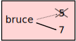
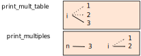

..  Copyright (C)  Jeffrey Elkner, Allen B. Downey and Chris Meyers.
    Permission is granted to copy, distribute and/or modify this document
    under the terms of the GNU Free Documentation License, Version 1.3
    or any later version published by the Free Software Foundation;
    with Invariant Sections being Forward, Preface, and Contributor List, no
    Front-Cover Texts, and no Back-Cover Texts.  A copy of the license is
    included in the section entitled "GNU Free Documentation License".

Iteration
=========

.. index:: iteration, assignment, assignment statement, multiple assignment

.. index::
    single: statement; assignment
    single: assignment; multiple 

Multiple assignment
-------------------

As you may have discovered, it is legal to make more than one assignment to the
same variable. A new assignment makes an existing variable refer to a new value
(and stop referring to the old value).

.. sourcecode:: python
    
    bruce = 5
    print bruce,
    bruce = 7
    print bruce

The output of this program is ``5 7``, because the first time ``bruce`` is
printed, his value is 5, and the second time, his value is 7. The comma at the
end of the first ``print`` statement suppresses the newline after the output,
which is why both outputs appear on the same line.

Here is what **multiple assignment** looks like in a state diagram:

With multiple assignment it is especially important to distinguish between an
assignment operation and a statement of equality. Because Python uses the equal
sign (``=``) for assignment, it is tempting to interpret a statement like
``a = b`` as a statement of equality. It is not!

First, equality is symmetric and assignment is not. For example, in
mathematics, if a = 7 then 7 = a. But in Python, the statement ``a = 7``
is legal and ``7 = a`` is not.

Furthermore, in mathematics, a statement of equality is always true.  If a = b
now, then a will always equal b. In Python, an assignment statement can make
two variables equal, but they don't have to stay that way:

.. sourcecode:: python
    
    a = 5
    b = a    # a and b are now equal
    a = 3    # a and b are no longer equal

The third line changes the value of ``a`` but does not change the value of
``b``, so they are no longer equal. (In some programming languages, a different
symbol is used for assignment, such as ``<-`` or ``:=``, to avoid confusion.)

Updating variables
------------------

One of the most common forms of multiple assignment is an update, where the new
value of the variable depends on the old.

.. sourcecode:: python
    
    x = x + 1

This means get the current value of x, add one, and then update x with the new
value.

If you try to update a variable that doesn't exist, you get an error, because
Python evaluates the expression on the right side of the assignment operator
before it assigns the resulting value to the name on the left:

.. sourcecode:: python
    
    >>> x = x + 1
    Traceback (most recent call last):
      File "", line 1, in 
    NameError: name 'x' is not defined

Before you can update a variable, you have to **initialize** it, usually with a
simple assignment:

.. sourcecode:: python
    
    >>> x = 0
    >>> x = x + 1
    >>>

Updating a variable by adding 1 is called an **increment**; subtracting 1 is
called a **decrement**.

.. index:: while, while statement, while loop, iteration, loop, loop body,
           infinite loop, condition

The ``while`` statement
-----------------------

Computers are often used to automate repetitive tasks. Repeating identical or
similar tasks without making errors is something that computers do well and
people do poorly.

Repeated execution of a set of statements is called **iteration**.  Because
iteration is so common, Python provides several language features to make it
easier. The first feature we are going to look at is the ``while`` statement.

Here is a function called ``countdown`` that demonstrates the use of the
``while`` statement:

.. sourcecode:: python
    
    def countdown(n):
        while n > 0:
            print n
            n = n-1
        print "Blastoff!"

You can almost read the ``while`` statement as if it were English. It means,
While ``n`` is greater than 0, continue displaying the value of ``n`` and then
reducing the value of ``n`` by 1. When you get to 0, display the word
``Blastoff!``

More formally, here is the flow of execution for a ``while`` statement:

#. Evaluate the condition, yielding ``False`` or ``True``.
#. If the condition is false, exit the ``while`` statement and continue
   execution at the next statement.
#. If the condition is true, execute each of the statements in the body and
   then go back to step 1.

The body consists of all of the statements below the header with the same
indentation.

This type of flow is called a **loop** because the third step loops back around
to the top. Notice that if the condition is false the first time through the
loop, the statements inside the loop are never executed.

The body of the loop should change the value of one or more variables so that
eventually the condition becomes false and the loop terminates. Otherwise the
loop will repeat forever, which is called an **infinite loop**. An endless
source of amusement for computer scientists is the observation that the
directions on shampoo, Lather, rinse, repeat, are an infinite loop.

In the case of ``countdown``, we can prove that the loop terminates because we
know that the value of ``n`` is finite, and we can see that the value of ``n``
gets smaller each time through the loop, so eventually we have to get to 0. In
other cases, it is not so easy to tell.  Look at the following function,
definied for all postitive integers ``n``:

.. sourcecode:: python
    
    def sequence(n):
        while n != 1:
            print n,
            if n % 2 == 0:        # n is even
                n = n / 2
            else:                 # n is odd
                n = n * 3 + 1

The condition for this loop is ``n != 1``, so the loop will continue until
``n`` is ``1``, which will make the condition false.

Each time through the loop, the program outputs the value of ``n`` and then
checks whether it is even or odd. If it is even, the value of ``n`` is divided
by 2. If it is odd, the value is replaced by ``n * 3 + 1``.  For example, if
the starting value (the argument passed to sequence) is 3, the resulting
sequence is 3, 10, 5, 16, 8, 4, 2, 1.

Since ``n`` sometimes increases and sometimes decreases, there is no obvious
proof that ``n`` will ever reach 1, or that the program terminates. For some
particular values of ``n``, we can prove termination. For example, if the
starting value is a power of two, then the value of ``n`` will be even each
time through the loop until it reaches 1. The previous example ends with such a
sequence, starting with 16.

Particular values aside, the interesting question is whether we can prove that
this program terminates for *all* values of ``n``. So far, no one has been able
to prove it *or* disprove it!

.. index:: program tracing, hand trace, tracing a program

Tracing a program
-----------------

To write effective computer programs a programmer needs to develop the ability
to **trace** the execution of a computer program. Tracing involves becoming the
computer and following the flow of execution through a sample program run,
recording the state of all variables and any output the program generates after
each instruction is executed.

To understand this process, let's trace the call to ``sequence(3)`` from the
previous section. At the start of the trace, we have a local variable, ``n``
(the parameter), with an initial value of 3. Since 3 is not equal to 1, the
``while`` loop body is executed. 3 is printed and ``3 % 2 == 0`` is evaluated.
Since it evaluates to ``False``, the ``else`` branch is executed and
``3 * 3 + 1`` is evaluated and assigned to ``n``.

To keep track of all this as you hand trace a program, make a column heading on
a piece of paper for each variable created as the program runs and another one
for output. Our trace so far would look something like this::
    
    n               output
    --              ------
    3               3
    10

Since ``10 != 1`` evaluates to ``True``, the loop body is again executed,
and 10 is printed. ``10 % 2 == 0`` is true, so the ``if`` branch is
executed and ``n`` becomes 5. By the end of the trace we have::

      n               output
      --              ------
      3               3
      10              10
      5               5
      16              16
      8               8
      4               4
      2               2
      1

Tracing can be a bit tedious and error prone (that's why we get computers to do
this stuff in the first place!), but it is an essential skill for a programmer
to have. From this trace we can learn a lot about the way our code works. We
can observe that as soon as n becomes a power of 2, for example, the program
will require log\ :sub:`2`\ (n) executions of the loop body to complete. We can
also see that the final 1 will not be printed as output.

.. _counting:

Counting digits
---------------

The following function counts the number of decimal digits in a positive
integer expressed in decimal format:

.. sourcecode:: python
    
    def num_digits(n):
        count = 0
        while n:
            count = count + 1
            n = n / 10
        return count

A call to ``num_digits(710)`` will return ``3``. Trace the execution of this
function call to convince yourself that it works.

This function demonstrates another pattern of computation called a **counter**.
The variable ``count`` is initialized to 0 and then incremented each time the
loop body is executed. When the loop exits, ``count`` contains the result --
the total number of times the loop body was executed, which is the same as the
number of digits.

If we wanted to only count digits that are either 0 or 5, adding a conditional
before incrementing the counter will do the trick:

.. sourcecode:: python
    
    def num_zero_and_five_digits(n):
        count = 0
        while n:
            digit = n % 10
            if digit == 0 or digit == 5:
                count = count + 1
            n = n / 10
        return count

Confirm that ``num_zero_and_five_digits(1055030250)`` returns 7.

Abbreviated assignment
----------------------

Incrementing a variable is so common that Python provides an abbreviated syntax
for it:

.. sourcecode:: python
    
    >>> count = 0
    >>> count += 1
    >>> count
    1
    >>> count += 1
    >>> count
    2
    >>>

``count += 1`` is an abreviation for ``count = count + 1`` . The increment
value does not have to be 1:

.. sourcecode:: python
    
    >>> n = 2
    >>> n += 5
    >>> n
    7
    >>>

There are also abbreviations for ``-=``, ``*=``, ``/=``, and ``%=``:

.. sourcecode:: python
    
    >>> n = 2
    >>> n *= 5
    >>> n
    10
    >>> n -= 4
    >>> n
    6
    >>> n /= 2
    >>> n
    3
    >>> n %= 2
    >>> n
    1

.. index:: table, logarithm, Intel, Pentium, escape sequence, tab, newline,
           cursor

Tables
------

One of the things loops are good for is generating tabular data.  Before
computers were readily available, people had to calculate logarithms, sines and
cosines, and other mathematical functions by hand. To make that easier,
mathematics books contained long tables listing the values of these functions.
Creating the tables was slow and boring, and they tended to be full of errors.

When computers appeared on the scene, one of the initial reactions was, This is
great! We can use the computers to generate the tables, so there will be no
errors. That turned out to be true (mostly) but shortsighted. Soon thereafter,
computers and calculators were so pervasive that the tables became obsolete.

Well, almost. For some operations, computers use tables of values to get an
approximate answer and then perform computations to improve the approximation.
In some cases, there have been errors in the underlying tables, most famously
in the table the Intel Pentium used to perform floating-point division.

Although a log table is not as useful as it once was, it still makes a good
example of iteration. The following program outputs a sequence of values in the
left column and 2 raised to the power of that value in the right column:

.. sourcecode:: python
    
    x = 1
    while x < 13:
        print x, '\t', 2**x
        x += 1

The string ``'\t'`` represents a **tab character**. The backslash character in
``'\t'`` indicates the beginning of an **escape sequence**.  Escape sequences
are used to represent invisible characters like tabs and newlines. The sequence
``\n`` represents a **newline**.

An escape sequence can appear anywhere in a string; in this example, the tab
escape sequence is the only thing in the string. How do you think you represent
a backslash in a string?

As characters and strings are displayed on the screen, an invisible marker
called the **cursor** keeps track of where the next character will go. After a
``print`` statement, the cursor normally goes to the beginning of the next
line.

The tab character shifts the cursor to the right until it reaches one of the
tab stops. Tabs are useful for making columns of text line up, as in the output
of the previous program::
    
    1       2
    2       4
    3       8
    4       16
    5       32
    6       64
    7       128
    8       256
    9       512
    10      1024
    11      2048
    12      4096

Because of the tab characters between the columns, the position of the second
column does not depend on the number of digits in the first column.

.. index:: two-dimensional table

Two-dimensional tables
----------------------

A two-dimensional table is a table where you read the value at the intersection
of a row and a column. A multiplication table is a good example. Let's say you
want to print a multiplication table for the values from 1 to 6.

A good way to start is to write a loop that prints the multiples of 2, all on
one line:

.. sourcecode:: python
    
    i = 1
    while i <= 6:
        print 2 * i, '   ',
        i += 1
    print

The first line initializes a variable named ``i``, which acts as a counter or
**loop variable**. As the loop executes, the value of ``i`` increases from 1 to
6. When ``i`` is 7, the loop terminates. Each time through the loop, it
displays the value of ``2 * i``, followed by three spaces.

Again, the comma in the ``print`` statement suppresses the newline.  After the
loop completes, the second ``print`` statement starts a new line.

The output of the program is::
    
    2      4      6      8      10     12

So far, so good. The next step is to **encapsulate** and **generalize**.

.. index:: encapsulation, generalization, program development

Encapsulation and generalization
--------------------------------

Encapsulation is the process of wrapping a piece of code in a function,
allowing you to take advantage of all the things functions are good for. You
have already seen two examples of encapsulation: ``print_parity`` in chapter 4;
and ``is_divisible`` in chapter 5.

Generalization means taking something specific, such as printing the multiples
of 2, and making it more general, such as printing the multiples of any
integer.

This function encapsulates the previous loop and generalizes it to print
multiples of ``n``:

.. sourcecode:: python
    
    def print_multiples(n):
        i = 1
        while i <= 6:
            print n * i, '\t',
            i += 1
        print

To encapsulate, all we had to do was add the first line, which declares the
name of the function and the parameter list. To generalize, all we had to do
was replace the value 2 with the parameter ``n``.

If we call this function with the argument 2, we get the same output as before.
With the argument 3, the output is::

    3      6      9      12     15     18

With the argument 4, the output is::

    4      8      12     16     20     24

By now you can probably guess how to print a multiplication table --- by
calling ``print_multiples`` repeatedly with different arguments. In fact, we
can use another loop:

.. sourcecode:: python
    
    i = 1
    while i <= 6:
        print_multiples(i)
        i += 1

Notice how similar this loop is to the one inside ``print_multiples``.  All we
did was replace the ``print`` statement with a function call.

The output of this program is a multiplication table::

    1      2      3      4      5      6
    2      4      6      8      10     12
    3      6      9      12     15     18
    4      8      12     16     20     24
    5      10     15     20     25     30
    6      12     18     24     30     36

.. index:: development plan

More encapsulation
------------------

To demonstrate encapsulation again, let's take the code from the last section
and wrap it up in a function:

.. sourcecode:: python
    
    def print_mult_table():
        i = 1
        while i <= 6:
            print_multiples(i)
            i += 1

This process is a common **development plan**. We develop code by writing lines
of code outside any function, or typing them in to the interpreter. When we get
the code working, we extract it and wrap it up in a function.

This development plan is particularly useful if you don't know how to divide
the program into functions when you start writing. This approach lets you
design as you go along.

.. index::
    single: local variable
    single: variable; local

Local variables
---------------

You might be wondering how we can use the same variable, ``i``, in both
``print_multiples`` and ``print_mult_table``. Doesn't it cause problems when
one of the functions changes the value of the variable?

The answer is no, because the ``i`` in ``print_multiples`` and the ``i`` in
``print_mult_table`` are *not* the same variable.

Variables created inside a function definition are local; you can't access a
local variable from outside its home function. That means you are free to have
multiple variables with the same name as long as they are not in the same
function.

The stack diagram for this program shows that the two variables named ``i`` are
not the same variable. They can refer to different values, and changing one
does not affect the other.

The value of ``i`` in ``print_mult_table`` goes from 1 to 6. In the diagram it
happens to be 3. The next time through the loop it will be 4. Each time through
the loop, ``print_mult_table`` calls ``print_multiples`` with the current value
of ``i`` as an argument. That value gets assigned to the parameter ``n``.

Inside ``print_multiples``, the value of ``i`` goes from 1 to 6. In the
diagram, it happens to be 2. Changing this variable has no effect on the value
of ``i`` in ``print_mult_table``.

It is common and perfectly legal to have different local variables with the
same name. In particular, names like ``i`` and ``j`` are used frequently as
loop variables. If you avoid using them in one function just because you used
them somewhere else, you will probably make the program harder to read.

More generalization
-------------------

As another example of generalization, imagine you wanted a program that would
print a multiplication table of any size, not just the six-by-six table. You
could add a parameter to ``print_mult_table``:

.. sourcecode:: python
    
    def print_mult_table(high):
        i = 1
        while i <= high:
            print_multiples(i)
            i += 1

We replaced the value 6 with the parameter ``high``. If we call
``print_mult_table`` with the argument 7, it displays::
    
    1      2      3      4      5      6
    2      4      6      8      10     12
    3      6      9      12     15     18
    4      8      12     16     20     24
    5      10     15     20     25     30
    6      12     18     24     30     36
    7      14     21     28     35     42

This is fine, except that we probably want the table to be square --- with the
same number of rows and columns. To do that, we add another parameter to
``print_multiples`` to specify how many columns the table should have.

Just to be annoying, we call this parameter ``high``, demonstrating that
different functions can have parameters with the same name (just like local
variables). Here's the whole program:

.. sourcecode:: python
    
    def print_multiples(n, high):
        i = 1
        while i <= high:
            print n*i, '\t',
            i += 1
        print
       
    def print_mult_table(high):
        i = 1
        while i <= high:
            print_multiples(i, high)
            i += 1

Notice that when we added a new parameter, we had to change the first line of
the function (the function heading), and we also had to change the place where
the function is called in ``print_mult_table``.

As expected, this program generates a square seven-by-seven table::

    1      2      3      4      5      6      7
    2      4      6      8      10     12     14
    3      6      9      12     15     18     21
    4      8      12     16     20     24     28
    5      10     15     20     25     30     35
    6      12     18     24     30     36     42
    7      14     21     28     35     42     49

When you generalize a function appropriately, you often get a program with
capabilities you didn't plan. For example, you might notice that, because ab =
ba, all the entries in the table appear twice. You could save ink by printing
only half the table. To do that, you only have to change one line of
``print_mult_table``. Change

.. sourcecode:: python
    
            print_multiples(i, high)

to

.. sourcecode:: python
    
            print_multiples(i, i)

and you get::
    
    1
    2      4
    3      6      9
    4      8      12     16
    5      10     15     20     25
    6      12     18     24     30     36
    7      14     21     28     35     42     49

.. index:: function

Functions
---------

A few times now, we have mentioned all the things functions are good for. By
now, you might be wondering what exactly those things are.  Here are some of
them:

#. Giving a name to a sequence of statements makes your program easier to read
   and debug.
#. Dividing a long program into functions allows you to separate parts of the
   program, debug them in isolation, and then compose them into a whole.
#. Functions facilitate the use of iteration.
#. Well-designed functions are often useful for many programs. Once you write
   and debug one, you can reuse it.

.. index::
    single: Newton's method

Newton's Method
---------------

Loops are often used in programs that compute numerical results by starting
with an approximate answer and iteratively improving it.

For example, one way of computing square roots is Newton's method.  Suppose
that you want to know the square root of ``n``. If you start with almost any
approximation, you can compute a better approximation with the following
formula:

.. sourcecode:: python
    
    better =  (approx + n/approx)/2

By repeatedly applying this formula until the better approximation is equal to
the previous one, we can write a function for computing the square root:

.. sourcecode:: python
    
    def sqrt(n):
        approx = n/2.0
        better = (approx + n/approx)/2.0
        while better != approx:
            approx = better
            better = (approx + n/approx)/2.0
        return approx

Try calling this function with ``25`` as an argument to confirm that it returns ``5.0``.

.. index:: algorithm 

Algorithms
----------

Newton's method is an example of an **algorithm**: it is a mechanical process
for solving a category of problems (in this case, computing square roots).

It is not easy to define an algorithm. It might help to start with something
that is not an algorithm. When you learned to multiply single-digit numbers,
you probably memorized the multiplication table.  In effect, you memorized 100
specific solutions. That kind of knowledge is not algorithmic.

But if you were lazy, you probably cheated by learning a few tricks.  For
example, to find the product of n and 9, you can write n - 1 as the first digit
and 10 - n as the second digit. This trick is a general solution for
multiplying any single-digit number by 9. That's an algorithm!

Similarly, the techniques you learned for addition with carrying, subtraction
with borrowing, and long division are all algorithms. One of the
characteristics of algorithms is that they do not require any intelligence to
carry out. They are mechanical processes in which each step follows from the
last according to a simple set of rules.

In our opinion, it is embarrassing that humans spend so much time in school
learning to execute algorithms that, quite literally, require no intelligence.

On the other hand, the process of designing algorithms is interesting,
intellectually challenging, and a central part of what we call programming.

Some of the things that people do naturally, without difficulty or conscious
thought, are the hardest to express algorithmically.  Understanding natural
language is a good example. We all do it, but so far no one has been able to
explain *how* we do it, at least not in the form of an algorithm.

Glossary
--------

.. glossary::

    algorithm
        A step-by-step process for solving a category of problems.

    body
        The statements inside a loop.

    counter
        A variable used to count something, usually initialized to zero and
        incremented in the body of a loop.

    cursor
        An invisible marker that keeps track of where the next character will
        be printed.

    decrement
        Decrease by 1.

    development plan
        A process for developing a program. In this chapter, we demonstrated a
        style of development based on developing code to do simple, specific
        things and then encapsulating and generalizing.

    encapsulate
        To divide a large complex program into components (like functions) and
        isolate the components from each other (by using local variables, for
        example).

    escape sequence
        An escape character, \, followed by one or more printable characters
        used to designate a nonprintable character.

    generalize
        To replace something unnecessarily specific (like a constant value)
        with something appropriately general (like a variable or parameter).
        Generalization makes code more versatile, more likely to be reused, and
        sometimes even easier to write.

    increment
        Both as a noun and as a verb, increment means to increase by 1.

    infinite loop
        A loop in which the terminating condition is never satisfied.

    initialization (of a variable)
        To initialize a variable is to give it an initial value, usually in the
        context of multiple assignment.  Since in Python variables don't exist
        until they are assigned values, they are initialized when they are
        created.  In other programming languages this is not the case, and
        variables can be created without being initialized, in which case they
        have either default or *garbage* values.

    iteration
        Repeated execution of a set of programming statements.

    loop
        A statement or group of statements that execute repeatedly until a
        terminating condition is satisfied.

    loop variable
        A variable used as part of the terminating condition of a loop.

    multiple assignment
        Making more than one assignment to the same variable during the
        execution of a program.

    newline
        A special character that causes the cursor to move to the beginning of
        the next line.

    tab
        A special character that causes the cursor to move to the next tab stop
        on the current line.

    trace
        To follow the flow of execution of a program by hand, recording the
        change of state of the variables and any output produced.

Exercises
---------

#. Write a single string that::
    
       produces
       this
       output.
    
#. Add a print statement to the ``sqrt`` function defined in section 6.14 that
   prints out ``better`` each time it is calculated. Call your modified
   function with 25 as an argument and record the results.
#. Trace the execution of the last version of ``print_mult_table`` and figure
   out how it works.
#. Write a function ``print_triangular_numbers(n)`` that prints out the first
   n triangular numbers. A call to ``print_triangular_numbers(5)`` would
   produce the following output::
    
       1       1
       2       3
       3       6
       4       10
       5       15

   (*hint: use a web search to find out what a triangular number is.*)
#. Open a file named ``ch06.py`` and add the following:

   .. sourcecode:: python
    
       if __name__ == '__main__':
           import doctest
           doctest.testmod()

   Write a function, ``is_prime``, which takes a single integral argument
   and returns ``True`` when the argument is a **prime number** and ``False``
   otherwise. Add doctests to your function as you develop it.
#. What will ``num_digits(0)`` return? Modify it to return ``1`` for this
   case. Why does a call to ``num_digits(-24)`` result in an infinite loop
   (*hint: -1/10 evaluates to -1*)? Modify ``num_digits`` so that it works
   correctly with any integer value. Add the following to the ``ch06.py``
   file you created in the previous exercise:

   .. sourcecode:: python
    
       def num_digits(n):
           """
             >>> num_digits(12345)
             5
             >>> num_digits(0)
             1
             >>> num_digits(-12345)
             5
           """

   Add your function body to ``num_digits`` and confirm that it passes the
   doctests.
#. Add the following to the ``ch06.py``:

   .. sourcecode:: python
    
       def num_even_digits(n):
           """
             >>> num_even_digits(123456)
             3
             >>> num_even_digits(2468)
             4
             >>> num_even_digits(1357)
             0
             >>> num_even_digits(2)
             1
             >>> num_even_digits(20)
             2
           """

   Write a body for ``num_even_digits`` so that it works as expected.
#. Add the following to ``ch06.py``:

   .. sourcecode:: python
    
       def print_digits(n):
           """
             >>> print_digits(13789)
             9 8 7 3 1
             >>> print_digits(39874613)
             3 1 6 4 7 8 9 3
             >>> print_digits(213141)
             1 4 1 3 1 2
           """

   Write a body for ``print_digits`` so that it passes the given doctests.
#. Write a function ``sum_of_squares_of_digits`` that computes the sum
   of the squares of the digits of an integer passed to it. For example,
   ``sum_of_squares_of_digits(987)`` should return 194, since
   ``9**2 + 8**2 + 7**2 == 81 + 64 + 49 == 194``.

   .. sourcecode:: python
    
       def sum_of_squares_of_digits(n):
           """
             >>> sum_of_squares_of_digits(1)
             1
             >>> sum_of_squares_of_digits(9)
             81
             >>> sum_of_squares_of_digits(11)
             2
             >>> sum_of_squares_of_digits(121)
             6
             >>> sum_of_squares_of_digits(987)
             194
           """

   Check your solution against the doctests above.
