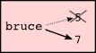
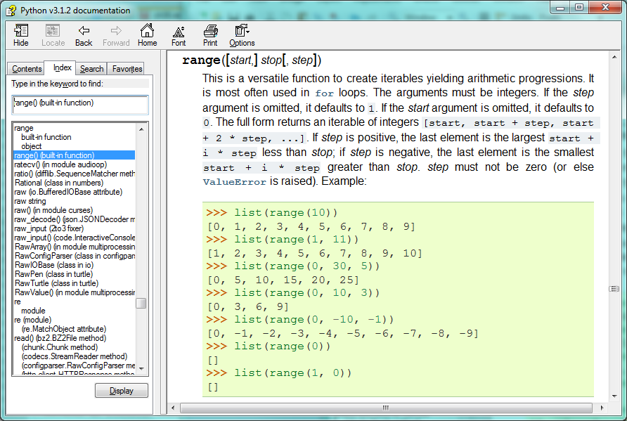
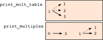

..  Copyright (C)  Peter Wentworth, Jeffrey Elkner, Allen B. Downey and Chris Meyers.
    Permission is granted to copy, distribute and/or modify this document
    under the terms of the GNU Free Documentation License, Version 1.3
    or any later version published by the Free Software Foundation;
    with Invariant Sections being Foreword, Preface, and Contributor List, no
    Front-Cover Texts, and no Back-Cover Texts.  A copy of the license is
    included in the section entitled "GNU Free Documentation License".

.. |rle_start| image:: illustrations/rle_start.png
   
.. |rle_end| image:: illustrations/rle_end.png
 

   

 
|

Iteration
=========

.. index:: iteration, assignment, assignment statement, reassignment

.. index::
    single: statement; assignment
   
    
Computers are often used to automate repetitive tasks. Repeating identical or
similar tasks without making errors is something that computers do well and
people do poorly.

Repeated execution of a set of statements is called **iteration**.  Because
iteration is so common, Python provides several language features to make it
easier. We've already seen the ``for`` statement in chapter 3.  This the 
the form of iteration you'll likely be using most often.  But in this chapter
we've going to look at the ``while`` statement --- another way to have your
program do iteration, useful in slightly different circumstances.

Before we do that, let's just review a few ideas...

Reassignment
------------ 

As we have mentioned previously, it is legal to make more than one assignment to the
same variable. A new assignment makes an existing variable refer to a new value
(and stop referring to the old value).

.. sourcecode:: python
    
    bruce = 5
    print(bruce)
    bruce = 7
    print(bruce)

The output of this program is::

    5
    7

because the first time ``bruce`` is
printed, its value is 5, and the second time, its value is 7.  

Here is what **reassignment** looks like in a state snapshot:

With reassignment it is especially important to distinguish between an
assignment statement and a boolean expression that tests for equality. 
Because Python uses the equal token (``=``) for assignment, 
it is tempting to interpret a statement like
``a = b`` as a boolean test.  Unlike mathematics, it is not!  Remember that the Python token
for the equality operator is ``==``.

Note too that an equality test is symmetric, but assignment is not. For example, 
if ``a == 7`` then ``7 == a``. But in Python, the statement ``a = 7``
is legal and ``7 = a`` is not.

Furthermore, in mathematics, a statement of equality is always true.  If ``a == b``
now, then ``a`` will always equal ``b``. In Python, an assignment statement can make
two variables equal, but because of the possibility of reassignment, 
they don't have to stay that way:

.. sourcecode:: python
    
    a = 5
    b = a    # after executing this line, a and b are now equal
    a = 3    # after executing this line, a and b are no longer equal

The third line changes the value of ``a`` but does not change the value of
``b``, so they are no longer equal. (In some programming languages, a different
symbol is used for assignment, such as ``<-`` or ``:=``, to avoid confusion.  Python
chose to use the tokens ``=`` for assignment, and ``==`` for equality.  This is a popular
choice also found in languages like C, C++, Java, and C#.)

Updating variables
------------------

One of the most common forms of reassignment is an update, where the new
value of the variable depends on the old.

.. sourcecode:: python
    
    x = x + 1

This means get the current value of x, add one, and then update x with the new
value.

If you try to update a variable that doesn't exist, you get an error, because
Python evaluates the expression on the right side of the assignment operator
before it assigns the resulting value to the name on the left:

.. sourcecode:: python
    
    >>> x = x + 1
    Traceback (most recent call last):
      File "<interactive input>", line 1, in 
    NameError: name 'x' is not defined

Before you can update a variable, you have to **initialize** it, usually with a
simple assignment:

.. sourcecode:: python
    
    >>> x = 0
    >>> x = x + 1
    >>>

Updating a variable by adding 1 is called an **increment**; subtracting 1 is
called a **decrement**.  Sometimes programmers also talk about **bumping**
a variable, which means the same as incrementing it by 1.

.. index:: for loop

The ``for`` loop revisited
--------------------------

Recall that the ``for`` loop processes each item in a list.  Each item in
turn is (re-)assigned to the loop variable, and the body of the loop is executed.
We saw this example in an earlier chapter:

.. sourcecode:: python

    for f in ["Joe", "Amy", "Brad", "Angelina", "Zuki", "Thandi", "Paris"]:
        invitation = "Hi " + f + ".  Please come to my party on Saturday!"
        print(invitation) 
        
Running through all the items in a list is called **traversing** the list,
or **traversal**.      

Let us write a function now to sum up all the elements in a list of numbers.
Do this by hand first, and try to isolate exactly what steps you take.  You'll
find you need to keep some "running total" of the sum so far, either on a piece 
of paper, or in your head.  Remembering things from one step to the next is
precisely why we have variables in a program: so we'll need some variable
to remember the "running total".  It should be initialized with a value of zero,
and then we need to traverse the items in the list.  For each item, we'll want
to update the running total by adding the next number to it.

.. sourcecode::  python

    def mysum(xs):
        """ Sum all the numbers in the list xs, and return the total. """
        running_total = 0
        for x in xs:
            running_total = running_total + x
        return running_total

    #add tests like these to your test suite ...
    test(mysum([1, 2, 3, 4]), 10)
    test(mysum([1.25, 2.5, 1.75]), 5.5)
    test(mysum([1, -2, 3]), 2)
    test(mysum([ ]), 0)
    test(mysum(range(11)), 55)    # Remember that 11 is not in the list that range generates.
      
        
.. index:: while statement, while loop, iteration, loop, loop body,
           infinite loop, condition

The ``while`` statement
-----------------------

Here is a fragment of code that demonstrates the use of the ``while`` statement:

.. sourcecode:: python
    
    def sum_to(n):
        """ Return the sum of 1+2+3 ... n """
        ss  = 0
        v = 1
        while v <= n:
            ss = ss + v
            v = v + 1
        return ss
        
    # for your test suite
    test(sum_to(4), 10) 
    test(sum_to(1000), 500500)     

You can almost read the ``while`` statement as if it were English. It means,
While ``v`` is less than or equal to ``n``, continue executing the body of the loop. Within
the body, each time, increment ``v``. When ``v`` passes ``n``, return your accumulated sum.

More formally, here is the flow of execution for a ``while`` statement:

#. Evaluate the condition, yielding ``False`` or ``True``.
#. If the condition is false, exit the ``while`` statement and continue
   execution at the next statement.
#. If the condition is true, execute each of the statements in the body and
   then go back to step 1.

The body consists of all of the statements below the header with the same
indentation.

This type of flow is called a **loop** because the third step loops back around
to the top. Notice that if the condition is false the first time through the
loop, the statements inside the loop are never executed.

The body of the loop should change the value of one or more variables so that
eventually the condition becomes false and the loop terminates. Otherwise the
loop will repeat forever, which is called an **infinite loop**. An endless
source of amusement for computer scientists is the observation that the
directions on shampoo, lather, rinse, repeat, are an infinite loop.

In the case here, we can prove that the loop terminates because we
know that the value of ``n`` is finite, and we can see that the value of ``v``
increments each time through the loop, so eventually it will have to exceed ``n``. In
other cases, it is not so easy to tell.  

What you will notice here is that the ``while`` loop is more work for
you --- the programmer --- than the equivalent ``for`` loop.  When using a ``while``
loop one has to control the loop variable yourself: give it an initial value, test
for completion, and then make sure you change something in the body so that the loop
terminates.  By comparison, here is an alternative function that uses ``for`` instead: 

.. sourcecode:: python

    def sum_to(n):
        """ Return the sum of 1+2+3 ... n """
        ss  = 0
        for v in range(n+1):
            ss = ss + v
        return ss

Notice the slightly tricky call to the ``range`` function --- we had to add one onto ``n``, 
because ``range`` generates its list up to but not including the value you give it.  
It would be easy to make a programming mistake and overlook this, but because we've
made the investment of writing some unit tests, our test suite would have caught our error.        
        
So why have two kinds of loop if ``for`` looks easier?  This next example shows a case where
we need the extra power that we get from the ``while`` loop.        
        
.. index:: 3n + 1 sequence        
        
The 3n + 1 sequence
-------------------

Let's look at a simple sequence that has fascinated and foxed mathematicians for many years.
They still cannot answer even quite simple questions about this.  

The rule is to atart from
some given ``n``, and to generate
the next term of the sequence from ``n``, either by halving ``n``, 
(whenever ``n`` is even), or else by multiplying it by three and adding 1.  The sequence
terminates when ``n`` reaches 1. 

This Python function captures that algorithm:

.. sourcecode:: python
    
    def seq3np1(n):
        """ Print the 3n+1 sequence from n, terminating when it reaches 1."""
        while n != 1:
            print(n, end=', ')
            if n % 2 == 0:        # n is even
                n = n // 2
            else:                 # n is odd
                n = n * 3 + 1
        print(n, end='.\n')     

Notice first that the print function has an extra argument ``end=', '``.  This 
tells the ``print`` function to follow the printed string with whatever the programmer
chooses (in this case, a comma followed by a space), instead of ending the line. So
each time something is printed in the loop, it is printed on the same line, with
the output separated by commas.  The call to ``print(n, end='.\n')`` when the loop terminates
will then print the final value of ``n`` followed by a period and a newline character. 
(You'll cover the ``\n`` (newline character) in the next chapter).             
                
The condition for this loop is ``n != 1``, so the loop will continue running until
``n`` is ``1``, which will make the condition false.

Each time through the loop, the program outputs the value of ``n`` and then
checks whether it is even or odd. If it is even, the value of ``n`` is divided
by 2 using integer division. If it is odd, the value is replaced by ``n * 3 + 1``.  
Here are some examples::

    >>> seq3np1(3)
    3, 10, 5, 16, 8, 4, 2, 1.
    >>> seq3np1(19)
    19, 58, 29, 88, 44, 22, 11, 34, 17, 52, 26, 13, 40, 20, 10, 5, 16, 8, 4, 2, 1.
    >>> seq3np1(21)
    21, 64, 32, 16, 8, 4, 2, 1.
    >>> seq3np1(16)
    16, 8, 4, 2, 1.
    >>> 
    
Since ``n`` sometimes increases and sometimes decreases, there is no obvious
proof that ``n`` will ever reach 1, or that the program terminates. For some
particular values of ``n``, we can prove termination. For example, if the
starting value is a power of two, then the value of ``n`` will be even each
time through the loop until it reaches 1. The previous example ends with such a
sequence, starting with 16.

You might like to have some fun and see if you can find a small starting 
number that needs more than a hundred steps before it terminates. 

Particular values aside, the interesting question is whether we can prove that
this sequence terminates for *all* values of ``n``. So far, no one has been able
to prove it *or* disprove it!   

Think carefully about what would be needed for a proof or disproof of the hypothesis
*"All positive integers will eventually converge to 1"*.  With fast computers we have
been able to test every integer up to very large values, and so far, they all 
eventually end up at 1.  But this doesn't mean that there might not be some
as-yet untested number which does not reduce to 1.   

You'll notice that if you don't stop when you reach one the sequence gets into
its own loop:  1, 4, 2, 1, 4, 2, 1, 4 ...   So one possibility is that there might
be other cycles that we just haven't found.  

.. admonition:: Choosing between ``for`` and ``while``

   Use a ``for`` loop if you know the maximum number of times that you'll
   need to execute the body.  For example, if you're traversing a list of elements,
   or can formulate a suitable call to ``range``, then choose the ``for`` loop.

   So any problem like "iterate this weather model run for 1000 cycles", or "search this
   list of words", "find all prime numbers up to 10000" suggest that a ``for`` loop is best.

   By contrast, if you are required to repeat some computation until some condition is 
   met, as we did in this 3n + 1 problem, you'll need a ``while`` loop. 

   We call the first case **definite iteration** --- we have some definite bounds for 
   what is needed.   The latter case is called **indefinite iteration** --- we're not sure
   how many iterations we'll need --- we cannot even establish an upper bound!    

.. index:: program tracing, hand trace, tracing a program

Tracing a program
-----------------

To write effective computer programs a programmer needs to develop the ability
to **trace** the execution of a computer program. Tracing involves becoming the
computer and following the flow of execution through a sample program run,
recording the state of all variables and any output the program generates after
each instruction is executed.

To understand this process, let's trace the call to ``seq3np1(3)`` from the
previous section. At the start of the trace, we have a local variable, ``n``
(the parameter), with an initial value of 3. Since 3 is not equal to 1, the
``while`` loop body is executed. 3 is printed and ``3 % 2 == 0`` is evaluated.
Since it evaluates to ``False``, the ``else`` branch is executed and
``3 * 3 + 1`` is evaluated and assigned to ``n``.

To keep track of all this as you hand trace a program, make a column heading on
a piece of paper for each variable created as the program runs and another one
for output. Our trace so far would look something like this::
    
    n               output printed so far
    --              ---------------------
    3               3, 
    10

Since ``10 != 1`` evaluates to ``True``, the loop body is again executed,
and 10 is printed. ``10 % 2 == 0`` is true, so the ``if`` branch is
executed and ``n`` becomes 5. By the end of the trace we have::

      n               output printed so far
      --              ---------------------
      3               3,
      10              3, 10,
      5               3, 10, 5,
      16              3, 10, 5, 16,
      8               3, 10, 5, 16, 8,
      4               3, 10, 5, 16, 8, 4,
      2               3, 10, 5, 16, 8, 4, 2,
      1               3, 10, 5, 16, 8, 4, 2, 1.

Tracing can be a bit tedious and error prone (that's why we get computers to do
this stuff in the first place!), but it is an essential skill for a programmer
to have. From this trace we can learn a lot about the way our code works. We
can observe that as soon as n becomes a power of 2, for example, the program
will require log\ :sub:`2`\ (n) executions of the loop body to complete. We can
also see that the final 1 will not be printed as output within the body of the loop,
which is why we put the special ``print`` function at the end. 

Tracing a program is, of course, related to single-stepping through your code
and being able to inspect the variables. Using the computer to **single-step** for you is
less error prone and more convenient. 
Also, as your ptograms get more complex, they might execute many millions of 
steps before they get to the code that you're really interested in, so manual tracing 
becomes impossible.  Being able to set a **breakpoint** where you need
one is far more powerful. So we strongly encourage you to invest time in
learning using to use your programming environment (PyScripter, in these notes) to full
effect. 

There are also some great visualization tools becoming available to help you 
trace and understand small fragments of Python code.  The one we recommend is at 
http://netserv.ict.ru.ac.za/python3_viz 

We've cautioned
against chatterbox functions, but used them here.  As we learn a bit more Python, we'll
be able to show you how to generate a list of values to hold the sequence, rather than having
the function print them. Doing this would remove the need to have all these pesky ``print`` functions
in the middle of our logic, and will make the function more useful.

.. _counting:

Counting digits
---------------

The following function counts the number of decimal digits in a positive
integer:

.. sourcecode:: python

    def num_digits(n):
        count = 0
        while n > 0:
            count = count + 1
            n = n // 10
        return count
    
A call to ``print(num_digits(710))`` will display ``3``. Trace the execution of this
function call (perhaps using the single step function in PyScripter, or the
Python visualizer, or on some paper) to convince yourself that it works.

This function demonstrates an important pattern of computation called a **counter**.
The variable ``count`` is initialized to 0 and then incremented each time the
loop body is executed. When the loop exits, ``count`` contains the result ---
the total number of times the loop body was executed, which is the same as the
number of digits.

If we wanted to only count digits that are either 0 or 5, adding a conditional
before incrementing the counter will do the trick:

.. sourcecode:: python
    
    def num_zero_and_five_digits(n):
        count = 0
        while n > 0:
            digit = n % 10
            if digit == 0 or digit == 5:
                count = count + 1
            n = n // 10
        return count

Confirm that ``test(num_zero_and_five_digits(1055030250), 7)`` passes.

Notice, however, that some of the tests below fail. Explain why.  Do you think this is a bug in
the code, or a bug in the specifications, our expectations, or the tests? ::

    test(num_digits(1055030250), 10)
    test(num_digits(0050), 4)
    test(num_digits(0), 1)

.. index:: abbreviated assignment    
    
Abbreviated assignment
----------------------

Incrementing a variable is so common that Python provides an abbreviated syntax
for it:

.. sourcecode:: python
    
    >>> count = 0
    >>> count += 1
    >>> count
    1
    >>> count += 1
    >>> count
    2
    >>>

``count += 1`` is an abreviation for ``count = count + 1`` . We pronouce the operator
as *"plus-equals"*.  The increment value does not have to be 1:

.. sourcecode:: python
    
    >>> n = 2
    >>> n += 5
    >>> n
    7
    >>>

There are similar abbreviations for ``-=``, ``*=``, ``/=``, ``//=`` and ``%=``:

.. sourcecode:: python
    
    >>> n = 2
    >>> n *= 5
    >>> n
    10
    >>> n -= 4
    >>> n
    6
    >>> n //= 2
    >>> n
    3
    >>> n %= 2
    >>> n
    1

.. index:: help, meta-notation   
    
Help and meta-notation
----------------------

Python comes with extensive documentation for all its built-in functions, and its libraries.
Different systems have different ways of accessing this help.  In PyScripter, click on the
*Help* menu item, and select *Python Manuals*.  Then search for help on the built-in function
**range**.   You'll get something like this...

Notice the square brackets in the description of the arguments. 
These are examples of **meta-notation** --- notation that describes Python syntax, but is not part of it.
The square brackets in this documentation mean that the argument is *optional* --- the programmer can
omit it.  So what this first line of help tells us is that ``range`` must always have a ``stop`` argument,
but it may have an optional ``start`` argument (which must be followed by a comma if it is present),
and it can also have an optional ``step`` argument, preceded by a comma if it is present.

The examples from help show that ``range`` can have either 1, 2 or 3 arguments.  The list can
start at any starting value, and go up or down in increments other than 1.  The documentation
here also says that the arguments must be integers.

Other meta-notation you'll frequently encounter is the use of bold and italics.  The bold
means that these are tokens --- keywords or symbols --- typed into your Python code exactly as
they are, whereas the
italic terms stand for "something of this type".  So the syntax description

    **for** *variable* **in** *list* **:** 
    
means you can substitute any legal 
variable and any legal list when you write your Python code.  

This (simplified) description of the ``print`` function, shows another example
of meta-notation in which the ellipses (``...``) mean that you can have as many
objects as you like (even zero), separated by commas:
   
   **print( [**\ *object,* ... **] )**
   
Meta-notation gives us a concise and powerful way to describe the *pattern* of some syntax
or feature.  

.. index:: table, logarithm, Intel, Pentium, escape sequence, tab, newline,
           cursor

Tables
------

One of the things loops are good for is generating tabular data.  Before
computers were readily available, people had to calculate logarithms, sines and
cosines, and other mathematical functions by hand. To make that easier,
mathematics books contained long tables listing the values of these functions.
Creating the tables was slow and boring, and they tended to be full of errors.

When computers appeared on the scene, one of the initial reactions was, *"This is
great! We can use the computers to generate the tables, so there will be no
errors."* That turned out to be true (mostly) but shortsighted. Soon thereafter,
computers and calculators were so pervasive that the tables became obsolete.

Well, almost. For some operations, computers use tables of values to get an
approximate answer and then perform computations to improve the approximation.
In some cases, there have been errors in the underlying tables, most famously
in the table the Intel Pentium processor chip used to perform floating-point division.

Although a log table is not as useful as it once was, it still makes a good
example of iteration. The following program outputs a sequence of values in the
left column and 2 raised to the power of that value in the right column:

.. sourcecode:: python
    
    for x in range(13):   # generate numbers 0 to 12
        print(x, '\t', 2**x)

The string ``'\t'`` represents a **tab character**. The backslash character in
``'\t'`` indicates the beginning of an **escape sequence**.  Escape sequences
are used to represent invisible characters like tabs and newlines. The sequence
``\n`` represents a **newline**.

An escape sequence can appear anywhere in a string; in this example, the tab
escape sequence is the only thing in the string. How do you think you represent
a backslash in a string?

As characters and strings are displayed on the screen, an invisible marker
called the **cursor** keeps track of where the next character will go. After a
``print`` function, the cursor normally goes to the beginning of the next
line.

The tab character shifts the cursor to the right until it reaches one of the
tab stops. Tabs are useful for making columns of text line up, as in the output
of the previous program::
    
    0       1
    1       2
    2       4
    3       8
    4       16
    5       32
    6       64
    7       128
    8       256
    9       512
    10      1024
    11      2048
    12      4096

Because of the tab characters between the columns, the position of the second
column does not depend on the number of digits in the first column.

.. index:: two-dimensional table

Two-dimensional tables
----------------------

A two-dimensional table is a table where you read the value at the intersection
of a row and a column. A multiplication table is a good example. Let's say you
want to print a multiplication table for the values from 1 to 6.

A good way to start is to write a loop that prints the multiples of 2, all on
one line:

.. sourcecode:: python
    
    for i in range(1, 7):
        print(2 * i, end='   ')
    print()

Here we've used the ``range`` function, but made it start its sequence at 1. 
As the loop executes, the value of ``i`` changes from 1 to
6. When all the elements of the range have been assigned to ``i``, the loop terminates. 
Each time through the loop, it
displays the value of ``2 * i``, followed by three spaces.

Again, the extra ``end='   '`` argument in the ``print`` function suppresses the newline, and
uses three spaces instead.  After the
loop completes, the second call to ``print`` finishes the current line, and starts a new line.

The output of the program is::
    
    2      4      6      8      10     12

So far, so good. The next step is to **encapsulate** and **generalize**.

.. index:: encapsulation, generalization, program development

Encapsulation and generalization
--------------------------------

Encapsulation is the process of wrapping a piece of code in a function,
allowing you to take advantage of all the things functions are good for. You
have already seen some examples of encapsulation, including ``is_divisible`` in a previous chapter.

Generalization means taking something specific, such as printing the multiples
of 2, and making it more general, such as printing the multiples of any
integer.

This function encapsulates the previous loop and generalizes it to print
multiples of ``n``:

.. sourcecode:: python
    
    def print_multiples(n):
        for i in range(1, 7):
            print(n * i, end='   ')
        print()

To encapsulate, all we had to do was add the first line, which declares the
name of the function and the parameter list. To generalize, all we had to do
was replace the value 2 with the parameter ``n``.

If we call this function with the argument 2, we get the same output as before.
With the argument 3, the output is::

    3      6      9      12     15     18

With the argument 4, the output is::

    4      8      12     16     20     24

By now you can probably guess how to print a multiplication table --- by
calling ``print_multiples`` repeatedly with different arguments. In fact, we
can use another loop:

.. sourcecode:: python
    
    for i in range(1, 7):
        print_multiples(i)

Notice how similar this loop is to the one inside ``print_multiples``.  All we
did was replace the ``print`` function with a function call.

The output of this program is a multiplication table::

    1      2      3      4      5      6
    2      4      6      8      10     12
    3      6      9      12     15     18
    4      8      12     16     20     24
    5      10     15     20     25     30
    6      12     18     24     30     36

.. index:: development plan

More encapsulation
------------------

To demonstrate encapsulation again, let's take the code from the last section
and wrap it up in a function:

.. sourcecode:: python
    
    def print_mult_table():
        for i in range(1, 7):
            print_multiples(i)

This process is a common **development plan**. We develop code by writing lines
of code outside any function, or typing them in to the interpreter. When we get
the code working, we extract it and wrap it up in a function.

This development plan is particularly useful if you don't know how to divide
the program into functions when you start writing. This approach lets you
design as you go along.

.. index::
    single: local variable
    single: variable; local

Local variables
---------------

You might be wondering how we can use the same variable, ``i``, in both
``print_multiples`` and ``print_mult_table``. Doesn't it cause problems when
one of the functions changes the value of the variable?

The answer is no, because the ``i`` in ``print_multiples`` and the ``i`` in
``print_mult_table`` are *not* the same variable.

Variables created inside a function definition are local; you can't access a
local variable from outside its home function. That means you are free to have
multiple variables with the same name as long as they are not in the same
function.

The stack diagram for this program shows that the two variables named ``i`` are
not the same variable. They can refer to different values, and changing one
does not affect the other.

The value of ``i`` in ``print_mult_table`` goes from 1 to 6. In the diagram it
happens to be 3. The next time through the loop it will be 4. Each time through
the loop, ``print_mult_table`` calls ``print_multiples`` with the current value
of ``i`` as an argument. That value gets assigned to the parameter ``n``.

Inside ``print_multiples``, the value of ``i`` goes from 1 to 6. In the
diagram, it happens to be 2. Changing this variable has no effect on the value
of ``i`` in ``print_mult_table``.

It is common and perfectly legal to have different local variables with the
same name. In particular, names like ``i`` and ``j`` are used frequently as
loop variables. If you avoid using them in one function just because you used
them somewhere else, you will probably make the program harder to read.

The visualizer at http://netserv.ict.ru.ac.za/python3_viz/ shows very clearly how the 
two variables ``i`` are distinct variables, and how they have independent values.
(The visualizer has a limit of showing 100 steps, though --- not quite enough
to run this particular example all the way to the end.)

.. index:: break statement,  statement: break

The ``break`` statement, and flavours of loops
----------------------------------------------

.. sidebar::  A pre-test loop

    .. image:: illustrations/pre_test_loop.png  

The **break** statement is used to immediately leave the body of its loop.  The next
statement to be executed is the first one after the body::

    for i in [12, 16, 17, 24, 29]: 
        if i % 2 == 1:  # if the number is odd
           break        # immediately exit the loop
        print(i)
    print("done")
    
This prints::

    12
    16
    done
    

    
``for`` and ``while`` loops do their tests at the start, before executing
any part of the body.  (They're called **pre-test** loops, because the test
happens before (pre) the body.)  

   
.. sidebar::  A middle-test loop

    .. image:: illustrations/mid_test_loop.png  
    
Sometimes we'd like to have the **middle-test** loop with the exit test in the middle 
of the body, rather than at the beginning.  Or a **post-test** loop that
puts its exit test after the body.   Python doesn't provide different
loops for these cases: but a combination of ``while`` and ``break`` are sufficient
to get the job done.    

A typical example is a problem where the user has to input numbers to be summed.  
To indicate that there are no more inputs, the user enters a special value, often
the value -1, or the empty string.  This needs a middle-exit loop pattern: 
input the next number, then test whether to exit, or else process the number::

    total = 0
    while True:
        response = input("Enter the next number. (Leave blank to end)")
        if response == "":
            break 
        total += int(response)
    print("The total of the numbers you entered is ", total)

    
A post-test loop would be useful,for example, if you were playing an
interactive game against the user::

    while True:
        play_the_game()
        response = input("Play again? (yes or no)")
        if response != "yes":
            break 
    print("Goodbye!")
    
.. sidebar::  A post-test loop

    .. image:: illustrations/post_test_loop.png        
    
The ``while True:`` in these cases is *idiomatic* --- a convention that
most programmers will recognize immediately. The test in the ``while`` loop must
always succeed. A clever compiler or interpreter will understand that
and won't generate any unnecessary work!   
    
    
The following program implements a simple guessing game:

.. sourcecode:: python
    :linenos:
    
    import random                     # We cover random numbers in chapter 10
    rng = random.Random()             # so you can peek ahead.
    number = rng.randrange(1, 1000)   # Get a random number between [1 and 1000).

    guesses = 0
    msg = ""

    while True:
        guess = int(input(msg + "\nGuess my number between 1 and 1000: "))
        guesses += 1
        if guess > number:
            msg += str(guess) + " is too high.\n"  
        elif guess < number:
            msg += str(guess) + " is too low.\n"  
        else:
            break

    input("\n\nCongratulations, you got it in {0} guesses!\n\n" .format(guesses))
    
This program makes use of the mathematical law of **trichotomy** (given real
numbers a and b, exactly one of these three must be true:  a > b, a < b, or a == b). 

At line 18 there is a call to the input function, but we don't do 
anything with the result, not even assign it to a variable.  This is legal in Python.
Here it has the effect of popping up the input dialog window and waiting for the
user to respond before the program terminates.  Programmers often use the trick 
of doing some extra input at the end of a script, just to keep the windows open.

Also notice the use of the ``msg`` variable, initially an empty string, on lines 6, 12 and 14.
Each time through the loop we extend the message being displayed: this allows us to 
display the program's feedback right at the same place as we're asking for the next guess. 

.. image:: illustrations/Python_input.png

.. index:: continue statement,  statement; continue

The ``continue`` statement
--------------------------

This is a control flow statement that causes the program to immediately skip the
processing of the rest of the body of the loop, *for the current iteration*.  But
the loop still carries on running for its remaining iterations::

    for i in [12, 16, 17, 24, 29, 30]: 
        if i % 2 == 1:      # if the number is odd
           continue         # don't process it
        print(i)
    print("done")

This prints::

    12
    16
    24
    30
    done    
    
More generalization
-------------------

As another example of generalization, imagine you wanted a program that would
print a multiplication table of any size, not just the six-by-six table. You
could add a parameter to ``print_mult_table``:

.. sourcecode:: python
    
    def print_mult_table(high):
        for i in range(1, high+1):
            print_multiples(i)

We replaced the value 1 with the expression ``high+1``. If we call
``print_mult_table`` with the argument 7, it displays::
    
    1      2      3      4      5      6
    2      4      6      8      10     12
    3      6      9      12     15     18
    4      8      12     16     20     24
    5      10     15     20     25     30
    6      12     18     24     30     36
    7      14     21     28     35     42

This is fine, except that we probably want the table to be square --- with the
same number of rows and columns. To do that, we add another parameter to
``print_multiples`` to specify how many columns the table should have.

Just to be annoying, we call this parameter ``high``, demonstrating that
different functions can have parameters with the same name (just like local
variables). Here's the whole program:

.. sourcecode:: python
    
    def print_multiples(n, high):
        for i in range(1, high+1):
            print(n * i, end='   ')
        print()
       
    def print_mult_table(high):
        for i in range(1, high+1):
            print_multiples(i, high)

Notice that when we added a new parameter, we had to change the first line of
the function (the function heading), and we also had to change the place where
the function is called in ``print_mult_table``.

Now, when we call ``print_mult_table(7)``::

    1      2      3      4      5      6      7
    2      4      6      8      10     12     14
    3      6      9      12     15     18     21
    4      8      12     16     20     24     28
    5      10     15     20     25     30     35
    6      12     18     24     30     36     42
    7      14     21     28     35     42     49

When you generalize a function appropriately, you often get a program with
capabilities you didn't plan. For example, you might notice that, because ab =
ba, all the entries in the table appear twice. You could save ink by printing
only half the table. To do that, you only have to change one line of
``print_mult_table``. Change

.. sourcecode:: python
    
            print_multiples(i, high+1)

to

.. sourcecode:: python
    
            print_multiples(i, i+1)

and you get::
    
    1
    2      4
    3      6      9
    4      8      12     16
    5      10     15     20     25
    6      12     18     24     30     36
    7      14     21     28     35     42     49

.. index:: function

Functions
---------

A few times now, we have mentioned all the things functions are good for. By
now, you might be wondering what exactly those things are.  Here are some of
them:

#. Giving a name to a sequence of statements makes your program easier to read
   and debug.
#. Dividing a long program into functions allows you to separate parts of the
   program, debug them in isolation, and then compose them into a whole.
#. Functions facilitate the use of iteration.
#. Well-designed functions are often useful for many programs. Once you write
   and debug one, you can reuse it.

.. index::
    single: Newton's method

Newton's Method
---------------

Loops are often used in programs that compute numerical results by starting
with an approximate answer and iteratively improving it.

For example, one way of computing square roots is Newton's method.  Suppose
that you want to know the square root of ``n``. If you start with almost any
approximation, you can compute a better approximation with the following
formula:

.. sourcecode:: python
    
    better =  (approx + n/approx)/2
    
Execute this algorithm a few times using your calculator.  Can you
see why each iteration brings your estimate a little closer?  One of the amazing
properties of this particular algorithm is how quickly it converges to an accurate
answer.    

By repeatedly applying this formula until the better approximation gets close
enough to the previous one, we can write a function for computing the square root.

.. sourcecode:: python
    
    def sqrt(n):
        approx = n/2.0
        better = (approx + n/approx)/2.0
        while  better !=  approx):
            approx = better
            better = (approx + n/approx)/2.0
        return approx
        
    # test cases
    test(sqrt(25.0), 5.0)
    test(sqrt(49.0), 7.0)
    test(sqrt(81.0), 9.0)

.. index:: algorithm 

Algorithms
----------

Newton's method is an example of an **algorithm**: it is a mechanical process
for solving a category of problems (in this case, computing square roots).

It is not easy to define an algorithm. It might help to start with something
that is not an algorithm. When you learned to multiply single-digit numbers,
you probably memorized the multiplication table.  In effect, you memorized 100
specific solutions. That kind of knowledge is not algorithmic.

But if you were lazy, you probably cheated by learning a few tricks.  For
example, to find the product of n and 9, you can write n - 1 as the first digit
and 10 - n as the second digit. This trick is a general solution for
multiplying any single-digit number by 9. That's an algorithm!

Similarly, the techniques you learned for addition with carrying, subtraction
with borrowing, and long division are all algorithms. One of the
characteristics of algorithms is that they do not require any intelligence to
carry out. They are mechanical processes in which each step follows from the
last according to a simple set of rules.

In our opinion, it is embarrassing that humans spend so much time in school
learning to execute algorithms that, quite literally, require no intelligence.

On the other hand, understanding that hard problems can be solved by step-by-step
algorithmic processess is one of the major simplifying breakthroughs that has 
had enormous benefits.  So while the execution of the algorithm
may be boring and may require no intelligence, algorithmic or computational 
thinking is having a vast impact.  And the process of designing algorithms is interesting,
intellectually challenging, and a central part of what we call programming.

Some of the things that people do naturally, without difficulty or conscious
thought, are the hardest to express algorithmically.  Understanding natural
language is a good example. We all do it, but so far no one has been able to
explain *how* we do it, at least not in the form of a step-by-step mechanical 
algorithm.

Glossary
--------

.. glossary::

    algorithm
        A step-by-step process for solving a category of problems.

    body
        The statements inside a loop.
        
    breakpoint
        A place in your program code where program execution will pause (or break),
        allowing you to inspect the state of the program's variables, or single-step
        through individual statements, executing them one at a time. 
        
    bump
        Programmer slang. Synonym for increment.

    counter
        A variable used to count something, usually initialized to zero and
        incremented in the body of a loop.

    cursor
        An invisible marker that keeps track of where the next character will
        be printed.

    decrement
        Decrease by 1.

    definite iteration
        A loop where we have an upper bound on the number of times the 
        body will be executed.  Definite iteration is usually best coded
        as a ``for`` loop.    
        
    development plan
        A process for developing a program. In this chapter, we demonstrated a
        style of development based on developing code to do simple, specific
        things and then encapsulating and generalizing.

    encapsulate
        To divide a large complex program into components (like functions) and
        isolate the components from each other (by using local variables, for
        example).

    escape sequence
        An escape character, \\, followed by one or more printable characters
        used to designate a nonprintable character.

    generalize
        To replace something unnecessarily specific (like a constant value)
        with something appropriately general (like a variable or parameter).
        Generalization makes code more versatile, more likely to be reused, and
        sometimes even easier to write.

    increment
        Both as a noun and as a verb, increment means to increase by 1.

    infinite loop
        A loop in which the terminating condition is never satisfied.

    indefinite iteration
        A loop where we just need to keep going until some condition is met.
        A ``while`` statement is used for this case.      
        
    initialization (of a variable)
        To initialize a variable is to give it an initial value.  
        Since in Python variables don't exist
        until they are assigned values, they are initialized when they are
        created.  In other programming languages this is not the case, and
        variables can be created without being initialized, in which case they
        have either default or *garbage* values.

    iteration
        Repeated execution of a set of programming statements.

    loop
        A statement or group of statements that execute repeatedly until a
        terminating condition is satisfied.

    loop variable
        A variable used as part of the terminating condition of a loop.
     
    meta-notation
        Extra symbols or notation that helps describe other notation. Here we introduced
        square brackets, ellipses, italics, and bold as meta-notation to help 
        describe optional, repeatable, substitutable and fixed parts of the Python syntax.
     
    middle-test loop
        A loop that executes some of the body, then tests for the exit condition, 
        and then may execute some more of the body.  We don't have a special 
        Python construct for this case, but can 
        use ``while`` and ``break`` together.
    
    nested loop
        A loop inside the body of another loop.
    
    newline
        A special character that causes the cursor to move to the beginning of
        the next line.

    post-test loop
        A loop that executes the body, then tests for the exit condition.  We don't have a special
        Python construct for this, but can use ``while`` and ``break`` together.
        
    pre-test loop
        A loop that tests before deciding whether the execute its body.  ``for`` and ``while``
        are both pre-test loops.    
        
    reassignment
        Making more than one assignment to the same variable during the
        execution of a program.
    
    single-step
        A mode of interpreter execution where you are able to execute your 
        program one step at a time, and inspect the consequences of that step. 
        Useful for debugging and building your internal mental model of what is
        going on.
     
    tab
        A special character that causes the cursor to move to the next tab stop
        on the current line.
        
    trichotomy
        Given any real numbers *a* and *b*, exactly one of the following
        relations holds: *a < b*, *a > b*, or *a == b*. Thus when you can
        establish that two of the relations are false, you can assume the
        remaining one is true.

    trace
        To follow the flow of execution of a program by hand, recording the
        change of state of the variables and any output produced.

        
Exercises
---------

This chapter showed us how to sum a list of items, 
and how to count items.  The counting example also had an ``if`` statement
that let us only count some selected items.  In the previous
chapter we also showed a function ``find_first_2_letter_word`` that allowed
us an "early exit" from inside a loop by using ``return`` when some condition occurred.  
We now also have ``break`` to exit a loop (but not the enclosing function, and 
``continue`` to abandon the current iteration of the loop without ending the loop.

Composition of list traversal, summing, counting, testing conditions
and early exit is a rich collection of building blocks that can be combined
in powerful ways to create many functions that are all slightly different.  

The first six questions are typical functions you should be able to write using only
these building blocks.
   
#. Write a function to count how many odd numbers are in a list.
#. Sum up all the even numbers in a list.
#. Sum up all the negative numbers in a list.
#. Count how many words in a list have length 5.
#. Sum all the elements in a list up to but not including the first even number.
   (Write your unit tests.  What if there is no even number?)
#. Count how many words occur in a list up to and including the first occurrence of the word "sam".
   (Write your unit tests for this case too.  What if "sam" does not occur?)
   
#. Add a print function to Newton's ``sqrt`` function that
   prints out ``better`` each time it is calculated. Call your modified
   function with 25 as an argument and record the results.
   
#. Trace the execution of the last version of ``print_mult_table`` and figure
   out how it works.
   
#. Write a function ``print_triangular_numbers(n)`` that prints out the first
   n triangular numbers. A call to ``print_triangular_numbers(5)`` would
   produce the following output::
    
       1       1
       2       3
       3       6
       4       10
       5       15

   (*hint: use a web search to find out what a triangular number is.*)
   
   
#. Write a function, ``is_prime``, which takes a single integer argument
   and returns ``True`` when the argument is a *prime number* and ``False``
   otherwise. Add tests for cases like this::
   
       test(is_prime(11), True)
       test(is_prime(35), False)
       test(is_prime(19911129), True)
   
   The last case could represent your birth date.  Were you born on a prime day?
   In a class of 100 students, how many do you think would have prime birth dates?
   
#. Revisit the drunk student problem from the exercises in chapter 3. 
   Now write a function that gets the student to make 50 random turns and moves.
   Each random turn should be an angle between 0 and 360, and each move should be
   a random move forward between 0 and 100 steps.  Use the turtle module to 
   plot these.   Peek ahead to the 
   section on random numbers (look it up in the index)
   to see how to make the computer generate random numbers for you.   
      
#. What will ``num_digits(0)`` return? Modify it to return ``1`` for this
   case. Why does a call to ``num_digits(-24)`` result in an infinite loop?
   (*hint: -1//10 evaluates to -1*)  Modify ``num_digits`` so that it works
   correctly with any integer value. Add these tests::

       test(num_digits(0), 1)
       test(num_digits(-12345), 5)

#. Write a function ``num_even_digits(n)`` that counts the number
   of even digits in ``n``.  These tests should pass::

       test(num_even_digits(123456), 3)
       test(num_even_digits(2468), 4)
       test(num_even_digits(1357), 0)
       test(num_even_digits(0), 1)

#. Write a function ``sum_of_squares(xs)`` that computes the sum
   of the squares of the numbers in the list ``xs``.  For example,
   ``sum_of_squares([2, 3, 4])`` should return 4+9+16 which is 29::
    
       test(sum_of_squares([2, 3, 4]), 29) 
       test(sum_of_squares([ ]), 0)
       test(sum_of_squares([2, -3, 4]), 29)
       
#. You and your friend are in a team to write a two-player game, 
   human against computer, such as Tic-Tac-Toe / Noughts and Crosses.  
   Your friend will write the logic to play one round of the game, while you will
   write the logic to allow many rounds of play, keep score, decide who
   plays, first, etc.  The two of you negotiate on how the two parts of the 
   program will interact with each other, and you come up with this simple 
   scaffolding (which your friend will improve later):
   
   .. sourcecode:: python
   
       def play_once(human_plays_first):
           """ 
              Must play one round of the game. If the parameter is True, the
              human gets to play first, else the computer gets to play first.   
              When the round ends, the return value of the function is one of 
              -1 (human wins),  0 (game drawn),   1 (computer wins).
           """
           # This is all dummy code right at the moment...
           import random                # see ch 10 for details 
           rng = random.Random()
           result = rnd.randrange(-1,2) # pick a random result.
           print("Human plays first={0},  winner={1} ".format(human_plays_first, result))
           return result
           
   a. Write the main program which repeatedly calls the function to play 
      the game, and announces the outcome as "I win". "You win", or "Game drawn!".
      It then asks the player "Do you want to play again?" and either plays again,
      or says "Goodbye", and terminates.
   b. Keep score of how many wins each player has had, and how many draws there have been.
      After each round of play, announce the scores.
   c. Add logic to ensure that the player who gets to play first alternates on every round.
   d. Change the logic from part (c.) so that the player who won the previous round gets to
      play first. 
   e. Compute the percentage of wins for the human, out of all games played.  Announce this
      at the end of each round. 
   f. Draw a flowchart of your logic.  
   
           
