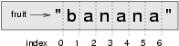

..  Copyright (C)  Peter Wentworth, Jeffrey Elkner, Allen B. Downey and Chris Meyers.
    Permission is granted to copy, distribute and/or modify this document
    under the terms of the GNU Free Documentation License, Version 1.3
    or any later version published by the Free Software Foundation;
    with Invariant Sections being Foreword, Preface, and Contributor List, no
    Front-Cover Texts, and no Back-Cover Texts.  A copy of the license is
    included in the section entitled "GNU Free Documentation License".

.. |rle_start| image:: illustrations/rle_start.png
   
.. |rle_end| image:: illustrations/rle_end.png
 
.. |rle_open| image:: illustrations/rle_open.png
   
.. |rle_close| image:: illustrations/rle_close.png    
 
|
    
Strings
=======

.. index:: compound data types, character, subscript operator, index

A compound data type
--------------------

So far we have seen built-in types like: ``int``, ``float``, 
``bool``, ``str`` and we've seen lists. 
Strings and lists are qualitatively different from the others because they
are made up of smaller pieces.  In the case of strings, they're made up of smaller
strings each containing one **character**.  

Types that comprise smaller pieces are called **compound data types**.
Depending on what we are doing, we may want to treat a compound data type as a
single thing, or we may want to access its parts. This ambiguity is useful.

Working with strings as single things
-------------------------------------

We previously saw that each turtle instance has its own attributes and 
a number of methods that can be applied to the instance.  For example,
we wrote ``tess.turn(90)``.  

Strings are also objects.  Each string instance has its own attributes and methods.  

For example::

    >>> ss = "Hello, World!"
    >>> tt = ss.upper()
    >>> tt
    'HELLO, WORLD'
    
`upper` is a method that can be invoked on any string object 
to create a new string, in which all the 
characters are in uppercase.  (The original string `ss` remains unchanged.)

There are also methods like `lower`, `capitalize`, and `swapcase` that do other interesting stuff.

To learn what methods are available, you can consult the Help documentation, look for 
the ``string`` module, and read the documentation.  Or, if you're a bit lazier, 
simply type the following into a PyScripter script::

    ss = "Hello, World!"
    tt = ss.
    
When you type the period to select one of the methods of `ss`, PyScripter will pop up a 
selection window showing all the methods (there are around 70 of them --- thank goodness we'll only
use a few of those!) that could be used on your string. 

.. image::  illustrations/string_methods.png
 
When you type the name of the method, some further help about it's parameter and return
type, and its docstring, will be displayed.  This is a good example of a tool --- PyScripter ---
using the meta-information --- the docstrings --- provided by the module programmers. 

.. image::  illustrations/swapcase.png

Working with the parts of a string
----------------------------------

The **indexing operator** (Python uses square brackets to enclose the index) 
selects a single character substring from a string:

.. sourcecode:: python
    
    >>> fruit = "banana"
    >>> m = fruit[1]
    >>> print(m)

The expression ``fruit[1]`` selects character number 1 from ``fruit``, and creates a new
string containing just this one character. The variable ``m`` refers to the result. 
When we display ``m``, we could get a surprise::

    a

For perverse reasons, computer scientists always start counting
from zero. The letter at subscript position zero of ``"banana"`` is ``b``.  So at
position ``[1]`` we have the letter ``a``.

If you want the zero-eth letter of a string, you just put 0, or any expression
with the value 0, in the brackets:

.. sourcecode:: python
    
    >>> m = fruit[0]
    >>> print(m)
    b

The expression in brackets is called an **index**. An index specifies a member
of an ordered collection, in this case the collection of characters in the string. The index
*indicates* which one you want, hence the name. It can be any integer
expression.

Note that indexing returns a *string* --- Python has no special type for a single character.
It is just a string of length 1.

We've also seen lists previously.  The same indexing notation works to extract elements from
a list::

    >>> prime_nums = [2, 3, 5, 7, 11, 13, 17, 19, 23, 29, 31]
    >>> prime_nums[4]
    11
    >>> friends = ["Joe", "Amy", "Brad", "Angelina", "Zuki", "Thandi", "Paris"]
    >>> friends[3]
    'Angelina'

.. index::
    single: len function
    single: function; len
    single: runtime error
    single: negative index
    single: index; negative

Length
------

The ``len`` function, when applied to a string, returns the number of characters in a string:

.. sourcecode:: python
    
    >>> fruit = "banana"
    >>> len(fruit)
    6

To get the last letter of a string, you might be tempted to try something like
this:

.. sourcecode:: python
    
    sz = len(fruit)
    last = fruit[sz]       # ERROR!

That won't work. It causes the runtime error
``IndexError: string index out of range``. The reason is that there is no
letter at index position 6 in ``"banana"``. 
Since we started counting at zero, the six indexes are
numbered 0 to 5. To get the last character, we have to subtract 1 from
``length``:

.. sourcecode:: python
    
    sz = len(fruit)
    last = fruit[sz-1]

Alternatively, we can use **negative indices**, which count backward from the
end of the string. The expression ``fruit[-1]`` yields the last letter,
``fruit[-2]`` yields the second to last, and so on.

As you might have guessed, indexing with a negative index also works like this for lists. 

.. index:: traversal, for loop, concatenation, abecedarian series

.. index::
    single: McCloskey, Robert
    single: Make Way for Ducklings    

Traversal and the ``for`` loop
------------------------------

A lot of computations involve processing a string one character at a time.
Often they start at the beginning, select each character in turn, do something
to it, and continue until the end. This pattern of processing is called a
**traversal**. One way to encode a traversal is with a ``while`` statement:

.. sourcecode:: python
    
    ix = 0
    while ix < len(fruit):
        letter = fruit[ix]
        print(letter)
        ix += 1

This loop traverses the string and displays each letter on a line by itself.
The loop condition is ``ix < len(fruit)``, so when ``ix`` is equal to the
length of the string, the condition is false, and the body of the loop is not
executed. The last character accessed is the one with the index
``len(fruit)-1``, which is the last character in the string.

But we've previously seen how the ``for`` loop can easily iterate over lists: ``for``
also works for strings:

.. sourcecode:: python
    
    for c in fruit:
        print(c)

Each time through the loop, the next character in the string is assigned to the
variable ``c``. The loop continues until no characters are left.

The following example shows how to use concatenation and a ``for`` loop to
generate an abecedarian series. Abecedarian refers to a series or list in which
the elements appear in alphabetical order. For example, in Robert McCloskey's
book *Make Way for Ducklings*, the names of the ducklings are Jack, Kack, Lack,
Mack, Nack, Ouack, Pack, and Quack.  This loop outputs these names in order:

.. sourcecode:: python
    
    prefixes = "JKLMNOPQ"
    suffix = "ack"
       
    for p in prefixes:
        print(p + suffix)

The output of this program is::
    
    Jack
    Kack
    Lack
    Mack
    Nack
    Oack
    Pack
    Qack

Of course, that's not quite right because Ouack and Quack are misspelled.
You'll fix this as an exercise below.

.. index:: slice, string slice

Slices
------

A substring of a string (or a list) is called a **slice**. Selecting a slice is similar to
selecting a character:

.. sourcecode:: python
    
    >>> s = "Peter, Paul, and Mary"
    >>> print(s[0:5])
    Peter
    >>> print(s[7:11])
    Paul
    >>> print(s[17:21])
    Mary
    >>> friends = ["Joe", "Amy", "Brad", "Angelina", "Zuki", "Thandi", "Paris"]
    >>> print(friends[2:4])
    ['Brad', 'Angelina']

The operator ``[n:m]`` returns the part of the string from the n'th character
to the m'th character, including the first but excluding the last. This
behavior is counter-intuitive; it makes more sense if you imagine the indices
pointing *between* the characters, as in the following diagram:

If you omit the first index (before the colon), the slice starts at the
beginning of the string. If you omit the second index, the slice goes to the
end of the string. Thus:

.. sourcecode:: python
    
    >>> fruit = "banana"
    >>> fruit[:3]
    'ban'
    >>> fruit[3:]
    'ana'

What do you think ``s[:]`` means?   What about ``friends[4:]``? 

.. index:: string comparison, comparison of strings

String comparison
-----------------

The comparison operators work on strings. To see if two strings are equal:

.. sourcecode:: python
    
    if word == "banana":
        print("Yes, we have no bananas!")

Other comparison operations are useful for putting words in
`lexigraphical order <http://en.wikipedia.org/wiki/Lexicographic_order>`__:

.. sourcecode:: python
    
    if word < "banana":
        print("Your word, " + word + ", comes before banana.")
    elif word > "banana":
        print("Your word, " + word + ", comes after banana.")
    else:
        print("Yes, we have no bananas!")

This is similar to the alphabetical order you would use with a dictionary,
except that all the uppercase letters come before all the lowercase letters. As
a result:

.. sourcecode:: python
    
    Your word, Zebra, comes before banana.

A common way to address this problem is to convert strings to a standard
format, such as all lowercase, before performing the comparison. A more
difficult problem is making the program realize that zebras are not fruit.

.. index:: mutable, immutable, runtime error

Strings are immutable
---------------------

It is tempting to use the ``[]`` operator on the left side of an assignment,
with the intention of changing a character in a string.  For example:

.. sourcecode:: python
    
    greeting = "Hello, world!"
    greeting[0] = 'J'            # ERROR!
    print(greeting)

Instead of producing the output ``Jello, world!``, this code produces the
runtime error ``TypeError: 'str' object does not support item assignment``.

Strings are **immutable**, which means you can't change an existing string. The
best you can do is create a new string that is a variation on the original:

.. sourcecode:: python
    
    greeting = "Hello, world!"
    newGreeting = 'J' + greeting[1:]
    print(newGreeting)

The solution here is to concatenate a new first letter onto a slice of
``greeting``. This operation has no effect on the original string.

.. index::
    single: in
    single: in operator
    single: operator; in

The ``in`` and ``not in`` operators
-----------------------------------

The ``in`` operator tests if one string is a substring of another:

.. sourcecode:: python
    
    >>> 'p' in 'apple'
    True
    >>> 'i' in 'apple'
    False
    >>> 'ap' in 'apple'
    True
    >>> 'pa' in 'apple'
    False

Note that a string is a substring of itself, and the empty string is a 
substring of any other string. (Also note that computer scientists 
like to think about these edge cases quite carefully!) 

.. sourcecode:: python
    
    >>> 'a' in 'a'
    True
    >>> 'apple' in 'apple'
    True
    >>> '' in 'a'
    True
    >>> '' in 'apple'
    True
    
The ``not in`` operator returns the logical opposite results of ``in``::

    >>> 'x' not in 'apple'
    True

Combining the ``in`` operator with string concatenation using ``+``, we can
write a function that removes all the vowels from a string:

.. sourcecode:: python
    
    def remove_vowels(s):
        vowels = "aeiouAEIOU"
        s_without_vowels = ""
        for x in s:
            if x not in vowels:
                s_without_vowels += x
        return s_without_vowels 
       
    test(remove_vowels("compsci"), "cmpsc")
    test(remove_vowels("aAbEefIijOopUus"), "bfjps")

.. index:: traversal, eureka traversal, pattern of computation,
           computation pattern

A ``find`` function
-------------------

What does the following function do?

.. sourcecode:: python
    
    def find(strng, ch):
        """
          Find and return the index of ch in strng.  
          Return -1 if ch does not occur in strng.
        """
        ix = 0
        while ix < len(strng):
            if strng[ix] == ch:
                return ix
            ix += 1
        return -1
        
    test(find("Compsci", "p"), 3)
    test(find("Compsci", "C"), 0)
    test(find("Compsci", "i"), 6)
    test(find("Compsci", "x"), -1)
    

In a sense, ``find`` is the opposite of the indexing operator. Instead of taking
an index and extracting the corresponding character, it takes a character and
finds the index where that character appears. If the character is not found,
the function returns ``-1``.

This is another example where we see a ``return`` statement inside a loop.
If ``strng[ix] == ch``, the function returns immediately, breaking out of
the loop prematurely.

If the character doesn't appear in the string, then the program exits the loop
normally and returns ``-1``.

This pattern of computation is sometimes called a eureka traversal because as
soon as we find what we are looking for, we can cry Eureka!  and stop looking.

.. index:: counting pattern

Looping and counting
--------------------

The following program counts the number of times the letter ``a`` appears in a
string, and is another example of the counter pattern introduced in
:ref:`counting`:

.. sourcecode:: python
    
    def count_a(text): 
        count = 0
        for c in text:
            if c == 'a':
                count += 1
        return(count)

    test(count_a("banana"), 3)    

.. index:: optional parameter, default value

.. _optional_parameters:

Optional parameters
-------------------

To find the locations of the second or third occurence of a character in a
string, we can modify the ``find`` function, adding a third parameter for the
starting postion in the search string:

.. sourcecode:: python
    
    def find2(strng, ch, start):
        ix = start 
        while ix < len(strng):
            if strng[ix] == ch:
                return ix
            ix += 1
        return -1
        
    test(find2('banana', 'a', 2), 3)

The call ``find2('banana', 'a', 2)`` now returns ``3``, the index of the first
occurrence of 'a' in 'banana' after index 2. What does
``find2('banana', 'n', 3)`` return? If you said, 4, there is a good chance you
understand how ``find2`` works.

Better still, we can combine ``find`` and ``find2`` using an
**optional parameter**:

.. sourcecode:: python
    
    def find(strng, ch, start=0):
        ix = start 
        while ix < len(strng):
            if strng[ix] == ch:
                return ix
            ix += 1
        return -1

The call ``find('banana', 'a', 2)`` to this version of ``find`` behaves just
like ``find2``, while in the call ``find('banana', 'a')``, ``start`` will be
set to the **default value** of ``0``.

Adding another optional parameter to ``find`` makes it search from a starting
position, up to but not including the end position:

.. sourcecode:: python
    
    def find(strng, ch, start=0, end=None):
        ix = start 
        if end == None:
           end = len(strng)
        while ix < end:
            if strng[ix] == ch:
                return ix
            ix += 1 
        return -1

The optional value for ``end`` is interesting: we give it a default value ``None`` if the
caller does not supply any argument.  In the body of the function we test what ``end`` is,
and if the caller did not supply any argument, we reassign ``end`` to be the length of the string.
If the caller has supplied an argument for ``end``, however, the caller's value will be used in the loop.

The semantics of ``start`` and ``end`` in this function are precisely the same as they are in
the ``range`` function.

Here are some test cases that should pass:: 

    ss = "Python strings have some interesting methods."
    test(find(ss, 's'), 7)
    test(find(ss, 's', 7), 7)
    test(find(ss, 's', 8), 13)
    test(find(ss, 's', 8, 13), -1)
    test(find(ss, '.'), len(ss)-1)

.. index:: module, string module, dir function, dot notation, function type,
           docstring

More ``string`` methods
-----------------------
 
Now that we've done all this work to write a powerful ``find`` function, we can let on that
there is already a ``find`` method that works on strings, with precisely these same semantics::

    test(ss.find('s'), 7)
    test(ss.find('s', 7), 7)
    test(ss.find('s', 8), 13)
    test(ss.find('s', 8, 13), -1)
    test(ss.find('.'), len(ss)-1)
    
Usually we'd prefer to use the methods that Python provides rather than reinvent
our own equivalents. But many of the available built-in functions and methods make good
teaching exercises, and the underlying techniques you learn are your building blocks
to becoming a proficient programmer.

The ``string`` module contains useful functions that manipulate strings.  As
usual, we have to import the module before we can use it.  We
can use the same trick as before: as we type the period, PyScripter will pop
up a selection list of the available attributes that can be accessed directly
through the module name (``string``).  Notice that these are different from
the methods that are attached to each string instance.

.. sourcecode:: python
    
    import string
    ...
    string.
    
Pops up these hints:

.. image:: illustrations/string_members.png

You will notice that there are different icons next to some items
in the list.  Recall that objects can have *attributes* (e.g. the
colour of a turtle's pen), and *methods* (functions that can be called
on the object).  The icon alongside  ``capwords`` indicates that this
is a method that can be called.  The icon alongside ``digits`` indicate
that this is an attribute.  It's value can be used directly::

    >>> string.digits
    '0123456789'
    >>> string.hexdigits
    '0123456789abcdefABCDEF'
    >>> string.capwords('the cat in the hat')
    'The Cat In The Hat'
    
Actually, the built-in ``find`` method is more general than our version. It can find
substrings, not just characters:

.. sourcecode:: python
    
    >>> "banana".find("na")
    2
    >>> "banana".find("na", 3)
    4

.. index:: character classification, uppercase, lowercase, dot notation,
           whitespace, string module, Python Library Reference

Character classification
------------------------

It is often helpful to examine a character and test whether it is upper- or
lowercase, or whether it is a character or a digit. The ``string`` module
provides several constants that are useful for these purposes. One of these,
``string.digits``, we have already seen.

The string ``string.ascii_lowercase`` contains all of the ascii letters that the system
considers to be lowercase. Similarly, ``string.ascii_uppercase`` contains all of the
uppercase letters. ``string.punctuation`` comprises all the characters considered
to be punctuation. Try the following and see what you get:

.. sourcecode:: python
    
    print(string.ascii_lowercase)
    print(string.ascii_uppercase)
    print(string.digits)
    print(string.punctuation)

We can use these constants and their ``find`` methods to classify characters. For example, if
``string.ascii_lowercase.find(ch)`` returns a value other than ``-1``, then ``ch`` must be
lowercase:

Another constant defined in the ``string`` module may surprise you when you
print it:

.. sourcecode:: python
    
    >>> print(string.whitespace)
    
**Whitespace** characters move the cursor without printing anything.  They
create the white space between visible characters (at least on white paper).
The constant ``string.whitespace`` contains all the whitespace characters,
including space, tab (``\t``), and newline (``\n``).

While we could use ``find`` and these constants, there are also string methods 
that are much more convenient for classifing the string, for example::
    
    >>> "2".isdigit()
    True
    >>> "x".isprintable()
    True
    >>> "?".ispunctuation()
    Traceback (most recent call last):
    File "<interactive input>", line 1, in <module>
    AttributeError: 'str' object has no attribute 'ispunctuation'

Oops!  It seems they forgot to create a method for the last one.  We'll need to do this one the long way.  
So let's use these to remove all punction from a string, similar to our
previous example where we removed all vowels::

    import string
        
    def remove_punctuation(s):
        s_without_punct = ""
        for letter in s:
            if letter not in string.punctuation:
                s_without_punct += letter
        return s_without_punct

    test(remove_punctuation('"Well, I never did!", said Alice.'),
                                "Well I never did said Alice")
    test(remove_punctuation("Are you very, very, sure?"),
                                 "Are you very very sure")
                                 
One of the most useful methods on strings is the ``split`` method:
it splits a single multi-word string into a list of individual words, removing
all the whitespace between them.  
    
    >>> ss = remove_punctuation('"Well, I never did!", said Alice.')
    >>> wds = ss.split()
    >>> wds
    ['Well', 'I', 'never', 'did', 'said', 'Alice']

There are other useful functions in the ``string`` module, and other
methods on string instances, but this book isn't
intended to be a reference manual. On the other hand, the *Python Library
Reference* is. Along with a wealth of other documentation, it's available from
the Python website, `http://www.python.org <http://www.python.org>`__.

.. index:: string formating, operations on strings

The format method for strings
-----------------------------
 
The easiest and most powerful way to format a string in Python 3 is to use the
*format* method.  To see how this works, let's start with a few examples:

.. sourcecode:: python
    :linenos:
    
    s1 = "His name is {0}!".format("Arthur")
    print(s1)

    name = "Alice"
    age = 10
    s2 = "I am {0} and I am {1} years old.".format(name, age)
    print(s2)

    n1 = 4
    n2 = 5
    s3 = "2**10 = {0} and {1} * {2} = {3:f}".format(2**10, n1, n2, n1 * n2)
    print(s3)
    
Running the script produces::

    His name is Arthur!
    I am Alice and I am 10 years old.
    2**10 = 1024 and 4 * 5 = 20.000000

The key idea is that one provides a *formatter string* which
contains embedded *placeholder fields*, ``... {0} ... {1} ... {2} ...`` etc.
The **format method** of a string uses the numbers as indexes into
its arguments, and substitutes the appropriate argument into each
placeholder fields.  

Each of the placeholders can optionally contain an additional **format specification** ---
it is always introduced by the ``:`` symbol.  This can control things like

* whether the field is aligned left ``<``, centered ``^``, or right ``>``
* the width allocated to the field within the result string (a number like ``10``)
* the type of conversion (we'll initially only force conversion to float, ``f``, as we did in
  line 11 of the code above, or perhaps we'll ask integer numbers to be converted to hexadecimal using ``x``)
* if the type conversion is a float, you can also specify how many decimal places are wanted 
  (typically, ``.2f`` is useful for working with currencies to two decimal places.)

Let's do a few simple and common examples that should be enough for most needs.  If you need to
do anything more esoteric, use *help* and read all the gory details.

.. sourcecode:: python

    n1 = "Paris"
    n2 = "Whitney"
    n3 = "Hilton"

    print("The value of pi to three decimal places is {0:.3f}".format(3.1415926))
    print("123456789 123456789 123456789 123456789 123456789 123456789")
    print("|||{0:<15}|||{1:^15}|||{2:>15}|||Born in {3}|||".format(n1,n2,n3,1981))
    print("The decimal value {0} converts to hex value {0:x}".format(123456))

This script produces the output::

    The value of pi to three decimal places is 3.142
    123456789 123456789 123456789 123456789 123456789 123456789
    |||Paris          |||    Whitney    |||         Hilton|||Born in 1981|||
    The decimal value 123456 converts to hex value 1e240
    
You can have multiple placeholders indexing the
same argument, or perhaps even have extra arguments that are not referenced
at all:

.. sourcecode:: python

    letter = """
    Dear {0} {2}.
     {0}, I have an interesting money-making proposition for you!
     If you deposit $10 million into my bank account I can double your money ...
    """

    print(letter.format("Paris", "Whitney", "Hilton"))
    print(letter.format("Bill", "Henry", "Gates"))
    
This produces the following::

    Dear Paris Hilton.
         Paris, I have an interesting money-making proposition for you!
         If you deposit $10 million into my bank account I can double your money ...

    Dear Bill Gates.
         Bill, I have an interesting money-making proposition for you!
         If you deposit $10 million into my bank account I can double your money ...

As you might expect, you'll get an index error if 
your placeholders refer to arguments that you do not provide::

    >>> "hello {3}".format("Dave")
    Traceback (most recent call last):
      File "<interactive input>", line 1, in <module>
    IndexError: tuple index out of range
    
The following example illustrates the real utility of string formatting:

.. sourcecode:: python
    
    print("i\ti**2\ti**3\ti**5\ti**10\ti**20")
    for i in range(1, 11):
        print(i, '\t', i**2, '\t', i**3, '\t', i**5, '\t', i**10, '\t', i**20)

This program prints out a table of various powers of the numbers from 1 to 10.
(This assumes that the tab width is 8.  You might see
something even worse than this if you tab width is set to 4.)
In its current form it relies on the tab character ( ``\t``) to align the
columns of values, but this breaks down when the values in the table get larger
than the tab width::
    
    i       i**2    i**3    i**5    i**10   i**20
    1       1       1       1       1       1
    2       4       8       32      1024    1048576
    3       9       27      243     59049   3486784401
    4       16      64      1024    1048576         1099511627776
    5       25      125     3125    9765625         95367431640625
    6       36      216     7776    60466176        3656158440062976
    7       49      343     16807   282475249       79792266297612001
    8       64      512     32768   1073741824      1152921504606846976
    9       81      729     59049   3486784401      12157665459056928801
    10      100     1000    100000  10000000000     100000000000000000000

One possible solution would be to change the tab width, but the first column
already has more space than it needs. The best solution would be to set the
width of each column independently. As you may have guessed by now, string
formatting provides the solution.  We can also right-justify each field:

.. sourcecode:: python
        
    layout = "{0:>4}{1:>6}{2:>6}{3:>8}{4:>13}{5:>24}"

    print(layout.format('i', 'i**2', 'i**3', 'i**5', 'i**10', 'i**20'))
    for i in range(1, 11):
        print(layout.format(i, i**2, i**3, i**5, i**10, i**20))
 

Running this version produces the following output::
    
   i  i**2  i**3    i**5        i**10                   i**20
   1     1     1       1            1                       1
   2     4     8      32         1024                 1048576
   3     9    27     243        59049              3486784401
   4    16    64    1024      1048576           1099511627776
   5    25   125    3125      9765625          95367431640625
   6    36   216    7776     60466176        3656158440062976
   7    49   343   16807    282475249       79792266297612001
   8    64   512   32768   1073741824     1152921504606846976
   9    81   729   59049   3486784401    12157665459056928801
  10   100  1000  100000  10000000000   100000000000000000000

Summary 
------- 

This chapter introduced a lot of new ideas.  The following summary 
may prove helpful in remembering what you learned.

.. glossary::

    indexing (``[]``)
        Access a single character in a string using its position (starting from
        0).  Example: ``'This'[2]`` evaluates to ``'i'``.

    length function (``len``)
        Returns the number of characters in a string.  Example:
        ``len('happy')`` evaluates to ``5``.

    for loop traversal (``for``)
        *Traversing* a string means accessing each character in the string, one
        at a time.  For example, the following for loop:

        .. sourcecode:: python

            for ix in 'Example':
                ...

        executes the body of the loop 7 times with different values of `ix` each time.

    slicing (``[:]``)
        A *slice* is a substring of a string. Example: ``'bananas and
        cream'[3:6]`` evaluates to ``ana`` (so does ``'bananas and
        cream'[1:4]``).

    string comparison (``>, <, >=, <=, ==, !=``)
        The six common comparision operators work with strings, evaluating according to
        `lexigraphical order
        <http://en.wikipedia.org/wiki/Lexicographic_order>`__.  Examples:
        ``'apple' < 'banana'`` evaluates to ``True``.  ``'Zeta' < 'Appricot'
        evaluates to ``False``.  ``'Zebra' <= 'aardvark'`` evaluates to
        ``True`` because all upper case letters precede lower case letters.

    in and not in operator (``in``, ``not in``)
        The ``in`` operator tests whether one string is contained
        inside another string.  Examples: ``'heck' in "I'll be checking for
        you."`` evaluates to ``True``.  ``'cheese' in "I'll be checking for
        you."`` evaluates to ``False``.

Glossary
--------

.. glossary::

    compound data type
        A data type in which the values are made up of components, or elements,
        that are themselves values.

    default value
        The value given to an optional parameter if no argument for it is
        provided in the function call.

    docstring
        A string constant on the first line of a function or module definition
        (and as we will see later, in class and method definitions as well).
        Docstrings provide a convinient way to associate documentation with
        code. Docstrings are also used by the ``doctest`` module for automated
        testing.

    dot notation
        Use of the **dot operator**, ``.``, to access functions inside a
        module, or to access methods and attributes of an object.

    immutable
        A compound data type whose elements can not be assigned new values.

    index
        A variable or value used to select a member of an ordered collection, such as
        a character from a string, or an element from a list.

    optional parameter
        A parameter written in a function header with an assignment to a
        default value which it will receive if no corresponding argument is
        given for it in the function call.

    slice
        A part of a string (substring) specified by a range of indices. More
        generally, a subsequence of any sequence type in Python can be created
        using the slice operator (``sequence[start:stop]``).

    traverse
        To iterate through the elements of a collection, performing a similar
        operation on each.

    whitespace
        Any of the characters that move the cursor without printing visible
        characters. The constant ``string.whitespace`` contains all the
        white-space characters.

Exercises
---------

We suggest you create a single file containing the test scaffolding from our previous chapters,
and put all functions that require tests into that file. 

#. What is the result of each of the following::

    >>> 'Python'[1]
    >>> "Strings are sequences of characters."[5]
    >>> len("wonderful")
    >>> 'Mystery'[:4]
    >>> 'p' in 'Pinapple'
    >>> 'apple' in 'Pinapple'
    >>> 'pear' not in 'Pinapple'
    >>> 'apple' > 'pinapple'
    >>> 'pinapple' < 'Peach'
    
#. Modify:

   .. sourcecode:: python
    
       prefixes = "JKLMNOPQ"
       suffix = "ack"
       
       for letter in prefixes:
           print(letter + suffix)

   so that ``Ouack`` and ``Quack`` are spelled correctly.
   
#. Encapsulate

   .. sourcecode:: python
    
       fruit = "banana"
       count = 0
       for char in fruit:
           if char == 'a':
               count += 1
       print(count)

   in a function named ``count_letters``, and generalize it so that it accepts
   the string and the letter as arguments.  Make the function return the number
   of characters, rather than print the answer.  The caller should do the printing.
     
#. Now rewrite the ``count_letters`` function so that instead of traversing the 
   string, it repeatedly calls the ``find`` method, with the optional third parameter 
   to locate new occurences of the letter being counted.
   
#. Assign to a variable in your program a triple-quoted string that contains 
   your favourite paragraph of text - perhaps a poem, a speech, instructions
   to bake a cake, some inspirational verses, etc.

   Write a function which removes all punctuation from string, breaks the string
   into a list of words, and counts the number of words in your text that contain
   the letter 'e'.  Your program should print an analysis of the text like this::

       Your text contains 243 words, of which 109 (44.8%) contain an 'e'.      

#. Print out a neatly formatted multiplication table, up to 12 x 12.

#. Write a function that reverses its string argument, and satisfies these tests::

      test(reverse('happy'), 'yppah')
      test(reverse('Python'), 'nohtyP')
      test(reverse(''), '')
      test(reverse('a'), 'a')
   
#. Write a function that mirrors its argument:: 

       test(mirror('good'), 'gooddoog')
       test(mirror('Python'), 'PythonnohtyP')
       test(mirror(''), '')
       test(mirror('a'), 'aa')

#. Write a function that removes all occurrences of a given letter from a string::
    
        test(remove_letter('a', 'apple'), 'pple')
        test(remove_letter('a', 'banana'), 'bnn')
        test(remove_letter('z', 'banana'), 'banana')
        test(remove_letter('i', 'Mississippi'), 'Msssspp')
        test(remove_letter('b', ''), '')
        test(remove_letter('b', 'c'), '')

#. Write a function that recognizes palindromes. (Hint: use your ``reverse`` function to make this easy!)::

       test(is_palindrome('abba'), True)
       test(is_palindrome('abab'), False)
       test(is_palindrome('tenet'), True)
       test(is_palindrome('banana'), False)
       test(is_palindrome('straw warts'), True)
       test(is_palindrome('a'), True)
       test(is_palindrome(''), ??)    # Is an empty string a palindrome?

#. Write a function that counts how many times a substring occurs in a string::  
   
       test(count('is', 'Mississippi'), 2)
       test(count('an', 'banana'), 2)
       test(count('ana', 'banana'), 2)
       test(count('nana', 'banana'), 1)
       test(count('nanan', 'banana'), 0)
       test(count('aaa', 'aaaaaa'), 4)
   
#. Write a function that removes the first occurrence of a string from another string::

        test(remove('an', 'banana'), 'bana')
        test(remove('cyc', 'bicycle'), 'bile')
        test(remove('iss', 'Mississippi'), 'Missippi')
        test(remove('egg', 'bicycle'), 'bicycle')
 
#. Write a function that removes all occurrences of a string from another string::
 
        test(remove_all('an', 'banana'), 'ba')
        test(remove_all('cyc', 'bicycle'), 'bile')
        test(remove_all('iss', 'Mississippi'), 'Mippi')
        test(remove_all('eggs', 'bicycle'), 'bicycle')

  