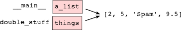

..  Copyright (C)  Peter Wentworth, Jeffrey Elkner, Allen B. Downey and Chris Meyers.
    Permission is granted to copy, distribute and/or modify this document
    under the terms of the GNU Free Documentation License, Version 1.3
    or any later version published by the Free Software Foundation;
    with Invariant Sections being Foreword, Preface, and Contributor List, no
    Front-Cover Texts, and no Back-Cover Texts.  A copy of the license is
    included in the section entitled "GNU Free Documentation License".

.. |rle_start| image:: illustrations/rle_start.png
   
.. |rle_end| image:: illustrations/rle_end.png
 
.. |rle_open| image:: illustrations/rle_open.png
   
.. |rle_close| image:: illustrations/rle_close.png    
 
|    
    
.. index:: list, element, sequence, collection    
    
Lists
=====

A **list** is an ordered set of values, where each value is identified by an
index. The values that make up a list are called its **elements**. Lists are
similar to strings, which are ordered collections of characters, except that the
elements of a list can have any type.  Lists and strings --- and other things
that behave like ordered sets --- are called **sequences**.

.. index:: nested list, list; nested

List values
-----------

There are several ways to create a new list; the simplest is to enclose the
elements in square brackets ( ``[`` and ``]``):

.. sourcecode:: python
    
    [10, 20, 30, 40]
    ["spam", "bungee", "swallow"]

The first example is a list of four integers. The second is a list of three
strings. The elements of a list don't have to be the same type.  The following
list contains a string, a float, an integer, and
(amazingly) another list:

.. sourcecode:: python
    
    ["hello", 2.0, 5, [10, 20]]

A list within another list is said to be **nested**.

Finally, there is a special list that contains no elements. It is called the
empty list, and is denoted ``[]``.

With all these ways to create lists, it would be disappointing if we couldn't
assign list values to variables or pass lists as parameters to functions. We
have already seen that we can:

.. sourcecode:: python
    
    >>> vocabulary = ["ameliorate", "castigate", "defenestrate"]
    >>> numbers = [17, 123]
    >>> empty = []
    >>> print(vocabulary, numbers, empty)
    ['ameliorate', 'castigate', 'defenestrate'] [17, 123] []

.. _accessing-elements:

.. index:: list index, index, list traversal

Accessing elements
------------------

The syntax for accessing the elements of a list is the same as the syntax for
accessing the characters of a string---the index operator ( ``[]`` -- not to
be confused with an empty list). The expression inside the brackets specifies
the index. Remember that the indices start at 0:

.. sourcecode:: python
    
    >>> numbers[0]
    17

Any integer expression can be used as an index:

.. sourcecode:: python

    >>> numbers[9-8]
    5
    >>> numbers[1.0]
    Traceback (most recent call last):
      File "<interactive input>", line 1, in <module>
    TypeError: list indices must be integers, not float

If you try to access or assign to an element that does not exist, you get a runtime
error:

.. sourcecode:: python

    >>> numbers[2]
    Traceback (most recent call last):
      File "<interactive input>", line 1, in <module>
    IndexError: list index out of range

If an index has a negative value, it counts backward from the end of
the list:

.. sourcecode:: python

    
    >>> numbers[-1]
    5
    >>> numbers[-2]
    17
    >>> numbers[-3]
    Traceback (most recent call last):
      File "<interactive input>", line 1, in <module>
    IndexError: list index out of range

``numbers[-1]`` is the last element of the list, ``numbers[-2]`` is the second
to last, and ``numbers[-3]`` doesn't exist.

It is common to use a loop variable as a list index.

.. sourcecode:: python
    
    horsemen = ["war", "famine", "pestilence", "death"]

    for i in range(4):
        print(horsemen[i])

Each time through the loop, the variable ``i`` is used as an index into the
list, printing the ``i``-eth element. This pattern of computation is called a
**list traversal**.

The above sample doesn't need or use the index ``i`` for anything, so this  
even simpler version might be preferred:

.. sourcecode:: python
    
    horsemen = ["war", "famine", "pestilence", "death"]

    for h in horsemen:
        print(h)

        

List length
-----------

The function ``len`` returns the length of a list, which is equal to the number
of its elements. It is a good idea to use this value as the upper bound of a
loop instead of a constant. That way, if the size of the list changes, you
won't have to go through the program changing all the loops; they will work
correctly for any size list:

.. sourcecode:: python
    
    horsemen = ["war", "famine", "pestilence", "death"]
       
    for i in range(len(horsemen)):
        print(horsemen[i])

    
The last time the body of the loop is executed, ``i`` is ``len(horsemen) - 1``, 
which is the index of the last element. Of course, the version in the previous
section that didn't use any index looks even more attractive now: it doesn't need
any adjustments if extra elements are added to the list.

Although a list can contain another list, the nested list still counts as a
single element in its parent list. The length of this list is 4:

.. sourcecode:: python
    
    ['spam!', 1, ['Brie', 'Roquefort', 'Pol le Veq'], [1, 2, 3]]

List membership
---------------

``in`` and ``not in`` are boolean operators that tests membership in a sequence. We
used them previously with strings, but they also work with lists and
other sequences:

.. sourcecode:: python
    
    >>> horsemen = ['war', 'famine', 'pestilence', 'death']
    >>> 'pestilence' in horsemen
    True
    >>> 'debauchery' in horsemen
    False
   >>> 'debauchery' not in horsemen
    True

List operations
---------------

The ``+`` operator concatenates lists:

.. sourcecode:: python
    
    >>> a = [1, 2, 3]
    >>> b = [4, 5, 6]
    >>> c = a + b
    >>> c
    [1, 2, 3, 4, 5, 6]

Similarly, the ``*`` operator repeats a list a given number of times:

.. sourcecode:: python
    
    >>> [0] * 4
    [0, 0, 0, 0]
    >>> [1, 2, 3] * 3
    [1, 2, 3, 1, 2, 3, 1, 2, 3]

The first example repeats ``[0]`` four times. The second example repeats the
list ``[1, 2, 3]`` three times.

List slices
-----------

The slice operations we saw with strings also work on lists:

.. sourcecode:: python
    
    >>> a_list = ['a', 'b', 'c', 'd', 'e', 'f']
    >>> a_list[1:3]
    ['b', 'c']
    >>> a_list[:4]
    ['a', 'b', 'c', 'd']
    >>> a_list[3:]
    ['d', 'e', 'f']
    >>> a_list[:]
    ['a', 'b', 'c', 'd', 'e', 'f']

.. index:: mutable, item assignment, immutable
    
Lists are mutable
-----------------

Unlike strings, lists are **mutable**, which means we can change their
elements. Using the bracket operator on the left side of an assignment, we can
update one of the elements:

.. sourcecode:: python
    
    >>> fruit = ["banana", "apple", "quince"]
    >>> fruit[0] = "pear"
    >>> fruit[-1] = "orange"
    >>> fruit
    ['pear', 'apple', 'orange']

The bracket operator applied to a list can appear anywhere in an expression.
When it appears on the left side of an assignment, it changes one of the
elements in the list, so the first element of ``fruit`` has been changed from
``'banana'`` to ``'pear'``, and the last from ``'quince'`` to ``'orange'``. An
assignment to an element of a list is called **item assignment**. Item
assignment does not work for strings:

.. sourcecode:: python
    
    >>> my_string = 'TEST'
    >>> my_string[2] = 'X'
    Traceback (most recent call last):
      File "<interactive input>", line 1, in <module>
    TypeError: 'str' object does not support item assignment

but it does for lists:

.. sourcecode:: python
    
    >>> my_list = ['T', 'E', 'S', 'T']
    >>> my_list[2] = 'X'
    >>> my_list
    ['T', 'E', 'X', 'T']

With the slice operator we can update several elements at once:

.. sourcecode:: python
    
    >>> a_list = ['a', 'b', 'c', 'd', 'e', 'f']
    >>> a_list[1:3] = ['x', 'y']
    >>> a_list
    ['a', 'x', 'y', 'd', 'e', 'f']

We can also remove elements from a list by assigning the empty list to them:

.. sourcecode:: python
    
    >>> a_list = ['a', 'b', 'c', 'd', 'e', 'f']
    >>> a_list[1:3] = []
    >>> a_list
    ['a', 'd', 'e', 'f']

And we can add elements to a list by squeezing them into an empty slice at the
desired location:

.. sourcecode:: python
    
    >>> a_list = ['a', 'd', 'f']
    >>> a_list[1:1] = ['b', 'c']
    >>> a_list
    ['a', 'b', 'c', 'd', 'f']
    >>> a_list[4:4] = ['e']
    >>> a_list
    ['a', 'b', 'c', 'd', 'e', 'f']

.. index:: del statement, statement; del

List deletion
-------------

Using slices to delete list elements can be awkward, and therefore error-prone.
Python provides an alternative that is more readable.

The ``del`` statement removes an element from a list:

.. sourcecode:: python
    
    >>> a = ['one', 'two', 'three']
    >>> del a[1]
    >>> a
    ['one', 'three']

As you might expect, ``del`` handles negative indices and causes a runtime
error if the index is out of range.

You can use a slice as an index for ``del``:

.. sourcecode:: python
    
    >>> a_list = ['a', 'b', 'c', 'd', 'e', 'f']
    >>> del a_list[1:5]
    >>> a_list
    ['a', 'f']

As usual, slices select all the elements up to, but not including, the second
index.

.. index:: is operator, objects and values

Objects and values
------------------

If we execute these assignment statements,

.. sourcecode:: python
    
    a = "banana"
    b = "banana"

we know that ``a`` and ``b`` will refer to a string with the letters
``"banana"``. But we don't know yet whether they point to the *same* string.

There are two possible ways the Python interpreter could arrange its internal states:

.. image:: illustrations/list1.png
   :alt: List illustration 

In one case, ``a`` and ``b`` refer to two different things that have the same
value. In the second case, they refer to the same thing. These things have
names --- they are called **objects**. An object is something a variable can
refer to.

We can test whether two names refer to the same object using the *is*
operator: 

.. sourcecode:: python

    >>> a is b
    True

This tells us that both ``a`` and ``b`` refer to the same object, and that it
is the second of the two state snapshots that describes the relationship. 

Since strings are *immutable*, Python optimizes resources by making two names
that refer to the same string value refer to the same object.

This is not the case with lists:

.. sourcecode:: python
    
    >>> a = [1, 2, 3]
    >>> b = [1, 2, 3]
    >>> a == b
    True
    >>> a is b
    False   

The state snapshot here looks like this:

.. image:: illustrations/mult_references2.png
   :alt: State snapshot for equal different lists 

``a`` and ``b`` have the same value but do not refer to the same object.

.. index:: aliases

Aliasing
--------

Since variables refer to objects, if we assign one variable to another, both
variables refer to the same object:

.. sourcecode:: python
    
    >>> a = [1, 2, 3]
    >>> b = a
    >>> id(a) == id(b)
    True
    
In this case, the state snapshot looks like this:

.. image:: illustrations/mult_references3.png
   :alt: State snapshot for multiple references (aliases) to a list 

Because the same list has two different names, ``a`` and ``b``, we say that it
is **aliased**. Changes made with one alias affect the other:

.. sourcecode:: python
    
    >>> b[0] = 5
    >>> a
    [5, 2, 3]

Although this behavior can be useful, it is sometimes unexpected or
undesirable. In general, it is safer to avoid aliasing when you are working
with mutable objects. Of course, for immutable objects, there's no problem.
That's why Python is free to alias strings when it sees an opportunity to
economize.

.. index:: clone

Cloning lists
-------------

If we want to modify a list and also keep a copy of the original, we need to be
able to make a copy of the list itself, not just the reference. This process is
sometimes called **cloning**, to avoid the ambiguity of the word copy.

The easiest way to clone a list is to use the slice operator:

.. sourcecode:: python
    
    >>> a = [1, 2, 3]
    >>> b = a[:]
    >>> b
    [1, 2, 3]

Taking any slice of ``a`` creates a new list. In this case the slice happens to
consist of the whole list.

Now we are free to make changes to ``b`` without worrying about ``a``:

.. sourcecode:: python
    
    >>> b[0] = 5
    >>> a
    [1, 2, 3]

.. index:: for loop, enumerate

.. index:: for loop

Lists and ``for`` loops
-----------------------

The ``for`` loop also works with lists, as we've already seen. The generalized syntax of a ``for``
loop is:

.. sourcecode:: python
    
    for VARIABLE in LIST:
        BODY

So, as we've seen
        
.. sourcecode:: python

    friends = ["Joe", "Amy", "Brad", "Angelina", "Zuki", "Thandi", "Paris"]
    for friend in friends:
        print(friend)

It almost reads like English: For (every) friend in (the list of) friends,
print (the name of the) friend.

Any list expression can be used in a ``for`` loop:

.. sourcecode:: python
    
    for number in range(20):
        if number % 3 == 0:
            print(number)
       
    for fruit in ["banana", "apple", "quince"]:
        print("I like to eat " + fruit + "s!")

The first example prints all the multiples of 3 between 0 and 19. The second
example expresses enthusiasm for various fruits.

Since lists are mutable, it is often desirable to traverse a list, modifying
each of its elements. The following squares all the numbers from ``1`` to
``5``:

.. sourcecode:: python

    numbers = [1, 2, 3, 4, 5]
    
    for i in range(len(numbers)):
        numbers[i] = numbers[i]**2

Take a moment to think about ``range(len(numbers))`` until you understand how
it works. We are interested here in both the *value* and its *index* within the
list, so that we can assign a new value to it.

This pattern is common enough that Python provides a nicer way to implement it:

.. sourcecode:: python
    
    numbers = [1, 2, 3, 4, 5]
    
    for i, value in enumerate(numbers):
        numbers[i] = value**2

``enumerate`` generates both the index and the value associated with it during
the list traversal. Try this next example to see more clearly how ``enumerate``
works:

.. sourcecode:: python
    
    >>> for i, value in enumerate(['banana', 'apple', 'pear', 'quince']):
    ...    print(i, value)
    ...
    0 banana
    1 apple
    2 pear
    3 quince
    >>>

.. index:: parameter

List parameters
---------------

Passing a list as an argument actually passes a reference to the list, not a
copy of the list. Since lists are mutable changes made to the 
elements referenced by the parameter change
the same list that the argument is referencing. 
For example, the function below takes a list as an
argument and multiplies each element in the list by 2:

.. sourcecode:: python
    
    def double_stuff(a_list):
        """ Overwrite each element in a_list with double its value. """
        for index, value in enumerate(a_list):
            a_list[index] = 2 * value

If we add the following onto our script:

.. sourcecode:: python

    things = [2, 5, 9]
    double_stuff(things)
    print(things)
    
When we run it we'll get::

    [4, 10, 18]

The parameter ``a_list`` and the variable ``things`` are aliases for the
same object.  

   
Since the list object is shared by two frames, we drew it between them.

If a function modifies the elements of a list parameter, the caller sees the change.

.. admonition::  Use the Python visualizer!

    We've earlier mentioned the Python visualizer at http://netserv.ict.ru.ac.za/python3_viz.
    It is a very useful tool for building a good understanding of aliases, assignments,
    and passing arguments to functions.  

.. index:: list; append
    
List methods
------------

The dot operator can also be used to access built-in methods of list objects.  

.. sourcecode:: python
    
    >>> mylist = []
    >>> mylist.append(5)
    >>> mylist.append(27)
    >>> mylist.append(3)
    >>> mylist.append(12)
    >>> mylist
    [5, 27, 3, 12]
    >>>

``append`` is a list method which adds the argument passed to it to the end of
the list. Continuing with this example, we show several other list methods:

.. sourcecode:: python
    
    >>> mylist.insert(1, 12)
    >>> mylist
    [5, 12, 27, 3, 12]
    >>> mylist.count(12)
    2
    >>> mylist.extend([5, 9, 5, 11])
    >>> mylist
    [5, 12, 27, 3, 12, 5, 9, 5, 11])
    >>> mylist.index(9)
    6
    >>> mylist.count(5)
    3
    >>> mylist.reverse()
    >>> mylist
    [11, 5, 9, 5, 12, 3, 27, 12, 5]
    >>> mylist.sort()
    >>> mylist
    [3, 5, 5, 5, 9, 11, 12, 12, 27]
    >>> mylist.remove(12)
    >>> mylist
    [3, 5, 5, 5, 9, 11, 12, 27]
    >>>

Experiment with the list methods shown here, and read their documentation until you feel confident that
you understand how they work.

.. index:: side effect, modifier

.. _pure-func-mod:

Pure functions and modifiers
----------------------------

Functions which take lists as arguments and change them during execution are
called **modifiers** and the changes they make are called **side effects**.

A **pure function** does not produce side effects. It communicates with the
calling program only through parameters, which it does not modify, and a return
value. Here is ``double_stuff`` written as a pure function:

.. sourcecode:: python
    
    def double_stuff(a_list):
        """ Return a new list in which contains doubles of the elements in a_list. """
        new_list = []
        for value in a_list:
            new_elem = 2 * value
            new_list.append(new_elem)
        return new_list

This version of ``double_stuff`` does not change its arguments:

.. sourcecode:: python
    
    >>> from ch09 import double_stuff
    >>> things = [2, 5, 9]
    >>> double_stuff(things)
    [4, 10, 18]
    >>> things
    [2, 5, 18]
    >>>

To use the pure function version of ``double_stuff`` to modify ``things``,
you would assign the return value back to ``things``:

.. sourcecode:: python
    
    >>> things = double_stuff(things)
    >>> things
    [4, 10, 'SpamSpam', 19.0]
    >>>        
        

Which is better?
----------------

Anything that can be done with modifiers can also be done with pure functions.
In fact, some programming languages only allow pure functions. There is some
evidence that programs that use pure functions are faster to develop and less
error-prone than programs that use modifiers. Nevertheless, modifiers are
convenient at times, and in some cases, functional programs are less efficient.

In general, we recommend that you write pure functions whenever it is
reasonable to do so and resort to modifiers only if there is a compelling
advantage. This approach might be called a *functional programming style*.

Functions that produce lists
----------------------------

The pure version of ``double_stuff`` above made use of an 
important **pattern** for your toolbox. Whenever you need to
write a function that creates and returns a list, the pattern is
usually::

    initialize a result variable to be an empty list
    loop
       create a new element 
       append it to result
    return the result

Let us show another use of this pattern.  Assuming you already have a function
``is_prime(x)`` that can test if x is prime.  Write a function
to return a list of all prime numbers less than n::

   def primes_upto(n):
       """ Return a list of all prime numbers less than n. """
       result = []
       for i in range(2, n):
           if is_prime(i):
               result.append(i)
       return result

.. index:: nested list, list; nested
       
Nested lists
------------

A nested list is a list that appears as an element in another list. In this
list, the element with index 3 is a nested list:

.. sourcecode:: python
    
    >>> nested = ["hello", 2.0, 5, [10, 20]]

If we print(``nested[3]``), we get ``[10, 20]``. To extract an element from the
nested list, we can proceed in two steps:

.. sourcecode:: python
    
    >>> elem = nested[3]
    >>> elem[0]
    10

Or we can combine them:

.. sourcecode:: python
    
    >>> nested[3][1]
    20

Bracket operators evaluate from left to right, so this expression gets the
three-eth element of ``nested`` and extracts the one-eth element from it.

.. index:: matrix

Matrices
--------

Nested lists are often used to represent matrices. For example, the matrix:

might be represented as:

.. sourcecode:: python
    
    >>> matrix = [[1, 2, 3], [4, 5, 6], [7, 8, 9]]

``matrix`` is a list with three elements, where each element is a row of the
matrix. We can select an entire row from the matrix in the usual way:

.. sourcecode:: python
    
    >>> matrix[1]
    [4, 5, 6]

Or we can extract a single element from the matrix using the double-index form:

.. sourcecode:: python
    
    >>> matrix[1][1]
    5

The first index selects the row, and the second index selects the column.
Although this way of representing matrices is common, it is not the only
possibility. A small variation is to use a list of columns instead of a list of
rows. Later we will see a more radical alternative using a dictionary.

.. index:: Test-driven development, scaffolding

Test-driven development (TDD)
-----------------------------

**Test-driven development (TDD)** is a software development practice which
arrives at a desired feature through a series of small, iterative steps
motivated by automated tests which are *written first* that express increasing
refinements of the desired feature.

Unit tests enable us to easily demonstrate TDD. Let's say we want a function
which creates a ``rows`` by ``columns`` matrix given arguments for ``rows`` and
``columns``.

We first setup a skeleton for this function, and add some test cases.  We assume
the test scaffolding from the earlier chapters is also included:

.. sourcecode:: python
    
    def make_matrix(rows, columns):
        """ 
          Create an empty matrix, all elements 0, of rows 
          where each row has columns elements. 
        """
        return []  # dummy return value...
    
    test(make_matrix(3,5), [[0, 0, 0, 0, 0], [0, 0, 0, 0, 0], [0, 0, 0, 0, 0]])

Running this fails, of course::

    >>> 
    Test on line 20 failed. Expected '[[0, 0, 0, 0, 0], [0, 0, 0, 0, 0], [0, 0, 0, 0, 0]]', but got '[]'.
    >>> 

We could make the test pass by just returning what the test wants.  But a bit of forethought
suggests we need a few more tests first::

    test(make_matrix(4, 2), [[0, 0], [0, 0], [0, 0], [0, 0]])
    test(make_matrix(1, 1), [[0]])
    test(make_matrix(0, 7), [])
    test(make_matrix(7, 0), [[], [], [], [], [], [], []])

Notice how thinking about the test cases *first*, especially those
tough edge condition cases, helps us create a clearer specification
of what we need our function to do.  

This technique is called *test-driven* because code should only be written when
there is a failing test to make pass. Motivated by the failing tests, we can now
produce a more general solution:

.. sourcecode:: python

    def make_matrix(rows, columns):
        """ 
          Create an empty matrix, all elements 0, of rows 
          where each row has columns elements. 
        """
        return [[0] * columns] * rows 

Running this produces the much more agreeable::

    Test on line 20 passed.
    Test on line 21 passed.
    Test on line 22 passed.
    Test on line 23 passed.
    Test on line 24 passed.

We may think we are finished, but when we use the new function later we discover a bug:

.. sourcecode:: python

    >>> m = make_matrix(4, 3)
    >>> m
    [[0, 0, 0], [0, 0, 0], [0, 0, 0], [0, 0, 0]]
    >>> m[1][2] = 7
    >>> m
    [[0, 0, 7], [0, 0, 7], [0, 0, 7], [0, 0, 7]]
    >>>

We wanted to assign the element in the second row and the third column the
value 7, instead, *all* elements in the third column are 7!

Upon reflection, we realize that in our current solution, each row is an
*alias* of the other rows. This is definitely not what we intended, so we set
about fixing the problem, *first by writing a failing test*:

.. sourcecode:: python
    
    m = make_matrix(4, 2)
    m[2][1] = 7
    test(m, [[0, 0], [0, 0], [0, 7], [0, 0]])

When run, we get::

    Test on line 20 passed.
    Test on line 21 passed.
    Test on line 22 passed.
    Test on line 23 passed.
    Test on line 24 passed.
    Test on line 28 failed. Expected '[[0, 0], [0, 0], [0, 7], [0, 0]]', but got '[[0, 7], [0, 7], [0, 7], [0, 7]]'.
 
This test is not a "one-liner" like most of our other tests have been.  It illustrates that tests can
be arbitrarily complex, and may require some setup before we can test what we wish to.  

Software development teams generally have people whose sole job is to 
construct devious and complex test cases for a product.
Being a software tester is certainly not a "secondary" role ranked 
behind programmers, either --- development
managers often report that the brightest and most capable programmers 
often move into testing roles because
they find it very challenging work, and it requires more 
"thinking out of the box" to be able to anticipate
situations in which some code could fail.  

With a failing test to fix, we are now driven to a better solution:

.. sourcecode:: python
    
    def make_matrix(rows, columns):
        """ 
          Create an empty matrix, all elements 0, of rows
          where each row has columns elements 
        """
        matrix = []
        for r in range(rows):
            this_row = [0] * columns
            matrix.append(this_row)
        return matrix

Using TDD has several benefits to our software development process.  It:

* helps us think concretely about the problem we are trying solve *before* we
  attempt to solve it.
* encourages breaking down complex problems into smaller, simpler problems and
  working our way toward a solution of the larger problem step-by-step.
* assures that we have a well developed automated test suite for our software,
  facilitating later additions and improvements.

.. index:: strings and lists, split, join

Strings and lists
-----------------

Two of the most useful methods on strings involve lists of
strings. The ``split`` method (which we've already seen)
breaks a string into a list of words.  By
default, any number of whitespace characters is considered a word boundary:

.. sourcecode:: python
    
    >>> song = "The rain in Spain..."
    >>> wds = song.split()
    >>> wds
    ['The', 'rain', 'in', 'Spain...']

An optional argument called a **delimiter** can be used to specify which
characters to use as word boundaries. The following example uses the string
``ai`` as the delimiter:

.. sourcecode:: python
    
    >>> song.split('ai')
    ['The r', 'n in Sp', 'n...']

Notice that the delimiter doesn't appear in the result.

The inverse of the ``split`` method is ``join``.  You choose a
desired **separator** string, (often called the *glue*) 
and join the list with the glue between each of the elements::

    >>> glue = ';'
    >>> s = glue.join(wds)
    >>> s
    'The;rain;in;Spain...'

The list that you glue together (``wds`` in this example) is not modified.  Also, as these
next examples show, you can use empty glue or multi-character strings as glue::

    >>> ' --- ' . join(wds)
    'The --- rain --- in --- Spain...'
    >>> '' . join(wds)
    'TheraininSpain...'

.. index:: promise, range function
    
``list`` and ``range``
----------------------   
    
Python has a built-in type conversion function called 
``list`` that tries to turn whatever you give it
into a list.  

.. sourcecode:: python
    
    >>> xs = list("Crunchy Frog")
    >>> xs
    ['C', 'r', 'u', 'n', 'c', 'h', 'y', ' ', 'F', 'r', 'o', 'g']
    >>> ''.join(xs)
    'Crunchy Frog'
    
One particular feature of ``range`` is that it 
doesn't instantly compute all its values: it "puts off" the computation,
and does it on demand, or "lazily".  We'll say that it gives a **promise**
to produce the values when they are needed.   This is very convenient if your
computation is abandoned early, as in this case::

    def f(n):
    """ Find the first positive integer between 101 and n that is divisible by 21 """
        for i in range(101, n):
           if (i % 21 == 0):
                return i
                
                
    test(f(110), 105)
    test(f(1000000000), 105)

.. sidebar:: Your Mileage May Vary

    The acronym YMMV stands for *your mileage may vary*.  American car advertisements
    often quoted fuel consumption figures for cars, that they would get 28 miles per
    gallon, etc.  But this always had to be accompanied by legal small-print
    telling you that your mileage may vary.  The term YMMV is now used
    idiomatically to mean "your results may differ", 
    e.g. *The battery life on this phone is 3 days, but YMMV.*     
    
In the second test, if range were to eagerly go about building a list 
with all those elements, you would soon exhaust your computer's available
memory and crash the program.  But it is cleverer than that!  This computation works
just fine, because the ``range`` object is just a promise to produce the elements
if and when they are needed.  Once the condition in the `if` becomes true, no
further elements are generated, and the function returns.  (Note: Before Python 3,
``range`` was not lazy. If you use an earlier versions of Python, YMMV!)

You'll sometimes find the lazy ``range`` wrapped in a call to ``list``.  This forces
Python to turn the lazy promise into an actual list::

    >>> range(10)           # create a lazy promise 
    range(0, 10)
    >>> list(range(10))     # Call in the promise, to produce a list.
    [0, 1, 2, 3, 4, 5, 6, 7, 8, 9]
 

Glossary
--------

.. glossary::

    aliases
        Multiple variables that contain references to the same object.

    clone
        To create a new object that has the same value as an existing object.
        Copying a reference to an object creates an alias but doesn't clone the
        object.

    delimiter
        A character or string used to indicate where a string should be split.

    element
        One of the values in a list (or other sequence). The bracket operator
        selects elements of a list.

    index
        An integer variable or value that indicates an element of a list.

    list
        A collection of objects, where each object is identified by an index.
        Like other types ``str``, ``int``, ``float``, etc. there is also a
        ``list`` type-converter function that tries to turn its argument into a 
        list. 

    list traversal
        The sequential accessing of each element in a list.

    modifier
        A function which changes its arguments inside the function body. Only
        mutable types can be changed by modifiers.
        
    mutable data type
        A data type in which the elements can be modified. All mutable types
        are compound types. Lists are mutable data types; strings are not.

    nested list
        A list that is an element of another list.

    object
        A thing to which a variable can refer.
        
    pattern
        A sequence of statements, or a style of coding something that has
        general applicability in a number of different situations.  Part of
        becoming a mature Computer Scientist is to learn and establish the
        patterns and algorithms that form your toolkit.  Patterns often 
        correspond to your "mental chunking".   

    promise
        An object that promises to do some work or deliver some values if
        they're eventually needed, but it lazily puts off doing the work immediately.
        Calling ``range`` produces a promise.         

    pure function
        A function which has no side effects. Pure functions only make changes
        to the calling program through their return values.

    sequence
        Any of the data types that consist of an ordered collection of elements, with
        each element identified by an index.
        
    side effect
        A change in the state of a program made by calling a function that is
        not a result of reading the return value from the function. Side
        effects can only be produced by modifiers.

    step size
        The interval between successive elements of a linear sequence. The
        third (and optional argument) to the ``range`` function is called the
        step size.  If not specified, it defaults to 1.

    test-driven development (TDD)
        A software development practice which arrives at a desired feature
        through a series of small, iterative steps motivated by automated tests
        which are *written first* that express increasing refinements of the
        desired feature.  (see the Wikipedia article on `Test-driven
        development <http://en.wikipedia.org/wiki/Test_driven_development>`__
        for more information.)

Exercises
---------

#. What is the Python interpreter's response to the following?

   .. sourcecode:: python
    
       >>> list(range(10, 0, -2))

   The three arguments to the *range* function are *start*, *stop*, and *step*, 
   respectively. In this example, ``start`` is greater than ``stop``.  What
   happens if ``start < stop`` and ``step < 0``? Write a rule for the
   relationships among ``start``, ``stop``, and ``step``.
   
#. Consider this fragment of code::

        import turtle
        
        tess = turtle.Turtle()
        alex = tess
        alex.color("hotpink")
   
   Does this fragment create one or two turtle instances?  Does setting
   the colour of ``alex`` also change the colour of ``tess``?  Explain in detail.
   
#. Draw a state snapshot for ``a`` and ``b`` before and after the third line of
   the following python code is executed:

   .. sourcecode:: python
    
       a = [1, 2, 3]
       b = a[:]
       b[0] = 5

#. What will be the output of the following program?

   .. sourcecode:: python
    
       this = ['I', 'am', 'not', 'a', 'crook']
       that = ['I', 'am', 'not', 'a', 'crook']
       print("Test 1: {0}".format(this is that))
       that = this
       print("Test 2: {0}".format(this == that))

   Provide a *detailed* explaination of the results.
     
#. Lists can be used to represent mathematical *vectors*.  In this exercise
   and several that follow you will write functions to perform standard
   operations on vectors.  Create a script named ``vectors.py`` and 
   write Python code to pass the tests in each case.

   Write a function ``add_vectors(u, v)`` that takes two lists of numbers of
   the same length, and returns a new list containing the sums of the
   corresponding elements of each::
   
       test(add_vectors([1, 1], [1, 1]), [2, 2])
       test(add_vectors([1, 2], [1, 4]), [2, 6])
       test(add_vectors([1, 2, 1], [1, 4, 3]), [2, 6, 4])
 
#. Write a function ``scalar_mult(s, v)`` that takes a number, ``s``, and a
   list, ``v`` and returns the `scalar multiple
   <http://en.wikipedia.org/wiki/Scalar_multiple>`__ of ``v`` by ``s``. ::

        test(scalar_mult(5, [1, 2]), [5, 10])
        test(scalar_mult(3, [1, 0, -1]), [3, 0, -3])
        test(scalar_mult(7, [3, 0, 5, 11, 2]), [21, 0, 35, 77, 14])

#. Write a function ``dot_product(u, v)`` that takes two lists of numbers of
   the same length, and returns the sum of the products of the corresponding
   elements of each (the `dot_product
   <http://en.wikipedia.org/wiki/Dot_product>`__).

   .. sourcecode:: python
    
      test(dot_product([1, 1], [1, 1]),  2)
      test(dot_product([1, 2], [1, 4]),  9)
      test(dot_product([1, 2, 1], [1, 4, 3]), 12)
      
#. *Extra challenge for the mathematically inclined*: Write a function
   ``cross_product(u, v)`` that takes two lists of numbers of length 3 and
   returns their
   `cross product <http://en.wikipedia.org/wiki/Cross_product>`__.  You should
   write your own tests and use the test driven development process
   described in the chapter.      

#. Create a new module named ``matrices.py`` and add the following two
   functions introduced in the section on test-driven development:
  
   .. sourcecode:: python
       
        m = [[0, 0], [0, 0]]
        q = add_row(m)
        test(q, [[0, 0], [0, 0], [0, 0]])
        n = [[3, 2, 5], [1, 4, 7]]
        w = add_row(n)
        test(w, [[3, 2, 5], [1, 4, 7], [0, 0, 0]])
        test(n, [[3, 2, 5], [1, 4, 7]])
        n[0][0] = 42
        test(w, [[3, 2, 5], [1, 4, 7], [0, 0, 0]])
    
        m = [[0, 0], [0, 0]]
        q = add_column(m)
        test(q, [[0, 0, 0], [0, 0, 0]])
        n = [[3, 2], [5, 1], [4, 7]]
        w = add_column(n)
        test(w, [[3, 2, 0], [5, 1, 0], [4, 7, 0]])
        test( n, [[3, 2], [5, 1], [4, 7]])

   Your new functions should pass the tests. Note that the last test in
   each case assures that ``add_row`` and ``add_column`` are pure
   functions. ( *hint:* Python has a ``copy`` module with a function named
   ``deepcopy`` that could make your task easier here. We will talk more about
   ``deepcopy`` in chapter 13, but google python copy module if you would like
   to try it now.)
   
#. Write a function ``add_matrices(m1, m2)`` that adds ``m1`` and ``m2`` and
   returns a new matrix containing their sum. You can assume that ``m1`` and
   ``m2`` are the same size. You add two matrices by adding their corresponding 
   values::

     a = [[1, 2], [3, 4]]
     b = [[2, 2], [2, 2]]
     x = add_matrices(a, b)
     test(x, [[3, 4], [5, 6]])
     c = [[8, 2], [3, 4], [5, 7]]
     d = [[3, 2], [9, 2], [10, 12]]
     y = add_matrices(c, d)
     test(y, [[11, 4], [12, 6], [15, 19]])
     test(c, [[8, 2], [3, 4], [5, 7]])
     test(d, [[3, 2], [9, 2], [10, 12]])
          
   The last two tests confirm that ``add_matrices`` is a pure
   function.
   
#. Write a pure function ``scalar_mult(s, m)`` that multiplies a matrix, ``m``, by a 
   scalar, ``s``::

        a = [[1, 2], [3, 4]]
        x = scalar_mult(3, a)
        test(x, [[3, 6], [9, 12]])
        b = [[3, 5, 7], [1, 1, 1], [0, 2, 0], [2, 2, 3]]
        y = scalar_mult(10, b)
        test(y, [[30, 50, 70], [10, 10, 10], [0, 20, 0], [20, 20, 30]])
        test(b, [[3, 5, 7], [1, 1, 1], [0, 2, 0], [2, 2, 3]])

#.  Let's create functions to make these tests pass::

       test(row_times_column([[1, 2], [3, 4]], 0, [[5, 6], [7, 8]], 0), 19)
       test(row_times_column([[1, 2], [3, 4]], 0, [[5, 6], [7, 8]], 1), 22)
       test(row_times_column([[1, 2], [3, 4]], 1, [[5, 6], [7, 8]], 0), 43)
       test(row_times_column([[1, 2], [3, 4]], 1, [[5, 6], [7, 8]], 1), 50)

       test(matrix_mult([[1, 2], [3,  4]], [[5, 6], [7, 8]]), [[19, 22], [43, 50]])
       test(matrix_mult([[1, 2, 3], [4,  5, 6]], [[7, 8], [9, 1], [2, 3]]), 
                     [[31, 19], [85, 55]])
       test(matrix_mult([[7, 8], [9, 1], [2, 3]], [[1, 2, 3], [4, 5, 6]]),
             [[39, 54, 69], [13, 23, 33], [14, 19, 24]])

#. Write functions to pass these tests: 

   .. sourcecode:: python

        test(only_evens([1, 3, 4, 6, 7, 8]), [4, 6, 8])
        test(only_evens([2, 4, 6, 8, 10, 11, 0]), [2, 4, 6, 8, 10, 0])
        test(only_evens([1, 3, 5, 7, 9, 11]), [])
        test(only_evens([4, 0, -1, 2, 6, 7, -4]), [4, 0, 2, 6, -4])
        nums = [1, 2, 3, 4]
        test(only_evens(nums), [2, 4])
        test(nums, [1, 2, 3, 4])

        test(only_odds([1, 3, 4, 6, 7, 8]), [1, 3, 7])
        test(only_odds([2, 4, 6, 8, 10, 11, 0]), [11])
        test(only_odds([1, 3, 5, 7, 9, 11]), [1, 3, 5, 7, 9, 11])
        test(only_odds([4, 0, -1, 2, 6, 7, -4]), [-1, 7])
        nums = [1, 2, 3, 4]
        test(only_odds(nums), [1, 3])
        test(nums, [1, 2, 3, 4])
   
#. Add a function ``multiples_of(num, numlist)`` to ``numberlists.py`` that
   takes an integer (``num``), and a list of integers (``numlist``) as
   arguments and returns a list of those integers in ``numlist`` that are
   multiples of ``num``.  Add your own tests and use TDD to develope this
   function.             
             
             
             
#. Describe the relationship between ``' '.join(song.split())`` and
   ``song`` in the fragment of code below. 
   Are they the same for all strings assigned to ``song``? 
   When would they be different? ::
   
        song = "The rain in Spain..."
   
#. Write a function ``replace(s, old, new)`` that replaces all occurences of
   ``old`` with ``new`` in a string ``s``::

      test(replace('Mississippi', 'i', 'I'), 'MIssIssIppI')
      
      s = 'I love spom!  Spom is my favorite food.  Spom, spom, spom, yum!'
      test(replace(s, 'om', 'am'),
             'I love spam!  Spam is my favorite food.  Spam, spam, spam, yum!')
    
      test(replace(s, 'o', 'a'),
             'I lave spam!  Spam is my favarite faad.  Spam, spam, spam, yum!')

   *Hint*: use the ``split`` and ``join`` methods.
