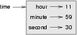

..  Copyright (C)  Peter Wentworth, Jeffrey Elkner, Allen B. Downey and Chris Meyers.
    Permission is granted to copy, distribute and/or modify this document
    under the terms of the GNU Free Documentation License, Version 1.3
    or any later version published by the Free Software Foundation;
    with Invariant Sections being Foreword, Preface, and Contributor List, no
    Front-Cover Texts, and no Back-Cover Texts.  A copy of the license is
    included in the section entitled "GNU Free Documentation License".

.. |rle_start| image:: illustrations/rle_start.png
   
.. |rle_end| image:: illustrations/rle_end.png
 
.. |rle_open| image:: illustrations/rle_open.png
   
.. |rle_close| image:: illustrations/rle_close.png    
 
| 

Even more OOP
=============

MyTime
------

As another example of a user-defined type, we'll define a class called ``MyTime``
that records the time of day. We'll provide an ``__init__`` method to ensure
that every instance is created with appropriate attributes and initialization.  
The class definition looks like this:

.. sourcecode:: python
    
    class MyTime:
    
        def __init__(self, hrs=0, mins=0, secs=0):
            """ Create a new MyTime object initialized to hrs, mins, secs """
            self.hours = hrs
            self.minutes = mins
            self.seconds = secs     

We can instantiate a new ``MyTime`` object:  

.. sourcecode:: python
    
    tim1 = MyTime(11, 59, 30)

The state diagram for the object looks like this:

We'll leave it as an exercise for the readers to add a ``__str__``
method so that MyTime objects can print themselves decently.

.. index:: function; pure

Pure functions
--------------

In the next few sections, we'll write two versions of a function called
``add_time``, which calculates the sum of two ``MyTime`` objects. They will demonstrate
two kinds of functions: pure functions and modifiers.

The following is a rough version of ``add_time``:

.. sourcecode:: python
    
    def add_time(t1, t2):
        h = t1.hours + t2.hours
        m = t1.minutes + t2.minutes
        s = t1.seconds + t2.seconds
        sum_t = MyTime(h, m, s)
        return sum_t

The function creates a new ``MyTime`` object and
returns a reference to the new object. This is called a **pure function**
because it does not modify any of the objects passed to it as parameters and it
has no side effects, such as updating global variables, 
displaying a value, or getting user input.

Here is an example of how to use this function. We'll create two ``MyTime``
objects: ``current_time``, which contains the current time; and ``bread_time``,
which contains the amount of time it takes for a breadmaker to make bread. Then
we'll use ``add_time`` to figure out when the bread will be done.  

.. sourcecode:: python
    
    >>> current_time = MyTime(9, 14, 30)
    >>> bread_time = MyTime(3, 35, 0)
    >>> done_time = add_time(current_time, bread_time)
    >>> print(done_time)
    12:49:30

The output of this program is ``12:49:30``, which is correct. On the other
hand, there are cases where the result is not correct. Can you think of one?

The problem is that this function does not deal with cases where the number of
seconds or minutes adds up to more than sixty. When that happens, we have to
carry the extra seconds into the minutes column or the extra minutes into the
hours column.

Here's a better version of the function:

.. sourcecode:: python
    
    def add_time(t1, t2):
        
        h = t1.hours + t2.hours
        m = t1.minutes + t2.minutes
        s = t1.seconds + t2.seconds
       
        if s >= 60:
            s -= 60
            m += 1
       
        if m >= 60:
            m -= 60
            h += 1
            
        sum_t = MyTime(h, m, s)
        return sum_t

This function is starting to get bigger, and still doesn't work
for all possible cases.  Later we will
suggest an alternative approach that yields better code.

.. index:: modifier

Modifiers
---------

There are times when it is useful for a function to modify one or more of the
objects it gets as parameters. Usually, the caller keeps a reference to the
objects it passes, so any changes the function makes are visible to the caller.
Functions that work this way are called **modifiers**.

``increment``, which adds a given number of seconds to a ``MyTime`` object, would
be written most naturally as a modifier. A rough draft of the function looks like this:

.. sourcecode:: python
    
    def increment(t, secs):
        t.seconds += secs
       
        if t.seconds >= 60:
            t.seconds -= 60
            t.minutes += 1
       
        if t.minutes >= 60:
            t.minutes -= 60
            t.hours += 1

The first line performs the basic operation; the remainder deals with the
special cases we saw before.

Is this function correct? What happens if the parameter ``seconds`` is much
greater than sixty? In that case, it is not enough to carry once; we have to
keep doing it until ``seconds`` is less than sixty. One solution is to replace
the ``if`` statements with ``while`` statements:

.. sourcecode:: python
    
    def increment(t, seconds):
        t.seconds += seconds
       
        while t.seconds >= 60:
            t.seconds -= 60
            t.minutes += 1
       
        while t.minutes >= 60:
            t.minutes -= 60
            t.hours += 1

This function is now correct when seconds is not negative, and when
hours does not exceed 23, but it is not a particularly good solution.

Converting ``increment`` to a method
------------------------------------

Once again, OOP programmers would prefer to put functions that work with
``MyTime`` objects into the ``MyTime`` class, so let's convert ``increment`` 
to a method. To save space, we will leave out previously defined methods, 
but you should keep them in your version:

.. sourcecode:: python
    
    class MyTime:
        #previous method definitions here...
       
        def increment(self, seconds):
            self.seconds += seconds 
       
            while self.seconds >= 60:
                self.seconds -= 60
                self.minutes += 1
       
            while self.minutes >= 60:
                self.minutes -= 60
                self.hours += 1

The transformation is purely mechanical - we move the definition into
the class definition and (optionally) change the name of the first parameter to
``self``, to fit with Python style conventions.

Now we can invoke ``increment`` using the syntax for invoking a method.

.. sourcecode:: python
    
    current_time.increment(500)

Again, the object on which the method is invoked gets assigned to the first
parameter, ``self``. The second parameter, ``seconds`` gets the value ``500``.

An "Aha!" insight
----------------- 

Often a high-level insight into the problem can make the programming much easier. 

In this case, the insight is that a ``MyTime`` object is really a 
three-digit number in base 60! The ``second``
component is the ones column, the ``minute`` component is the sixties column,
and the ``hour`` component is the thirty-six hundreds column.

When we wrote ``add_time`` and ``increment``, we were effectively doing
addition in base 60, which is why we had to carry from one column to the next.

This observation suggests another approach to the whole problem --- we can
convert a ``MyTime`` object into a single number and take advantage of the fact
that the computer knows how to do arithmetic with numbers.  The following
method is added to the ``MyTime`` class to convert any instance into 
a corresponding number of seconds:

.. sourcecode:: python
    
    class MyTime:
        # ...
        
        def to_seconds(self):
            """ Return the number of seconds represented by this instance """
            return self.hours * 3600 + self.minutes * 60 + self.seconds
 

Now, all we need is a way to convert from an integer back to a ``MyTime`` object.
Supposing we have ``tsecs`` seconds, some integer division and mod operators
can do this for us:

.. sourcecode:: python

    hrs = tsecs // 3600
    leftoversecs = tsecs % 3600
    mins = leftoversecs // 60
    secs = leftoversecs % 60  

You might have to think a bit to convince yourself that this technique to
convert from one base to another is correct. 

In OOP we're really trying to wrap together the data and the operations
that apply to it.  So we'd like to have this logic inside the ``MyTime``
class.  A good solution is to rewrite the class initializer so that it can 
cope with initial values of seconds or minutes that are outside the 
**normalized** values.  (A normalized time would be something
like 3 hours 12 minutes and 20 seconds.  The same time, but unnormalized 
could be 2 hours 70 minutes and 140 seconds.)  

Let's rewrite a more powerful initializer for ``MyTime``:

.. sourcecode:: python

     class MyTime:
        # ...
        
        def __init__(self, hrs=0, mins=0, secs=0):
            """ Create a new MyTime object initialized to hrs, mins, secs.
                The values of mins and secs may be outside the range 0-59,
                but the resulting MyTime object will be normalized.
            """
            totalsecs = hrs*3600 + mins*60 + secs    # total seconds to represent
            self.hours = totalsecs // 3600
            leftoversecs = totalsecs % 3600
            self.minutes = leftoversecs // 60
            self.seconds = leftoversecs % 60   

Now we can rewrite ``add_time`` like this:

.. sourcecode:: python
    
    def add_time(t1, t2):
        secs = t1.to_seconds() + t2.to_seconds()
        return MyTime(0, 0, secs)

This version is much shorter than the original, and it is much easier to
demonstrate or reason that it is correct.

.. index:: generalization

Generalization
--------------

In some ways, converting from base 60 to base 10 and back is harder than just
dealing with times. Base conversion is more abstract; our intuition for dealing
with times is better.

But if we have the insight to treat times as base 60 numbers and make the
investment of writing the conversions, we get a program that is shorter, 
easier to read and debug, and more reliable.

It is also easier to add features later. For example, imagine subtracting two
``MyTime`` objects to find the duration between them. The naive approach would be to
implement subtraction with borrowing. Using the conversion functions would be
easier and more likely to be correct.

Ironically, sometimes making a problem harder (or more general) makes the
programming easier, because there are fewer special cases and fewer opportunities 
for error.

.. admonition:: Specialization versus Generalization

    Computer Scientists are generally fond of specializing their types, while mathematicians
    often take the opposite approach, and generalize everything.
    
    What do we mean by this? 
    
    If you ask a mathematician to solve a problem involving weekdays, days of the century, 
    playing cards, time, or dominoes, their most likely response is
    to observe that all these objects can be represented by integers. Playing cards, for example,
    can be numbered from 0 to 51.  Days within the century can be numbered. Mathematicians will say 
    *"These things are enumerable --- the elements can be uniquely numbered (and we can
    reverse this numbering to get back to the original concept). So let's number 
    them, and confine our thinking to integers.  Luckily, we have powerful techniques and a 
    good understanding of integers, and so our abstractions --- the way we tackle and simplify 
    these problems --- is to try to reduce them to problems about integers."* 

    Computer Scientists tend to do the opposite.  We will argue that there are many integer
    operations that are simply not meaningful for dominoes, or for days of the century.  So
    we'll often define new specialized types, like ``MyTime``, because we can restrict,
    control, and specialize the operations that are possible.  Object-oriented programming
    is particularly popular because it gives us a good way to bundle methods and specialized data
    into a new type.   

    Both approaches are powerful problem-solving techniques. Often it may help to try to
    think about the problem from both points of view --- *"What would happen if I tried to reduce
    everything to very few primitive types?"*, versus 
    *"What would happen if this thing had its own specialized type?"*    

Another example
----------------

The ``after`` function should compare two times, and tell us whether the first
time is strictly after the second, e.g.

.. sourcecode:: python
    
    >>> t1 = MyTime(10, 55, 12)
    >>> t2 = MyTime(10, 48, 22)
    >>> after(t1, t2)  # is t1 after t2
    True
    
This is slightly more complicated because it operates on two ``MyTime`` 
objects, not just one.  But we'd prefer to write it as a method anyway --- 
in this case, a method on the first argument:

.. sourcecode:: python
   :linenos:
    
    class MyTime:
        #previous method definitions here...
       
        def after(self, time2):
            """ Return True if this instance is strictly greater than time2 """
            if self.hour > time2.hour:
                return True 
            if self.hour < time2.hour:
                return False 
       
            if self.minute > time2.minute:
                return True 
            if self.minute < time2.minute:
                return False 
       
            if self.second > time2.second:
                return True
            return False 

We invoke this method on one object and pass the other as an argument:

.. sourcecode:: python
    
    if current_time.after(done_time):
        print("The bread will be done before it starts!")

You can almost read the invocation like English: If the current time is after the
done time, then...

The logic of the ``if`` statements deserve special attention here.   Lines 11-18
will only be reached if the two hour fields are the same.  Similarly, the test at
line 16 is only executed if both times have the same hours and the same minutes.

Could we make this easier by using our "Aha!" insight and extra work from earlier, 
and reducing both times to integers?   Yes, with spectacular results!

.. sourcecode:: python
   
    class MyTime:
        #previous method definitions here...
       
        def after(self, time2):
            """ Return True if this instance is strictly greater than time2 """
            return self.to_seconds() > time2.to_seconds()

This is a great way to code this: if you want to tell if the first time is
after the second time, turn them both into integers and compare the integers.

Operator overloading
--------------------

Some languages, including Python, make it possible to have different meanings for
the same operator when applied to different types.  For example, ``+`` in Python
means quite different things for integers than it does for strings.  This feature is called
**operator overloading**.

It is especially useful when programmers can also overload the operators for their
own user-defined types.  

For example, to override the addition operator ``+``, we can provide a method named
``__add__``:

.. sourcecode:: python
    
    class MyTime:
        # previously defined methods here...
       
        def __add__(self, other):
            return MyTime(0, 0, self.to_seconds() + other.to_seconds())

As usual, the first parameter is the object on which the method is invoked. The
second parameter is conveniently named ``other`` to distinguish it from
``self``.  To add two ``MyTime`` objects, we create and return a new ``MyTime`` object 
that contains their sum.

Now, when we apply the ``+`` operator to ``MyTime`` objects, Python invokes
the ``__add__`` method that we have written:

.. sourcecode:: python
    
    >>>  t1 = MyTime(1, 15, 42) 
    >>>  t2 = MyTime(3, 50, 30)
    >>>  t3 = t1 + t2
    >>>  print(t3)
    05:06:12

The expression ``t1 + t2`` is equivalent to ``t1.__add__(t2)``, but obviously
more elegant.  As an exercise, add a method ``__sub__(self, other)`` that
overloads the subtraction operator, and try it out.  

For the next couple of exercises we'll go back to the Point class defined
two chapters back, and overload some of its operators.   Firstly, adding
two points adds their respective (x, y) coordinates:

.. sourcecode:: python

    class Point:
        # previously defined methods here...
       
        def __add__(self, other):
            return Point(self.x + other.x,  self.y + other.y)

There are several ways to
override the behavior of the multiplication operator: by defining a method
named ``__mul__``, or ``__rmul__``, or both.

If the left operand of ``*`` is a ``Point``, Python invokes ``__mul__``, which
assumes that the other operand is also a ``Point``. It computes the
**dot product** of the two Points, defined according to the rules of linear
algebra:

.. sourcecode:: python
    
    def __mul__(self, other):
        return self.x * other.x + self.y * other.y

If the left operand of ``*`` is a primitive type and the right operand is a
``Point``, Python invokes ``__rmul__``, which performs
**scalar multiplication**:

.. sourcecode:: python
    
    def __rmul__(self, other):
        return Point(other * self.x,  other * self.y)

The result is a new ``Point`` whose coordinates are a multiple of the original
coordinates. If ``other`` is a type that cannot be multiplied by a
floating-point number, then ``__rmul__`` will yield an error.

This example demonstrates both kinds of multiplication:

.. sourcecode:: python
    
    >>> p1 = Point(3, 4)
    >>> p2 = Point(5, 7)
    >>> print(p1 * p2)
    43
    >>> print(2 * p2)
    (10, 14)

What happens if we try to evaluate ``p2 * 2``? Since the first parameter is a
``Point``, Python invokes ``__mul__`` with ``2`` as the second argument. Inside
``__mul__``, the program tries to access the ``x`` coordinate of ``other``,
which fails because an integer has no attributes:

.. sourcecode:: python
    
    >>> print(p2 * 2)
    AttributeError: 'int' object has no attribute 'x'

Unfortunately, the error message is a bit opaque. This example demonstrates
some of the difficulties of object-oriented programming.  Sometimes it is hard
enough just to figure out what code is running.

Polymorphism
------------

Most of the methods we have written only work for a specific type.  When you
create a new object, you write methods that operate on that type.

But there are certain operations that you will want to apply to many types,
such as the arithmetic operations in the previous sections. If many types
support the same set of operations, you can write functions that work on any of
those types.

For example, the ``multadd`` operation (which is common in linear algebra)
takes three parameters; it multiplies the first two and then adds the third. We
can write it in Python like this:

.. sourcecode:: python
    
    def multadd (x, y, z):
        return x * y + z

This function will work for any values of ``x`` and ``y`` that can be multiplied
and for any value of ``z`` that can be added to the product.

We can invoke it with numeric values:

.. sourcecode:: python
    
    >>> multadd (3, 2, 1)
    7

Or with ``Point``\s:

.. sourcecode:: python
    
    >>> p1 = Point(3, 4)
    >>> p2 = Point(5, 7)
    >>> print(multadd (2, p1, p2))
    (11, 15)
    >>> print(multadd (p1, p2, 1))
    44

In the first case, the ``Point`` is multiplied by a scalar and then added to
another ``Point``. In the second case, the dot product yields a numeric value,
so the third parameter also has to be a numeric value.

A function like this that can take arguments with different types is called
**polymorphic**.

As another example, consider the function``front_and_back``, which prints a list
twice, forward and backward:

.. sourcecode:: python
    
    def front_and_back(front):
        import copy
        back = copy.copy(front)
        back.reverse()
        print(str(front) + str(back))

Because the ``reverse`` method is a modifier, we make a copy of the list before
reversing it. That way, this function doesn't modify the list it gets as a
parameter.

Here's an example that applies ``front_and_back`` to a list:

.. sourcecode:: python
    
    >>>   myList = [1, 2, 3, 4]
    >>>   front_and_back(myList)
    [1, 2, 3, 4][4, 3, 2, 1]

Of course, we intended to apply this function to lists, so it is not surprising
that it works. What would be surprising is if we could apply it to a ``Point``.

To determine whether a function can be applied to a new type, we apply Python's
fundamental rule of polymorphism, called the **duck typing rule**: *If all of 
the operations inside the function
can be applied to the type, the function can be applied to the type.* The
operations in the ``front_and_back`` function include ``copy``, ``reverse``, and ``print``.

Not all programming languages define polymorphism in this way.  
Look up *duck typing*, and see if you can figure out why it has this name.

``copy`` works on any object, and we have already written a ``__str__`` method
for ``Point`` objects, so all we need is a ``reverse`` method in the ``Point`` class:

.. sourcecode:: python
    
    def reverse(self):
        (self.x , self.y) = (self.y, self.x)

Then we can pass ``Point``\s to ``front_and_back``:

.. sourcecode:: python
    
    >>>   p = Point(3, 4)
    >>>   front_and_back(p)
    (3, 4)(4, 3)

The most interesting polymorphism is the unintentional kind, where you discover
that a function you have already written can be applied to a type for which you
never planned.

Glossary
--------

.. glossary::

        
    dot product
        An operation defined in linear algebra that multiplies two ``Point``\s
        and yields a numeric value.

    functional programming style
        A style of program design in which the majority of functions are pure.
        
    modifier
        A function or method that changes one or more of the objects it receives as
        parameters. Most modifiers are void.
        
    normalized
        Data is said to be normalized if it fits into some reduced range or set of rules. 
        We usually normalize our angles to values in the range [0..360). We normalize
        minutes and seconds to be values in the range [0..60).  And we'd 
        be surprised if the local store advertised its cold drinks at "One dollar,
        two hundred and fifty cents".
        
    operator overloading
        Extending built-in operators ( ``+``, ``-``, ``*``, ``>``, ``<``, etc.)
        so that they do different things for different types of arguments. We've
        seen early in the book how ``+`` is overloaded for numbers and strings,
        and here we've shown how to further overload it for user-defined types.
 
    polymorphic
        A function that can operate on more than one type.  Notice the subtle
        distinction: overloading has different functions (all with the same name) 
        for different types, whereas a polymorphic function is a single function 
        that can work for a range of types. 
        
    pure function
        A function that does not modify any of the objects it receives as
        parameters. Most pure functions are fruitful.

    scalar multiplication
        An operation defined in linear algebra that multiplies each of the
        coordinates of a ``Point`` by a numeric value.
    

Exercises
---------
   
#. Write a boolean function ``between`` that takes two ``MyTime`` objects, ``t1``
   and ``t2``, as arguments, and returns ``True`` if the invoking object
   falls between the two times.  Assume t1 <= t2, and make the test closed
   at the lower bound and open at the upper bound, i.e. return True if
     
       t1 <= obj < t2
       
#. Turn the above function into a method in the ``MyTime`` class.

#. Overload the necessary operator(s) so that instead of having to write ::

       if t1.after(t2): ...
       
   we can use the more convenient ::
   
       if t1 > t2: ...
      
#. Rewrite ``increment`` as a method that uses our "Aha" insight.
      
#. Create some test cases for the ``increment`` method.   Consider specifically the case
   where the number of seconds to add to the time is negative.  Fix up ``increment`` so 
   that it handles this case if it does not do so already.  
   (You may assume that you will never subtract more seconds
   than are in the time object.) 
   
#. Can physical time be negative, or must time always move in the forward direction?  
   Some serious physicists think this is not such a dumb question. See what you
   can find on the Internet about this. 

