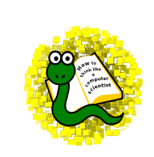

How to Think Like a Computer Scientist
======================================

Learning with Python: Interactive Edition (Using Python 3.x)
------------------------------------------------------------

by Brad Miller and David Ranum

   Luther College

`Please send us your feedback <http://groups.google.com/group/runestoneinteractive?lnk=gcimh>`__ at our Google Group.

-----------------------------------------------------------

Based on the original book

   How to Think Like a Computer Scientist

   by Jeffrey Elkner, Peter Wentworth, Allen B. Downey,
   Chris Meyers

   illustrated by Dario Mitchell

------------------------------------------------------------

.. * `Copyright Notice <copyright.html>`__ 
.. * `Foreword <foreword.html>`__
.. * `Preface <preface.html>`__
.. * `Preface to the 2nd Edition <preface2e.html>`__
.. * `Preface to the Interactive Edition <prefaceinteractive.html>`__
.. * `Contributor List <contrib.html>`__
.. * `Chapter 1 <introduction.html>`__ *The Way of the Program*
.. * `Chapter 2 <simpledata.html>`__ *Variables, Expressions, and Statements*
.. * `Chapter 3 <helloturtle.html>`__ *Hello, Little Turtles!*  
.. * `Chapter 4 <modules.html>`__ *Modules and Getting Help*
.. * `Chapter 5 <functions.html>`__ *Functions*
.. * `Chapter 6 <selection.html>`__ *Decisions and Selection*

.. * `Chapter 7 <moreiteration.html>`__ *Iteration*
.. * `Chapter 8 <strings.html>`__ *Strings*
.. * `Chapter 9 <lists.html>`__ *Lists*
.. * `Chapter 10 <dictionaries.html>`__ *Dictionaries*
.. * `Chapter 11 <recursion.html>`__ *Recursion*
.. * `Chapter 12 <classesintro.html>`__ *Classes and Objects - the Basics*
.. * `Chapter 13 <fractions.html>`__ *Classes and Objects - Digging a Little Deeper*

.. * `Appendix A <app_a.html>`__ *Debugging*

.. * `GNU Free Document License <fdl-1.3.html>`__ 

.. `Chapter 7 <morefunctions.html>`__ *Functions Revisited*
.. `Chapter 11 <ch10.html>`__ *Modules and Files*
.. `Chapter 15 <ch15.html>`__ *Even more OOP*
.. `Chapter 16 <ch16.html>`__ *Sets of Objects*
.. `Chapter 17 <ch17.html>`__ *Inheritance*
.. `Chapter 18 <ch18.html>`__ *Linked Lists*
.. `Chapter 19 <ch19.html>`__ *Stacks*
.. `Chapter 20 <ch20.html>`__ *Queues*
.. `Chapter 21 <ch21.html>`__ *Trees*
.. `Appendix B <app_b.html>`__ *An odds-and-ends Workbook*
.. `Appendix C <app_c.html>`__ *Configuring Ubuntu for Python Development*
.. `Appendix D <app_d.html>`__ *Customizing and Contributing to the Book*

Table of Contents
-----------------

.. toctree::
    :maxdepth: 1

    copyright.rst
    prefaceinteractive.rst
    foreword.rst
    preface.rst
    preface2e.rst
    contrib.rst

.. toctree::
    :maxdepth: 3
    :numbered:

    introduction.rst
    simpledata.rst
    helloturtle.rst
    modules.rst
    functions.rst

    selection.rst
    moreiteration.rst
    strings.rst
    lists.rst
    files.rst
    dictionaries.rst
    recursion.rst
    classesintro.rst
    fractions.rst

.. toctree::
    :maxdepth: 1
    :hidden:

    app_a.rst
    app_b.rst
    app_c.rst
    app_d.rst
    fdl-1.3.rst

.. toctree::
    :hidden:

    at_1_1
    lab03_01
    lab12_01
    lab12_02

* :ref:`search`

..     morefunctions.rst
..    ch10.rst

..    ch15.rst
..    ch16.rst
..    ch17.rst
..    ch18.rst
..    ch19.rst
..    ch20.rst
..    ch21.rst