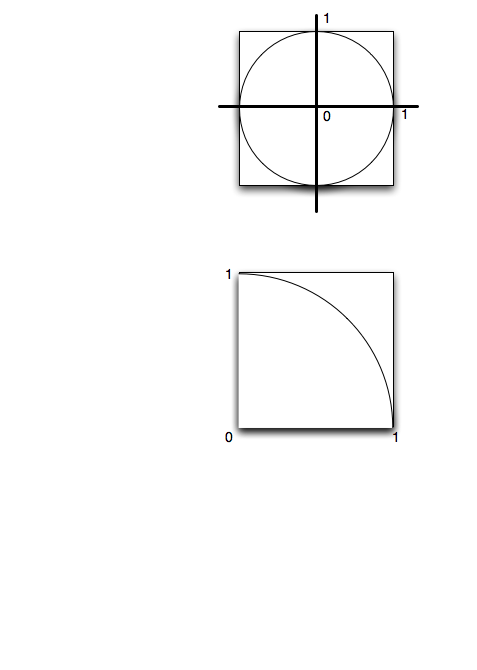

.. This document is Licensed by Brad Miller Creative Commons:
   Attribution, Share Alike

Approximating the Value of Pi
=============================

Almost everyone has heard of the famous mathematical constant called **Pi**.  We use it most often to find the circumference or the area of a circle.  For simplicity, the value that is commonly used for pi is 3.14.  However, it turns out that pi is what mathematicians call and **irrational number**, meaning that that it has an infinite, nonrepeating number of decimal digits.

In this lab, we will approximate the value of pi using a technique known as **Monte Carlo Simulation**.  This means that we will use random numbers to simulate a "game of chance".  The result of this game will be an approximation for pi.

Setup
-----

The game that we will use for this simulation is "darts".  We will "randomly" throw a collection of darts at a specially configured dartboard.  The set up for our board is shown below.  In the first figure, you can see that we have a round dartboard mounted on a square piece of wood.  The dartboard has a radius of one unit.  The piece of wood is exactly two units square so that the round board fits perfectly inside the square.

The second figure above shows the important step.  We have cut the upper right hand quarter of our dartboard and wood so that there is a quarter circle fitting exactly inside of a one by one square.  This is what we will use for our game.
It is important to notice that the vertical and horizontal boundary goes from zero to one and that the dartboard portion always has a radius of one.

Throwing Darts
--------------

Now that we have our dartboard setup, we can throw darts.  We will assume that we are good enough at throwing darts that we always hit the wood.  However, sometimes the darts will hit the dartboard and sometimes they  will miss (hit outside the quarter circle).

Inorder to simulate throwing the darts, we can generate two random numbers between zero and one.  The first will be the "x coordinate" of the dart and the second will be the "y coordinate".  

The program has been started for you.  You need to fill in the part that will "throw the dart".  

.. activecode:: piguessstart

	import turtle
	import math
	import random

	wn = turtle.Screen()

	fred = turtle.Turtle()

	wn.setworldcoordinates(0,0,1,1)

	fred.up()

	numpoints = 10
	for i in range(numpoints):
      #your code to throw the darts here

	wn.exitonclick()

Counting Darts
--------------

The Value of Pi
---------------

.. activecode:: piguess

	import turtle
	import math
	import random

	wn = turtle.Screen()

	fred = turtle.Turtle()

	wn.setworldcoordinates(-1,-1,1,1)

	fred.up()

	numincircle = 0
	numpoints = 500
	for i in range(numpoints):
	    x = random.random()
	    y = random.random()

	    fred.goto(x,y)
	    if fred.distance(0,0) <= 1:
	        fred.color("red")
	        numincircle = numincircle + 1
	    else:
	        fred.color("blue")
	    fred.dot(5)

    
	approxpi = numincircle/numpoints * 4
	print("The approximate value of pi is",approxpi)

	wn.exitonclick()

