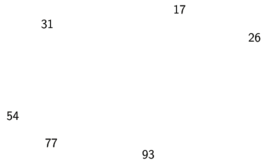
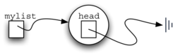
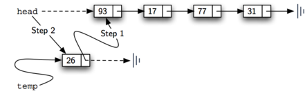
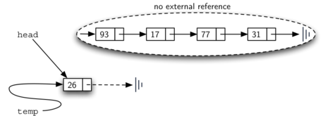
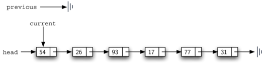
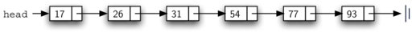
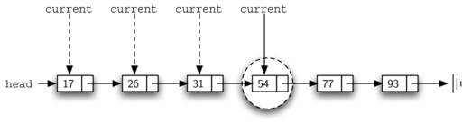
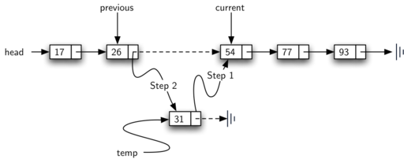

..  Copyright (C)  Brad Miller, David Ranum
    Permission is granted to copy, distribute and/or modify this document
    under the terms of the GNU Free Documentation License, Version 1.3 or 
    any later version published by the Free Software Foundation; with 
    Invariant Sections being Forward, Prefaces, and Contributor List, 
    no Front-Cover Texts, and no Back-Cover Texts.  A copy of the license
    is included in the section entitled "GNU Free Documentation License".

..  shortname:: LinkedLists
..  description:: Introduction to linked lists and their use in building data structures.

Lists
-----

Throughout the earlier sections of this chapter, we have used Python
lists to implement the abstract data types presented. The list is a
powerful, yet simple, collection mechanism that provides the programmer
with a wide variety of operations. However, not all programming
languages include a list collection. In these cases, the notion of a
list must be implemented by the programmer.

A **list** is a collection of items where each item holds a relative
position with respect to the others. More specifically, we will refer to
this type of list as an unordered list. We can consider the list as
having a first item, a second item, a third item, and so on. We can also
refer to the beginning of the list (the first item) or the end of the
list (the last item). For simplicity we will assume that lists cannot
contain duplicate items.

For example, the collection of integers 54, 26, 93, 17, 77, and 31 might
represent a simple unordered list of exam scores. Note that we have
written them as comma-delimited values, a common way of showing the list
structure. Of course, Python would show this list as
:math:`[54,26,93,17,77,31]`.

The Unordered List Abstract Data Type
~~~~~~~~~~~~~~~~~~~~~~~~~~~~~~~~~~~~~

The structure of an unordered list, as described above, is a collection
of items where each item holds a relative position with respect to the
others. Some possible unordered list operations are given below.

-  ``List()`` creates a new list that is empty. It needs no parameters
   and returns an empty list.

-  ``add(item)`` adds a new item to the list. It needs the item and
   returns nothing. Assume the item is not already in the list.

-  ``remove(item)`` removes the item from the list. It needs the item
   and modifies the list. Assume the item is present in the list.

-  ``search(item)`` searches for the item in the list. It needs the item
   and returns a boolean value.

-  ``isEmpty()`` tests to see whether the list is empty. It needs no
   parameters and returns a boolean value.

-  ``length()`` returns the number of items in the list. It needs no
   parameters and returns an integer.

-  ``append(item)`` adds a new item to the end of the list making it the
   last item in the collection. It needs the item and returns nothing.
   Assume the item is not already in the list.

-  ``index(item)`` returns the position of item in the list. It needs
   the item and returns the index. Assume the item is in the list.

-  ``insert(pos,item)`` adds a new item to the list at position pos. It
   needs the item and returns nothing. Assume the item is not already in
   the list and there are enough existing items to have position pos.

-  ``pop()`` removes and returns the last item in the list. It needs
   nothing and returns an item. Assume the list has at least one item.

-  ``pop(pos)`` removes and returns the item at position pos. It needs
   the position and returns the item. Assume the item is in the list.

Implementing an Unordered List: Linked Lists
~~~~~~~~~~~~~~~~~~~~~~~~~~~~~~~~~~~~~~~~~~~~

In order to implement an unordered list, we will construct what is
commonly known as a **linked list**. Recall that we need to be sure that
we can maintain the relative positioning of the items. However, there is
no requirement that we maintain that positioning in contiguous memory.
For example, consider the collection of items shown in
:ref:`Figure 1 <fig_idea>`. It appears that these values have been placed
randomly. If we can maintain some explicit information in each item,
namely the location of the next item (see :ref:`Figure 2 <fig_idea2>`), then the
relative position of each item can be expressed by simply following the
link from one item to the next.

.. _fig_idea:

   Items Not Constrained in Their Physical Placement

.. _fig_idea2:

.. figure:: Figures/idea2.png
   :align: center

   Relative Positions Maintained by Explicit Links.

It is important to note that the location of the first item of the list
must be explicitly specified. Once we know where the first item is, the
first item can tell us where the second is, and so on. The external
reference is often referred to as the **head** of the list. Similarly,
the last item needs to know that there is no next item.

The ``Node`` Class
^^^^^^^^^^^^^^^^^^

The basic building block for the linked list implementation is the
**node**. Each node object must hold at least two pieces of information.
First, the node must contain the list item itself. We will call this the
**data field** of the node. In addition, each node must hold a reference
to the next node. :ref:`Listing 1 <lst_nodeclass>` shows the Python
implementation. To construct a node, you need to supply the initial data
value for the node. Evaluating the assignment statement below will yield
a node object containing the value 93 (see :ref:`Figure 3 <fig_node>`). You
should note that we will typically represent a node object as shown in
:ref:`Figure 4 <fig_node2>`. The ``Node`` class also includes the usual methods
to access and modify the data and the next reference.

::

        >>> temp = Node(93)
        >>> temp.getData()
        93

The special Python reference value ``None`` will play an important role
in the ``Node`` class and later in the linked list itself. A reference
to ``None`` will denote the fact that there is no next node. Note in the
constructor that a node is initially created with ``next`` set to
``None``. Since this is sometimes referred to as “grounding the node,”
we will use the standard ground symbol to denote a reference that is
referring to ``None``. It is always a good idea to explicitly assign
``None`` to your initial next reference values.

.. _lst_nodeclass:

.. activecode:: nodeclass
   :caption: Node Class

   class Node:
       def __init__(self,initdata):
           self.data = initdata
           self.next = None

       def getData(self):
           return self.data

       def getNext(self):
           return self.next

       def setData(self,newdata):
           self.data = newdata

       def setNext(self,newnext):
           self.next = newnext

.. _fig_node:

.. figure:: Figures/node.png
   :align: center

   A Node Object Contains the Item and a Reference to the Next Node

.. _fig_node2:

.. figure:: Figures/node2.png
   :align: center

   A Typical Representation for a Node

The ``Unordered List`` Class
^^^^^^^^^^^^^^^^^^^^^^^^^^^^

As we suggested above, the unordered list will be built from a
collection of nodes, each linked to the next by explicit references. As
long as we know where to find the first node (containing the first
item), each item after that can be found by successively following the
next links. With this in mind, the ``UnorderedList`` class must maintain
a reference to the first node. :ref:`Listing 2 <lst_listclass>` shows the
constructor. Note that each list object will maintain a single reference
to the head of the list.

Initially when we construct a list, there are no items. The assignment
statement

::

    >>> mylist = UnorderedList()

creates the linked list representation shown in
:ref:`Figure 5 <fig_initlinkedlist>`. As we discussed in the ``Node`` class, the
special reference ``None`` will again be used to state that the head of
the list does not refer to anything. Eventually, the example list given
earlier will be represented by a linked list as shown in
:ref:`Figure 6 <fig_linkedlist>`. The head of the list refers to the first node
which contains the first item of the list. In turn, that node holds a
reference to the next node (the next item) and so on. It is very
important to note that the list class itself does not contain any node
objects. Instead it contains a single reference to only the first node
in the linked structure.

.. _fig_initlinkedlist:

   An Empty List

.. _fig_linkedlist:

.. figure:: Figures/linkedlist.png
   :align: center

   A Linked List of Integers

.. _lst_listclass:

::

        def __init__(self):
            self.head = None

The ``isEmpty`` method, shown in :ref:`Listing 3 <lst_isempty>`, simply checks to
see if the head of the list is a reference to ``None``. The result of
the boolean expression ``self.head==None`` will only be true if there
are no nodes in the linked list. Since a new list is empty, the
constructor and the check for empty must be consistent with one another.
This shows the advantage to using the reference ``None`` to denote the
“end” of the linked structure. In Python, ``None`` can be compared to
any reference. Two references are equal if they both refer to the same
object. We will use this often in our remaining methods.

.. _lst_isempty:

::

    def isEmpty(self):
        return self.head == None

So, how do we get items into our list? We need to implement the ``add``
method. However, before we can do that, we need to address the important
question of where in the linked list to place the new item. Since this
list is unordered, the specific location of the new item with respect to
the other items already in the list is not important. The new item can
go anywhere. With that in mind, it makes sense to place the new item in
the easiest location possible.

Recall that the linked list structure provides us with only one entry
point, the head of the list. All of the other nodes can only be reached
by accessing the first node and then following ``next`` links. This
means that the easiest place to add the new node is right at the head,
or beginning, of the list. In other words, we will make the new item the
first item of the list and the existing items will need to be linked to
this new first item so that they follow.

The linked list shown in :ref:`Figure 6 <fig_linkedlist>` was built by calling
the ``add`` method a number of times.

::

    >>> mylist.add(31)
    >>> mylist.add(77)
    >>> mylist.add(17)
    >>> mylist.add(93)
    >>> mylist.add(26)
    >>> mylist.add(54)

Note that since 31 is the first item added to the list, it will
eventually be the last node on the linked list as every other item is
added ahead of it. Also, since 54 is the last item added, it will become
the data value in the first node of the linked list.

The ``add`` method is shown in :ref:`Listing 4 <lst_add>`. Each item of the list
must reside in a node object. Line 2 creates a new node and places the
item as its data. Now we must complete the process by linking the new
node into the existing structure. This requires two steps as shown in
:ref:`Figure 7 <fig_addtohead>`. Step 1 (line 3) changes the ``next`` reference
of the new node to refer to the old first node of the list. Now that the
rest of the list has been properly attached to the new node, we can
modify the head of the list to refer to the new node. The assignment
statement in line 4 sets the head of the list.

The order of the two steps described above is very important. What
happens if the order of line 3 and line 4 is reversed? If the
modification of the head of the list happens first, the result can be
seen in :ref:`Figure 8 <fig_wrongorder>`. Since the head was the only external
reference to the list nodes, all of the original nodes are lost and can
no longer be accessed.

.. _lst_add:

::

    def add(self,item):
        temp = Node(item)
        temp.setNext(self.head)
        self.head = temp

.. _fig_addtohead:

   Adding a New Node is a Two-Step Process

.. _fig_wrongorder:

   Result of Reversing the Order of the Two Steps

The next methods that we will implement–``length``, ``search``, and
``remove``–are all based on a technique known as **linked list
traversal**. Traversal refers to the process of systematically visiting
each node. To do this we use an external reference that starts at the
first node in the list. As we visit each node, we move the reference to
the next node by “traversing” the next reference.

To implement the ``length`` method, we need to traverse the linked list
and keep a count of the number of nodes that occurred.
:ref:`Listing 5 <lst_length>` shows the Python code for counting the number of
nodes in the list. The external reference is called ``current`` and is
initialized to the head of the list in line 2. At the start of the
process we have not seen any nodes so the count is set to :math:`0`.
Lines 4–6 actually implement the traversal. As long as the current
reference has not seen the end of the list (``None``), we move current
along to the next node via the assignment statement in line 6. Again,
the ability to compare a reference to ``None`` is very useful. Every
time current moves to a new node, we add :math:`1` to ``count``.
Finally, ``count`` gets returned after the iteration stops.
:ref:`Figure 9 <fig_traversal>` shows this process as it proceeds down the list.

.. _lst_length:

::

    def length(self):
        current = self.head
        count = 0
        while current != None:
            count = count + 1
            current = current.getNext()

        return count

.. _fig_traversal:

.. figure:: Figures/traversal.png
   :align: center

   Traversing the Linked List from the Head to the End

Searching for a value in a linked list implementation of an unordered
list also uses the traversal technique. As we visit each node in the
linked list we will ask whether the data stored there matches the item
we are looking for. In this case, however, we may not have to traverse
all the way to the end of the list. In fact, if we do get to the end of
the list, that means that the item we are looking for must not be
present. Also, if we do find the item, there is no need to continue.

:ref:`Listing 6 <lst_search>` shows the implementation for the ``search`` method.
As in the ``length`` method, the traversal is initialized to start at
the head of the list (line 2). We also use a boolean variable called
``found`` to remember whether we have located the item we are searching
for. Since we have not found the item at the start of the traversal,
``found`` can be set to ``False`` (line 3). The iteration in line 4
takes into account both conditions discussed above. As long as there are
more nodes to visit and we have not found the item we are looking for,
we continue to check the next node. The question in line 5 asks whether
the data item is present in the current node. If so, ``found`` can be
set to ``True``.

.. _lst_search:

::

    def search(self,item):
        current = self.head
        found = False
        while current != None and not found:
            if current.getData() == item:
                found = True
            else:
                current = current.getNext()

        return found

As an example, consider invoking the ``search`` method looking for the
item 17.

::

    >>> mylist.search(17)
    True

Since 17 is in the list, the traversal process needs to move only to the
node containing 17. At that point, the variable ``found`` is set to
``True`` and the ``while`` condition will fail, leading to the return
value seen above. This process can be seen in :ref:`Figure 10 <fig_searchpic>`.

.. _fig_searchpic:

.. figure:: Figures/search.png
   :align: center

   Successful Search for the Value 17

The ``remove`` method requires two logical steps. First, we need to
traverse the list looking for the item we want to remove. Once we find
the item (recall that we assume it is present), we must remove it. The
first step is very similar to ``search``. Starting with an external
reference set to the head of the list, we traverse the links until we
discover the item we are looking for. Since we assume that item is
present, we know that the iteration will stop before ``current`` gets to
``None``. This means that we can simply use the boolean ``found`` in the
condition.

When ``found`` becomes ``True``, ``current`` will be a reference to the
node containing the item to be removed. But how do we remove it? One
possibility would be to replace the value of the item with some marker
that suggests that the item is no longer present. The problem with this
approach is the number of nodes will no longer match the number of
items. It would be much better to remove the item by removing the entire
node.

In order to remove the node containing the item, we need to modify the
link in the previous node so that it refers to the node that comes after
``current``. Unfortunately, there is no way to go backward in the linked
list. Since ``current`` refers to the node ahead of the node where we
would like to make the change, it is too late to make the necessary
modification.

The solution to this dilemma is to use two external references as we
traverse down the linked list. ``current`` will behave just as it did
before, marking the current location of the traverse. The new reference,
which we will call ``previous``, will always travel one node behind
``current``. That way, when ``current`` stops at the node to be removed,
``previous`` will be referring to the proper place in the linked list
for the modification.

{} :ref:`Listing 7 <lst_remove>` shows the complete ``remove`` method. Lines 2–3
assign initial values to the two references. Note that ``current``
starts out at the list head as in the other traversal examples.
``previous``, however, is assumed to always travel one node behind
current. For this reason, ``previous`` starts out with a value of
``None`` since there is no node before the head (see
:ref:`Figure 11 <fig_removeinit>`). The boolean variable ``found`` will again be
used to control the iteration.

In lines 6–7 we ask whether the item stored in the current node is the
item we wish to remove. If so, ``found`` can be set to ``True``. If we
do not find the item, ``previous`` and ``current`` must both be moved
one node ahead. Again, the order of these two statements is crucial.
``previous`` must first be moved one node ahead to the location of
``current``. At that point, ``current`` can be moved. This process is
often referred to as “inch-worming” as ``previous`` must catch up to
``current`` before ``current`` moves ahead. :ref:`Figure 12 <fig_prevcurr>` shows
the movement of ``previous`` and ``current`` as they progress down the
list looking for the node containing the value 17.

.. _lst_remove:

::

    def remove(self,item):
        current = self.head
        previous = None
        found = False
        while not found:
            if current.getData() == item:
                found = True
            else:
                previous = current
                current = current.getNext()

        if previous == None:
            self.head = current.getNext()
        else:
            previous.setNext(current.getNext())

.. _fig_removeinit:

   Initial Values for the ``previous`` and ``current`` References

.. _fig_prevcurr:

.. figure:: Figures/prevcurr.png
   :align: center

   ``previous`` and ``current`` Move Down the List

Once the searching step of the ``remove`` has been completed, we need to
remove the node from the linked list. :ref:`Figure 13 <fig_removepic1>` shows the
link that must be modified. However, there is a special case that needs
to be addressed. If the item to be removed happens to be the first item
in the list, then ``current`` will reference the first node in the
linked list. This also means that ``previous`` will be ``None``. We said
earlier that ``previous`` would be referring to the node whose next
reference needs to be modified in order to complete the remove. In this
case, it is not ``previous`` but rather the head of the list that needs
to be changed (see :ref:`Figure 14 <fig_removehead>`).

.. _fig_removepic1:

.. figure:: Figures/remove.png
   :align: center

   Removing an Item from the Middle of the List

.. _fig_removehead:

.. figure:: Figures/remove2.png
   :align: center

   Removing the First Node from the List

Line 12 allows us to check whether we are dealing with the special case
described above. If ``previous`` did not move, it will still have the
value ``None`` when the boolean ``found`` becomes ``True``. In that case
(line 13) the head of the list is modified to refer to the node after
the current node, in effect removing the first node from the linked
list. However, if previous is not ``None``, the node to be removed is
somewhere down the linked list structure. In this case the previous
reference is providing us with the node whose next reference must be
changed. Line 15 uses the ``setNext`` method from ``previous`` to
accomplish the removal. Note that in both cases the destination of the
reference change is ``current.getNext()``. One question that often
arises is whether the two cases shown here will also handle the
situation where the item to be removed is in the last node of the linked
list. We leave that for you to consider.

The remaining methods ``append``, ``insert``, ``index``, and ``pop`` are
left as exercises. Remember that each of these must take into account
whether the change is taking place at the head of the list or someplace
else. Also, ``insert``, ``index``, and ``pop`` require that we name the
positions of the list. We will assume that position names are integers
starting with 0.

.. admonition:: Self Check
   
   Part I:  Implement the append method for UnorderedList.  What is the time complexity of the method you created?

   .. actex:: self_check_list1

   Part I:  You most likely created an append method that was :math:`O(n)`  If you add an instance variable to the UnorderedList class you can create an append method that is :math:`O(1)`.  Modify your append method to be :math:`O(1)`  Be Careful!  To really do this correctly you will need to consider a couple of special cases that may require you to make a modification to the add method as well.

   .. actex:: self_check_list2

The Ordered List Abstract Data Type
~~~~~~~~~~~~~~~~~~~~~~~~~~~~~~~~~~~

We will now consider a type of list known as an ordered list. For
example, if the list of integers shown above were an ordered list
(ascending order), then it could be written as 17, 26, 31, 54, 77, and
93. Since 17 is the smallest item, it occupies the first position in the
list. Likewise, since 93 is the largest, it occupies the last position.

The structure of an ordered list is a collection of items where each
item holds a relative position that is based upon some underlying
characteristic of the item. The ordering is typically either ascending
or descending and we assume that list items have a meaningful comparison
operation that is already defined. Many of the ordered list operations
are the same as those of the unordered list.

-  ``OrderedList()`` creates a new ordered list that is empty. It needs
   no parameters and returns an empty list.

-  ``add(item)`` adds a new item to the list making sure that the order
   is preserved. It needs the item and returns nothing. Assume the item
   is not already in the list.

-  ``remove(item)`` removes the item from the list. It needs the item
   and modifies the list. Assume the item is present in the list.

-  ``search(item)`` searches for the item in the list. It needs the item
   and returns a boolean value.

-  ``isEmpty()`` tests to see whether the list is empty. It needs no
   parameters and returns a boolean value.

-  ``length()`` returns the number of items in the list. It needs no
   parameters and returns an integer.

-  ``index(item)`` returns the position of item in the list. It needs
   the item and returns the index. Assume the item is in the list.

-  ``pop()`` removes and returns the last item in the list. It needs
   nothing and returns an item. Assume the list has at least one item.

-  ``pop(pos)`` removes and returns the item at position pos. It needs
   the position and returns the item. Assume the item is in the list.

Implementing an Ordered List
~~~~~~~~~~~~~~~~~~~~~~~~~~~~

In order to implement the ordered list, we must remember that the
relative positions of the items are based on some underlying
characteristic. The ordered list of integers given above (17, 26, 31,
54, 77, and 93) can be represented by a linked structure as shown in
:ref:`Figure 15 <fig_orderlinked>`. Again, the node and link structure is ideal
for representing the relative positioning of the items.

.. _fig_orderlinked:

   An Ordered Linked List

To implement the ``OrderedList`` class, we will use the same technique
as seen previously with unordered lists. Once again, an empty list will
be denoted by a ``head`` reference to ``None`` (see
:ref:`Listing 8 <lst_orderlist>`).

.. _lst_orderlist:

::

    class OrderedList:
        def __init__(self):
            self.head = None

As we consider the operations for the ordered list, we should note that
the ``isEmpty`` and ``length`` methods can be implemented the same as
with unordered lists since they deal only with the number of nodes in
the list without regard to the actual item values. Likewise, the
``remove`` method will work just fine since we still need to find the
item and then link around the node to remove it. The two remaining
methods, ``search`` and ``add``, will require some modification.

The search of an unordered linked list required that we traverse the
nodes one at a time until we either find the item we are looking for or
run out of nodes (``None``). It turns out that the same approach would
actually work with the ordered list and in fact in the case where we
find the item it is exactly what we need. However, in the case where the
item is not in the list, we can take advantage of the ordering to stop
the search as soon as possible.

For example, :ref:`Figure 16 <fig_stopearly>` shows the ordered linked list as a
search is looking for the value 45. As we traverse, starting at the head
of the list, we first compare against 17. Since 17 is not the item we
are looking for, we move to the next node, in this case 26. Again, this
is not what we want, so we move on to 31 and then on to 54. Now, at this
point, something is different. Since 54 is not the item we are looking
for, our former strategy would be to move forward. However, due to the
fact that this is an ordered list, that will not be necessary. Once the
value in the node becomes greater than the item we are searching for,
the search can stop and return ``False``. There is no way the item could
exist further out in the linked list.

.. _fig_stopearly:

   Searching an Ordered Linked List

:ref:`Listing 9 <lst_ordersearch>` shows the complete ``search`` method. It is
easy to incorporate the new condition discussed above by adding another
boolean variable, ``stop``, and initializing it to ``False`` (line 4).
While ``stop`` is ``False`` (not ``stop``) we can continue to look
forward in the list (line 5). If any node is ever discovered that
contains data greater than the item we are looking for, we will set
``stop`` to ``True`` (lines 9–10). The remaining lines are identical to
the unordered list search.

.. _lst_ordersearch:

::

    def search(self,item):
        current = self.head
        found = False
        stop = False
        while current != None and not found and not stop:
            if current.getData() == item:
                found = True
            else:
                if current.getData() > item:
                    stop = True
                else:
                    current = current.getNext()

        return found

The most significant method modification will take place in ``add``.
Recall that for unordered lists, the ``add`` method could simply place a
new node at the head of the list. It was the easiest point of access.
Unfortunately, this will no longer work with ordered lists. It is now
necessary that we discover the specific place where a new item belongs
in the existing ordered list.

Assume we have the ordered list consisting of 17, 26, 54, 77, and 93 and
we want to add the value 31. The ``add`` method must decide that the new
item belongs between 26 and 54. :ref:`Figure 17 <fig_orderinsert>` shows the setup
that we need. As we explained earlier, we need to traverse the linked
list looking for the place where the new node will be added. We know we
have found that place when either we run out of nodes (``current``
becomes ``None``) or the value of the current node becomes greater than
the item we wish to add. In our example, seeing the value 54 causes us
to stop.

.. _fig_orderinsert:

   Adding an Item to an Ordered Linked List

As we saw with unordered lists, it is necessary to have an additional
reference, again called ``previous``, since ``current`` will not provide
access to the node that must be modified. :ref:`Listing 10 <lst_orderadd>` shows
the complete ``add`` method. Lines 2–3 set up the two external
references and lines 9–10 again allow ``previous`` to follow one node
behind ``current`` every time through the iteration. The condition (line
5) allows the iteration to continue as long as there are more nodes and
the value in the current node is not larger than the item. In either
case, when the iteration fails, we have found the location for the new
node.

The remainder of the method completes the two-step process shown in
:ref:`Figure 17 <fig_orderinsert>`. Once a new node has been created for the item,
the only remaining question is whether the new node will be added at the
beginning of the linked list or some place in the middle. Again,
``previous == None`` (line 13) can be used to provide the answer.

.. _lst_orderadd:

::

    def add(self,item):
        current = self.head
        previous = None
        stop = False
        while current != None and not stop:
            if current.getData() > item:
                stop = True
            else:
                previous = current
                current = current.getNext()

        temp = Node(item)
        if previous == None:
            temp.setNext(self.head)
            self.head = temp
        else:
            temp.setNext(current)
            previous.setNext(temp)

We leave the remaining methods as exercises. You should carefully
consider whether the unordered implementations will work given that the
list is now ordered.

Analysis of Linked Lists
^^^^^^^^^^^^^^^^^^^^^^^^

To analyze the complexity of the linked list operations, we need to
consider whether they require traversal. Consider a linked list that has
*n* nodes. The ``isEmpty`` method is :math:`O(1)` since it requires
one step to check the head reference for ``None``. ``length``, on the
other hand, will always require *n* steps since there is no way to know
how many nodes are in the linked list without traversing from head to
end. Therefore, ``length`` is :math:`O(n)`. Adding an item to an
unordered list will always be O(1) since we simply place the new node at
the head of the linked list. However, ``search`` and ``remove``, as well
as ``add`` for an ordered list, all require the traversal process.
Although on average they may need to traverse only half of the nodes,
these methods are all :math:`O(n)` since in the worst case each will
process every node in the list.

You may also have noticed that the performance of this implementation
differs from the actual performance given earlier for Python lists. This
suggests that linked lists are not the way Python lists are implemented.
The actual implementation of a Python list is based on the notion of an
array. We discuss this in more detail in Chapter 8.