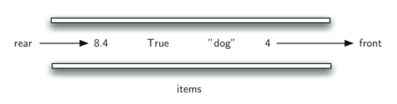
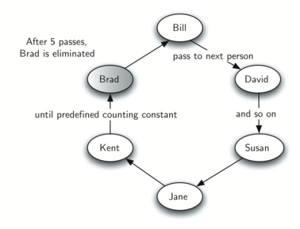
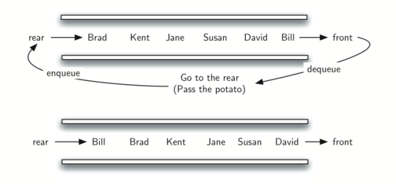

Queues
------

We now turn our attention to another linear data structure. This one is
called **queue**. Like stacks, queues are relatively simple and yet can
be used to solve a wide range of important problems.

What Is a Queue?
~~~~~~~~~~~~~~~~

A queue is an ordered collection of items where the addition of new
items happens at one end, called the “rear,” and the removal of existing
items occurs at the other end, commonly called the “front.” As an
element enters the queue it starts at the rear and makes its way toward
the front, waiting until that time when it is the next element to be
removed.

The most recently added item in the queue must wait at the end of the
collection. The item that has been in the collection the longest is at
the front. This ordering principle is sometimes called **FIFO**,
**first-in first-out**. It is also known as “first-come first-served.”

The simplest example of a queue is the typical line that we all
participate in from time to time. We wait in a line for a movie, we wait
in the check-out line at a grocery store, and we wait in the cafeteria
line (so that we can pop the tray stack). Well-behaved lines, or queues,
are very restrictive in that they have only one way in and only one way
out. There is no jumping in the middle and no leaving before you have
waited the necessary amount of time to get to the front.
:ref:`Figure 1 <fig_qubasicqueue>` shows a simple queue of Python data objects.

.. _fig_qubasicqueue:

   A Queue of Python Data Objects

Computer science also has common examples of queues. Our computer
laboratory has 30 computers networked with a single printer. When
students want to print, their print tasks “get in line” with all the
other printing tasks that are waiting. The first task in is the next to
be completed. If you are last in line, you must wait for all the other
tasks to print ahead of you. We will explore this interesting example in
more detail later.

In addition to printing queues, operating systems use a number of
different queues to control processes within a computer. The scheduling
of what gets done next is typically based on a queuing algorithm that
tries to execute programs as quickly as possible and serve as many users
as it can. Also, as we type, sometimes keystrokes get ahead of the
characters that appear on the screen. This is due to the computer doing
other work at that moment. The keystrokes are being placed in a
queue-like buffer so that they can eventually be displayed on the screen
in the proper order.

The Queue Abstract Data Type
~~~~~~~~~~~~~~~~~~~~~~~~~~~~

The queue abstract data type is defined by the following structure and
operations. A queue is structured, as described above, as an ordered
collection of items which are added at one end, called the “rear,” and
removed from the other end, called the “front.” Queues maintain a FIFO
ordering property. The queue operations are given below.

-  ``Queue()`` creates a new queue that is empty. It needs no parameters
   and returns an empty queue.

-  ``enqueue(item)`` adds a new item to the rear of the queue. It needs
   the item and returns nothing.

-  ``dequeue()`` removes the front item from the queue. It needs no
   parameters and returns the item. The queue is modified.

-  ``isEmpty()`` tests to see whether the queue is empty. It needs no
   parameters and returns a boolean value.

-  ``size()`` returns the number of items in the queue. It needs no
   parameters and returns an integer.

As an example, if we assume that ``q`` is a queue that has been created
and is currently empty, then :ref:`Table 1 <tbl_queueoperations>` shows the
results of a sequence of queue operations. The queue contents are shown
such that the front is on the right. 4 was the first item enqueued so it
is the first item returned by dequeue.

.. _tbl_queueoperations:

============================ ======================== ================== 
         **Queue Operation**       **Queue Contents**   **Return Value** 
============================ ======================== ================== 
             ``q.isEmpty()``                   ``[]``           ``True`` 
            ``q.enqueue(4)``                  ``[4]``                    
        ``q.enqueue('dog')``            ``['dog',4]``                    
         ``q.enqueue(True)``       ``[True,'dog',4]``                    
                ``q.size()``       ``[True,'dog',4]``              ``3`` 
             ``q.isEmpty()``       ``[True,'dog',3]``          ``False`` 
          ``q.enqueue(8.4)``   ``[8.4,True,'dog',4]``                    
             ``q.dequeue()``     ``[8.4,True,'dog']``              ``4`` 
             ``q.dequeue()``           ``[8.4,True]``          ``'dog'`` 
                ``q.size()``           ``[8.4,True]``              ``2`` 
============================ ======================== ================== 

    Example Queue Operations

Implementing a Queue in Python
~~~~~~~~~~~~~~~~~~~~~~~~~~~~~~

It is again appropriate to create a new class for the implementation of
the abstract data type queue. As before, we will use the power and
simplicity of the list collection to build the internal representation
of the queue.

We need to decide which end of the list to use as the rear and which to
use as the front. The implementation shown in :ref:`Listing 1 <lst_queuecode>`
assumes that the rear is at position 0 in the list. This allows us to
use the ``insert`` function on lists to add new elements to the rear of
the queue. The ``pop`` operation can be used to remove the front element
(the last element of the list). Recall that this also means that enqueue
will be O(n) and dequeue will be O(1). 

.. _lst_queuecode:

::

    class Queue:
        def __init__(self):
            self.items = []

        def isEmpty(self):
            return self.items == []

        def enqueue(self, item):
            self.items.insert(0,item)

        def dequeue(self):
            return self.items.pop()

        def size(self):
            return len(self.items)

The following interactive Python session shows the ``Queue`` class in
action as we perform the sequence of operations from
:ref:`Table 1 <tbl_queueoperations>`.

.. codelens:: ququeuetest

   class Queue:
       def __init__(self):
           self.items = []

       def isEmpty(self):
           return self.items == []

       def enqueue(self, item):
           self.items.insert(0,item)

       def dequeue(self):
           return self.items.pop()

       def size(self):
           return len(self.items)

   q=Queue()
   q.isEmpty()
   
   q.enqueue('dog')
   q.enqueue(4)
   q=Queue()
   q.isEmpty()
   
   q.enqueue(4)
   q.enqueue('dog')
   q.enqueue(True)

::

    >>> q.size()
    3
    >>> q.isEmpty()
    False
    >>> q.enqueue(8.4)
    >>> q.dequeue()
    4
    >>> q.dequeue()
    'dog'
    >>> q.size()
    2

Simulation: Hot Potato
~~~~~~~~~~~~~~~~~~~~~~

One of the typical applications for showing a queue in action is to
simulate a real situation that requires data to be managed in a FIFO
manner. To begin, let’s consider the children’s game Hot Potato. In this
game (see :ref:`Figure 2 <fig_quhotpotato>`) children line up in a circle and
pass an item from neighbor to neighbor as fast as they can. At a certain
point in the game, the action is stopped and the child who has the item
(the potato) is removed from the circle. Play continues until only one
child is left.

.. _fig_quhotpotato:

   A Six Person Game of Hot Potato

This game is a modern-day equivalent of the famous Josephus problem.
Based on a legend about the famous first-century historian Flavius
Josephus, the story is told that in the Jewish revolt against Rome,
Josephus and 39 of his comrades held out against the Romans in a cave.
With defeat imminent, they decided that they would rather die than be
slaves to the Romans. They arranged themselves in a circle. One man was
designated as number one, and proceeding clockwise they killed every
seventh man. Josephus, according to the legend, was among other things
an accomplished mathematician. He instantly figured out where he ought
to sit in order to be the last to go. When the time came, instead of
killing himself, he joined the Roman side. You can find many different
versions of this story. Some count every third man and some allow the
last man to escape on a horse. In any case, the idea is the same.

We will implement a general **simulation** of Hot Potato. Our program
will input a list of names and a constant, call it “num,” to be used for
counting. It will return the name of the last person remaining after
repetitive counting by ``num``. What happens at that point is up to you.

To simulate the circle, we will use a queue (see
:ref:`Figure 3 <fig_qupotatoqueue>`). Assume that the child holding the potato will
be at the front of the queue. Upon passing the potato, the simulation
will simply dequeue and then immediately enqueue that child, putting her
at the end of the line. She will then wait until all the others have
been at the front before it will be her turn again. After ``num``
dequeue/enqueue operations, the child at the front will be removed
permanently and another cycle will begin. This process will continue
until only one name remains (the size of the queue is 1).

.. _fig_qupotatoqueue:

   A Queue Implementation of Hot Potato

The program is shown in :ref:`Listing 2 <lst_josephussim>`. A call to the
``hotPotato`` function using 7 as the counting constant returns:

.. _lst_josephussim:

.. activecode:: qujosephussim
   :caption: Hot Potato Simulation

   from pythonds.basic.queue import Queue
   def hotPotato(namelist, num):
       simqueue = Queue()
       for name in namelist:
           simqueue.enqueue(name)

       while simqueue.size() > 1:
           for i in range(num):
               simqueue.enqueue(simqueue.dequeue())

           simqueue.dequeue()

       return simqueue.dequeue()

   print(hotPotato(["Bill","David","Susan","Jane","Kent","Brad"],7))

Note that in this example the value of the counting constant is greater
than the number of names in the list. This is not a problem since the
queue acts like a circle and counting continues back at the beginning
until the value is reached. Also, notice that the list is loaded into
the queue such that the first name on the list will be at the front of
the queue. ``Bill`` in this case is the first item in the list and
therefore moves to the front of the queue. A variation of this
implementation, described in the exercises, allows for a random counter.

Simulation: Printing Tasks
~~~~~~~~~~~~~~~~~~~~~~~~~~

A more interesting simulation allows us to study the behavior of the
printing queue described earlier in this section. Recall that as
students send printing tasks to the shared printer, the tasks are placed
in a queue to be processed in a first-come first-served manner. Many
questions arise with this configuration. The most important of these
might be whether the printer is capable of handling a certain amount of
work. If it cannot, students will be waiting too long for printing and
may miss their next class.

{} Consider the following situation in a computer science laboratory. On
any average day about 10 students are working in the lab at any given
hour. These students typically print up to twice during that time, and
the length of these tasks ranges from 1 to 20 pages. The printer in the
lab is older, capable of processing 10 pages per minute of draft
quality. The printer could be switched to give better quality, but then
it would produce only five pages per minute. The slower printing speed
could make students wait too long. What page rate should be used?

We could decide by building a simulation that models the laboratory. We
will need to construct representations for students, printing tasks, and
the printer (:ref:`Figure 4 <fig_qulabsim>`). As students submit printing tasks,
we will add them to a waiting list, a queue of print tasks attached to
the printer. When the printer completes a task, it will look at the
queue to see if there are any remaining tasks to process. Of interest
for us is the average amount of time students will wait for their papers
to be printed. This is equal to the average amount of time a task waits
in the queue.

.. _fig_qulabsim:

.. figure:: Figures/simulationsetup.png
   :align: center

   Computer Science Laboratory Printing Queue

To model this situation we need to use some probabilities. For example,
students may print a paper from 1 to 20 pages in length. If each length
from 1 to 20 is equally likely, the actual length for a print task can
be simulated by using a random number between 1 and 20 inclusive. This
means that there is equal chance of any length from 1 to 20 appearing.

{} If there are 10 students in the lab and each prints twice, then there
are 20 print tasks per hour on average. What is the chance that at any
given second, a print task is going to be created? The way to answer
this is to consider the ratio of tasks to time. Twenty tasks per hour
means that on average there will be one task every 180 seconds:

:math:`$\label{taskequation}
\frac {20\ tasks}{1\ hour}
\times
\frac {1\ hour}  {60\ minutes}
\times
\frac {1\ minute} {60\ seconds}
=
\frac {1\ task} {180\ seconds}
$`

For every second we can simulate the chance that a print task occurs by
generating a random number between 1 and 180 inclusive. If the number is
180, we say a task has been created. Note that it is possible that many
tasks could be created in a row or we may wait quite a while for a task
to appear. That is the nature of simulation. You want to simulate the
real situation as closely as possible given that you know general
parameters.

Main Simulation Steps
^^^^^^^^^^^^^^^^^^^^^

Here is the main simulation.

#. Create a queue of print tasks. Each task will be given a timestamp
   upon its arrival. The queue is empty to start.

#. For each second (``currentSecond``):

   -  Does a new print task get created? If so, add it to the queue with
      the ``currentSecond`` as the timestamp.

   -  If the printer is not busy and if a task is waiting,

      -  Remove the next task from the print queue and assign it to the
         printer.

      -  Subtract the timestamp from the ``currentSecond`` to compute
         the waiting time for that task.

      -  Append the waiting time for that task to a list for later
         processing.

      -  Based on the number of pages in the print task, figure out how
         much time will be required.

   -  The printer now does one second of printing if necessary. It also
      subtracts one second from the time required for that task.

   -  If the task has been completed, in other words the time required
      has reached zero, the printer is no longer busy.

#. After the simulation is complete, compute the average waiting time
   from the list of waiting times generated.

Python Implementation
^^^^^^^^^^^^^^^^^^^^^

To design this simulation we will create classes for the three
real-world objects described above: ``Printer``, ``Task``, and
``PrintQueue``.

The ``Printer`` class (:ref:`Listing 3 <lst_printer>`) will need to track whether
it has a current task. If it does, then it is busy (lines 13–17) and the
amount of time needed can be computed from the number of pages in the
task. The constructor will also allow the pages-per-minute setting to be
initialized. The ``tick`` method decrements the internal timer and sets
the printer to idle (line 11) if the task is completed.

.. _lst_printer:

.. activecode:: printerdef

   class Printer:
       def __init__(self, ppm):
           self.pagerate = ppm
           self.currentTask = None
           self.timeRemaining = 0

       def tick(self):
           if self.currentTask != None:
               self.timeRemaining = self.timeRemaining - 1
               if self.timeRemaining <= 0:
                   self.currentTask = None

       def busy(self):
           if self.currentTask != None:
               return True
           else:
               return False

       def startNext(self,newtask):
           self.currentTask = newtask
           self.timeRemaining = newtask.getPages() \
                                * 60/self.pagerate

The Task class (:ref:`Listing 4 <lst_task>`) will represent a single printing
task. When the task is created, a random number generator will provide a
length from 1 to 20 pages. We have chosen to use the ``randrange``
function from the ``random`` module.

::

    >>> import random
    >>> random.randrange(1,21)
    18
    >>> random.randrange(1,21)
    8
    >>> 

Each task will also need to keep a timestamp to be used for computing
waiting time. This timestamp will represent the time that the task was
created and placed in the printer queue. The ``waitTime`` method can
then be used to retrieve the amount of time spent in the queue before
printing begins.

.. _lst_task:

.. activecode:: taskdef

   import random
   class Task:
       def __init__(self,time):
           self.timestamp = time
           self.pages = random.randrange(1,21)

       def getStamp(self):
           return self.timestamp

       def getPages(self):
           return self.pages

       def waitTime(self, currenttime):
           return currenttime - self.timestamp

The main simulation (:ref:`Listing 5 <lst_qumainsim>`) implements the algorithm
described above. The ``printQueue`` object is an instance of our
existing queue ADT. A boolean helper function, ``newPrintTask``, decides
whether a new printing task has been created. We have again chosen to
use the ``randrange`` function from the ``random`` module to return a
random integer between 1 and 180. Print tasks arrive once every 180
seconds. By arbitrarily choosing 180 from the range of random integers
(line 34), we can simulate this random event. The simulation function
allows us to set the total time and the pages per minute for the
printer.

.. _lst_qumainsim:

.. activecode:: qumainsim
   :include: printerdef, taskdef
   :caption: Printer Queue Simulation--The Main Simulation

   from pythonds.basic.queue import Queue

   import random

   def simulation(numSeconds, pagesPerMinute):

       labprinter = Printer(pagesPerMinute)
       printQueue = Queue()
       waitingtimes = []

       for currentSecond in range(numSeconds):

         if newPrintTask():
            task = Task(currentSecond)
            printQueue.enqueue(task)

         if (not labprinter.busy()) and \
                   (not printQueue.isEmpty()):
           nexttask = printQueue.dequeue()
           waitingtimes.append( \
               nexttask.waitTime(currentSecond))
           labprinter.startNext(nexttask)

         labprinter.tick()

       averageWait=sum(waitingtimes)/len(waitingtimes)
       print("Average Wait %6.2f secs %3d tasks remaining."\
                       %(averageWait,printQueue.size()))

   def newPrintTask():
       num = random.randrange(1,181)
       if num == 180:
           return True
       else:
           return False

   for i in range(10):
       simulation(3600,5)

When we run the simulation, we should not be concerned that the
results are different each time. This is due to the probabilistic nature
of the random numbers. We are interested in the trends that may be
occurring as the parameters to the simulation are adjusted. Here are
some results.

First, we will run the simulation for a period of 60 minutes (3,600
seconds) using a page rate of five pages per minute. In addition, we
will run 10 independent trials. Remember that because the simulation
works with random numbers each run will return different results.

::

    >>>for i in range(10):
          simulation(3600,5)

    Average Wait 165.38 secs 2 tasks remaining.
    Average Wait  95.07 secs 1 tasks remaining.
    Average Wait  65.05 secs 2 tasks remaining.
    Average Wait  99.74 secs 1 tasks remaining.
    Average Wait  17.27 secs 0 tasks remaining.
    Average Wait 239.61 secs 5 tasks remaining.
    Average Wait  75.11 secs 1 tasks remaining.
    Average Wait  48.33 secs 0 tasks remaining.
    Average Wait  39.31 secs 3 tasks remaining.
    Average Wait 376.05 secs 1 tasks remaining.

After running our 10 trials we can see that the mean average wait time
is 122.155 seconds. You can also see that there is a large variation in
the average weight time with a minimum average of 17.27 seconds and a
maximum of 239.61 seconds. You may also notice that in only two of the
cases were all the tasks completed.

Now, we will adjust the page rate to 10 pages per minute, and run the 10
trials again, with a faster page rate our hope would be that more tasks
would be completed in the one hour time frame.

::

    >>>for i in range(10):
          simulation(3600,10)

    Average Wait   1.29 secs 0 tasks remaining.
    Average Wait   7.00 secs 0 tasks remaining.
    Average Wait  28.96 secs 1 tasks remaining.
    Average Wait  13.55 secs 0 tasks remaining.
    Average Wait  12.67 secs 0 tasks remaining.
    Average Wait   6.46 secs 0 tasks remaining.
    Average Wait  22.33 secs 0 tasks remaining.
    Average Wait  12.39 secs 0 tasks remaining.
    Average Wait   7.27 secs 0 tasks remaining.
    Average Wait  18.17 secs 0 tasks remaining.

Discussion
^^^^^^^^^^

We were trying to answer a question about whether the current printer
could handle the task load if it were set to print with a better quality
but slower page rate. The approach we took was to write a simulation
that modeled the printing tasks as random events of various lengths and
arrival times.

The output above shows that with 5 pages per minute printing, the
average waiting time varied from a low of 17 seconds to a high of 376
seconds (about 6 minutes). With a faster printing rate, the low value
was 1 second with a high of only 28. In addition, in 8 out of 10 runs at
5 pages per minute there were print tasks still waiting in the queue at
the end of the hour.

Therefore, we are perhaps persuaded that slowing the printer down to get
better quality may not be a good idea. Students cannot afford to wait
that long for their papers, especially when they need to be getting on
to their next class. A six-minute wait would simply be too long.

This type of simulation analysis allows us to answer many questions,
commonly known as “what if” questions. All we need to do is vary the
parameters used by the simulation and we can simulate any number of
interesting behaviors. For example,

-  What if enrollment goes up and the average number of students
   increases by 20?

-  What if it is Saturday and students are not needing to get to class?
   Can they afford to wait?

-  What if the size of the average print task decreases since Python is
   such a powerful language and programs tend to be much shorter?

These questions could all be answered by modifying the above simulation.
However, it is important to remember that the simulation is only as good
as the assumptions that are used to build it. Real data about the number
of print tasks per hour and the number of students per hour was
necessary to construct a robust simulation.