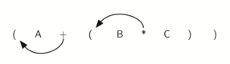

Stacks
------

What is a Stack?
~~~~~~~~~~~~~~~~

A **stack** (sometimes called a “push-down stack”) is an ordered
collection of items where the addition of new items and the removal of
existing items always takes place at the same end. This end is commonly
referred to as the “top.” The end opposite the top is known as the
“base.”

The base of the stack is significant since items stored in the stack
that are closer to the base represent those that have been in the stack
the longest. The most recently added item is the one that is in position
to be removed first. This ordering principle is sometimes called
**LIFO**, **last-in first-out**. It provides an ordering based on length
of time in the collection. Newer items are near the top, while older
items are near the base.

Many examples of stacks occur in everyday situations. Almost any
cafeteria has a stack of trays or plates where you take the one at the
top, uncovering a new tray or plate for the next customer in line.
Imagine a stack of books on a desk (:ref:`Figure 1 <fig_bookstack>`). The only
book whose cover is visible is the one on top. To access others in the
stack, we need to remove the ones that are sitting on top of them.
:ref:`Figure 2 <fig_objectstack>` shows another stack. This one contains a number
of primitive Python data objects.

.. _fig_bookstack:

.. figure:: Figures/bookstack2.png
   :align: center
   :scale: 50 %

   A Stack of Books

.. _fig_objectstack:

.. figure:: Figures/primitive.png
   :align: center
   :scale: 50 %

   A Stack of Primitive Python Objects

One of the most useful ideas related to stacks comes from the simple
observation of items as they are added and then removed. Assume you
start out with a clean desktop. Now place books one at a time on top of
each other. You are constructing a stack. Consider what happens when you
begin removing books. The order that they are removed is exactly the
reverse of the order that they were placed. Stacks are fundamentally
important, as they can be used to reverse the order of items. The order
of insertion is the reverse of the order of removal.
:ref:`Figure 3 <fig_reversal>` shows the Python data object stack as it was
created and then again as items are removed. Note the order of the
objects.

.. _fig_reversal:

.. figure:: Figures/simplereversal.png
   :align: center

   The Reversal Property of Stacks

Considering this reversal property, you can perhaps think of examples of
stacks that occur as you use your computer. For example, every web
browser has a Back button. As you navigate from web page to web page,
those pages are placed on a stack (actually it is the URLs that are
going on the stack). The current page that you are viewing is on the top
and the first page you looked at is at the base. If you click on the
Back button, you begin to move in reverse order through the pages.

The Stack Abstract Data Type
~~~~~~~~~~~~~~~~~~~~~~~~~~~~

The stack abstract data type is defined by the following structure and
operations. A stack is structured, as described above, as an ordered
collection of items where items are added to and removed from the end
called the “top.” Stacks are ordered LIFO. The stack operations are
given below.

-  ``Stack()`` creates a new stack that is empty. It needs no parameters
   and returns an empty stack.

-  ``push(item)`` adds a new item to the top of the stack. It needs the
   item and returns nothing.

-  ``pop()`` removes the top item from the stack. It needs no parameters
   and returns the item. The stack is modified.

-  ``peek()`` returns the top item from the stack but does not remove
   it. It needs no parameters. The stack is not modified.

-  ``isEmpty()`` tests to see whether the stack is empty. It needs no
   parameters and returns a boolean value.

-  ``size()`` returns the number of items on the stack. It needs no
   parameters and returns an integer.

For example, if ``s`` is a stack that has been created and starts out
empty, then :ref:`Table 1 <tbl_stackops>` shows the results of a sequence of
stack operations. Under stack contents, the top item is listed at the
far right.

.. _tbl_stackops:

============================ ======================== ================== 
         **Stack Operation**       **Stack Contents**   **Return Value** 
============================ ======================== ================== 
             ``s.isEmpty()``                   ``[]``           ``True`` 
               ``s.push(4)``                  ``[4]``                    
           ``s.push('dog')``            ``[4,'dog']``                    
                ``s.peek()``            ``[4,'dog']``          ``'dog'`` 
            ``s.push(True)``       ``[4,'dog',True]``                    
                ``s.size()``       ``[4,'dog',True]``              ``3`` 
             ``s.isEmpty()``       ``[4,'dog',True]``          ``False`` 
             ``s.push(8.4)``   ``[4,'dog',True,8.4]``                    
                 ``s.pop()``       ``[4,'dog',True]``            ``8.4`` 
                 ``s.pop()``            ``[4,'dog']``           ``True`` 
                ``s.size()``            ``[4,'dog']``              ``2`` 
============================ ======================== ================== 

    Sample Stack Operations

Implementing a Stack in Python
~~~~~~~~~~~~~~~~~~~~~~~~~~~~~~

Now that we have clearly defined the stack as an abstract data type we
will turn our attention to using Python to implement the stack. Recall
that when we give an abstract data type a physical implementation we
refer to the implementation as a data structure.

As we described in Chapter 1, in Python, as in any object-oriented
programming language, the implementation of choice for an abstract data
type such as a stack is the creation of a new class. The stack
operations are implemented as methods. Further, to implement a stack,
which is a collection of elements, it makes sense to utilize the power
and simplicity of the primitive collections provided by Python. We will
use a list.

Recall that the list class in Python provides an ordered collection
mechanism and a set of methods. For example, if we have the list
[2,5,3,6,7,4], we need only to decide which end of the list will be
considered the top of the stack and which will be the base. Once that
decision is made, the operations can be implemented using the list
methods such as ``append`` and ``pop``.

The following stack implementation (:ref:`Listing 1 <lst_stackcode1>`) assumes that
the end of the list will hold the top element of the stack. As the stack
grows (as ``push`` operations occur), new items will be added on the end
of the list. ``pop`` operations will manipulate that same end.

.. _lst_stackcode1:

.. activecode:: stack_1

   class Stack:
        def __init__(self):
            self.items = []

        def isEmpty(self):
            return self.items == []

        def push(self, item):
            self.items.append(item)

        def pop(self):
            return self.items.pop()

        def peek(self):
            return self.items[len(self.items)-1]

        def size(self):
            return len(self.items)

The following interactive Python session shows the ``Stack`` class in
action as we perform the sequence of operations from
:ref:`Table 1 <tbl_stackops>`.

.. activecode:: stack_ex_1
   :include:  stack_1
   
   s=Stack()
   print(s.isEmpty())
   s.push(4)
   s.push('dog')
   print(s.peek())
   s.push(True)
   print(s.size())
   print(s.isEmpty())
   s.push(8.4)
   print(s.pop())
   print(s.pop())
   print(s.size())
    

It is important to note that we could have chosen to implement the stack
using a list where the top is at the beginning instead of at the end. In
this case, the previous ``pop`` and ``append`` methods would no longer
work and we would have to index position 0 (the first item in the list)
explicitly using ``pop`` and ``insert``. The implementation is shown in
:ref:`Listing 2 <lst_stackcode2>`.

.. _lst_stackcode2:

.. codelens:: stack_cl_1

   class Stack:
        def __init__(self):
            self.items = []

        def isEmpty(self):
            return self.items == []

        def push(self, item):
            self.items.insert(0,item)

        def pop(self):
            return self.items.pop(0)

        def peek(self):
            return self.items[0]

        def size(self):
            return len(self.items)

   s = Stack()
   s.push('hello')
   s.push('true')
   print(s.pop())

This ability to change the physical implementation of an abstract data
type while maintaining the logical characteristics is an example of
abstraction at work. However, even though the stack will work either
way, if we consider the performance of the two implementations, there is
definitely a difference. Recall that the ``append`` and ``pop()``
operations were both O(1). This means that the first implementation will
perform push and pop in constant time no matter how many items are on
the stack. The performance of the second implementation suffers in that
the ``insert(0)`` and ``pop(0)`` operations will both require O(n) for a
stack of size n. Clearly, even though the implementations are logically
equivalent, they would have very different timings when performing
benchmark testing.

.. admonition:: Self Check

   .. multiplechoice:: stack_1
      :iscode:
      :answer_a: 'x' 
      :answer_b: 'y'
      :answer_c: 'z'
      :answer_d: The stack is empty
      :correct: c
      :feedback: Remember that a stack is built from the bottom up.

       Given the following sequence of stack operations what is the top item on the stack?
       m = Stack()
       m.push('x')
       m.push('y')
       m.pop():
       m.push('z')
       m.peek()

   .. multiplechoice:: stack_2
      :iscode:
      :answer_a: 'x'
      :answer_b: the stack is empty
      :answer_c: an error will occur
      :answer_d: 'z'
      :correct: c
      :feedback: none
	  
	  Given the following sequence of stack operations, what is the top item on the stack?
	  m = Stack()
	  m.push('x')
	  m.push('y')
	  m.push('z')
	  while not m.isEmpty():
	     m.pop()
         m.pop()

Simple Balanced Parentheses
~~~~~~~~~~~~~~~~~~~~~~~~~~~

We now turn our attention to using stacks to solve real computer science
problems. You have no doubt written arithmetic expressions such as

:math:`(5+6)*(7+8)/(4+3)`

where parentheses are used to order the performance of operations. You
may also have some experience programming in a language such as Lisp
with constructs like

::

    (defun square(n)
         (* n n))

This defines a function called ``square`` that will return the square of
its argument ``n``. Lisp is notorious for using lots and lots of
parentheses.

In both of these examples, parentheses must appear in a balanced
fashion. **Balanced parentheses** means that each opening symbol has a
corresponding closing symbol and the pairs of parentheses are properly
nested. Consider the following correctly balanced strings of
parentheses:

::

    (()()()())

    (((())))

    (()((())()))

Compare those with the following, which are not balanced:

::

    ((((((())

    ()))

    (()()(()

The ability to differentiate between parentheses that are correctly
balanced and those that are unbalanced is an important part of
recognizing many programming language structures.

The challenge then is to write an algorithm that will read a string of
parentheses from left to right and decide whether the symbols are
balanced. To solve this problem we need to make an important
observation. As you process symbols from left to right, the most recent
opening parenthesis must match the next closing symbol (see
:ref:`Figure 4 <fig_parmatch>`). Also, the first opening symbol processed may have to
wait until the very last symbol for its match. Closing symbols match
opening symbols in the reverse order of their appearance; they match
from the inside out. This is a clue that stacks can be used to solve the
problem.

.. _fig_parmatch:

.. figure:: Figures/simpleparcheck.png    

   Matching Parentheses

Once you agree that a stack is the appropriate data structure for
keeping the parentheses, the statement of the algorithm is
straightforward. Starting with an empty stack, process the parenthesis
strings from left to right. If a symbol is an opening parenthesis, push
it on the stack as a signal that a corresponding closing symbol needs to
appear later. If, on the other hand, a symbol is a closing parenthesis,
pop the stack. As long as it is possible to pop the stack to match every
closing symbol, the parentheses remain balanced. If at any time there is
no opening symbol on the stack to match a closing symbol, the string is
not balanced properly. At the end of the string, when all symbols have
been processed, the stack should be empty. The Python code to implement
this algorithm is shown in :ref:`Listing 3 <lst_parcheck1>`.

.. _lst_parcheck1:

.. activecode:: parcheck1

    from pythonds.basic.stack import Stack

    def parChecker(symbolString):
        s = Stack()
        balanced = True
        index = 0
        while index < len(symbolString) and balanced:
            symbol = symbolString[index]
            if symbol == "(":
                s.push(symbol)
            else: 
                if s.isEmpty():
                    balanced = False
                else:
                    s.pop()

            index = index + 1

        if balanced and s.isEmpty():
            return True
        else:
            return False
    
    print(parChecker('((()))'))
    print(parChecker('(()'))

This function, ``parChecker``, assumes that a ``Stack`` class is
available and returns a boolean result as to whether the string of
parentheses is balanced. Note that the boolean variable ``balanced`` is
initialized to ``True`` as there is no reason to assume otherwise at the
start. If the current symbol is ``(``, then it is pushed on the stack
(lines 9–10). Note also in line 15 that ``pop`` simply removes a symbol
from the stack. The returned value is not used since we know it must be
an opening symbol seen earlier. At the end (lines 19–22), as long as the
expression is balanced and the stack has been completely cleaned off,
the string represents a correctly balanced sequence of parentheses.

Balanced Symbols (A General Case)
~~~~~~~~~~~~~~~~~~~~~~~~~~~~~~~~~

The balanced parentheses problem shown above is a specific case of a
more general situation that arises in many programming languages. The
general problem of balancing and nesting different kinds of opening and
closing symbols properly occurs frequently. For example, in Python
square brackets, [ and ], are used for lists; curly braces, { and }, are
used for dictionaries; and parentheses, ( and ), are used for tuples and
arithmetic expressions. It is possible to mix symbols as long as each
maintains its own open and close relationship. Strings of symbols such
as

::

    { { ( [ ] [ ] ) } ( ) } 

    [ [ { { ( ( ) ) } } ] ] 

    [ ] [ ] [ ] ( ) { } 

are properly balanced in that not only does each opening symbol have a
corresponding closing symbol, but the types of symbols match as well.

Compare those with the following strings that are not balanced:

::

    ( [ ) ] 

    ( ( ( ) ] ) )

    [ { ( ) ]

The simple parentheses checker from the previous section can easily be
extended to handle these new types of symbols. Recall that each opening
symbol is simply pushed on the stack to wait for the matching closing
symbol to appear later in the sequence. When a closing symbol does
appear, the only difference is that we must check to be sure that it
correctly matches the type of the opening symbol on top of the stack. If
the two symbols do not match, the string is not balanced. Once again, if
the entire string is processed and nothing is left on the stack, the
string is correctly balanced.

The Python program to implement this is shown in :ref:`Listing 4 <lst_parcheck2>`.
The only change appears in line 17 where we call a helper function to
assist with symbol-matching. Each symbol that is removed from the stack
must be checked to see that it matches the current closing symbol. If a
mismatch occurs, the boolean variable ``balanced`` is set to ``False``.

.. _lst_parcheck2:

.. activecode :: parcheck2

   from pythonds.basic.stack import Stack
   def parChecker(symbolString):
       s = Stack()
       balanced = True
       index = 0
       while index < len(symbolString) and balanced:
           symbol = symbolString[index]
           if symbol in "([{":
               s.push(symbol)
           else:
               if s.isEmpty():
                   balanced = False
               else:
                   top = s.pop()
                   if not matches(top,symbol):
                          balanced = False
           index = index + 1
       if balanced and s.isEmpty():
           return True
       else:
           return False

   def matches(open,close):
       opens = "([{"
       closers = ")]}"
       return opens.index(open) == closers.index(close)

These two examples show that stacks are very important data structures
for the processing of language constructs in computer science. Almost
any notation you can think of has some type of nested symbol that must
be matched in a balanced order. There are a number of other important
uses for stacks in computer science. We will continue to explore them
next.

Converting Decimal Numbers to Binary Numbers
~~~~~~~~~~~~~~~~~~~~~~~~~~~~~~~~~~~~~~~~~~~~

In your study of computer science, you have probably been
exposed in one way or another to the idea of a binary number. Binary
representation is important in computer science since all values stored
within a computer exist as a string of binary digits, a string of 0s and
1s. Without the ability to convert back and forth between common
representations and binary numbers, we would need to interact with
computers in very awkward ways.

Integer values are common data items. They are used in computer programs
and computation all the time. We learn about them in math class and of
course represent them using the decimal number system, or base 10. The
decimal number :math:`233_{10}` and its corresponding binary
equivalent :math:`11101001_{2}` are interpreted respectively as

:math:`2\times10^{2} + 3\times10^{1} + 3\times10^{0}`

and

:math:`1\times2^{7} + 1\times2^{6} + 1\times2^{5} + 0\times2^{4} + 1\times2^{3} + 0\times2^{2} + 0\times2^{1} + 1\times2^{0}`

But how can we easily convert integer values into binary numbers? The
answer is an algorithm called “Divide by 2” that uses a stack to keep
track of the digits for the binary result.

The Divide by 2 algorithm assumes that we start with an integer greater
than 0. A simple iteration then continually divides the decimal number
by 2 and keeps track of the remainder. The first division by 2 gives
information as to whether the value is even or odd. An even value will
have a remainder of 0. It will have the digit 0 in the ones place. An
odd value will have a remainder of 1 and will have the digit 1 in the
ones place. We think about building our binary number as a sequence of
digits; the first remainder we compute will actually be the last digit
in the sequence. As shown in :ref:`Figure 5 <fig_decbin>`, we again see the
reversal property that signals that a stack is likely to be the
appropriate data structure for solving the problem.

.. _fig_decbin:

.. figure:: Figures/dectobin.png
   :align: center

   Decimal-to-Binary Conversion

The Python code in :ref:`Listing 5 <lst_binconverter>` implements the Divide by 2
algorithm. The function ``divideBy2`` takes an argument that is a
decimal number and repeatedly divides it by 2. Line 6 uses the built-in
modulo operator, %, to extract the remainder and line 7 then pushes it
on the stack. After the division process reaches 0, a binary string is
constructed in lines 10–12. Line 10 creates an empty string. The binary
digits are popped from the stack one at a time and appended to the
right-hand end of the string. The binary string is then returned.

.. _lst_binconverter:

.. activecode:: divby2

   from pythonds.basic.stack import Stack
   def divideBy2(decNumber):
       remstack = Stack()
   
       while decNumber > 0:
           rem = decNumber % 2
           remstack.push(rem)
           decNumber = decNumber // 2
   
       binString = ""
       while not remstack.isEmpty():
           binString = binString + str(remstack.pop())
   
       return binString
       
   print(divideBy2(42))

The algorithm for binary conversion can easily be extended to perform
the conversion for any base. In computer science it is common to use a
number of different encodings. The most common of these are binary,
octal (base 8), and hexadecimal (base 16).

The decimal number :math:`233` and its corresponding octal and
hexadecimal equivalents :math:`351_{8}` and :math:`E9_{16}` are
interpreted as

:math:`3\times8^{2} + 5\times8^{1} + 1\times8^{0}`

and

:math:`15\times16^{1} + 9\times16^{0}`

The function ``divideBy2`` can be modified to accept not only a decimal
value but also a base for the intended conversion. The “Divide by 2”
idea is simply replaced with a more general “Divide by base.” A new
function called ``baseConverter``, shown in :ref:`Listing 6 <lst_baseconverter>`,
takes a decimal number and any base between 2 and 16 as parameters. The
remainders are still pushed onto the stack until the value being
converted becomes 0. The same left-to-right string construction
technique can be used with one slight change. Base 2 through base 10
numbers need a maximum of 10 digits, so the typical digit characters 0,
1, 2, 3, 4, 5, 6, 7, 8, and 9 work fine. The problem comes when we go
beyond base 10. We can no longer simply use the remainders, as they are
themselves represented as two-digit decimal numbers. Instead we need to
create a set of digits that can be used to represent those remainders
beyond 9.

.. _lst_baseconverter:

.. activecode:: baseconvert

    from pythonds.basic.stack import Stack
    def baseConverter(decNumber,base):
        digits = "0123456789ABCDEF"

        remstack = Stack()

        while decNumber > 0:
            rem = decNumber % base
            remstack.push(rem)
            decNumber = decNumber // base

        newString = ""
        while not remstack.isEmpty():
            newString = newString + digits[remstack.pop()]

        return newString

    print(baseConverter(25))

A solution to this problem is to extend the digit set to include some
alphabet characters. For example, hexadecimal uses the ten decimal
digits along with the first six alphabet characters for the 16 digits.
To implement this, a digit string is created (line 3 in
:ref:`Listing 6 <lst_baseconverter>`) that stores the digits in their corresponding
positions. 0 is at position 0, 1 is at position 1, A is at position 10,
B is at position 11, and so on. When a remainder is removed from the
stack, it can be used to index into the digit string and the correct
resulting digit can be appended to the answer. For example, if the
remainder 13 is removed from the stack, the digit D is appended to the
resulting string.

Infix, Prefix and Postfix Expressions
~~~~~~~~~~~~~~~~~~~~~~~~~~~~~~~~~~~~~

When you write an arithmetic expression such as B \* C, the form of the
expression provides you with information so that you can interpret it
correctly. In this case we know that the variable B is being multiplied
by the variable C since the multiplication operator \* appears between
them in the expression. This type of notation is referred to as
**infix** since the operator is *in between* the two operands that it is
working on.

Consider another infix example, A + B \* C. The operators + and \* still
appear between the operands, but there is a problem. Which operands do
they work on? Does the + work on A and B or does the \* take B and C?
The expression seems ambiguous.

In fact, you have been reading and writing these types of expressions
for a long time and they do not cause you any problem. The reason for
this is that you know something about the operators + and \*. Each
operator has a **precedence** level. Operators of higher precedence are
used before operators of lower precedence. The only thing that can
change that order is the presence of parentheses. The precedence order
for arithmetic operators places multiplication and division above
addition and subtraction. If two operators of equal precedence appear,
then a left-to-right ordering or associativity is used.

Let’s interpret the troublesome expression A + B \* C using operator
precedence. B and C are multiplied first, and A is then added to that
result. (A + B) \* C would force the addition of A and B to be done
first before the multiplication. In expression A + B + C, by precedence
(via associativity), the leftmost + would be done first.

Although all this may be obvious to you, remember that computers need to
know exactly what operators to perform and in what order. One way to
write an expression that guarantees there will be no confusion with
respect to the order of operations is to create what is called a **fully
parenthesized** expression. This type of expression uses one pair of
parentheses for each operator. The parentheses dictate the order of
operations; there is no ambiguity. There is also no need to remember any
precedence rules.

The expression A + B \* C + D can be rewritten as ((A + (B \* C)) + D)
to show that the multiplication happens first, followed by the leftmost
addition. A + B + C + D can be written as (((A + B) + C) + D) since the
addition operations associate from left to right.

There are two other very important expression formats that may not seem
obvious to you at first. Consider the infix expression A + B. What would
happen if we moved the operator before the two operands? The resulting
expression would be + A B. Likewise, we could move the operator to the
end. We would get A B +. These look a bit strange.

These changes to the position of the operator with respect to the
operands create two new expression formats, **prefix** and **postfix**.
Prefix expression notation requires that all operators precede the two
operands that they work on. Postfix, on the other hand, requires that
its operators come after the corresponding operands. A few more examples
should help to make this a bit clearer (see :ref:`Table 2 <tbl_example1>`).

A + B \* C would be written as + A \* B C in prefix. The multiplication
operator comes immediately before the operands B and C, denoting that \*
has precedence over +. The addition operator then appears before the A
and the result of the multiplication.

In postfix, the expression would be A B C \* +. Again, the order of
operations is preserved since the \* appears immediately after the B and
the C, denoting that \* has precedence, with + coming after. Although
the operators moved and now appear either before or after their
respective operands, the order of the operands stayed exactly the same
relative to one another.

.. _tbl_example1:

============================ ======================= ======================== 
        **Infix Expression**   **Prefix Expression**   **Postfix Expression** 
============================ ======================= ======================== 
                       A + B                  \+ A B                    A B + 
                  A + B \* C             \+ A \* B C               A B C \* + 
============================ ======================= ======================== 

     Examples of Infix, Prefix, and Postfix

Now consider the infix expression (A + B) \* C. Recall that in this
case, infix requires the parentheses to force the performance of the
addition before the multiplication. However, when A + B was written in
prefix, the addition operator was simply moved before the operands, + A
B. The result of this operation becomes the first operand for the
multiplication. The multiplication operator is moved in front of the
entire expression, giving us \* + A B C. Likewise, in postfix A B +
forces the addition to happen first. The multiplication can be done to
that result and the remaining operand C. The proper postfix expression
is then A B + C \*.

Consider these three expressions again (see :ref:`Table 3 <tbl_parexample>`).
Something very important has happened. Where did the parentheses go? Why
don’t we need them in prefix and postfix? The answer is that the
operators are no longer ambiguous with respect to the operands that they
work on. Only infix notation requires the additional symbols. The order
of operations within prefix and postfix expressions is completely
determined by the position of the operator and nothing else. In many
ways, this makes infix the least desirable notation to use.

.. _tbl_parexample:

============================ ======================= ======================== 
        **Infix Expression**   **Prefix Expression**   **Postfix Expression** 
============================ ======================= ======================== 
                (A + B) \* C              \* + A B C               A B + C \* 
============================ ======================= ======================== 

    An Expression with Parentheses

:ref:`Table 4 <tbl_example3>` shows some additional examples of infix expressions and
the equivalent prefix and postfix expressions. Be sure that you
understand how they are equivalent in terms of the order of the
operations being performed.

.. _tbl_example3:

============================ ======================= ======================== 
        **Infix Expression**   **Prefix Expression**   **Postfix Expression** 
============================ ======================= ======================== 
              A + B \* C + D        \+ \+ A \* B C D           A B C \* + D + 
          (A + B) \* (C + D)          \* + A B + C D           A B + C D + \* 
             A \* B + C \* D        \+ \* A B \* C D          A B \* C D \* + 
               A + B + C + D          \+ + + A B C D            A B + C + D + 
============================ ======================= ======================== 

    Additional Examples of Infix, Prefix, and Postfix

Conversion of Infix Expressions to Prefix and Postfix
^^^^^^^^^^^^^^^^^^^^^^^^^^^^^^^^^^^^^^^^^^^^^^^^^^^^^

So far, we have used ad hoc methods to convert between infix expressions
and the equivalent prefix and postfix expression notations. As you might
expect, there are algorithmic ways to perform the conversion that allow
any expression of any complexity to be correctly transformed.

The first technique that we will consider uses the notion of a fully
parenthesized expression that was discussed earlier. Recall that A + B
\* C can be written as (A + (B \* C)) to show explicitly that the
multiplication has precedence over the addition. On closer observation,
however, you can see that each parenthesis pair also denotes the
beginning and the end of an operand pair with the corresponding operator
in the middle.

Look at the right parenthesis in the subexpression (B \* C) above. If we
were to move the multiplication symbol to that position and remove the
matching left parenthesis, giving us B C \*, we would in effect have
converted the subexpression to postfix notation. If the addition
operator were also moved to its corresponding right parenthesis position
and the matching left parenthesis were removed, the complete postfix
expression would result (see :ref:`Figure 6 <fig_moveright>`).

.. _fig_moveright:

.. figure:: Figures/moveright.png
   :align: center

   Moving Operators to the Right for Postfix Notation

If we do the same thing but instead of moving the symbol to the position
of the right parenthesis, we move it to the left, we get prefix notation
(see :ref:`Figure 7 <fig_moveleft>`). The position of the parenthesis pair is
actually a clue to the final position of the enclosed operator.

.. _fig_moveleft:

   Moving Operators to the Left for Prefix Notation

So in order to convert an expression, no matter how complex, to either
prefix or postfix notation, fully parenthesize the expression using the
order of operations. Then move the enclosed operator to the position of
either the left or the right parenthesis depending on whether you want
prefix or postfix notation.

Here is a more complex expression: (A + B) \* C - (D - E) \* (F + G).
:ref:`Figure 8 <fig_complexmove>` shows the conversion to postfix and prefix
notations.

.. _fig_complexmove:

.. figure:: Figures/complexmove.png
   :align: center

   Converting a Complex Expression to Prefix and Postfix Notations

General Infix-to-Postfix Conversion
^^^^^^^^^^^^^^^^^^^^^^^^^^^^^^^^^^^

We need to develop an algorithm to convert any infix expression to a
postfix expression. To do this we will look closer at the conversion
process.

Consider once again the expression A + B \* C. As shown above,
A B C \* + is the postfix equivalent. We have already noted that the
operands A, B, and C stay in their relative positions. It is only the
operators that change position. Let’s look again at the operators in the
infix expression. The first operator that appears from left to right is
+. However, in the postfix expression, + is at the end since the next
operator, \*, has precedence over addition. The order of the operators
in the original expression is reversed in the resulting postfix
expression.

As we process the expression, the operators have to be saved somewhere
since their corresponding right operands are not seen yet. Also, the
order of these saved operators may need to be reversed due to their
precedence. This is the case with the addition and the multiplication in
this example. Since the addition operator comes before the
multiplication operator and has lower precedence, it needs to appear
after the multiplication operator is used. Because of this reversal of
order, it makes sense to consider using a stack to keep the operators
until they are needed.

What about (A + B) \* C? Recall that A B + C \* is the postfix
equivalent. Again, processing this infix expression from left to right,
we see + first. In this case, when we see \*, + has already been placed
in the result expression because it has precedence over \* by virtue of
the parentheses. We can now start to see how the conversion algorithm
will work. When we see a left parenthesis, we will save it to denote
that another operator of high precedence will be coming. That operator
will need to wait until the corresponding right parenthesis appears to
denote its position (recall the fully parenthesized technique). When
that right parenthesis does appear, the operator can be popped from the
stack.

As we scan the infix expression from left to right, we will use a stack
to keep the operators. This will provide the reversal that we noted in
the first example. The top of the stack will always be the most recently
saved operator. Whenever we read a new operator, we will need to
consider how that operator compares in precedence with the operators, if
any, already on the stack.

Assume the infix expression is a string of tokens delimited by spaces.
The operator tokens are \*, /, +, and -, along with the left and right
parentheses, ( and ). The operand tokens are the single-character
identifiers A, B, C, and so on. The following steps will produce a
string of tokens in postfix order.

#. Create an empty stack called ``opstack`` for keeping operators.
   Create an empty list for output.

#. Convert the input infix string to a list by using the string method
   ``split``.

#. Scan the token list from left to right.

   -  If the token is an operand, append it to the end of the output
      list.

   -  If the token is a left parenthesis, push it on the ``opstack``.

   -  If the token is a right parenthesis, pop the ``opstack`` until the
      corresponding left parenthesis is removed. Append each operator to
      the end of the output list.

   -  If the token is an operator, \*, /, +, or -, push it on the
      ``opstack``. However, first remove any operators already on the
      ``opstack`` that have higher or equal precedence and append them
      to the output list.

#. When the input expression has been completely processed, check the
   ``opstack``. Any operators still on the stack can be removed and
   appended to the end of the output list.

:ref:`Figure 9 <fig_intopost>` shows the conversion algorithm working on the
expression A \* B + C \* D. Note that the first \* operator is removed
upon seeing the + operator. Also, + stays on the stack when the second
\* occurs, since multiplication has precedence over addition. At the end
of the infix expression the stack is popped twice, removing both
operators and placing + as the last operator in the postfix expression.

.. _fig_intopost:

.. figure:: Figures/intopost.png
   :align: center

   Converting A \* B + C \* D to Postfix Notation

In order to code the algorithm in Python, we will use a dictionary
called ``prec`` to hold the precedence values for the operators. This
dictionary will map each operator to an integer that can be compared
against the precedence levels of other operators (we have arbitrarily
used the integers 3, 2, and 1). The left parenthesis will receive the
lowest value possible. This way any operator that is compared against it
will have higher precedence and will be placed on top of it. Note that
we have also imported the string module which contains a number of
predefined variables. In this case we are using a string containing all
possible upper-case alphabet characters ({string.ascii\_uppercase}) to
represent all possible operands. The complete conversion function is
shown in :ref:`Listing 7 <lst_intopost>`.

.. _lst_intopost:

.. activecode:: intopost
   :caption: Converting Infix Expressions to Postfix Expressions

   from pythonds.basic.stack import Stack

   def infixToPostfix(infixexpr):
       prec = {}
       prec["*"] = 3
       prec["/"] = 3
       prec["+"] = 2
       prec["-"] = 2
       prec["("] = 1
       opStack = Stack()
       postfixList = []
       tokenList = infixexpr.split()

       for token in tokenList:
           if token in "ABCDEFGHIJKLMNOPQRSTUVWXYZ" or token in "0123456789":
               postfixList.append(token)
           elif token == '(':
               opStack.push(token)
           elif token == ')':
               topToken = opStack.pop()
               while topToken != '(':
                   postfixList.append(topToken)
                   topToken = opStack.pop()
           else:
               while (not opStack.isEmpty()) and \
                  (prec[opStack.peek()] >= prec[token]):
                     postfixList.append(opStack.pop())
               opStack.push(token)

       while not opStack.isEmpty():
           postfixList.append(opStack.pop())
       return " ".join(postfixList)

   print(infixToPostfix("A * B + C * D"))
   print(infixToPostfix("( A + B ) * C - ( D - E ) * ( F + G )"))

--------------

A few examples of execution in the Python shell are shown below.

::

    >>> infixtopostfix("( A + B ) * ( C + D )")
    'A B + C D + *'
    >>> infixtopostfix("( A + B ) * C")
    'A B + C *'
    >>> infixtopostfix("A + B * C")
    'A B C * +'
    >>> 

Postfix Evaluation
^^^^^^^^^^^^^^^^^^

As a final stack example, we will consider the evaluation of an
expression that is already in postfix notation. In this case, a stack is
again the data structure of choice. However, as you scan the postfix
expression, it is the operands that must wait, not the operators as in
the conversion algorithm above. Another way to think about the solution
is that whenever an operator is seen on the input, the two most recent
operands will be used in the evaluation.

To see this in more detail, consider the postfix expression
``4 5 6 * +``. As you scan the expression from left to right, you first
encounter the operands 4 and 5. At this point, you are still unsure what
to do with them until you see the next symbol. Placing each on the stack
ensures that they are available if an operator comes next.

In this case, the next symbol is another operand. So, as before, push it
and check the next symbol. Now we see an operator, \*. This means that
the two most recent operands need to be used in a multiplication
operation. By popping the stack twice, we can get the proper operands
and then perform the multiplication (in this case getting the result
30).

We can now handle this result by placing it back on the stack so that it
can be used as an operand for the later operators in the expression.
When the final operator is processed, there will be only one value left
on the stack. Pop and return it as the result of the expression.
:ref:`Figure 10 <fig_evalpost1>` shows the stack contents as this entire example
expression is being processed.

.. _fig_evalpost1:

.. figure:: Figures/evalpostfix1.png
   :align: center

   Stack Contents During Evaluation

:ref:`Figure 11 <fig_evalpost2>` shows a slightly more complex example, 7 8 + 3 2
+ /. There are two things to note in this example. First, the stack size
grows, shrinks, and then grows again as the subexpressions are
evaluated. Second, the division operation needs to be handled carefully.
Recall that the operands in the postfix expression are in their original
order since postfix changes only the placement of operators. When the
operands for the division are popped from the stack, they are reversed.
Since division is *not* a commutative operator, in other words
:math:`15/5` is not the same as :math:`5/15`, we must be sure that
the order of the operands is not switched.

.. _fig_evalpost2:

.. figure:: Figures/evalpostfix2.png
   :align: center

   A More Complex Example of Evaluation

Assume the postfix expression is a string of tokens delimited by spaces.
The operators are \*, /, +, and - and the operands are assumed to be
single-digit integer values. The output will be an integer result.

#. Create an empty stack called ``operandStack``.

#. Convert the string to a list by using the string method ``split``.

#. Scan the token list from left to right.

   -  If the token is an operand, convert it from a string to an integer
      and push the value onto the ``operandStack``.

   -  If the token is an operator, \*, /, +, or -, it will need two
      operands. Pop the ``operandStack`` twice. The first pop is the
      second operand and the second pop is the first operand. Perform
      the arithmetic operation. Push the result back on the
      ``operandStack``.

#. When the input expression has been completely processed, the result
   is on the stack. Pop the ``operandStack`` and return the value.

The complete function for the evaluation of postfix expressions is shown
in :ref:`Listing 8 <lst_postfixeval>`. To assist with the arithmetic, a helper
function ``doMath`` is defined that will take two operands and an
operator and then perform the proper arithmetic operation.

.. _lst_postfixeval:

.. activecode:: postfixeval
   :caption: Postfix Evaluation

   from pythonds.basic.stack import Stack

   def postfixEval(postfixExpr):
       operandStack = Stack()
       tokenList = postfixExpr.split()

       for token in tokenList:
           if token in "0123456789":
               operandStack.push(int(token))
           else:
               operand2 = operandStack.pop()
               operand1 = operandStack.pop()
               result = doMath(token,operand1,operand2)
               operandStack.push(result)
       return operandStack.pop()

   def doMath(op, op1, op2):
       if op == "*":
           return op1 * op2
       elif op == "/":
           return op1 / op2
       elif op == "+":
           return op1 + op2
       else:
           return op1 - op2

It is important to note that in both the postfix conversion and the
postfix evaluation programs we assumed that there were no errors in the
input expression. Using these programs as a starting point, you can
easily see how error detection and reporting can be included. We leave
this as an exercise at the end of the chapter.