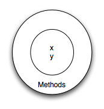

..  Copyright (C)  Brad Miller, David Ranum, Jeffrey Elkner, Peter Wentworth, Allen B. Downey, Chris
    Meyers, and Dario Mitchell.  Permission is granted to copy, distribute
    and/or modify this document under the terms of the GNU Free Documentation
    License, Version 1.3 or any later version published by the Free Software
    Foundation; with Invariant Sections being Forward, Prefaces, and
    Contributor List, no Front-Cover Texts, and no Back-Cover Texts.  A copy of
    the license is included in the section entitled "GNU Free Documentation
    License".
    
..  shortname:: IntroToClasses
..  description:: This is the introduction to the idea of building a class

Classes and Objects - the Basics
================================

.. index:: object-oriented programming

Object-oriented programming
---------------------------

Python is an **object-oriented programming language**, which means that it
provides features that support `object-oriented programming
<http://en.wikipedia.org/wiki/Object-oriented_programming>`__ (**OOP**).

Object-oriented programming has its roots in the 1960s, but it wasn't until the
mid 1980s that it became the main `programming paradigm
<http://en.wikipedia.org/wiki/Programming_paradigm>`__ used in the creation
of new software. It was developed as a way to handle the rapidly increasing
size and complexity of software systems, and to make it easier to modify these
large and complex systems over time.

Up to now, some of the programs we have been writing use a `procedural programming
<http://en.wikipedia.org/wiki/Procedural_programming>`__ paradigm. In
procedural programming the focus is on writing functions or *procedures* which
operate on data. In object-oriented programming the focus is on the creation of
**objects** which contain both data and functionality together.
Usually, each object definition corresponds to some object or concept in the real
world and the functions that operate on that object correspond to the ways
real-world objects interact.

A change of perspective
-----------------------

Throughout the earlier chapters, we wrote functions and called them using a syntax such as ``drawCircle(tess)``.  This suggests that the
function is the active agent. It says something like, *"Hey, drawCircle!  
Here's a turtle object for you to use to draw with."*

In object-oriented programming, the objects are considered the active agents. 
For example, in our early introduction to turtles, we used
an object-oriented style, so that we said ``tess.forward(100)``, which 
asks the turtle to move itself forward by the given number of steps.
An
invocation like ``tess.circle()`` says *"Hey tess!
Please use your circle method!"*

This change in perspective might be more polite, but it may not initially
be obvious that it is useful. Often times shifting responsibility from 
the functions onto the objects makes it possible to write more versatile 
functions and makes it easier to maintain and reuse code.  

The most important advantage of the object-oriented style is that it
fits our mental chunking and real-life experience more accurately. 
In real life our ``cook`` method is part of our microwave oven --- we don't
have a ``cook`` function sitting in the corner of the kitchen, into which
we pass the microwave!  Similarly, we use the cellphone's own methods 
to send an sms, or to change its state to silent.  The functionality 
of real-world objects tends to be tightly bound up inside the objects 
themselves.  OOP allows us to accurately mirror this when we
organize our programs.
 
Objects Revisited
-----------------

In Python, every value is actually an object. Whether it be a turtle, a list, or even an integer, they are all objects.  Programs manipulate those objects either by performing
computation with them or by asking them to perform methods.  To be more specific, we say that an object has
a **state** and a collection of **methods** that it can perform.  The state of an object represents those things
that the object knows about itself.  For example, as we have seen with turtle objects, each turtle has a state consisting
of the turtle's position, its color, its heading and so on.  Each turtle also has the ability to go forward, backward, or turn right or left.  Individual turtles are different in that even though they are
all turtles, they differ in the values of the individual state values (maybe they are in a different location or have a different heading).

.. image:: Figures/objectpic1.png
   :alt: Simple object has state and methods

.. index:: compound data type

User Defined Classes
--------------------

We've already seen classes like ``str``, ``int``, ``float`` and ``Turtle``.  These were defined by Python and
made available for us to use.  However, in many cases when we are solving problems we need to create data objects
that are related to the problem we are trying to solve.  We need to create our own class.

As an example, consider the concept of a mathematical point. In two dimensions, a point is two
numbers (coordinates) that are treated collectively as a single object. 
Points are often written in parentheses with a comma
separating the coordinates. For example, ``(0, 0)`` represents the origin, and
``(x, y)`` represents the point ``x`` units to the right and ``y`` units up
from the origin.  This ``(x,y)`` is the state of the point.

Thinking about our diagram above, we could draw a ``point`` object as shown here.

Some of the typical operations that one associates with points might be to ask
the point for its x coordinate, ``getX``, or to ask for its y coordinate, ``getY``.  You may also
calculating the distance of a point from the origin, or from another point,
or finding a midpoint of two points, or asking if a point falls within a
given rectangle or circle.  We'll shortly see how we can organize these
together with the data.

.. image:: Figures/objectpic3.png
   :alt: A point also has methods

Now that we understand what a ``point`` object might look like, we can define a new **class**. 
We'll want our points to each have an ``x`` and a ``y`` attribute,
so our first class definition looks like this.

.. sourcecode:: python
    :linenos:
    
    class Point:
        """ Point class for representing and manipulating x,y coordinates. """
        
        def __init__(self):
            """ Create a new point at the origin """
            self.x = 0
            self.y = 0          

Class definitions can appear anywhere in a program, but they are usually near
the beginning (after the ``import`` statements). The syntax rules for a class
definition are the same as for other compound statements. There is a header
which begins with the keyword, ``class``, followed by the name of the class,
and ending with a colon.

If the first line after the class header is a string, it becomes
the docstring of the class, and will be recognized by various tools.  (This
is also the way docstrings work in functions.)

Every class should have a method with the special name ``__init__``.  
This **initializer method**, often referred to as the **constructor**, is automatically called whenever a new 
instance of ``Point`` is created.  It gives the programmer the opportunity 
to set up the attributes required within the new instance by giving them 
their initial state / values.  The ``self`` parameter (you could choose any
other name, but nobody ever does!) is automatically set to reference
the newly created object that needs to be initialized.   

So let's use our new Point class now.

.. activecode:: chp13_classes1
    
    class Point:
        """ Point class for representing and manipulating x,y coordinates. """
        
        def __init__(self):
 
            self.x = 0
            self.y = 0
    
    p = Point()         # Instantiate an object of type Point
    q = Point()         # and make a second point

    print("Nothing seems to have happened with the points")
    
   
During the initialization of the objects, we created two
attributes called `x` and `y` for each, and gave them both the value 0.  You will note that when you run the
program, nothing happens.  It turns out that this is not quite the case.  In fact, two ``Points`` have been created, each
having an x and y coordinate with value 0.  However, because we have not asked the point to do anything, we don't see any other result.

.. image:: Figures/objectpic4.png
   :alt: Simple object has state and methods

The following program adds a few print statements. You can see that the output suggests that each one is a ``Point object``.
However, notice that the ``is`` operator returns ``False`` meaning that they are different objects (we will have more to say about this in a later chapter).

.. activecode:: chp13_classes2
    
    class Point:
        """ Point class for representing and manipulating x,y coordinates. """
        
        def __init__(self):
 
            self.x = 0
            self.y = 0
    
    p = Point()         # Instantiate an object of type Point
    q = Point()         # and make a second point

    print(p)
    print(q)

    print(p is q)

This should look familiar --- we've used classes before to create
more than one object:   

.. sourcecode:: python

    from turtle import Turtle    
    
    tess = Turtle()     # Instantiate objects of type Turtle   
    alex = Turtle()  
 
The variables ``p`` and ``q`` are assigned references to two new ``Point`` objects. 
A function like ``Turtle`` or ``Point`` that creates a new object instance 
is called a **constructor**, and every class automatically provides a
constructor function which is named the same as the class.

It may be helpful to think of a class as a factory for making objects.  
The class itself isn't an instance of a point, but it contains the machinery 
to make point instances.   Every time you call the constructor, you're asking
the factory to make you a new object.  As the object comes off the 
production line, its initialization method is executed to 
get the object properly set up with it's factory default settings.

The combined process of "make me a new object" and "get its settings initialized
to the factory default settings" is called **instantiation**.  

Improving our Constructor
------------------------- 

Our constructor so far can only create points at location ``(0,0)``.  To create a point at position (7, 6) requires that we
provide some additional capability for the use to pass information to the constructor.  Since constructors are simply specially named functions, we can use parameters (as we've seen before) to provide the specific information.
    
We can make our class constructor more general by putting extra parameters into
the ``__init__`` method, as shown in this example.

.. activecode:: chp13_classes3
    
    class Point:
        """ Point class for representing and manipulating x,y coordinates. """
        
        def __init__(self, initX, initY):
 
            self.x = initX
            self.y = initY
    
    p = Point(7,6)

Now when we create new points, we supply the x and y coordinates as parameters.  When the point is created, the values of ``initX`` and ``initY`` are assigned to the state of the object.

.. image:: Figures/objectpic5.png
   :alt: Simple object has state and methods

       
Adding Other Methods to our Class
---------------------------------
          
The key advantage of using a class like ``Point`` rather than something like a simple
tuple ``(7, 6)`` now becomes apparent.  We can add methods to
the ``Point`` class that are sensible operations for points.  Had we chosen to use a simple
tuple to represent the point, we would not have this capability.
Creating a class like ``Point`` brings an exceptional
amount of "organizational power" to our programs, and to our thinking. 
We can group together the sensible operations, and the kinds of data 
they apply to, and each instance of the class can have its own state.       
          
A **method** behaves like a function but it is invoked on a specific
instance.  For example, with a turtle named ``tesss``,  ``tess.right(90)`` asks the ``tess`` object to perform its
``right`` method and turn 90 degrees.   Methods are accessed using dot notation.  

Let's add two simple methods to allow a point to give us information about its state.  The ``getX`` method, when invoked, will return the value of the x coordinate.  The implementation of this method is straight forward since we already know how
to write functions that return values.  One thing to notice is that even though the ``getX`` method does not need any other parameter information to do its work, there is still one formal parameter, ``self``.  As we stated earlier, all method defined in a class that operate on objects of that class will have ``self`` as their first parameter.  Again, this serves as reference to the object itself which in turn gives access to the state data inside the object.

.. activecode:: chp13_classes4
    
    class Point:
        """ Point class for representing and manipulating x,y coordinates. """
        
        def __init__(self, initX, initY):
 
            self.x = initX
            self.y = initY

        def getX(self):
            return self.x

        def getY(self):
            return self.y

    
    p = Point(7,6)
    print(p.getX())
    print(p.getY())

Likewise, the ``getY`` method will look the same.

Let's add another method, ``distanceFromOrigin``, to see better how methods
work.  This method will again not need any additional information to do its work.
It will perform a more complex task.

.. activecode:: chp13_classes5
    
    class Point:
        """ Point class for representing and manipulating x,y coordinates. """
        
        def __init__(self, initX, initY):
 
            self.x = initX
            self.y = initY

        def getX(self):
            return self.x

        def getY(self):
            return self.y

        def distanceFromOrigin(self):
            return ((self.x ** 2) + (self.y ** 2)) ** 0.5

    
    p = Point(7,6)
    print(p.distanceFromOrigin())

Notice that the caller of ``distanceFromOrigin`` does not explicitly 
supply an argument to match the ``self`` parameter.  This is true of all method calls. The definition will always
have one additional parameter as compared to the invocation.  

    
Objects as Arguments and Parameters
-------------------------------------

You can pass an object as a argument in the usual way.  We've already seen
this in some of the turtle examples, where we passed the turtle to
some function like ``drawRectangle`` so that the function could 
control and use whatever turtle instance we passed to it.

Here is a simple function involving our new ``Point`` objects.
 
.. activecode:: chp13_classes6

    import math
    
    class Point:
        """ Point class for representing and manipulating x,y coordinates. """
        
        def __init__(self, initX, initY):
 
            self.x = initX
            self.y = initY

        def getX(self):
            return self.x

        def getY(self):
            return self.y

        def distanceFromOrigin(self):
            return ((self.x ** 2) + (self.y ** 2)) ** 0.5

    def distance(point1, point2):
        xdiff = point2.getX()-point1.getX()
        ydiff = point2.getY()-point1.getY()

        dist = math.sqrt(xdiff**2 + ydiff**2)
        return dist
    
    p = Point(4,3)
    q = Point(0,0)
    print(distance(p,q))

``distance`` takes two points and returns the distance between them.  Note that ``distance`` is **not** a method of the Point class.  You can see this by looking at the indentation pattern.  It is not inside the class definition.  The other way we
can know that ``distance`` is not a method of Point is that ``self`` is not included as a formal parameter.  In addition, we do not invoke ``distance`` using the dot notation.

Converting an Object to a String
--------------------------------

Most object-oriented programmers probably would not do what we've just done in ``print_point``.  
When we're working with classes and objects, a preferred alternative
is to add a new method to the class.  And we don't like chatterbox methods that call
``print``.  A better approach is to have a method so that every instance
can produce a string representation of itself.  Let's initially 
call it ``to_string``:

.. activecode:: chp13_classesstr1
    
    class Point:
        """ Point class for representing and manipulating x,y coordinates. """
        
        def __init__(self, initX, initY):
 
            self.x = initX
            self.y = initY

        def getX(self):
            return self.x

        def getY(self):
            return self.y

        def distanceFromOrigin(self):
            return ((self.x ** 2) + (self.y ** 2)) ** 0.5

    
    p = Point(7,6)
    print(p)

The ``print`` function shown above produces a string representation of the Point ``p``.  The default provided by
Python tells you that ``p`` is an object of type ``Point``.  However, it does not tell you anything about the specific
state of the point.

We can improve on this representation if we include a special method call ``__str__``.  Notice that this method uses the same naming convention as the constructor, that is two underscores before and after the name.  It is common that Python
uses this naming technique for special methods.

The ``__str__`` method is responsible for returning a string representation as defined by the class creator.  In other words, you as the programmer, get to choose what a ``Point`` should look like when it gets printed.  In this case, we
have decided that the string representation will include the values of x and y as well as some identifying text.  It
is required that the ``__str__`` method create and *return* a string.

.. activecode:: chp13_classesstr2

    class Point:
        """ Point class for representing and manipulating x,y coordinates. """

        def __init__(self, initX, initY):

            self.x = initX
            self.y = initY

        def getX(self):
            return self.x

        def getY(self):
            return self.y

        def distanceFromOrigin(self):
            return ((self.x ** 2) + (self.y ** 2)) ** 0.5
          
        def __str__(self):
            return "x=" + str(self.x) + ", y=" + str(self.y)

    p = Point(7,6)
    print(p)

When we run the program above you can see that the ``print`` function now shows the string that we chose.

Now, you ask, don't we already have an ``str`` type converter that can 
turn our object into a string?  Yes we do!  

And doesn't ``print``
automatically use this when printing things?  Yes again! 

But these automatic mechanisms do not yet do exactly what we want.  Python provides many default implementations for
methods that we as programmers will probably want to change.  When a programmer changes the meaning of a special method we
say that we **override** the method.  Note also that the ``str`` type converter function uses whatever ``__str__`` method we
provide.

Instances as Return Values
--------------------------

Functions and methods can return objects.  This is actually nothing new since everything in Python is an object and we have
been returning values for quite some time.  The difference here is that we want to have the method create an object using
the constructor and then return it as the value of the method.

    
Suppose you have a point object
and wish to find the midpoint halfway between it and some other target point.  We would like to write a method, call
it ``halfway`` that takes another ``Point`` as a parameter and returns the ``Point`` that is halfway between the point and
the target.

.. activecode:: chp13_classesmid1

    class Point:

        def __init__(self, initX, initY):

            self.x = initX
            self.y = initY

        def getX(self):
            return self.x

        def getY(self):
            return self.y

        def distanceFromOrigin(self):
            return ((self.x ** 2) + (self.y ** 2)) ** 0.5
          
        def __str__(self):
            return "x=" + str(self.x) + ", y=" + str(self.y)

        def halfway(self, target): 
             mx = (self.x + target.x)/2
             my = (self.y + target.y)/2
             return Point(mx, my)

    p = Point(3,4)
    q = Point(5,12)
    mid = p.halfway(q)

    print(mid)
    print(mid.getX())
    print(mid.getY())
       

The resulting Point, ``mid``, has an x value of 4 and a y value of 8.  We can also use any other methods since ``mid`` is a
``Point`` object.

    

Glossary
--------

.. glossary::

    attribute
        One of the named data items that makes up an instance.

    class
        A user-defined compound type. A class can also be thought of as a
        template for the objects that are instances of it. (The iPhone is
        a class. By December 2010, estimates are that 50 million instances 
        had been sold!)
        
    constructor
        Every class has a "factory", called by the same name as the class, for
        making new instances.  If the class has an *initializer method*, this method
        is used to get the attributes (i.e. the state) of the new object properly set up. 
            
    initializer method
        A special method in Python (called ``__init__``) 
        that is invoked automatically to set a newly created object's
        attributes to their initial (factory-default) state.
        
    instance
        An object whose type is of some class.  Instance and object are used
        interchangeably.
        
    instantiate
        To create an instance of a class, and to run its initializer. 
        
    method
        A function that is defined inside a class definition and is invoked on
        instances of that class. 

    object
        A compound data type that is often used to model a thing or concept in
        the real world.  It bundles together the data and the operations that 
        are relevant for that kind of data.  Instance and object are used
        interchangeably.

    object-oriented programming
        A powerful style of programming in which data and the operations 
        that manipulate it are organized into classes and methods.        

    object-oriented language
        A language that provides features, such as user-defined classes and
        inheritance, that facilitate object-oriented programming.

Exercises
---------

#. Rewrite the ``distance`` function from chapter 5 so that it takes two
   ``Point``\ s as parameters instead of four numbers.
   
#. Add a method ``reflect_x`` to Point which returns a new Point, one which is the 
   reflection of the point about the x-axis.  For example, 
   ``Point(3, 5).reflect_x()`` is (3, -5)

#. Add a method ``slope_from_origin`` which returns the slope of the line joining the origin
   to the point.   For example, ::
   
      >>> Point(4, 10).slope_from_origin()
      2.5     
      
   What cases will cause your method to fail? 
   
#. The equation of a straight line is  "y = ax + b", (or perhaps "y = mx + c").
   The coefficients a and b completely describe the line.  Write a method in the 
   Point class so that if a point instance is given another point, it will compute the equation
   of the straight line joining the two points.  It must return the two coefficients as a tuple
   of two values.  For example,   ::
   
      >>> print(Point(4, 11).get_line_to(Point(6, 15))) 
      >>> (2, 3)
 
   This tells us that the equation of the line joining the two points is "y = 2x + 3".    
   When will your method fail?
   
#. Given four points that fall on the circumference of a circle, find the midpoint of the circle.
   When will you function fail?   
   
   *Hint:* You *must*
   know how to solve the geometry problem *before* you think of going anywhere near programming.
   You cannot program a solution to a problem if you don't understand what you want the computer to do! 
   
   
   

