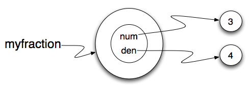
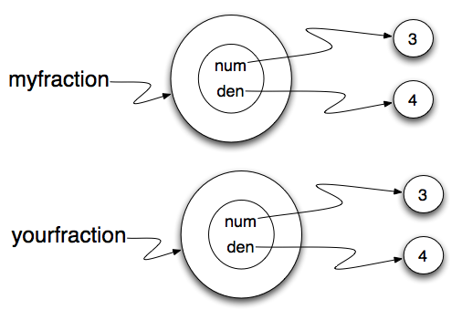
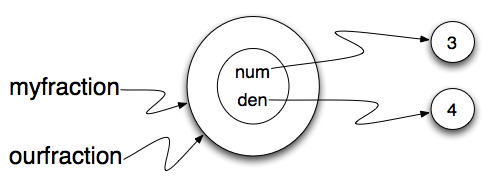

..  Copyright (C)  Brad Miller, David Ranum.  Permission is granted to copy, distribute
    and/or modify this document under the terms of the GNU Free Documentation
    License, Version 1.3 or any later version published by the Free Software
    Foundation; with Invariant Sections being Forward, Prefaces, and
    Contributor List, no Front-Cover Texts, and no Back-Cover Texts.  A copy of
    the license is included in the section entitled "GNU Free Documentation
    License".
    
..  shortname:: FractionClassExample
..  description:: This is a example class to represent a fraction

Classes and Objects - Digging a little deeper
=============================================

.. index:: rectangle

Fractions
---------

We have all had to work with fractions when we were younger.  Or, perhaps you do a lot of cooking and have to
manage measurements for ingredients.  In any case, fractions are something that we are familiar with.
In this chapter we will develop a class to represent a fraction including some of the most common methods that we
would like fractions to be able to do.

A fraction is most commonly thought of as two integers, one over the other, with a line separating them.  The number
on the top is called the numerator and the number on the bottom is called the denominator.  Sometimes people use a slash
for the line and sometimes they use a straight line.  The fact is that it really does not matter so long as you know which
is the numerator and which is the denominator.

To design our class, we simply need to use the analysis above to realize that the `state` of a fraction object can be 
completely described by representing two integers.  We can begin by implementing the ``Fraction`` class and the ``__init__``
method which will allow the user to provide a numerator and a denominator for the fraction being created.

.. activecode:: fractions_init

    class Fraction:

        def __init__(self,top,bottom):

            self.num = top        #the numerator is on top
            self.den = bottom     #the denominator is on the bottom

        def __str__(self):
            return str(self.num) + "/" + str(self.den)

        def getNum(self):
            return self.num

        def getDen(self):
            return self.den

    myfraction = Fraction(3,4)
    print(myfraction)

    print(myfraction.getNum())
    print(myfraction.getDen())

Note that the ``__str__`` method provides a "typical" looking fraction using a slash between the numerator and denominator.
The figure below shows the state of ``myfraction``.  We have also added a few simple accessor methods, ``getNum`` and ``getDen``, that can return the
state values for the fraction.

   
.. index:: mutable data type

Objects are Mutable
-------------------

We can change the state of an object by making an assignment to one of its instance variables.
For example, we could change the numerator of the fraction by assigning a new
value to ``self.num``.  Likewise, we could do the same thing for ``self.den``.

One place where this type of modification makes sense is when we place a fraction in **lowest terms**.  Lowest terms simply
means that the numerator and denominator do not share any common factors.  For example, ``12/16`` is a fraction but it is
not in lowest terms since 2 can divide into both 12 and 16.  We call 2 a **common divisor**.  If we divide the numerator
and the denominator by a common divisor, we get an equivalent fraction.  If we divide by the **greatest common divisor**, 
we will get the lowest terms representation.  In this case 4 would be the greatest common divisor and the lowest terms
representation would be 3/4.

There is a very nice iterative method for computing the greatest common divisor of two integers.  Try to run the
function on a number of different examples.

.. activecode:: fractions_gcd

	def gcd(m,n):
	    while m%n != 0:
	        oldm = m
	        oldn = n

	        m = oldn
	        n = oldm%oldn
            
	    return n

	print(gcd(12,16))

Now that we have a function that can help us with finding the greatest common divisor, we can use that to implement
a fraction method called ``simplify``.  We will ask the fraction "to put itself in lowest terms".

The ``simplify`` method will pass the numerator and the denominator to the ``gcd`` function to find the
greatest common divisor.  It will then modify itself by dividing its ``num`` and its ``den`` by that value.

.. activecode:: fractions_simplify

    def gcd(m,n):
        while m%n != 0:
            oldm = m
            oldn = n

            m = oldn
            n = oldm%oldn

        return n

    class Fraction:

        def __init__(self,top,bottom):

            self.num = top        #the numerator is on top
            self.den = bottom     #the denominator is on the bottom

        def __str__(self):
            return str(self.num) + "/" + str(self.den)

        def simplify(self):
            common = gcd(self.num, self.den)

            self.num = self.num // common
            self.den = self.den // common

    myfraction = Fraction(12,16)

    print(myfraction)
    myfraction.simplify()
    print(myfraction)

There are two important things to note about this implementation.  First, the ``gcd`` function is not
a method of the class.  It does not belong to ``Fraction``.  Instead it is a function that is used by ``Fraction``
to assist in a task that needs to be performed.  This type of function is often called a **helper function**.  Second,
the ``simplify`` method does not return anything.  Its job is to modify the object itself.  This type of method is
known as a **mutator** method because it mutates or changes the internal state of the object. 

.. index:: equality, equality; deep, equality; shallow, shallow equality, deep equality      

Sameness
--------

The meaning of the word *same* seems perfectly clear until you give it some
thought and then you realize there is more to it than you expected.

For example, if you say, Chris and I have the same car, you mean that his car
and yours are the same make and model, but that they are two different cars. If
you say, Chris and I have the same mother, you mean that his mother and yours
are the same person.

When you talk about objects, there is a similar ambiguity. For example, if two
``Fractions``\ s are the same, does that mean they contain the same data
(same numerator and denominator) or that they are actually the same object?

We've already seen the ``is`` operator in the chapter on lists, where we
talked about aliases.
It allows us to find out if two references refer to the same object.

.. activecode:: fractions_is

    class Fraction:

        def __init__(self,top,bottom):

            self.num = top        #the numerator is on top
            self.den = bottom     #the denominator is on the bottom

        def __str__(self):
            return str(self.num) + "/" + str(self.den)

    myfraction = Fraction(3,4)
    yourfraction = Fraction(3,4)
    print(myfraction is yourfraction)

    ourfraction = myfraction
    print(myfraction is ourfraction)

Even though ``myfraction`` and ``yourfraction`` contain the same numerator and denominator, they are not the
same object. 

If we assign ``myfraction`` to ``ourfraction``, then the two variables are aliases
of the same object.

This type of equality is called **shallow equality** because it compares only
the references, not the contents of the objects.  Using the == operator to check equality between two user
defined objects
will return the shallow equality result.  In other words, the ``Fraction`` objects are equal (==) if they are the same object.

Of course, we could define equality to mean the fractions are the same in that they have the same numerator and the same
denominator.  For example, here is a boolean function that performs this check.

.. sourcecode:: python

    def sameFraction(f1,f2):
        return (f1.getNum() == f2.getNum()) and (f1.getDen() == f2.getDen())

This type of equality is known as **deep equality** since it compares the values "deep" in the object, not just the reference to the object. 
  
.. activecode:: fractions_eq1

    def sameFraction(f1,f2):
        return (f1.getNum() == f2.getNum()) and (f1.getDen() == f2.getDen())
 
    class Fraction:

        def __init__(self,top,bottom):

            self.num = top        #the numerator is on top
            self.den = bottom     #the denominator is on the bottom

        def __str__(self):
            return str(self.num) + "/" + str(self.den)

        def getNum(self):
            return self.num

        def getDen(self):
            return self.den

    myfraction = Fraction(3,4)
    yourfraction = Fraction(3,4)
    print(myfraction is yourfraction)
    print(sameFraction(myfraction,yourfraction))

Of course, if the two variables refer to the same object, they have both
shallow and deep equality.

.. admonition:: Beware of  == 

    "When I use a word," Humpty Dumpty said, in a rather scornful tone, "it means just what I choose it to mean --- neither more nor less."   *Alice in Wonderland*
    
    Python has a powerful feature that allows a designer of a class to decide what an operation
    like ``==`` or ``<`` should mean.  (We've just shown how we can control how our own objects
    are converted to strings, so we've already made a start!)  We'll cover more detail later. 
    But sometimes the implementors will attach shallow equality semantics, and 
    sometimes deep equality, as shown in this little experiment:  
    
    .. sourcecode:: python
    
        p = Point(4, 2)
        s = Point(4, 2)
        print("== on Points returns", p == s)  # by default, == does a shallow equality test here

        a = [2,3]
        b = [2,3]
        print("== on lists returns",  a == b)  # by default, == does a deep equality test on lists

    This outputs::
    
        == on Points returns False
        == on lists returns True  
        
    So we conclude that even though the two lists (or tuples, etc.) are distinct objects
    with different memory addresses, in one case the ``==`` operator tests for deep equality, 
    while in the case of points it makes a shallow test. 

Arithmetic Methods
------------------

We will conclude this chapter by adding a few more methods to our ``Fraction`` class.  In particular, we will implement
arithmetic.  To begin, consider what it means to add two fractions together.
Remember that you can only add fractions if they have the same denominator.  The easiest way to find a common denominator is
to multiply the two individual denominators together.  Anything we do to the denominator needs to the done to the numerator.  This gives us the following equation for fraction addition::

     a/b + c/d = (ad + cb)/bd

Our ``add`` method will take a ``Fraction`` as a parameter.  It will return a new ``Fraction`` representing the sum.  We
will use the equation shown above to compute the new numerator and the new denominator.  Since this equation will not
give us lowest terms, we will utilize a similar technique as was used in the ``simplify`` method to find the 
greatest common divisor and then divide each part of the new fraction.

.. sourcecode:: python

	def add(self,otherfraction):

	    newnum = self.num*otherfraction.den + self.den*otherfraction.num
	    newden = self.den * otherfraction.den

	    common = gcd(newnum,newden)

	    return Fraction(newnum//common,newden//common)

You can try the addition method and then modify the fractions and retry.

.. activecode:: fractions_add1

    def gcd(m,n):
        while m%n != 0:
            oldm = m
            oldn = n

            m = oldn
            n = oldm%oldn

        return n

    class Fraction:

        def __init__(self,top,bottom):

            self.num = top        #the numerator is on top
            self.den = bottom     #the denominator is on the bottom

        def __str__(self):
            return str(self.num) + "/" + str(self.den)

        def simplify(self):
            common = gcd(self.num, self.den)

            self.num = self.num // common
            self.den = self.den // common

        def add(self,otherfraction):

            newnum = self.num*otherfraction.den + self.den*otherfraction.num
            newden = self.den * otherfraction.den

            common = gcd(newnum,newden)

            return Fraction(newnum//common,newden//common)

    f1 = Fraction(1,2)
    f2 = Fraction(1,4)

    f3 = f1.add(f2)
    print(f3)

One final modification to this method will be quite useful.  Instead invoking the ``add`` method, we can use the
addition operator "+".  This requires that we implement another special method, this time called ``__add__``.
The details of the method are the same.

.. sourcecode:: python

	def __add__(self,otherfraction):

	    newnum = self.num*otherfraction.den + self.den*otherfraction.num
	    newden = self.den * otherfraction.den

	    common = gcd(newnum,newden)

	    return Fraction(newnum//common,newden//common)

However, now we can perform addition in the same manner that we are used to with other numeric data.

.. sourcecode:: python

	f1 = Fraction(1,2)
	f2 = Fraction(1,4)

	f3 = f1 + f2    # calls the __add__ method of f1
	print(f3)

.. admonition:: + operator versus __add__ method

	It turns out that addition is a method that exists for integers as well.  4+5 can be written as (4).__add__(5).
	We are asking 4 to invoke its add method, passing 5 as the other value.

Glossary
--------

.. glossary::
        
    deep copy
        To copy the contents of an object as well as any embedded objects, and
        any objects embedded in them, and so on; implemented by the
        ``deepcopy`` function in the ``copy`` module.
        
    deep equality
        Equality of values, or two references that point to objects that have
        the same value.
            
    shallow copy
        To copy the contents of an object, including any references to embedded
        objects; implemented by the ``copy`` function in the ``copy`` module.
        
    shallow equality
        Equality of references, or two references that point to the same object.

Exercises
---------
   
#. Add a method ``area`` to the Rectangle class that returns the area of any instance::

      r = Rectangle(Point(0, 0), 10, 5)
      test(r.area(), 50)

#. Write a ``perimeter`` method in the Rectangle class so that we can find
   the perimeter of any rectangle instance::
   
      r = Rectangle(Point(0, 0), 10, 5)
      test(r.perimeter(), 30)

#. Write a ``transpose`` method in the Rectangle class that swaps the width
   and the height of any rectangle instance::
   
      r = Rectangle(Point(100, 50), 10, 5)
      test(r.width, 10)
      test(r.height, 5)
      r.flip()
      test(r.width, 5)
      test(r.height, 10)
      
#. Write a new method in the Rectangle class to test if a Point falls within
   the rectangle.  For this exercise, assume that a rectangle at (0,0) with
   width 10 and height 5 has *open* upper bounds on the width and height, 
   i.e. it stretches in the x direction from [0 to 10), where 0 is included
   but 10 is excluded, and from [0 to 5) in the y direction.  So
   it does not contain the point (10, 2).  These tests should pass::
   
      r = Rectangle(Point(0, 0), 10, 5)
      test(r.contains(Point(0, 0)), True)
      test(r.contains(Point(3, 3)), True)
      test(r.contains(Point(3, 7)), False)
      test(r.contains(Point(3, 5)), False)
      test(r.contains(Point(3, 4.99999)), True)
      test(r.contains(Point(-3, -3)), False)
   
#. In games, we often put a rectangular "bounding box" around our sprites in
   the game.  We can then do *collision detection* between, say, bombs and 
   spaceships, by comparing whether their rectangles overlap anywhere. 
   
   Write a function to determine whether two rectangles collide. *Hint:
   this might be quite a tough exercise!  Think carefully about all the
   cases before you code.* 

     
 
