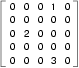

..  Copyright (C)  Brad Miller, David Ranum, Jeffrey Elkner, Peter Wentworth, Allen B. Downey, Chris
    Meyers, and Dario Mitchell.  Permission is granted to copy, distribute
    and/or modify this document under the terms of the GNU Free Documentation
    License, Version 1.3 or any later version published by the Free Software
    Foundation; with Invariant Sections being Forward, Prefaces, and
    Contributor List, no Front-Cover Texts, and no Back-Cover Texts.  A copy of
    the license is included in the section entitled "GNU Free Documentation
    License".
    
..  shortname:: Dictionaries
..  description:: This is the introduction to the dictionary data type

Dictionaries
============

.. index:: dictionary, mapping type, key, value, key-value pair

All of the compound data types we have studied in detail so far --- strings,
lists, and tuples --- are sequential collections.  This means that the items in the collection are
ordered from left to right and they use integers as indices to access
the values they contain.

**Dictionaries** are a different kind of collection. They are Python's
built-in **mapping type**. A map is an unordered, associative collection.  The association, or mapping,
is from a **key**, which can be any immutable type,
to a **value**, which can be any Python data object.

As an example, we will create a dictionary to translate English words into
Spanish. For this dictionary, the keys are strings.

One way to create a dictionary is to start with the empty dictionary and add
**key-value pairs**. The empty dictionary is denoted ``{}``

.. activecode:: chp12_dict1
    
    eng2sp = {}
    print(eng2sp)
    eng2sp['one'] = 'uno'
    print(eng2sp)
    eng2sp['two'] = 'dos'
    eng2sp['three'] = 'tres'
    print(eng2sp)

The first assignment creates a dictionary named ``eng2sp``.  The other
assignments add new key-value pairs to the dictionary.  The left hand side gives the dictionary and the key being associated.  The right hand side gives the value being associated with that key.
We can print the current
value of the dictionary in the usual way.
The key-value pairs of the dictionary are separated by commas. Each pair
contains a key and a value separated by a colon.

The order of the pairs may not be what you expected. Python uses complex
algorithms, designed for very fast access, to determine where the 
key-value pairs are stored in a dictionary.
For our purposes we can think of this ordering as unpredictable.

Another way to create a dictionary is to provide a list of key-value pairs
using the same syntax as the previous output.

.. activecode:: chp12_dict2
    
    
    eng2sp = {'three': 'tres', 'one': 'uno', 'two': 'dos'}
    print(eng2sp)

It doesn't matter what order we write the pairs. The values in a dictionary are
accessed with keys, not with indices, so there is no need to care about
ordering.

Here is how we use a key to look up the corresponding value.

.. activecode:: chp12_dict3
    

    eng2sp = {'three': 'tres', 'one': 'uno', 'two': 'dos'}

    print(eng2sp['two'])

The key ``'two'`` yields the value ``'dos'``.

.. index:: del statement, statement; del

Dictionary operations
---------------------

The ``del`` statement removes a key-value pair from a dictionary. For example,
the following dictionary contains the names of various fruits and the number of
each fruit in stock.  If someone buys all of the pears, we can remove the entry from the dictionary.

.. activecode:: ch12_dict4
    
    inventory = {'apples': 430, 'bananas': 312, 'oranges': 525, 'pears': 217}
    print(inventory)
    
    del inventory['pears']
    print(inventory)

Dictionaries are also mutable.  As we've seen before with lists, this means that the dictionary can
be modified by referencing an association on the left hand side of the assignment statement.  In the previous
example, instead of deleting the entry for ``pears``, we could have set the inventory to ``0``.

.. activecode:: ch12_dict4a
    
    inventory = {'apples': 430, 'bananas': 312, 'oranges': 525, 'pears': 217}
    print(inventory)
    
    inventory['pears'] = 0
    print(inventory)

Similarily,
a new shipment of 200 bananas arriving could be handled like this.

.. activecode:: ch12_dict5

    inventory = {'apples': 430, 'bananas': 312, 'oranges': 525, 'pears': 217}    
    inventory['bananas'] = inventory['bananas'] + 200
    print(inventory)

    print(len(inventory))

Notice that there are now 512 bananas---the dictionary has been modified.  Note also that the ``len`` function also works on dictionaries.  It returns the number
of key-value pairs:

Dictionary methods
------------------

Dictionaries have a number of useful built-in methods.
The following table provides a summary and more details can be found in the 
`Python Documentation <http://docs.python.org/py3k/library/stdtypes.html#mapping-types-dict>`_.

==========  ==============      =======================================================
Method      Parameters          Description
==========  ==============      =======================================================
keys        none                Returns a view of the keys in the dictionary
values      none                Returns a view of the values in the dictionary
items       none                Returns a view of the key-value pairs in the dictionary
get         key                 Returns the value associated with key; None otherwise
get         key,alt             Returns the value associated with key; alt otherwise
==========  ==============      =======================================================

The ``keys`` method returns what Python 3 calls a **view** of its underlying keys.  
We can iterate over the view or turn the view into a 
list by using the ``list`` conversion function.

.. activecode:: chp12_dict6
    
    inventory = {'apples': 430, 'bananas': 312, 'oranges': 525, 'pears': 217}  
  
    for akey in inventory.keys():     # the order in which we get the keys is not defined
       print("Got key", akey, "which maps to value", inventory[akey])     
       
    ks = list(inventory.keys())
    print(ks)
    
    for k in inventory:     
       print("Got key", k)
    
It is so common to iterate over the keys in a dictionary that you can
omit the ``keys`` method call in the ``for`` loop --- iterating over
a dictionary implicitly iterates over its keys.

.. activecode:: chp12_dict7
    
    inventory = {'apples': 430, 'bananas': 312, 'oranges': 525, 'pears': 217}  
    
    for k in inventory:     
       print("Got key", k)

 
As we saw earlier with strings and lists, dictionary methods use dot notation,
which specifies the name of the method to the right of the dot and the name of
the object on which to apply the method immediately to the left of the dot. The empty
parentheses in the case of ``keys`` indicate that this method takes no parameters.

The ``values`` and ``items`` methods are similar to ``keys``. They return  view objects which can be turned
into lists or iterated over directly.  Note that the items are shown as tuples containing the key and the associated value.

.. activecode:: chp12_dict8
    
    inventory = {'apples': 430, 'bananas': 312, 'oranges': 525, 'pears': 217}  
    
    print(list(inventory.values()))
    print(list(inventory.items()))

    for (k,v) in inventory.items():
        print("Got",k,"that maps to",v)

    for k in inventory:
        print("Got",k,"that maps to",inventory[k])
    
Note that tuples are often useful for getting both the key and the value at the same
time while you are looping.  The two loops do the same thing.

    
The ``in`` and ``not in`` operators can test if a key is in the dictionary:

.. activecode:: chp12_dict9
    
    inventory = {'apples': 430, 'bananas': 312, 'oranges': 525, 'pears': 217}
    print('apples' in inventory)
    print('cherries' in inventory)

    if 'bananas' in inventory:
        print(inventory['bananas'])
    else:
        print("We have no bananas")
     

This operator can be very useful since looking up a non-existent key in a
dictionary causes a runtime error.

The ``get`` method allows us to access the value associated with a key, similar to the ``[ ]`` operator.
The important difference is that ``get`` will not cause a runtime error if the key is not present.  It
will instead return None.  There exists a variation of ``get`` that allows an alternative return value
in the case where the key is not present.

.. activecode:: chp12_dict10
    
    inventory = {'apples': 430, 'bananas': 312, 'oranges': 525, 'pears': 217}
    
    print(inventory.get("apples"))
    print(inventory.get("cherries"))

    print(inventory.get("cherries",0))

.. index:: aliases

Aliasing and copying
--------------------

Because dictionaries are mutable, you need to be aware of aliasing (as we saw with lists)..  Whenever
two variables refer to the same dictionary object, changes to one affect the other.
For example, ``opposites`` is a dictionary that contains pairs
of opposites.

.. activecode:: ch12_dict11
    
    opposites = {'up': 'down', 'right': 'wrong', 'true': 'false'}
    alias = opposites

    print(alias is opposites)

    alias['right'] = 'left'
    print(opposites['right'])
    

As you can see from the ``is`` operator, ``alias`` and ``opposites`` refer to the same object.

If you want to modify a dictionary and keep a copy of the original, use the dictionary 
``copy`` method.  Since *acopy* is a copy of the dictionary, changes to it will not effect the original.

.. sourcecode:: python
    
    acopy = opposites.copy()
    acopy['right'] = 'left'    # does not change opposites

.. index:: matrix

Sparse matrices
---------------

We previously used a list of lists to represent a matrix. That is a good choice
for a matrix with mostly nonzero values, but consider a `sparse matrix
<http://en.wikipedia.org/wiki/Sparse_matrix>`__ like this one:

The list representation contains a lot of zeroes:

.. sourcecode:: python
    
    matrix = [[0, 0, 0, 1, 0],
              [0, 0, 0, 0, 0],
              [0, 2, 0, 0, 0],
              [0, 0, 0, 0, 0],
              [0, 0, 0, 3, 0]]

An alternative is to use a dictionary. For the keys, we can use tuples that
contain the row and column numbers. Here is the dictionary representation of
the same matrix.

.. sourcecode:: python
    
    matrix = {(0, 3): 1, (2, 1): 2, (4, 3): 3}

We only need three key-value pairs, one for each nonzero element of the matrix.
Each key is a tuple, and each value is an integer.

To access an element of the matrix, we could use the ``[]`` operator::
    
    matrix[(0, 3)]

Notice that the syntax for the dictionary representation is not the same as the
syntax for the nested list representation. Instead of two integer indices, we
use one index, which is a tuple of integers.

There is one problem. If we specify an element that is zero, we get an error,
because there is no entry in the dictionary with that key.
The alternative version of the ``get`` method solves this problem.
The first argument will be the key.  The second argument is the value ``get`` should
return if the key is not in the dictionary (which would be 0 since it is sparse).

.. activecode:: chp12_sparse

   matrix = {(0, 3): 1, (2, 1): 2, (4, 3): 3}
   print(matrix.get((0,3)))

   print(matrix.get((1, 3), 0))

.. admonition:: Lab

    * `Counting Letters <lab12_01.html>`_ In this guided lab exercise we will work
      through a problem solving exercise that will use dictionaries to generalize the solution
      to counting the occurrences of all letters in a string.

.. admonition:: Lab

    * `Letter Count Histogram <lab12_02.html>`_ Combine the previous lab with the histogram example.

    
Glossary
--------

.. glossary::
       
    call graph 
        A graph consisting of nodes which represent function frames (or invocations), 
        and directed edges (lines with arrows) showing which frames gave
        rise to other frames.       
        
    dictionary
        A collection of key-value pairs that maps from keys to values. The keys
        can be any immutable type, and the values can be any type.

    key
        A data item that is *mapped to* a value in a dictionary. Keys are used
        to look up values in a dictionary.

    key-value pair
        One of the pairs of items in a dictionary. Values are looked up in a
        dictionary by key.
        
    mapping type
        A mapping type is a data type comprised of a collection of keys and
        associated values. Python's only built-in mapping type is the
        dictionary.  Dictionaries implement the
        `associative array <http://en.wikipedia.org/wiki/Associative_array>`__
        abstract data type.

    memo
        Temporary storage of precomputed values to avoid duplicating the same computation.

Exercises
---------

#. Write a program that reads in a string on the command line and returns a
   table of the letters of the alphabet in alphabetical order which occur in
   the string together with the number of times each letter occurs. Case should 
   be ignored. A sample run of the program would look this this::

       $ python letter_counts.py "ThiS is String with Upper and lower case Letters."
       a  2
       c  1
       d  1
       e  5
       g  1
       h  2
       i  4
       l  2
       n  2
       o  1
       p  2
       r  4
       s  5
       t  5
       u  1
       w  2
       $

   .. actex:: ex_11_01

#. Give the Python interpreter's response to each of the following from a
   continuous interpreter session:

   a.
      .. sourcecode:: python
        
          >>> d = {'apples': 15, 'bananas': 35, 'grapes': 12} 
          >>> d['banana'] 

   b.
      .. sourcecode:: python
        
          >>> d['oranges'] = 20
          >>> len(d) 

   c.
      .. sourcecode:: python
        
          >>> 'grapes' in d
          
   d.
      .. sourcecode:: python
        
          >>> d['pears']
          
   e.
      .. sourcecode:: python
        
          >>> d.get('pears', 0)
          
   f.
      .. sourcecode:: python
        
          >>> fruits = d.keys()
          >>> fruits.sort()
          >>> print(fruits)
          
   g.
      .. sourcecode:: python
        
          >>> del d['apples']
          >>> 'apples' in d 
          

   Be sure you understand why you get each result. Then apply what you
   have learned to fill in the body of the function below:

   .. sourcecode:: python
    
       def add_fruit(inventory, fruit, quantity=0): 
            pass
       
       # make these tests work...
       new_inventory = {}
       add_fruit(new_inventory, 'strawberries', 10)
       test('strawberries' in new_inventory, True)
       test(new_inventory['strawberries'], 10)
       add_fruit(new_inventory, 'strawberries', 25)
       test(new_inventory['strawberries'] , 35)      

#. Write a program called ``alice_words.py`` that creates a text file named
   ``alice_words.txt`` containing an alphabetical listing of all the words, and the
   number of times each occurs, in the text version of `Alice's Adventures in Wonderland`.  
   (You can obtain a free plain text version of the book, along with many others, from 
   http://www.gutenberg.org.) The first 10 lines of your output file should look
   something like this

    =========== ===========
    Word              Count
    =========== ===========
    a                 631
    a-piece           1
    abide             1
    able              1
    about             94
    above             3
    absence           1
    absurd            2
    =========== ===========

   How many times does the word, ``alice``, occur in the book?  If you are writing this 
   in the activecode window simply print out the results rather than write them to a file.
   
   .. actex:: ex_11_02
   
#. What is the longest word in Alice in Wonderland? How many characters does it have?

   .. actex:: ex_11_03
   
#. Here's a table of English to Pirate translations

    ==========  ==============
    English     Pirate
    ==========  ==============
    sir	        matey
    hotel	    fleabag inn
    student	    swabbie
    boy	        matey
    madam	    proud beauty
    professor	foul blaggart
    restaurant	galley
    your	    yer
    excuse	    arr
    students	swabbies
    are	        be
    lawyer	    foul blaggart
    the	        th'
    restroom	head
    my	        me
    hello	    avast
    is	        be
    man	        matey
    ==========  ==============
    
    Write a program that asks the user for a sentence in English and then translates that 
    sentence to Pirate.
    
    .. actex:: ex_11_04
    

    