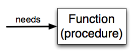
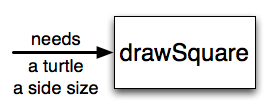
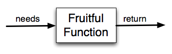
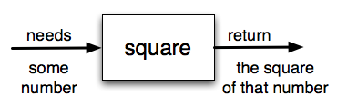

..  Copyright (C)  Brad Miller, David Ranum, Jeffrey Elkner, Peter Wentworth, Allen B. Downey, Chris
    Meyers, and Dario Mitchell.  Permission is granted to copy, distribute
    and/or modify this document under the terms of the GNU Free Documentation
    License, Version 1.3 or any later version published by the Free Software
    Foundation; with Invariant Sections being Forward, Prefaces, and
    Contributor List, no Front-Cover Texts, and no Back-Cover Texts.  A copy of
    the license is included in the section entitled "GNU Free Documentation
    License".
    
..  shortname:: IntroToFunctions
..  description:: This is the introduction to the idea of defining and calling a function.

Functions
=========

.. index::
    single: function
    single: function definition
    single: definition; function

Functions
---------
      
.. video:: function_intro
   :controls:
   :thumb: ../_static/function_intro.png

   http://knuth.luther.edu/~pythonworks/thinkcsVideos/FunctionsIntro.mov
   http://knuth.luther.edu/~pythonworks/thinkcsVideos/FunctionsIntro.webm

In Python, a **function** is a named sequence of statements
that belong together.  Their primary purpose is to help us
organize programs into chunks that match how we think about
the solution to the problem.

 
The syntax for a **function definition** is:

.. sourcecode:: python
    
    def NAME( PARAMETERS ):
        STATEMENTS

You can make up any names you want for the functions you create, except that
you can't use a name that is a Python keyword, and the names must follow the rules
for legal identifiers. The parameters specifies
what information, if any, you have to provide in order to use the new function.  Another way to say this is that the parameters specify what the function needs to do it's work.

There can be any number of statements inside the function, but they have to be
indented from the ``def``. In the examples in this book, we will use the
standard indentation of four spaces. Function definitions are the second of
several **compound statements** we will see, all of which have the same
pattern:

#. A header line which begins with a keyword and ends with a colon.
#. A **body** consisting of one or more Python statements, each
   indented the same amount -- *4 spaces is the Python standard* -- from
   the header line.

We've already seen the `for` loop which follows this pattern.   
   
In a function definition, the keyword in the header is ``def``, which is
followed by the name of the function and some *parameters* enclosed in
parentheses. The parameter list may be empty, or it may contain any number of
parameters separated from one another by commas. In either case, the parentheses are required.

We need to say a bit more about the parameters.  In the definition, the parameter list is more specifically known
as the **formal parameters**.  This list of names describes those things that the function will
need to receive from the user of the function.  When you use a function, you provide values to the formal parameters.

The figure below shows this relationship.  A function needs certain information to do its work.  These values, often called **arguments** or **actual parameters**, are passed to the function by the user.

This type of diagram is often called a **black-box diagram** because it only states the requirements from the perspective of the user.  The user must know the name of the function and what arguments need to be passed.  The details of how the function works are hidden inside the "black-box".

Suppose we're working with turtles and a common operation we need is to draw
squares.  It would make sense if we did not have to duplicate all the steps each time we want to make a square.   "Draw a square" can be thought of as an *abstraction* of a number of smaller steps.  We will need to provide two pieces of information for the function to do its work: a turtle to do the drawing and a size for the side of the square.  We could represent this using the following black-box diagram.

Here is a function to capture this idea.  Give it a try.

.. activecode:: ch04_1

    import turtle 

    def drawSquare(t, sz):
        """Make turtle t draw a square of with side sz."""    
        
        for i in range(4):
            t.forward(sz)             
            t.left(90)
      
      
    wn = turtle.Screen()              # Set up the window and its attributes
    wn.bgcolor("lightgreen")

    alex = turtle.Turtle()            # create alex
    drawSquare(alex, 50)             # Call the function to draw the square

    wn.exitonclick()

This function is named ``drawSquare``.  It has two parameters --- one to tell
the function which turtle to move around and the other to tell it the size
of the square we want drawn.  In the function definition they are called ``t`` and ``sz`` respectively.   Make sure you know where the body of the function
ends --- it depends on the indentation and the blank lines don't count for
this purpose!

.. admonition::  docstrings 

    If the first thing after the function header is a string (some tools insist that
    it must be a triple-quoted string), it is called a **docstring** 
    and gets special treatment in Python and in some of the programming tools.  

    Another way to retrieve this information is to use the interactive
    interpreter, and enter the expression ``<function_name>.__doc__``, which will retrieve the
    docstring for the function.  So the string you write as documentation at the start of a function is
    retrievable by python tools *at runtime*.  This is different from comments in your code,
    which are completely eliminated when the program is parsed. 
    
    By convention, Python programmers use docstrings for the key documentation of
    their functions.    

Defining a new function does not make the function run. To do that we need a
**function call**.  This is also known as a **function invocation**. We've already seen how to call some built-in functions like
**print**, **range** and **int**. Function calls contain the name of the function being
executed followed by a list of values, called *arguments*, which are assigned
to the parameters in the function definition.  So in the second to the last line of
the program, we call the function, and pass ``alex`` as the turtle to be manipulated,
and 50 as the size of the square we want. 

.. The parameters being sent to the function, sometimes referred to as the **actual parameters** or **arguments**,
.. represent the specific data items that the function will use when it is executing.

Once we've defined a function, we can call it as often as we like and its 
statements will be executed each time we call it.  In this case, we could use it to get
one of our turtles to draw a square and then we can move the turtle and have it draw a different square in a 
different location.  Note that we lift the tail so that when ``alex`` moves there is no trace.  We put the tail
back down before drawing the next square.

.. activecode:: ch04_1a

    import turtle 

    def drawSquare(t, sz):
        """Make turtle t draw a square of with side sz."""    
        
        for i in range(4):
            t.forward(sz)             
            t.left(90)
      
      
    wn = turtle.Screen()          # Set up the window and its attributes
    wn.bgcolor("lightgreen")

    alex = turtle.Turtle()        # create alex
    drawSquare(alex, 50)          # Call the function to draw the square

    alex.penup()
    alex.goto(100,100)
    alex.pendown()

    drawSquare(alex,75)           # Draw another square

    wn.exitonclick()

In the next example, we've changed the ``drawSquare``
function a little and we get ``tess`` to draw 15 squares with some variations.  Once the function has
been defined, we can call it as many times as we like with whatever actual parameters we like.

.. activecode:: ch04_2

    import turtle

    def drawMulticolorSquare(t, sz):  
        """Make turtle t draw a multi-colour square of sz."""
        for i in ['red','purple','hotpink','blue']:
            t.color(i)
            t.forward(sz)
            t.left(90)
 
    wn = turtle.Screen()             # Set up the window and its attributes
    wn.bgcolor("lightgreen")

    tess = turtle.Turtle()           # create tess and set some attributes
    tess.pensize(3)

    size = 20                        # size of the smallest square
    for i in range(15):
        drawMulticolorSquare(tess, size)
        size = size + 10             # increase the size for next time
        tess.forward(10)             # move tess along a little
        tess.right(18)               # and give her some extra turn

    wn.exitonclick()

.. admonition:: Scratch Editor

    .. actex:: scratch_1

**Check your understanding**

.. mchoicemf:: test_question5_1_1
   :answer_a: A named sequence of statements.
   :answer_b: Any sequence of statements.
   :answer_c: A mathematical expression that calculates a value.
   :answer_d: A statement of the form x = 5 + 4.
   :correct: a
   :feedback_a: Yes, a function is a named sequence of statements.
   :feedback_b: While functions contain sequences of statements, not all sequences of statements are considered functions.
   :feedback_c: While some functions do calculate values, the python idea of a function is slightly different from the mathematical idea of a function in that not all functions calculate values.  Consider, for example, the turtle functions in this section.   They made the turtle draw a specific shape, rather than calculating a value.
   :feedback_d: This statement is called an assignment statement.  It assigns the value on the right (9), to the name on the left (x).

   What is a function in Python?

.. mchoicemf:: test_question5_1_2
   :answer_a: To improve the speed of execution
   :answer_b: To help the programmer organize programs into chunks that match how they think about the solution to the problem.
   :answer_c: All Python programs must be written using functions
   :answer_d: To calculate values.
   :correct: b
   :feedback_a: Functions have little effect on how fast the program runs.
   :feedback_b: While functions are not required, they help the programmer better think about the solution by organizing pieces of the solution into logical chunks that can be reused.
   :feedback_c: In the first several chapters, youíve seen many examples of Python programs written without the use of functions.  While writing and using functions is desirable and essential for good programming style as your programs get longer, it is not required.
   :feedback_d: Not all functions calculate values.  

   What is one main purpose of a function?

.. mchoicemf:: test_question5_1_3
   :answer_a: def drawCircle(t):
   :answer_b: def drawCircle:
   :answer_c: drawCircle(t, sz):
   :answer_d: def drawCircle(t, sz)
   :correct: a 
   :feedback_a: A function may take zero or more parameters.  It does not have to have two.  In this case the size of the circle might be specified in the body of the function.
   :feedback_b: A function needs to specify its parameters in its header.
   :feedback_c: A function definition needs to include the keyword def.
   :feedback_d: A function definition header must end in a colon (:).

   Which of the following is a valid function header (first line of a function definition)?

.. mchoicemf:: test_question5_1_4
   :answer_a: def drawSquare(t, sz)
   :answer_b: drawSquare
   :answer_c: drawSquare(t, sz)
   :answer_d: Make turtle t draw a square with side sz.
   :correct: b
   :feedback_a: This line is the complete function header (except for the semi-colon) which includes the name as well as several other components.
   :feedback_b: Yes, the name of the function is given after the keyword def and before the list of parameters.
   :feedback_c: This includes the function name and its parameters
   :feedback_d: This is a comment stating what the function does.

   What is the name of the following function?
   <pre>
   def drawSquare(t, sz):
       """Make turtle t draw a square of with side sz."""
       for i in range(4):
           t.forward(sz)
           t.left(90)
   </pre>

.. mchoicemf:: test_question5_1_5
   :answer_a: i
   :answer_b: t
   :answer_c: t, sz
   :answer_d: t, sz, i
   :correct: c
   :feedback_a: i is a variable used inside of the function, but not a parameter, which is passed in to the function.
   :feedback_b: t is only one of the parameters to this function.   
   :feedback_c: Yes, the function specifies two parameters: t and sz.
   :feedback_d: the parameters include only those variables whose values that the function expects to receive as input.  They are specified in the header of the function.

   What are the parameters of the following function?
   <pre>
   def drawSquare(t, sz):
       """Make turtle t draw a square of with side sz."""
       for i in range(4):
	   t.forward(sz)
	   t.left(90)
   </pre>

.. mchoicemf:: test_question5_1_6
   :answer_a: def drawSquare(t, sz)
   :answer_b: drawSquare
   :answer_c: drawSquare(10)
   :answer_d: drawSquare(alex, 10):
   :answer_e: drawSquare(alex, 10)
   :correct: e
   :feedback_a: No, t and sz are the names of the formal parameters to this function.  When the function is called, it requires actual values to be passed in.
   :feedback_b: A function call always requires parentheses after the name of the function.
   :feedback_c: This function takes two parameters (arguments)
   :feedback_d: A colon is only required in a function definition.  It will cause an error with a function call.
   :feedback_e: Since alex was already previously defined and 10 is a value, we have passed in two correct values for this function.

   Considering the function below, which of the following statements correctly invokes, or calls, this function (i.e., causes it to run)?  Assume we already have a turtle named alex.
   <pre>
   def drawSquare(t, sz):
       """Make turtle t draw a square of with side sz."""
       for i in range(4):
           t.forward(sz)
	   t.left(90)
   </pre>

.. mchoicemf:: test_question5_1_7
   :answer_a: True
   :answer_b: False
   :correct: a
   :feedback_a: Yes, you can call a function multiple times by putting the call in a loop.
   :feedback_b: One of the purposes of a function is to allow you to call it more than once.   Placing it in a loop allows it to executed multiple times as the body of the loop runs multiple times.

   True or false: A function can be called several times by placing a function call in the body of a loop.

Functions that return values
----------------------------

Most functions require arguments, values that control how the function does its
job. For example, if you want to find the absolute value of a number, you have
to indicate what the number is. Python has a built-in function for computing
the absolute value:

.. activecode:: ch04_4
    :nocanvas:

    print(abs(5))

    print(abs(-5))

In this example, the arguments to the ``abs`` function are 5 and -5.

Some functions take more than one argument. For example the math module contains a function
called
``pow`` which takes two arguments, the base and the exponent.

.. Inside the function,
.. the values that are passed get assigned to variables called **parameters**.

.. activecode:: ch04_5
    :nocanvas:

    import math
    print(math.pow(2, 3))

    print(math.pow(7, 4))

.. note::

     Of course, we have already seen that raising a base to an exponent can be done with the ** operator.

Another built-in function that takes more than one argument is ``max``.

.. activecode:: ch04_6
    :nocanvas:

    print(max(7, 11))
    print(max(4, 1, 17, 2, 12))
    print(max(3 * 11, 5**3, 512 - 9, 1024**0))

``max`` can be sent any number of arguments, separated by commas, and will
return the maximum value sent. The arguments can be either simple values or
expressions. In the last example, 503 is returned, since it is larger than 33,
125, and 1.  Note that ``max`` also works on lists of values.

Furthermore, functions like ``range``, ``int``, ``abs`` all return values that
can be used to build more complex expressions.

So an important difference between these functions and one like ``drawSquare`` is that
``drawSquare`` was not executed because we wanted it to compute a value --- on the contrary,
we wrote ``drawSquare`` because we wanted it to execute a sequence of steps that caused
the turtle to draw a specific shape.

Functions that return values are sometimes called **fruitful functions**.
In many other languages, a chunk that doesn't return a value is called a **procedure**,
but we will stick here with the Python way of also calling it a function, or if we want
to stress it, a *non-fruitful* function.

Fruitful functions still allow the user to provide information (arguments).  However there is now an additional
piece of data that is returned from the function.  

How do we write our own fruitful function?  Lets start with a very simple
mathematical function ``square``.  The square function will take one number
as a parameter and return the result of squaring that number.  Here is the
black-box diagram with the Python code following.

.. activecode:: ch04_square

    def square(x):
        y = x * x
        return y

    toSquare = 10
    result = square(toSquare)
    print("The result of ", toSquare, " squared is ", result)

The **return** statement is followed an expression which is evaluated.  Its
result is returned to the caller as the "fruit" of calling this function.
Because the return statement can contain any Python expression we could have
avoided creating the **temporary variable** ``y`` and simply used
``return x*x``.
Try modifying the square function above to see that this works just the same.
On the other hand, using **temporary variables** like ``y`` in the program above makes
debugging
easier.  These temporary variables are referred to as **local variables**.

.. The line `toInvest = float(input("How much do you want to invest?"))`
..  also shows yet another example
..  of *composition* --- we can call a function like `float`, and its arguments
 .. can be the results of other function calls (like `input`) that we've called along the way.

Notice something important here. The name of the variable we pass as an
argument --- ``toSquare`` --- has nothing to do with the name of the formal parameter
--- ``x``.  It is as if  ``x = toSquare`` is executed when ``square`` is called.
It doesn't matter what the value was named in
the caller. In ``square``, it's name is ``x``.  You can see this very clearly in
codelens, where the global variables and the local variables for the square
function are in separate boxes.

As you step through the example in codelens notice that the **return** statement not only causes the
function to return a value, but it also returns the flow of control back to the place in the program
where the function call was made.

.. codelens:: ch04_clsquare

    def square(x):
        y = x * x
        return y

    toSquare = 10
    squareResult = square(toSquare)
    print("The result of ", toSquare, " squared is ", squareResult)

Another important thing to notice as you step through this codelens
demonstration is the highlighting of line numbers.  Codelens boldfaces the line numbers that it has executed.
When you first start running this codelens demonstration you will notice that
line 1 is bolded.  The next line to be bolded is line 5.  Why is this?
Because function definition is not the same as function execution.  Lines 2
and 3 will not be bolded until the function is called on line 6.

Short variable names are more economical and sometimes make
code easier to read:
E = mc\ :sup:`2` would not be nearly so memorable if Einstein had
used longer variable names!  If you do prefer short names,
make sure you also have some comments to enlighten the reader
about what the variables are used for.

All Python functions return ``None`` unless there is an explicit return statement with
a value other than ``None.``
Consider the following common mistake made by beginning Python
programmers.  As you step through this pay very close attention to the return
value in the local variables listing.  Then look at what is printed when the
function returns.

.. codelens:: ch04_clsquare_bad

    def square(x):
        y = x * x
        print(y)   # Bad! should use return instead!

    toSquare = 10
    squareResult = square(toSquare)
    print("The result of ", toSquare, " squared is ", squareResult)

.. index::
    single: local variable
    single: variable; local
    single: lifetime

.. admonition:: Scratch Editor

    .. actex:: scratch_2

**Check your understanding**

.. mchoicemf:: test_question5_2_1
   :answer_a: You should never use a print statement in a function definition.
   :answer_b: You should not have any statements in a function after the return statement.  Once the function gets to the return statement it will immediately stop executing the function.
   :answer_c: You must calculate the value of x+y+z before you return it.
   :answer_d: A function cannot return a number.
   :correct: b
   :feedback_a: Although you should not mistake print for return, you may include print statements inside your functions.
   :feedback_b: This is a very common mistake so be sure to watch out for it when you write your code!
   :feedback_c: Python will automatically calculate the value x+y+z and then return it in the statement as it is written
   :feedback_d: Functions can return any legal data, including (but not limited to) numbers, strings, turtles, etc.

   What is wrong with the following function definition:
   <pre>
   def addEm(x, y, z):
       return x+y+z
       print('the answer is', x+y+z)
   </pre>

.. mchoicemf:: test_question5_2_2
   :answer_a: Nothing (no value)
   :answer_b: The value of x+y+z
   :answer_c: The string 'x+y+z'
   :correct: a
   :feedback_a: We have accidentally used print where we mean return.  This is a VERY COMMON mistake so watch out!  This mistake is also particularly difficult to find because when you run the function the output looks the same.  It is not until you try to assign its value to a variable that you can notice a difference.
   :feedback_b: Careful!  This is a very common mistake.  Here we have printed the value x+y+z but we have not returned it.  To return a value we MUST use the return keyword.
   :feedback_c: x+y+z calculates a number (assuming x+y+z are numbers) which represents the sum of the values x, y and z.

   What will the following function return?
   <pre>
   def addEm(x, y, z):
       print x+y+z
   </pre>

Variables and parameters are local
----------------------------------

An assignment statement in a function creates a **local variable** for the
variable on the left hand side of the assignment operator. This variable only
exists inside the function, and you cannot use it outside. For example,
consider again the ``square`` function:

.. codelens:: bad_local

    def square(x):
        y = x * x
        return y

    z = square(10)
    print(y)

If you press the 'last >>' button you will see an error message.
When we try to use ``y`` on line 6 (outside the function) Python looks for a global
variable named ``y`` but does not find one.  This results in the
error: ``Name Error: 'y' is not defined.``

The variable ``y`` only exists while the function is being executed ---
we call this its **lifetime**.
When the execution of the function terminates (returns),
the local variables  are destroyed.  Codelens helps you  visualize this
because the local variables disappear after the function returns.

Formal parameters are also local and act like local variables.
For example, the lifetime of ``x`` begins when ``square`` is
called,
and the lifetime ends when the function completes its execution.

So it is not possible for a function to set some local variable to a
value, complete its execution, and then when it is called again next
time, recover the local variable.  Each call of the function creates
new local variables, and their lifetimes expire when the function returns
to the caller.

Conversely, a function may access a global variable.  But this is considered
**bad form** by nearly all programmers.  Look at the following,
nonsensical variation of the square function.

.. activecode:: badsquare_1

    def badsquare(x):
        y = x ** power
        return y

    power = 2
    result = badsquare(10)
    print(result)

Although the ``badsquare`` function works, it is silly and poorly written.  But
it illustrates an important rule about how variables are looked up in Python.
First, Python looks at the variables that are defined as local variables in
the function.  We call this the **local scope**.  If the variable name is not
found in the local scope, then Python looks at the global variables,
or **global scope**.  This is exactly the case illustrated in the code above.
``power`` is not found locally in ``badsquare`` but it does exist globally.
The appropriate way to write this function would be to pass power as a parameter.
For practice, you should rewrite bad square to have a second parameter called power.

Assignment statements in the local function can
not change variables defined outside the function.  Consider the following
codelens example:

.. codelens::  cl_powerof_bad

    def powerof(x,p):
        power = p   # Another dumb mistake
        y = x ** power
        return y

    power = 3
    result = powerof(10,2)
    print(result)

Now step through the code.  What do you notice about the values of ``power``
in the local scope compared to the global scope?

The value of ``power`` in the local scope was different than the global scope.
That is because in this example ``power`` was used on the left hand side of the
assignment statement ``power = p``.  When a variable name is used on the
left hand side of an assignment statement Python creates a local variable.
When a local variable has the same name as a global variable we say that the
local shadows the global.  A **shadow** means that the global variable cannot
be accessed by Python because the local variable will be found first. This is
another good reason not to use global variables. As you can see,
it makes your code confusing and difficult to
understand.

To cement all of these ideas even further lets look at one final example.
Inside the ``square`` function we are going to make an assignment to the
parameter ``x``  There's no good reason to do this other than to emphasize
the fact that the parameter ``x`` is a local variable.  If you step through
the example in codelens you will see that although ``x`` is 0 in the local
variables for ``square`` x remains 2 in the global scope.  This is confusing
to many beginning programmers who think that an assignment to a
formal parameter will cause a change to the value of the variable that was
used as the actual parameter; especially when the two share the same name.
But this example demonstrates that that is clearly not how Python operates.

.. codelens:: cl_change_parm

    def square(x):
        y = x * x
        x = 0       # assign a new value to the parameter x
        return y

    x = 2
    z = square(x)
    print(z)

.. admonition:: Scratch Editor

    .. actex:: scratch_3

**Check your understanding**

.. mchoicemf:: test_question5_3_1
   :answer_a: Its value
   :answer_b: The range of code where a variable has a certain value.
   :answer_c: Its name
   :correct: b
   :feedback_a: Value is the contents of the variable.  Scope concerns where the variable is &quot;known&quot;.  
   :feedback_b: 
   :feedback_c: The name of a variable is just an identifier or alias.  Scope concerns where the variable is &quot;known&quot;.

   What is a variable's scope?

.. mchoicemf:: test_question5_3_2
   :answer_a: A temporary variable that is only used inside a function
   :answer_b: The same as a parameter
   :answer_c: Another name for any variable
   :correct: a
   :feedback_a: Yes, a local variable is a temporary variable that is only known in the function it is defined in.
   :feedback_b: While parameters may be considered local variables, functions may also define and use additional local variables.
   :feedback_c: Variables that are used outside a function are not local, but rather global variables.

   What is a local variable?

.. mchoicemf:: test_question5_3_3
   :answer_a: Yes, and there is no reason not to.
   :answer_b: Yes, but it is considered bad form.
   :answer_c: No, it will cause an error.
   :correct: b
   :feedback_a: While there is no problem as far as Python is concerned, it is generally considered bad style because of the potential for the programmer to get confused.
   :feedback_b: it is generally considered bad style because of the potential for the programmer to get confused.  If you must use global variables (also generally bad form) make sure they have unique names.
   :feedback_c: Python manages global and local scope separately and has clear rules for how to handle variables with the same name in different scopes, so this will not cause a Python error.

   Can you use the same name for a local variable as a global variable?

The Accumulator Pattern
-----------------------

.. video:: function_accumulator_pattern
   :controls:
   :thumb: ../_static/accumulatorpattern.png

   http://knuth.luther.edu/~pythonworks/thinkcsVideos/accumulatorpattern.mov
   http://knuth.luther.edu/~pythonworks/thinkcsVideos/accumulatorpattern.webm

In the previous example, we wrote a function that computes the square of a number.  The algorithm we used
in the function was simple: multiply the number by itself.
In this section we will reimplement the square function and use a different algorithm, one that relies on addition instead
of multiplication.

If you want to multiply two numbers together, the most basic approach is to think of it as repeating the process of
adding one number to itself.  The number of repetitions is where the second number comes into play.  For example, if we
wanted to multiply three and five, we could think about it as adding three to itself five times.  Three plus three is six, plus three is nine, plus three is 12, and finally plus three is 15.  Generalizing this, if we want to implement
the idea of squaring a number, call it `n`, we would add `n` to itself `n` times.  

Do this by hand first and try to isolate exactly what steps you take.  You'll
find you need to keep some "running total" of the sum so far, either on a piece 
of paper, or in your head.  Remembering things from one step to the next is
precisely why we have variables in a program.  This means that we will need some variable
to remember the "running total".  It should be initialized with a value of zero.  Then, we need to **update** the "running total" the correct number of times.  For each repetition, we'll want
to update the running total by adding the number to it.

In words we could say it this way.  To square the value of `n`, we will repeat the process of updating a running total `n` times.  To update the running total, we take the old value of the "running total" and add `n`.  That sum becomes the new
value of the "running total".

Here is the program in activecode.  Note that the function definition is the same as it was before.  All that has changed
is the details of how the squaring is done.  This is a great example of "black box" design.  We can change out the details inside of the box and still use the function exactly as we did before.

.. activecode:: sq_accum1

    def square(x):
        runningtotal = 0
        for counter in range(x):
            runningtotal = runningtotal + x

        return runningtotal

    toSquare = 10
    squareResult = square(toSquare)
    print("The result of", toSquare, "squared is", squareResult)

.. note::

    What would happen if we put the assignment ``runningTotal = 0`` inside
    the for statement?  Not sure? Try it and find out.

In the program above, notice that the variable ``runningtotal`` starts out with a value of 0.  Next, the iteration is performed ``x`` times.  Inside the for loop, the update occurs. ``runningtotal`` is reassigned a new value which is the old value plus the value of ``x``.

This pattern of iterating the updating of a variable is commonly
referred to as the **accumulator pattern**.  We refer to the variable as the **accumulator**.  This pattern will come up over and over again.  Remember that the key
to making it work successfully is to be sure to initialize the variable before you start the iteration.
Once inside the iteration, it is required that you update the accumulator.

Here is the same program in codelens.  Step thru the function and watch the "running total" accumulates the result.

.. codelens:: sq_accum3

    def square(x):
        runningtotal = 0
        for counter in range(x):
            runningtotal = runningtotal + x

        return runningtotal

    toSquare = 10
    squareResult = square(toSquare)
    print("The result of", toSquare, "squared is", squareResult)

.. index::
    functional decomposition
    generalization
    abstraction

.. admonition:: Scratch Editor

    .. actex:: scratch_4

**Check your understanding**

.. mchoicemf:: test_question5_4_1
   :answer_a: The square function will return x instead of x*x
   :answer_b: The square function will cause an error
   :answer_c: The square function will work as expected and return x*x
   :answer_d: The square function will return 0 instead of x*x
   :correct: a
   :feedback_a: The variable runningtotal will be reset to 0 each time through the loop.   However because this assignment happens as the first instruction, the next instruction in the loop will set it back to x.   When the loop finishes, it will have the value x, which is what is returned.
   :feedback_b: Assignment statements are perfectly legal inside loops and will not cause an error.
   :feedback_c: By putting the statement that sets runningtotal to 0 inside the loop, that statement gets executed every time through the loop, instead of once before the loop begins.  The result is that runningtotal is ìclearedî (reset to 0) each time through the loop. 
   :feedback_d: The line runningtotal=0 is the first line in the for loop, but immediately after this line, the line runningtotal = runningtotal + x will execute, giving runningtotal a non-zero value  (assuming x is non-zero).

   Consider the following code:
   <pre>
   def square(x):
       runningtotal = 0
       for counter in range(x):
           runningtotal = runningtotal + x
       return runningtotal
   </pre>
   What happens if you put the initialization of runningtotal (the    
   line runningtotal = 0) inside the for loop as the first 
   instruction in the loop?

Functions can call other functions
----------------------------------

It is important to understand that each of the functions we write can be used
and called from other functions we write.  This is one of the most important
ways that computer scientists take a large problem and break it down into a
group of smaller problems. This process of breaking a problem into smaller
subproblems is called **functional decomposition**.

Here's a simple example of functional decomposition using two functions. The
first function called ``square`` simply computes the square of a given number.
The second function called ``sum_of_squares`` makes use of square to compute
the sum of three numbers that have been squared.

.. codelens:: sumofsquares

    def square(x):
        y = x * x
        return y

    def sum_of_squares(x,y,z):
        a = square(x)
        b = square(y)
        c = square(z)

        return a+b+c

    a = -5
    b = 2
    c = 10
    result = sum_of_squares(a,b,c)
    print(result)

Even though this is a pretty simple idea, in practice this example
illustrates many very important Python concepts, including local and global
variables along with parameter passing.  Note that when you step through this
example, codelens bolds line 1 and line 5 as the functions are defined.  The
body of square is not executed until it is called from the ``sum_of_squares``
function for the first time on line 6.  Also notice that when ``square`` is
called there are two groups of local variables, one for ``square`` and one
for ``sum_of_squares``.  As you step through you will notice that ``x,
`` and ``y`` are local variables in both functions and may even have
different values.  This illustrates that even though they are named the same
they are very different.

Lets look at another example that uses two functions, but illustrates another
important computer science problem solving technique called
**generalization**.  Let's assume now we want to write a
function to draw a square.  The generalization step is to realize that a
square is just a special kind of rectangle.

To draw a rectangle we need to be able to call the function with different
arguments for width and height.  Unlike the case of the square,
we cannot repeat the same thing 4 times, because the four sides are not equal.
However, it is the case that drawing the bottom and right sides are the
same sequence as drawing the top and left sides.  So we eventually come up with
this rather nice code that can draw a rectangle.

.. sourcecode:: python

    def drawRectangle(t, w, h):
        """Get turtle t to draw a rectangle of width w and height h."""
        for i in range(2):
            t.forward(w)             
            t.left(90)
            t.forward(h)
            t.left(90)
            
The parameter names are deliberately chosen as single letters to ensure they're not misunderstood.
In real programs, once you've had more experience, we will insist on better variable names than this.
The point is that the program doesn't "understand" that you're drawing a rectangle or that the
parameters represent the width and the height.  Concepts like rectangle, width, and height are 
the meaning we humans have, not concepts that the program or the computer understands.    

*Thinking like a computer scientist* involves looking for patterns and 
relationships.  In the code above, we've done that to some extent.  We did
not just draw four sides. Instead, we spotted that we could draw the
rectangle as two halves and used a loop to repeat that pattern twice.

But now we might spot that a square is a special kind of rectangle.  A square
simply uses the same value for both the height and the width.
We already have a function that draws a rectangle, so we can use that to draw
our square. 

.. sourcecode:: python

    def drawSquare(tx, sz):        # a new version of drawSquare
        drawRectangle(tx, sz, sz)

Here is the entire example with the necessary set up code.

.. activecode:: ch04_3

    import turtle

    def drawRectangle(t, w, h):
        """Get turtle t to draw a rectangle of width w and height h."""
        for i in range(2):
            t.forward(w)             
            t.left(90)
            t.forward(h)
            t.left(90)

    def drawSquare(tx, sz):        # a new version of drawSquare
        drawRectangle(tx, sz, sz)

    wn = turtle.Screen()             # Set up the window
    wn.bgcolor("lightgreen")

    tess = turtle.Turtle()           # create tess

    drawSquare(tess, 50)

    wn.exitonclick()

There are some points worth noting here:

* Functions can call other functions.
* Rewriting `drawSquare` like this captures the relationship
  that we've spotted.  
* A caller of this function might say `drawSquare(tess, 50)`.  The parameters
  of this function, ``tx`` and ``sz``, are assigned the values of the tess object, and
  the int 50 respectively.
* In the body of the function they are just like any other variable. 
* When the call is made to `drawRectangle`, the values in variables `tx` and `sz`
  are fetched first, then the call happens.  So as we enter the top of
  function `drawRectangle`, its variable `t` is assigned the tess object, and `w` and
  `h` in that function are both given the value 50.

So far, it may not be clear why it is worth the trouble to create all of these
new functions. Actually, there are a lot of reasons, but this example
demonstrates two:

#. Creating a new function gives you an opportunity to name a group of
   statements. Functions can simplify a program by hiding a complex computation 
   behind a single command. The function (including its name) can capture your 
   mental chunking, or *abstraction*, of the problem.  
#. Creating a new function can make a program smaller by eliminating repetitive 
   code.  
#. Sometimes you can write functions that allow you to solve a specific
   problem using a more general solution.

.. admonition:: Lab

    * `Drawing a Circle <lab04_01.html>`_ In this guided lab exercise we will work
      through a simple problem solving exercise related to drawing a circle with the turtle.

.. index:: flow of execution

.. admonition:: Scratch Editor

    .. actex:: scratch_5

Flow of execution summary
-------------------------

When you are working with functions it is really important to know the order
in which statements are executed. This is called the **flow of
execution** and we've already talked about it a number of times in this
chapter.

Execution always begins at the first statement of the program.  Statements are
executed one at a time, in order, from top to bottom.
Function definitions do not alter the flow of execution of the program, but
remember that statements inside the function are not executed until the
function is called. 

.. Although it is not common, you can define one function
.. inside another. In this case, the inner definition isn't executed until the
.. outer function is called.

Function calls are like a detour in the flow of execution. Instead of going to
the next statement, the flow jumps to the first line of the called function,
executes all the statements there, and then comes back to pick up where it left
off.

That sounds simple enough, until you remember that one function can call
another. While in the middle of one function, the program might have to execute
the statements in another function. But while executing that new function, the
program might have to execute yet another function!

Fortunately, Python is adept at keeping track of where it is, so each time a
function completes, the program picks up where it left off in the function that
called it. When it gets to the end of the program, it terminates.

What's the moral of this sordid tale? When you read a program, don't read from
top to bottom. Instead, follow the flow of execution.  At this risk of
sounding repetitive this means that you will read the def statements as you
are scanning from top to bottom, but you should skip the body of the function
until you reach a point where that function is called.

.. index::
    single: parameter
    single: function; parameter
    single: argument
    single: function; argument
    single: import statement
    single: statement; import
    single: composition
    single: function; composition
    

.. index:: bar chart

.. admonition:: Scratch Editor

    .. actex:: scratch_6

**Check your understanding**

.. mchoicemf:: test_question5_6_1
   :answer_a: 1, 2, 3, 4, 5, 6, 7, 8, 9, 10, 11
   :answer_b: 1, 2, 3, 5, 6, 7, 9, 10, 11
   :answer_c: 9, 10, 11, 1, 2, 3, 5, 6, 7
   :answer_d: 9, 10, 5, 6, 7, 1, 2, 3, 11
   :answer_e: 1, 5, 9, 10, 6, 2, 3, 7, 11
   :correct: e
   :feedback_a: Although Python typically processes lines in order from top to bottom, function definitions and calls are an exception to this rule.
   :feedback_b: Although Python typically processes lines in order from top to bottom, function definitions and calls are an exception to this rule.  Although this order skips blank lines, it still lists the lines of code in order. 
   :feedback_c: This is close, in that Python will not execute the functions until after they are called, but there are two problems here.  First, Python does not know which lines are function definitions until it processes them, so it must at least process the function headers before skipping over the functions. Section, notice that line 10 involves a function call.  Python must execute the function square before moving on to line 11.
   :feedback_d: This is close, in that Python will not execute the functions until after they are called, but there is one problem here.  Python does not know which lines are function definitions until it processes them, so it must at least process the function headers before skipping over the functions.
   :feedback_e: Python starts at line 1, notices that it is a function definition and skips over all of the lines in the function definition until it finds a line that it no longer included in the function (line 5).  It then notices line 5 is also a function definition and again skips over the function body to line 9.  On line 10 it notices it has a function to execute, so it goes back and executes the body of that function.  Notice that that function includes another function call.  Finally, it will return to line 11 after the function square is complete.

   Consider the following Python code. Note that line numbers are included on the left.
   <pre>
   1	def pow(b, p):
   2	    y = b ** p
   3	    return y
   4	
   5	def square(x):
   6	    a = pow(x, 2)
   7	    return a
   8	
   9	n = 5
   10   result = square(n)
   11   print(result)
   </pre>
   Which of the following best reflects the order in which these lines of code are processed in Python?

.. mchoicemf:: test_question5_6_2
   :answer_a: 25
   :answer_b: 5
   :answer_c: 125
   :answer_d: 32
   :correct: a
   :feedback_a: The function square returns the square of its input (via a call to pow)
   :feedback_b: What is printed is the output of the square function.  5 is the input to the square function.
   :feedback_c: Notice that pow is called from within square with a base (b) of 5 and a power (p) of two.
   :feedback_d: Notice that pow is called from within square with a base (b) of 5 and a power (p) of two.

   Consider the following Python code. Note that line numbers are included on the left.
   <pre>
   1	def pow(b, p):
   2	    y = b ** p
   3	    return y
   4	
   5	def square(x):
   6	    a = pow(x, 2)
   7	    return a
   8	
   9	n = 5
   10   result = square(n)
   11   print(result)
   </pre>
   What does this function print?

A Turtle Bar Chart
------------------

Recall from our discussion of modules that there were a number of things that turtles can do.
Here are a couple more tricks (remember that they are all described in the module documentation).

* We can get a turtle to display text on the canvas at the turtle's current position.  The method is called `write`.  
  For example,   ``alex.write("Hello")`` would write the string `hello` at the current position.
* One can fill a shape (circle, semicircle, triangle, etc.) with a fill color.  It is a two-step process.
  First you call the method `begin_fill`, for example ``alex.begin_fill()``.  Then you draw the shape.
  Finally, you call `end_fill` ( ``alex.end_fill()``). 
* We've previously set the color of our turtle - we can now also set it's fill color, which need not
  be the same as the turtle and the pen color.  To do this, we use a method called `fillcolor`, 
  for example, ``alex.fillcolor("red")``.   
  
  
Ok, so can we get tess to draw a bar chart?  Let us start with some data to be charted,

``xs = [48, 117, 200, 240, 160, 260, 220]``

Corresponding to each data measurement, we'll draw a simple rectangle of that height, with a fixed width.
Here is what we would like to create.

.. image:: Figures/tess_bar_1.png

We can quickly see that drawing a bar will be similar to drawing a rectangle or a square.  Since we will need to do it
a number of times, it makes sense to create a function, ``drawBar``, that will need a turtle and the height of the bar.  We will assume that the width of the bar will be 40 units.  Once we have the function, we can use a simple for loop to process the list of data values.

.. sourcecode:: python

    def drawBar(t, height):
        """ Get turtle t to draw one bar, of height. """
        t.left(90)               # Point up
        t.forward(height)        # Draw up the left side
        t.right(90)
        t.forward(40)            # width of bar, along the top
        t.right(90)
        t.forward(height)        # And down again!
        t.left(90)               # put the turtle facing the way we found it.
        
    ...    
    for v in xs:                 # assume xs and tess are ready 
        drawBar(tess, v)    

It is a nice start!  The important thing here
was the mental chunking.  To solve the problem we first broke it into smaller pieces.  In particular,
our chunk 
is to draw one bar.  We then implemented that chunk with a function. Then, for the whole
chart, we repeatedly called our function.

Next, at the top of each bar, we'll print the value of the data.
We'll do this in the body of ``drawBar``, by adding   ``t.write('  ' + str(height))`` 
as the new third line of the body.
We've put a little space in front of the number, and turned the 
number into a string.  Without this extra space we tend
to cramp our text awkwardly against the bar to the left.   
Finally, we'll add the two methods needed  to fill each bar.  

The one remaining problem is related the fact that our turtle lives in a world where the center is at position (0,0).  In this problem, it would help if (0,0) were in the lower left hand corner.  To solve this we can use our ``setworldcoordinates`` method to rescale the window.  While we are at it, we should make the window fit the data.  The tallest bar will correspond to the maximum data value.  The width of the window will need to be proportional to the number of bars (the number of data values) where each has a width of 40.  Using this information, we can compute the coordinate
system that makes sense for the data set.  To make it look nice, we'll add a bit of space at the bottom and at the left as a border.

Here is the complete program.  Try it and then change the data to see that it can adapt to the new values.

.. activecode:: ch05_barchart

	import turtle

	def drawBar(t, height):
	    """ Get turtle t to draw one bar, of height. """
	    t.begin_fill()               # start filling this shape
	    t.left(90)
	    t.forward(height)
	    t.write('  '+ str(height))
	    t.right(90)
	    t.forward(40)
	    t.right(90)
	    t.forward(height)
	    t.left(90)
	    t.end_fill()                 # stop filling this shape

	xs = [48,117,200,240,160,260,220]  # here is the data
	maxheight = max(xs)
	numbars = len(xs)
	border = 10

	tess = turtle.Turtle()           # create tess and set some attributes
	tess.color("blue")
	tess.fillcolor("red")
	tess.pensize(3)

	wn = turtle.Screen()             # Set up the window and its attributes
	wn.bgcolor("lightgreen")
	wn.setworldcoordinates(0-border,0-border,40*numbars+border,maxheight+border)

	for a in xs:
	    drawBar(tess, a)

	wn.exitonclick()

.. admonition:: Scratch Editor

    .. actex:: scratch_7

Glossary
--------

.. glossary::

    argument
        A value provided to a function when the function is called. This value
        is assigned to the corresponding parameter in the function.  The argument
        can be the result of an expression which may involve operators, 
        operands and calls to other fruitful functions.

    body
        The second part of a compound statement. The body consists of a
        sequence of statements all indented the same amount from the beginning
        of the header.  The standard amount of indentation used within the
        Python community is 4 spaces.

    compound statement
        A statement that consists of two parts:

        #. header - which begins with a keyword determining the statement
           type, and ends with a colon.
        #. body - containing one or more statements indented the same amount
           from the header.

        The syntax of a compound statement looks like this:

        .. sourcecode:: python
        
            keyword expression:
                statement
                statement ...
                                               
    docstring
        If the first thing in a function body is a string (or, we'll see later, in other situations
        too) that is attached to the function as its ``__doc__`` attribute.

    flow of execution
        The order in which statements are executed during a program run.

    function
        A named sequence of statements that performs some useful operation.
        Functions may or may not take parameters and may or may not produce a
        result.

    function call
        A statement that executes a function. It consists of the name of the
        function followed by a list of arguments enclosed in parentheses.

    function composition
        Using the output from one function call as the input to another.

    function definition
        A statement that creates a new function, specifying its name,
        parameters, and the statements it executes.
        
    fruitful function
        A function that returns a value when it is called.

    header line
        The first part of a compound statement. A header line begins with a keyword and
        ends with a colon (:)

    import statement
        A statement which permits functions and variables defined in another Python
        module to be brought into the environment of another script.  To use the 
        features of the turtle, we need to first import the turtle module.
        
    lifetime
        Variables and objects have lifetimes --- they are created at some point during
        program execution, and will be destroyed at some time. 
        
    local variable
        A variable defined inside a function. A local variable can only be used
        inside its function.  Parameters of a function are also a special kind
        of local variable.

    parameter
        A name used inside a function to refer to the value which was passed 
        to it as an argument.
           
    refactor
        A fancy word to describe reorganizing your program code, usually to make 
        it more understandable.  Typically, we have a program that is already working,
        then we go back to "tidy it up".  It often involves choosing better variable
        names, or spotting repeated patterns and moving that code into a function.    

Exercises
---------

#.  Use the drawsquare function we wrote in this chapter in a program to draw
    the image shown below.
    Assume each side is 20 units.
    (Hint: notice that the turtle has already moved away from the ending point of the last 
    square when the program ends.)
    
    .. image:: Figures/five_squares.png

    .. actex:: ex_5_1

        import turtle

        def drawSquare(t, sz):
            """Get turtle t to draw a square of sz side"""

            for i in range(4):
                t.forward(sz)             
                t.left(90)
            
        wn = turtle.Screen()
        wn.bgcolor("lightgreen")

        alex = turtle.Turtle()
        alex.color("pink")

        drawSquare(alex,20)

        wn.exitonclick()

    
#.  Write a program to draw this. Assume the innermost square is 20 units per side,
    and each successive square is 20 units bigger, per side, than the one inside it.   
    
    .. image:: Figures/nested_squares.png

    .. actex:: ex_5_2

#.  Write a non-fruitful function `drawPoly(someturtle, somesides, somesize)` which makes a turtle
    draw a regular polygon.
    When called with `drawPoly(tess, 8, 50)`, it will draw a shape like this:

    .. image:: Figures/regularpolygon.png

    .. actex:: ex_5_3

#. Draw this pretty pattern.

    .. image:: Figures/tess08.png    
   
    .. actex:: ex_5_4

#.  The two spirals in this picture differ only by the turn angle.  Draw both.

    .. image:: Figures/tess_spirals.png
       :height: 240
       
    .. actex:: ex_5_5

#.  Write a non-fruitful function `drawEquitriangle(someturtle, somesize)` which calls `drawPoly` from the 
    previous question to have its turtle draw a equilateral triangle. 
    
    .. actex:: ex_5_6

#.  Write a fruitful function `sumTo(n)` that returns the sum of all integer numbers up to and 
    including `n`.   So `sumTo(10)` would be `1+2+3...+10` which would return the value 55.  Use the
    equation  (n * (n + 1)) / 2.

    .. actex:: ex_5_7

        from test import testEqual

        def sumTo(n):
            # your code here

        # Now lets see how well this works
        t = sumTo(0)
        testEqual(t, 0)
        t = sumTo(10)
        testEqual(t, 55)
        t = sumTo(1)
        testEqual(t,1)

#.  Write a function `areaOfCircle(r)` which returns the area of a circle of radius `r`.  Make sure you use the math module in your solution.

    .. actex:: ex_5_8

        from test import testEqual

        def areaOfCircle(r):
            # your code here

        t = areaOfCircle(0)
        testEqual(t,0)
        t = areaOfCircle(1)
        testEqual(t,math.pi)
        t = areaOfCircle(100)
        testEqual(t,31415.926535897932)

#.  Write a non-fruitful function to draw a five pointed star, where the length of each side is 100 units.

    .. image:: Figures/star.png
     
    .. actex:: ex_5_9

#.  Extend your program above.  Draw five stars, but between each, pick up the pen, 
    move forward by 350 units, turn right by 144, put the pen down, and draw the next star.
    You'll get something like this:
    
    .. image:: Figures/five_stars.png
    
    What would it look like if you didn't pick up the pen?

    .. actex:: ex_5_10

#.  Extend the star function to draw an n pointed star.  (Hint: n must be an odd number greater or
    equal to 3).

    .. actex:: ex_5_11

#.  Write a function called drawSprite that will draw a sprite.  The function will need parameters for
    the turtle, the number of legs, and the length of the legs.  Invoke the function to create a sprite
    with 15 legs of length 120.

    .. actex:: ex_5_12

#.  Rewrite the function `sumTo(n)` that returns the sum of all integer numbers up to and 
    including `n`.   This time use the accumulator pattern.

    .. actex:: ex_5_13

        from test import testEqual

        def sumTo(n):
            # your code here

        # Now lets see how well this works
        t = sumTo(0)
        testEqual(t,0)
        testEqual(sumTo(10),55)
        testEqual(sumTo(1),1)

#.  Write a function called `mySqrt` that will approximate the square root of a number, call it n, by using 
    Newton's algorithm.
    Newton's approach is an iterative guessing algorithm where the initial guess is n/2 and each subsequent guess
    is computed using   the formula:  newguess = (1/2) * (oldguess + (n/oldguess)).

    .. actex:: ex_5_14

#.  Write a function called `myPi` that will return an approximation of PI (3.14159...).  Use the Liebniz approximation
    as described in class.

    .. actex:: ex_5_15

#.  Write a function called `myPi` that will return an approximation of PI (3.14159...).  Use the Madhava approximation
    as described in class.

    .. actex:: ex_5_16

#.  Write a function called `fancySquare` that will draw a square with fancy corners (spites on the corners).  You should
    implement and use the `drawSprite` function from above.  For an even more interesting look, how about adding small
    triangles to the ends of the sprite legs.

    .. actex:: ex_5_17

.. admonition:: Scratch Editor

    .. actex:: scratch_9

.. toctree::
    :hidden:

    ../Labs/lab04_01
    ../Labs/lab04_01a
