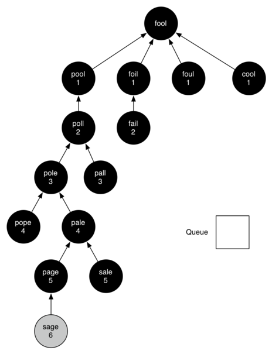

..  Copyright (C)  Brad Miller, David Ranum
    Permission is granted to copy, distribute and/or modify this document
    under the terms of the GNU Free Documentation License, Version 1.3 or 
    any later version published by the Free Software Foundation; with 
    Invariant Sections being Forward, Prefaces, and Contributor List, 
    no Front-Cover Texts, and no Back-Cover Texts.  A copy of the license
    is included in the section entitled "GNU Free Documentation License".

..  shortname:: GraphsBFS
..  description:: Solving problems with Graphs using breadth first search

Breadth First Search
--------------------

The Word Ladder Problem
~~~~~~~~~~~~~~~~~~~~~~~

To begin our study of graph algorithms let’s consider the following
puzzle called a word ladder. Transform the word “FOOL” into the word
“SAGE”. In a word ladder puzzle you must make the change occur gradually
by changing one letter at a time. At each step you must transform one
word into another word, you are not allowed to transform a word into a
non-word. The word ladder puzzle was invented in 1878 by Lewis Carroll,
the author of *Alice in Wonderland*. The following sequence of words
shows one possible solution to the problem posed above.

::

 FOOL
 POOL
 POLL
 POLE
 PALE
 SALE
 SAGE        
 
There are many variations of the word ladder puzzle. For example you
might be given a particular number of steps in which to accomplish the
transformation, or you might need to use a particular word. In this
section we are interested in figuring out the smallest number of
transformations needed to turn the starting word into the ending word.

Not surprisingly, since this chapter is on graphs, we can solve this
problem using a graph algorithm. Here is an outline of where we are
going:

-  Represent the relationships between the words as a graph.

-  Use the graph algorithm known as breadth first search to find an
   efficient path from the starting word to the ending word.

Building the Word Ladder Graph
~~~~~~~~~~~~~~~~~~~~~~~~~~~~~~

Our first problem is to figure out how to turn a large collection of
words into a graph. What we would like is to have an edge from one word
to another if the two words are only different by a single letter. If we
can create such a graph, then any path from one word to another is a
solution to the word ladder puzzle. :ref:`Figure 1 <fig_wordladder>` shows a
small graph of some words that solve the FOOL to SAGE word ladder
problem. Notice that the graph is an undirected graph and that the edges
are unweighted.

.. _fig_wordladder:

.. figure:: Figures/wordgraph.png
   :align: center

   A Small Word Ladder Graph

We could use several different approaches to create the graph we need to
solve this problem. Let’s start with the assumption that we have a list
of words that are all the same length. As a starting point, we can
create a vertex in the graph for every word in the list. To figure out
how to connect the words, we could compare each word in the list with
every other. When we compare we are looking to see how many letters are
different. If the two words in question are different by only one
letter, we can create an edge between them in the graph. For a small set
of words that approach would work fine; however let’s suppose we have a
list of 5,110 words. Roughly speaking, comparing one word to every other
word on the list is an :math:`O(n^2)` algorithm. For 5,110 words,
:math:`n^2` is more than 26 million comparisons.

We can do much better by using the following approach. Suppose that we
have a huge number of buckets, each of them with a four-letter word on
the outside, except that one of the letters in the label has been
replaced by an underscore. For example, consider
:ref:`Figure 2 <fig_wordbucket>`, we might have a bucket labeled “pop\_.” As we
process each word in our list we compare the word with each bucket,
using the ‘\_’ as a wildcard, so both “pope” and “pops” would match
“pop\_.” Every time we find a matching bucket, we put our word in that
bucket. Once we have all the words in the appropriate buckets we know
that all the words in the bucket must be connected.

.. _fig_wordbucket:
    
.. figure:: Figures/wordbuckets.png
   :align: center

   Word Buckets for Words That are Different by One Letter

In Python, we can implement the scheme we have just described by using a
dictionary. The labels on the buckets we have just described are the
keys in our dictionary. The value stored for that key is a list of
words. Once we have the dictionary built we can create the graph. We
start our graph by creating a vertex for each word in the graph. Then we
create edges between all the vertices we find for words found under the
same key in the dictionary. The following listing shows the Python
code required to build the graph.

::

    from pythonds.graphs import Graph
    def buildGraph(wordFile):
        d = {}
        g = Graph()    
        wfile = open(wordFile,'r')
        # create buckets of words that differ by one letter
        for line in wfile:
            word = line[:-1]
            for i in range(len(word)):
                bucket = word[:i] + '_' + word[i+1:]
                if bucket in d:
                    d[bucket].append(word)
                else:
                    d[bucket] = [word]
        # add vertices and edges for words in the same bucket
        for bucket in d.keys():
            for word1 in d[bucket]:
                for word2 in d[bucket]:
                    if word1 != word2:
                        g.addEdge(word1,word2)
        return g

Since this is our first real-world graph problem, you might be wondering
how sparse is the graph? The list of four-letter words we have for this
problem is 5,110 words long. If we were to use an adjacency matrix, the
matrix would have 5,110 \* 5,110 = 26,112,100 cells. The graph
constructed by the ``buildGraph`` function has exactly 53,286 edges, so
the matrix would have only 0.20% of the cells filled! That is a very
sparse matrix indeed.

Implementing Breadth First Search
~~~~~~~~~~~~~~~~~~~~~~~~~~~~~~~~~

With the graph constructed we can now turn our attention to the
algorithm we will use to find the shortest solution to the word ladder
problem. The graph algorithm we are going to use is called the “breadth
first search” algorithm. **Breadth first search** (**BFS**) is one of
the easiest algorithms for searching a graph. It also serves as a
prototype for several other important graph algorithms that we will
study later.

Given a graph :math:`G` and a starting vertex :math:`s`, a breadth
first search proceeds by exploring edges in the graph to find all the
vertices in :math:`G` for which there is a path from :math:`s`. The
remarkable thing about a breadth first search is that it finds *all* the
vertices that are a distance :math:`k` from :math:`s` before it
finds *any* vertices that are a distance :math:`k+1`. One good way to
visualize what the breadth first search algorithm does is to imagine
that it is building a tree, one level of the tree at a time. A breadth
first search adds all children of the starting vertex before it begins
to discover any of the grandchildren.

To keep track of its progress, BFS colors each of the vertices white,
gray, or black. All the vertices are initialized to white when they are
constructed. A white vertex is an undiscovered vertex. When a vertex is
initially discovered it is colored gray, and when BFS has completely
explored a vertex it is colored black. This means that once a vertex is
colored black, it has no white vertices adjacent to it. A gray node, on
the other hand, may have some white vertices adjacent to it, indicating
that there are still additional vertices to explore.

The breadth first search algorithm shown in the listing below uses the
adjacency list graph representation we developed earlier. In addition it uses a ``Queue``,
a crucial point as we will see, to decide which vertex to explore next.

In addition the BFS algorithm uses an extended version of the ``Vertex``
class. This new vertex class adds three new instance variables:
distance, predecessor, and color. Each of these instance variables also
has the appropriate getter and setter methods. The code for this
expanded Vertex class is included in the ``pythonds`` package, but we
will not show it to you here as there is nothing new to learn by seeing
the additional instance variables.

BFS begins at the starting vertex ``s`` and colors ``start`` gray to
show that it is currently being explored. Two other values, the distance
and the predecessor, are initialized to 0 and ``None`` respectively for
the starting vertex. Finally, ``start`` is placed on a ``Queue``. The
next step is to begin to systematically explore vertices at the front of
the queue. We explore each new node at the front of the queue by
iterating over its adjacency list. As each node on the adjacency list is
examined its color is checked. If it is white, the vertex is unexplored,
and four things happen:

#. The new, unexplored vertex ``nbr``, is colored gray.

#. The predecessor of ``nbr`` is set to the current node ``currentVert``

#. The distance to ``nbr`` is set to the distance to ``currentVert + 1``

#. ``nbr`` is added to the end of a queue. Adding ``nbr`` to the end of
   the queue effectively schedules this node for further exploration,
   but not until all the other vertices on the adjacency list of
   ``currentVert`` have been explored.

::

    from pythonds.graphs import Graph, Vertex
    from pythonds.basic import Queue
    
    def bfs(g,start):
      start.setDistance(0)
      start.setPred(None)
      vertQueue = Queue()
      vertQueue.enqueue(start)
      while (vertQueue.size() > 0):
        currentVert = vertQueue.dequeue()
        for nbr in currentVert.getConnections():
          if (nbr.getColor() == 'white'):
            nbr.setColor('gray')
            nbr.setDistance(currentVert.getDistance() + 1)
            nbr.setPred(currentVert)
            vertQueue.enqueue(nbr)
        currentVert.setColor('black')

Let’s look at how the ``bfs`` function would construct the breadth first
tree corresponding to the graph in :ref:`Figure 1 <fig_wordladder>`. Starting
from fool we take all nodes that are adjacent to fool and add them to
the tree. The adjacent nodes include pool, foil, foul, and cool. Each of
these nodes are added to the queue of new nodes to expand.
:ref:`Figure 3 <fig_bfs1>` shows the state of the in-progress tree along with the
queue after this step.

.. _fig_bfs1:

.. figure:: Figures/bfs1.png
   :align: center

   The First Step in the Breadth First Search

In the next step ``bfs`` removes the next node (pool) from the front of
the queue and repeats the process for all of its adjacent nodes.
However, when ``bfs`` examines the node cool, it finds that the color of
cool has already been changed to gray. This indicates that there is a
shorter path to cool and that cool is already on the queue for further
expansion. The only new node added to the queue while examining pool is
poll. The new state of the tree and queue is shown in :ref:`Figure 4 <fig_bfs2>`.

.. _fig_bfs2:

.. figure:: Figures/bfs2.png
   :align: center

   The Second Step in the Breadth First Search

The next vertex on the queue is foil. The only new node that foil can
add to the tree is fail. As ``bfs`` continues to process the queue,
neither of the next two nodes add anything new to the queue or the tree.
:ref:`Figure 5 <fig_bfs3>` shows the tree and the queue after expanding all the
vertices on the second level of the tree.

.. _fig_bfs3:

.. figure:: Figures/bfs3.png
   :align: center
   
   Breadth First Search Tree After Completing One Level

.. _fig_bfsDone:

   Final Breadth First Search Tree      

You should continue to work through the algorithm on your own so that
you are comfortable with how it works. :ref:`Figure 6 <fig_bfsDone>` shows the
final breadth first search tree after all the vertices in
:ref:`Figure 3 <fig_wordladder>` have been expanded. The amazing thing about the
breadth first search solution is that we have not only solved the
FOOL–SAGE problem we started out with, but we have solved many other
problems along the way. We can start at any vertex in the breadth first
search tree and follow the predecessor arrows back to the root to find
the shortest word ladder from any word back to fool. The function below shows how to follow the predecessor links to
print out the word ladder.

::

    def traverse(y):
        x = y
        while (x.getPred()):
            print(x.getId())
            x = x.getPred()
        print(x.getId())

    traverse(g.getVertex('sage'))

Breadth First Search Analysis
~~~~~~~~~~~~~~~~~~~~~~~~~~~~~

Before we continue with other graph algorithms let us analyze the run
time performance of the breadth first search algorithm. The first thing
to observe is that the while loop is executed,
at most, one time for each vertex in the graph :math:`|V|`. You can
see that this is true because a vertex must be white before it can be
examined and added to the queue. This gives us :math:`O(V)` for the
while loop. The for loop, which is nested inside the while is executed at most once for each edge in the graph,
:math:`|E|`. The reason is that every vertex is dequeued at most once
and we examine an edge from node :math:`u` to node :math:`v` only
when node :math:`u` is dequeued. This gives us :math:`O(E)` for the
for loop. combining the two loops gives us :math:`O(V + E)`.

Of course doing the breadth first search is only part of the task.
Following the links from the starting node to the goal node is the other
part of the task. The worst case for this would be if the graph was a
single long chain. In this case traversing through all of the vertices
would be :math:`O(V)`. The normal case is going to be some fraction of
:math:`|V|` but we would still write :math:`O(V)`.

Finally, at least for this problem, there is the time required to build
the initial graph. We leave the analysis of the ``buildGraph`` function
as an exercise for you.

