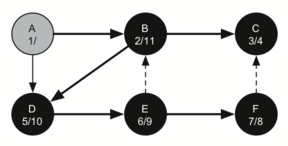
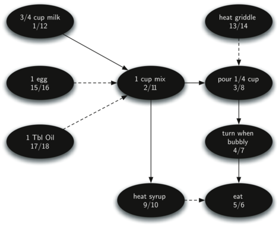

..  Copyright (C)  Brad Miller, David Ranum
    Permission is granted to copy, distribute and/or modify this document
    under the terms of the GNU Free Documentation License, Version 1.3 or 
    any later version published by the Free Software Foundation; with 
    Invariant Sections being Forward, Prefaces, and Contributor List, 
    no Front-Cover Texts, and no Back-Cover Texts.  A copy of the license
    is included in the section entitled "GNU Free Documentation License".
    
..  shortname:: GraphsDFS
..  description:: Solving problems with graphs using depth first search

Depth First Search
------------------

The Knight’s Tour Problem
~~~~~~~~~~~~~~~~~~~~~~~~~

Another classic problem that we can use to illustrate a second common
graph algorithm is called the “knight’s tour.” The knight’s
tour puzzle is played on a chess board with a single chess piece, the
knight. The object of the puzzle is to find a sequence of moves that
allow the knight to visit every square on the board exactly once. One
such sequence is called a “tour.” The knight’s tour puzzle has
fascinated chess players, mathematicians and computer scientists alike
for many years. The upper bound on the number of possible legal tours
for an eight-by-eight chessboard is known to be
:math:`1.305 \times 10^{35}`; however, there are even more possible
dead ends. Clearly this is a problem that requires some real brains,
some real computing power, or both.

Although researchers have studied many different algorithms to solve the
knight’s tour problem, a graph search is one of the easiest to
understand and program. Once again we will solve the problem using two
main steps:

-  Represent the legal moves of a knight on a chessboard as a graph.

-  Use a graph algorithm to find a path of length
   :math:`rows \times columns - 1` where every vertex on the graph is
   visited exactly once.

Building the Knight’s Tour Graph
~~~~~~~~~~~~~~~~~~~~~~~~~~~~~~~~

To represent the knight’s tour problem as a graph we will use the
following two ideas: Each square on the chessboard can be represented as
a node in the graph. Each legal move by the knight can be represented as
an edge in the graph. :ref:`Figure 1 <fig_knightmoves>` illustrates the legal
moves by a knight and the corresponding edges in a graph.
 
.. _fig_knightmoves:

.. figure:: Figures/knightmoves.png
   :align: center

   Legal Moves for a Knight on Square 12, and the Corresponding Graph     

To build the full graph for an n-by-n board we can use the Python
function shown below. The ``knightGraph`` function
makes one pass over the entire board. At each square on the board the
``knightGraph`` function calls a helper, ``genLegalMoves``, to create a
list of legal moves for that position on the board. All legal moves are
then converted into edges in the graph. Another helper function
``posToNodeId`` converts a location on the board in terms of a row and a
column into a linear vertex number similar to the vertex numbers shown
in :ref:`Figure 1 <fig_knightmoves>`.

::

    from pythonds.graphs import Graph
    def knightGraph(bdSize):
        ktGraph = Graph()
        for row in range(bdSize):
           for col in range(bdSize):
               nodeId = posToNodeId(row,col,bdSize)
               newPositions = genLegalMoves(row,col,bdSize)
               for e in newPositions:
                   nid = posToNodeId(e[0],e[1])
                   ktGraph.addEdge(nodeId,nid)
        return ktGraph

The ``genLegalMoves`` function takes the position of the knight on the
board and generates each of the eight possible moves. The ``legalCoord``
helper function makes sure that a particular move that is generated is
still on the board.

::

    def genLegalMoves(x,y,bdSize):
        newMoves = []
        moveOffsets = [(-1,-2),(-1,2),(-2,-1),(-2,1),
                       ( 1,-2),( 1,2),( 2,-1),( 2,1)]:
        for i in moveOffsets:
            newX = x + i[0]
            newY = y + i[1]
            if legalCoord(newX,bdSize) and \
                            legalCoord(newY,bdSize):
                newMoves.append((newX,newY))
        return newMoves

    def legalCoord(x,bdSize):
        if x >= 0 and x < bdSize:
            return True
        else:
            return False

:ref:`Figure 2 <fig_bigknight>` shows the complete graph of possible moves on an
eight-by-eight board. There are exactly 336 edges in the graph. Notice
that the vertices corresponding to the edges of the board have fewer
connections (legal moves) than the vertices in the middle of the board.
Once again we can see how sparse the graph is. If the graph was fully
connected there would be 4,096 edges. Since there are only 336 edges,
the adjacency matrix would be only 8.2 percent full.

.. _fig_bigknight:

   All Legal Moves for a Knight on an :math:`8 \times 8` Chessboard
          

Implementing Knight’s Tour
~~~~~~~~~~~~~~~~~~~~~~~~~~

The search algorithm we will use to solve the knight’s tour problem is
called **depth first search** (**DFS**).  Whereas the
breadth first search algorithm discussed in the previous section builds
a search tree one level at a time, a depth first search creates a search
tree by exploring one branch of the tree as deeply as possible. In this
section we will look at two algorithms that implement a depth first
search. The first algorithm we will look at directly solves the knight’s
tour problem by explicitly forbidding a node to be visited more than
once. The second implementation is more general, but allows nodes to be
visited more than once as the tree is constructed. The second version is
used in subsequent sections to develop additional graph algorithms.

The depth first exploration of the graph is exactly what we need in
order to find a path that has exactly 63 edges. We will see that when
the depth first search algorithm finds a dead end (a place in the graph
where there are no more moves possible) it backs up the tree to the next
deepest vertex that allows it to make a legal move.

The ``knightTour`` function takes four parameters: ``n``, the current
depth in the search tree; ``path``, a list of vertices visited up to
this point; ``u``, the vertex in the graph we wish to explore; and
``limit`` the number of nodes in the path. The ``knightTour`` function
is recursive. When the ``knightTour`` function is called, it first
checks the base case condition. If we have a path that contains 64
vertices, we return from ``knightTour`` with a status of ``True``,
indicating that we have found a successful tour. If the path is not long
enough we continue to explore one level deeper by choosing a new vertex
to explore and calling ``knightTour`` recursively for that vertex.

DFS also uses colors to keep track of which vertices in the graph have
been visited. Unvisited vertices are colored white, and visited vertices
are colored gray. If all neighbors of a particular vertex have been
explored and we have not yet reached our goal length of 64 vertices, we
have reached a dead end. When we reach a dead end we must backtrack.
Backtracking happens when we return from ``knightTour`` with a status of
``False``. In the breadth first search we used a queue to keep track of
which vertex to visit next. Since depth first search is recursive, we
are implicitly using a stack to help us with our backtracking. When we
return from a call to ``knightTour`` with a status of ``False``, in line 11, 
we remain inside the ``while`` loop and look at the next
vertex in ``nbrList``.

::

    from pythonds.graphs import Graph, Vertex
    def knightTour(n,path,u,limit): 
            u.setColor('gray')
            path.append(u)
            if n < limit:
                nbrList = list(u.getConnections())
                i = 0
                done = False
                while i < len(nbrList) and not done:
                    if nbrList[i].getColor() == 'white':
                        done = knightTour(n+1, path, nbrList[i], limit)
                    i = i + 1    
                if not done:  # prepare to backtrack
                    path.pop()
                    u.setColor('white')
            else:
                done = True
            return done

Let's look at a simple example of ``knightTour`` in action. You
can refer to the figures below to follow the steps of the search. For
this example we will assume that the call to the ``getConnections``
method on line 6 orders the nodes in
alphabetical order. We begin by calling ``knightTour(0,path,A,6)``

``knightTour`` starts with node A :ref:`Figure 3 <fig_ktb>`. The nodes adjacent to A are B and D.
Since B is before D alphabetically, DFS selects B to expand next as
shown in :ref:`Figure 4 <fig_ktb>`. Exploring B happens when ``knightTour`` is
called recursively. B is adjacent to C and D, so ``knightTour`` elects
to explore C next. However, as you can see in :ref:`Figure 5 <fig_ktc>` node C is
a dead end with no adjacent white nodes. At this point we change the
color of node C back to white. The call to ``knightTour`` returns a
value of ``False``. The return from the recursive call effectively
backtracks the search to vertex B (see :ref:`Figure 6 <fig_ktd>`). The next
vertex on the list to explore is vertex D, so ``knightTour`` makes a
recursive call moving to node D. From vertex D on,
``knightTour`` can continue to make recursive calls until we
get to node C again.  However, this time when we get to node C the
test ``n < limit`` fails so we know that we have exhausted all the
nodes in the graph. At this point we can return ``True`` to indicate
that we have made a successful tour of the graph. When we return the
list, ``path`` has the values ``[A,B,D,E,F,C]``, which is the the order
we need to traverse the graph to visit each node exactly once.

.. _fig_kta:

.. figure:: Figures/ktdfsa.png
   :align: center

   Start with node A

.. _fig_ktb:

.. figure:: Figures/ktdfsb.png
   :align: center
           
   Explore B

     
.. _fig_ktc:

.. figure:: Figures/ktdfsc.png
   :align: center

   Node C is a dead end

.. _fig_ktd:

.. figure:: Figures/ktdfsd.png
   :align: center
           
   backtrack to B    

  
.. _fig_kte:

.. figure:: Figures/ktdfse.png
   :align: center
   
   
.. _fig_ktf:

.. figure:: Figures/ktdfsf.png
   :align: center

   
.. _fig_ktg:

.. figure:: Figures/ktdfsg.png
   :align: center
   
         
.. _fig_kth:

.. figure:: Figures/ktdfsh.png
   :align: center

   Finish
         

:ref:`Figure 7 <fig_tour>` shows you what a complete tour around an
eight-by-eight board looks like. There are many possible tours; some are
symmetric. With some modification you can make circular tours that start
and end at the same square.

.. _fig_tour:

.. figure:: Figures/completeTour.png
   :align: center

   A Complete Tour of the Board
       

Knight’s Tour Analysis
~~~~~~~~~~~~~~~~~~~~~~

There is one last interesting topic regarding the knight’s tour problem,
then we will move on to the general version of the depth first search.
The topic is performance. In particular, ``knightTour`` is very
sensitive to the method you use to select the next vertex to visit. For
example, on a five-by-five board you can produce a path in about 1.5
seconds on a reasonably fast computer. But what happens if you try an
eight-by-eight board? In this case, depending on the speed of your
computer, you may have to wait up to a half hour to get the results! The
reason for this is that the knight’s tour problem as we have implemented
it so far is an exponential algorithm of size :math:`O(k^N)`, where N
is the number of squares on the chess board, and k is a small constant.
:ref:`Figure 8 <fig_8array>` can help us visualize why this is so. The root of
the tree represents the starting point of the search. From there the
algorithm generates and checks each of the possible moves the knight can
make. As we have noted before the number of moves possible depends on
the position of the knight on the board. In the corners there are only
two legal moves, on the squares adjacent to the corners there are three
and in the middle of the board there are eight. :ref:`Figure 9 <fig_numMoves>`
shows the number of moves possible for each position on a board. At the
next level of the tree there are once again between 2 and 8 possible
next moves from the position we are currently exploring. The number of
possible positions to examine corresponds to the number of nodes in the
search tree.

.. _fig_8array:  

   A Search Tree for the Knight’s Tour 

.. _fig_numMoves:

.. figure:: Figures/moveCount.png
   :align: center

   Number of Possible Moves for Each Square      

We have already seen that the number of nodes in a binary tree of height
N is :math:`2^{N+1}-1`. For a tree with nodes that may have up to
eight children instead of two the number of nodes is much larger.
Because the branching factor of each node is variable, we could estimate
the number of nodes using an average branching factor. The important
thing to note is that this algorithm is exponential:
:math:`k^{N+1}-1`, where :math:`k` is the average branching factor
for the board. Let’s look at how rapidly this grows! For a board that is
5x5 the tree will be 25 levels deep, or N = 24 counting the first level
as level 0. The average branching factor is :math:`k = 3.8` So the
number of nodes in the search tree is :math:`3.8^{25}-1` or
:math:`3.12 \times 10^{14}`. For a 6x6 board, :math:`k = 4.4`, there
are :math:`1.5
\times 10^{23}` nodes, and for a regular 8x8 chess board,
:math:`k = 5.25`, there are :math:`1.3 \times 10^{46}`. Of course,
since there are multiple solutions to the problem we won’t have to
explore every single node, but the fractional part of the nodes we do
have to explore is just a constant multiplier which does not change the
exponential nature of the problem. We will leave it as an exercise for
you to see if you can express :math:`k` as a function of the board
size.

Luckily there is a way to speed up the eight-by-eight case so that it
runs in under one second. In the listing below we show the code that
speeds up the ``knightTour``. This function, called ``orderbyAvail``
will be used in place of the call to ``u.getConnections`` in the code previously
shown above. The critical line in the
``orderByAvail`` function is line 10. This line ensures that we
select the vertex to go next that has the fewest available moves. You
might think this is really counter productive; why not select the node
that has the most available moves? You can try that approach easily by
running the program yourself and inserting the line
``resList.reverse()`` right after the sort.

The problem with using the vertex with the most available moves as your
next vertex on the path is that it tends to have the knight visit the
middle squares early on in the tour. When this happens it is easy for
the knight to get stranded on one side of the board where it cannot
reach unvisited squares on the other side of the board. On the other
hand, visiting the squares with the fewest available moves first pushes
the knight to visit the squares around the edges of the board first.
This ensures that the knight will visit the hard-to-reach corners early
and can use the middle squares to hop across the board only when
necessary. Utilizing this kind of knowledge to speed up an algorithm is
called a heuristic. Humans use heuristics every day to help make
decisions, heuristic searches are often used in the field of artificial
intelligence. This particular heuristic is called Warnsdorff’s
algorithm, named after H. C. Warnsdorff who published his idea in 1823.

::

    def orderByAvail(n):
        resList = []
        for v in n.geConnections():
            if v.getColor() == 'white':
                c = 0
                for w in v.getConnections():
                    if w.getColor() == 'white':
                        c = c + 1
                resList.append((c,v))
        resList.sort(key=lambda x: x[0])
        return [y[1] for y in resList]   

General Depth First Search
~~~~~~~~~~~~~~~~~~~~~~~~~~

The knight’s tour is a special case of a depth first search where the
goal is to create the deepest depth first tree, without any branches.
The more general depth first search is actually easier. Its goal is to
search as deeply as possible, connecting as many nodes in the graph as
possible and branching where necessary.

It is even possible that a depth first search will create more than one
tree. When the depth first search algorithm creates a group of trees we
call this a **depth first forest**. As with the breadth first search our
depth first search makes use of predecessor links to construct the tree.
In addition, the depth first search will make use of two additional
instance variables in the ``Vertex`` class. The new instance variables
are the discovery and finish times. The discovery time tracks the number
of steps in the algorithm before a vertex is first encountered. The
finish time is the number of steps in the algorithm before a vertex is
colored black. As we will see after looking at the algorithm, the
discovery and finish times of the nodes provide some interesting
properties we can use in later algorithms.

The code for our depth first search is shown in the next listing. Since
the two functions ``dfs`` and its helper ``dfsvisit`` use a variable to
keep track of the time across calls to ``dfsvisit`` we chose to
implement the code as methods of a class that inherits from the
``Graph`` class. This implementation extends the graph class by adding a
``time`` instance variable and the two methods ``dfs`` and ``dfsvisit``.
Looking at line 11 you will notice that the ``dfs`` method
iterates over all of the vertices in the graph calling ``dfsvisit`` on
the nodes that are white. The reason we iterate over all the nodes,
rather than simply searching from a chosen starting node, is to make
sure that all nodes in the graph are considered and that no vertices are
left out of the depth first forest. It may look unusual to see the
statement ``for aVertex in self``, but remember that in this case ``self``
is an instance of the ``DFSGraph`` class, and iterating over all the
vertices in an instance of a graph is a natural thing to do.

::

    from pythonds.graphs import Graph
    class DFSGraph(Graph):
        def __init__(self):
            super().__init__()
            self.time = 0

        def dfs(self):
            for aVertex in self:
                aVertex.setColor('white')
                aVertex.setPred(-1)
            for aVertex in self:
                if aVertex.getColor() == 'white':
                    self.dfsvisit(aVertex)

        def dfsvisit(self,startVertex):
            startVertex.setColor('gray')
            self.time += 1
            startVertex.setDiscovery(self.time)
            for nextVertex in startVertex.getConnections():
                if nextVertex.getColor() == 'white':
                    nextVertex.setPred(startVertex)
                    self.dfsvisit(nextVertex)
            startVertex.setColor('black')
            self.time += 1
            startVertex.setFinish(self.time)

Although our implementation of ``bfs`` was only interested in
considering nodes for which there was a path leading back to the start,
it is possible to create a breadth first forest that represents the
shortest path between all pairs of nodes in the graph. We leave this as
an exercise. In our next two algorithms we will see why keeping track of
the depth first forest is important.

The ``dfsvisit`` method starts with a single vertex called
``startVertex`` and explores all of the neighboring white vertices as
deeply as possible. If you look carefully at the code for ``dfsvisit``
and compare it to breadth first search, what you should notice is that
the ``dfsvisit`` algorithm is almost identical to ``bfs`` except that on
the last line of the inner ``for`` loop, ``dfsvisit`` calls itself
recursively to continue the search at a deeper level, whereas ``bfs``
adds the node to a queue for later exploration. It is interesting to
note that where ``bfs`` uses a queue, ``dfsvisit`` uses a stack. You
don’t see a stack in the code, but it is implicit in the recursive call
to ``dfsvisit``.

The following sequence of figures illustrates the depth first search algorithm in
action for a small graph. In these figures, the dotted lines
indicate edges that are checked, but the node at the other end of the
edge has already been added to the depth first tree. In the code this
test is done by checking that the color of the other node is non-white.

The search begins at vertex A of the graph (:ref:`Figure 10 <fig_gdfsa>`). Since all of the vertices
are white at the beginning of the search the algorithm visits vertex A.
The first step in visiting a vertex is to set the color to gray, which
indicates that the vertex is being explored and the discovery time is
set to 1. Since vertex A has two adjacent vertices (B, D) each of those
need to be visited as well. We’ll make the arbitrary decision that we
will visit the adjacent vertices in alphabetical order.

Vertex B is visited next, so its color is set to gray and its discovery
time is set to 2. Vertex B is also adjacent to two other nodes (C, D) so
we will follow the alphabetical order and visit node C next.

Visiting vertex C brings us to the end of one branch of the tree. After
coloring the node gray and setting its discovery time to 3, the
algorithm also determines that there are no adjacent vertices to C. This
means that we are done exploring node C and so we can color the vertex
black, and set the finish time to 4. You can see the state of our search
at this point in :ref:`Figure 13 <fig_gdfsd>`.

Since vertex C was the end of one branch we now return to vertex B and
continue exploring the nodes adjacent to B. The only additional vertex
to explore from B is D, so we can now visit D and continue our search
from vertex D. Vertex D quickly leads us to vertex E. Vertex E has two
adjacent vertices, B and F. Normally we would explore these adjacent
vertices alphabetically, but since B is already colored gray the
algorithm recognizes that it should not visit B since doing so would put
the algorithm in a loop! So exploration continues with the next vertex
in the list, namely F.

Vertex F has only one adjacent vertex, C, but since C is colored black
there is nothing else to explore, and the algorithm has reached the end
of another branch. From here on, you will see in :ref:`Figure 17 <fig_gdfsh>` thru
:ref:`Figure 21 <fig_gdfsl>`  that the algorithm works its way back to the first node,
setting finish times and coloring vertices black.
     
.. _fig_gdfsa:

   Constructing the Depth First Search Tree-10
   
.. _fig_gdfsb:

.. figure:: Figures/gendfsb.png
   :align: center
   
   Constructing the Depth First Search Tree-11
          
.. _fig_gdfsc:

.. figure:: Figures/gendfsc.png
   :align: center

   Constructing the Depth First Search Tree-12
   
.. _fig_gdfsd:

.. figure:: Figures/gendfsd.png
   :align: center

   Constructing the Depth First Search Tree-13
   
.. _fig_gdfse:

.. figure:: Figures/gendfse.png
   :align: center

   Constructing the Depth First Search Tree-14
   
.. _fig_gdfsf:

.. figure:: Figures/gendfsf.png
   :align: center

   Constructing the Depth First Search Tree-15

.. _fig_gdfsg:

.. figure:: Figures/gendfsg.png
   :align: center

   Constructing the Depth First Search Tree-16
   
.. _fig_gdfsh:

.. figure:: Figures/gendfsh.png
   :align: center

   Constructing the Depth First Search Tree-17
   
.. _fig_gdfsi:

.. figure:: Figures/gendfsi.png
   :align: center

   Constructing the Depth First Search Tree-18
   
.. _fig_gdfsj:

.. figure:: Figures/gendfsj.png
   :align: center

   Constructing the Depth First Search Tree-19
   
.. _fig_gdfsk:

   Constructing the Depth First Search Tree-20
   
.. _fig_gdfsl:

.. figure:: Figures/gendfsl.png
   :align: center

   Constructing the Depth First Search Tree-21

The starting and finishing times for each node display a property called
the **parenthesis property**. This property means that all the children
of a particular node in the depth first tree have a later discovery time
and an earlier finish time than their parent. :ref:`Figure 22 <fig_dfstree>` shows
the tree constructed by the depth first search algorithm.

.. _fig_dfstree:

.. figure:: Figures/dfstree.png
   :align: center
   
   The Resulting Depth First Search Tree   

Depth First Search Analysis
~~~~~~~~~~~~~~~~~~~~~~~~~~~

The general running time for depth first search is as follows. The loops
in ``dfs`` both run in :math:`O(V)`,
not counting what happens in ``dfsvisit``, since they are executed once
for each vertex in the graph. In ``dfsvisit`` the loop is executed once for each edge in the adjacency
list of the current vertex. Since ``dfsvisit`` is only called
recursively if the vertex is white, the loop will execute a maximum of
once for every edge in the graph or :math:`O(E)`. So, the total time
for depth first search is :math:`O(V + E)`.

Topological Sorting
-------------------

To demonstrate that computer scientists can turn just about anything
into a graph problem, let’s consider the difficult problem of stirring
up a batch of pancakes. The recipe is really quite simple: 1 egg, 1 cup
of pancake mix, 1 tablespoon oil, and :math:`3 \over 4` cup of milk.
To make pancakes you must heat the griddle, mix all the ingredients
together and spoon the mix onto a hot griddle. When the pancakes start
to bubble you turn them over and let them cook until they are golden
brown on the bottom. Before you eat your pancakes you are going to want
to heat up some syrup. :ref:`Figure 23 <fig_pancakes>` illustrates this process as
a graph.

.. _fig_pancakes:

.. figure:: Figures/pancakes.png
   :align: center

   The Steps for Making Pancakes       

The difficult thing about making pancakes is knowing what to do first.
As you can see from :ref:`Figure 23 <fig_pancakes>` you might start by heating the
griddle or by adding any of the ingredients to the pancake mix. To help
us decide the precise order in which we should do each of the steps
required to make our pancakes we turn to a graph algorithm called the
**topological sort**.

A topological sort takes a directed acyclic graph and produces a linear
ordering of all its vertices such that if the graph :math:`G` contains
an edge :math:`(v,w)` then the vertex :math:`v` comes before the
vertex :math:`w` in the ordering. Directed acyclic graphs are used in
many applications to indicate the precedence of events. Making pancakes
is just one example; other examples include software project schedules,
precedence charts for optimizing database queries, and multiplying
matrices.

The topological sort is a simple but useful adaptation of a depth first
search. The algorithm for the topological sort is as follows:

#. Call ``dfs(g)`` for some graph ``g``. The main reason we want to call
   depth first search is to compute the finish times for each of the
   vertices.

#. Store the vertices in a list in decreasing order of finish time.

#. Return the ordered list as the result of the topological sort.

:ref:`Figure 24 <fig_pancakesDFS>` shows the depth first forest constructed by
``dfs`` on the pancake-making graph shown in :ref:`Figure 23 <fig_pancakes>`.

.. _fig_pancakesDFS:

   Result of Depth First Search on the Pancake Graph
          

Finally, :ref:`Figure 25 <fig_pancakesTS>` shows the results of applying the
topological sort algorithm to our graph. Now all the ambiguity has been
removed and we know exactly the order in which to perform the pancake
making steps.

.. _fig_pancakesTS:

.. figure:: Figures/pancakesTS.png
   :align: center

   Result of Topological Sort on Directed Acyclic Graph
          

Strongly Connected Components
-----------------------------

For the remainder of this chapter we will turn our attention to some
extremely large graphs. The graphs we will use to study some additional
algorithms are the graphs produced by the connections between hosts on
the Internet and the links between web pages. We will begin with web
pages.

Search engines like Google and Bing exploit the fact that the pages on
the web form a very large directed graph. To transform the World Wide
Web into a graph, we will treat a page as a vertex, and the hyperlinks
on the page as edges connecting one vertex to another.
:ref:`Figure 26 <fig_cshome>` shows a very small part of the graph produced by
following the links from one page to the next, beginning at Luther
College’s Computer Science home page. Of course, this graph could be
huge, so we have limited it to web sites that are no more than 10 links
away from the CS home page.

.. _fig_cshome:

.. figure:: Figures/cshome.png
   :align: center

   The Graph Produced by Links from the Luther Computer Science Home Page      

If you study the graph in :ref:`Figure 26 <fig_cshome>` you might make some
interesting observations. First you might notice that many of the other
web sites on the graph are other Luther College web sites. Second, you
might notice that there are several links to other colleges in Iowa.
Third, you might notice that there are several links to other liberal
arts colleges. You might conclude from this that there is some
underlying structure to the web that clusters together web sites that
are similar on some level.

One graph algorithm that can help find clusters of highly interconnected
vertices in a graph is called the strongly connected components
algorithm (**SCC**). We formally define a **strongly connected
component**, :math:`C`, of a graph :math:`G`, as the largest subset
of vertices :math:`C \subset V` such that for every pair of vertices
:math:`v, w \in C` we have a path from :math:`v` to :math:`w` and
a path from :math:`w` to :math:`v`. :ref:`Figure 27 <fig_scc1>` shows a simple
graph with three strongly connected components. The strongly connected
components are identified by the different shaded areas.

.. _fig_scc1:
        
.. figure:: Figures/scc1.png
   :align: center

   A Directed Graph with Three Strongly Connected Components

Once the strongly connected components have been identified we can show
a simplified view of the graph by combining all the vertices in one
strongly connected component into a single larger vertex. The simplified
version of the graph in :ref:`Figure 27 <fig_scc1>` is shown in :ref:`Figure 28 <fig_scc2>`.

.. _fig_scc2:

.. figure:: Figures/scc2.png
   :align: center

   The Reduced Graph

Once again we will see that we can create a very powerful and efficient
algorithm by making use of a depth first search. Before we tackle the
main SCC algorithm we must look at one other definition. The
transposition of a graph :math:`G` is defined as the graph
:math:`G^T` where all the edges in the graph have been reversed. That
is, if there is a directed edge from node A to node B in the original
graph then :math:`G^T` will contain and edge from node B to node A.
:ref:`Figure 29 <fig_tpa>` and :ref:`Figure 30 <fig_tpb>` show a simple graph and its transposition.

    
.. _fig_tpa:

.. figure:: Figures/transpose1.png
   :align: center

   A Graph :math:`G`
          
.. _fig_tpb:

.. figure:: Figures/transpose2.png
   :align: center

   Its Transpose :math:`G^T`

Look at the figures again. Notice that the graph in
:ref:`Figure 29 <fig_tpa>` has two strongly connected components. Now look at 
:ref:`Figure 30 <fig_tpb>`. Notice that it has the same two strongly connected
components.

We can now describe the algorithm to compute the strongly connected
components for a graph.

#. Call ``dfs`` for the graph :math:`G` to compute the finish times
   for each vertex.

#. Compute :math:`G^T`.

#. Call ``dfs`` for the graph :math:`G^T` but in the main loop of DFS
   explore each vertex in decreasing order of finish time.

#. Each tree in the forest computed in step 3 is a strongly connected
   component. Output the vertex ids for each vertex in each tree in the
   forest to identify the component.

Lets trace the operation of the steps described above on the example
graph in :ref:`Figure 27 <fig_scc1>`. :ref:`Figure 31 <fig_sccalga>` shows the starting and
finishing times computed for the original graph by the DFS algorithm.
:ref:`Figure 32 <fig_sccalgb>` shows the starting and finishing times computed by
running DFS on the transposed graph.

 
.. _fig_sccalga:

   
   Finishing times for the original graph :math:`G`     

     
.. _fig_sccalgb:

.. figure:: Figures/scc1b.png
   :align: center
   
   Finishing times for :math:`G^T`
    

Finally, :ref:`Figure 33 <fig_sccforest>` shows the forest of three trees produced
in step 3 of the strongly connected component algorithm. You will notice
that we do not provide you with the Python code for the SCC algorithm,
we leave writing this program as an exercise.

          
.. _fig_sccforest:

.. figure:: Figures/sccforest.png
   :align: center
   
   The Strongly Connected Components as a Forest of Trees
