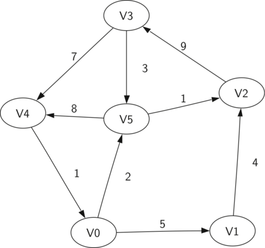

..  Copyright (C)  Brad Miller, David Ranum
    Permission is granted to copy, distribute and/or modify this document
    under the terms of the GNU Free Documentation License, Version 1.3 or 
    any later version published by the Free Software Foundation; with 
    Invariant Sections being Forward, Prefaces, and Contributor List, 
    no Front-Cover Texts, and no Back-Cover Texts.  A copy of the license
    is included in the section entitled "GNU Free Documentation License".
    
..  shortname:: Graphs
..  description:: Introduction to the graph data structure

Graphs
======

Objectives
----------

-  To learn what a graph is and how it is used.

-  To implement the **graph** abstract data type using multiple internal
   representations.

-  To see how graphs can be used to solve a wide variety of problems

In this chapter we will study graphs. Graphs are a more general
structure than the trees we studied in the last chapter; in fact you can
think of a tree as a special kind of graph. Graphs can be used to
represent many interesting things about our world, including systems of
roads, airline flights from city to city, how the Internet is connected,
or even the sequence of classes you must take to complete a major in
computer science. We will see in this chapter that once we have a good
representation for a problem, we can use some standard graph algorithms
to solve what otherwise might seem to be a very difficult problem.

While it is relatively easy for humans to look at a road map and
understand the relationships between different places, a computer has no
such knowledge. However, we can also think of a road map as a graph.
When we do so we can have our computer do interesting things for us. If
you have ever used one of the Internet map sites, you know that a
computer can find the shortest, quickest, or easiest path from one place
to another.

As a student of computer science you may wonder about the courses you
must take in order to get a major. A graph is good way to represent the
prerequisites and other interdependencies among courses.
:ref:`Figure 1 <fig1>` shows another graph. This one represents the courses
and the order in which they must be taken to complete a major in
computer science at Luther College.

.. _fig1:

.. figure:: Figures/CS-Prereqs.png
    :align: center

    Prerequisites for a Computer Science Major

Vocabulary and Definitions
--------------------------

Now that we have looked at some examples of graphs, we will more
formally define a graph and its components. We already know some of
these terms from our discussion of trees.

Vertex
    A vertex (also called a “node”) is a fundamental part of a graph. It
    can have a name, which we will call the “key.” A vertex may also
    have additional information. We will call this additional
    information the “payload.”

Edge
    An edge (also called an “arc”) is another fundamental part of a
    graph. An edge connects two vertices to show that there is a
    relationship between them. Edges may be one-way or two-way. If the
    edges in a graph are all one-way, we say that the graph is a
    **directed graph**, or a **digraph**. The class prerequisites graph
    shown above is clearly a digraph since you must take some classes
    before others.

Weight
    Edges may be weighted to show that there is a cost to go from one
    vertex to another. For example in a graph of roads that connect one
    city to another, the weight on the edge might represent the distance
    between the two cities.

With those definitions in hand we can formally define a graph. A graph
can be represented by :math:`G` where :math:`G =(V,E)`. For the
graph :math:`G`, :math:`V` is a set of vertices and :math:`E` is a
set of edges. Each edge is a tuple :math:`(v,w)` where
:math:`w,v \in V`. We can add a third component to the edge tuple to
represent a weight. A subgraph :math:`s` is a set of edges :math:`e`
and vertices :math:`v` such that :math:`e \subset E` and
:math:`v \subset V`.

:ref:`Figure  2 <fig_dgsimple>` shows another example of a simple weighted
digraph. Formally we can represent this graph as the set of six
vertices:

.. math::

   V = \left\{ V0,V1,V2,V3,V4,V5 \right\}

and the set of nine edges:

.. math::

   E = \left\{ \begin{array}{l}(v0,v1,5), (v1,v2,4), (v2,v3,9), (v3,v4,7), (v4,v0,1), \\
                (v0,v5,2),(v5,v4,8),(v3,v5,3),(v5,v2,1)
                \end{array} \right\}

..  _fig_dgsimple:

   A Simple Example of a Directed Graph

The example graph in :ref:`Figure 2 <fig_dgsimple>` helps illustrate two other
key graph terms:

Path
    A path in a graph is a sequence of vertices that are connected by
    edges. Formally we would define a path as
    :math:`w_1, w_2, ..., w_n` such that
    :math:`(w_i, w_{i+1}) \in E` for all :math:`1 \le i \le n-1`.
    The unweighted path length is the number of edges in the path,
    specifically :math:`n-1`. The weighted path length is the sum of
    the weights of all the edges in the path. For example in
    :ref:`Figure 2 <fig_dgsimple>` the path from :math:`V3` to :math:`V1` is
    the sequence of vertices :math:`(V3,V4,V0,V1)`. The edges are
    :math:`\left\{(v3,v4,7),(v4,v0,1),(v0,v1,5) \right\}`.

Cycle
    A cycle in a directed graph is a path that starts and ends at the
    same vertex. For example, in :ref:`Figure 2 <fig_dgsimple>` the path
    :math:`(V5,V2,V3,V5)` is a cycle. A graph with no cycles is called
    an **acyclic graph**. A directed graph with no cycles is called a
    **directed acyclic graph** or a **DAG**. We will see that we can
    solve several important problems if the problem can be represented
    as a DAG.

The Graph Abstract Data Type
----------------------------

The graph abstract data type (ADT) is defined as follows:

-  ``Graph()`` creates a new, empty graph.

-  ``addVertex(vert)`` adds an instance of ``Vertex`` to the graph.

-  ``addEdge(fromVert, toVert)`` Adds a new, directed edge to the graph
   that connects two vertices.

-  ``addEdge(fromVert, toVert, weight)`` Adds a new, weighted, directed
   edge to the graph that connects two vertices.

-  ``getVertex(vertKey)`` finds the vertex in the graph named
   ``vertKey``.

-  ``getVertices()`` returns the list of all vertices in the graph.

-  ``in`` returns ``True`` for a statement of the form
   ``vertex in graph``, if the given vertex is in the graph, ``False``
   otherwise.

Beginning with the formal definition for a graph there are several ways
we can implement the graph ADT in Python. We will see that there are
trade-offs in using different representations to implement the ADT
described above. There are two well-known implementations of a graph,
the **adjacency matrix** and the **adjacency list**. We will explain
both of these options, and then implement one as a Python class.

An Adjacency Matrix
~~~~~~~~~~~~~~~~~~~

One of the easiest ways to implement a graph is to use a two-dimensional
matrix. In this matrix implementation, each of the rows and columns
represent a vertex in the graph. The value that is stored in the cell at
the intersection of row :math:`v` and column :math:`w` indicates if
there is an edge from vertex :math:`v` to vertex :math:`w`. When two
vertices are connected by an edge, we say that they are **adjacent**.
:ref:`Figure 3 <fig_adjmat>` illustrates the adjacency matrix for the graph in
:ref:`Figure 2 <fig_dgsimple>`. A value in a cell represents the weight of the
edge from vertex :math:`v` to vertex :math:`w`.

.. _fig_adjmat:

.. figure:: Figures/adjMat.png
   :align: center

   An Adjacency Matrix Representation for a Graph 

The advantage of the adjacency matrix is that it is simple, and for
small graphs it is easy to see which nodes are connected to other nodes.
However, notice that most of the cells in the matrix are empty. Because
most of the cells are empty we say that this matrix is “sparse.” A
matrix is not a very efficient way to store sparse data. In fact, in
Python you must go out of your way to even create a matrix structure
like the one in :ref:`Figure 3 <fig_adjmat>`.

The adjacency matrix is a good implementation for a graph when the
number of edges is large. But what do we mean by large? How many edges
would be needed to fill the matrix? Since there is one row and one
column for every vertex in the graph, the number of edges required to
fill the matrix is :math:`|V|^2`. A matrix is full when every vertex
is connected to every other vertex. There are few real problems that
approach this sort of connectivity. The problems we will look at in this
chapter all involve graphs that are sparsely connected.

An Adjacency List
~~~~~~~~~~~~~~~~~

A more space-efficient way to implement a sparsely connected graph is to
use an adjacency list. In an adjacency list implementation we keep a
master list of all the vertices in the Graph object and then each vertex
object in the graph maintains a list of the other vertices that it is
connected to. In our implementation of the ``Vertex`` class we will use
a dictionary rather than a list where the dictionary keys are the
vertices, and the values are the weights. :ref:`Figure 4 <fig_adjlist>`
illustrates the adjacency list representation for the graph in
:ref:`Figure 2 <fig_dgsimple>`.

.. _fig_adjlist:

.. figure:: Figures/adjlist.png
   :align: center

   An Adjacency List Representation of a Graph

The advantage of the adjacency list implementation is that it allows us
to compactly represent a sparse graph. The adjacency list also allows us
to easily find all the links that are directly connected to a particular
vertex.

Implementation
~~~~~~~~~~~~~~

Using dictionaries, it is easy to implement the adjacency list in
Python. In our implementation of the Graph abstract data type we will
create two classes, ``Graph``, which holds the master list of vertices,
and ``Vertex``, which will represent each vertex in the graph.

Each ``Vertex`` uses a dictionary to keep track of the vertices to which
it is connected, and the weight of each edge. This dictionary is called
``connectedTo``. The listing below shows the code for the ``Vertex``
class. The constructor simply initializes the ``id``, which will
typically be a string, and the ``connectedTo`` dictionary. The
``addNeighbor`` method is used add a connection from this vertex to
another. The ``getConnections`` method returns all of the vertices in
the adjacency list, as represented by the ``connectedTo`` instance
variable. The ``getWeight`` method returns the weight of the edge from
this vertex to the vertex passed as a parameter.

::

    class Vertex:
        def __init__(self,key):
            self.id = key
            self.connectedTo = {}

        def addNeighbor(self,nbr,weight=0):
            self.connectedTo[nbr] = weight

        def __str__(self):
            return str(self.id) + ' connectedTo: ' + str([x.id for x in self.connectedTo])

        def getConnections(self):
            return self.connectedTo.keys()

        def getId(self):
            return self.id

        def getWeight(self,nbr):
            return self.connectedTo[nbr]

The ``Graph`` class, shown in the next listing, contains a dictionary
that maps vertex names to vertex objects. In :ref:`Figure 4 <fig_adjlist>` this
dictionary object is represented by the shaded gray box. ``Graph`` also
provides methods for adding vertices to a graph and connecting one
vertex to another. The ``getVertices`` method returns the names of all
of the vertices in the graph. In addition, we have implemented the
{\_\_iter\_\_} method to make it easy to iterate over all the vertex
objects in a particular graph. Together, the two methods allow you to
iterate over the vertices in a graph by name, or by the objects
themselves.

::

    class Graph:
        def __init__(self):
            self.vertList = {}
            self.numVertices = 0
            
        def addVertex(self,key):
            self.numVertices = self.numVertices + 1
            newVertex = Vertex(key)
            self.vertList[key] = newVertex
            return newVertex
        
        def getVertex(self,n):
            if n in self.vertList:
                return self.vertList[n]
            else:
                return None

        def __contains__(self,n):
            return n in self.vertList
        
        def addEdge(self,f,t,cost=0):
            if f not in self.vertList:
                nv = self.addVertex(f)
            if t not in self.vertList:
                nv = self.addVertex(t)
            self.vertList[f].addNeighbor(self.vertList[t], cost)
        
        def getVertices(self):
            return self.vertList.keys()
            
        def __iter__(self):
            return iter(self.vertList.values())

Using the ``Graph`` and ``Vertex`` classes just defined, the following
Python session creates the graph in :ref:`Figure 2 <fig_dgsimple>`. First we
create six vertices numbered 0 through 5. Then we display the vertex
dictionary. Notice that for each key 0 through 5 we have created an
instance of a ``Vertex``. Next, we add the edges that connect the
vertices together. Finally, a nested loop verifies that each edge in the
graph is properly stored. You should check the output of the edge list
at the end of this session against :ref:`Figure 2 <fig_dgsimple>`.

::

    >>> g = Graph()
    >>> for i in range(6):
    ...    g.addVertex(i)
    >>> g.vertList
    {0: <adjGraph.Vertex instance at 0x41e18>, 
     1: <adjGraph.Vertex instance at 0x7f2b0>, 
     2: <adjGraph.Vertex instance at 0x7f288>, 
     3: <adjGraph.Vertex instance at 0x7f350>, 
     4: <adjGraph.Vertex instance at 0x7f328>, 
     5: <adjGraph.Vertex instance at 0x7f300>}
    >>> g.addEdge(0,1,5)
    >>> g.addEdge(0,5,2)
    >>> g.addEdge(1,2,4)
    >>> g.addEdge(2,3,9)
    >>> g.addEdge(3,4,7)
    >>> g.addEdge(3,5,3)
    >>> g.addEdge(4,0,1)
    >>> g.addEdge(5,4,8)
    >>> g.addEdge(5,2,1)
    >>> for v in g:
    ...    for w in v.getConnections(): 
    ...        print("( %s , %s )" % (v.getId(), w.getId()))
    ... 
    ( 0 , 5 )
    ( 0 , 1 )
    ( 1 , 2 )
    ( 2 , 3 )
    ( 3 , 4 )
    ( 3 , 5 )
    ( 4 , 0 )
    ( 5 , 4 )
    ( 5 , 2 )

