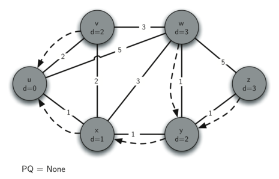
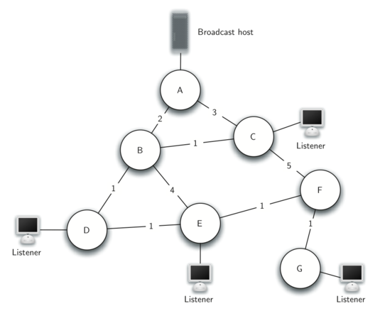

..  Copyright (C)  Brad Miller, David Ranum
    Permission is granted to copy, distribute and/or modify this document
    under the terms of the GNU Free Documentation License, Version 1.3 or 
    any later version published by the Free Software Foundation; with 
    Invariant Sections being Forward, Prefaces, and Contributor List, 
    no Front-Cover Texts, and no Back-Cover Texts.  A copy of the license
    is included in the section entitled "GNU Free Documentation License".

..  shortname:: GraphsShortestPath
..  description:: Using shortest path algorithm.

Shortest Path Problems
----------------------

When you surf the web, send an email, or log in to a laboratory computer
from another location on campus a lot of work is going on behind the
scenes to get the information on your computer transferred to another
computer. The in-depth study of how information flows from one computer
to another over the Internet is the primary topic for a class in
computer networking. However, we will talk about how the Internet works
just enough to understand another very important graph algorithm.

.. _fig_inet:

.. figure:: Figures/Internet.png
   :align: center

   Overview of Connectivity in the Internet     

:ref:`Figure 1 <fig_inet>` shows you a high-level overview of how communication
on the Internet works. When you use your browser to request a web page
from a server, the request must travel over your local area network and
out onto the Internet through a router. The request travels over the
Internet and eventually arrives at a router for the local area network
where the server is located. The web page you requested then travels
back through the same routers to get to your browser. Inside the cloud
labelled “Internet” in :ref:`Figure 1 <fig_inet>` are additional routers. The job
of all of these routers is to work together to get your information from
place to place. You can see there are many routers for yourself if your
computer supports the ``traceroute`` command. The text below shows
the output of the ``traceroute`` command which illustrates that there
are 13 routers between the web server at Luther College and the mail
server at the University of Minnesota.

::

         1  192.203.196.1  
         2  hilda.luther.edu (216.159.75.1)  
         3  ICN-Luther-Ether.icn.state.ia.us (207.165.237.137)
         4  ICN-ISP-1.icn.state.ia.us (209.56.255.1)  
         5  p3-0.hsa1.chi1.bbnplanet.net (4.24.202.13)
         6  ae-1-54.bbr2.Chicago1.Level3.net (4.68.101.97)
         7  so-3-0-0.mpls2.Minneapolis1.Level3.net (64.159.4.214)
         8  ge-3-0.hsa2.Minneapolis1.Level3.net (4.68.112.18) 
         9  p1-0.minnesota.bbnplanet.net (4.24.226.74)
         10  TelecomB-BR-01-V4002.ggnet.umn.edu (192.42.152.37)
         11  TelecomB-BN-01-Vlan-3000.ggnet.umn.edu (128.101.58.1)
         12  TelecomB-CN-01-Vlan-710.ggnet.umn.edu (128.101.80.158)
         13  baldrick.cs.umn.edu (128.101.80.129)(N!)  88.631 ms (N!)
            

         Routers from One Host to the Next over the Internet      

Each router on the Internet is connected to one or more other routers.
So if you run the ``traceroute`` command at different times of the day,
you are likely to see that your information flows through different
routers at different times. This is because there is a cost associated
with each connection between a pair of routers that depends on the
volume of traffic, the time of day, and many other factors. By this time
it will not surprise you to learn that we can represent the network of
routers as a graph with weighted edges.

.. _fig_network:

.. figure:: Figures/routeGraph.png
   :align: center

   Connections and Weights between Routers in the Internet
          

:ref:`Figure 2 <fig_network>` shows a small example of a weighted graph that
represents the interconnection of routers in the Internet. The problem
that we want to solve is to find the path with the smallest total weight
along which to route any given message. This problem should sound
familiar because it is similar to the problem we solved using a breadth
first search, except that here we are concerned with the total weight of
the path rather than the number of hops in the path. It should be noted
that if all the weights are equal, the problem is the same.

Dijkstra’s Algorithm
~~~~~~~~~~~~~~~~~~~~

The algorithm we are going to use to determine the shortest path is
called “Dijkstra’s algorithm.” Dijkstra’s algorithm is an iterative
algorithm that provides us with the shortest path from one particular
starting node to all other nodes in the graph. Again this is similar to
the results of a breadth first search.

To keep track of the total cost from the start node to each destination
we will make use of the ``dist`` instance variable in the Vertex class.
The ``dist`` instance variable will contain the current total weight of
the smallest weight path from the start to the vertex in question. The
algorithm iterates once for every vertex in the graph; however, the
order that we iterate over the vertices is controlled by a priority
queue. The value that is used to determine the order of the objects in
the priority queue is ``dist``. When a vertex is first created ``dist``
is set to a very large number. Theoretically you would set ``dist`` to
infinity, but in practice we just set it to a number that is larger than
any real distance we would have in the problem we are trying to solve.

The code for Dijkstra’s algorithm is shown in
the following listing. When the algorithm finishes the distances are set
correctly as are the predecessor links for each vertex in the graph.

::

    from pythonds.graphs import PriorityQueue, Graph, Vertex
    def dijkstra(aGraph,start):
        pq = PriorityQueue()
        start.setDistance(0)
        pq.buildHeap([(v.getDistance(),v) for v in aGraph])        
        while not pq.isEmpty():
            currentVert = pq.delMin()
            for nextVert in currentVert.getConnections():
                newDist = currentVert.getDistance() \
                        + currentVert.getWeight(nextVert)
                if newDist < nextVert.getDistance():
                    nextVert.setDistance( newDist )
                    nextVert.setPred(currentVert)
                    pq.decreaseKey(nextVert,newDist)

Dijkstra’s algorithm uses a priority queue. You may recall that a
priority queue is based on the heap that we implemented in the Tree Chapter. 
There are a couple of differences between that
simple implementation and the implementation we
use for Dijkstra’s algorithm. First, the ``PriorityQueue`` class stores
tuples of key, value pairs. This is important for Dijkstra’s algorithm
as the key in the priority queue must match the key of the vertex in the
graph. Secondly the value is used for deciding the priority, and thus
the position of the key in the priority queue. In this implementation we
use the distance to the vertex as the priority because as we will see
when we are exploring the next vertex, we always want to explore the
vertex that has the smallest distance. The second difference is the
addition of the ``decreaseKey`` method. As you can see, this method is used when the distance to a vertex that
is already in the queue is reduced, and thus moves that vertex toward
the front of the queue.

Let’s walk through an application of Dijkstra’s algorithm one vertex at
a time using the following sequence of figures as our guide. We begin with the vertex
:math:`u`. The three vertices adjacent to :math:`u` are
:math:`v,w,` and :math:`x`. Since the initial distances to
:math:`v,w,` and :math:`x` are all initialized to ``sys.maxint``,
the new costs to get to them through the start node are all their direct
costs. So we update the costs to each of these three nodes. We also set
the predecessor for each node to :math:`u` and we add each node to the
priority queue. We use the distance as the key for the priority queue.
The state of the algorithm is shown in :ref:`Figure 3 <fig_dija>`.

In the next iteration of the ``while`` loop we examine the vertices that
are adjacent to :math:`x`. The vertex :math:`x` is next because it
has the lowest overall cost and therefore bubbled its way to the
beginning of the priority queue. At :math:`x` we look at its neighbors
:math:`u,v,w` and :math:`y`. For each neighboring vertex we check to
see if the distance to that vertex through :math:`x` is smaller than
the previously known distance. Obviously this is the case for
:math:`y` since its distance was ``sys.maxint``. It is not the case
for :math:`u` or :math:`v` since their distances are 0 and 2
respectively. However, we now learn that the distance to :math:`w` is
smaller if we go through :math:`x` than from :math:`u` directly to
:math:`w`. Since that is the case we update :math:`w` with a new
distance and change the predecessor for :math:`w` from :math:`u` to
:math:`x`. See :ref:`Figure 4 <fig_dijb>` for the state of all the vertices.

The next step is to look at the vertices neighboring :math:`v`. This
step results in no changes to the graph, so we move on to node
:math:`y`. At node :math:`y` we discover that it is cheaper to get
to both :math:`w` and :math:`z`, so we adjust the distances and
predecessor links accordingly. Finally we check nodes :math:`w` and
:math:`z`. However, no additional changes are found and so the
priority queue is empty and Dijkstra’s algorithm exits.

   
.. _fig_dija:

.. figure:: Figures/dijkstraa.png
   :align: center

   Tracing Dijkstra’s Algorithm-3      
   
.. _fig_dijb:

.. figure:: Figures/dijkstrab.png
   :align: center

   Tracing Dijkstra’s Algorithm-4      
   
.. _fig_dijc:

.. figure:: Figures/dijkstrac.png
   :align: center

   Tracing Dijkstra’s Algorithm-5      
   
.. _fig_dijd:

.. figure:: Figures/dijkstrad.png
   :align: center

   Tracing Dijkstra’s Algorithm-6      
   
.. _fig_dije:

.. figure:: Figures/dijkstrae.png
   :align: center

   Tracing Dijkstra’s Algorithm-7      
   
.. _fig_dijf:

   Tracing Dijkstra’s Algorithm-8      

It is important to note that Dijkstra’s algorithm works only when the
weights are all positive. You should convince yourself that if you
introduced a negative weight on one of the edges to the graph that the algorithm would never exit.

We will note that to route messages through the Internet, other
algorithms are used for finding the shortest path. One of the problems
with using Dijkstra’s algorithm on the Internet is that you must have a
complete representation of the graph in order for the algorithm to run.
The implication of this is that every router has a complete map of all
the routers in the Internet. In practice this is not the case and other
variations of the algorithm allow each router to discover the graph as
they go. One such algorithm that you may want to read about is called
the “distance vector” routing algorithm.

Analysis of Dijkstra’s Algorithm
~~~~~~~~~~~~~~~~~~~~~~~~~~~~~~~~

Finally, let us look at the running time of Dijkstra’s algorithm. We
first note that building the priority queue takes :math:`O(V)` time
since we initially add every vertex in the graph to the priority queue.
Once the queue is constructed the ``while`` loop 
is executed once for every vertex since vertices are all added at the
beginning and only removed after that. Within that loop each call to
``delMin``, takes :math:`O(\log V)` time. Taken together that part of
the loop and the calls to delMin take :math:`O(V \log(V))`. The
``for`` loop is executed once for each edge in the
graph, and within the ``for`` loop the call to ``decreaseKey`` takes
time :math:`O(E
\log(V))`. So the combined running time is :math:` O((V+E) \log(V))`.

Prim’s Spanning Tree Algorithm
~~~~~~~~~~~~~~~~~~~~~~~~~~~~~~

For our last graph algorithm let’s consider a problem that online game
designers and Internet radio providers face. The problem is that they
want to efficiently transfer a piece of information to anyone and
everyone who may be listening. This is important in gaming so that all
the players know the very latest position of every other player. This is
important for Internet radio so that all the listeners that are tuned in
are getting all the data they need to reconstruct the song they are
listening to. :ref:`Figure 9 <fig_bcast1>` illustrates the broadcast problem.

.. _fig_bcast1:

   The Broadcast Problem 

There are some brute force solutions to this problem, so let’s look at
them first to help understand the broadcast problem better. This will
also help you appreciate the solution that we will propose when we are
done. To begin, the broadcast host has some information that the
listeners all need to receive. The simplest solution is for the
broadcasting host to keep a list of all of the listeners and send
individual messages to each. In :ref:`Figure 9 <fig_bcast1>` we show a small
network with a broadcaster and some listeners. Using this first
approach, four copies of every message would be sent. Assuming that the
least cost path is used, let’s see how many times each router would
handle the same message.

All messages from the broadcaster go through router A, so A sees all
four copies of every message. Router C sees only one copy of each
message for its listener. However, routers B and D would see three
copies of every message since routers B and D are on the cheapest path
for listeners 1, 2, and 3. When you consider that the broadcast host
must send hundreds of messages each second for a radio broadcast, that
is a lot of extra traffic.

A brute force solution is for the broadcast host to send a single copy
of the broadcast message and let the routers sort things out. In this
case, the easiest solution is a strategy called **uncontrolled
flooding**. The flooding strategy works as follows. Each message starts
with a time to live (``ttl``) value set to some number greater than or
equal to the number of edges between the broadcast host and its most
distant listener. Each router gets a copy of the message and passes the
message on to *all* of its neighboring routers. When the message is
passed on the ``ttl`` is decreased. Each router continues to send copies
of the message to all its neighbors until the ``ttl`` value reaches 0.
It is easy to convince yourself that uncontrolled flooding generates
many more unnecessary messages than our first strategy.

The solution to this problem lies in the construction of a minimum
weight **spanning tree**. Formally we define the minimum spanning tree
:math:`T` for a graph :math:`G = (V,E)` as follows. :math:`T` is
an acyclic subset of :math:`E` that connects all the vertices in
:math:`V`. The sum of the weights of the edges in T is minimized.

:ref:`Figure 10 <fig_mst1>` shows a simplified version of the broadcast graph and
highlights the edges that form a minimum spanning tree for the graph.
Now to solve our broadcast problem, the broadcast host simply sends a
single copy of the broadcast message into the network. Each router
forwards the message to any neighbor that is part of the spanning tree,
excluding the neighbor that just sent it the message. In this example A
forwards the message to B. B forwards the message to D and C. D forwards
the message to E, which forwards it to F, which forwards it to G. No
router sees more than one copy of any message, and all the listeners
that are interested see a copy of the message.

.. _fig_mst1:

.. figure:: Figures/mst1.png
   :align: center

   Minimum Spanning Tree for the Broadcast Graph 

The algorithm we will use to solve this problem is called Prim’s
algorithm. Prim’s algorithm belongs to a family of algorithms called the
“greedy algorithms” because at each step we will choose the cheapest
next step. In this case the cheapest next step is to follow the edge
with the lowest weight. Our last step is to develop Prim’s algorithm.

The basic idea in constructing a spanning tree is as follows:

::

   While :math:`T` is not yet a spanning tree
      Find an edge that is safe to add to the tree
      Add the new edge to :math:`T`

The trick is in the step that directs us to “find an edge that is safe.”
We define a safe edge as any edge that connects a vertex that is in the
spanning tree to a vertex that is not in the spanning tree. This ensures
that the tree will always remain a tree and therefore have no cycles.

The Python code to implement Prim’s algorithm is shown in
the listing below. Prim’s algorithm is similar to Dijkstra’s algorithm
in that they both use a priority queue to select the next vertex to add
to the growing graph.

::

    from pythonds.graphs import PriorityQueue, Graph, Vertex
    def prim(G,start):
        pq = PriorityQueue()
        for v in G:
            v.setDistance(sys.maxsize)
            v.setPred(None)
        start.setDistance(0)
        pq.buildHeap([(v.getDistance(),v) for v in G])
        while not pq.isEmpty():
            currentVert = pq.delMin()
            for nextVert in currentVert.getConnections():
              newCost = currentVert.getWeight(nextVert) \
                      + currentVert.getDistance()
              if v in pq and newCost<nextVert.getDistance():
                  nextVert.setPred(currentVert)
                  nextVert.setDistance(newCost)
                  pq.decreaseKey(nextVert,newCost)

The following sequence of figures shows the algorithm in operation on our sample
tree. We begin with the starting vertex as A. The distances to all the
other vertices are initialized to infinity. Looking at the neighbors of
A we can update distances to two of the additional vertices B and C
because the distances to B and C through A are less than infinite. This
moves B and C to the front of the priority queue. Update the predecessor
links for B and C by setting them to point to A. It is important to note
that we have not formally added B or C to the spanning tree yet. A node
is not considered to be part of the spanning tree until it is removed
from the priority queue.

Since B has the smallest distance we look at B next. Examining B’s
neighbors we see that D and E can be updated. Both D and E get new
distance values and their predecessor links are updated. Moving on to
the next node in the priority queue we find C. The only node C is
adjacent to that is still in the priority queue is F, thus we can update
the distance to F and adjust F’s position in the priority queue.

Now we examine the vertices adjacent to node D. We find that we can
update E and reduce the distance to E from 6 to 4. When we do this we
change the predecessor link on E to point back to D, thus preparing it
to be grafted into the spanning tree but in a different location. The
rest of the algorithm proceeds as you would expect, adding each new node
to the tree.
    
.. _fig_prima:

.. figure:: Figures/prima.png
   :align: center
   
   Tracing Prim’s Algorithm-11

.. _fig_primb:

.. figure:: Figures/primb.png
   :align: center

   Tracing Prim’s Algorithm-12

.. _fig_primc:

.. figure:: Figures/primc.png
   :align: center

   Tracing Prim’s Algorithm-13
   
.. _fig_primd:

   Tracing Prim’s Algorithm-14
   
.. _fig_prime:

.. figure:: Figures/prime.png
   :align: center

   Tracing Prim’s Algorithm-15
   
.. _fig_primf:

   
   Tracing Prim’s Algorithm-16
    
.. _fig_primg:

.. figure:: Figures/primg.png
   :align: center

   Tracing Prim’s Algorithm-17

