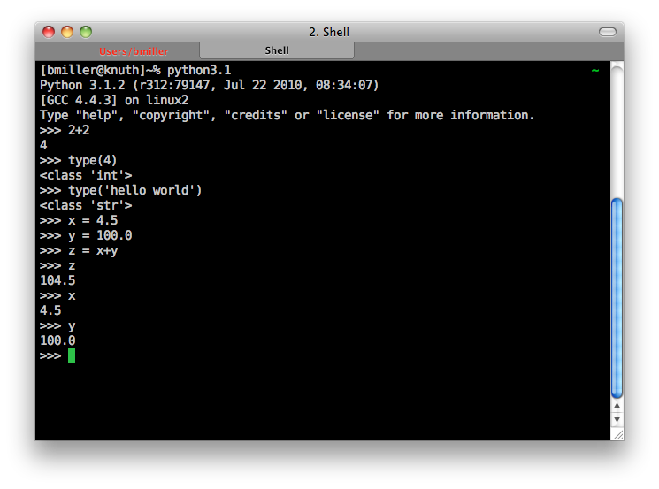

.. This work CC  Brad Miller is released under the Creative Commons
   Attribution-ShareAlike License CC BY-SA as well as the GNU FDL 1.3

Python Beyond the Browser
=========================

Although having Python available for you to use right in the browser is
convenient, there are some limitations, and Python is a real programming
language used for real applications by some very large and impressive
corporations.  In this Advanced Topic we'll show you how to use the Python
shell along with a simple text editor.  In a later advanced topic we will
introduce you to something called an Integrated Development Environment or
IDE that will make life even better for you when working on a larger Python
project.

The Python Shell
----------------

One of the most important ways you can learn computer science is by simply
experimenting or trying things.  Unlike chemistry where you can explode
things and do real damage, in computer science you really can't go wrong by
just experimenting a bit.  In the worst case you might have to reboot your
computer, but its pretty hard to do any long lasting damage.

For those of you used to fancy graphical user interfaces the Python shell
make look a bit primitive, but don't be fooled by the lack of fancy
interface, you can do a lot of powerful stuff in the shell.  On a Mac or with
Linux Python is already installed for you.  There is a short video link at
the end of this topic that explains how to download and install Python on
Windows.  Here is an example of what the shell looks like once you have it
started up.

.. image::  Figures/python_shell.png

To run the Python shell you will first need to start up the Terminal
application, on the Mac you can find this under Utilities in the Applications
folder, on most versions of Linux you can find it under the accessories menu.
Once you have a terminal started, you simply type python and press the return
key.  To shart the shell under windows simply go to the start menu and choose
`Python (command line)` from the menu.

Now that you have the shell started you may wonder what you can do with it?
In the shell you can do anything you would do in a Python program.  Any of
the examples you have seen in this chapter can be typed in directly to the
shell.  Any Python expression can be entered into the shell and you will see
the result printed out for you right underneath.  Here are some examples
using the functions and expressions introduced in this chapter.

Its a good idea to get in the habit of using the shell.  Very often if you
have a question about how something works you can answer the question for
yourself by simply trying it in the shell.  If you need a really extensable
calculator you can simply start up your Python shell and use it to calculate
just about anything.  Soon you'll find yourself writing little Python
snippets for all kinds of things.

Running a Python Program
------------------------

Of course the problem with the Python shell is that you can't save anything,
so you always have to retype whatever you want to do over again.  Its also
difficult to do anything more than a few lines long because if you make a
typo you end up retying everything.  Fortunately there is a solution for that
as well.  Python alows you to write a program, and save it as a text file
with the extension `.py` and then you can run that program right from the
command line.

Here is a simple example of a Python program.

.. sourcecode::  python

    print('Hello World')
    print('2 + 3 = ', 2+3)

Lets assume that you have typed in the lines above in Notepad or TextEdit or
some similar editor, if you already know emacs or vi you are a awesome!  Now
save the file as `testprog1.py` and then head back to the terminal.  Now at
the command line of the terminal type `python testprog1.py` and you will see
the following output

.. sourcecode:: python

    bmiller@chronos> python testprog1.py
    Hello World
    2 + 3 =  5

Anything we do in the following chapters that appears in the editing window
in the web page can be done exactly the same in the terminal just like the
small example above.  This example illustrates one very important difference
between entering expressions in the Python shell, and writing a Python
program.  The Python shell uses what we call a read eval print loop.  That
is, Python *reads* an expression from the command line,
then *evaluates* that expression, and finally *prints* the result.  In a
python program that you run using the Python interpreter,
you have to be explicit about what it is you want to print.  That is why in
the Python program we use the print function on both lines.

Installing Python on Windows
----------------------------

If you are using windows you will need to install Python for yourself.  Here
is a video that explains how to do it.

.. raw:: html

    <iframe width="425" height="349" src="http://www.youtube.com/embed/9EfGpN1Pnsg"
            frameborder="0" allowfullscreen></iframe>

We are assuming that you use Python 3.x, as of this writing the latest
version is Python 3.2.1.  This link will tell you how to update or install
Python on Linux, Mac, or Windows. `Install Python <http://www.diveintopython3
.org/installing-python.html>`_

Glossary
--------

.. glossary::

    terminal
        A terminal is a program now days, but not too many years ago computer
        scientists did their work at a hardware device called a terminal.
        The terminal was connected by wire, or phone line to a computer
        somewhere else.  Yes, the internet has not always been here.

    command line
        The command line is often synonymous with terminal in that when you
        are using the terminal you are also using the command line.  Its
        where you type in commands, and then the computer interprets those
        commands and responds to you with results.

