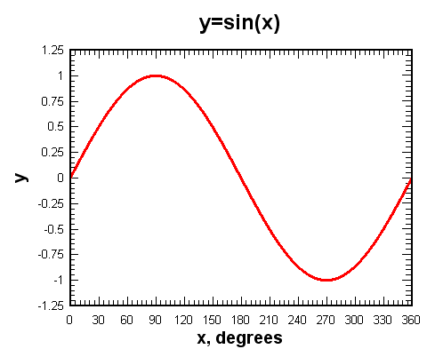
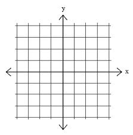

..  Copyright (C) 2011  Brad Miller and David Ranum
    Permission is granted to copy, distribute
    and/or modify this document under the terms of the GNU Free Documentation
    License, Version 1.3 or any later version published by the Free Software
    Foundation; with Invariant Sections being Forward, Prefaces, and
    Contributor List, no Front-Cover Texts, and no Back-Cover Texts.  A copy of
    the license is included in the section entitled "GNU Free Documentation
    License".

Plotting a sine Wave
====================

Have you ever used a graphing calculator?  You can enter an equation, push a few buttons, and the calculator will draw a line.  In this exercise, we will use our turtle to plot a simple math function, the sine wave.

What is the sine function?
--------------------------

The sine function, sometimes called the sine wave, is a smooth, repetitive oscillation that occurs often in many fields including mathematics, physics, and engineering.  A single repetition is shown below.  Note that the x axis is given in degrees.

For this lab, we will use the math library to generate the values that
we need.
To help you understand the sine function, consider the following Python program.  
As you can see, the ``sin`` function from the math library takes a single parameter.  This parameter must be a value
in "radians" (you may remember this from trigonometry class).  Since most of us are used to stating the size of an angle in "degrees", the math module provides a function, ``radians`` that will convert from degrees to radians for us.

.. activecode:: sin1

    import math

    y = math.sin(math.radians(90))
    print(y)

The program above shows us that the sine of 90 degrees is 1.  Note that the figure above agrees with that.  Try a few other values, like 0 degrees, 180 degrees, 38 degrees, and so on.  You should be able to match the results up with the picture shown above.

It might be even more interesting to iterate through a sequence of angles and see the value of the sine function
change.  Try it for angles between 0 and 180 degrees.  What do you notice about the results?

.. activecode:: sin2

    import math

    for angle in range(????):
        y = math.sin(math.radians(angle))
        print(y)

Now try it for some other boundary values, like 270 or 360.

Making the Plot
---------------

In order to plot a smooth line, we will use the turtle's ``goto`` method.  ``goto`` takes two parameters, ``x`` and ``y``,
and moves the turtle to that location.  If the tail is down, a line will be drawn from the previous location to the new
location.

.. sourcecode:: python

    fred.goto(50,60)

Recall that the default turtle screen starts with the turtle in the middle at position (0,0).  You can think of the screen as a piece of graph paper.  The x axis runs horizontally and the y axis runs vertically.  The point where they meet in the middle is (0,0).  Positions to the left of the center have an x value that is negative.  Positions that are below the center have a y value that is negative.

Let's try the ``goto`` method.  Experiment with the method to make sure you understand the coordinate system of the screen.  Try both positive and negative numbers.

.. activecode:: sinlab1

    import math
    import turtle              

    wn = turtle.Screen()      
    wn.bgcolor('lightblue')

    fred = turtle.Turtle()  

    fred.goto(50,60)

    wn.exitonclick()

Now we can put the two previous programs together to complete our plot.  Here is our sequence of steps.

#. Create and set up the turtle and the screen.

#. Iterate the angle from 0 to 360.

	- Generate the sine value for each angle.  

	- Move the turtle to that position (leave a line behind).

Here is a partial program for you to complete.

.. activecode:: sinlab2

	import math
	import turtle

	wn = turtle.Screen()
	wn.bgcolor('lightblue')

	fred = turtle.Turtle()

	#your code here

	wn.exitonclick()

Making the Plot Better
----------------------

You probably think that the program has errors since it does not draw the picture we expect.  Maybe you think it looks a bit like a line?  What do you think the problem is?  Here is a hint...go back and take a look at the values for the sine function as they were calculated and printed in the earlier example.

Now can you see the problem?  The value of ``sin`` always stays between -1 and 1.  This does not give our turtle much room to run.

In order to fix this problem, we need to redesign our "graph paper" so that the coordinates give us more room to plot the values of the sine function.  To do this, we will use a method of the ``Screen`` class called ``setworldcoordinates``.
This method allows us to change the range of values on the x and y coordinate system for our turtle.  Take a look at the documentation for the turtle module to see how to use this method (`Global Module Index <http://docs.python.org/py3k/py-modindex.html>`_).  Once you have an understanding of the parameters required to use the method, choose an appropriate coordinate system and retry your solution.

.. admonition:: Now try this...

	Now that you can plot a sine function, how about trying a different function, such as cosine or log?
	
	