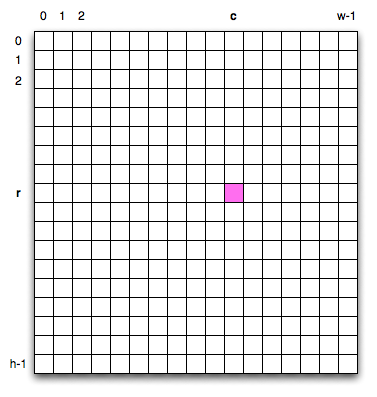

..  Copyright (C)  Brad Miller, David Ranum, Jeffrey Elkner, Peter Wentworth, Allen B. Downey, Chris
    Meyers, and Dario Mitchell.  Permission is granted to copy, distribute
    and/or modify this document under the terms of the GNU Free Documentation
    License, Version 1.3 or any later version published by the Free Software
    Foundation; with Invariant Sections being Forward, Prefaces, and
    Contributor List, no Front-Cover Texts, and no Back-Cover Texts.  A copy of
    the license is included in the section entitled "GNU Free Documentation
    License".
    
..  shortname:: MoreAboutIteration
..  description:: This module has more information about iteration and while loops

Iteration Revisited
===================

.. index:: iteration, assignment, assignment statement, reassignment

.. index::
    single: statement; assignment
   
    
Computers are often used to automate repetitive tasks. Repeating identical or
similar tasks without making errors is something that computers do well and
people do poorly.

Repeated execution of a sequence of statements is called **iteration**.  Because
iteration is so common, Python provides several language features to make it
easier. We've already seen the ``for`` statement in Chapter 3.  This is a very common 
form of iteration in Python. In this chapter
we are also going to look at the ``while`` statement --- another way to have your
program do iteration.

.. admonition:: Scratch Editor

    .. actex:: scratch_7_1

.. index:: for loop

The ``for`` loop revisited
--------------------------

Recall that the ``for`` loop processes each item in a list.  Each item in
turn is (re-)assigned to the loop variable, and the body of the loop is executed.
We saw this example in an earlier chapter.

.. activecode:: ch07_for1

    for f in ["Joe", "Amy", "Brad", "Angelina", "Zuki", "Thandi", "Paris"]:
        invitation = "Hi " + f + ".  Please come to my party on Saturday!"
        print(invitation) 
        

We have also seen iteration paired with the update idea to form the accumulator pattern.  For example, to compute
the sum of the first n integers, we could create a for loop using the ``range`` to produce the numbers 1 thru n.
Using the accumulator pattern, we can start with a running total and on each iteration, add the current value of the loop
variable.  A function to compute this sum is shown below.

.. activecode:: ch07_summation

    def sumTo(aBound):
        theSum = 0
        for aNumber in range(1, aBound+1):
            theSum = theSum + aNumber

        return theSum

    print(sumTo(4))

    print(sumTo(1000))

To review, the variable ``theSum`` is called the accumulator.  It is initialized to zero before we start the loop.  The loop variable, ``aNumber`` will take on the values produced by the ``range(1,aBound+1)`` function call.  Note that this produces all the integers starting from 1 up to the value of ``aBound``.  If we had not added 1 to ``aBound``, the range would have stopped one value short since ``range`` does not include the upper bound.

The assignment statement, ``theSum = theSum + aNumber``, updates ``theSum`` each time thru the loop.  This accumulates the running total.  Finally, we return the value of the accumulator.

.. admonition:: Scratch Editor

    .. actex:: scratch_7_2

**Check your understanding**

.. mchoicemf:: test_question7_2a_1
   :answer_a: True
   :answer_b: False
   :correct: a
   :feedback_a: Although the while loop uses a different syntax, it is just as powerful as a for-loop and often more flexible. 
   :feedback_b: Often a for-loop is more natural and convenient for a task, but that same task can always be expressed using a while loop.

   True or False: You can rewrite any for-loop as a while-loop.
   
.. mchoicemf:: test_question7_2a_2
   :answer_a: n starts at 10 and is incremented by 1 each time through the loop, so it will always be positive
   :answer_b: answer starts at 1 and is incremented by n each time, so it will always be positive
   :answer_c: You cannot compare n to 0 in while loop.  You must compare it to another variable.
   :answer_d: In the while loop body, we must set n False, and this code does not do that.  
   :correct: a
   :feedback_a: The loop will run as long as n is positive.  In this case, we can see that n will never become non-positive. 
   :feedback_b: While it is true that answer will always be positive, answer is not considered in the loop condition.
   :feedback_c: It is perfectly valid to compare n to 0.  Though indirectly, this _is_ what causes the infinite loop.
   :feedback_d: The loop condition must become False for the loop to terminate, but n by itself is not the condition in this case.

   The following code contains an infinite loop.  Which is the best explanation for why the loop does not terminate?
     <pre>
     n = 10
     answer = 1
     while ( n > 0 ):
       answer = answer + n
	   n = n + 1
     print answer
     </pre>

The ``while`` Statement
-----------------------

.. video:: whileloop
   :controls:
   :thumb: ../_static/whileloop.png

   http://knuth.luther.edu/~pythonworks/thinkcsVideos/whileloop.mov
   http://knuth.luther.edu/~pythonworks/thinkcsVideos/whileloop.webm

There is another Python statement that can also be used to build an iteration.  It is called the ``while`` statement.
The ``while`` statement provides a much more general mechanism for iterating.  Similar to the ``if`` statement, it uses 
a boolean expression to control the flow of execution.  The body of while will be repeated as long as the controlling boolean expression evaluates to ``True``.

The following figure shows the flow of control.

.. image:: Figures/while_flow.png

We can use the ``while`` loop to create any type of iteration we wish, including anything that we have previously done with a ``for`` loop.  For example, the program in the previous section could be rewritten using ``while``.  
Instead of relying on the ``range`` function to produce the numbers for our summation, we will need to produce them ourselves.  To to this, we will create a variable called ``aNumber`` and initialize it to 1, the first number in the summation.  Every iteration will add ``aNumber`` to the running total until all the values have been used.
In order to control the iteration, we must create a boolean expression that evaluates to ``True`` as long as we want to keep adding values to our running total.  In this case, as long as ``aNumber`` is less than or equal to the bound, we should keep going.

Here is a new version of the summation program that uses a while statement.

.. activecode:: ch07_while1
    
    def sumTo(aBound):
        """ Return the sum of 1+2+3 ... n """
        
        theSum  = 0
        aNumber = 1
        while aNumber <= aBound:
            theSum = theSum + aNumber
            aNumber = aNumber + 1
        return theSum
        
    print(sumTo(4))

    print(sumTo(1000))

You can almost read the ``while`` statement as if it were in natural language. It means,
while ``aNumber`` is less than or equal to ``aBound``, continue executing the body of the loop. Within
the body, each time, update ``theSum`` using the accumulator pattern and increment ``aNumber``. After the body of the loop, we go back up to the condition of the ``while`` and reevaluate it.  When ``aNumber`` becomes greater than ``aBound``, the condition fails and flow of control continues to the ``return`` statement.  

The same program in codelens will allow you to observe the flow of execution.

.. codelens:: ch07_while2
    
    def sumTo(aBound):
        """ Return the sum of 1+2+3 ... n """
        
        theSum  = 0
        aNumber = 1
        while aNumber <= aBound:
            theSum = theSum + aNumber
            aNumber = aNumber + 1
        return theSum
        
    print(sumTo(4))

.. note:: The names of the variables have been chosen to help readability.  

More formally, here is the flow of execution for a ``while`` statement:

#. Evaluate the condition, yielding ``False`` or ``True``.
#. If the condition is ``False``, exit the ``while`` statement and continue
   execution at the next statement.
#. If the condition is ``True``, execute each of the statements in the body and
   then go back to step 1.

The body consists of all of the statements below the header with the same
indentation.

This type of flow is called a **loop** because the third step loops back around
to the top. Notice that if the condition is ``False`` the first time through the
loop, the statements inside the loop are never executed.

The body of the loop should change the value of one or more variables so that
eventually the condition becomes ``False`` and the loop terminates. Otherwise the
loop will repeat forever. This is called an **infinite loop**. 
An endless
source of amusement for computer scientists is the observation that the
directions on shampoo, lather, rinse, repeat, are an infinite loop.

In the case shown above, we can prove that the loop terminates because we
know that the value of ``n`` is finite, and we can see that the value of ``v``
increments each time through the loop, so eventually it will have to exceed ``n``. In
other cases, it is not so easy to tell.  

.. note::

	Introduction of the while statement causes us to think about the types of iteration we have seen.  The ``for`` statement will always iterate through a sequence of values like the list of names for the party or the list of numbers created by ``range``.  Since we know that it will iterate once for each value in the collection, it is often said that a ``for`` loop creates a
	**definite iteration** because we definitely know how many times we are going to iterate.  On the other
	hand, the ``while`` statement is dependent on a condition that needs to evaluate to ``False`` in order 
	for the loop to terminate.  Since we do not necessarily know when this will happen, it creates what we
	call **indefinite iteration**.  Indefinite iteration simply means that we don't know how many times we will repeat but eventually the condition controlling the iteration will fail and the iteration will stop. (Unless we have an infinite loop which is of course a problem)

What you will notice here is that the ``while`` loop is more work for
you --- the programmer --- than the equivalent ``for`` loop.  When using a ``while``
loop you have to control the loop variable yourself.  You give it an initial value, test
for completion, and then make sure you change something in the body so that the loop
terminates.   
        
So why have two kinds of loop if ``for`` looks easier?  This next example shows an indefinite iteration where
we need the extra power that we get from the ``while`` loop.

.. admonition:: Scratch Editor

    .. actex:: scratch_7_3

**Check your understanding**

.. mchoicemf:: test_question7_2_1
   :answer_a: True
   :answer_b: False
   :correct: a
   :feedback_a: Although the while loop uses a different syntax, it is just as powerful as a for-loop and often more flexible. 
   :feedback_b: Often a for-loop is more natural and convenient for a task, but that same task can always be expressed using a while loop.

   True or False: You can rewrite any for-loop as a while-loop.
   
.. mchoicemf:: test_question7_2_2
   :answer_a: n starts at 10 and is incremented by 1 each time through the loop, so it will always be positive
   :answer_b: answer starts at 1 and is incremented by n each time, so it will always be positive
   :answer_c: You cannot compare n to 0 in while loop.  You must compare it to another variable.
   :answer_d: In the while loop body, we must set n False, and this code does not do that.  
   :correct: a
   :feedback_a: The loop will run as long as n is positive.  In this case, we can see that n will never become non-positive. 
   :feedback_b: While it is true that answer will always be positive, answer is not considered in the loop condition.
   :feedback_c: It is perfectly valid to compare n to 0.  Though indirectly, this is what causes the infinite loop.
   :feedback_d: The loop condition must become False for the loop to terminate, but n by itself is not the condition in this case.

   The following code contains an infinite loop.  Which is the best explanation for why the loop does not terminate?
     <pre>
     n = 10
     answer = 1
     while ( n > 0 ):
       answer = answer + n
	   n = n + 1
     print answer
     </pre>

Randomly Walking Turtles
------------------------

Suppose we want to entertain ourselves by watching a turtle wander around
randomly inside the screen.  When we run the program we want the turtle and
program to behave in the following way:

#. The turtle begins in the center of the screen.
#. Flip a coin. If its heads then turn to the left 90 degrees. If its tails
   then turn to the right 90 degrees.
#. Take 50 steps forward.
#. If the turtle has moved outside the screen then stop, otherwise go back to
   step 2 and repeat.

Notice that we cannot predict how many times the turtle will need to flip the
coin before it wanders out of the screen, so we can't use a for loop in this
case. In fact, although very unlikely, this program might never end,
that is why we call this indefinite iteration.

So based on the problem description above, we can outline a program as follows:

.. sourcecode:: python

    create a window and a turtle

    while the turtle is still in the window:
        generate a random number between 0 and 1
        if the number == 0 (heads):
            turn left
        else:
            turn right
        move the turtle forward 50

Now, probably the only thing that seems a bit confusing to you is the part
about whether or not the turtle is still in the screen.  But this is the nice
thing about programming, we can delay the tough stuff and get *something* in
our program working right away.  The way we are going to do this is to
delegate the work of deciding whether the turtle is still in the screen or
not to a boolean function.  Lets call this boolean function ``isInScreen`` We
can write a very simple version of this boolean function by having
it always return ``True``, or by having it decide randomly,
the point is to have it do something simple so that we can focus on the parts
we already know how to do well and get them working.  Since having it always
return true would not be a good idea we will write our version to decide
randomly.  Lets say that there is a 90% chance the turtle is still in the
window and 10% that the turtle has escaped.

.. activecode:: iter_randwalk1

    import random
    import turtle

    def isInScreen(w,t):
        if random.random() > 0.1:
            return True
        else:
            return False

    t = turtle.Turtle()
    wn = turtle.Screen()

    t.shape('turtle')
    while isInScreen(wn,t):
        coin = random.randrange(0,2)
        if coin == 0:              # heads
            t.left(90)
        else:                      # tails
            t.right(90)

        t.forward(50)

    wn.exitonclick()

Now we have a working program that draws a random walk of our turtle that has
a 90% chance of staying on the screen.  We are in a good position,
because a large part of our program is working and we can focus on the next
bit of work -- deciding whether the turtle is inside the screen boundaries or
not.

We can find out the width and the height of the screen using the
``window_width`` and ``window_height`` methods of the screen object.
However, remember that the turtle starts at position 0,0 in the middle of the
screen.  So we never want the turtle to go farther right than width/2 or
farther left than negative width/2.  We never want the turtle to go further
up than height/2 or further down than negative height/2.  Once we know what
the boundaries are we can use some conditionals to check the turtle position
against the boundaries and return ``False`` if the turtle is outside or
``True`` if the turtle is inside.

Once we have computed our boundaries we can get the current position of the
turtle and then use conditionals to decide.  Here is one implementation:

.. sourcecode:: python

    def isInWindow(w,t):
        leftBound = - wn.window_width()/2
        rightBound = wn.window_width()/2
        topBound = wn.window_height()/2
        bottomBound = -wn.window_height()/2

        turtleX = t.xcor()
        turtleY = t.ycor()

        stillIn = True
        if turtleX > rightBound or turtleX < leftBound:
            stillIn = False
        if turtleY > topBound or turtleY < bottomBound:
            stillIn = False

        return stillIn

There are lots of ways that the conditional could be written.  In this case
we have given ``stillIn`` the default value of ``True`` and use two ``if``
statements
to set the value to ``False``.  You could rewrite this to use nested
conditionals or ``elif`` statements and set ``stillIn`` to ``True`` in an else
clause.

Here is the full version of our random walk program.

.. activecode:: iter_randwalk2

    import random
    import turtle
       
    def isInScreen(w,t):
        leftBound = - w.window_width()/2
        rightBound = w.window_width()/2
        topBound = w.window_height()/2
        bottomBound = -w.window_height()/2

        turtleX = t.xcor()
        turtleY = t.ycor()

        stillIn = True
        if turtleX > rightBound or turtleX < leftBound:
            stillIn = False
        if turtleY > topBound or turtleY < bottomBound:
            stillIn = False

        return stillIn

    t = turtle.Turtle()
    wn = turtle.Screen()

    t.shape('turtle')
    while isInScreen(wn,t):
        coin = random.randrange(0,2)
        if coin == 0:
            t.left(90)
        else:
            t.right(90)

        t.forward(50)

    wn.exitonclick()

We could have written this program without using a boolean function,
You might try to rewrite it using a complex condition on the while statement,
but using a boolean function makes the program much more readable and easier
to understand.  It also gives us another tool to use if this was a
larger program and we needed to have a check for whether the turtle
was still in the screen in another part of the program.  Another advantage is
that if you ever need to write a similar program, you can reuse this function
with confidence the next time you need it.  Breaking up this
program into a couple of parts is another example of functional decomposition.

.. admonition:: Scratch Editor

    .. actex:: scratch_7_4

.. index:: 3n + 1 sequence  

**Check your understanding**

.. mchoicemf:: test_question7_3_1
   :answer_a: a for-loop or a while-loop
   :answer_b: only a for-loop
   :answer_c: only a while-loop
   :correct: a
   :feedback_a: Although you do not know how many iterations you loop will run before the program starts running, once you have chosen your random integer, Python knows exactly how many iterations the loop will run, so either a for-loop or a while-loop will work. 
   :feedback_b: As you learned in section 7.2, a while-loop can always be used for anything a for-loop can be used for.
   :feedback_c: Although you do not know how many iterations you loop will run before the program starts running, once you have chosen your random integer, Python knows exactly how many iterations the loop will run, so this is an example of definite iteration.

   Which type of loop can be used to perform the following iteration: You choose a positive integer at random and then print the numbers from 1 up to and including the selected integer.
   
.. mchoicemf:: test_question7_3_2
   :answer_a: Returns True if the turtle is still on the screen and False if the turtle is no longer on the screen.
   :answer_b: Uses a while loop to move the turtle randomly until it goes off the screen.
   :answer_c: Turns the turtle right or left at random and moves the turtle forward 50.
   :answer_d: Calculates and returns the position of the turtle in the window.
   :correct: a
   :feedback_a: The isInScreen function computes the boolean test of whether the turtle is still in the window.  It makes the condition of the while loop in the main part of the code simpler.
   :feedback_b: The isInScreen function does not contain a while-loop.  That loop is outside the isInScreen function.
   :feedback_c: The isInScreen function does not move the turtle.
   :feedback_d: While the isInScreen function does use the size of the window and position of the turtle, it does not return the turtle position.
   
   In the random walk program in this section, what does the isInScreen function do?
        
The 3n + 1 Sequence
-------------------

As another example of indefinite iteration, let's look at a sequence that has fascinated mathematicians for many years.
The rule  for creating the sequence is to start from
some given ``n``, and to generate
the next term of the sequence from ``n``, either by halving ``n``, 
whenever ``n`` is even, or else by multiplying it by three and adding 1 when it is odd.  The sequence
terminates when ``n`` reaches 1. 

This Python function captures that algorithm.  Try running this program several times supplying different values for n.

.. activecode:: ch07_indef1
    
    def seq3np1(n):
        """ Print the 3n+1 sequence from n, terminating when it reaches 1."""
        while n != 1:
            print(n)
            if n % 2 == 0:        # n is even
                n = n // 2
            else:                 # n is odd
                n = n * 3 + 1
        print(n)                  # the last print is 1

    seq3np1(3)

    
                
The condition for this loop is ``n != 1``.  The loop will continue running until
``n == 1`` (which will make the condition false).

Each time through the loop, the program prints the value of ``n`` and then
checks whether it is even or odd using the remainder operator. If it is even, the value of ``n`` is divided
by 2 using integer division. If it is odd, the value is replaced by ``n * 3 + 1``.  
Try some other examples.
    
Since ``n`` sometimes increases and sometimes decreases, there is no obvious
proof that ``n`` will ever reach 1, or that the program terminates. For some
particular values of ``n``, we can prove termination. For example, if the
starting value is a power of two, then the value of ``n`` will be even each
time through the loop until it reaches 1. 

You might like to have some fun and see if you can find a small starting 
number that needs more than a hundred steps before it terminates. 

.. admonition:: Lab

    * `Experimenting with the 3n+1 Sequence <sequencelab.html>`_ In this guided lab exercise we will try to learn more about this sequence.

Particular values aside, the interesting question is whether we can prove that
this sequence terminates for *all* values of ``n``. So far, no one has been able
to prove it *or* disprove it!   

Think carefully about what would be needed for a proof or disproof of the hypothesis
*"All positive integers will eventually converge to 1"*.  With fast computers we have
been able to test every integer up to very large values, and so far, they all 
eventually end up at 1.  But this doesn't mean that there might not be some
as-yet untested number which does not reduce to 1.   

You'll notice that if you don't stop when you reach one, the sequence gets into
its own loop:  1, 4, 2, 1, 4, 2, 1, 4, and so on.  One possibility is that there might
be other cycles that we just haven't found.  

.. admonition:: Choosing between ``for`` and ``while``

   Use a ``for`` loop if you know the maximum number of times that you'll
   need to execute the body.  For example, if you're traversing a list of elements,
   or can formulate a suitable call to ``range``, then choose the ``for`` loop.

   So any problem like "iterate this weather model run for 1000 cycles", or "search this
   list of words", "check all integers up to 10000 to see which are prime" suggest that a ``for`` loop is best.

   By contrast, if you are required to repeat some computation until some condition is 
   met, as we did in this 3n + 1 problem, you'll need a ``while`` loop. 

   As we noted before, the first case is called **definite iteration** --- we have some definite bounds for 
   what is needed.   The latter case is called **indefinite iteration** --- we are not sure
   how many iterations we'll need --- we cannot even establish an upper bound!    

.. There are also some great visualization tools becoming available to help you 
.. trace and understand small fragments of Python code.  The one we recommend is at 
.. http://netserv.ict.ru.ac.za/python3_viz 

.. admonition:: Scratch Editor

    .. actex:: scratch_7_5

.. index::
    single: Newton's method

**Check your understanding**

.. mchoicemf:: test_question7_4_1
   :answer_a: Yes.
   :answer_b: No.
   :answer_c: No one knows.
   :correct: c
   :feedback_a: The 3n+1 sequence has not been proven to terminate for all values of n.
   :feedback_b: It has not been disproven that the 3n+1 sequence will terminate for all values of n.  In other words, there might be some value for n such that this sequence does not terminate. We just have not found it yet.
   :feedback_c: That this sequence terminates for all values of n has not been proven or disproven so no one knows whether the while loop will always terminate or not.

   Consider the code that prints the 3n+1 sequence in ActiveCode box 6.  Will the while loop in this code always terminate for any value of n?      

Newton's Method
---------------

Loops are often used in programs that compute numerical results by starting
with an approximate answer and iteratively improving it.

For example, one way of computing square roots is Newton's method.  Suppose
that you want to know the square root of ``n``. If you start with almost any
approximation, you can compute a better approximation with the following
formula:

.. sourcecode:: python
    
    better =  1/2 * (approx + n/approx)
    
Execute this algorithm a few times using your calculator.  Can you
see why each iteration brings your estimate a little closer?  One of the amazing
properties of this particular algorithm is how quickly it converges to an accurate
answer.    

The following implementation of Newton's method requires two parameters.  The first is the
value whose square root will be approximated.  The second is the number of times to iterate the
calculation yielding a better result.

.. activecode:: chp07_newtonsdef
    
    def newtonSqrt(n, howmany):
        approx = 0.5 * n
        for i in range(howmany):
            betterapprox = 0.5 * (approx + n/approx)
            approx = betterapprox
        return betterapprox

    print(newtonSqrt(10,3))
    print(newtonSqrt(10,5))
    print(newtonSqrt(10,10))

You may have noticed that the second and third calls to ``newtonSqrt`` in the previous example both returned the same value for the square root of 10.  Using 10 iterations instead of 5 did not improve the the value.  In general, Newton's algorithm will eventually reach a point where the new approximation is no better than the previous.  At that point, we could simply stop.
In other words, by repeatedly applying this formula until the better approximation gets close
enough to the previous one, we can write a function for computing the square root that uses the number of iterations necessary and no more.  

This implementation, shown in codelens,
uses a ``while`` condition to execute until the approximation is no longer changing.  Each time thru the loop we compute a "better" approximation using the formula described earlier.  As long as the "better" is different, we try again.  Step thru the program and watch the approximations get closer and closer.

.. codelens:: chp07_newtonswhile
    
    def newtonSqrt(n):
        approx = 0.5 * n
        better = 0.5 * (approx + n/approx)
        while  better !=  approx:
            approx = better
            better = 0.5 * (approx + n/approx)
        return approx

    print(newtonSqrt(10))

.. note::

	The ``while`` statement shown above uses comparison of two floating point numbers in the condition.  Since floating point numbers are themselves approximation of real numbers in mathematics, it is often
	better to compare for a result that is within some small threshold of the value you are looking for.

.. index:: algorithm 

.. admonition:: Scratch Editor

    .. actex:: scratch_7_6

Algorithms Revisited
--------------------

Newton's method is an example of an **algorithm**: it is a mechanical process
for solving a category of problems (in this case, computing square roots).

It is not easy to define an algorithm. It might help to start with something
that is not an algorithm. When you learned to multiply single-digit numbers,
you probably memorized the multiplication table.  In effect, you memorized 100
specific solutions. That kind of knowledge is not algorithmic.

But if you were lazy, you probably cheated by learning a few tricks.  For
example, to find the product of n and 9, you can write n - 1 as the first digit
and 10 - n as the second digit. This trick is a general solution for
multiplying any single-digit number by 9. That's an algorithm!

Similarly, the techniques you learned for addition with carrying, subtraction
with borrowing, and long division are all algorithms. One of the
characteristics of algorithms is that they do not require any intelligence to
carry out. They are mechanical processes in which each step follows from the
last according to a simple set of rules.

On the other hand, understanding that hard problems can be solved by step-by-step
algorithmic processess is one of the major simplifying breakthroughs that has 
had enormous benefits.  So while the execution of the algorithm
may be boring and may require no intelligence, algorithmic or computational 
thinking is having a vast impact.  It is the process of designing algorithms that is interesting,
intellectually challenging, and a central part of what we call programming.

Some of the things that people do naturally, without difficulty or conscious
thought, are the hardest to express algorithmically.  Understanding natural
language is a good example. We all do it, but so far no one has been able to
explain *how* we do it, at least not in the form of a step-by-step mechanical 
algorithm.

.. index:: table, logarithm, Intel, Pentium, escape sequence, tab, newline,
           cursor

.. admonition:: Scratch Editor

    .. actex:: scratch_7_7

Simple Tables
-------------

One of the things loops are good for is generating tabular data.  Before
computers were readily available, people had to calculate logarithms, sines and
cosines, and other mathematical functions by hand. To make that easier,
mathematics books contained long tables listing the values of these functions.
Creating the tables was slow and boring, and they tended to be full of errors.

When computers appeared on the scene, one of the initial reactions was, *"This is
great! We can use the computers to generate the tables, so there will be no
errors."* That turned out to be true (mostly) but shortsighted. Soon thereafter,
computers and calculators were so pervasive that the tables became obsolete.

Well, almost. For some operations, computers use tables of values to get an
approximate answer and then perform computations to improve the approximation.
In some cases, there have been errors in the underlying tables, most famously
in the table the Intel Pentium processor chip used to perform floating-point division.

Although a power of 2 table is not as useful as it once was, it still makes a good
example of iteration. The following program outputs a sequence of values in the
left column and 2 raised to the power of that value in the right column:

.. activecode:: ch07_table1

    print("n",'\t',"2**n")     #table column headings
    print("---",'\t',"-----")   
 
    for x in range(13):        # generate values for columns
        print(x, '\t', 2**x)

The string ``'\t'`` represents a **tab character**. The backslash character in
``'\t'`` indicates the beginning of an **escape sequence**.  Escape sequences
are used to represent invisible characters like tabs and newlines. The sequence
``\n`` represents a **newline**.

An escape sequence can appear anywhere in a string.  In this example, the tab
escape sequence is the only thing in the string. How do you think you represent
a backslash in a string?

As characters and strings are displayed on the screen, an invisible marker
called the **cursor** keeps track of where the next character will go. After a
``print`` function, the cursor normally goes to the beginning of the next
line.

The tab character shifts the cursor to the right until it reaches one of the
tab stops. Tabs are useful for making columns of text line up, as in the output
of the previous program.
Because of the tab characters between the columns, the position of the second
column does not depend on the number of digits in the first column.

.. admonition:: Scratch Editor

    .. actex:: scratch_7_8

.. index::
    single: local variable
    single: variable; local

**Check your understanding**

.. mchoicemf:: test_question7_7_1
  :answer_a: A tab will line up items in a second column, regardless of how many characters were in the first column, while spaces will not.
  :answer_b: There is no difference
  :answer_c: A tab is wider than a sequence of spaces
  :answer_d: You must use tabs for creating tables.  You cannot use spaces.
  :correct: a
  :feedback_a: Assuming the size of the first column is less than the size of the tab width.
  :feedback_b: Tabs and spaces will sometimes make output appear visually different.
  :feedback_c: A tab has a pre-defined width that is equal to a given number of spaces.
  :feedback_d: You may use spaces to create tables.  The columns might look jagged, or they might not, depending on the width of the items in each column.
  
  What is the difference between a tab (\t) and a sequence of spaces?

2-Dimensional Iteration: Image Processing
-----------------------------------------

Two dimensional tables have both rows and columns.  You have probably seen many tables like this if you have used a
spreadsheet program.  Another object that is organized in rows and columns is a digital image.  In this section we will
explore how iteration allows us to manipulate these images.

A **digital image** is a finite collection of small, discrete picture elements called **pixels**.  These pixels are organized in a two-dimensional grid.  Each pixel represents the smallest amount of picture information that is
available.  Sometimes these pixels appear as small "dots".

Each image (grid of pixels) has its own width and its own height.  The width is the number of columns and the height is the number of rows.  We can name the pixels in the grid by using the column number and row number.  However, it is very important to remember
that computer scientists like to start counting with 0!  This means that if there are 20 rows, they will be named 0,1,2, and so on thru 19.  This will be very useful later when we iterate using range.

In the figure below, the pixel of interest is found at column **c** and row **r**.

The RGB Color Model
^^^^^^^^^^^^^^^^^^^

Each pixel of the image will represent a single color.  The specific color depends on a formula that mixes various amounts
of three basic colors: red, green, and blue.  This technique for creating color is known as the **RGB Color Model**.
The amount of each color, sometimes called the **intensity** of the color, allows us to have very fine control over the
resulting color.

The minimum intensity value for a basic color is 0.  For example if the red intensity is 0, then there is no red in the pixel.  The maximum
intensity is 255.  This means that there are actually 256 different amounts of intensity for each basic color.  Since there
are three basic colors, that means that you can create 256\ :sup:`3` distinct colors using the RGB Color Model.

Here are the red, green and blue intensities for some common colors.  Note that "Black" is represented by a pixel having
no basic color.  On the other hand, "White" has maximum values for all three basic color components.

	=======  =======  =======  =======
	Color    Red      Green    Blue
	=======  =======  =======  =======
	Red      255      0        0
	Green    0        255      0
	Blue     0        0        255
	White    255      255      255
	Black    0        0        0
	Yellow   255      255      0
	Magenta  255      0        255
	=======  =======  =======  =======

In order to manipulate an image, we need to be able to access individual pixels.  This capability is provided by
a module called **image**.  The image module defines two classes: ``Image`` and ``Pixel``.

Each Pixel object has three attributes: the red intensity, the green intensity, and the blue intensity.  A pixel provides three methods
that allow us to ask for the intensity values.  They are called ``getRed``, ``getGreen``, and ``getBlue``.  In addition, we can ask a
pixel to change an intensity value using its ``setRed``, ``setGreen``, and ``setBlue`` methods. 

    ============  ================            ===============================================
    Method Name   Example                     Explanation
    ============  ================            ===============================================
    Pixel(r,g,b)  Pixel(20,100,50)            Create a new pixel with 20 red, 100 green, and 50 blue.
    getRed()      r = p.getRed()              Return the red component intensity.
    getGreen()    r = p.getGreen()            Return the green component intensity.
    getBlue()     r = p.getBlue()             Return the blue component intensity.
    setRed()      p.setRed(100)               Set the red component intensity to 100.
    setGreen()    p.setGreen(45)              Set the green component intensity to 45.
    setBlue()     p.setBlue(156)              Set the blue component intensity to 156.
    ============  ================            ===============================================

In the example below, we first create a pixel with 45 units of red, 76 units of green, and 200 units of blue.
We then print the current amount of red, change the amount of red, and finally, set the amount of blue to be
the same as the current amount of green.

.. activecode::  pixelex1a
    
    import image

    p = image.Pixel(45,76,200)
    print(p.getRed())
    p.setRed(66)
    print(p.getRed())
    p.setBlue(p.getGreen())
    print(p.getGreen(), p.getBlue())

**Check your understanding**

.. mchoicemf:: test_question7_8_1_1
   :answer_a: Dark red
   :answer_b: Light red
   :answer_c: Dark green
   :answer_d: Light green
   :correct: a
   :feedback_a: Because all three values are close to 0, the color will be dark.  But because the red value is higher than the other two, the color will appear red.
   :feedback_b: The closer the values are to 0, the darker the color will appear.
   :feedback_c: The first value in RGB is the red value.  The second is the green.  This color has no green in it.
   :feedback_d: The first value in RGB is the red value.  The second is the green.  This color has no green in it.
  
   If you have a pixel whose RGB value is (20, 0, 0), what color will this pixel appear to be?

Image Objects
^^^^^^^^^^^^^

To access the pixels in a real image, we need to first create an ``Image`` object.  Image objects can be created in two
ways.  First, an Image object can be made from the
files that store digital images.  The image object has an attribute corresponding to the width, the height, and the
collection of pixels in the image.  

It is also possible to create an Image object that is "empty".  An ``EmptyImage`` has a width and a height.  However, the
pixel collection consists of only "White" pixels.

We can ask an image object to return its size using the ``getWidth`` and ``getHeight`` methods.  We can also get a pixel from a particular location in the image using ``getPixel`` and change the pixel at
a particular location using ``setPixel``. 

The Image class is shown below.  Note that the first two entries show how to create image objects.  The parameters are 
different depending on whether you are using an image file or creating an empty image.

    =================== =============================== ==================================================
    Method Name         Example                         Explanation
    =================== =============================== ==================================================
    Image(filename)     img = image.Image("cy.png")     Create an Image object from the file cy.png.
    EmptyImage()        img = image.EmptyImage(100,200) Create an Image object that has all "White" pixels
    getWidth()          w = img.getWidth()              Return the width of the image in pixels.
    getHeight()         h = img.getHeight()             Return the height of the image in pixels.
    getPixel(col,row)   p = img.getPixel(35,86)         Return the pixel at column 35, row 86d.
    setPixel(col,row,p) img.setPixel(100,50,mp)         Set the pixel at column 100, row 50 to be mp.
    =================== =============================== ==================================================

Consider the image shown below.  Assume that the image is stored in a file called "luther.jpg".  Line 2 opens the
file and uses the contents to create an image object that is referred to by ``img``.  Once we have an image object,
we can use the methods described above to access information about the image or to get a specific pixel and check
on its basic color intensities.

.. raw:: html

    

.. activecode::  pixelex1

    import image
    img = image.Image("luther.jpg")

    print(img.getWidth())
    print(img.getHeight())

    p = img.getPixel(45,55)
    print(p.getRed(), p.getGreen(), p.getBlue())

When you run the program you can see that the image has a width of 400 pixels and a height of 244 pixels.  Also, the
pixel at column 45, row 55, has RGB values of 165, 161, and 158.  Try a few other pixel locations by changing the ``getPixel`` arguments and rerunning the program. 

**Check your understanding**

.. mchoicemf:: test_question7_8_2_1
   :answer_a: 149 132 122
   :answer_b: 183 179 170
   :answer_c: 165 161 158
   :answer_d: 201 104 115
   :correct: a
   :feedback_a: Yes, the RGB values are 149 132 122 at row 100 and column 30.
   :feedback_b: These are the values for the pixel at row 30, column 100.  Get the values for row 100 and column 30 with p = img.getPixel(100,30).
   :feedback_c: These are the values from the original example (row 45, column 55). Get the values for row 100 and column 30 with p = img.getPixel(100,30).  
   :feedback_d: These are simply made-up values that may or may not appear in the image.  Get the values for row 100 and column 30 with p = img.getPixel(100,30).
  
   In the example in ActiveCode box 10, what are the RGB values of the pixel at row 100, column 30?
   

Image Processing and Nested Iteration
^^^^^^^^^^^^^^^^^^^^^^^^^^^^^^^^^^^^^

**Image processing** refers to the ability to manipulate the individual pixels in a digital image.  In order to process
all of the pixels, we need to be able to systematically visit all of the rows and columns in the image.  The best way
to do this is to use **nested iteration**.  

Nested iteration simply means that we will place one iteration construct inside of another.  We will call these two
iterations the **outer iteration** and the **inner iteration**.  
To see how this works, consider the simple iteration below.

.. sourcecode:: python

    for i in range(5):
       print(i)

We have seen this enough times to know that the value of ``i`` will be 0, then 1, then 2, and so on up to 4.
The ``print`` will be performed once for each pass.
However, the body of the loop can contain any statements including another iteration (another ``for`` statement).  For example,

.. sourcecode:: python

    for i in range(5):
       for j in range(3):
            print(i,j)

The ``for i`` iteration is the `outer iteration` and the ``for j`` iteration is the `inner iteration`.  Each pass thru
the outer iteration will result in the complete processing of the inner iteration from beginning to end.  This means that
the output from this nested iteration will show that for each value of ``i``, all values of ``j`` will occur.

Here is the same example in activecode.  Try it.  Note that the value of ``i`` stays the same while the value of ``j`` changes.  The inner iteration, in effect, is moving faster than the outer iteration.

.. activecode:: nested1

    for i in range(5):
       for j in range(3):
            print(i,j)

Another way to see this in more detail is to examine the behavior with codelens.  Step thru the iterations to see the
flow of control as it occurs with the nested iteration.  Again, for every value of ``i``, all of the values of ``j`` will occur.  You can see that the inner iteration completes before going on to the next pass of the outer iteration.

.. codelens:: nested2

    for i in range(5):
       for j in range(3):
            print(i,j)

Our goal with image processing is to visit each pixel.  We will use an iteration to process each `row`.  Within that iteration, we will use a nested iteration to process each `column`.  The result is a nested iteration, similar to the one
seen above, where the outer ``for`` loop processes the rows, from 0 up to but not including the height of the image.
The inner ``for`` loop will process each column of a row, again from 0 up to but not including the width of the image.

The resulting code will look like the following.  We are now free to do anything we wish to each pixel in the image.

.. sourcecode:: python

	for col in range(img.getWidth()):
	    for row in range(img.getHeight()):
	        #do something with the pixel at position (col,row)
	
One of the easiest image processing algorithms will create what is known as a **negative** image.  A negative image simply means that
each pixel will be the `opposite` of what it was originally.  But what does opposite mean?

In the RGB color model, we can consider the opposite of the red component as the difference between the original red
and 255.  For example, if the original red component was 50, then the opposite, or negative red value would be
``255-50`` or 205.  In other words, pixels with alot of red will have negatives with little red and pixels with little red will have negatives with alot.  We do the same for the blue and green as well.

The program below implements this algorithm using the previous image.  Run it to see the resulting negative image.  Note that there is alot of processing taking place and this may take a few seconds to complete.  In addition, here are two other images that you can use.  Change the name of the file in the ``image.Image()`` call to see how these images look as negatives.  Also, note that there is an ``exitonclick`` method call at the very end which will close the window when you click on it.  This will allow you to "clear the screen" before drawing the next negative.

.. raw:: html

    
    cy.png

.. raw:: html

    
    goldygopher.png

.. activecode::  acimg_1

    import image

    img = image.Image("luther.jpg")
    newimg = image.EmptyImage(img.getWidth(),img.getHeight())
    win = image.ImageWin()

    for col in range(img.getWidth()):
        for row in range(img.getHeight()):
           p = img.getPixel(col,row)    

           newred = 255-p.getRed()    
           newgreen = 255-p.getGreen()
           newblue = 255-p.getBlue()

           newpixel = image.Pixel(newred,newgreen,newblue)

           newimg.setPixel(col,row,newpixel)

    newimg.draw(win)
    win.exitonclick()

Lets take a closer look at the code.  After importing the image module, we create two image objects.  The first, ``img``, represents a typical digital photo.  The second, ``newimg``, is an empty image that will be "filled in" as we process the original pixel by pixel.  Note that the width and height of the empty image is set to be the same as the width and height of the original.

Lines 8 and 9 create the nested iteration that we discussed earlier.  This allows us to process each pixel in the image.
Line 10 gets an individual pixel.

Lines 12-14 create the negative intensity values by extracting the original intensity from the pixel and subtracting it
from 255.  Once we have the ``newred``, ``newgreen``, and ``newblue`` values, we can create a new pixel (Line 16).

Finally, we need to insert the new pixel into the empty image in the same location as the original pixel that it came from in the digital photo.

.. admonition:: Other pixel manipulation

	There are a number of different image processing algorithms that follow the same pattern as shown above.  Namely, take the original pixel, extract the red, green, and blue intensities, and then create a new pixel from them.  The new pixel is inserted into an empty image at the same location as the original.

	For example, you can create a **gray scale** pixel by averaging the red, green and blue intensities and then using that value for all intensities.

	From the gray scale you can create **black white** by setting a threshold and selecting to either insert a white pixel or a black pixel into the empty image.

	You can also do some complex arithmetic and create interesting effects, such as 
	`Sepia Tone <http://en.wikipedia.org/wiki/Sepia_tone#Sepia_toning>`_

.. admonition:: Scratch Editor

    .. actex:: scratch_7_9

You have just passed a very important point in your study of Python programming.  Even though there is much more that we will do, you have learned all of the basic building blocks that are necessary to solve many interesting problems.  From and algorithm point of view, you can now implement selection and iteration.  You can also solve problems by breaking them down into smaller parts, writing functions for those parts, and then calling the functions to complete the implementation.
What remains is to focus on ways that we can better represent our problems in terms of the data that we manipulate.  We will now turn our attention to studying the main data collections provided by Python.

**Check your understanding**

.. mchoicemf:: test_question7_8_3_1
   :answer_a: Output a
   :answer_b: Output b
   :answer_c: Output c
   :answer_d: Output d
   :correct: a
   :feedback_a: i will start with a value of 0 and then j will iterate from 0 to 1.  Next, i will be 1 and j will iterate from 0 to 1.  Finally, i will be 2 and j will iterate from 0 to 1.
   :feedback_b: The inner for-loop controls the second digit (j).  The inner for-loop must complete before the outer for-loop advances.
   :feedback_c: The inner for-loop controls the second digit (j).  Notice that the inner for-loop is over the list [0, 1].
   :feedback_d: The outer for-loop runs 3 times (0, 1, 2) and the inner for-loop runs twice for each time the outer for-loop runs, so this code prints exactly 6 lines.
  
   What will the following nested for-loop print?  (Note, if you are having trouble with this question, review CodeLens 3).
    <pre>
    for i in range(3):
      for j in range(2):
        print(i,j)  
    </pre>
    a.
    <pre>
    0	0
    0	1
    1	0
    1	1
    2	0
    2	1
    </pre>
    b.
    <pre>
    0   0
    1   0
    2   0
    0   1
    1   1
    2   1
    </pre>
    c. 
    <pre>
    0   0
    0   1 
    0   2
    1   0 
    1   1
    1   2
    </pre>
    d.
    <pre>
    0   1
    0   1
    0   1 
    </pre>

.. mchoicemf:: test_question7_8_3_2
   :answer_a: It would look like a red-washed version of the bell image
   :answer_b: It would be a solid red rectangle the same size as the original image
   :answer_c: It would look the same as the original image
   :answer_d: It would look the same as the negative image in the example code
   :correct: a
   :feedback_a: Because we are removing the green and the blue values, but keeping the variation of the red the same, you will get the same image, but it will look like it has been bathed in red.
   :feedback_b: Because the red value varies from pixel to pixel, this will not look like a solid red rectangle.  For it to look like a solid red rectangle each pixel would have to have exactly the same red value.
   :feedback_c: If you remove the blue and green values from the pixels, the image will look different, even though there does not appear to be any blue or green in the original image (remember that other colors are made of combinations of red, green and blue).
   :feedback_d: Because we have changed the value of the pixels from what they were in the original ActiveCode box code, the image will not be the same.
  
   What would the image produced from ActiveCode box 12 look like if you replaced the lines:
   <pre>
   newred = 255-p.getRed()
   newgreen = 255-p.getGreen()
   newblue = 255-p.getBlue()
   </pre>
   with the lines:
   <pre>
   newred = p.getRed()
   newgreen = 0
   newblue = 0
   </pre>

Glossary
--------

.. glossary::

    algorithm
        A step-by-step process for solving a category of problems.

    body
        The statements inside a loop.
        

    counter
        A variable used to count something, usually initialized to zero and
        incremented in the body of a loop.

    cursor
        An invisible marker that keeps track of where the next character will
        be printed.

    definite iteration
        A loop where we have an upper bound on the number of times the 
        body will be executed.  Definite iteration is usually best coded
        as a ``for`` loop.    
        

    escape sequence
        An escape character, \\, followed by one or more printable characters
        used to designate a nonprintable character.

    generalize
        To replace something unnecessarily specific (like a constant value)
        with something appropriately general (like a variable or parameter).
        Generalization makes code more versatile, more likely to be reused, and
        sometimes even easier to write.

    infinite loop
        A loop in which the terminating condition is never satisfied.

    indefinite iteration
        A loop where we just need to keep going until some condition is met.
        A ``while`` statement is used for this case.      
        

    iteration
        Repeated execution of a set of programming statements.

    loop
        A statement or group of statements that execute repeatedly until a
        terminating condition is satisfied.

    loop variable
        A variable used as part of the terminating condition of a loop.
     

    
    nested loop
        A loop inside the body of another loop.
    
    newline
        A special character that causes the cursor to move to the beginning of
        the next line.
        
        
    reassignment
        Making more than one assignment to the same variable during the
        execution of a program.
    

     
    tab
        A special character that causes the cursor to move to the next tab stop
        on the current line.
        

        
Exercises
---------

This chapter showed us how to sum a list of items, 
and how to count items.  The counting example also had an ``if`` statement
that let us only count some selected items.  In the previous
chapter we also showed a function ``find_first_2_letter_word`` that allowed
us an "early exit" from inside a loop by using ``return`` when some condition occurred.  
We now also have ``break`` to exit a loop (but not the enclosing function, and 
``continue`` to abandon the current iteration of the loop without ending the loop.

Composition of list traversal, summing, counting, testing conditions
and early exit is a rich collection of building blocks that can be combined
in powerful ways to create many functions that are all slightly different.  

The first six questions are typical functions you should be able to write using only
these building blocks.
   

  
#. Add a print function to Newton's ``sqrt`` function that
   prints out ``better`` each time it is calculated. Call your modified
   function with 25 as an argument and record the results.

    .. actex:: ex_7_7

   
#. Write a function ``print_triangular_numbers(n)`` that prints out the first
   n triangular numbers. A call to ``print_triangular_numbers(5)`` would
   produce the following output::
    
       1       1
       2       3
       3       6
       4       10
       5       15

   (*hint: use a web search to find out what a triangular number is.*)

   .. actex:: ex_7_8

   
#. Write a function, ``is_prime``, which takes a single integer argument
   and returns ``True`` when the argument is a *prime number* and ``False``
   otherwise.
   
    .. actex:: ex_7_9

      
#. Write a function that will return the number of digits in an integer.

    .. actex:: ex_7_10

#. Write a function ``sum_of_squares(xs)`` that computes the sum
   of the squares of the numbers in the list ``xs``.  For example,
   ``sum_of_squares([2, 3, 4])`` should return 4+9+16 which is 29:

    .. actex:: ex_7_11

#. Modify the the Random turtle walk program so that the turtle turns around
   when it hits the wall and goes the other direction.  This bouncing off the
   walls should continue until the turtle has hit the wall 4 times.

    .. actex:: ex_7_12

#. Modify the previous program so that you have two turtles each with a
   random starting location.  Keep the turtles moving and bouncing off the
   walls until they collide with each other.

    .. actex:: ex_7_13

#. Modify the previous program so that rather than a left or right turn the
   angle of the turn is determined randomly at each step.  When the turtle
   hits the wall you must calculate the correct angle for the bounce.

    .. actex:: ex_7_14

#. Write a function to remove all the red from an image.

    .. actex:: ex_7_15

#. Write a function to convert the image to grayscale.

    .. actex:: ex_7_16

#. Write a function to convert an image to black and white.

    .. actex:: ex_7_17

#. Sepia Tone images are those brownish colored images that may remind you of
   times past.  The formula for creating a sepia tone is as follows:

   .. sourcecode:: python
   
        newR = (R  0.393 + G  0.769 + B  0.189)
        newG = (R  0.349 + G  0.686 + B  0.168)
        newB = (R  0.272 + G  0.534 + B  0.131)

   Write a function to convert an image to sepia tone. *Hint:*
   Remember that rgb values must be integers between 0 and 255.

    .. actex:: ex_7_18

#. Write a function to uniformly shrink or enlarge an image.  Your function
   should take an image along with a scaling factor.  To shrink the image the
   scale factor should be between 0 and 1 to enlarge the image the scaling
   factor should be greater than 1.

    .. actex:: ex_7_19

#. Write a function to rotate an image.  Your function should take an image
   object along with the number of degrees to rotate.  The rotational degrees
   can be positive or negative, and should be multiples of 90.

    .. actex:: ex_7_20

#. After you have scaled an image too much it looks blocky.  One way of
   reducing the blockiness of the image is to replace each pixel with the
   average values of the pixels around it.  This has the effect of smoothing
   out the changes in color.  Write a function that takes an image as a
   parameter and smooths the image.  Your function should return a new image
   that is the same as the old but smoothed.

    .. actex:: ex_7_21

#. When you scan in images using a scanner they may have lots of noise due to
   dust particles on the image itself or the scanner itself,
   or the images may even be damaged.  One way of eliminating this noise is
   to replace each pixel by the median value of the pixels surrounding it.

    .. actex:: ex_7_22

#. Research the Sobel edge detection algorithm and implement it.

    .. actex:: ex_7_23

.. toctree::
    :hidden:

    ../Labs/sequencelab

