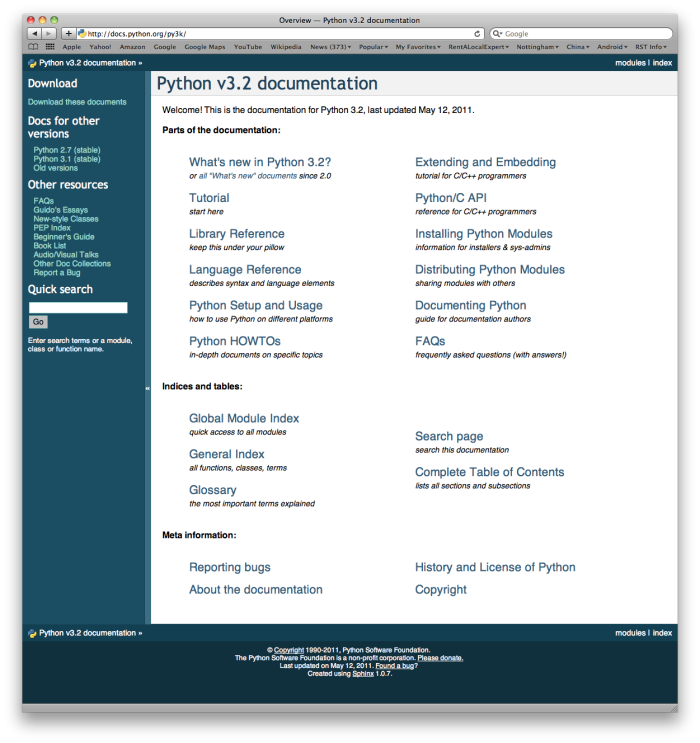

..  Copyright (C)  Brad Miller, David Ranum, Jeffrey Elkner, Peter Wentworth, Allen B. Downey, Chris
    Meyers, and Dario Mitchell.  Permission is granted to copy, distribute
    and/or modify this document under the terms of the GNU Free Documentation
    License, Version 1.3 or any later version published by the Free Software
    Foundation; with Invariant Sections being Forward, Prefaces, and
    Contributor List, no Front-Cover Texts, and no Back-Cover Texts.  A copy of
    the license is included in the section entitled "GNU Free Documentation
    License".
    
..  shortname:: PythonModules
..  description:: What is a module and how do we use them (math, random)
 
Modules and Getting Help
========================

Modules
-------

.. video:: inputvid
    :controls:
    :thumb: ../_static/modules.png

    http://knuth.luther.edu/~pythonworks/thinkcsVideos/modules.mov
    http://knuth.luther.edu/~pythonworks/thinkcsVideos/modules.webm

A **module** is a file containing Python definitions and statements intended
for use in other Python programs. There are many Python modules that come with
Python as part of the **standard library**. We have already used one of these quite extensively,
the ``turtle`` module.  Recall that once we import the module, we can use things
that are defined inside.

.. activecode:: chmod_01
    :nopre:

    import turtle            # allows us to use the turtles library

    wn = turtle.Screen()     # creates a graphics window
    alex = turtle.Turtle()   # create a turtle named alex

    alex.forward(150)        # tell alex to move forward by 150 units
    alex.left(90)            # turn by 90 degrees
    alex.forward(75)         # complete the second side of a rectangle
    wn.exitonclick()

Here we are using ``Screen`` and ``Turtle``, both of which are defined inside the turtle module.

But what if no one had told us about turtle?  How would we know
that it exists. How would we know what it can do for us? The answer is to ask for help and the best place to get 
help about the Python programming environment is to consult with the Python Documentation.

The  `Python Documentation <http://docs.python.org/py3k/>`_ site for Python version 3 (the home page is shown below) is an extremely useful reference
for all aspects of Python.  
The site contains 
a listing of all the standard modules that are available with Python 
(see `Global Module Index <http://docs.python.org/py3k/py-modindex.html>`_).  
You will also see that there is a `Language Reference <http://docs.python.org/py3k/reference/index.html>`_
and a `Tutorial <http://docs.python.org/py3k/tutorial/index.html>`_, as well as 
installation instructions, how-tos, and frequently asked questions.  We encourage you to become familiar with this site
and to use it often.

If you have not done so already, take a look at the Global Module Index.  Here you will see an alphabetical listing of all
the modules that are available as part of the standard library.  Find the turtle module.

.. image:: Figures/moduleindexmedium.png

.. image:: Figures/turtlemodmedium.png

You can see that all the turtle functionality that we have talked about is there.  However, there is so much more.  Take some time to read through and familiarize yourself with some of the other things that turtles can do.

.. admonition:: Note: Python modules and limitations with activecode

	Throughout the chapters of this book, activecode windows allow you to practice the Python that you are learning.  
	We mentioned in the first chapter that programming is normally done using some type of development 
	environment and that the
	activecode used here was strictly to help us learn.  It is not the way we write production programs.

	To that end, it is necessary to mention that many of the  modules available in standard Python 
	will **not** work in the activecode environment.  In fact, only turtle, math, and random have been 
	ported at this point.  If you wish to explore any
	additional modules, you will need to also explore using a more robust development environment.

**Check your understanding**

.. mchoicemf:: question4_1_1
   :answer_a: A file containing Python definitions and statements intended for use in other Python programs.
   :answer_b: A separate block of code within a program.
   :answer_c: One line of code in a program.
   :answer_d: A file that contains documentation about functions in Python.
   :correct: a
   :feedback_a: A module can be reused in different programs.
   :feedback_b: While a module is separate block of code, it is separate from a program.
   :feedback_c: The call to a feature within a module may be one line of code, but modules are usually multiple lines of code separate from the program	
   :feedback_d: Each module has its own documentation, but the module itself is more than just documentation.

   In Python a module is:

.. mchoicemf:: question4_1_2
   :answer_a: Go to the Python Documentation site. 
   :answer_b: Look at the import statements of the program you are working with or writing.
   :answer_c: Ask the professor
   :answer_d: Look in this textbook.  
   :correct: a
   :feedback_a: The site contains a listing of all the standard modules that are available with Python.
   :feedback_b: The import statements only tell you what modules are currently being used in the program, not how to use them or what they contain.
   :feedback_c: While the professor knows a subset of the modules available in Python, chances are the professor will have to look up the available modules just like you would.
   :feedback_d: This book only explains a portion of the modules available.  For a full listing you should look elsewhere.

   To find out information on the standard modules available with Python you should:
   
.. mchoicemf:: question4_1_3 
   :answer_a: True
   :answer_b: False
   :correct: b
   :feedback_a: Only turtle, math, and random have been ported to work in activecode at this time.
   :feedback_b: Only turtle, math, and random have been ported to work in activecode at this time.

   True / False:  All standard Python modules will work in activecode.

More About Using Modules
------------------------

Before we move on to exploring other modules, we should say a bit more about what modules are and how we
typically use them.  One of the most important things to realize about modules is the fact that they are data objects, just
like any other data in Python.  Module objects simply contain other Python elements.

The first thing we need to do when we wish to use a module is perform an ``import``.  In the example above, the statement
``import turtle`` creates a new name, ``turtle`` and makes it refer to a `module object`.  This looks very much like
the reference diagrams we saw earlier for simple variables.

.. image:: Figures/modreference.png

In order to use something contained in a module, we use the `dot` notation, providing the module name and the specific item joined together with a "dot".  For example, to use the ``Turtle`` class, we say ``turtle.Turtle``.  You should read
this as: "In the module turtle, access the Python element called Turtle".  

We will now turn our attention to a few other modules that you might find useful.

.. video:: randmodvid
    :controls:
    :thumb: ../_static/mathrandommodule.png

    http://knuth.luther.edu/~pythonworks/thinkcsVideos/mathrandommodule.mov
    http://knuth.luther.edu/~pythonworks/thinkcsVideos/mathrandommodule.webm

The `math` module
-----------------

The ``math`` module contains the kinds of mathematical functions you'd typically find on your
calculator and some mathematical constants
like `pi` and `e`.
As we noted above, when we ``import math``, we create a reference to a module object that contains these elements.

.. image:: Figures/mathmod.png

Here are some items from the math module in action.  If you want more information, you can check out the 
`Math Module <http://docs.python.org/py3k/library/math.html#module-math>`_ Python Documentation.

.. activecode:: chmodule_02

    import math

    print(math.pi)
    print(math.e)    

    print(math.sqrt(2.0))

    print(math.sin(math.radians(90)))   # sin of 90 degrees
    
 

..  Like almost all other programming languages, angles are expressed in *radians*
.. rather than degrees.  There are two functions ``radians`` and ``degrees`` to
.. convert between the two popular ways of measuring angles.

Notice another difference between this module and our use of ``turtle``.
In  ``turtle`` we create objects (either ``Turtle`` or ``Screen``) and call methods on those objects.  Remember that
a turtle is a data object (recall ``alex`` and ``tess``).  We need to create one in order to use it.  When we say
``alex = turtle.Turtle()``, we are calling the constructor for the Turtle class which returns a single turtle object.
 

Mathematical functions do not need to be constructed.  They simply
perform a task.
They are all housed together in a module called `math`.  Once we have imported the math module, anything defined there
can be used in our program.  Notice that we always use the name of the module followed by a `dot` followed by the
specific item form the module (``math.sqrt``).  You can think of this as lastname.firstname where the lastname is the module
family and the firstname is the individual entry in the module.

If you have not done so already, take a look at the documentation
for the math module.  

**Check your understanding**

.. mchoicemf:: question4_2_1
   :answer_a: import math 
   :answer_b: include math 
   :answer_c: use math
   :answer_d:  You don’t need a statement.  You can always use the math module
   :correct: a
   :feedback_a: The module must be imported before you can use anything declared inside the module. 
   :feedback_b: The correct term is not include, but you are close.
   :feedback_c: You will be using parts of the module, but that is not the right term.
   :feedback_d: You cannot use a Python module without a statement at the top of your program that explicitly tells Python you want to use the module.

   Which statement allows you to use the math module in your program?

The `random` module
-----------------------------------

We often want to use **random numbers** in programs.  Here are a few typical uses:

* To play a game of chance where the computer needs to throw some dice, pick a number, or flip a coin,
* To shuffle a deck of playing cards randomly,
* To randomly allow a new enemy spaceship to appear and shoot at you,
* To simulate possible rainfall when we make a computerized model for
  estimating the environmental impact of building a dam,
* For encrypting your banking session on the Internet.
  
Python provides a module ``random`` that helps with tasks like this.  You can
take a look at it in the documentation.  Here are the key things we can do with it.

.. activecode:: chmodule_rand

    import random
    
    prob = random.random()
    print(prob)

    diceThrow = random.randrange(1,7)       # return an int, one of 1,2,3,4,5,6
    print(diceThrow)

Press the run button a number of times.  Note that the values change each time.  These are random numbers.
    
The ``randrange`` function generates an integer between its lower and upper
argument, using the same semantics as ``range`` --- so the lower bound is included, but
the upper bound is excluded.   All the values have an equal probability of occurring  
(i.e. the results are *uniformly* distributed). 

The ``random()`` function returns a floating point number in the range [0.0, 1.0) --- the
square bracket means "closed interval on the left" and the round parenthesis means
"open interval on the right".  In other words, 0.0 is possible, but all returned
numbers will be strictly less than 1.0.  It is usual to *scale* the results after
calling this method, to get them into a range suitable for your application.  

In the
case shown here, we've converted the result of the method call to a number in
the range [0.0, 5.0).  Once more, these are uniformly distributed numbers --- numbers
close to 0 are just as likely to occur as numbers close to 0.5, or numbers close to 1.0.
If you continue to press the run button you will see random values between 0.0 and up to but not including 5.0.

.. activecode:: chmodule_rand2

    import random
    
    prob = random.random()
    result = prob * 5
    print(result)

.. index:: deterministic algorithm,  algorithm; deterministic, unit tests   
   
It is important to note that
random number generators are based on a **deterministic** algorithm --- repeatable and predictable.
So they're called **pseudo-random** generators --- they are not genuinely random.
They start with a *seed* value. Each time you ask for another random number, you'll get
one based on the current seed attribute, and the state of the seed (which is one
of the attributes of the generator) will be updated.  The good news is that each time you run your program, the seed value
is likely different meaning that even though the random numbers are being created algorithmically, you will likely
get random behavior each time you execute.

.. admonition:: Lab

    * `Sine Wave <sinlab.html>`_ In this guided lab exercise we will have the turtle plot a sine wave.

**Check your understanding**

.. mchoicemf:: question4_4_1
   :answer_a: math.pi
   :answer_b: math(pi) 
   :answer_c: pi.math 
   :answer_d: math->pi
   :correct: a
   :feedback_a: To invoke or reference something contained in a module you use the dot (.) notation.
   :feedback_b: This is the syntax for calling a function, not referencing an item in a module.  
   :feedback_c: The module name must come first when accessing values and functions with a module.
   :feedback_d: The -> notation is not used in Python.

   Which of the following is the correct way to reference the value pi within the math module.   Assume you have already imported the math module. 
   
.. mchoicemf:: question4_4_2
   :answer_a: the math module
   :answer_b: the random module
   :answer_c: the turtle module 
   :answer_d: the game module
   :correct: b
   :feedback_a: While you might want to use the math module for other numerical computations in your program, it does not contain functions that are likely to help you simulate a dice roll.
   :feedback_b: You would likely call the function random.randrange.
   :feedback_c: The turtle module, while producing interesting graphics, is unlikely to help you here.
   :feedback_d: Python does not have a game module.

   Which module would you most likely use if you were writing a function to simulate rolling dice?

   
.. mchoicemf:: question4_4_3
   :answer_a: prob = random.randrange(1, 101)
   :answer_b: prob = random.randrange(1, 100)
   :answer_c: prob = random.randrange(0, 101)
   :answer_d: prob = random.randrange(0, 100)
   :correct: a
   :feedback_a: This will generate a number between 1 and 101, but does not include 101.
   :feedback_b: This will generate a number between 1 and 100, but does not include 100.  The highest value generated will be 99.
   :feedback_c: This will generate a number between 0 and 100.  The lowest value generated is 0.  The highest value generated will be 100.
   :feedback_d: This will generate a number between 0 and 100, but does not include 100.  The lowest value generated is 0 and the highest value generated will be 99.
   
   The correct code to generate a random number between 1 and 100 (inclusive) is:
   
.. mchoicemf:: question4_4_4
   :answer_a: There is no computer on the stage for the drawing.
   :answer_b: Because computers don’t really generate random numbers, they generate pseudo-random numbers.
   :answer_c: They would just generate the same numbers over and over again.
   :answer_d: The computer can’t tell what values were already selected, so it might generate all 5’s instead of 5 unique numbers.
   :correct: b
   :feedback_a: They could easily put one there.
   :feedback_b: Computers generate random numbers using a deterministic algorithm.  This means that if anyone ever found out the algorithm they could accurately predict the next value to be generated and would always win the lottery.
   :feedback_c: This might happen if the same seed value was used over and over again, but they could make sure this was not the case.
   :feedback_d: While a programmer would need to ensure the computer did not select the same number more than once, it is easy to ensure this.
   
   One reason that lotteries don’t use computers to generate random numbers is:

Glossary
--------

.. glossary::

    deterministic
		A process that is repeatable and predictable.

    documentation
	    A place where you can go to get detailed information about aspects of your
	    programming language.

         
    module
        A file containing Python definitions and statements intended for use in
        other Python programs. The contents of a module are made available to
        the other program by using the *import* statement.
        

    pseudo-random number
		A number that is not genuinely random but is instead created algorithmically.

    random number
		A number that is generated in such a way as to exhibit statistical randomness.

    random number generator
		A function that will provide you with random numbers, usually between 0 and 1.

    standard library
		A collection of modules that are part of the normal installation of Python.

Exercises
---------

.. toctree::
    :hidden:

    ../Labs/sinlab

