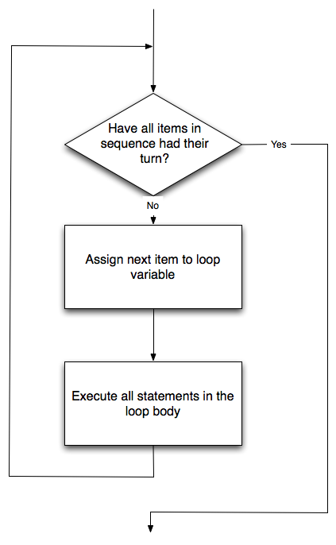

..  Copyright (C)  Brad Miller, David Ranum, Jeffrey Elkner, Peter Wentworth, Allen B. Downey, Chris
    Meyers, and Dario Mitchell.  Permission is granted to copy, distribute
    and/or modify this document under the terms of the GNU Free Documentation
    License, Version 1.3 or any later version published by the Free Software
    Foundation; with Invariant Sections being Forward, Prefaces, and
    Contributor List, no Front-Cover Texts, and no Back-Cover Texts.  A copy of
    the license is included in the section entitled "GNU Free Documentation
    License".
    
..  shortname:: HelloTurtle
..  description:: An introduction to using the turtle module in python
 
Hello, Little Turtles!
======================

.. index::  
    single: module
    single: function
    single: function definition
    single: definition; function
    single: turtle module

.. video:: assignvid
    :controls:
    :thumb: ../_static/turtleintro.png

    http://knuth.luther.edu/~bmiller/thinkcsVideos/turtleintro.mov
    http://knuth.luther.edu/~bmiller/thinkcsVideos/turtleintro.webm

There are many *modules* in Python that provide very powerful features that we
can use in our own programs.  Some of these can send email or fetch web pages. Others allow us to perform complex mathematical calculations.
In this chapter we will introduce a module that allows us to create a data object called a **turtle** that can be used to draw pictures.

.. turtles and get them
.. turn left, etc.  Your turtle's tail is also endowed with the ability to leave
.. to draw shapes and patterns.  

Turtle graphics, as it is known, is based on a very simple
metaphor. Imagine that you have a turtle that understands English.  You can
tell your turtle to do simple commands such as go forward and turn right.  As the turtle
moves around, if its tail is down touching the ground, it will
draw a line (leave a trail behind) as it moves.  If you tell your turtle to lift up its tail it can
still move around but will not leave a trail.  As you will see, you can make
some pretty amazing drawings with this simple capability.

.. note:: 

	The turtles are fun, but the real purpose of the chapter is to teach ourselves
	a little more Python and to develop our theme of *computational thinking*,
	or *thinking like a computer scientist*.  Most of the Python covered here will
	be explored in more depth later.

.. index:: object, invoke, method, attribute, state, canvas

Our First Turtle Program
------------------------

Let's try a couple of lines of Python code to create a new turtle and
start drawing a simple figure like a rectangle. We'll call the variable that refers to our first
turtle `alex`, but you can choose another name if you follow the naming rules
from the previous chapter.  

The program as shown will only draw the first two sides of the rectangle.  
After line 3 you will have a straight line going from the center of the
canvas below towards the right.  After line 6, you will have a canvas with a
turtle and a half drawn rectangle.  Press the run button to try it and see.

.. activecode:: ch03_1
    :nopre:

    import turtle            # allows us to use the turtles library
    wn = turtle.Screen()     # creates a graphics window
    alex = turtle.Turtle()   # create a turtle named alex
    alex.forward(150)        # tell alex to move forward by 150 units
    alex.left(90)            # turn by 90 degrees
    alex.forward(50)         # barb added this
    alex.right(30)	         # barb added this too
    alex.forward(75)         # complete the second side of a rectangle

    

Here are a couple of things you'll need to understand about this program. 
  
The first line tells Python to load a **module** named ``turtle``.  That module
brings us two new types that we can use: the ``Turtle`` type, and the
``Screen`` type.  The dot notation ``turtle.Turtle`` means *"The Turtle type
that is defined within the turtle module"*.   (Remember that Python is case
sensitive, so the module name, with a lowercase `t`, is different from the type
Turtle.)
 
We then create and open what the turtle module calls a screen (we would
prefer to call it a window, or in the case of this web version of Python
simply a canvas), which we assign to variable `wn`. Every window
contains a **canvas**, which is the area inside the window on which we can draw.

In line 3 we create a turtle. The variable `alex` is made to refer to this
turtle.   These first three lines set us up so that we are ready to do some drawing.
    
In lines 4-6, we instruct the **object** alex to move and to turn. We do this
by **invoking** or activating, alex's **methods** --- these are the
instructions that all turtles know how to respond to.
    

.. admonition:: Complete the rectangle ...
    
    Modify the program by adding the commands necessary to have *alex* complete the
       rectangle.
 

An object can have various methods --- things it can do --- and it can also
have **attributes** --- (sometimes called *properties*).  For example, each
turtle has a *color* attribute.  The method invocation  `alex.color("red")`
will make alex red, and the line that it draws will be red too.

The color of the turtle, the width of its pen(tail), the position of the turtle
within the window, which way it is facing, and so on are all part of its
current **state**.   Similarly, the window object has a background color.
These are all part of the state of the window object.

Quite a number of methods exist that allow us to modify the turtle and the
window objects.  We'll just show a couple. We've only commented those
lines that are different from the previous example.  Note also that we've now called our turtle object *tess*.
    
.. activecode:: ch03_2
    
    import turtle

    wn = turtle.Screen()
    wn.bgcolor("lightgreen")         # set the window background color

    tess = turtle.Turtle()
    tess.color("blue")               # make tess blue
    tess.pensize(3)                  # set the width of her pen

    tess.forward(50)
    tess.left(120)
    tess.forward(50)

    wn.exitonclick()

The last line plays a very important role. The wn variable refers to the window shown
above. When we invoke its exitonclick method, it pauses the execution of the
program, and waits for the user to click the mouse somewhere in the window.
When this click event occurs, the response is to close the turtle window and
exit (stop execution of) the Python program.

Each time we run this program, a new drawing window pops up, and will remain on the
screen until we click on it. 

.. admonition:: Extend this program ...
    
    #. Modify this program so that before it creates the window, it prompts
       the user to enter the desired background color. It should store the
       user's responses in a variable, and modify the color of the window
       according to the user's wishes.
       (Hint: you can find a list of permitted color names at 
       http://www.w3schools.com/html/html_colornames.asp.  It includes some quite
       unusual ones, like "PeachPuff"  and "HotPink".)
    #. Do similar changes to allow the user, at runtime, to set tess' color.
    #. Do the same for the width of tess' pen.  *Hint:* your dialog with the 
       user will return a string, but tess' ``pensize`` method 
       expects its argument to be an int.  So you'll need to convert 
       the string to an int before you pass it to ``pensize``.   
 

**Check your understanding**

.. mchoicemf:: test_question3_1_1
   :answer_a: It creates a new turtle object that can be used for drawing 
   :answer_b: It allows us to create a data object called a Turtle that can be used for drawing
   :answer_c: It makes the turtle draw half of a rectangle on the screen
   :answer_d: Nothing, it is unnecessary
   :correct: b
   :feedback_a: The line &quotalex = turtle.Turtle()&quot is what actually creates the turtle object 
   :feedback_b: This line imports the module called turtle, which has all the built in functions for drawing on the screen with the Turtle object
   :feedback_c: This functionality is performed with the lines &quotalex.forward(150)&quot, &quotalex.left(90)&quot, and &quotalex.forward(75)&quot
   :feedback_d: If we leave it out, Python will give an error saying that it does not know about the name &quotturtle&quot when it reaches the line &quotwn = turtle.Screen()&quot
   
   Consider the following code:
   <pre>
   import turtle            
   wn = turtle.Screen()     
   alex = turtle.Turtle()   
   alex.forward(150)        
   alex.left(90)            
   alex.forward(75)  
   </pre>       

   What does the line "import turtle" do?

.. mchoicemf:: test_question3_1_2
   :answer_a: This is simply for clarity.  It would also work to just type \"Turtle()\" instead of \"turtle.Turtle()\"
   :answer_b: The period (.) is what tells Python that we want to invoke a new object.
   :answer_c: The first "turtle" (before the period) tells Python that we are referring to the turtle module, which is where the object "Turtle" is found.
   :correct: c
   :feedback_a: We must specify the name of the module where Python can find the Turtle object. 
   :feedback_b: The period separates the module name from the object name.  The parentheses at the end are what tell Python to invoke a new object.
   :feedback_c: Yes, the Turtle type is defined in the module turtle.  Remember that Python is case sensitive and Turtle is different from turtle.

   Why do we type "turtle.Turtle()" to get a new Turtle object?

.. mchoicemf:: test_question3_1_3
   :answer_a: True
   :answer_b: False
   :correct: a
   :feedback_a: In the chapter you saw one named alex and one named tess, but any legal variable name is allowed.
   :feedback_b: A Turtle, like any data, can be assigned to a variable that can have whatever name you choose as long as it follows the naming conventions from Chapter 2.
   
   True or False: A Turtle object can have any name that follows the naming rules from Chapter 2.

.. index:: instance
  
Instances --- A Herd of Turtles
-------------------------------

Just like we can have many different integers in a program, we can have many
turtles.  Each of them is an independent object and we call each one an **instance** of the Turtle type (class).  Each instance has its own
attributes and methods --- so alex might draw with a thin black pen and be at
some position, while tess might be going in her own direction with a fat pink
pen.  So here is what happens when alex completes a square and tess
completes her triangle:

.. activecode:: ch03_3
   :nopre:

   import turtle
   wn = turtle.Screen()             # Set up the window and its attributes
   wn.bgcolor("lightgreen")

   tess = turtle.Turtle()           # create tess and set some attributes
   tess.color("hotpink")
   tess.pensize(5)

   alex = turtle.Turtle()           # create alex

   tess.forward(80)                 # Let tess draw an equilateral triangle
   tess.left(120)
   tess.forward(80)
   tess.left(120)
   tess.forward(80)
   tess.left(120)                   # complete the triangle

   tess.right(180)                  # turn tess around
   tess.forward(80)                 # move her away from the origin
 
   alex.forward(50)                 # make alex draw a square
   alex.left(90)
   alex.forward(50)
   alex.left(90)
   alex.forward(50)
   alex.left(90)
   alex.forward(50)
   alex.left(90)

   wn.exitonclick()

Here are some *How to think like a computer scientist* observations:

* There are 360 degrees in a full circle.  If you add up all the turns that a
  turtle makes, *no matter what steps occurred between the turns*, you can
  easily figure out if they add up to some multiple of 360.  This should
  convince you that alex is facing in exactly the same direction as he was when
  he was first created. (Geometry conventions have 0 degrees facing East, and
  that is the case here too!)
* We could have left out the last turn for alex, but that would not have been
  as satisfying.  If you're asked to draw a closed shape like a square or a
  rectangle, it is a good idea to complete all the turns and to leave the
  turtle back where it started, facing the same direction as it started in.
  This makes reasoning about the program and composing chunks of code into
  bigger programs easier for us humans! 
* We did the same with tess: she drew her triangle, and turned through a full
  360 degress.  Then we turned her around and moved her aside.  Even the blank
  line 18 is a hint about how the programmer's *mental chunking* is working: in
  big terms, tess' movements were chunked as "draw the triangle"  (lines 12-17)
  and then "move away from the origin" (lines 19 and 20). 
* One of the key uses for comments is to record your mental chunking, and big
  ideas.   They're not always explicit in the code.  
* And, uh-huh, two turtles may not be enough for a herd, but you get the idea! 

.. index:: for loop
  
The **for** Loop
----------------

.. video:: forloopvid
   :controls:
   :thumb: ../_static/for_loop.png

   http://knuth.luther.edu/~bmiller/thinkcsVideos/for_loop.mov
   http://knuth.luther.edu/~bmiller/thinkcsVideos/for_loop.webm

When we drew the square, it was quite tedious.  We had to move then turn, move
then turn, etc. etc. four times.  If we were drawing a hexagon, or an octogon,
or a polygon with 42 sides, it would have been a nightmare to duplicate all that code.

A basic building block of all programs is to be able to repeat some code
over and over again.  In computer science, we refer to this repetitive idea as **iteration**.  In this chapter, we will explore some mechanisms for basic iteration.

In Python, the **for** statement allows us to write programs that implement iteration.   As a simple example, let's say we have some friends, and
we'd like to send them each an email inviting them to our party.  We
don't quite know how to send email yet, so for the moment we'll just print a
message for each friend.

.. activecode:: ch03_4
    :nocanvas:

    for friendName in ["Joe", "Amy", "Brad", "Angelina", "Zuki", "Thandi", "Paris"]:
        print("Hi ", friendName, "  Please come to my party on Saturday!")
      

Take a look at the output produced when you press the ``run`` button.  There is one line printed for each friend.  Here's how it works:

* **friendName** in this ``for`` statement is called the **loop variable**.  
* The list of names in the square brackets is called a Python **list**.  Lists are very useful.  We will have much
  more to say about them later.
* Line 2  is the **loop body**.  The loop body is always
  indented. The indentation determines exactly what statements are "in the
  loop".  The loop body is performed one time for each name in the list.
* On each *iteration* or *pass* of the loop, first a check is done to see if
  there are still more items to be processed.  If there are none left (this is
  called the **terminating condition** of the loop), the loop has finished.
  Program execution continues at the next statement after the loop body. 
* If there are items still to be processed, the loop variable is updated to
  refer to the next item in the list.  This means, in this case, that the loop
  body is executed here 7 times, and each time `friendName` will refer to a different
  friend. 
* At the end of each execution of the body of the loop, Python returns 
  to the ``for`` statement, to see if there are more items to be handled.

**Check your understanding**

.. mchoicemf:: test_question3_2_1
   :answer_a: True
   :answer_b: False
   :correct: b
   :feedback_a: You can create and use as many turtles as you like.  As long as they have different names, you can operate them independently, and make them move in any order you like.  To convince yourself this is true, try interleaving the instructions for alex and tess in ActiveCode box 3. 
   :feedback_b: You can create and use as many turtles as you like.  As long as they have different names, you can operate them independently, and make them move in any order you like.  If you are not totally convinced, try interleaving the instructions for alex and tess in ActiveCode box 3.

   True or False: You can only have one active turtle at a time.  If you create a second one, you will no longer be able to access or use the first.

.. index:: control flow, flow of execution
  
Flow of Execution of the for Loop
---------------------------------

 
As a program executes, the interpreter always keeps track of which statement is
about to be executed.  We call this the **control flow**, or the **flow of
execution** of the program.  When humans execute programs, they often use their
finger to point to each statement in turn.  So you could think of control flow
as "Python's moving finger". 

Control flow until now has been strictly top to bottom, one statement at a
time.  We call this type of control **sequential**.  Sequential flow of control is always assumed to be the default behavior for a computer program.  The ``for`` statement changes this. 

Flow of control is often easy to visualize and understand if we draw a flowchart.
This flowchart shows the exact steps and logic of how the ``for`` statement executes.

A codelens demonstration is a good way to help you visualize exactly how the flow of control
works with the for loop.  Try stepping forward and backward through the program by pressing
the buttons.  You can see the value of ``friendName`` change as the loop iterates thru the list of friends.  

.. codelens:: vtest

    for friendName in ["Joe", "Amy", "Brad", "Angelina", "Zuki", "Thandi", "Paris"]:
        print("Hi " + friendName + "  Please come to my party!")

.. index:: range function, chunking

Iteration Simplifies our Turtle Program
---------------------------------------

To draw a square we'd like to do the same thing four times --- move the turtle forward some distance and turn 90 degrees.  We previously used 8 lines of Python code to have alex draw the four sides of a
square.  This next program does exactly the same thing but, with the help of the for statement, uses just three lines (not including the setup code).  Remember that the for statement will repeat the `forward` and `left` four times, one time for
each value in the list.

.. activecode:: ch03_for1
   :nopre:

   import turtle            #set up alex
   wn = turtle.Screen()
   alex = turtle.Turtle()
   
   for i in [0,1,2,3]:      #repeat four times
       alex.forward(50)
       alex.left(90) 

   wn.exitonclick()

While "saving some lines of code" might be convenient, it is not the big
deal here.  What is much more important is that we've found a "repeating
pattern" of statements, and we reorganized our program to repeat the pattern.
Finding the chunks and somehow getting our programs arranged around those
chunks is a vital  skill when learning *How to think like a computer scientist*.  

The values [0,1,2,3] were provided to make the loop body execute 4 times. 
We could have used any four values.  For example, consider the following program.

.. activecode:: ch03_forcolor
   :nopre:

   import turtle            #set up alex
   wn = turtle.Screen()
   alex = turtle.Turtle()
   
   for aColor in ["yellow", "red", "purple", "blue"]:      #repeat four times
       alex.forward(50)
       alex.left(90) 

   wn.exitonclick()

Since there are still four items in the list, the iteration will still occur four times.  ``aColor`` will
take on each color in the list.  We can even take this one step further and use the value of ``aColor`` as part
of the computation.

.. activecode:: colorlist

    import turtle            #set up alex
    wn = turtle.Screen()
    alex = turtle.Turtle()

    for aColor in ["yellow", "red", "purple", "blue"]:
       alex.color(aColor)
       alex.forward(50)
       alex.left(90)

    wn.exitonclick()

In this case, the value of ``aColor`` is used to change the color attribute of ``alex``.  Each iteration causes ``aColor`` to change to the next value in the list.

**Check your understanding**

.. mchoicemf:: test_question3_4_1
   :answer_a: 1
   :answer_b: 5
   :answer_c: 6
   :answer_d: 10
   :correct: c
   :feedback_a: The loop body prints one line, but the body will execute exactly one time for each element in the list [5, 4, 3, 2, 1, 0]. 
   :feedback_b: Although the biggest number in the list is 5, there are actually 6 elements in the list.
   :feedback_c: The loop body will execute (and print one line) for each of the 6 elements in the list [5, 4, 3, 2, 1, 0]
   :feedback_d: The loop body will not execute more times than the number of elements in the list.

   In the following code, how many lines does this code print? 
   <pre>
   for number in [5, 4, 3, 2, 1, 0]:
       print("I have", number, "cookies.  Iím going to eat one.")
   </pre>
   
.. mchoicemf:: test_question3_4_2
   :answer_a: They are indented to the same degree from the loop header
   :answer_b: There is always exactly one line in the loop body
   :answer_c: The loop body ends with a semi-colon (;) which is not shown in the code above 
   :correct: a
   :feedback_a: The loop body can have any number of lines, all indented from the loop header.
   :feedback_b: The loop body may have more than one line.
   :feedback_c: Python does not use semi-colons in its syntax, but relies mainly on indentation.
   
   How does python know what lines are contained in the loop body?
   
.. mchoicemf:: test_question3_4_3
      :answer_a: 2
      :answer_b: 4
      :answer_c: 5
      :answer_d: 1  
      :correct: b
      :feedback_a: Python gives number the value of items in the list, one at a time, in order (from left to right).  number gets a new value each time the loop repeats.
      :feedback_b: Yes, Python will process the items from left to right so the first time the value of number is 5 and the second time it is 4.
      :feedback_c: Python gives number the value of items in the list, one at a time, in order.  number gets a new value each time the loop repeats.
      :feedback_d: Python gives number the value of items in the list, one at a time, in order (from left to right).  number gets a new value each time the loop repeats.
   
      In the following code, what is the value of number the second time Python executes the loop?
      <pre>
         for number in [5, 4, 3, 2, 1, 0]:
             print("I have", number, "cookies.  Iím going to eat one.")
      </pre>

.. mchoicemf:: test_question3_4_4
      :answer_a: Draw one side of a square, using the same color each time.
      :answer_b: Draw one side of a square, using a different color each time.
      :answer_c: Draw a complete square.
      :correct: a
      :feedback_a: The items in the list are not actually used to control the color of the turtle because aColor is never used inside the loop.
      :feedback_b: Notice that aColor is never actually used inside the loop.
      :feedback_c: The body of the loop only contains two instructions: go forward and turn left.  This is not enough to draw a complete square.
   
      Consider the following code:
      <pre>
      for aColor in ["yellow", "red", "green", "blue"]:
         alex.forward(50)
         alex.left(90)
      </pre>
      What does each iteration through the loop (i.e. "chunk of code") do?

The range Function
------------------

.. video:: advrange
   :controls:
   :thumb: ../_static/advrange.png

   http://knuth.luther.edu/~bmiller/thinkcsVideos/AdvancedRange.mov
   http://knuth.luther.edu/~bmiller/thinkcsVideos/AdvancedRange.webm

In our simple example from the last section (shown again below), we used a list of four integers to cause the iteration
to happen four times.  We said that we could have used any four values.  In fact, we even used four colors.

.. sourcecode:: python

   import turtle            #set up alex
   wn = turtle.Screen()
   alex = turtle.Turtle()

   for i in [0,1,2,3]:      #repeat four times
       alex.forward(50)
       alex.left(90) 

   wn.exitonclick()

It turns out that generating lists with a specific number of integers is a very common thing to do, especially when you
want to write simple ``for loop`` controlled iteration.  Even though you can use any four items, or any four integers for that matter, the conventional thing to do is to use a list of integers starting with 0.  
In fact, these lists are so popular that Python gives us special built-in
``range`` objects
that can deliver a sequence of values to
the ``for`` loop.  They start at 0, and in the  cases shown below do not include the 4
or the 10.

  .. sourcecode:: python

      for i in range(4):
          # Executes the body with i = 0, then 1, then 2, then 3
      for x in range(10):
          # sets x to each of ... [0, 1, 2, 3, 4, 5, 6, 7, 8, 9]

.. note::

    Computer scientists like to count from 0!

So to repeat something four times, a good Python programmer would do this:

.. sourcecode:: python

    for i in range(4):
        alex.forward(50)
        alex.left(90)

The `range <http://docs.python.org/py3k/library/functions
.html?highlight=range#range>`_ function is actually a very powerful function
when it comes to
creating sequences of integers.  It can take one, two, or three parameters.  We have seen
the simplest case of one parameter such as ``range(4)`` which creates ``[0, 1, 2, 3]``.
But what if we really want to have the sequence ``[1, 2, 3, 4]``?
We can do this by using a two parameter version of ``range`` where the first parameter is the starting point and the second parameter is the ending point.  The evaluation of ``range(1,5)`` produces the desired sequence.  What happened to the 5?
In this case we interpret the parameters of the range function to mean
range(start,stop+1).

.. note::

    Why in the world would range not just work like range(start,
    stop)?  Think about it like this.  Because computer scientists like to
    start counting at 0 instead of 1, ``range(N)`` produces a sequence of
    things that is N long, but the consequence of this is that the final
    number of the sequence is N-1.  In the case of start,
    stop it helps to simply think that the sequence begins with start and
    continues as long as the number is less than stop.

Here are a two examples for you to run.  Add another line below to create a sequence starting
at 10 and going up to 20 (including 20).

.. activecode:: ch03_5
    :nocanvas:

    print(range(4))
    print(range(1,5))

Codelens will help us to further understand the way range works.  In this case, the variable ``i`` will take on values
produced by the ``range`` function.

.. codelens:: rangeme

    for i in range(10):
       print(i)
       

Finally, suppose we want to have a sequence of even numbers.
How would we do that?  Easy, we add another parameter, a step,
that tells range what to count by.  For even numbers we want to start at 0
and count by 2's.  So if we wanted the first 10 even numbers we would use
``range(0,19,2)``.  The most general form of the range is
``range(start, stop, step)``.  You can also create a sequence of numbers that
starts big and gets smaller by using a negative value for the step parameter.

.. activecode:: ch03_6
    :nocanvas:

    print(range(0,19,2))
    print(range(0,20,2))
    print(range(10,0,-1))

Try it in codelens.

.. codelens:: rangeme2

    for i in range(0,20,2):
       print(i)

**Check your understanding**

.. mchoicemf:: test_question3_5_1
  :answer_a: Range should generate a list that stops at 9 (including 9).
  :answer_b: Range should generate a list that starts at 10 (including 10).
  :answer_c: Range should generate a list starting at 3 that stops at 10 (including 10).
  :answer_d: Range should generate a list using every 10th number between the start and the stopping number.  
  :correct: a
  :feedback_a: Range will generate the list [3, 5, 7, 9]
  :feedback_b: The first argument (3) tells range what number to start at.
  :feedback_c: Range will always stop at the number before (not including) the specified ending point for the list.
  :feedback_d: The third argument (2) tells range how many numbers to skip between each element in the list.

  In the command range(3, 10, 2), what does the second argument (10) specify?

.. mchoicemf:: test_question3_5_2
  :answer_a: range(2, 5, 8)
  :answer_b: range(2, 8, 3)
  :answer_c: range(2, 10, 3)
  :answer_d: range(8, 1, -3)
  :correct: c
  :feedback_a: This command generates the list [2] because the first number (2) tells range where to start, the second number tells range where to end (5, not inclusive) and the third number tells range how many numbers to skip between elements (8).  Since 10>= 8, there is only one number in this list.
  :feedback_b: This command generates the list [2, 5] because 8 is not less than 8 (the specified ending number).
  :feedback_c: The first number is the starting point, the second is the maximum allowed, and the third is the amount to increment by.  
  :feedback_d: This command generates the list [8, 5, 3] because it starts at 8, ends at (or above 1), and skips every third number going down.
  
  What command correctly generates the list [2, 5, 8]?
  
.. mchoicemf:: test_question3_5_3
  :answer_a: It will generate a list starting at 0, with every number included up to but not including the argument it was passed.
  :answer_b: It will generate a list starting at 1, with every number up to but not including the argument it was passed.
  :answer_c: It will generate a list starting at 1, with every number including the argument it was passed.
  :answer_d: It will cause an error: range always takes exactly 3 arguments.
  :correct: a
  :feedback_a: Yes, if you only give one number to range it starts with 0 and ends before the number specified incrementing by 1.
  :feedback_b: Range starts at 0 unless otherwise specified.
  :feedback_c: Range starts at 0 unless otherwise specified, and never includes its ending element (which is the argument it was passed).
  :feedback_d: If range is passed only one argument, it interprets that argument as the end of the list (not inclusive).

  What happens if you give range only one argument?  For example: range(4)

A Few More turtle Methods and Observations
------------------------------------------

Here are a few more things that you might find useful as you use the turtle.

* Turtle methods can use negative angles or distances.  So ``tess.foward(-100)``
  will move tess backwards, and ``tess.left(-30)`` turns her to the right.
  Additionally, because there are 360 degrees in a circle, turning 30 to the
  left will leave you facing in the same direction as turning 330 to the right!
  (The on-screen animation will differ, though --- you will be able to tell if
  tess is turning clockwise or counter-clockwise!)

  This suggests that we don't need both a left and a right turn method --- we
  could be minimalists, and just have one method.  There is also a *backward*
  method.  (If you are very nerdy, you might enjoy saying
  ``alex.backward(-100)`` to move alex forward!)   

  Part of *thinking like a scientist* is to understand more of the structure
  and rich relationships in your field.  So revising a few basic facts about
  geometry and number lines, like we've done here is a good start if we're
  going to play with turtles. 

* A turtle's pen can be picked up or put down.  This allows us to move a turtle
  to a different place without drawing a line.   The methods are ``penup`` and ``pendown``.

  .. sourcecode:: python

     alex.penup()
     alex.forward(100)     # this moves alex, but no line is drawn
     alex.pendown()   
       
* Every turtle can have its own shape.  The ones available "out of the box"
  are ``arrow``, ``blank``, ``circle``, ``classic``, ``square``, ``triangle``,
  ``turtle``.

  .. sourcecode:: python

     ...            
     alex.shape("turtle")           
     ...                 

* You can speed up or slow down the turtle's animation speed. (Animation
  controls how quickly the turtle turns and moves forward).  Speed settings can
  be set between 1 (slowest) to 10 (fastest).  But if you set the speed to 0,
  it has a special meaning --- turn off animation and go as fast as possible. 

  .. sourcecode:: python
       
     alex.speed(10)
          
* A turtle can "stamp" its footprint onto the canvas, and this will remain
  after the turtle has moved somewhere else.  Stamping works, even when the pen
  is up. 
    
Let's do an example that shows off some of these new features.

.. activecode:: ch03_7

   import turtle
   wn = turtle.Screen()             
   wn.bgcolor("lightgreen")
   tess = turtle.Turtle()            
   tess.color("blue")
   tess.shape("turtle")

   print(range(5,60,2))
   tess.penup()                    # this is new
   for size in range(5,60,2):      # start with size = 5 and grow by 2
       tess.stamp()                # leave an impression on the canvas
       tess.forward(size)          # move tess along
       tess.right(24)              # and turn her

   wn.exitonclick()

The list of integers shown above is created by printing the ``range(5,60,2)`` result.  It is only
done to show you the distances being used to move the turtle forward.  The actual use appears
as part of the ``for`` loop.
   
One more thing to be careful about.  All except one of the shapes you see on the screen here are
footprints created by ``stamp``.  But the program still only has *one* turtle
instance --- can you figure out which one is the real tess?  (Hint: if you're
not sure, write a new line of code after the ``for`` loop to change tess'
color, or to put her pen down and draw a line, or to change her shape, etc.)

.. admonition:: Lab

    * `Turtle Race <lab03_01.html>`_ In this guided lab exercise we will work
      through a simple problem solving exercise related to having some turtles
      race.

.. _turtle_methods:

Summary of Turtle Methods
-------------------------

==========  ==========  =========================
Method      Parameters  Description
==========  ==========  =========================
Turtle      None          Creates and returns a new turtle object
forward     distance      Moves the turtle forward
backward    distance      Moves the turle backward
right       angle         Turns the turtle clockwise
left        angle         Turns the turtle counter clockwise
up          None          Picks up the turtles tail
down        None          Puts down the turtles tail
color       color name    Changes the color of the turtle's tail
fillcolor   color name    Changes the color of the turtle will use to fill a polygon
heading     None          Returns the current heading
position    None          Returns the current position
goto        x,y           Move the turtle to position x,y
begin_fill  None          Remember the starting point for a filled polygon
end_fill    None          Close the polygon and fill with the current fill color
dot         None          Leave a dot at the current position
stamp       None          Leaves an impression of a turtle shape at the current location
shape       shapename     Should be 'arrow', 'classic', 'turtle', or 'circle'
==========  ==========  =========================

Once you are comfortable with the basics of turtle graphics you can read about even
more options on the `Python Docs Website <http://docs.python.org/dev/py3k/library/turtle.html>`_.  Note that we
will describe Python Docs in more detail in the next chapter.

Glossary
--------

.. glossary::

    attribute
        Some state or value that belongs to a particular object.  For example,
        tess has a color. 
        
    canvas
        A surface within a window where drawing takes place.
        
    control flow
        See *flow of execution* in the next chapter.
        
    for loop
        A statement in Python for convenient repetition of statements in
        the *body* of the loop.

    instance
        An object that belongs to a class.  `tess` and `alex` are different
        instances of the class `Turtle` 

    invoke
        An object has methods.  We use the verb invoke to mean *activate the
        method*.  Invoking a method is done by putting parentheses after the
        method name, with some possible arguments.  So  ``wn.exitonclick()`` is
        an invocation of the ``exitonclick`` method.

    iteration
		A basic building block for algorithms (programs).  It allows steps to be repeated.  Sometimes called *looping*.
        
    loop body
        Any number of statements nested inside a loop. The nesting is indicated
        by the fact that the statements are indented under the for loop
        statement.
    
    loop variable
        A variable used as part of a for loop. It is assigned a different value
        on each iteration of the loop, and is used as part of the terminating
        condition of the loop,
    

    
    method
        A function that is attached to an object.  Invoking or activating the
        method causes the object to respond in some way, e.g. ``forward`` is
        the method when we say ``tess.forward(100)``.

         
    module
        A file containing Python definitions and statements intended for use in
        other Python programs. The contents of a module are made available to
        the other program by using the *import* statement.
        
    object
        A "thing" to which a variable can refer.  This could be a screen window,
        or one of the turtles you have created.        
    
    range
        A built-in function in Python for generating sequences of integers.  It
        is especially useful when we need to write a for loop that executes a
        fixed number of times.

    sequential
		The default behavior of a program.  Step by step processing of algorithm.

    state
		The collection of attribute values that a specific data object maintains.
 
    terminating condition
        A condition that occurs which causes a loop to stop repeating its body.
        In the ``for`` loops we saw in this chapter, the terminating condition 
        has been when there are no more elements to assign to the loop variable.
    
    turtle
		A data object used to create pictures (known as turtle graphics).

Exercises
---------
#. Write a program that prints ``We like Python's turtles!`` 1000 times. 

   .. actex:: ex_3_1

#. Give three attributes of your cellphone object.  Give three methods of your
   cellphone.  

   .. actex:: ex_3_2

#. Write a program that uses a for loop to print
     |  ``One of the months of the year is January``
     |  ``One of the months of the year is February``
     |  ``One of the months of the year is March``
     |  etc ...

   .. actex:: ex_3_3

#. Assume you have the assignment ``xs = [12, 10, 32, 3, 66, 17, 42, 99, 20]``
    
   a. Write a loop that prints each of the numbers on a new line.
   b. Write a loop that prints each number and its square on a new line.

   .. actex:: ex_3_4

#. Use ``for`` loops to make a turtle draw these regular polygons 
   (regular means all sides the same lengths, all angles the same):  
  
   * An equilateral triangle    
   * A square    
   * A hexagon (six sides)    
   * An octagon (eight sides)

   .. actex:: ex_3_5

#. .. _drunk_student_problem:

   A drunk pirate makes a random turn and then takes 100 steps forward, makes
   another random turn, takes another 100 steps, turns another random amount,
   etc.  A social science student records the angle of each turn
   before the next 100 steps are taken. Her experimental data
   is ``[160, -43, 270, -97, -43, 200, -940, 17, -86]``.  (Positive angles are
   counter-clockwise.)  Use a turtle to draw the path taken by our drunk
   friend.   

   .. actex:: ex_3_6

#. Enhance your program above to also tell us what the drunk pirate's heading
   is after he has finished stumbling around.
 
   .. actex:: ex_3_7

#. On a piece of scratch paper, trace the following program and show the drawing.  When you are done, press ``run`` 
   and check your answer.

   .. actex:: ex_3_8

       import turtle
       wn = turtle.Screen()
       tess = turtle.Turtle()
       tess.right(90)
       tess.left(3600)
       tess.right(-90)
       tess.left(3600)
       tess.left(3645)
       tess.forward(-100)

#. Write a program to draw a shape like this:

   .. image:: Figures/star.png
   
   .. actex:: ex_3_9

#. Write a program to draw a face of a clock that looks something like this:
    
   .. image:: Figures/tess_clock1.png

   .. actex:: ex_3_10

#. Write a program to draw some kind of picture.  Be creative and experiment
    with the turtle methods provided in turtle_methods_.

   .. actex:: ex_3_11

#. Create a turtle, and assign it to a variable.  When you print its type,
    what do you get?

   .. actex:: ex_3_12

#. Write a program to draw a Sprite where the number of legs is provided by the user.

   .. actex:: ex_3_13
