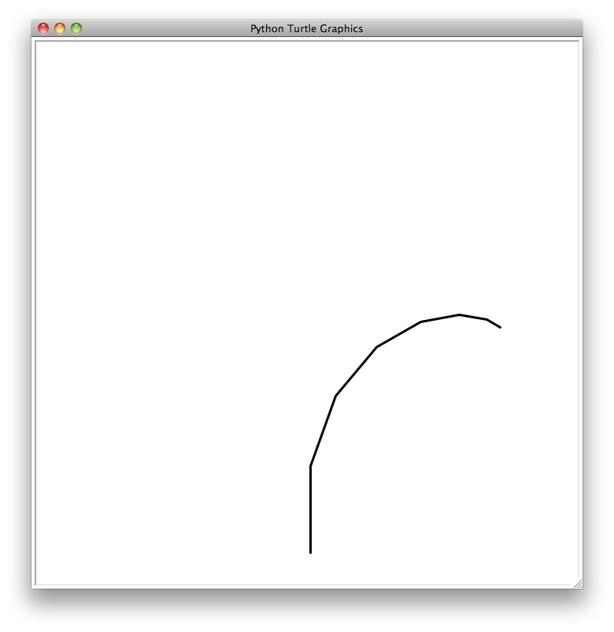
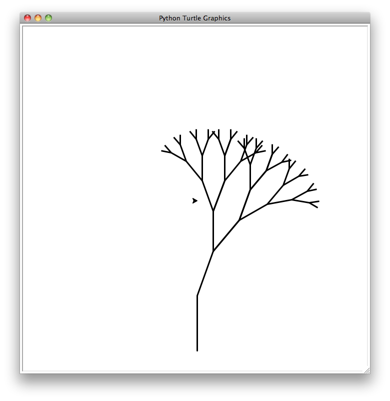
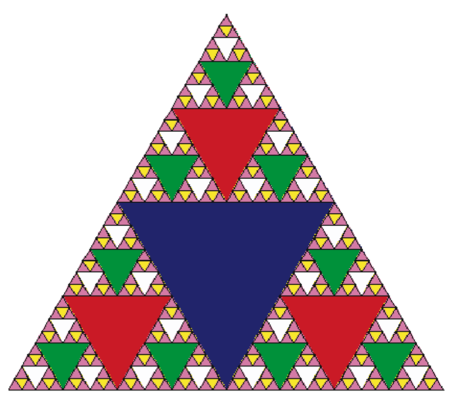

..  Copyright (C)  Brad Miller, David Ranum
    Permission is granted to copy, distribute and/or modify this document
    under the terms of the GNU Free Documentation License, Version 1.3 or 
    any later version published by the Free Software Foundation; with 
    Invariant Sections being Forward, Prefaces, and Contributor List, 
    no Front-Cover Texts, and no Back-Cover Texts.  A copy of the license
    is included in the section entitled "GNU Free Documentation License".
    
..  shortname:: GraphicalRecursion
..  description:: Visualizing recursion using turtle drawings

Visualizing Recursion
=====================

In the previous section we looked at some problems that were easy to
solve using recursion; however, it can still be difficult to find a
mental model or a way of visualizing what is happening in a recursive
function. This can make recursion difficult for people to grasp. In this
section we will look at a couple of examples of using recursion to draw
some interesting pictures. As you watch these pictures take shape you
will get some new insight into the recursive process that may be helpful
in cementing your understanding of recursion.

The tool we will use for our illustrations is Python’s turtle graphics
module called ``turtle``. The ``turtle`` module is standard with all
versions of Python and is very easy to use. The metaphor is quite
simple. You can create a turtle and the turtle can move forward,
backward, turn left, turn right, etc. The turtle can have its tail up or
down. When the turtle’s tail is down and the turtle moves it draws a
line as it moves. To increase the artistic value of the turtle you can
change the width of the tail as well as the color of the ink the tail is
dipped in.

Lets illustrate some turtle graphics basics with a simple example. We
will use the turtle module to draw a spiral recursively.
:ref:`Listing 1 <lst_turt1>` shows how it is done. After importing the ``turtle``
module we create a turtle. When the turtle is created it also creates a
window for itself to draw in. Next we define the drawSpiral function.
The base case for this simple function is when the length of the line we
want to draw, as given by the ``len`` parameter, is reduced to zero or
less. If the length of the line is longer than zero we instruct the
turtle to go forward by ``len`` units and then turn right 90 degrees.
The recursive step is when we call drawSpiral again with a reduced
length. At the end of :ref:`Listing 1 <lst_turt1>` you will notice that we call
the function ``myWin.exitonclick()``, this is a handy little method of
the window that puts the turtle into a wait mode until you click inside
the window, after which the program cleans up and exits.

.. _lst_turt1:

.. activecode:: lst_turt1

    import turtle

    myTurtle = turtle.Turtle()
    myWin = turtle.Screen()

    def drawSpiral(myTurtle, lineLen):
        if lineLen > 0:
            myTurtle.forward(lineLen)
            myTurtle.right(90)
            drawSpiral(myTurtle,lineLen-5)

    drawSpiral(myTurtle,100)
    myWin.exitonclick()

That is really about all the turtle graphics you need to know in order
to make some pretty impressive drawings. For our next program we are
going to draw a fractal tree. Fractals come from a branch of
mathematics, and have much in common with recursion. The definition of a
fractal is that when you look at it the fractal has the same basic shape
no matter how much you magnify it. Some examples from nature are the
coastlines of continents, snowflakes, mountains, and even trees or
shrubs. The fractal nature of many of these natural phenomenon makes it
possible for programmers to generate very realistic looking scenery for
computer generated movies. In our next example we will generate a
fractal tree.

To understand how this is going to work it is helpful to think of how we
might describe a tree using a fractal vocabulary. Remember that we said
above that a fractal is something that looks the same at all different
levels of magnification. If we translate this to trees and shrubs we
might say that even a small twig has the same shape and characteristics
as a whole tree. Using this idea we could say that a *tree* is a trunk,
with a smaller *tree* going off to the right and another smaller *tree*
going off to the left. If you think of this definition recursively it
means that we will apply the recursive definition of a tree to both of
the smaller left and right trees.

Lets translate this idea to some Python code. :ref:`Listing 2 <lst_fractree>`
shows how we can use our turtle to generate a fractal tree. Lets look at
the code a bit more closely. You will see that on lines 5 and 7 we are
making a recursive call. On line 5 we make the recursive call right
after the turtle turns to the right by 20 degrees; this is the right
tree mentioned above. Then in line 7 the turtle makes another recursive
call, but this time after turning left by 40 degrees. The reason the
turtle must turn left by 40 degrees is that it needs to undo the
original 20 degree turn to the right and then do an additional 20 degree
turn to the left in order to draw the left tree. Also notice that each
time we make a recursive call to ``tree`` we subtract some amount from
the ``branchLen`` parameter; this is to make sure that the recursive
trees get smaller and smaller. You should also recognize the initial
``if`` statement on line 2 as a check for the base case of ``branchLen``
getting too small.

.. _lst_fractree:

::

    def tree(branchLen,t):
        if branchLen > 5:
            t.forward(branchLen)
            t.right(20)
            tree(branchLen-15,t)
            t.left(40)
            tree(branchLen-10,t)
            t.right(20)
            t.backward(branchLen)

The activecode window below shows a complete program for this tree example (:ref:`Listing 3 <lst_complete_tree>`).  Before you run
the code think about how you expect to see the tree take shape. Look at
the recursive calls and think about how this tree will unfold. Will it
be drawn symmetrically with the right and left halves of the tree taking
shape simultaneously? Will it be drawn right side first then left side?

.. _lst_complete_tree:

.. activecode:: lst_complete_tree

    import turtle
    
    def tree(branchLen,t):
        if branchLen > 5:
            t.forward(branchLen)
            t.right(20)
            tree(branchLen-15,t)
            t.left(40)
            tree(branchLen-15,t)
            t.right(20)
            t.backward(branchLen)

    def main():
        t = turtle.Turtle()
        myWin = turtle.Screen()
        t.left(90)
        t.up()
        t.backward(100)
        t.down()
        t.color("green")
        tree(75,t)
        myWin.exitonclick()
        
    main()

Notice how each branch point on the tree corresponds to a recursive
call, and notice how the tree is drawn to the right all the way down to
its shortest twig. You can see this in :ref:`Figure 1 <fig_tree1>`. Now, notice
how the program works its way back up the trunk until the entire right
side of the tree is drawn. You can see the right half of the tree in
:ref:`Figure 2 <fig_tree2>`. Then the left side of the tree is drawn, but not by
going as far out to the left as possible. Rather, once again the entire
right side of the left tree is drawn until we finally make our way out
to the smallest twig on the left.

.. _fig_tree1:

   The Beginning of a Fractal Tree
   
.. _fig_tree2:

   The First Half of the Tree

This simple tree program is just a starting point for you, and you will
notice that the tree does not look particularly realistic because nature
is just not as symmetric as a computer program. The exercises at the end
of the chapter will give you some ideas for how to explore some
interesting options to make your tree look more realistic.

.. admonition:: Self Check

   Modify the recursive tree program using one or all of the following
   ideas:

   -  Modify the thickness of the branches so that as the ``branchLen``
      gets smaller, the line gets thinner.

   -  Modify the color of the branches so that as the ``branchLen`` gets
      very short it is colored like a leaf.

   -  Modify the angle used in turning the turtle so that at each branch
      point the angle is selected at random in some range. For example
      choose the angle between 15 and 45 degrees. Play around to see
      what looks good.

   -  Modify the ``branchLen`` recursively so that instead of always
      subtracting the same amount you subtract a random amount in some
      range.

   .. actex:: recursion_sc_3

Sierpinski Triangle
-------------------

Another fractal that exhibits the property of self-similarity is the
Sierpinski triangle. An example is shown in :ref:`Figure 3 <fig_sierpinski>`. The
Sierpinski triangle illustrates a three-way recursive algorithm. The
procedure for drawing a Sierpinski triangle by hand is simple. Start
with a single large triangle. Divide this large triangle into four new
triangles by connecting the midpoint of each side. Ignoring the middle
triangle that you just created, apply the same procedure to each of the
three corner triangles. Each time you create a new set of triangles, you
recursively apply this procedure to the three smaller corner triangles.
You can continue to apply this procedure indefinitely if you have a
sharp enough pencil. Before you continue reading, you may want to try
drawing the Sierpinski triangle yourself, using the method described.

.. _fig_sierpinski:

     The Sierpinski Triangle

Since we can continue to apply the algorithm indefinitely, what is the
base case? We will see that the base case is set arbitrarily as the
number of times we want to divide the triangle into pieces. Sometimes we
call this number the “degree” of the fractal. Each time we make a
recursive call, we subtract 1 from the degree until we reach 0. When we
reach a degree of 0, we stop making recursive calls. The code that
generated the Sierpinski Triangle in :ref:`Figure 3 <fig_sierpinski>` is shown in
:ref:`Listing 4 <lst_st>`.

.. _lst_st:

.. activecode:: lst_st

    import turtle

    def drawTriangle(points,color,myTurtle):
        myTurtle.fillcolor(color)
        myTurtle.up()
        myTurtle.goto(points[0][0],points[0][1])
        myTurtle.down()
        myTurtle.begin_fill()
        myTurtle.goto(points[1][0],points[1][1])
        myTurtle.goto(points[2][0],points[2][1])
        myTurtle.goto(points[0][0],points[0][1])
        myTurtle.end_fill()

    def getMid(p1,p2):
        return ( (p1[0]+p2[0]) / 2, (p1[1] + p2[1]) / 2)

    def sierpinski(points,degree,myTurtle):
        colormap = ['blue','red','green','white','yellow',
                    'violet','orange']
        drawTriangle(points,colormap[degree],myTurtle)
        if degree > 0:
            sierpinski([points[0],
                            getMid(points[0], points[1]),
                            getMid(points[0], points[2])],
                       degree-1, myTurtle)
            sierpinski([points[1],
                            getMid(points[0], points[1]),
                            getMid(points[1], points[2])],
                       degree-1, myTurtle)
            sierpinski([points[2],
                            getMid(points[2], points[1]),
                            getMid(points[0], points[2])],
                       degree-1, myTurtle)

    def main():
       myTurtle = turtle.Turtle()
       myWin = turtle.Screen()
       myPoints = [[-100,-50],[0,100],[100,-50]]
       sierpinski(myPoints,3,myTurtle)
       myWin.exitonclick()

    main()

    
    
The program in :ref:`Listing 4 <lst_st>` follows the ideas outlined above. The
first thing ``sierpinski`` does is draw the outer triangle. Next, there
are three recursive calls, one for each of the new corner triangles we
get when we connect the midpoints. Once again we make use of the
standard turtle module that comes with Python. You can learn all the
details of the methods available in the turtle module by using
``help('turtle')`` from the Python prompt.

Look at the code and think about the order in which the triangles will
be drawn. While the exact order of the corners depends upon how the
initial set is specified, let’s assume that the corners are ordered
lower left, top, lower right. Because of the way the ``sierpinski``
function calls itself, ``sierpinski`` works its way to the smallest
allowed triangle in the lower-left corner, and then begins to fill out
the rest of the triangles working back. Then it fills in the triangles
in the top corner by working toward the smallest, topmost triangle.
Finally, it fills in the lower-right corner, working its way toward the
smallest triangle in the lower right.

Sometimes it is helpful to think of a recursive algorithm in terms of a
diagram of function calls. :ref:`Figure 4 <fig_stcalltree>` shows that the recursive
calls are always made going to the left. The active functions are
outlined in black, and the inactive function calls are in gray. The
farther you go toward the bottom of :ref:`Figure 4 <fig_stcalltree>`, the smaller the
triangles. The function finishes drawing one level at a time; once it is
finished with the bottom left it moves to the bottom middle, and so on.

.. _fig_stcalltree:

.. figure:: Figures/stCallTree.png
    :align: center   
   
    Building a Sierpinski Triangle

The ``sierpinski`` function relies heavily on the ``getMid`` function.
``getMid`` takes as arguments two endpoints and returns the point
halfway between them. In addition, :ref:`Listing 4 <lst_st>` has a function that
draws a filled triangle using the ``begin_fill`` and ``end_fill`` turtle
methods. This means that each degree of the Sierpinski triangle is drawn
in a different color.

