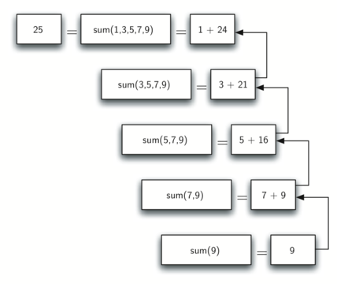
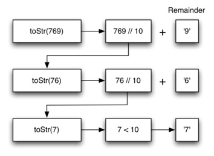
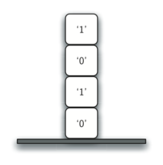
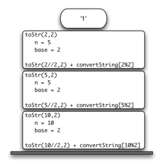

..  Copyright (C)  Brad Miller, David Ranum
    Permission is granted to copy, distribute and/or modify this document
    under the terms of the GNU Free Documentation License, Version 1.3 or 
    any later version published by the Free Software Foundation; with 
    Invariant Sections being Forward, Prefaces, and Contributor List, 
    no Front-Cover Texts, and no Back-Cover Texts.  A copy of the license
    is included in the section entitled "GNU Free Documentation License".
    
..  shortname:: IntroductionRecursion
..  description:: This is a simple introduction to the idea of recursion

Recursion
---------

Objectives
----------

The goals for this chapter are as follows:

-  To understand that complex problems that may otherwise be difficult
   to solve may have a simple recursive solution.

-  To learn how to formulate programs recursively.

-  To understand and apply the three laws of recursion.

-  To understand recursion as a form of iteration.

-  To implement the recursive formulation of a problem.

-  To understand how recursion is implemented by a computer system.

What Is Recursion?
------------------

**Recursion** is a method of solving problems that involves breaking a
problem down into smaller and smaller subproblems until you get to a
small enough problem that it can be solved trivially. Usually recursion
involves a function calling itself. While it may not seem like much on
the surface, recursion allows us to write elegant solutions to problems
that may otherwise be very difficult to program.

Calculating the Sum of a List of Numbers
~~~~~~~~~~~~~~~~~~~~~~~~~~~~~~~~~~~~~~~~

We will begin our investigation with a simple problem that you already
know how to solve without using recursion. Suppose that you want to
calculate the sum of a list of numbers such as:
:math:`[1, 3, 5, 7, 9]`. An iterative function that computes the sum
is shown in :ref:`Listing 1 <lst_itsum>`. The function uses an accumulator variable
(``theSum``) to compute a running total of all the numbers in the list
by starting with :math:`0` and adding each number in the list.

.. _lst_itsum:

.. activecode:: lst_itsum

    def listsum(numList):
        theSum = 0
        for i in numList:
            theSum = theSum + i
        return theSum
        
    print(listsum([1,3,5,7,9]))

Pretend for a minute that you do not have ``while`` loops or ``for``
loops. How would you compute the sum of a list of numbers? If you were a
mathematician you might start by recalling that addition is a function
that is defined for two parameters, a pair of numbers. To redefine the
problem from adding a list to adding pairs of numbers, we could rewrite
the list as a fully parenthesized expression. Such an expression looks
like this: 

.. math::
    ((((1 + 3) + 5) + 7) + 9)
    
We can also parenthesize
the expression the other way around,

.. math::

     (1 + (3 + (5 + (7 + 9)))) 

Notice that the innermost set of
parentheses, :math:`(7 + 9)`, is a problem that we can solve without a
loop or any special constructs. In fact, we can use the following
sequence of simplifications to compute a final sum.

.. math::

    total = \  (1 + (3 + (5 + (7 + 9)))) \\
    total = \  (1 + (3 + (5 + 16))) \\
    total = \  (1 + (3 + 21)) \\
    total = \  (1 + 24) \\
    total = \  25

How can we take this idea and turn it into a Python program? First,
let’s restate the sum problem in terms of Python lists. We might say the
the sum of the list ``numList`` is the sum of the first element of the
list (``numList[0]``), and the sum of the numbers in the rest of the
list (``numList[1:]``). To state it in a functional form:

.. math::

      listSum(numList) = first(numList) + listSum(rest(numList))
    \label{eqn:listsum}

In this equation :math:`first(numList)` returns the first element of
the list and :math:`rest(numList)` returns a list of everything but
the first element. This is easily expressed in Python as shown in
:ref:`Listing 2 <lst_recsum>`.

.. _lst_recsum:

.. activecode:: lst_recsum

    def listsum(numList):
        if len(numList) == 1:
            return numList[0]
        else:
            return numList[0] + listsum(numList[1:])
            
    print(listsum([1,3,5,7,9]))

There are a few key ideas in this listing to look at. First, on line 2 we are checking to see if the list is one element long. This
check is crucial and is our escape clause from the function. The sum of
a list of length 1 is trivial; it is just the number in the list.
Second, on line 5 our function calls itself! This is the
reason that we call the ``listsum`` algorithm recursive. A recursive
function is a function that calls itself.

:ref:`Figure 1 <fig_recsumin>` shows the series of **recursive calls** that are
needed to sum the list :math:`[1, 3, 5, 7, 9]`. You should think of
this series of calls as a series of simplifications. Each time we make a
recursive call we are solving a smaller problem, until we reach the
point where the problem cannot get any smaller.

.. _fig_recsumin:

.. figure:: Figures/sumlistIn.png
   :align: center
   :alt: image

   Series of Recursive Calls Adding a List of Numbers

When we reach the point where the problem is as simple as it can get, we
begin to piece together the solutions of each of the small problems
until the initial problem is solved. :ref:`Figure 2 <fig_recsumout>` shows the
additions that are performed as ``listsum`` works its way backward
through the series of calls. When ``listsum`` returns from the topmost
problem, we have the solution to the whole problem.

.. _fig_recsumout:

   Series of Recursive Returns from Adding a List of Numbers

The Three Laws of Recursion
~~~~~~~~~~~~~~~~~~~~~~~~~~~

Like the robots of Asimov, all recursive algorithms must obey three
important laws:

#. A recursive algorithm must have a **base case**.

#. A recursive algorithm must change its state and move toward the base
   case.

#. A recursive algorithm must call itself, recursively.

Let’s look at each one of these laws in more detail and see how it was
used in the ``listsum`` algorithm. First, a base case is the condition
that allows the algorithm to stop recursing. A base case is typically a
problem that is small enough to solve directly. In the ``listsum``
algorithm the base case is a list of length 1.

To obey the second law, we must arrange for a change of state that moves
the algorithm toward the base case. A change of state means that some
data that the algorithm is using is modified. Usually the data that
represents our problem gets smaller in some way. In the ``listsum``
algorithm our primary data structure is a list, so we must focus our
state-changing efforts on the list. Since the base case is a list of
length 1, a natural progression toward the base case is to shorten the
list. This is exactly what happens on line 5 of :ref:`Listing 2 <lst_recsum>` when we call ``listsum`` with a shorter list.

The final law is that the algorithm must call itself. This is the very
definition of recursion. Recursion is a confusing concept to many
beginning programmers. As a novice programmer, you have learned that
functions are good because you can take a large problem and break it up
into smaller problems. The smaller problems can be solved by writing a
function to solve each problem. When we talk about recursion it may seem
that we are talking ourselves in circles. We have a problem to solve
with a function, but that function solves the problem by calling itself!
But the logic is not circular at all; the logic of recursion is an
elegant expression of solving a problem by breaking it down into a
smaller and easier problems.

In the remainder of this chapter we will look at more examples of
recursion. In each case we will focus on designing a solution to a
problem by using the three laws of recursion.

Converting an Integer to a String in Any Base
~~~~~~~~~~~~~~~~~~~~~~~~~~~~~~~~~~~~~~~~~~~~~

Suppose you want to convert an integer to a string in some base between
binary and hexadecimal. For example, convert the integer 10 to its
string representation in decimal as ``"10"``, or to its string
representation in binary as ``"1010"``. While there are many algorithms
to solve this problem, including the algorithm discussed in the stack
section, the recursive formulation of the problem is very
elegant.

Let’s look at a concrete example using base 10 and the number 769.
Suppose we have a sequence of characters corresponding to the first 10
digits, like ``convString = "0123456789"``. It is easy to convert a
number less than 10 to its string equivalent by looking it up in the
sequence. For example, if the number is 9, then the string is
``convString[9]`` or ``"9"``. If we can arrange to break up the number
769 into three single-digit numbers, 7, 6, and 9, then converting it to
a string is simple. A number less than 10 sounds like a good base case.

Knowing what our base is suggests that the overall algorithm will
involve three components:

#. Reduce the original number to a series of single-digit numbers.

#. Convert the single digit-number to a string using a lookup.

#. Concatenate the single-digit strings together to form the final
   result.

The next step is to figure out how to change state and make progress
toward the base case. Since we are working with an integer, let’s
consider what mathematical operations might reduce a number. The most
likely candidates are division and subtraction. While subtraction might
work, it is unclear what we should subtract from what. Integer division
with remainders gives us a clear direction. Let’s look at what happens
if we divide a number by the base we are trying to convert to.

Using integer division to divide 769 by 10, we get 76 with a remainder
of 9. This gives us two good results. First, the remainder is a number
less than our base that can be converted to a string immediately by
lookup. Second, we get a number that is smaller than our original and
moves us toward the base case of having a single number less than our
base. Now our job is to convert 76 to its string representation. Again
we will use integer division plus remainder to get results of 7 and 6
respectively. Finally, we have reduced the problem to converting 7,
which we can do easily since it satisfies the base case condition of
:math:`n < base`, where :math:`base = 10`. The series of operations
we have just performed is illustrated in :ref:`Figure 3 <fig_tostr>`. Notice that
the numbers we want to remember are in the remainder boxes along the
right side of the diagram.

.. _fig_tostr:

   image

    Converting an Integer to a String in Base 10

:ref:`Listing 3 <lst_rectostr>` shows the Python code that implements the algorithm
outlined above for any base between 2 and 16.

.. _lst_rectostr:

.. activecode:: lst_rectostr

    def toStr(n,base):
       convertString = "0123456789ABCDEF"
       if n < base:
          return convertString[n]
       else:
          return toStr(n//base,base) + convertString[n%base]

    print(toStr(1453,16))

Notice that in line 3 we check for the base case where ``n``
is less than the base we are converting to. When we detect the base
case, we stop recursing and simply return the string from the
``convertString`` sequence. In line 6 we satisfy both the
second and third laws–by making the recursive call and by reducing the
problem size–using division.

Let’s trace the algorithm again; this time we will convert the number 10
to its base 2 string representation (``"1010"``).

.. _fig_tostr2:

.. figure:: Figures/toStrBase2.png
   :align: center
   :alt: image

   Converting the Number 10 to its Base 2 String Representation

:ref:`Figure 4 <fig_tostr2>` shows that we get the results we are looking for,
but it looks like the digits are in the wrong order. The algorithm works
correctly because we make the recursive call first on line
6, then we add the string representation of the remainder.
If we reversed returning the ``convertString`` lookup and returning the
``toStr`` call, the resulting string would be backward! But by delaying
the concatenation operation until after the recursive call has returned,
we get the result in the proper order. This should remind you of our
discussion of stacks back in the previous chapter.

.. admonition:: Self Check

   Write a function that takes a string as a parameter and returns a new string that is the reverse of the old string.

   .. actex:: recursion_sc_1

      from test import testEqual
      def reverse(s):
          return s
      
      testEqual(reverse("hello"),"olleh")
      testEqual(reverse("l"),"l")      
      testEqual(reverse("follow"),"wollof")
      testEqual(reverse(""),"")

   Write a function that takes a string as a parameter and returns True if the string is a palindrome, False otherwise.  Remember that a string is a palindrome if it is spelled the same both forward and backward.  for example:  radar is a palindrome.  for bonus points palindromes can also be phrases, but you need to remove the spaces and punctuation before checking.  for example:  madam i'm adam  is a palindrome.  Other fun palindromes include:
   
   * kayak
   * aibohphobia
   * Live not on evil
   * Reviled did I live, said I, as evil I did deliver
   * Go hang a salami; I'm a lasagna hog.
   * Able was I ere I saw Elba
   * Kanakanak --  a town in Alaska
   * Wassamassaw -- a town in South Dakota

   .. actex:: recursion_sc_2

      from test import testEqual
      def removeWhite(s):
          return s

      def isPal(s):
          return False
      
      testEqual(isPal(removeWhite("x")),True)            
      testEqual(isPal(removeWhite("radar")),True)
      testEqual(isPal(removeWhite("hello")),False)
      testEqual(isPal(removeWhite("")),True)                  
      testEqual(isPal(removeWhite("hannah")),True)      
      testEqual(isPal(removeWhite("madam i'm adam")),True)

Stack Frames: Implementing Recursion
------------------------------------

Suppose that instead of concatenating the result of the recursive call
to ``toStr`` with the string from ``convertString``, we modified our
algorithm to push the strings onto a stack prior to making the recursive
call. The code for this modified algorithm is shown in
:ref:`Listing 4 <lst_recstack>`.

.. _lst_recstack:

.. activecode:: lst_recstack

    rStack = Stack()

    def toStr(n,base):
        convertString = "0123456789ABCDEF"
        if n < base:                 
            rStack.push(convertString[n])
        else:
            rStack.push(convertString[n % base])
            toStr(n // base, base)     
            
    print(toStr(1453,16))

Each time we make a call to ``toStr``, we push a character on the stack.
Returning to the previous example we can see that after the fourth call
to ``toStr`` the stack would look like :ref:`Figure 5 <fig_recstack>`. Notice
that now we can simply pop the characters off the stack and concatenate
them into the final result, ``"1010"``.

.. _fig_recstack:

   Strings Placed on the Stack During Conversion

The previous example gives us some insight into how Python implements a
recursive function call. When a function is called in Python, a **stack
frame** is allocated to handle the local variables of the function. When
the function returns, the return value is left on top of the stack for
the calling function to access. :ref:`Figure 6 <fig_callstack>` illustrates the
call stack after the return statement on line 4.

.. _fig_callstack:

   Call Stack Generated from ``toStr(10,2)``

Notice that the call to ``toStr(2//2,2)`` leaves a return value of
``"1"`` on the stack. This return value is then used in place of the
function call (``toStr(1,2)``) in the expression ``"1" + convertString[2%2]``, which will leave the string ``"10"`` on the top of
the stack. In this way, the Python call stack takes the place of the
stack we used explicitly in :ref:`Listing 4 <lst_recstack>`. In our list summing
example, you can think of the return value on the stack taking the place
of an accumulator variable.

The stack frames also provide a scope for the variables used by the
function. Even though we are calling the same function over and over,
each call creates a new scope for the variables that are local to the
function.

If you keep this idea of the stack in your head, you will find it much
easier to write a proper recursive function.
