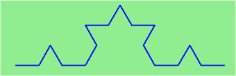

..  Copyright (C)  Jeffrey Elkner, Peter Wentworth, Allen B. Downey, Chris
    Meyers, and Dario Mitchell.  Permission is granted to copy, distribute
    and/or modify this document under the terms of the GNU Free Documentation
    License, Version 1.3 or any later version published by the Free Software
    Foundation; with Invariant Sections being Forward, Prefaces, and
    Contributor List, no Front-Cover Texts, and no Back-Cover Texts.  A copy of
    the license is included in the section entitled "GNU Free Documentation
    License".
    
..  shortname:: RecursionOverview
..  description:: This is a module about recursion with simple turtle examples

Recursion
=========

.. index:: mutable, immutable, tuple

    
.. index:: fractal, fractal; Koch, Koch fractal
    
Drawing Fractals
----------------

**Recursion** means "defining something in terms of itself" usually at some 
smaller scale, perhaps multiple times, to achieve your objective.  
For example, we might say "A human being is someone whose mother is a human being."   

For our purposes, a **fractal** is drawing which also has *self-similar* structure.
Its structure can be defined in terms of itself.

Let us start by looking at the famous Koch fractal.  An order 0 Koch fractal is simply
a straight line of a given size.

.. image:: Figures/koch_0.png

An order 1 Koch fractal is obtained like this: instead of drawing just one line,
draw instead four smaller segments, in the pattern shown here:

.. image:: Figures/koch_1.png

Now what would happen if we repeated this Koch pattern again on each of the order 1 segments?  
We'd get this order 2 Koch fractal:

Repeating our pattern again gets us an order 3 Koch fractal:

Now let us think about it the other way around.  To draw a Koch fractal
of order 3, we can simply draw four order 2 Koch fractals.  But each of these
in turn needs four order 1 Koch fractals, and each of those in turn needs four
order 0 fractals.  Ultimately, the only drawing that will take place is 
at order 0. This is very simple to code up in Python.

.. activecode:: chp12_koch
   
    import turtle

    def koch(t, order, size):
        """
           Make turtle t draw a Koch fractal of 'order' and 'size'.
           Leave the turtle facing the same direction.
        """

        if order == 0:                  # The base case is just a straight line
            t.forward(size)
        else:
            koch(t, order-1, size/3)   # go 1/3 of the way
            t.left(60)
            koch(t, order-1, size/3)
            t.right(120)
            koch(t, order-1, size/3)
            t.left(60)
            koch(t, order-1, size/3) 

    fred = turtle.Turtle()
    wn = turtle.Screen()
  
    fred.color("blue")
    wn.bgcolor("green")
    fred.penup()
    fred.backward(150)
    fred.pendown()

    koch(fred, 3, 300)

    wn.exitonclick()

Try running this program with different values for the order.  For example, try order 0, then 1, then 2, and so on.
            
The key thing that is new here is that if order is not zero,
``koch`` calls itself four times to get the job done.  This self-reference is the recursion.

.. admonition:: Recursion, the high-level view

    One way to think about this is to convince yourself that the function
    works correctly when you call it for an order 0 fractal.  Then do
    a mental *leap of faith*, saying *"the fairy godmother* (or Python, if
    you can think of Python as your fairy godmother) *knows how to 
    handle the recursive level 0 calls for me on lines 12, 14, 16, and 18, so
    I don't need to think about that detail!"*  All I need to focus on
    is how to draw an order 1 fractal *if I can assume the order 0 one is
    already working.*
    
    You're practicing *mental abstraction* --- ignoring the subproblem 
    while you solve the big problem.

    If this mode of thinking works (and you should practice it!), then take
    it to the next level.  Aha! now can I see that it will work when called
    for order 2 *under the assumption that it is already working for level 1*.  

    And, in general, if I can assume the order n-1 case works, can I just 
    solve the level n problem?

    Students of mathematics who have played with proofs of induction should
    see some very strong similarities here.  

.. index::
    single: data structure
    single: data structure; recursive
    single: recursive definition
    single: definition; recursive
    single: recursive data structure
       
Recursive Data
--------------

All of the Python data types we have seen can be grouped inside lists and
tuples in a variety of ways. Lists and tuples can also be nested, providing a
myriad possibilities for organizing data. The organization of data for the
purpose of making it easier to use is called a **data structure**.

It's election time and we are helping to compute the votes as they come in.
Votes arriving from individual wards, precincts, municipalities, counties, and
states are sometimes reported as a sum total of votes and sometimes as a list
of subtotals of votes. After considering how best to store the tallies, we
decide to use a *nested number list*, which we define as follows:

A *nested number list* is a list whose elements are either:

a. numbers
b. nested number lists

Notice that the term, *nested number list* is used in its own definition.
**Recursive definitions** like this are quite common in mathematics and
computer science. They provide a concise and powerful way to describe
**recursive data structures** that are partially composed of smaller and
simpler instances of themselves. The definition is not circular, since at some
point we will reach a list that does not have any lists as elements.

Now suppose our job is to write a function that will sum all of the values in a
nested number list. We would want to call such a function on a list where some of the
items might be numbers and some of them might be lists of numbers.

Since the problem involves processing something that is recursively defined, it is likely that
a recursive function might easily do the trick.  But how do we design such a function?

The first thing you must do to write a recursive function is define the cases where you already know the
answer. In the Koch fractal example, the order 0 case is easy.  Just draw a straight line.  We call
such a case the **base case**.  It is entirely possible that there can be many base cases in a recursive
solution.  However, in each case, we know what to do.

For this problem, the base case is also very simple.  If the list has nothing in it, the sum of all the values
must be 0.  But what if the list is not empty?  Then there must be a first item and if we take away the first item
the rest must be a list with one fewer item than before.

If we already have a function that knows how to compute the sum of a list, we can use it to compute the sum of
the rest of the list.  The only problem we need to address is how to deal with the first item.

There are two possibilities.  The first item could be a simple integer.  If that is the case, we simply add it to the
sum returned for the rest of the list.  However, if the first item is itself a list, we will need to compute its sum (good news...we already have a function that knows how to do that) and then add that to the sum returned for the rest of
the list.

Either case will call the function of a smaller part of the original list.  This is known as the **recursive call** and must
be made with a parameter value that is moving toward becoming the base case.  The complete function is shown below. 

.. index:: recursion, recursive call, base case, infinite recursion, recursion; infinite

.. activecode:: chp11_recursivesum
    
    def rSum(nestedNumList):
        if nestedNumList == []:
            return 0
        else:
            firstitem = nestedNumList[0]
            if type(firstitem) == type(87):
                return firstitem + rSum(nestedNumList[1:])
            else:
                return rSum(firstitem) + rSum(nestedNumList[1:])

    print(rSum([]))
    print(rSum([1,2,3,4]))
    print(rSum([1,2,[4,5,6],7,8]))

Note that three different calls are made to test the function.  In the first, list is empty.  This will test the base
case.  In the second, the list has no nesting.  The third requires that all parts of the recursion are working.  Try them
and then make modifications to the lists to add deeper nesting.  You might even want to try:

.. sourcecode:: python

    print(rSum([[[[[[[[[[]]]]]]]]]]))

Glossary
--------

.. glossary::

    base case
        A branch of the conditional statement in a recursive function that does
        not give rise to further recursive calls.

    data structure
        An organization of data for the purpose of making it easier to use.

    exception
        An error that occurs at runtime.

    handle an exception
        To prevent an exception from terminating a program by wrapping
        the block of code in a ``try`` / ``except`` construct.

    immutable data type
        A data type which cannot be modified.  Assignments to elements or
        slices of immutable types cause a runtime error.

    infinite recursion
        A function that calls itself recursively without ever reaching the base
        case. Eventually, an infinite recursion causes a runtime error.

    mutable data type
        A data type which can be modified. All mutable types are compound
        types.  Lists and dictionaries (see next chapter) are mutable data
        types; strings and tuples are not.

    raise
        To cause an exception by using the ``raise`` statement.

    recursion
        The process of calling the function that is already executing.

    recursive call
        The statement that calls an already executing function.  Recursion can
        even be indirect --- function `f` can call `g` which calls `h`, 
        and `h` could make a call back to `f`.

    recursive definition
        A definition which defines something in terms of itself. To be useful
        it must include *base cases* which are not recursive. In this way it
        differs from a *circular definition*.  Recursive definitions often
        provide an elegant way to express complex data structures.

    tuple
        A data type that contains a sequence of elements of any type, like a
        list, but is immutable. Tuples can be used wherever an immutable type
        is required, such as a key in a dictionary (see next chapter).

    tuple assignment
        An assignment to all of the elements in a tuple using a single
        assignment statement. Tuple assignment occurs in parallel rather than
        in sequence, making it useful for swapping values.

Exercises
---------

#.
   .. sourcecode:: python
    
        def swap(x, y):      # incorrect version
             print("before swap statement: id(x):", id(x), "id(y):", id(y))
             x, y = y, x
             print "after swap statement: id(x):", id(x), "id(y):", id(y))
    
        (a, b) = (0, 1)
        print( "before swap function call: id(a):", id(a), "id(b):", id(b)
        swap(a, b)
        print("after swap function call: id(a):", id(a), "id(b):", id(b))

   Run this program and describe the results. Use the results to explain
   why this version of ``swap`` does not work as intended. What will be the
   values of ``a`` and ``b`` after the call to ``swap``?
   
#. Modify the Koch fractal program so that it draws a Koch snowflake, like this:

   .. image:: Figures/koch_snowflake.png
   
   
.. index:: fractal; Cesaro torn square
   
#. Draw a Cesaro torn square fractal, of the order given by the user.  A torn square 
   consists of four torn lines.   We show four different squares of orders 0,1,2,3.     
   In this example, the angle of the tear is 10 degrees.   
   Varying the angle gives interesting effects --- experiment a bit, 
   or perhaps let the user input the angle of the tear. 

   .. image:: Figures/cesaro_torn_square.png
   
.. index:: fractal; Sierpinski triangle
   
#. A Sierpinski triangle of order 0 is an equilateral triangle.  
   An order 1 triangle can be drawn by drawing 3 smaller triangles 
   (shown slightly disconnected here, just to help our understanding).   
   Higher order 2 and 3 triangles are also shown.  
   Adapt the Koch snowflake program to draw Sierpinski triangles of any order 
   input by the user.   
   
   .. image:: Figures/sierpinski_original.png
  
#. Adapt the above program to draw its three major sub-triangles in different colours, 
   as shown here in this order 4 case:

   .. image:: Figures/sierpinski_colour.png
   
#. Create a module named ``seqtools.py``. Add the functions ``encapsulate`` and 
   ``insert_in_middle`` from the chapter. Add tests which test that these
   two functions work as intended with all three sequence types.
   
   
   
#. Add each of the following functions to ``seqtools.py``:

   .. sourcecode:: python
    
        def make_empty(seq): pass  
        def insert_at_end(val, seq): pass
        def insert_in_front(val, seq): pass
        def index_of(val, seq, start=0): pass
        def remove_at(index, seq): pass            
        def remove_val(val, seq): pass
        def remove_all(val, seq): pass            
        def count(val, seq): pass     
        def reverse(seq): pass
        def sort_sequence(seq): pass
        
        def testsuite():
            test(make_empty([1, 2, 3, 4]), [])
            test(make_empty(('a', 'b', 'c')), ())
            test(make_empty("No, not me!"), '')
            
            test(insert_at_end(5, [1, 3, 4, 6]), [1, 3, 4, 6, 5])
            test(insert_at_end('x', 'abc'),  'abcx')
            test(insert_at_end(5, (1, 3, 4, 6)), (1, 3, 4, 6, 5))

            test(insert_in_front(5, [1, 3, 4, 6]),   [5, 1, 3, 4, 6])
            test(insert_in_front(5, (1, 3, 4, 6)),   (5, 1, 3, 4, 6))
            test(insert_in_front('x', 'abc'),        'xabc')

            test(index_of(9, [1, 7, 11, 9, 10]), 3)
            test(index_of(5, (1, 2, 4, 5, 6, 10, 5, 5)), 3)
            test(index_of(5, (1, 2, 4, 5, 6, 10, 5, 5), 4), 6)
            test(index_of('y', 'happy birthday'), 4)
            test(ndex_of('banana', ['apple', 'banana', 'cherry', 'date']), 1)
            test(index_of(5, [2, 3, 4]), -1)
            test(index_of('b', ['apple', 'banana', 'cherry', 'date']), -1)
     
            test(remove_at(3, [1, 7, 11, 9, 10]), [1, 7, 11, 10])
            test(remove_at(5, (1, 4, 6, 7, 0, 9, 3, 5)), (1, 4, 6, 7, 0, 3, 5))
            test(remove_at(2, "Yomrktown"), 'Yorktown')
          
            test(remove_val(11, [1, 7, 11, 9, 10]), [1, 7, 9, 10])
            test(remove_val(15, (1, 15, 11, 4, 9)), (1, 11, 4, 9))
            test(remove_val('what', ('who', 'what', 'when', 'where', 'why', 'how')),
                  ('who', 'when', 'where', 'why', 'how'))
             
            test(remove_all(11, [1, 7, 11, 9, 11, 10, 2, 11]),  [1, 7, 9, 10, 2])
            test(remove_all('i', 'Mississippi'), 'Msssspp')
             
            test(count(5, (1, 5, 3, 7, 5, 8, 5)), 3)
            test(count('s', 'Mississippi'), 4)
            test(count((1, 2), [1, 5, (1, 2), 7, (1, 2), 8, 5]), 2)
            
            test(reverse([1, 2, 3, 4, 5]), [5, 4, 3, 2, 1])
            test(reverse(('shoe', 'my', 'buckle', 2, 1)), (1, 2, 'buckle', 'my', 'shoe'))
            test(reverse('Python'), 'nohtyP')         
                
            test(sort_sequence([3, 4, 6, 7, 8, 2]),  [2, 3, 4, 6, 7, 8])
            test(sort_sequence((3, 4, 6, 7, 8, 2)),  (2, 3, 4, 6, 7, 8))
            test(sort_sequence("nothappy"), 'ahnoppty')
         
   As usual, work on each of these one at a time until they pass all the tests.
   
   .. admonition:: But do you really want to do this?
   
       Disclaimer.  These exercises illustrate nicely that the sequence abstraction is
       general, (because slicing, indexing, and concatenation is so general), so it is possible to 
       write general functions that work over all sequence types.  Nice lesson about generalization!
       
       Another view is that tuples are different from lists and strings precisely 
       because you want to think about them very differently. 
       It usually doesn't make sense to sort the fields of the `julia`
       tuple we saw earlier, or to cut bits out or insert bits into the middle, 
       *even if Python lets you do so!*  
       Tuple fields get their meaning from their position in the tuple.  
       Don't mess with that.
       
       Use lists for "many things of the same type", like an 
       enrollment of many students for a course.
       
       Use tuples for "fields of different types that make up a compound record". 
  
   
#. Write a function, ``recursive_min``, that returns the smallest value in a
   nested number list.  Assume there are no empty lists or sublists:

   .. sourcecode:: python
    
        test(recursive_min([2, 9, [1, 13], 8, 6]), 1)
        test(recursive_min([2, [[100, 1], 90], [10, 13], 8, 6]), 1)
        test(recursive_min([2, [[13, -7], 90], [1, 100], 8, 6]), -7)
        test(recursive_min([[[-13, 7], 90], 2, [1, 100], 8, 6]), 13)
 
#. Write a function ``count`` that returns the number of occurences
   of ``target`` in  a nested list:

   .. sourcecode:: python
    
        test(count(2, []), 0)
        test(count(2, [2, 9, [2, 1, 13, 2], 8, [2, 6]]), 4)
        test(count(7, [[9, [7, 1, 13, 2], 8], [7, 6]]), 2)
        test(count(15, [[9, [7, 1, 13, 2], 8], [2, 6]]), 0)
        test(count(5, [[5, [5, [1, 5], 5], 5], [5, 6]]), 6)
        test(count('a', [['this', ['a', ['thing', 'a'], 'a'], 'is'], ['a', 'easy']]), 5)
 
#. Write a function ``flatten`` that returns a simple list  
   containing all the values in a nested list:

   .. sourcecode:: python
    
       test(flatten([2, 9, [2, 1, 13, 2], 8, [2, 6]]), [2, 9, 2, 1, 13, 2, 8, 2, 6])
       test(flatten([[9, [7, 1, 13, 2], 8], [7, 6]]), [9, 7, 1, 13, 2, 8, 7, 6])
       test(flatten([[9, [7, 1, 13, 2], 8], [2, 6]]), [9, 7, 1, 13, 2, 8, 2, 6])
       test(flatten([['this', ['a', ['thing'], 'a'], 'is'], ['a', 'easy']]), 
                     ['this', 'a', 'thing', 'a', 'is', 'a', 'easy'])
       test(flatten([]), [])
       
#. Rewrite the fibonacci algorithm without using recursion. Can you find bigger
   terms of the sequence?  Can you find ``fib(200)``?
                 
#. Write a function named ``readposint`` that uses the ``input`` dialog to
   prompt the user for a positive
   integer and then checks the input to confirm that it meets the requirements. 
   It should be able to handle inputs that cannot be converted to int, as well
   as negative ints, and edge cases (e.g. when the user closes the dialog, or
   does not enter anything at all.)   
   
#. Use help to find out what ``sys.getrecursionlimit()`` and
   ``sys.setrecursionlimit(n)`` do. Create several *experiments* similar to what
   was done in ``infinite_recursion.py`` to test your understanding of how
   these module functions work.
   
#. Write a program that walks a directory structure (as in the last section of
   this chapter), but instead of printing filenames, it returns a list of all
   the full paths of files in the directory or the subdirectories.  (Don't include
   directories in this list --- just files.)  For example, the output list might
   have elements like this::
   
      ['C:\Python31\Lib\site-packages\pygame\docs\ref\mask.html',
       'C:\Python31\Lib\site-packages\pygame\docs\ref\midi.html',
       ...
       'C:\Python31\Lib\site-packages\pygame\examples\aliens.py',
       ...
       'C:\Python31\Lib\site-packages\pygame\examples\data\boom.wav', 
       ... ]   

#. Write a program named ``litter.py`` that creates an empty file named
   ``trash.txt`` in each subdirectory of a directory tree given the root of the 
   tree as an argument (or the current directory as a default). Now write a
   program named ``cleanup.py`` that removes all these files.  *Hint:* Use the
   program from the example in the last section of this chapter as a basis for 
   these two recursive programs.  Because you're going to destroy files on your disks, you better
   get this right, or you risk losing files you care about.  So excellent
   advice is that initially you should fake the deletion of the files --- just print
   the full path names of each file that you intent to delete.  Once you're happy
   that your logic is correct, and you can see that you're not deleting the wrong
   things, you can replace the print statement with the real thing.
   
