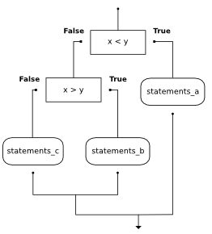
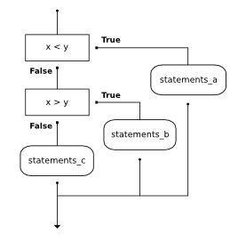

..  Copyright (C)  Brad Miller, David Ranum, Jeffrey Elkner, Peter Wentworth, Allen B. Downey, Chris
    Meyers, and Dario Mitchell.  Permission is granted to copy, distribute
    and/or modify this document under the terms of the GNU Free Documentation
    License, Version 1.3 or any later version published by the Free Software
    Foundation; with Invariant Sections being Forward, Prefaces, and
    Contributor List, no Front-Cover Texts, and no Back-Cover Texts.  A copy of
    the license is included in the section entitled "GNU Free Documentation
    License".

Decisions and Selection
=======================

.. index::
    single: modulus operator
    single: operator; modulus

.. index::
    single: boolean value
    single: value; boolean
    single: boolean expression
    single: expression; boolean
    single: logical operator
    single: operator; logical 
    single: operator; comparison
    single: comparison operator

Boolean Values and Boolean Expressions
--------------------------------------

.. video:: booleanexpressions
   :controls:
   :thumb: ../_static/booleanexpressions.png

   http://knuth.luther.edu/~pythonworks/thinkcsVideos/booleanexpressions.mov
   http://knuth.luther.edu/~pythonworks/thinkcsVideos/booleanexpressions.webm

The Python type for storing true and false values is called ``bool``, named
after the British mathematician, George Boole. George Boole created *Boolean
Algebra*, which is the basis of all modern computer arithmetic.

There are only two **boolean values**.  They are ``True`` and ``False``.  Capitalization
is important, since ``true`` and ``false`` are not boolean values (remember Python is case
sensitive).

.. activecode:: ch05_1
    
    print(True)
    print(type(True))
    print(type(False))

.. note:: Boolean values are not strings!

    It is extremely important to realize that True and False are not strings.   They are not
    surrounded by quotes.  They are the only two values in the data type ``bool``.  Take a close look at the
    types shown below.

.. activecode:: ch05_1a

    print(type(True))
    print(type("True"))

A **boolean expression** is an expression that evaluates to a boolean value.
The equality operator, ``==``, compares two values and produces a boolean value related to whether the
two values are equal to one another.

.. activecode:: ch05_2
    
    print(5 == 5)
    print(5 == 6)

In the first statement, the two operands are equal, so the expression evaluates
to ``True``.  In the second statement, 5 is not equal to 6, so we get ``False``.

The ``==`` operator is one of six common **comparison operators**; the others are:

.. sourcecode:: python
    
    x != y               # x is not equal to y
    x > y                # x is greater than y
    x < y                # x is less than y
    x >= y               # x is greater than or equal to y
    x <= y               # x is less than or equal to y

Although these operations are probably familiar to you, the Python symbols are
different from the mathematical symbols. A common error is to use a single
equal sign (``=``) instead of a double equal sign (``==``). Remember that ``=``
is an assignment operator and ``==`` is a comparison operator. Also, there is
no such thing as ``=<`` or ``=>``.

.. With reassignment it is especially important to distinguish between an
.. assignment statement and a boolean expression that tests for equality. 
.. Because Python uses the equal token (``=``) for assignment, 
.. it is tempting to interpret a statement like
.. ``a = b`` as a boolean test.  Unlike mathematics, it is not!  Remember that the Python token
.. for the equality operator is ``==``.

Note too that an equality test is symmetric, but assignment is not. For example, 
if ``a == 7`` then ``7 == a``. But in Python, the statement ``a = 7``
is legal and ``7 = a`` is not. (Can you explain why?)

.. admonition:: Scratch Editor

    .. actex:: scratch_6_1

.. index::
    single: logical operator
    single: operator; logical 
    
Logical operators
-----------------

There are three **logical operators**: ``and``, ``or``, and ``not``. The
semantics (meaning) of these operators is similar to their meaning in English.
For example, ``x > 0 and x < 10`` is true only if ``x`` is greater than 0 *and*
at the same time, x is less than 10.  How would you describe this in words?  You would say that
x is between 0 and 10, not including the endpoints.

``n % 2 == 0 or n % 3 == 0`` is true if *either* of the conditions is true,
that is, if the number is divisible by 2 *or* divisible by 3.  In this case, one, or the other, or
both of the parts has to be true for the result to be true.

Finally, the ``not`` operator negates a boolean expression, so ``not  x > y``
is true if ``x > y`` is false, that is, if ``x`` is less than or equal to
``y``.

.. activecode:: chp05_3

    x = 5
    print(x>0 and x<10)
 
    n = 25
    print(n%2 == 0 or n%3 == 0)

.. admonition:: Common Mistake!

	There is a very common mistake that occurs when programmers try to write boolean expressions.  For example, what if we have a variable ``number`` and we want to check to see if its value is 5,6, or 7.  In words we might say: "number equal to 5 or 6 or 7".  However, if we translate this into Python, ``number == 5 or 6 or 7``, it will not be correct.  The ``or`` operator must join the results of three equality checks.  The correct way to write this is ``number == 5 or number == 6 or number == 7``.  This may seem like a lot of typing but it is absolutely necessary.  You cannot take a shortcut.

.. admonition:: Scratch Editor

    .. actex:: scratch_6_2

Precedence of Operators
-----------------------

We have now added a number of additional operators to those we learned in the previous chapters.  It is important to understand how these operators relate to the others with respect to operator precedence.  Python will always evaluate the arithmetic operators first (** is highest, then multiplication/division, then addition/subtraction).  Next comes the relational operators.  Finally, the logical operators are done last.  This means that the expression ``x*5 >= 10 and y-6 <= 20`` will be evaluated so as to first perform the arithmetic and then check the relationships.  The ``and`` will be done last.  Although many programmers might place parenthesis around the two relational expressions, it is not necessary. 

The following table summarizes the operator precedence from highest to lowest.  A complete table for the entire language can be found in the `Python Documentation <http://docs.python.org/py3k/reference/expressions.html#expression-lists>`_.

=======   ==============  ===============
Level     Category        Operators
=======   ==============  ===============
7(high)   exponent        \**
6         multiplication  \*,/,//,%
5         addition        +,-
4         relational      ==,!=,<=,>=,>,<
3         logical         not
2         logical         and
1(low)    logical         or
=======   ==============  ===============

.. admonition:: Scratch Editor

    .. actex:: scratch_6_3

.. index:: conditional branching, conditional execution, if, elif, else,
           if statement, compound statement, statement block, block, body,
           pass statement

.. index::
    single: statement; if
    single: compound statement; header
    single: compound statement; body
    single: conditional statement
    single: statement; pass

Conditional Execution: Binary Selection
---------------------------------------

.. video:: binaryselection
   :controls:
   :thumb: ../_static/binaryselection.png

   http://knuth.luther.edu/~pythonworks/thinkcsVideos/binaryselection.mov
   http://knuth.luther.edu/~pythonworks/thinkcsVideos/binaryselection.webm

In order to write useful programs, we almost always need the ability to check
conditions and change the behavior of the program accordingly. **Selection statements**, sometimes
also referred to as **conditional statements** give us this ability. The simplest form of selection is the **if**
statement.  This is sometimes referred to as **binary selection** since there are two possible paths of execution.

.. activecode:: ch05_4
    
    x = 15

    if x % 2 == 0:
        print(x, "is even")
    else:
        print(x, "is odd")    

The syntax for an ``if`` statement looks like this:

.. sourcecode:: python

    if BOOLEAN EXPRESSION:
        STATEMENTS_1        # executed if condition evaluates to True
    else:
        STATEMENTS_2        # executed if condition evaluates to False

The boolean expression after the ``if`` statement is called the **condition**.
If it is true, then the indented statements get executed. If not, then the statements
indented under the `else` clause get executed. 

.. sidebar::  Flowchart of a **if** statement with an **else** 

   .. image:: Figures/flowchart_if_else.png  

As with the function definition from the last chapter and other compound
statements like ``for``, the ``if`` statement consists of a header line and a body. The header
line begins with the keyword ``if`` followed by a *boolean expression* and ends with
a colon (:).

The indented statements that follow are called a **block**. The first
unindented statement marks the end of the block. 

Each of the statements inside the first block of statements is executed in order if the boolean
expression evaluates to ``True``. The entire first block of statements 
is skipped if the boolean expression evaluates to ``False``, and instead
all the statements under the ``else`` clause are executed. 

There is no limit on the number of statements that can appear under the two clauses of an
``if`` statement, but there has to be at least one statement in each block.  

.. admonition:: Lab

    * `Approximating Pi with Simulation <montepi.html>`_ In this guided lab exercise we will work
      through a problem solving exercise related to approximating the value of pi using random numbers.

.. admonition:: Scratch Editor

    .. actex:: scratch_6_4

.. index:: alternative execution, branch, wrapping code in a function

Omitting the `else` Clause: Unary Selection
-------------------------------------------

.. video:: unaryselection
   :controls:
   :thumb: ../_static/unaryselection.png

   http://knuth.luther.edu/~pythonworks/thinkcsVideos/unaryselection.mov
   http://knuth.luther.edu/~pythonworks/thinkcsVideos/unaryselection.webm

.. sidebar::  Flowchart of an **if** with no **else** 

   .. image:: Figures/flowchart_if_only.png

Another form of the ``if`` statement is one in which the ``else`` clause is omitted entirely.  
This creates what is sometimes called **unary selection**.
In this case, when the condition evaluates to ``True``, the statements are
executed, otherwise the flow of execution continues to the statement after the ``if``.

      
.. activecode:: ch05_unaryselection
    
    x = 10
    if x < 0:
        print("The negative number ",  x, " is not valid here.")
    print("This is always printed")   

What would be printed if the value of `` x`` is negative?  Try it.

.. admonition:: Scratch Editor

    .. actex:: scratch_6_5

.. index::
    single: nested conditionals
    single: conditionals; nested

Nested conditionals
-------------------

One conditional can also be **nested** within another. For example, assume we have two integer variables, ``x`` and ``y``.
The following pattern of selection shows how we might decide how they are related to each other.

.. sourcecode:: python

    if x < y:
        print("x is less than y")
    else:
        if x > y:
            print("x is greater than y")
        else:
            print("x and y must be equal")

The outer conditional contains two branches. 
The second branch (the else from the outer) contains another ``if`` statement, which
has two branches of its own. Those two branches could contain
conditional statements as well.  

The flow of control can be seen in this flowchart illustration.

Here is a complete program that defines values for ``x`` and ``y``.  Run the program and see the result.  Then change the values of the variables to change the flow of control.

.. activecode:: sel2

    x = 10
    y = 10

    if x < y:
        print("x is less than y")
    else:
        if x > y:
            print("x is greater than y")
        else:
            print("x and y must be equal")

.. note::

	In some programming languages, matching the if and the else is a problem.  However, in Python this is not the case.
	The indentation pattern tells us exactly which else
	belongs to which if.
        
If you are still a bit unsure, here is the same selection as part of a codelens example.  Step through it to see how the correct ``print`` is chosen.

.. codelens:: sel1

    x = 10
    y = 10

    if x < y:
        print("x is less than y")
    else:
        if x > y:
            print("x is greater than y")
        else:
            print("x and y must be equal")

.. admonition:: Scratch Editor

    .. actex:: scratch_6_6

.. index::
    single: chained conditional 
    single: conditional; chained

Chained conditionals
--------------------

Python provides an alternative way to write nested selection such as the one shown in the previous section.
This is sometimes referred to as a **chained
conditional**
   
.. sourcecode:: python
    
    if x < y:
        print("x is less than y")
    elif x > y:
        print("x is greater than y")
    else:
        print("x and y must be equal")

The flow of control can be drawn in a different orientation but the resulting pattern is identical to the one shown above.

        
``elif`` is an abbreviation of ``else if``. Again, exactly one branch will be
executed. There is no limit of the number of ``elif`` statements but only a
single (and optional) final ``else`` statement is allowed and it must be the last
branch in the statement.

Each condition is checked in order. If the first is false, the next is checked,
and so on. If one of them is true, the corresponding branch executes, and the
statement ends. Even if more than one condition is true, only the first true
branch executes.

Here is the same program using ``elif``.

.. activecode:: sel4

    x = 10
    y = 10

    if x < y:
        print("x is less than y")
    elif x > y:
        print("x is greater than y")
    else:
        print("x and y must be equal")

.. admonition:: Scratch Editor

    .. actex:: scratch_6_7

Boolean Functions
-----------------

Functions can return boolean values, which is often convenient for hiding
complicated tests inside functions. For example:

.. activecode:: ch06_boolfun1
    
    def isDivisible(x, y):
        if x % y == 0:
            result = True 
        else:
            result = False

        return result 

    print(isDivisible(10,5))

The name of this function is ``isDivisible``. It is common to give **boolean
functions** names that sound like yes/no questions.  ``isDivisible`` returns
either ``True`` or ``False`` to indicate whether the ``x`` is or is not
divisible by ``y``.

We can make the function more concise by taking advantage of the fact that the
condition of the ``if`` statement is itself a boolean expression. We can return
it directly, avoiding the ``if`` statement altogether:

.. sourcecode:: python
    
    def isDivisible(x, y):
        return x % y == 0

Boolean functions are often used in conditional statements:

.. sourcecode:: python
    
    if isDivisible(x, y):
        ... # do something ...
    else:
        ... # do something else ...

It might be tempting to write something like
``if isDivisible(x, y) == True:``
but the extra comparison is  not necessary.  The following example shows the ``isDivisible`` function at work.  Try it
with a few other actual parameters to see what is printed.

.. activecode:: ch06_boolfun2
    
    def isDivisible(x, y):
        if x % y == 0:
            result = True 
        else:
            result = False 

        return result

    if isDivisible(10,5):
        print("That works")
    else:
        print("Those values are no good")

Here is the same program in codelens.

.. codelens:: ch06_boolcodelens

    def isDivisible(x, y):
        if x % y == 0:
            result = True 
        else:
            result = False 

        return result

    if isDivisible(10,5):
        print("That works")
    else:
        print("Those values are no good")

.. admonition:: Scratch Editor

    .. actex:: scratch_6_8

Glossary
--------

.. glossary::

    block
        A group of consecutive statements with the same indentation.

    body
        The block of statements in a compound statement that follows the
        header.

    boolean expression
        An expression that is either true or false.

    boolean function
        A function that returns a boolean value.  The only possible
        values of the ``bool`` type are ``False`` and ``True``.

    boolean value
        There are exactly two boolean values: ``True`` and ``False``. Boolean
        values result when a boolean expression is evaluated by the Python
        interepreter.  They have type ``bool``.

    branch
        One of the possible paths of the flow of execution determined by
        conditional execution.

    chained conditional
        A conditional branch with more than two possible flows of execution. In
        Python chained conditionals are written with ``if ... elif ... else``
        statements.

    comparison operator
        One of the operators that compares two values: ``==``, ``!=``, ``>``,
        ``<``, ``>=``, and ``<=``.

    condition
        The boolean expression in a conditional statement that determines which
        branch is executed.

    conditional statement
        A statement that controls the flow of execution depending on some
        condition. In Python the keywords ``if``, ``elif``, and ``else`` are
        used for conditional statements.

    logical operator
        One of the operators that combines boolean expressions: ``and``,
        ``or``, and ``not``.

    modulus operator
        An operator, denoted with a percent sign ( ``%``), that works on
        integers and yields the remainder when one number is divided by
        another.

    nesting
        One program structure within another, such as a conditional statement
        inside a branch of another conditional statement.

Exercises
---------

#.  What do these expressions evaluate to?

    #.  ``3 == 3``
    #.  ``3 != 3``
    #.  ``3 >= 4``
    #.  ``not (3 < 4)``

        .. actex:: ex_6_1

   
#.  Give the **logical opposites** of these conditions.  You are not allowed to use the ``not`` operator.
    
    #.  ``a > b`` 
    #.  ``a >= b``
    #.  ``a >= 18  and  day == 3``
    #.  ``a >= 18  and  day != 3``
    
        .. actex:: ex_6_2
    
#.  Write a function which is given an exam mark, and it returns a string --- the grade for that mark --- according to this 
    scheme:   
    
    .. table::  
    
       =======   =====
       Mark      Grade
       =======   =====
       >= 90     A  
       [80-90)   B   
       [70-80)   C   
       [60-70)   D 
       < 60      F   
       =======   =====    
    
    The square and round brackets denote closed and open intervals. 
    A closed interval includes the number, and open interval excludes it.   So 79.99999 gets grade C , but 80 gets grade B.
    
    Let ``xs = [83, 75, 74.9, 70, 69.9, 65, 60, 59.9, 55, 50, 49.9, 45, 44.9, 40, 39.9, 2, 0]`` 
    
    Test your function by printing the mark and the grade for all the elements in this list.
    
    .. actex:: ex_6_3

#.  Modify the turtle bar chart program so that the bar for any value 
    of 200 or more is filled with red, values between [100 and 200) are filled yellow,
    and bars representing values less than 100 are filled green.    
  
    .. actex:: ex_6_4

#.  In the turtle bar chart program, what do you expect to happen if one or more 
    of the data values in the list is negative?   Try it out.  Change the
    program so that when it prints the text value for the negative bars, it puts
    the text below the bottom of the bar. 
  
    .. actex:: ex_6_5

#.  Write a function ``findHypot`` which, given the length of two sides of a right-angled triangle, returns
    the length of the hypotenuse.  (Hint:  ``x ** 0.5`` will return the square root, or use ``sqrt`` from the math module)
    
    .. actex:: ex_6_6

#. Write a function called ``is_even(n)`` that takes an integer as an argument
   and returns ``True`` if the argument is an **even number** and ``False`` if
   it is **odd**.

    
   .. actex:: ex_6_7

#. Now write the function ``is_odd(n)`` that returns ``True`` when ``n`` is odd
   and ``False`` otherwise.

   .. actex:: ex_6_8

#. Modify ``is_odd`` so that it uses a call to ``is_even`` to determine if its 
   argument is an odd integer.

   .. actex:: ex_6_9

#.  Write a function ``is_rightangled`` which, given the length of three sides of a triangle, 
    will determine whether the triangle is right-angled.  Assume that the third argument to the
    function is always the longest side.  It will return ``True`` if the triangle 
    is right-angled, or ``False`` otherwise.  
    
    Hint: floating point arithmetic is not always exactly accurate,
    so it is not safe to test floating point numbers for equality. 
    If a good programmer wants to know whether
    ``x`` is equal or close enough to ``y``, they would probably code it up as
    
    .. sourcecode:: python
    
      if  abs(x-y) < 0.000001:      # if x is approximately equal to y
          ...    
   

    .. actex:: ex_6_10

#.  Extend the above program so that the sides can be given to the function in any order.

    .. actex:: ex_6_11

#.  A year is a **leap year** if it is divisible by 4 unless it is a century that is not divisible by 400.
    Write a function that takes a year as a parameter and returns ``True`` if the year is a leap year, ``False`` otherwise.

    .. actex:: ex_6_12

        from test import testEqual

        def isLeap(year):
            # your code here

        testEqual(isLeap(1944), True)
        testEqual(isLeap(2011), False)
        testEqual(isLeap(1986), False)
        testEqual(isLeap(1800), False)
        testEqual(isLeap(1900), False)
        testEqual(isLeap(2000), True)
        testEqual(isLeap(2056), True)

#.  Implement the Date of Easter program as described in class.

    .. actex:: ex_6_13

.. admonition:: Scratch Editor

    .. actex:: scratch_6_9

.. toctree::
    :hidden:

    ../Labs/montepi

