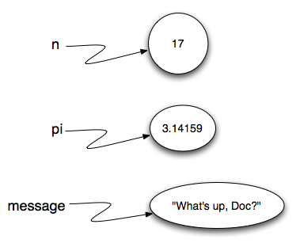
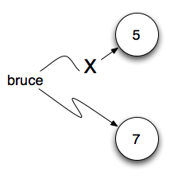

..  Copyright (C)  Brad Miller, David Ranum, Jeffrey Elkner, Peter Wentworth, Allen B. Downey, Chris
    Meyers, and Dario Mitchell.  Permission is granted to copy, distribute
    and/or modify this document under the terms of the GNU Free Documentation
    License, Version 1.3 or any later version published by the Free Software
    Foundation; with Invariant Sections being Forward, Prefaces, and
    Contributor List, no Front-Cover Texts, and no Back-Cover Texts.  A copy of
    the license is included in the section entitled "GNU Free Documentation
    License".
    
..  shortname:: SimplePythonData
..  description:: An introduction to data and variables in python

Variables, Expressions and Statements
=====================================

.. index:: value, data type, string, integer, int, float, class

.. index::
    single: triple quoted string

.. _values_n_types:

.. video:: typesnconvert
    :controls:
    :thumb: ../_static/valuesNtypes.png

    http://knuth.luther.edu/~bmiller/thinkcsVideos/TypesNTypeConversion.mov
    http://knuth.luther.edu/~bmiller/thinkcsVideos/TypesNTypeConversion.webm

In order to get started learning any programming language there are a number of
concepts and ideas that are necessary.  
The goal of this chapter is to introduce you to the basic vocabulary of programming and some of the fundamental
building blocks of Python.

Values and Data Types
---------------------

A **value** is one of the fundamental things --- like a word or a number ---
that a program manipulates. The values we have seen so far are ``5`` (the
result when we added ``2 + 3``), and ``"Hello, World!"``.  We often refer to these values as **objects** and we will use the words value and object interchangeably.

.. note::
	Actually, the 2 and the 3 that are part of the addition above are values(objects) as well.

These objects are classified into different **classes**, or **data types**: ``4`` 
is an *integer*, and ``"Hello, World!"`` is a *string*, so-called because it
contains a string or sequence of letters. You (and the interpreter) can identify strings
because they are enclosed in quotation marks.

If you are not sure what class a value falls into, Python has a function called
**type** which can tell you.

.. activecode:: ch02_1
    :nocanvas:

    print(type("Hello, World!"))
    print(type(17))
    print("Hello, World")

Not surprisingly, strings belong to the class **str** and integers belong to the
class **int**. 

.. note::

	When we show the value of a string using the ``print`` function, such as in the third example above, the quotes are no longer present.  The
	value of the string is the sequence of characters inside the quotes.  The quotes are only necessary to help Python know what the value is.

In the Python shell, it is not necessary to use the ``print`` function to see the values shown above.  The shell evaluates the Python function and automatically prints the result.  For example, consider the shell session shown below.  When
we ask the shell to evaluate ``type("Hello, World!")``, it responds with the appropriate answer and then goes on to
display the prompt for the next use.

.. sourcecode:: python

	Python 3.1.2 (r312:79360M, Mar 24 2010, 01:33:18) 
	[GCC 4.0.1 (Apple Inc. build 5493)] on darwin
	Type "help", "copyright", "credits" or "license" for more information.
	>>> type("Hello, World!")
	<class 'str'>
	>>> type(17)
	<class 'int'>
	>>> "Hello, World"
	'Hello, World'
	>>> 

Note that in the last example, we simply ask the shell to evaluate the string "Hello, World".  The result is as you might expect, the string itself.

Continuing with our discussion of data types, numbers with a decimal point belong to a class
called **float**, because these numbers are represented in a format called
*floating-point*.  At this stage, you can treat the words *class* and *type*
interchangeably.  We'll come back to a deeper understanding of what a class 
is in later chapters. 

.. activecode:: ch02_2
    :nocanvas:

    print(type(3.2))

What about values like ``"17"`` and ``"3.2"``? They look like numbers, but they
are in quotation marks like strings.

.. activecode:: ch02_3
    :nocanvas:

    print(type("17"))
    print(type("3.2"))

They're strings!

Strings in Python can be enclosed in either single quotes (``'``) or double
quotes (``"``), or three of each (``'''`` or ``"""``)

.. activecode:: ch02_4
    :nocanvas:

    print(type('This is a string.') )
    print(type("And so is this.") )
    print(type("""and this.""") )
    print(type('''and even this...''') )

    
Double quoted strings can contain single quotes inside them, as in ``"Bruce's
beard"``, and single quoted strings can have double quotes inside them, as in
``'The knights who say "Ni!"'``. 
Strings enclosed with three occurrences of either quote symbol are called
triple quoted strings.  They can contain either single or double quotes: 

.. activecode:: ch02_5
    :nocanvas:

    print('''"Oh no", she exclaimed, "Ben's bike is broken!"''')

Triple quoted strings can even span multiple lines:

.. activecode:: ch02_6
    :nocanvas:

    message = """This message will
    span several
    lines."""
    print(message)

    print("""This message will span
    several lines
    of the text.""")

Python doesn't care whether you use single or double quotes or the
three-of-a-kind quotes to surround your strings.  Once it has parsed the text of
your program or command, the way it stores the value is identical in all cases,
and the surrounding quotes are not part of the value. But when the interpreter
wants to display a string, it has to decide which quotes to use to make it look
like a string. 

.. activecode:: ch02_7
    :nocanvas:

    print('This is a string.')
    print("""And so is this.""")

So the Python language designers usually chose to surround their strings by
single quotes.  What do think would happen if the string already contained
single quotes?

When you type a large integer, you might be tempted to use commas between
groups of three digits, as in ``42,000``. This is not a legal integer in
Python, but it does mean something else, which is legal:

.. activecode:: ch02_8
    :nocanvas:

    print(42000)
    print(42,000)

Well, that's not what we expected at all! Because of the comma, Python chose to
treat this as a *pair* of values.     In fact, the print function can print any number of values as long
as you separate them by commas.  Notice that the values are separated by spaces when they are displayed.

.. activecode:: ch02_8a
    :nocanvas:

    print(42, 17, 56, 34, 11, 4.35, 32)
    print(3.4, "hello", 45)

Remember not to put commas or spaces in your integers, no
matter how big they are. Also revisit what we said in the previous chapter:
formal languages are strict, the notation is concise, and even the smallest
change might mean something quite different from what you intended. 

**Check your understanding**

.. mchoicemf:: test_question2_1_1
   :answer_a: Print out the value and determine the data type based on the value printed.
   :answer_b: Use the type function.
   :answer_c: Use it in a known equation and print the result.
   :answer_d: Look at the declaration of the variable.
   :correct: b
   :feedback_a: You may be able to determine the data type based on the printed value, but it may also be  deceptive, like when a string prints, there are no quotes around it. 
   :feedback_b: The type function will tell you the class the value belongs to.
   :feedback_c: Only numeric values can be used in equations.
   :feedback_d: In Python variables are not declared.

   How can you determine the type of a variable?

.. mchoicemf:: test_question2_1_2
   :answer_a: character
   :answer_b: integer
   :answer_c: float
   :answer_d: string
   :correct: d
   :feedback_a: It is not a single character.
   :feedback_b: The data is not numeric.
   :feedback_c: The value is not numeric with a decimal.
   :feedback_d: Strings can be enclosed in single quotes.

   What is the data type of 'this is what kind of data'?
    

.. index:: type converter functions, int, float, str, truncation

Type conversion functions
-------------------------
    
Sometimes it is necessary to convert values from one type to another.  Python provides
a few simple functions that will allow us to do that.  The functions `int`, `float` and `str`
will (attempt to) convert their arguments into types `int`, `float` and `str`
respectively.  We call these **type conversion** functions.  

The `int` function can take a floating point number or a string, and turn it
into an int. For floating point numbers, it *discards* the decimal portion of
the number - a process we call *truncation towards zero* on the number line.
Let us see this in action:

.. activecode:: ch02_20
    :nocanvas:

    print(3.14, int(3.14))
    print(3.9999, int(3.9999))       # This doesn't round to the closest int!
    print(3.0,int(3.0))
    print(-3.999,int(-3.999))        # Note that the result is closer to zero

    print("2345",int("2345"))        # parse a string to produce an int
    print(17,int(17))                # int even works on integers
    print(int("23bottles"))

The last case shows that a string has to be a syntactically legal number,
otherwise you'll get one of those pesky runtime errors.  Modify the example by deleting the
``bottles`` and rerun the program.  You should see the integer ``23``.

The type converter `float` can turn an integer, a float, or a syntactically
legal string into a float.

.. activecode:: ch02_21
    :nocanvas:

    print(float("123.45"))
    print(type(float("123.45")))

The type converter `str` turns its argument into a string.  Remember that when we print a string, the
quotes are removed.  However, if we print the type, we can see that it is definitely `str`.

.. activecode:: ch02_22
    :nocanvas:

    print(str(17))
    print(str(123.45))
    print(type(str(123.45)))

**Check your understanding**

.. mchoicemf:: test_question2_2_1
   :answer_a: Nothing, it generates a runtime error.
   :answer_b: 53
   :answer_c: 54
   :answer_d: 53.785
   :correct: b
   :feedback_a: The statement is valid Python code.  It calls the int function on 53.785 and then prints the value that is returned.
   :feedback_b: The int function truncates all values after the decimal and prints the integer value.
   :feedback_c: When converting to an integer, the int function does not round.
   :feedback_d: The int function removes the fractional part of 53.785 and returns an integer, which is what is printed.

   What value is printed by the following statement:
   <pre>
   print( int(53.785) )  
   </pre>

.. index:: variable, assignment, assignment statement, state snapshot

Variables
---------

.. video:: assignvid
    :controls:
    :thumb: ../_static/assignment.png

    http://knuth.luther.edu/~bmiller/thinkcsVideos/Variables.mov
    http://knuth.luther.edu/~bmiller/thinkcsVideos/Variables.webm

One of the most powerful features of a programming language is the ability to
manipulate **variables**. A variable is a name that refers to a value.

**Assignment statements** create new variables and also give them values to refer to.

.. sourcecode:: python
    
    message = "What's up, Doc?"
    n = 17
    pi = 3.14159

This example makes three assignments. The first assigns the string value
``"What's up, Doc?"`` to a new variable named ``message``. The second gives the
integer ``17`` to ``n``, and the third assigns the floating-point number
``3.14159`` to a variable called ``pi``.

The **assignment token**, ``=``, should not be confused with *equals*, which
uses the token `==`.  The assignment statement links a *name*, on the left hand
side of the operator, with a *value*, on the right hand side.  This is why you
will get an error if you enter:

.. sourcecode:: python
    
    17 = n
    
.. tip::

   When reading or writing code, say to yourself "n is assigned 17" or "n gets
   the value 17" or "n is a reference to the object 17" or "n refers to the object 17".  Don't say "n equals 17".
      
A common way to represent variables on paper is to write the name with an arrow
pointing to the variable's value. This kind of figure, known as a **reference diagram**, is often called a **state
snapshot** because it shows what state each of the variables is in at a
particular instant in time.  (Think of it as the variable's state of mind).
This diagram shows the result of executing the assignment statements.

If you ask Python to evaluate a variable, it will produce the value
that is currently linked to the variable.  In other words, evaluating a variable will give you the value that is referred to
by the variable.

.. activecode:: ch02_9
    :nocanvas:

    message = "What's up, Doc?"
    n = 17
    pi = 3.14159

    print(message)
    print(n)
    print(pi)

In each case the result is the value of the variable. 
To see this in even more detail, we can run the program using codelens.  

.. codelens:: ch02_9_codelens

    message = "What's up, Doc?"
    n = 17
    pi = 3.14159

    print(message)
    print(n)
    print(pi)

Now, as you step thru the statements, you can see
the variables and the values they reference as those references are
created.

Variables also have
types; again, we can ask the interpreter what they are.

.. activecode:: ch02_10
    :nocanvas:

    message = "What's up, Doc?"
    n = 17
    pi = 3.14159

    print(type(message))
    print(type(n))
    print(type(pi))

The type of a variable is the type of the object it currently refers to.

We use variables in a program to "remember" things, like the current score at
the football game.  But variables are *variable*. This means they can change
over time, just like the scoreboard at a football game.  You can assign a value
to a variable, and later assign a different value to the same variable.

.. note::

    This is different from math. In math, if you give `x` the value 3, it
    cannot change to refer to a different value half-way through your
    calculations!

To see this, read and then run the following program.
You'll notice we change the value of `day` three times, and on the third
assignment we even give it a value that is of a different type.

.. codelens:: ch02_11

    day = "Thursday"
    print(day)
    day = "Friday"
    print(day)
    day = 21
    print(day)

A great deal of programming is about having the computer remember things,
e.g.  *The number of missed calls on your phone*, and then arranging to update
or change the variable when you miss another call. 

**Check your understanding**

.. mchoicemf:: test_question2_3_2
   :answer_a: Nothing is printed, a runtime error occurs.
   :answer_b: Thursday
   :answer_c: 32.5
   :answer_d: 19
   :correct: d
   :feedback_a: It is not illegal to change the type of data that a variable holds.
   :feedback_b: This is the first value assigned to the variable day, but the next statements reassign that variable to new values.
   :feedback_c: This is the second value assigned to the variable day, but the next statement reassigns that variable to a new value.
   :feedback_d: The variable day will contain the last value assigned to it when it is printed.

   What is printed after the following set of statements?
   <pre>
   day = "Thursday"
   day = 32.5
   day = 19
   print(day)
   </pre>

.. index:: keyword, underscore character

Variable Names and Keywords
---------------------------

**Variable names** can be arbitrarily long. They can contain both letters and
digits, but they have to begin with a letter or an underscore. Although it is
legal to use uppercase letters, by convention we don't. If you do, remember
that case matters. ``Bruce`` and ``bruce`` are different variables.

The underscore character ( ``_``) can appear in a name. It is often used in
names with multiple words, such as ``my_name`` or ``price_of_tea_in_china``.
There are some situations in which names beginning with an underscore have
special meaning, so a safe rule for beginners is to start all names with a
letter.
 
If you give a variable an illegal name, you get a syntax error.  In the example below, each
of the variable names is illegal.

.. sourcecode:: python

    76trombones = "big parade"
    more$ = 1000000
    class = "Computer Science 101"

``76trombones`` is illegal because it does not begin with a letter.  ``more$``
is illegal because it contains an illegal character, the dollar sign. But
what's wrong with ``class``?

It turns out that ``class`` is one of the Python **keywords**. Keywords define
the language's syntax rules and structure, and they cannot be used as variable
names.
Python has thirty-something keywords (and every now and again improvements to
Python introduce or eliminate one or two):

======== ======== ======== ======== ======== ========
and      as       assert   break    class    continue
def      del      elif     else     except   exec
finally  for      from     global   if       import
in       is       lambda   nonlocal not      or       
pass     raise    return   try      while    with
yield    True     False    None
======== ======== ======== ======== ======== ========

You might want to keep this list handy. If the interpreter complains about one
of your variable names and you don't know why, see if it is on this list.

Programmers generally choose names for their variables that are meaningful to
the human readers of the program --- they help the programmer document, or
remember, what the variable is used for.

.. caution::

    Beginners sometimes confuse "meaningful to the human readers" with
    "meaningful to the computer".  So they'll wrongly think that because
    they've called some variable ``average`` or ``pi``, it will somehow
    automagically calculate an average, or automagically associate the variable
    ``pi`` with the value 3.14159.  No! The computer doesn't attach semantic
    meaning to your variable names. 
   
    So you'll find some instructors who deliberately don't choose meaningful
    names when they teach beginners --- not because they don't think it is a
    good habit, but because they're trying to reinforce the message that you,
    the programmer, have to write some program code to calculate the average,
    or you must write an assignment statement to give a variable the value you
    want it to have.

**Check your understanding**

.. mchoicemf:: test_question2_4_1
   :answer_a: True
   :answer_b: False
   :correct: b
   :feedback_a: -  The + character is not allowed in variable names.
   :feedback_b: -  The + character is not allowed in variable names (everything else in this name is fine).
   
   True or False:  the following is a legal variable name in Python:   A_good_grade_is_A+

.. index:: statement

Statements and Expressions
--------------------------

.. video:: expression_vid
    :controls:
    :thumb: ../_static/expressions.png

    http://knuth.luther.edu/~bmiller/thinkcsVideos/Expressions.mov
    http://knuth.luther.edu/~bmiller/thinkcsVideos/Expressions.webm

A **statement** is an instruction that the Python interpreter can execute. We
have only seen the assignment statement so far.  Some other kinds of statements
that we'll see shortly are ``while`` statements, ``for`` statements, ``if``
statements,  and ``import`` statements.  (There are other kinds too!)

.. index:: expression

An **expression** is a combination of values, variables, operators, and calls
to functions. Expressions need to be evaluated.  If you ask Python to ``print`` an expression, the interpreter
**evaluates** the expression and displays the result.

.. activecode:: ch02_13
    :nocanvas:

    print(1 + 1)
    print(len("hello"))

    
In this example ``len`` is a built-in Python function that returns the number
of characters in a string.  We've previously seen the ``print`` and the
``type`` functions, so this is our third example of a function! 

The *evaluation of an expression* produces a value, which is why expressions
can appear on the right hand side of assignment statements. A value all by
itself is a simple expression, and so is a variable.  Evaluating a variable gives the value that the variable refers to.

.. activecode:: ch02_14
    :nocanvas:

    y = 3.14
    x = len("hello")
    print(x)
    print(y)

If we take a look at this same example in the Python shell, we will see one of the distinct differences between statements and expressions.

.. sourcecode:: python

	>>> y = 3.14
	>>> x = len("hello")
	>>> print(x)
	5
	>>> print(y)
	3.14
	>>> y
	3.14
	>>> 
	
Note that when we enter the assignment statement, ``y = 3.14``, only the prompt is returned.  There is no value.  This
is due to the fact that statements, such as the assignment statement, do not return a value.  They are simply executed.

On the other hand, the result of executing the assignment statement is the creation of a reference from a variable, ``y``, to a value, ``3.14``.  When we execute the print function working on ``y``, we see the value that y is referring to.  In fact, evaluating ``y`` by itself results in the same response.

.. index:: operator, operand, expression, integer division

Operators and Operands
----------------------

**Operators** are special tokens that represent computations like addition,
multiplication and division. The values the operator works on are called
**operands**.

The following are all legal Python expressions whose meaning is more or less
clear::
    
    20 + 32   
    hour - 1   
    hour * 60 + minute  
    minute / 60   
    5 ** 2
    (5 + 9) * (15 - 7)

The tokens ``+``, ``-``, and ``*``, and the use of parenthesis for grouping,
mean in Python what they mean in mathematics. The asterisk (``*``) is the
token for multiplication, and ``**`` is the token for exponentiation.
Addition, subtraction, multiplication, and exponentiation all do what you
expect.

.. activecode:: ch02_15
    :nocanvas:

    print(2 + 3)
    print(2 - 3)
    print(2 * 3)
    print(2 ** 3)
    print(3 ** 2)

When a variable name appears in the place of an operand, it is replaced with
the value that it refers to before the operation is performed.
For example, what if we wanted to convert 645 minutes into hours.

.. activecode:: ch02_16
    :nocanvas:

    minutes = 645
    hours = minutes / 60
    print(hours)

In Python 3, the division operator uses the token `/` which always evaluates to a floating point
result.  

In the previous example, what we might have wanted to know was how many *whole* hours there
are, and how many minutes remain.  Python gives us two different flavors of
the division operator.  The second, called **integer division**, uses the token
`//`.  It always *truncates* its result down to the next smallest integer (to
the left on the number line).  

.. activecode:: ch02_17
    :nocanvas:

    print(7 / 4)
    print(7 // 4)
    minutes = 645
    hours = minutes // 60
    print(hours)

    
Take care that you choose the correct flavor of the division operator.  If
you're working with expressions where you need floating point values, use the
division operator `/`.  If you want an integer result, use `//`.

.. index:: modulus

The **modulus operator**, sometimes also called the **remainder operator** or **integer remainder operator** works on integers (and integer expressions) and yields
the remainder when the first operand is divided by the second. In Python, the
modulus operator is a percent sign (``%``). The syntax is the same as for other
operators:

.. activecode:: ch02_18
    :nocanvas:

    quotient = 7 // 3     # This is the integer division operator
    print(quotient)
    remainder = 7 % 3
    print(remainder)

So 7 divided by 3 is 2 with a remainder of 1.

The modulus operator turns out to be surprisingly useful. For example, you can
check whether one number is divisible by another---if ``x % y`` is zero, then
``x`` is divisible by ``y``.
Also, you can extract the right-most digit or digits from a number.  For
example, ``x % 10`` yields the right-most digit of ``x`` (in base 10).
Similarly ``x % 100`` yields the last two digits.

Finally, returning to our time example, the remainder operator is extremely useful for doing conversions, say from seconds,
to hours, minutes and seconds. 
If we start with a number of seconds, say 7684, the following program uses integer division and remainder to convert to an easier form.  Step through it to be sure you understand how the division and remainder operators are being used to
compute the correct values.

.. codelens:: ch02_19_codelens

    total_secs = 7684
    hours = total_secs // 3600
    secs_still_remaining = total_secs % 3600
    minutes =  secs_still_remaining // 60
    secs_finally_remaining = secs_still_remaining  % 60

    print("Hrs=", hours, "mins=", minutes, "secs=", secs_finally_remaining)

**Check your understanding**

.. mchoicemf:: test_question2_6_1 
   :answer_a: 4.5
   :answer_b: 5
   :answer_c: 4
   :answer_d: 2
   :correct: a
   :feedback_a: The / operator does exact division and returns a floating point result.
   :feedback_b: The / operator does exact division and returns a floating point result.
   :feedback_c: The / operator does exact division and returns a floating point result.
   :feedback_d: The / operator does exact division and returns a floating point result.
   
   What is printed from the following statement?
   <pre>
   print (18 / 4)
   </pre>

	
.. mchoicemf:: test_question2_6_2
   :answer_a: 4.25
   :answer_b: 5
   :answer_c: 4 
   :answer_d: 2
   :correct: c
   :feedback_a: -  The // operator does integer division and returns an integer result 
   :feedback_b: - The // operator does integer division and returns an integer result, but it truncates the result of the division.  It does not round.
   :feedback_c: - The // operator does integer division and returns the truncated integer result
   :feedback_d: - The // operator does integer division and returns the result of the division on an integer (not the remainder).
   
   What is printed from the following statement?
   <pre>
   print (18 // 4)
   </pre>

.. mchoicemf:: test_question2_6_3
   :answer_a: 4.25
   :answer_b: 5
   :answer_c: 4 
   :answer_d: 2
   :correct: d
   :feedback_a: The % operator returns the remainder after division. 
   :feedback_b: The % operator returns the remainder after division. 
   :feedback_c: The % operator returns the remainder after division. 
   :feedback_d: The % operator returns the remainder after division. 

   What is printed from the following statement?
   <pre>
   print (18 % 4)
   </pre>

.. index:: input, input dialog

.. _input:

Input
-----

.. video:: inputvid
    :controls:
    :thumb: ../_static/inputthumb.png

    http://knuth.luther.edu/~pythonworks/thinkcsVideos/input.mov
    http://knuth.luther.edu/~pythonworks/thinkcsVideos/input.webm

The program in the previous section works fine but is very limited in that it only works with one value for ``total_secs``.  What if we wanted to rewrite the program so that it was more general.  One thing we could
do is allow the use to enter any value they wish for the number of seconds.  The program would then print the
proper result for that starting value.

In order to do this, we need a way to get **input** from the user.  Luckily, in Python
there is a built-in function to accomplish this task.  As you might expect, it is called ``input``.

.. sourcecode:: python

    n = input("Please enter your name: ")

The input function allows the user to provide a **prompt string**.  When the function is evaluated, the prompt is
shown.
The user of the program can enter the name and press `return`. When this
happens the text that has been entered is returned from the `input` function,
and in this case assigned to the variable `n`.

.. activecode:: inputfun

    n = input("Please enter your name: ")
    print("Hello", n)

Even if you asked the user to enter their age, you would get back a string like
``"17"``.  It would be your job, as the programmer, to convert that string into
a int or a float, using the `int` or `float` converter functions we saw
earlier.

To modify our previous program, we will add an input statement to allow the user to enter the number of seconds.  Then
we will convert that string to an integer.  From there the process is the same as before.

.. activecode:: int_secs

    str_seconds = input("Please enter the number of seconds you wish to convert")
    total_secs = int(str_seconds)
    
    hours = total_secs // 3600
    secs_still_remaining = total_secs % 3600
    minutes =  secs_still_remaining // 60
    secs_finally_remaining = secs_still_remaining  % 60

    print("Hrs=", hours, "mins=", minutes, "secs=", secs_finally_remaining)

The variable ``str_seconds`` will refer to the string that is entered by the user. As we said above, even though this string may be ``7684``, it is still a string and not a number.  To convert it to an integer, we use the ``int`` function.
The result is referred to by ``total_secs``.  Now, each time you run the program, you can enter a new value for the number of seconds to be converted.

**Check your understanding**

.. mchoicemf:: test_question2_7_1 
   :answer_a: &lt;class 'str'&gt;
   :answer_b: &lt;class 'int'&gt;
   :answer_c: &lt;class 18&gt;
   :answer_d: 18
   :correct: a
   :feedback_a: All input from users is read in as a string.
   :feedback_b: Even though the user typed in an integer, it does not come into the program as an integer.
   :feedback_c: 18 is the value of what the user typed, not the type of the data.
   :feedback_d: 18 is the value of what the user typed, not the type of the data.

   What is printed from the following statements?
   <pre>
   n = input("Please enter your age: ")
   # user types in 18
   print ( type(n) )
   </pre>

.. index:: order of operations, rules of precedence

Order of Operations
-------------------

.. video:: precedencevid
    :controls:
    :thumb: ../_static/precedencethumb.png

    http://knuth.luther.edu/~pythonworks/thinkcsVideos/precedence.mov
    http://knuth.luther.edu/~pythonworks/thinkcsVideos/precedence.webm

.. video:: associativityvid
    :controls:
    :thumb: ../_static/associativitythumb.png

    http://knuth.luther.edu/~pythonworks/thinkcsVideos/associativity.mov
    http://knuth.luther.edu/~pythonworks/thinkcsVideos/associativity.webm

When more than one operator appears in an expression, the order of evaluation
depends on the **rules of precedence**. Python follows the same precedence
rules for its mathematical operators that mathematics does. 

.. The acronym PEMDAS
.. is a useful way to remember the order of operations:

#. Parentheses have the highest precedence and can be used to force an
   expression to evaluate in the order you want. Since expressions in
   parentheses are evaluated first, ``2 * (3-1)`` is 4, and ``(1+1)**(5-2)`` is
   8. You can also use parentheses to make an expression easier to read, as in
   ``(minute * 100) / 60``, even though it doesn't change the result.
#. Exponentiation has the next highest precedence, so ``2**1+1`` is 3 and
   not 4, and ``3*1**3`` is 3 and not 27.  Can you explain why?
#. Multiplication and both division operators have the same
   precedence, which is higher than addition and subtraction, which
   also have the same precedence. So ``2*3-1`` yields 5 rather than 4, and
   ``5-2*2`` is 1, not 6.  
#. Operators with the *same* precedence are
   evaluated from left-to-right. In algebra we say they are *left-associative*.
   So in the expression ``6-3+2``, the subtraction happens first, yielding 3.
   We then add 2 to get the result 5. If the operations had been evaluated from
   right to left, the result would have been ``6-(3+2)``, which is 1.  

.. (The
..   acronym PEDMAS could mislead you to thinking that division has higher
..   precedence than multiplication, and addition is done ahead of subtraction -
..   don't be misled.  Subtraction and addition are at the same precedence, and
..   the left-to-right rule applies.)

.. note::

    Due to some historical quirk, an exception to the left-to-right
    left-associative rule is the exponentiation operator `**`. A useful hint
    is to always use parentheses to force exactly the order you want when
    exponentiation is involved:

    .. activecode:: ch02_23
        :nocanvas:

        print(2 ** 3 ** 2)     # the right-most ** operator gets done first!
        print((2 ** 3) ** 2)   # use parentheses to force the order you want!

.. The immediate mode command prompt of Python is great for exploring and
.. experimenting with expressions like this.       

**Check your understanding**    

.. mchoicemf:: test_question2_8_1 
   :answer_a: 14
   :answer_b: 24
   :answer_c: 3
   :answer_d: 13.667
   :correct: a
   :feedback_a: Using parentheses, the expression is evaluated as (2*5) first, then (10 // 3), then (16-3), and then (13+1).
   :feedback_b: Remember that * has precedence over  -.
   :feedback_c: Remember that // has precedence over -.
   :feedback_d: Remember that // does integer division.  

   What is the value of the following expression:
   <pre>
   16 - 2 * 5 // 3 + 1
   </pre>

.. mchoicemf:: test_question2_8_2 
   :answer_a: 768
   :answer_b: 128
   :answer_c: 12
   :answer_d: 256
   :correct: a
   :feedback_a: Exponentiation has precedence over multiplication, but its precedence goes from right to left!  So 2 ** 3 is 8, 2 ** 8 is 256 and 256 * 3 is 768.  
   :feedback_b: Exponentiation (**) is processed right to left, so take 2 ** 3 first.  
   :feedback_c: There are two exponentiations.
   :feedback_d: Remember to multiply by 3.
   
   What is the value of the following expression:
   <pre>
   2 ** 2 ** 3 * 3
   </pre>

Reassignment
------------ 

.. video:: reassignmentvid
    :controls:
    :thumb: ../_static/reassignmentthumb.png

    http://knuth.luther.edu/~pythonworks/thinkcsVideos/reassignment.mov
    http://knuth.luther.edu/~pythonworks/thinkcsVideos/reassignment.webm

As we have mentioned previously, it is legal to make more than one assignment to the
same variable. A new assignment makes an existing variable refer to a new value
(and stop referring to the old value).

.. activecode:: ch07_reassign1
    
    bruce = 5
    print(bruce)
    bruce = 7
    print(bruce)

The first time ``bruce`` is
printed, its value is 5, and the second time, its value is 7.  The assignment statement changes
the value (the object) that ``bruce`` refers to.

Here is what **reassignment** looks like in a reference diagram:

It is important to note that in mathematics, a statement of equality is always true.  If ``a is equal to b``
now, then ``a will always equal to b``. In Python, an assignment statement can make
two variables equal, but because of the possibility of reassignment, 
they don't have to stay that way:

.. activecode:: ch07_reassign2
    
    a = 5
    b = a    # after executing this line, a and b are now equal
    print(a,b)
    a = 3    # after executing this line, a and b are no longer equal
    print(a,b)

Line 4 changes the value of ``a`` but does not change the value of
``b``, so they are no longer equal. We will have much more to say about equality in a later chapter.

.. note::

	In some programming languages, a different
	symbol is used for assignment, such as ``<-`` or ``:=``.  The intent is
	that this will help to avoid confusion.  Python
	chose to use the tokens ``=`` for assignment, and ``==`` for equality.  This is a popular
	choice also found in languages like C, C++, Java, and C#.

**Check your understanding**

.. mchoicemf:: test_question2_9_1 
   :answer_a: x is 15 and y is 15
   :answer_b: x is 22 and y is 22
   :answer_c: x is 15 and y is 22
   :answer_d: x is 22 and y is 15
   :correct: d
   :feedback_a: Look at the last assignment statement which gives x a different value.
   :feedback_b: No, x and y are two separate variables.  Just because x changes in the last assignment statement, it does not change the value that was copied into y in the second statement.
   :feedback_c: Look at the last assignment statement, which reassigns x, and not y.
   :feedback_d: Yes, x has the value 22 and y the value 15.

   After the following statements, what are the values of x and y?
   <pre>
   x = 15
   y = x
   x = 22
   </pre>

Updating Variables
------------------

.. video:: updatevid
    :controls:
    :thumb: ../_static/updatethumb.png

    http://knuth.luther.edu/~pythonworks/thinkcsVideos/update.mov
    http://knuth.luther.edu/~pythonworks/thinkcsVideos/update.webm

One of the most common forms of reassignment is an **update** where the new
value of the variable depends on the old.  For example,

.. sourcecode:: python
    
    x = x + 1

This means get the current value of x, add one, and then update x with the new
value.  The new value of x is the old value of x plus 1.  Although this assignment statement may
look a bit strange, remember that executing assignment is a two-step process.  First, evaluate the
right-hand side expression.  Second, let the variable name on the left-hand side refer to this new
resulting object.  The fact that ``x`` appears on both sides does not matter.  The semantics of the assignment
statement makes sure that there is no confusion as to the result.

.. activecode:: ch07_update1

    x = 6        # initialize x
    print(x)
    x = x + 1    # update x
    print(x)

If you try to update a variable that doesn't exist, you get an error because
Python evaluates the expression on the right side of the assignment operator
before it assigns the resulting value to the name on the left.
Before you can update a variable, you have to **initialize** it, usually with a
simple assignment.  In the above example, ``x`` was initialized to 6.

Updating a variable by adding 1 is called an **increment**; subtracting 1 is
called a **decrement**.  Sometimes programmers also talk about **bumping**
a variable, which means the same as incrementing it by 1.

.. admonition:: Advanced Topics

   * `Topic 1: <at_1_1.html>`_ Python Beyond the Browser.  This is a gentle
     introduction to using Python from the command line.  We'll cover this
     later, but if you are curious about what Python looks like outside of this
     eBook, you can have a look here.  There are also instructions for
     installing Python on your computer here.

   * `Topic 2: <http://diveintopython3.org>`_ Dive Into Python 3,
     this is another oline textbook by Mark Pilgrim.  If you've had some
     programming experience already this book takes you off the deep end with
     both feet.

**Check your understanding**

.. mchoicemf:: test_question2_10_1 
   :answer_a: 12
   :answer_b: -1
   :answer_c: 11
   :answer_d: Nothing.  An error occurs because x can never be equal to x - 1
   :correct: c
   :feedback_a: The value of x changes in the second statement.
   :feedback_b: In the second statement, evaluate the current value of x before subtracting 1.
   :feedback_c: Yes, this statement sets the value of x equal to the current value minus 1.
   :feedback_d: Remember that variables in Python are different from variables in math in that they (temporarily) hold values, but can be reassigned.

   What is printed by the following statements?
   <pre>
   x = 12
   x = x - 1
   print (x)
   </pre>

Glossary
--------

.. glossary::

    assignment statement
        A statement that assigns a value to a name (variable). To the left of
        the assignment operator, ``=``, is a name. To the right of the
        assignment token is an expression which is evaluated by the Python
        interpreter and then assigned to the name. The difference between the
        left and right hand sides of the assignment statement is often
        confusing to new programmers. In the following assignment:

        .. sourcecode:: python
    
             n = n + 1

        ``n`` plays a very different role on each side of the ``=``. On the
        right it is a *value* and makes up part of the *expression* which will
        be evaluated by the Python interpreter before assigning it to the name
        on the left.
        
    assignment token
        ``=`` is Python's assignment token, which should not be confused
        with the mathematical comparison operator using the same symbol.    

    class
		see **data type** below

    comment
        Information in a program that is meant for other programmers (or anyone
        reading the source code) and has no effect on the execution of the
        program.

    concatenate
        To join two strings end-to-end.

    data type
        A set of values. The type of a value determines how it can be used in
        expressions. So far, the types you have seen are integers (``int``), 
        floating-point numbers (``float``), and strings (``str``).

    decrement
        Decrease by 1.

    evaluate
        To simplify an expression by performing the operations in order to
        yield a single value.

    expression
        A combination of operators and operands (variables and values) that represents a
        single result value.  Expressions are evaluated to give that result.

    float
        A Python data type which stores *floating-point* numbers.
        Floating-point numbers are stored internally in two parts: a *base* and
        an *exponent*. When printed in the standard format, they look like
        decimal numbers. Beware of rounding errors when you use ``float``\ s,
        and remember that they are only approximate values.

    increment
        Both as a noun and as a verb, increment means to increase by 1.

    initialization (of a variable)
        To initialize a variable is to give it an initial value.  
        Since in Python variables don't exist
        until they are assigned values, they are initialized when they are
        created.  In other programming languages this is not the case, and
        variables can be created without being initialized, in which case they
        have either default or *garbage* values.

    int
        A Python data type that holds positive and negative **whole** numbers.

    integer division
        An operation that divides one integer by another and yields an integer.
        Integer division yields only the whole number of times that the
        numerator is divisible by the denominator and discards any remainder.

    keyword
        A reserved word that is used by the compiler to parse program; you
        cannot use keywords like ``if``, ``def``, and ``while`` as variable
        names.

    modulus operator
		Also called remainder operator or integer remainder operator.  Gives the remainder after performing integer division.

    object
		Also known as a data object (or data value).  The fundamental things that programs are designed to
		manipulate (or that programmers ask to do things for them).

    operand
        One of the values on which an operator operates.

    operator
        A special symbol that represents a simple computation like addition,
        multiplication, or string concatenation.

    prompt string
		Used during interactive input to provide the use with hints as to what type of value to enter.

    reference diagram
        A picture showing a variable with an arrow pointing to the value (object) that the variable refers to. See also **state snapshot**.
        
    rules of precedence
        The set of rules governing the order in which expressions involving
        multiple operators and operands are evaluated.

    state snapshot
        A graphical representation of a set of variables and the values to
        which they refer, taken at a particular instant during the program's
        execution.

    statement
        An instruction that the Python interpreter can execute.  So far we have
        only seen the assignment statement, but we will soon meet the
        ``import`` statement and the ``for`` statement.

    str
        A Python data type that holds a string of characters.

    type conversion function
		A function that can convert a data value from one type to another.

    value
        A number or string (or other things to be named later) that can be
        stored in a variable or computed in an expression.  

    variable
        A name that refers to a value.

    variable name
        A name given to a variable. Variable names in Python consist of a
        sequence of letters (a..z, A..Z, and _) and digits (0..9) that begins
        with a letter.  In best programming practice, variable names should be
        chosen so that they describe their use in the program, making the
        program *self documenting*.

Exercises
---------

1. Evaluate the following numerical expressions in your head, then use
   the active code window to check your results:

    #. ``5 ** 2``
    #. ``9 * 5``
    #. ``15 / 12``
    #. ``12 / 15``
    #. ``15 // 12``
    #. ``12 // 15``
    #. ``5 % 2``
    #. ``9 % 5``
    #. ``15 % 12``
    #. ``12 % 15``
    #. ``6 % 6``
    #. ``0 % 7``

  .. activecode:: ch02_ex1

      print(5**2)

2. You look at the clock and it is exactly 2pm.  You set an alarm to go off
   in 51 hours.  At what time does the alarm go off?
   
   .. actex:: ex_2_2

#. Write a Python program to solve the general version of the above problem.
   Ask the user for the time now (in hours), and ask for the number of hours to wait.  
   Your program should output what the time will be on the clock when the alarm goes off.

   .. actex:: ex_2_3

#. You go on a wonderful holiday
   leaving on day number 3 (a Wednesday).  You return home after 137 nights. 
   Write a general version of the program which asks for the starting day number, and
   the length of your stay, and it will tell you the number of day of the week you will return on.

   .. actex:: ex_2_4

       # Problem 4
       # My Name:

#. Take the sentence: *All work and no play makes Jack a dull boy.*
   Store each word in a separate variable, then print out the sentence on
   one line using ``print``.

   .. actex:: ex_2_5

#. Add parenthesis to the expression ``6 * 1 - 2`` to change its value
   from 4 to -6.

   .. actex:: ex_2_6

#. The formula for computing the final amount if one is earning
   compound interest is given on Wikipedia as

   .. image:: Figures/compoundInterest.png
      :alt: formula for compound interest

   Write a Python program that assigns the principal amount of 10000 to
   variable `P`, assign to `n` the value 12, and assign to `r` the interest
   rate of 8% (0.08).  Then have the program prompt the user for the number of years,
   `t`, that the money will be compounded for.  Calculate and print the final
   amount after `t` years.      

   .. actex:: ex_2_7

#. Write a program that will compute the area of a circle.  Prompt the user to enter the radius and print a nice message 
   back to the user with the answer.

   .. actex:: ex_2_8

#. Write a program that will compute the area of a rectangle.  Prompt the user to enter the width and height of the rectangle.
   Print a nice message with the answer.

   .. actex:: ex_2_9

#. Write a program that will compute MPG for a car.  Prompt the user to enter the number of miles driven and the number of 
   gallons used.  Print a nice message with the answer.

   .. actex:: ex_2_10

#. Write a program that will convert degrees celsius to degrees fahrenheit.

   .. actex:: ex_2_11

#. Write a program that will convert degrees fahrenheit to degrees celsius.

   .. actex:: ex_2_12

