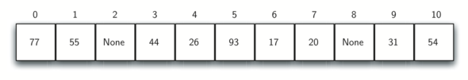

Sorting and Searching
=====================

Objectives
----------

-  To be able to explain and implement sequential search and binary
   search.

-  To be able to explain and implement selection sort, bubble sort,
   merge sort, quick sort, insertion sort, and shell sort.

-  To understand the idea of hashing as a search technique.

-  To introduce the map abstract data type.

-  To implement the map abstract data type using hashing.

Searching
---------

We will now turn our attention to some of the most common problems that
arise in computing, those of searching and sorting. In this section we
will study searching. We will return to sorting later in the chapter.
Searching is the algorithmic process of finding a particular item in a
collection of items. A search typically answers either ``True`` or
``False`` as to whether the item is present. On occasion it may be
modified to return where the item is found. For our purposes here, we
will simply concern ourselves with the question of membership.

In Python, there is a very easy way to ask whether an item is in a list
of items. We use the ``in`` operator.

::

    >>> 15 in [3,5,2,4,1]
    False
    >>> 3 in [3,5,2,4,1]
    True
    >>> 

Even though this is easy to write, an underlying process must be carried
out to answer the question. It turns out that there are many different
ways to search for the item. What we are interested in here is how these
algorithms work and how they compare to one another.

The Sequential Search
~~~~~~~~~~~~~~~~~~~~~

When data items are stored in a collection such as a list, we say that
they have a linear or sequential relationship. Each data item is stored
in a position relative to the others. In Python lists, these relative
positions are the index values of the individual items. Since these
index values are ordered, it is possible for us to visit them in
sequence. This process gives rise to our first searching technique, the
**sequential search**.

:ref:`Figure 1 <fig_seqsearch>` shows how this search works. Starting at the first
item in the list, we simply move from item to item, following the
underlying sequential ordering until we either find what we are looking
for or run out of items. If we run out of items, we have discovered that
the item we were searching for was not present.

.. _fig_seqsearch:

.. figure:: Figures/seqsearch.png
   :align: center

   Sequential Search of a List of Integers

The Python implementation for this algorithm is shown in
:ref:`Listing 1 <lst_seqsearchpython>`. The function needs the list and the item we
are looking for and returns a boolean value as to whether it is present.
The boolean variable ``found`` is initialized to ``False`` and is
assigned the value ``True`` if we discover the item in the list.

.. _lst_seqsearchpython:

.. codelens:: search1
    :caption: Sequential Search of an Unordered List

    def sequentialSearch(alist, item):
        pos = 0
        found = False
        
        while pos < len(alist) and not found:
            if alist[pos] == item:
                found = True
            else:
                pos = pos+1

        return found

    testlist = [1, 2, 32, 8, 17, 19, 42, 13, 0]
    print(sequentialSearch(testlist, 3))
    print(sequentialSearch(testlist, 13))

Analysis of Sequential Search
^^^^^^^^^^^^^^^^^^^^^^^^^^^^^

To analyze searching algorithms, we need to decide on a basic unit of
computation. Recall that this is typically the common step that must be
repeated in order to solve the problem. For searching, it makes sense to
count the number of comparisons performed. Each comparison may or may
not discover the item we are looking for. In addition, we make another
assumption here. The list of items is not ordered in any way. The items
have been placed randomly into the list. In other words, the probability
that the item we are looking for is in any particular position is
exactly the same for each position of the list.

If the item is not in the list, the only way to know it is to compare it
against every item present. If there are :math:`n` items, then the
sequential search requires :math:`n` comparisons to discover that the
item is not there. In the case where the item is in the list, the
analysis is not so straightforward. There are actually three different
scenarios that can occur. In the best case we will find the item in the
first place we look, at the beginning of the list. We will need only one
comparison. In the worst case, we will not discover the item until the
very last comparison, the `nth` comparison.

What about the average case? On average, we will find the item about
halfway into the list; that is, we will compare against
:math:`\frac{n}{2}` items. Recall, however, that as *n* gets large,
the coefficients, no matter what they are, become insignificant in our
approximation, so the complexity of the sequential search, is
:math:`O(n)`. :ref:`Table 1 <tbl_seqsearchtable>` summarizes these results.

.. _tbl_seqsearchtable:

==================== ========================== ========================== ========================
**Case**                      **Best Case**             **Worst Case**         **Average Case**
==================== ========================== ========================== ========================
item is present      :math:`1`                  :math:`n`                  :math:`\frac{n}{2}`
item is not present  :math:`n`                  :math:`n`                  :math:`n`
==================== ========================== ========================== ========================

    Comparisons Used in a Sequential Search of an Unordered List

We assumed earlier that the items in our collection had been randomly
placed so that there is no relative order between the items. What would
happen to the sequential search if the items were ordered in some way?
Would we be able to gain any efficiency in our search technique?

Assume that the list of items was constructed so that the items were in
ascending order, from low to high. If the item we are looking for is
present in the list, the chance of it being in any one of the *n*
positions is still the same as before. We will still have the same
number of comparisons to find the item. However, if the item is not
present there is a slight advantage. :ref:`Figure 2 <fig_seqsearch2>` shows this
process as the algorithm looks for the item 50. Notice that items are
still compared in sequence until 54. At this point, however, we know
something extra. Not only is 54 not the item we are looking for, but no
other elements beyond 54 can work either since the list is sorted. In
this case, the algorithm does not have to continue looking through all
of the items to report that the item was not found. It can stop
immediately. :ref:`Listing 2 <lst_seqsearchpython2>` shows this variation of the
sequential search function.

.. _fig_seqsearch2:

.. figure:: Figures/seqsearch2.png
   :align: center

   Sequential Search of an Ordered List of Integers

.. _lst_seqsearchpython2:

.. codelens:: search2
    :caption: Sequential Search of an Ordered List

    def orderedSequentialSearch(alist, item):
        pos = 0
        found = False
        stop = False
        while pos < len(alist) and not found and not stop:
            if alist[pos] == item:
                found = True
            else:
                if alist[pos] > item:
                    stop = True
                else:
                    pos = pos+1

        return found

    testlist = [0, 1, 2, 8, 13, 17, 19, 32, 42,]
    print(orderedSequentialSearch(testlist, 3))
    print(orderedSequentialSearch(testlist, 13))

:ref:`Table 2 <tbl_seqsearchtable2>` summarizes these results. Note that in the best
case we might discover that the item is not in the list by looking at
only one item. On average, we will know after looking through only
:math:`\frac {n}{2}` items. However, this technique is still
:math:`O(n)`. In summary, a sequential search is improved by ordering
the list only in the case where we do not find the item.

.. _tbl_seqsearchtable2:

     ================ ============== ==============  ===================
                      **Best Case**  **Worst Case**  **Average Case**
     ================ ============== ==============  ===================
     item is present  :math:`1`        :math:`n`     :math:`\frac{n}{2}`
     item not present :math:`1`        :math:`n`     :math:`\frac{n}{2}`
     ================ ============== ==============  ===================

    Comparisons Used in Sequential Search of an Ordered List

The Binary Search
~~~~~~~~~~~~~~~~~

It is possible to take greater advantage of the ordered list if we are
clever with our comparisons. In the sequential search, when we compare
against the first item, there are at most :math:`n-1` more items to
look through if the first item is not what we are looking for. Instead
of searching the list in sequence, a **binary search** will start by
examining the middle item. If that item is the one we are searching for,
we are done. If it is not the correct item, we can use the ordered
nature of the list to eliminate half of the remaining items. If the item
we are searching for is greater than the middle item, we know that the
entire lower half of the list as well as the middle item can be
eliminated from further consideration. The item, if it is in the list,
must be in the upper half.

We can then repeat the process with the upper half. Start at the middle
item and compare it against what we are looking for. Again, we either
find it or split the list in half, therefore eliminating another large
part of our possible search space. :ref:`Figure 3 <fig_binsearch>` shows how this
algorithm can quickly find the value 54. The complete function is shown
in :ref:`Listing 3 <lst_binarysearchpy>`.

.. _fig_binsearch:

.. figure:: Figures/binsearch.png
   :align: center

   Binary Search of an Ordered List of Integers

.. _lst_binarysearchpy:

.. codelens:: search3
    :caption: Binary Search of an Ordered List

    def binarySearch(alist, item):
        first = 0
        last = len(alist)-1
        found = False

        while first<=last and not found:
            midpoint = (first + last)//2
            if alist[midpoint] == item:
                found = True
            else:
                if item < alist[midpoint]:
                    last = midpoint-1
                else:
                    first = midpoint+1

        return found

    testlist = [0, 1, 2, 8, 13, 17, 19, 32, 42,]
    print(binarySearch(testlist, 3))
    print(binarySearch(testlist, 13))

Before we move on to the analysis, we should note that this algorithm is
a great example of a divide and conquer strategy. Divide and conquer
means that we divide the problem into smaller pieces, solve the smaller
pieces in some way, and then reassemble the whole problem to get the
result. When we perform a binary search of a list, we first check the
middle item. If the item we are searching for is less than the middle
item, we can simply perform a binary search of the left half of the
original list. Likewise, if the item is greater, we can perform a binary
search of the right half. Either way, this is a recursive call to the
binary search function passing a smaller list. :ref:`Listing 4 <lst_recbinarysearch>`
shows this recursive version.

.. _lst_recbinarysearch:

.. codelens:: search4
    :caption: A Binary Search--Recursive Version

    def binarySearch(alist, item):
        if len(alist) == 0:
            return False
        else:
            midpoint = len(alist)//2
            if alist[midpoint]==item:
              return True
            else:
              if item<alist[midpoint]:
                return binarySearch(alist[:midpoint],item)
              else:
                return binarySearch(alist[midpoint+1:],item)

    testlist = [0, 1, 2, 8, 13, 17, 19, 32, 42,]
    print(binarySearch(testlist, 3))
    print(binarySearch(testlist, 13))

Analysis of Binary Search
^^^^^^^^^^^^^^^^^^^^^^^^^

To analyze the binary search algorithm, we need to recall that each
comparison eliminates about half of the remaining items from
consideration. What is the maximum number of comparisons this algorithm
will require to check the entire list? If we start with *n* items, about
:math:`\frac{n}{2}` items will be left after the first comparison.
After the second comparison, there will be about :math:`\frac{n}{4}`.
Then :math:`\frac{n}{8}`, :math:`\frac{n}{16}`, and so on. How many
times can we split the list? :ref:`Table 3 <tbl_binaryanalysis>` helps us to see the
answer.

.. _tbl_binaryanalysis:

======================== ====================================== 
         **Comparisons**   **Approximate Number of Items Left** 
======================== ====================================== 
                       1                   :math:`\frac {n}{2}` 
                       2                   :math:`\frac {n}{4}` 
                       3                   :math:`\frac {n}{8}` 
                     ...                                        
                       i                 :math:`\frac {n}{2^i}` 
======================== ====================================== 

    Tabular Analysis for a Binary Search

When we split the list enough times, we end up with a list that has just
one item. Either that is the item we are looking for or it is not.
Either way, we are done. The number of comparisons necessary to get to
this point is *i* where :math:`\frac {n}{2^i} =1`. Solving for *i*
gives us :math:`i=\log n`. The maximum number of comparisons is
logarithmic with respect to the number of items in the list. Therefore,
the binary search is :math:`O(\log n)`.

One additional analysis issue needs to be addressed. In the recursive
solution shown above, the recursive call,

``binarySearch(alist[:midpoint],item)``

uses the slice operator to create the left half of the list that is then
passed to the next invocation (similarly for the right half as well).
The analysis that we did above assumed that the slice operator takes
constant time. However, we know that the slice operator in Python is
actually O(k). This means that the binary search using slice will not
perform in strict logarithmic time. Luckily this can be remedied by
passing the list along with the starting and ending indices. The indices
can be calculated as we did in :ref:`Listing 3 <lst_binarysearchpy>`. We leave this
implementation as an exercise.

Even though a binary search is generally better than a sequential
search, it is important to note that for small values of *n*, the
additional cost of sorting is probably not worth it. In fact, we should
always consider whether it is cost effective to take on the extra work
of sorting to gain searching benefits. If we can sort once and then
search many times, the cost of the sort is not so significant. However,
for large lists, sorting even once can be so expensive that simply
performing a sequential search from the start may be the best choice.

Hashing
~~~~~~~

In previous sections we were able to make improvements in our search
algorithms by taking advantage of information about where items are
stored in the collection with respect to one another. For example, by
knowing that a list was ordered, we could search in logarithmic time
using a binary search. In this section we will attempt to go one step
further by building a data structure that can be searched in
:math:`O(1)` time. This concept is referred to as **hashing**.

In order to do this, we will need to know even more about where the
items might be when we go to look for them in the collection. If every
item is where it should be, then the search can use a single comparison
to discover the presence of an item. We will see, however, that this is
typically not the case.

A **hash table** is a collection of items which are stored in such a way
as to make it easy to find them later. Each position of the hash table,
often called a **slot**, can hold an item and is named by an integer
value starting at 0. For example, we will have a slot named 0, a slot
named 1, a slot named 2, and so on. Initially, the hash table contains
no items so every slot is empty. We can implement a hash table by using
a list with each element initialized to the special Python value
``None``. :ref:`Figure 4 <fig_hashtable1>` shows a hash table of size :math:`m=11`.
In other words, there are *m* slots in the table, named 0 through 10.

.. _fig_hashtable1:

.. figure:: Figures/hashtable.png
   :align: center

   Hash Table with 11 Empty Slots

The mapping between an item and the slot where that item belongs in the
hash table is called the **hash function**. The hash function will take
any item in the collection and return an integer in the range of slot
names, between 0 and *m*-1. Assume that we have the set of integer items
54, 26, 93, 17, 77, and 31. Our first hash function, sometimes referred
to as the “remainder method,” simply takes an item and divides it by the
table size, returning the remainder as its hash value
(:math:`h(item)=item \% 11`). :ref:`Table 4 <tbl_hashvalues1>` gives all of the
hash values for our example items. Note that this remainder method
(modulo arithmetic) will typically be present in some form in all hash
functions, since the result must be in the range of slot names.

.. _tbl_hashvalues1:

================= ================ 
         **Item**   **Hash Value** 
================= ================ 
               54               10 
               26                4 
               93                5 
               17                6 
               77                0 
               31                9 
================= ================ 

    Simple Hash Function Using Remainders

Once the hash values have been computed, we can insert each item into
the hash table at the designated position as shown in
:ref:`Figure 5 <fig_hashtable2>`. Note that 6 of the 11 slots are now occupied. This
is referred to as the **load factor**, and is commonly denoted by
:math:`\lambda = \frac {numberofitems}{tablesize}`. For this example,
:math:`\lambda = \frac {6}{11}`.

.. _fig_hashtable2:

.. figure:: Figures/hashtable2.png
   :align: center

   Hash Table with Six Items

Now when we want to search for an item, we simply use the hash function
to compute the slot name for the item and then check the hash table to
see if it is present. This searching operation is :math:`O(1)`, since
a constant amount of time is required to compute the hash value and then
index the hash table at that location. If everything is where it should
be, we have found a constant time search algorithm.

You can probably already see that this technique is going to work only
if each item maps to a unique location in the hash table. For example,
if the item 44 had been the next item in our collection, it would have a
hash value of 0 (:math:`44 \% 11 == 0`). Since 77 also had a hash
value of 0, we would have a problem. According to the hash function, two
or more items would need to be in the same slot. This is referred to as
a **collision** (it may also be called a “clash”). Clearly, collisions
create a problem for the hashing technique. We will discuss them in
detail later.

Hash Functions
^^^^^^^^^^^^^^

Given a collection of items, a hash function that maps each item into a
unique slot is referred to as a **perfect hash function**. If we know
the items and the collection will never change, then it is possible to
construct a perfect hash function (refer to the exercises for more about
perfect hash functions). Unfortunately, given an arbitrary collection of
items, there is no systematic way to construct a perfect hash function.
Luckily, we do not need the hash function to be perfect to still gain
performance efficiency.

One way to always have a perfect hash function is to increase the size
of the hash table so that each possible value in the item range can be
accommodated. This guarantees that each item will have a unique slot.
Although this is practical for small numbers of items, it is not
feasible when the number of possible items is large. For example, if the
items were nine-digit Social Security numbers, this method would require
almost one billion slots. If we only want to store data for a class of
25 students, we will be wasting an enormous amount of memory.

Our goal is to create a hash function that minimizes the number of
collisions, is easy to compute, and evenly distributes the items in the
hash table. There are a number of common ways to extend the simple
remainder method. We will consider a few of them here.

The **folding method** for constructing hash functions begins by
dividing the item into equal-size pieces (the last piece may not be of
equal size). These pieces are then added together to give the resulting
hash value. For example, if our item was the phone number 436-555-4601,
we would take the digits and divide them into groups of 2
(43,65,55,46,01). After the addition, :math:`43+65+55+46+01`, we get
210. If we assume our hash table has 11 slots, then we need to perform
the extra step of dividing by 11 and keeping the remainder. In this case
:math:`210\ \%\ 11` is 1, so the phone number 436-555-4601 hashes to
slot 1. Some folding methods go one step further and reverse every other
piece before the addition. For the above example, we get
:math:`43+56+55+64+01 = 219` which gives :math:`219\ \%\ 11 = 10`.

Another numerical technique for constructing a hash function is called
the **mid-square method**. We first square the item, and then extract
some portion of the resulting digits. For example, if the item were 44,
we would first compute :math:`44 ^{2} = 1,936`. By extracting the
middle two digits, 93, and performing the remainder step, we get 5
(:math:`93\ \%\ 11`). :ref:`Table 5 <tbl_hashvalues2>` shows items under both the
remainder method and the mid-square method. You should verify that you
understand how these values were computed.

.. _tbl_hashvalues2:

================= =============== ================ 
         **Item**   **Remainder**   **Mid-Square** 
================= =============== ================ 
               54              10                3 
               26               4                7 
               93               5                9 
               17               6                8 
               77               0                4 
               31               9                6 
================= =============== ================ 

    {Comparison of Remainder and Mid-Square Methods}

We can also create hash functions for character-based items such as
strings. The word “cat” can be thought of as a sequence of ordinal
values.

::

    >>> ord('c')
    99
    >>> ord('a')
    97
    >>> ord('t')
    116

We can then take these three ordinal values, add them up, and use the
remainder method to get a ``hash`` value (see :ref:`Figure 6 <fig_stringhash>`).
:ref:`Listing 5 <lst_hashfunction1>` shows a function called ``hash`` that takes a
string and a table size and returns the hash value in the range from 0
to ``tablesize``-1.

.. _fig_stringhash:

.. figure:: Figures/stringhash.png
   :align: center

   Hashing a String Using Ordinal Values

.. _lst_hashfunction1:

::

    def hash(astring, tablesize):
        sum = 0
        for pos in range(len(astring)):
            sum = sum + ord(astring[pos])

        return sum%tablesize

Simple Hash Function for Strings

It is interesting to note that when using this hash function, anagrams
will always be given the same hash value. To remedy this, we could use
the position of the character as a weight. :ref:`Figure 7 <fig_stringhash2>` shows
one possible way to use the positional value as a weighting factor. The
modification to the ``hash`` function is left as an exercise.

.. _fig_stringhash2:

.. figure:: Figures/stringhash2.png
   :align: center

   Hashing a String Using Ordinal Values with Weighting

You may be able to think of a number of additional ways to compute hash
values for items in a collection. The important thing to remember is
that the hash function has to be efficient so that it does not become
the dominant part of the storage and search process. If the hash
function is too complex, then it becomes more work to compute the slot
name than it would be to simply do a basic sequential or binary search
as described earlier. This would quickly defeat the purpose of hashing.

Collision Resolution
^^^^^^^^^^^^^^^^^^^^

We now return to the problem of collisions. When two items hash to the
same slot, we must have a systematic method for placing the second item
in the hash table. This process is called **collision resolution**. As
we stated earlier, if the hash function is perfect, collisions will
never occur. However, since this is often not possible, collision
resolution becomes a very important part of hashing.

One method for resolving collisions looks into the hash table and tries
to find another open slot to hold the item that caused the collision. A
simple way to do this is to start at the original hash value position
and then move in a sequential manner through the slots until we
encounter the first slot that is empty. Note that we may need to go back
to the first slot (circularly) to cover the entire hash table. This
collision resolution process is referred to as **open addressing** in
that it tries to find the next open slot or address in the hash table.
By systematically visiting each slot one at a time, we are performing an
open addressing technique called **linear probing**.

:ref:`Figure 8 <fig_linearprobing>` shows an extended set of integer items under the
simple remainder method hash function (54,26,93,17,77,31,44,55,20).
:ref:`Table 4 <tbl_hashvalues1>` above shows the hash values for the original items.
:ref:`Figure 5 <fig_hashtable2>` shows the original contents. When we attempt to
place 44 into slot 0, a collision occurs. Under linear probing, we look
sequentially, slot by slot, until we find an open position. In this
case, we find slot 1.

Again, 55 should go in slot 0 but must be placed in slot 2 since it is
the next open position. The final value of 20 hashes to slot 9. Since
slot 9 is full, we begin to do linear probing. We visit slots 10, 0, 1,
and 2, and finally find an empty slot at position 3.

.. _fig_linearprobing:

.. figure:: Figures/linearprobing1.png
   :align: center

   Collision Resolution with Linear Probing

Once we have built a hash table using open addressing and linear
probing, it is essential that we utilize the same methods to search for
items. Assume we want to look up the item 93. When we compute the hash
value, we get 5. Looking in slot 5 reveals 93, and we can return
``True``. What if we are looking for 20? Now the hash value is 9, and
slot 9 is currently holding 31. We cannot simply return ``False`` since
we know that there could have been collisions. We are now forced to do a
sequential search, starting at position 10, looking until either we find
the item 20 or we find an empty slot.

A disadvantage to linear probing is the tendency for **clustering**;
items become clustered in the table. This means that if many collisions
occur at the same hash value, a number of surrounding slots will be
filled by the linear probing resolution. This will have an impact on
other items that are being inserted, as we saw when we tried to add the
item 20 above. A cluster of values hashing to 0 had to be skipped to
finally find an open position. This cluster is shown in
:ref:`Figure 9 <fig_clustering>`.

.. _fig_clustering:

.. figure:: Figures/clustering.png
   :align: center

   A Cluster of Items for Slot 0

One way to deal with clustering is to extend the linear probing
technique so that instead of looking sequentially for the next open
slot, we skip slots, thereby more evenly distributing the items that
have caused collisions. This will potentially reduce the clustering that
occurs. :ref:`Figure 10 <fig_linearprobing2>` shows the items when collision
resolution is done with a “plus 3” probe. This means that once a
collision occurs, we will look at every third slot until we find one
that is empty.

.. _fig_linearprobing2:

   Collision Resolution Using “Plus 3”

The general name for this process of looking for another slot after a
collision is **rehashing**. With simple linear probing, the rehash
function is :math:`newhashvalue = rehash(oldhashvalue)` where
:math:`rehash(pos) = (pos + 1) \% sizeoftable`. The “plus 3” rehash
can be defined as :math:`rehash(pos) = (pos+3) \% sizeoftable`. In
general, :math:`rehash(pos) = (pos + skip) \% sizeoftable`. It is
important to note that the size of the “skip” must be such that all the
slots in the table will eventually be visited. Otherwise, part of the
table will be unused. To ensure this, it is often suggested that the
table size be a prime number. This is the reason we have been using 11
in our examples.

A variation of the linear probing idea is called **quadratic probing**.
Instead of using a constant “skip” value, we use a rehash function that
increments the hash value by 1, 3, 5, 7, 9, and so on. This means that
if the first hash value is *h*, the successive values are :math:`h+1`,
:math:`h+4`, :math:`h+9`, :math:`h+16`, and so on. In other words,
quadratic probing uses a skip consisting of successive perfect squares.
:ref:`Figure 11 <fig_quadratic>` shows our example values after they are placed using
this technique.

.. _fig_quadratic:

.. figure:: Figures/quadratic.png
   :align: center

   Collision Resolution with Quadratic Probing

An alternative method for handling the collision problem is to allow
each slot to hold a reference to a collection (or chain) of items.
**Chaining** allows many items to exist at the same location in the hash
table. When collisions happen, the item is still placed in the proper
slot of the hash table. As more and more items hash to the same
location, the difficulty of searching for the item in the collection
increases. :ref:`Figure 12 <fig_chaining>` shows the items as they are added to a hash
table that uses chaining to resolve collisions.

.. _fig_chaining:

.. figure:: Figures/chaining.png
   :align: center

   Collision Resolution with Chaining

When we want to search for an item, we use the hash function to generate
the slot where it should reside. Since each slot holds a collection, we
use a searching technique to decide whether the item is present. The
advantage is that on the average there are likely to be many fewer items
in each slot, so the search is perhaps more efficient. We will look at
the analysis for hashing at the end of this section.

Implementing the ``Map`` Abstract Data Type
^^^^^^^^^^^^^^^^^^^^^^^^^^^^^^^^^^^^^^^^^^^

One of the most useful Python collections is the dictionary. Recall that
a dictionary is an associative data type where you can store key–data
pairs. The key is used to look up the associated data value. We often
refer to this idea as a **map**.

The map abstract data type is defined as follows. The structure is an
unordered collection of associations between a key and a data value. The
keys in a map are all unique so that there is a one-to-one relationship
between a key and a value. The operations are given below.

-  ``Map()`` Create a new, empty map. It returns an empty map
   collection.

-  ``put(key,val)`` Add a new key-value pair to the map. If the key is
   already in the map then replace the old value with the new value.

-  ``get(key)`` Given a key, return the value stored in the map or
   ``None`` otherwise.

-  ``del`` Delete the key-value pair from the map using a statement of
   the form ``del map[key]``.

-  ``len()`` Return the number of key-value pairs stored in the map.

-  ``in`` Return ``True`` for a statement of the form ``key in map``, if
   the given key is in the map, ``False`` otherwise.

One of the great benefits of a dictionary is the fact that given a key,
we can look up the associated data value very quickly. In order to
provide this fast look up capability, we need an implementation that
supports an efficient search. We could use a list with sequential or
binary search but it would be even better to use a hash table as
described above since looking up an item in a hash table can approach
:math:`O(1)` performance.

In :ref:`Listing x <lst_hashtablecodeconstructor>` we use two lists to create a
``HashTable`` class that implements the Map abstract data type. One
list, called ``slots``, will hold the key items and a parallel list,
called ``data``, will hold the data values. When we look up a key, the
corresponding position in the data list will hold the associated data
value. We will treat the key list as a hash table using the ideas
presented earlier. Note that the initial size for the hash table has
been chosen to be 11. Although this is arbitrary, it is important that
the size be a prime number so that the collision resolution algorithm
can be as efficient as possible.

.. _lst_hashtablecodeconstructor:

::

    class HashTable:
        def __init__(self):
            self.size = 11
            self.slots = [None] * self.size
            self.data = [None] * self.size

Map ADT Implementation--Constructor

``hashfunction`` implements the simple remainder method. The collision
resolution technique is linear probing with a “plus 1” rehash function.
The ``put`` function (see :ref:`Listing x <lst_hashtablecodestore>`) assumes that
there will eventually be an empty slot unless the key is already present
in the ``self.slots``. It computes the original hash value and if that
slot is not empty, iterates the ``rehash`` function until an empty slot
occurs. If a nonempty slot already contains the key, the old data value
is replaced with the new data value.

.. _lst_hashtablecodestore:

::

    def put(self,key,data):
      hashvalue = self.hashfunction(key,len(self.slots))

      if self.slots[hashvalue] == None:
        self.slots[hashvalue] = key
        self.data[hashvalue] = data
      else:
        if self.slots[hashvalue] == key:
          self.data[hashvalue] = data  #replace
        else:
          nextslot = self.rehash(hashvalue,len(self.slots))
          while self.slots[nextslot] != None and \
                          self.slots[nextslot] != key:
            nextslot = self.rehash(nextslot,len(self.slots))

          if self.slots[nextslot] == None:
            self.slots[nextslot]=key
            self.data[nextslot]=data
          else:
            self.data[nextslot] = data #replace

    def hashfunction(self,key,size):
         return key%size

    def rehash(self,oldhash,size):
        return (oldhash+1)%size

Map ADT Implementation--Put Method

Likewise, the ``get`` function (see :ref:`Listing x <lst_hashtablecodesearch>`)
begins by computing the initial hash value. If the value is not in the
initial slot, ``rehash`` is used to locate the next possible position.
Notice that line 15 guarantees that the search will terminate by
checking to make sure that we have not returned to the initial slot. If
that happens, we have exhausted all possible slots and the item must not
be present.

The final methods of the ``HashTable`` class provide additional
dictionary functionality. We overload the {\_\_getitem\_\_} and
{\_\_setitem\_\_} methods to allow access using``[]``. This means that
once a ``HashTable`` has been created, the familiar index operator will
be available. We leave the remaining methods as exercises.

.. _lst_hashtablecodesearch:

::

    def get(self,key):
      startslot = self.hashfunction(key,len(self.slots))

      data = None
      stop = False
      found = False
      position = startslot
      while self.slots[position] != None and  \
                           not found and not stop:
         if self.slots[position] == key:
           found = True
           data = self.data[position]
         else:
           position=self.rehash(position,len(self.slots))
           if position == startslot:
               stop = True
      return data

    def __getitem__(self,key):
        return self.get(key)

    def __setitem__(self,key,data):
        self.put(key,data)

Map ADT Implementation -- Search Method

The following session shows the ``HashTable`` class in action. First we
will create a hash table and store some items with integer keys and
string data values.

::

    >>> H=HashTable()
    >>> H[54]="cat"
    >>> H[26]="dog"
    >>> H[93]="lion"
    >>> H[17]="tiger"
    >>> H[77]="bird"
    >>> H[31]="cow"
    >>> H[44]="goat"
    >>> H[55]="pig"
    >>> H[20]="chicken"
    >>> H.slots
    [77, 44, 55, 20, 26, 93, 17, None, None, 31, 54]
    >>> H.data
    ['bird', 'goat', 'pig', 'chicken', 'dog', 'lion',
           'tiger', None, None, 'cow', 'cat']

Next we will access and modify some items in the hash table. Note that
the value for the key 20 is being replaced.

::

    >>> H[20]
    'chicken'
    >>> H[17]
    'tiger'
    >>> H[20]='duck'
    >>> H[20]
    'duck'
    >>> H.data
    ['bird', 'goat', 'pig', 'duck', 'dog', 'lion',
           'tiger', None, None, 'cow', 'cat']
    >> print(H[99])
    None

Analysis of Hashing
^^^^^^^^^^^^^^^^^^^

We stated earlier that in the best case hashing would provide a
:math:`O(1)`, constant time search technique. However, due to
collisions, the number of comparisons is typically not so simple. Even
though a complete analysis of hashing is beyond the scope of this text,
we can state some well-known results that approximate the number of
comparisons necessary to search for an item.

The most important piece of information we need to analyze the use of a
hash table is the load factor, :math:`\lambda`. Conceptually, if
:math:`\lambda` is small, then there is a lower chance of collisions,
meaning that items are more likely to be in the slots where they belong.
If :math:`\lambda` is large, meaning that the table is filling up,
then there are more and more collisions. This means that collision
resolution is more difficult, requiring more comparisons to find an
empty slot. With chaining, increased collisions means an increased
number of items on each chain.

As before, we will have a result for both a successful and an
unsuccessful search. For a successful search using open addressing with
linear probing, the average number of comparisons is approximately
:math:`\frac{1}{2}\left(1+\frac{1}{1-\lambda}\right)` and an
unsuccessful search gives
:math:`\frac{1}{2}\left(1+\left(\frac{1}{1-\lambda}\right)^2\right)`
If we are using chaining, the average number of comparisons is
:math:`1 + \frac {\lambda}{2}` for the successful case, and simply
:math:`\lambda` comparisons if the search is unsuccessful.

