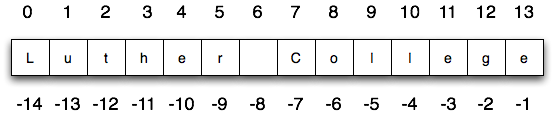

..  Copyright (C)  Brad Miller, David Ranum, Jeffrey Elkner, Peter Wentworth, Allen B. Downey, Chris
    Meyers, and Dario Mitchell.  Permission is granted to copy, distribute
    and/or modify this document under the terms of the GNU Free Documentation
    License, Version 1.3 or any later version published by the Free Software
    Foundation; with Invariant Sections being Forward, Prefaces, and
    Contributor List, no Front-Cover Texts, and no Back-Cover Texts.  A copy of
    the license is included in the section entitled "GNU Free Documentation
    License".
    
..  shortname:: Strings
..  description:: Introduction to the string data type, operators, and methods.

Strings
=======

.. index:: compound data type, character, subscript operator, index

Strings Revisited
-----------------

Throughout the first chapters of this book we have used strings to represent words or phrases that we
wanted to print out.  Our definition was simple.  A string is simply some characters inside quotes.  In this chapter we explore strings in much more detail.

A Collection Data Type
----------------------

So far we have seen built-in types like: ``int``, ``float``, 
``bool``, ``str`` and we've seen lists. 
``int``, ``float``, and
``bool`` are considered to be simple or primitive data types because their values are not composed
of any smaller parts.  They cannot be broken down.
On the other hand, strings and lists are qualitatively different from the others because they
are made up of smaller pieces.  In the case of strings, they're made up of smaller
strings each containing one **character**.  

Types that are comprised of smaller pieces are called **collection data types**.
Depending on what we are doing, we may want to treat a collection data type as a
single entity (the whole), or we may want to access its parts. This ambiguity is useful.

Strings can be defined as sequential collections of characters.  This means that the individual characters
that make up the string are assumed to be in a particular order from left to right.

A string that contains no characters, often referred to as the **empty string**, is still considered to be a string.  It is simply a sequence of zero characters and is represented by '' or "" (two quotes with nothing in between).

.. index:: string operations, concatenation

Operations on Strings
---------------------

In general, you cannot perform mathematical operations on strings, even if the
strings look like numbers. The following are illegal (assuming that ``message``
has type string):

.. sourcecode:: python
    
    message - 1   
    "Hello" / 123   
    message * "Hello"   
    "15" + 2

Interestingly, the ``+`` operator does work with strings, but for strings, the
``+`` operator represents **concatenation**, not addition.  Concatenation means
joining the two operands by linking them end-to-end. For example:

.. activecode:: ch08_add
    :nocanvas:

    fruit = "banana"
    bakedGood = " nut bread"
    print(fruit + bakedGood)

The output of this program is ``banana nut bread``. The space before the word
``nut`` is part of the string, and is necessary to produce the space between
the concatenated strings.  Take out the space and run it again.

The ``*`` operator also works on strings; it performs repetition. For example,
``'Fun'*3`` is ``'FunFunFun'``. One of the operands has to be a string; the
other has to be an integer.

.. activecode:: ch08_mult
    :nocanvas:

    print("Go"*6)

    name = "Packers"
    print(name * 3)

    print(name + "Go" * 3)

    print((name + "Go") * 3)

This interpretation of ``+`` and ``*`` makes sense by analogy with
addition and multiplication. Just as ``4*3`` is equivalent to ``4+4+4``, we
expect ``"Go"*3`` to be the same as ``"Go"+"Go"+"Go"``, and it is.  Note also in the last
example that the order of operations for ``*`` and ``+`` is the same as it was for arithmetic.
The repetition is done before the concatenation.  If you want to cause the concatenation to be
done first, you will need to use parenthesis.

Index Operator: Working with the Characters of a String
-------------------------------------------------------

The **indexing operator** (Python uses square brackets to enclose the index) 
selects a single character from a string.  The characters are accessed by their position or 
index value.  For example, in the string shown below, the 14 characters are indexed left to right from postion 0 to position 13.  

It is also the case that the positions are named from right to left using negative numbers where -1 is the rightmost
index and so on.
Note that the character at index 6 (or -8) is the blank character.

.. activecode:: chp08_index1
    
    school = "Luther College"
    m = school[2]
    print(m)
    
    lastchar = school[-1]
    print(lastchar)

The expression ``school[2]`` selects the character at index 2 from ``school``, and creates a new
string containing just this one character. The variable ``m`` refers to the result. 

Remember that computer scientists often start counting
from zero. The letter at index zero of ``"Luther College"`` is ``L``.  So at
position ``[2]`` we have the letter ``t``.

If you want the zero-eth letter of a string, you just put 0, or any expression
with the value 0, in the brackets.  Give it a try.

The expression in brackets is called an **index**. An index specifies a member
of an ordered collection.  In this case the collection of characters in the string. The index
*indicates* which character you want. It can be any integer
expression so long as it evaluates to a valid index value.

Note that indexing returns a *string* --- Python has no special type for a single character.
It is just a string of length 1.

String Methods
--------------

We previously saw that each turtle instance has its own attributes and 
a number of methods that can be applied to the instance.  For example,
we wrote ``tess.right(90)`` when we wanted the turtle object ``tess`` to perform the ``right`` method to turn
to the right 90 degrees.  The "dot notation" is the way we connect the name of an object to the name of a method
it can perform.  

Strings are also objects.  Each string instance has its own attributes and methods.  The most important attribute of the string is the collection of characters.  There are a wide variety of methods.  Try the following program.

.. activecode:: chp08_upper

    ss = "Hello, World"
    print(ss.upper())

    tt = ss.lower()
    print(tt)

In this example, ``upper`` is a method that can be invoked on any string object 
to create a new string in which all the 
characters are in uppercase.  ``lower`` works in a similar fashion changing all characters in the string
to lowercase.  (The original string ``ss`` remains unchanged.  A new string ``tt`` is created.)

In addition to ``upper`` and ``lower``, the following table provides a summary of some other useful string methods.  There are a few activecode examples that follow so that you can try them out.

==========  ==============      ==================================================================
Method      Parameters          Description
==========  ==============      ==================================================================
upper       none                Returns a string in all uppercase
lower       none                Returns a string in all lowercase
capitalize  none                Returns a string with first character capitalized, the rest lower

strip       none                Returns a string with the leading and trailing whitespace removed
lstrip      none                Returns a string with the leading whitespace removed
rstrip      none                Returns a string with the trailing whitespace removed
count       item                Returns the number of occurrences of item
replace     old, new            Replaces all occurrences of old substring with new

center      width               Returns a string centered in a field of width spaces
ljust       width               Returns a string left justified in a field of width spaces
rjust       width               Returns a string right justified in a field of width spaces

find        item                Returns the leftmost index where the substring item is found
rfind       item                Returns the rightmost index where the substring item is found
index       item                Like find except causes a runtime error if item is not found
rindex      item                Like rfind except causes a runtime error if item is not found
==========  ==============      ==================================================================

You should experiment with these
methods so that you understand what they do.  Note once again that the methods that return strings do not
change the original.  You can also consult the `Python documentation for strings <http://docs.python.org/py3k/library/stdtypes.html#index-21>`_.

.. activecode:: ch08_methods1

    ss = "    Hello, World    "

    els = ss.count("l")
    print(els)

    print("***"+ss.strip()+"***")
    print("***"+ss.lstrip()+"***")
    print("***"+ss.rstrip()+"***")

    news = ss.replace("o", "***")
    print(news)

.. activecode:: ch08_methods2

    food = "banana bread"
    print(food.capitalize())

    print("*"+food.center(25)+"*")
    print("*"+food.ljust(25)+"*")     #stars added to show bounds
    print("*" +food.rjust(25)+"*")

    print(food.find("e"))
    print(food.find("na"))
    print(food.find("b"))

    print(food.rfind("e"))
    print(food.rfind("na"))
    print(food.rfind("b"))

    print(food.index("e"))

.. index::
    single: len function
    single: function; len
    single: runtime error
    single: negative index
    single: index; negative

Length
------

The ``len`` function, when applied to a string, returns the number of characters in a string.

.. activecode:: chp08_len1
    
    fruit = "Banana"
    print(len(fruit))
    

To get the last letter of a string, you might be tempted to try something like
this:

.. activecode:: chp08_len2
    
    fruit = "Banana"
    sz = len(fruit)
    last = fruit[sz]       # ERROR!
    print(last)

That won't work. It causes the runtime error
``IndexError: string index out of range``. The reason is that there is no
letter at index position 6 in ``"Banana"``. 
Since we started counting at zero, the six indexes are
numbered 0 to 5. To get the last character, we have to subtract 1 from
``length``.  Give it a try in the example above.

.. activecode:: ch08_len3
    
    fruit = "Banana"
    sz = len(fruit)
    lastch = fruit[sz-1]
    print(lastch)

.. Alternatively, we can use **negative indices**, which count backward from the
.. end of the string. The expression ``fruit[-1]`` yields the last letter,
.. ``fruit[-2]`` yields the second to last, and so on.  Try it!

Typically, a Python programmer will access the last character by combining the
two lines of code from above.

.. sourcecode:: python
    
    lastch = fruit[len(fruit)-1]

The Slice Operator
------------------

A substring of a string is called a **slice**. Selecting a slice is similar to
selecting a character:

.. activecode:: chp08_slice1
    
    singers = "Peter, Paul, and Mary"
    print(singers[0:5])
    print(singers[7:11])
    print(singers[17:21])
    

The `slice` operator ``[n:m]`` returns the part of the string from the n'th character
to the m'th character, including the first but excluding the last. In other words,  start with the character at index n and
go up to but do not include the character at index m.
This
behavior may seem counter-intuitive but if you recall the ``range`` function, it did not include its end
point either.

If you omit the first index (before the colon), the slice starts at the
beginning of the string. If you omit the second index, the slice goes to the
end of the string.

.. activecode:: chp08_slice2
    
    fruit = "banana"
    print(fruit[:3])
    print(fruit[3:])

What do you think ``fruit[:]`` means?

.. index:: string comparison, comparison of strings

String Comparison
-----------------

The comparison operators also work on strings. To see if two strings are equal you simply write a boolean
expression using the equality operator.

.. activecode:: ch08_comp1
    
    word = "banana"
    if word == "banana":
        print("Yes, we have bananas!")
    else:
        print("Yes, we have NO bananas!")

Other comparison operations are useful for putting words in
`lexicographical order <http://en.wikipedia.org/wiki/Lexicographic_order>`__.
This is similar to the alphabetical order you would use with a dictionary,
except that all the uppercase letters come before all the lowercase letters.

.. activecode:: ch08_comp2

    word = "zebra"
    
    if word < "banana":
        print("Your word, " + word + ", comes before banana.")
    elif word > "banana":
        print("Your word, " + word + ", comes after banana.")
    else:
        print("Yes, we have no bananas!")

It is probably clear to you that the word `apple` would be less than (come before) the word ``banana``.
After all, `a` is before `b` in the alphabet.  But what if we consider the words ``apple`` and ``Apple``?
Are they the same?  

.. activecode:: chp08_ord1

    print("apple" < "banana")

    print("apple" == "Apple")
    print("apple" < "Apple")

It turns out, as you recall from our discussion of variable names, that uppercase and lowercase letters are considered to be different from one another.  The way the computer knows they are different is that
each character is assigned a unique integer value.  "A" is 65, "B" is 66, and "5" is 53.  The way you can
find out the so called **ordinal value** for a given character is to use a character function called ``ord``.

.. activecode:: ch08_ord2

    print(ord("A"))
    print(ord("B"))
    print(ord("5"))

    print(ord("a"))
    print("apple" > "Apple")

When you compare characters or strings to one another, Python converts the characters into their equivalent ordinal values and compares the integers from left to right.  As you can see from the example above, "a" is greater than "A" so "apple" is greater than "Apple".

Humans commonly ignore capitalization when comparing two words.  However, computers do not.  A common way to address this issue is to convert strings to a standard
format, such as all lowercase, before performing the comparison. 

There is also a similar function called ``chr`` that converts integers into their character equivalent.

.. activecode:: ch08_ord3

    print(chr(65))
    print(chr(66))

    print(chr(49))
    print(chr(53))

    print("The character for 32 is",chr(32),"!!!")
    print(ord(" "))

One thing to note in the last two examples is the fact that the space character has an ordinal value (32).  Even though you don't see it, it is an actual character.  We sometimes call it a *nonprinting* character.

.. index:: mutable, immutable, runtime error

Strings are Immutable
---------------------

One final thing that makes strings different from some other Python collection types is that
you are not allowed to modify the individual characters in the collection.  It is tempting to use the ``[]`` operator on the left side of an assignment,
with the intention of changing a character in a string.  For example, in the following code, we would like to change the first letter of ``greeting``.

.. activecode:: cg08_imm1
    
    greeting = "Hello, world!"
    greeting[0] = 'J'            # ERROR!
    print(greeting)

Instead of producing the output ``Jello, world!``, this code produces the
runtime error ``TypeError: 'str' object does not support item assignment``.

Strings are **immutable**, which means you cannot change an existing string. The
best you can do is create a new string that is a variation on the original.

.. activecode:: ch08_imm2
    
    greeting = "Hello, world!"
    newGreeting = 'J' + greeting[1:]
    print(newGreeting)
    print(greeting)            # same as it was

The solution here is to concatenate a new first letter onto a slice of
``greeting``. This operation has no effect on the original string.

.. index:: traversal, for loop, concatenation, abecedarian series

.. index::
    single: McCloskey, Robert
    single: Make Way for Ducklings    

Traversal and the ``for`` Loop: By Item
---------------------------------------

A lot of computations involve processing a collection one item at a time.  For strings this means
that we would like to process one character at a time.
Often we start at the beginning, select each character in turn, do something
to it, and continue until the end. This pattern of processing is called a
**traversal**.

We have previously seen that the ``for`` statement can iterate over the items of a sequence (a list of names in the case below).

.. activecode:: ch08_4
    :nocanvas:

    for aname in ["Joe", "Amy", "Brad", "Angelina", "Zuki", "Thandi", "Paris"]:
        invitation = "Hi " + aname + ".  Please come to my party on Saturday!"
        print(invitation) 
      
Recall that the loop variable takes on each value in the sequence of names.  The body is performed once for each name.  The same was true for the sequence of integers created by the ``range`` function.

.. activecode:: ch08_5
    :nocanvas:

    for avalue in range(10):
        print(avalue)

Since a string is simply a sequence of characters, the ``for`` loop iterates over each character automatically.

.. activecode:: ch08_6
    :nocanvas:

    for achar in "Go Spot Go":
        print(achar)

The loop variable ``achar`` is automatically reassigned each character in the string "Go Spot Go".
We will refer to this type of sequence iteration as **iteration by item**.  
Note that it is only possible to process the characters one at a time from left to right.

Traversal and the ``for`` Loop: By Index
----------------------------------------

It is also possible to use the ``range`` function to systematically generate the indices of the characters.  The for loop can then be used to iterate over these positions. 
These positions can be used together with the indexing operator to access the individual
characters in the string.

Consider the following codelens example.

.. codelens:: ch08_7

    fruit = "apple"
    for idx in range(5):
        currentChar = fruit[idx]
        print(currentChar)

The index positions in "apple" are 0,1,2,3 and 4.  This is exactly the same sequence of integers returned by ``range(5)``.  The first time through the for loop, ``idx`` will be 0 and the "a" will be printed.  Then, ``idx`` will be reassigned to 1 and "p" will be displayed.  This will repeat for all the range values up to but not including 5.  Since "e" has index 4, this will be exactly right to show all 
of the characters.

In order to make the iteration more general, we can use the ``len`` function to provide the bound for ``range``.  This is a very common pattern for traversing any sequence by position.	Make sure you understand why the range function behaves
correctly when using ``len`` of the string as its parameter value.

.. activecode:: ch08_7b
    :nocanvas:

    fruit = "apple"
    for idx in range(len(fruit)):
        print(fruit[idx])

You may also note that iteration by position allows the programmer to control the direction of the
traversal by changing the sequence of index values.  Recall that we can create ranges that count down as 
well as up so the following code will print the characters from right to left.

.. codelens:: ch08_8

    fruit = "apple"
    for idx in range(len(fruit)-1, -1, -1):
        print(fruit[idx])

Trace the values of ``idx`` and satisfy yourself that they are correct.  In particular, note the start and end of the range.

Traversal and the ``while`` Loop
--------------------------------

The ``while`` loop can also control the
generation of the index values.  Remember that the programmer is responsible for setting up the initial
condition, making sure that the condition is correct, and making sure that something changes inside the
body to guarantee that the condition will eventually fail.

.. activecode:: ch08_7c
    :nocanvas:

    fruit = "apple"

    position = 0
    while position < len(fruit):
        print(fruit[position])
        position = position + 1

The loop condition is ``position < len(fruit)``, so when ``position`` is equal to the
length of the string, the condition is false, and the body of the loop is not
executed. The last character accessed is the one with the index
``len(fruit)-1``, which is the last character in the string.

Here is the same example in codelens so that you can trace the values of the variables.

.. codelens:: ch08_7c1
    
    fruit = "apple"

    position = 0
    while position < len(fruit):
        print(fruit[position])
        position = position + 1

.. index::
    single: in operator
    single: operator; in

The ``in`` and ``not in`` operators
-----------------------------------

The ``in`` operator tests if one string is a substring of another:

.. activecode:: chp8_in1
    
    print('p' in 'apple')
    print('i' in 'apple')
    print('ap' in 'apple')
    print('pa' in 'apple')

Note that a string is a substring of itself, and the empty string is a 
substring of any other string. (Also note that computer scientists 
like to think about these edge cases quite carefully!) 

.. activecode:: chp8_in2
    
    print('a' in 'a')
    print('apple' in 'apple')
    print('' in 'a')
    print('' in 'apple')
    
The ``not in`` operator returns the logical opposite result of ``in``.

.. activecode:: chp8_in3

    print('x' not in 'apple')

The Accumulator Pattern with Strings
------------------------------------

Combining the ``in`` operator with string concatenation using ``+`` and the accumulator pattern, we can
write a function that removes all the vowels from a string.  The idea is to start with a string and iterate over each character, checking to see if the character is a vowel.  As we process the characters, we will build up a new string consisting of only the nonvowel characters.  To do this, we use the accumulator pattern.

Remember that the accumulator pattern allows us to keep a "running total".  With strings, we are not accumulating a numeric total.  Instead we are accumulating characters onto a string.

.. activecode:: ch08_acc1
    
    def removeVowels(s):
        vowels = "aeiouAEIOU"
        sWithoutVowels = ""
        for eachChar in s:
            if eachChar not in vowels:
                sWithoutVowels = sWithoutVowels + eachChar
        return sWithoutVowels 
       
    print(removeVowels("compsci"))
    print(removeVowels("aAbEefIijOopUus"))

Line 5 uses the ``not in`` operator to check whether the current character is not in the string ``vowels``. The alternative to using this operator would be to write a very large ``if`` statement that checks each of the individual vowel characters.  Note we would need to use logical ``and`` to be sure that the character is not any of the vowels.

.. sourcecode:: python

    if eachChar != 'a'  and eachChar != 'e'  and eachChar != 'i'  and
       eachChar != 'o'  and eachChar != 'u'  and eachChar != 'A'  and
       eachChar != 'E'  and eachChar != 'I'  and eachChar != 'O'  and
       eachChar != 'U':      
       
         sWithoutVowels = sWithoutVowels + eachChar

                  
      

Look carefully at line 6 in the above program (``sWithoutVowels = sWithoutVowels + eachChar``).  We will do this for every character that is not a vowel.  This should look
very familiar.  As we were describing earlier, it is an example of the accumulator pattern, this time using a string to "accumulate" the final result.
In words it says that the new value of ``sWithoutVowels`` will be the old value of ``sWithoutVowels`` concatenated with
the value of ``eachChar``.  We are building the result string character by character. 

Take a close look also at the initialization of ``sWithoutVowels``.  We start with an empty string and then begin adding
new characters to the end.

Step thru the function using codelens to see the accumulator variable grow.

.. codelens:: ch08_acc2
    
    def removeVowels(s):
        vowels = "aeiouAEIOU"
        sWithoutVowels = ""
        for eachChar in s:
            if eachChar not in vowels:
                sWithoutVowels = sWithoutVowels + eachChar
        return sWithoutVowels 
       
    print(removeVowels("compsci"))

Turtles and Strings and L-Systems
---------------------------------

This section describes a much more interested example of string iteration and the accumulator pattern.  Even though it seems like we are doing something that is much more complex, the basic processing is the same as was shown in the previous sections.

In 1968 Astrid Lindenmayer, a biologist, invented a formal system that
provides a mathematical description of plant growth known as an
**L-system**.  L-systems were designed to model the growth of biological
systems.  You can think of L-systems as containing the instructions for how
a single cell can grow into a complex organism.  L-systems can be used to
specify the **rules** for all kinds of interesting patterns.  In our case, we are going to use them to specify the rules for drawing pictures.

The rules of an L-system are really a set of instructions for transforming
one string into a new string.  After a number of these string transformations
are complete, the string contains a set of instructions.  Our plan is to let these instructions direct a turtle
as it draws a picture.

To begin, we will look at an example set of rules:

========  =====================
A         Axiom
A -> B    Rule 1 Change A to B
B -> AB   Rule 2 Change B to AB
========  =====================

Each rule set contains an axiom which represents the starting point in the transformations that will follow.  The rules are of the form::

        left hand side -> right hand side
        
where the left and side is a single symbol and the right had side is a sequence of symbols.  You can think of both sides as being simple strings.
The way the rules are used is to replace occurrences of the left hand side with the corresponding right hand side.

Now lets look at these simple rules in action, starting with the string A::

    A
    B      Apply Rule 1  (A is replaced by B)
    AB     Apply Rule 2  (B is replaced by AB)
    BAB    Apply Rule 1 to A then Rule 2 to B
    ABBAB  Apply Rule 2 to B, Rule 1 to A, and Rule 2 to B

Notice that each line represents a new transformation for entire string.  Each character that matches a left-hand side of a rule in the original has been replaced by the corresponding right-hand side of that same rule.  After doing the replacement for
each character in the original, we have one transformation.

So how would we encode these rules in a Python program?  There are a couple
of very important things to note here:

#. Rules are very much like if statements.
#. We are going to start with a string and iterate over each of its characters.
#. As we apply the rules to one string we leave that string alone and create
   a brand new string using the accumulator pattern.  When we are all done with the original we replace it
   with the new string.

Lets look at a simple Python program that implements the example set of rules described
above.

.. activecode::  string_lsys1

    def applyRules(ch):
        newstr = ""
        if ch == 'A':
            newstr = 'B'   # Rule 1
        elif ch == 'B':
            newstr = 'AB'  # Rule 2
        else:
            newstr = ch    # no rules apply so keep the character

        return newstr

    def processString(oldStr):
        newstr = ""
        for ch in oldStr:
            newstr = newstr + applyRules(ch)

        return newstr

    def createLSystem(numIters,axiom):
        startString = axiom
        endString = ""
        for i in range(numIters):
            endString = processString(startString)
            startString = endString

        return endString

    print(createLSystem(4,"A"))

Try running the example above with different values for the ``numIters``
parameter.  You should see that for values 1, 2, 3, and 4, the strings generated follow the
example above exactly.

One of the nice things about the program above is that if you want to
implement a different set of rules, you don't need to re-write the entire
program. All you need to do is re-write the applyRules function.

Suppose you had the following rules:

========  =====================
A         Axiom
A -> BAB    Rule 1 Change A to BAB
========  =====================

What kind of a string would these rules create?  Modify the program above to
implement the rule.

Now lets look at a real L-system that implements a famous drawing.  This
L-system has just two rules:

=============  =====================
F              Axiom
F -> F-F++F-F  Rule 1
=============  =====================

This L-system uses symbols that will have special meaning when we use them later with the turtle to draw a picture.

====  ===================================
F     Go forward by some number of units
B     Go backward by some number of units
\-    Turn left by some degrees
\+    Turn right by some degrees
====  ===================================

Here is the ``applyRules`` function for this L-system.

.. sourcecode:: python

    def applyRules(ch):
        newstr = ""
        if ch == 'F':
            newstr = 'F-F++F-F'   # Rule 1
        else:
            newstr = ch    # no rules apply so keep the character

        return newstr

Pretty simple so far.  As you can imagine this string will get pretty long
with a few applications of the rules.  You might try to expand the string a
couple of times on your own just to see.

The last step is to take the final string and turn it into a picture.  Lets
assume that we are always going to go forward or backward by 5 units.  In
addition we will also assume that when the turtle turns left or right we'll
turn by 60 degrees.  Now look at the string ``F-F++F-F``.  You might try to
us the explanation above to show the resulting picture that this simple string represents.  At this point its not a very exciting
drawing, but once we expand it a few times it will get a lot more interesting.

To create a Python function to draw a string we will write a function called
``drawLsystem``  The function will take four parameters:

* A turtle to do the drawing
* An expanded string that contains the results of expanding the rules above.
* An angle to turn
* A distance to move forward or backward

.. sourcecode:: python

    def drawLsystem(aTurtle,instructions,angle,distance):
        for cmd in instructions:
            if cmd == 'F':
                aTurtle.forward(distance)
            elif cmd == 'B':
                aTurtle.backward(distance)
            elif cmd == '+':
                aTurtle.right(angle)
            elif cmd == '-':
                aTurtle.left(angle)
            else:
                print('Error:', cmd, 'is an unknown command')

Here is the complete program in activecode.  The ``main`` function first creates the
L-system string and then it creates a turtle and passes it and the string to the drawing function.

.. activecode:: strings_lys2

    import turtle
    
    def createLSystem(numIters,axiom):
        startString = axiom
        endString = ""
        for i in range(numIters):
            endString = processString(startString)
            startString = endString

        return endString

    def processString(oldStr):
        newstr = ""
        for ch in oldStr:
            newstr = newstr + applyRules(ch)

        return newstr

    def applyRules(ch):
        newstr = ""
        if ch == 'F':
            newstr = 'F-F++F-F'   # Rule 1
        else:
            newstr = ch    # no rules apply so keep the character

        return newstr

    def drawLsystem(aTurtle,instructions,angle,distance):
        for cmd in instructions:
            if cmd == 'F':
                aTurtle.forward(distance)
            elif cmd == 'B':
                aTurtle.backward(distance)
            elif cmd == '+':
                aTurtle.right(angle)
            elif cmd == '-':
                aTurtle.left(angle)
            else:
                print('Error:', cmd, 'is an unknown command')

    def main():
        inst = createLSystem(4,"F")   #create the string
        print(inst)
        t = turtle.Turtle()           #create the turtle
        wn = turtle.Screen()
        
        t.up()
        t.back(200)
        t.down()
        t.speed(9)
        drawLsystem(t,inst,60,5)      #draw the picture
                                      #angle 60, segment length 5
        wn.exitonclick()

    main()

Feel free to try some different angles and segment lengths to see how the drawing changes.

.. index:: counting pattern

Looping and counting
--------------------

We will finish this chapter with a few more examples that show variations on the theme of iteration through the characters of the string.  We will implement a few of the methods that we described earlier to show how they can be come.

The following program counts the number of times a particular letter, `` aChar``, appears in a
string.  It is another example of the accumulator pattern that we have seen in previous chapters.

.. activecode:: chp08_fun2

    def count(text, aChar): 
        lettercount = 0
        for c in text:
            if c == aChar:
                lettercount = lettercount + 1
        return lettercount

    print(count("banana","a"))    

The function ``count`` takes a string as its parameter.  The ``for`` statement iterates through each character in
the string and checks to see if the character is equal to the value of ``aChar``.  If so, the counting variable, ``lettercount``, is incremented by one.
When all characters have been processed, the ``lettercount`` is returned.

.. index:: traversal, eureka traversal, pattern of computation,
           computation pattern

A ``find`` function
-------------------

Here is an implementation for the ``find`` method.

.. activecode:: ch08_run3
    
    def find(astring, achar):
        """
          Find and return the index of achar in astring.  
          Return -1 if achar does not occur in astring.
        """
        ix = 0
        found = False
        while ix < len(astring) and not found:
            if astring[ix] == achar:
                found = True
            else:
                ix = ix + 1
        if found:
            return ix
        else:
            return -1
        
    print(find("Compsci", "p"))
    print(find("Compsci", "C"))
    print(find("Compsci", "i"))
    print(find("Compsci", "x"))
    

In a sense, ``find`` is the opposite of the indexing operator. Instead of taking
an index and extracting the corresponding character, it takes a character and
finds the index where that character appears for the first time. If the character is not found,
the function returns ``-1``.

The ``while`` loop in this example uses a slightly more complex condition than we have seen
in previous programs.  Here there are two parts to the condition.  We want to keep going if there
are more characters to look through and we want to keep going if we have not found what we are 
looking for.  The variable ``found`` is a boolean variable that keeps track of whether we have found
the character we are searching for.  It is initialized to *False*.  If we find the character, we
reassign ``found`` to *True*.

The other part of the condition is the same as we used previously to traverse the characters of the
string.  Since we have now combined these two parts with a logical ``and``, it is necessary for them
both to be *True* to continue iterating.  If one part fails, the condition fails and the iteration stops.

When the iteration stops, we simply ask a question to find out why and then return the proper value.

.. note::

	This pattern of computation is sometimes called a eureka traversal because as
	soon as we find what we are looking for, we can cry Eureka!  and stop looking.  The way
	we stop looking is by setting ``found`` to True which causes the condition to fail.

.. index:: optional parameter, default value, parameter; optional

.. _optional_parameters:

Optional parameters
-------------------

To find the locations of the second or third occurrence of a character in a
string, we can modify the ``find`` function, adding a third parameter for the
starting position in the search string:

.. activecode:: ch08_fun4
    
    def find2(astring, achar, start):
        """
          Find and return the index of achar in astring.  
          Return -1 if achar does not occur in astring.
        """
        ix = start
        found = False
        while ix < len(astring) and not found:
            if astring[ix] == achar:
                found = True
            else:
                ix = ix + 1
        if found:
            return ix
        else:
            return -1
        
    print(find2('banana', 'a', 2))

The call ``find2('banana', 'a', 2)`` now returns ``3``, the index of the first
occurrence of 'a' in 'banana' after index 2. What does
``find2('banana', 'n', 3)`` return? If you said, 4, there is a good chance you
understand how ``find2`` works.  Try it.

Better still, we can combine ``find`` and ``find2`` using an
**optional parameter**.

.. activecode:: chp08_fun5
    
	def find3(astring, achar, start=0):
	    """
	      Find and return the index of achar in astring.  
	      Return -1 if achar does not occur in astring.
	    """
	    ix = start
	    found = False
	    while ix < len(astring) and not found:
	        if astring[ix] == achar:
	            found = True
	        else:
	            ix = ix + 1
	    if found:
	        return ix
	    else:
	        return -1
	
	print(find3('banana', 'a', 2))

The call ``find3('banana', 'a', 2)`` to this version of ``find`` behaves just
like ``find2``, while in the call ``find3('banana', 'a')``, ``start`` will be
set to the **default value** of ``0``.

Adding another optional parameter to ``find`` makes it search from a starting
position, up to but not including the end position.

.. activecode:: chp08_fun6
    
    def find4(astring, achar, start=0, end=None):
	    """
	      Find and return the index of achar in astring.  
	      Return -1 if achar does not occur in astring.
	    """
	    ix = start
	    if end == None:
	       end = len(astring)

	    found = False
	    while ix < end and not found:
	        if astring[ix] == achar:
	            found = True
	        else:
	            ix = ix + 1
	    if found:
	        return ix
	    else:
	        return -1

    ss = "Python strings have some interesting methods."
 
    print(find4(ss, 's'))
    print(find4(ss, 's', 7))
    print(find4(ss, 's', 8))
    print(find4(ss, 's', 8, 13))
    print(find4(ss, '.'))

The optional value for ``end`` is interesting.  We give it a default value ``None`` if the
caller does not supply any argument.  In the body of the function we test what ``end`` is
and if the caller did not supply any argument, we reassign ``end`` to be the length of the string.
If the caller has supplied an argument for ``end``, however, the caller's value will be used in the loop.

The semantics of ``start`` and ``end`` in this function are precisely the same as they are in
the ``range`` function.

.. index:: module, string module, dir function, dot notation, function type,
           docstring

Character classification
------------------------

It is often helpful to examine a character and test whether it is upper- or
lowercase, or whether it is a character or a digit. The ``string`` module
provides several constants that are useful for these purposes. One of these,
``string.digits`` is equivalent to "0123456789".  It can be used to check if a character
is a digit using the ``in`` operator.

The string ``string.ascii_lowercase`` contains all of the ascii letters that the system
considers to be lowercase. Similarly, ``string.ascii_uppercase`` contains all of the
uppercase letters. ``string.punctuation`` comprises all the characters considered
to be punctuation. Try the following and see what you get.

.. sourcecode:: python
    
    print(string.ascii_lowercase)
    print(string.ascii_uppercase)
    print(string.digits)
    print(string.punctuation)

    

For more information consult the ``string`` module documentaiton (see `Global Module Index <http://docs.python.org/py3k/py-modindex.html>`_).

Summary 
------- 

This chapter introduced a lot of new ideas.  The following summary 
may prove helpful in remembering what you learned.

.. glossary::

    indexing (``[]``)
        Access a single character in a string using its position (starting from
        0).  Example: ``'This'[2]`` evaluates to ``'i'``.

    length function (``len``)
        Returns the number of characters in a string.  Example:
        ``len('happy')`` evaluates to ``5``.

    for loop traversal (``for``)
        *Traversing* a string means accessing each character in the string, one
        at a time.  For example, the following for loop:

        .. sourcecode:: python

            for ix in 'Example':
                ...

        executes the body of the loop 7 times with different values of `ix` each time.

    slicing (``[:]``)
        A *slice* is a substring of a string. Example: ``'bananas and
        cream'[3:6]`` evaluates to ``ana`` (so does ``'bananas and
        cream'[1:4]``).

    string comparison (``>, <, >=, <=, ==, !=``)
        The six common comparision operators work with strings, evaluating according to
        `lexigraphical order
        <http://en.wikipedia.org/wiki/Lexicographic_order>`__.  Examples:
        ``'apple' < 'banana'`` evaluates to ``True``.  ``'Zeta' < 'Appricot'``
        evaluates to ``False``.  ``'Zebra' <= 'aardvark'`` evaluates to
        ``True`` because all upper case letters precede lower case letters.

    in and not in operator (``in``, ``not in``)
        The ``in`` operator tests whether one string is contained
        inside another string.  Examples: ``'heck' in "I'll be checking for
        you."`` evaluates to ``True``.  ``'cheese' in "I'll be checking for
        you."`` evaluates to ``False``.

Glossary
--------

.. glossary::

    collection data type
        A data type in which the values are made up of components, or elements,
        that are themselves values.

    default value
        The value given to an optional parameter if no argument for it is
        provided in the function call.

    dot notation
        Use of the **dot operator**, ``.``, to access functions inside a
        module, or to access methods and attributes of an object.

    immutable
        A compound data type whose elements can not be assigned new values.

    index
        A variable or value used to select a member of an ordered collection, such as
        a character from a string, or an element from a list.

    optional parameter
        A parameter written in a function header with an assignment to a
        default value which it will receive if no corresponding argument is
        given for it in the function call.

    slice
        A part of a string (substring) specified by a range of indices. More
        generally, a subsequence of any sequence type in Python can be created
        using the slice operator (``sequence[start:stop]``).

    traverse
        To iterate through the elements of a collection, performing a similar
        operation on each.

    whitespace
        Any of the characters that move the cursor without printing visible
        characters. The constant ``string.whitespace`` contains all the
        white-space characters.

Exercises
---------

#. What is the result of each of the following:

    a. 'Python'[1]
    #. "Strings are sequences of characters."[5]
    #. len("wonderful")
    #. 'Mystery'[:4]
    #. 'p' in 'Pineapple'
    #. 'apple' in 'Pineapple'
    #. 'pear' not in 'Pineapple'
    #. 'apple' > 'pineapple'
    #. 'pineapple' < 'Peach'
    
#. 	In Robert McCloskey's
	book *Make Way for Ducklings*, the names of the ducklings are Jack, Kack, Lack,
	Mack, Nack, Ouack, Pack, and Quack.  This loop tries to output these names in order.

	.. sourcecode:: python

	    prefixes = "JKLMNOPQ"
	    suffix = "ack"

	    for p in prefixes:
	        print(p + suffix)

	Of course, that's not quite right because Ouack and Quack are misspelled.
	Can you fix it?
   
    .. actex:: ex_8_2
   
#. Assign to a variable in your program a triple-quoted string that contains 
   your favourite paragraph of text - perhaps a poem, a speech, instructions
   to bake a cake, some inspirational verses, etc.

   Write a function which removes all punctuation from string and counts the number of words in your text that contain
   the letter 'e'.  Your program should print an analysis of the text like this::

       Your text contains 243 words, of which 109 (44.8%) contain an 'e'.      

   .. actex:: ex_8_3

#. Print out a neatly formatted multiplication table, up to 12 x 12.

   .. actex:: ex_8_4

#. Write a function that reverses its string argument.

   .. actex:: ex_8_5

      from test import testEqual

      def reverse(astring):
          # your code here

      testEqual(reverse("happy"), "yppah")
      testEqual(reverse("Python"), "nohtyP")
      testEqual(reverse(""),"")

#. Write a function that mirrors its argument.

   .. actex:: ex_8_6

      from test import testEqual

      def mirror(mystr):
          # your code here

      testEqual(mirror('good'),'gooddoog')
      testEqual(mirror('Python'),'PythonnohtyP')
      testEqual(mirror(''), '')
      testEqual(mirror('a'),'aa')

#. Write a function that removes all occurrences of a given letter from a string.

   .. actex:: ex_8_7

      from test import testEqual

      def remove_letter(theLetter, theString):
          # your code here

      testEqual(remove_letter('a', 'apple'),'pple')
      testEqual(remove_letter('a', 'banana'),'bnn')
      testEqual(remove_letter('z', 'banana'),'banana')

#. Write a function that recognizes palindromes. (Hint: use your ``reverse`` function to make this easy!).

   .. actex:: ex_8_8

      from test import testEqual

      def is_palindrome(myStr):
          # your code here

      testEqual(is_palindrome('abba'),True)
      testEqual(is_palindrome('abab'),False)
      testEqual(is_palindrome('straw warts'),True)
      testEqual(is_palindrome('a'), True)
      testEqual(is_palindrome(''),True)

#. Write a function that counts how many times a substring occurs in a string.

   .. actex:: ex_8_9

      from test import testEqual

      def count(substr,theStr):
          # your code here

      testEqual(count('is', 'Mississippi'), 2)
      testEqual(count('an', 'banana'), 2)
      testEqual(count('ana', 'banana'), 2)
      testEqual(count('nana', 'banana'),  1)
      testEqual(count('nanan', 'banana'),  0)
      testEqual(count('aaa', 'aaaaaa'),  4)

#. Write a function that removes the first occurrence of a string from another string.

   .. actex:: ex_8_10

      from test import testEqual

      def remove(substr,theStr):
          # your code here

      testEqual(remove('an', 'banana'),'bana')
      testEqual(remove('cyc', 'bicycle'), 'bile')
      testEqual(remove('iss', 'Mississippi'), 'Missippi')
      testEqual(remove('egg', 'bicycle'), 'bicycle')

#. Write a function that removes all occurrences of a string from another string.
 
   .. actex:: ex_8_11

      from test import testEqual

      def remove_all(substr,theStr):
          # your code here

      testEqual(remove_all('an', 'banana'), 'ba')
      testEqual(remove_all('cyc', 'bicycle'), 'bile')
      testEqual(remove_all('iss', 'Mississippi'), 'Mippi')
      testEqual(remove_all('eggs', 'bicycle'), 'bicycle')

#. Here is another interesting L-System called a Hilbert curve.  Use 90 degrees::

       L
       L -> +RF-LFL-FR+
       R -> -LF+RFR+FL-

   .. actex:: ex_8_12

#. Here is a dragon curve.  Use 90 degrees.::

       FX
       X -> X+YF+
       Y -> -FX-Y

   .. actex:: ex_8_13

#. Here is something called an arrowhead curve.  Use 60 degrees.::

       YF
       X -> YF+XF+Y
       Y -> XF-YF-X

   .. actex:: ex_8_14

#. Try the Peano-Gosper curve.  Use 60 degrees.::

       FX
       X -> X+YF++YF-FX--FXFX-YF+
       Y -> -FX+YFYF++YF+FX--FX-Y

   .. actex:: ex_8_15

#. The Sierpinski Triangle.  Use 60 degrees.::

       FXF--FF--FF
       F -> FF
       X -> --FXF++FXF++FXF--

   .. actex:: ex_8_16

#. Write a function that implements a substitution cipher.  In a substitution
   cipher one letter is substituted for another to garble the message.  For
   example A -> Q, B -> T, C -> G etc.  your function should take two
   parameters, the message you want to encrypt, and a string that represents
   the mapping of the 26 letters in the alphabet.  Your function should
   return a string that is the encrypted version of the message.

   .. actex:: ex_8_17

#. Write a function that decrypts the message from the previous exercise.  It
   should also take two parameters.  The encrypted message,
   and the mixed up alphabet.  The function should return a string that is
   the same as the original unencrypted message.

   .. actex:: ex_8_18

#. Write a function ``descramble`` that takes a message that is scrambled
   using the picket fence algorithm as discussed in class.  Try exchanging messages
   with a friend and the secret message provided below:

   .. actex:: ex_8_19

      def descramble(secret):
          # your code here

      testmess = "ogauain o aescesul erpe hssce esg ueyyudsrea  o hsasgmncnrtltosyuhv ucsflydcytdti ertmsaesrl o eev nafrti sinet"
      print(descramble(testmess))

#. Write a function called ``rot13`` that uses the Caesar cipher to encrypt a message.
   The Caesar cipher works like a substitution cipher but each character is replaced
   by the character 13 characters to 'its right' in the alphabet.  So for example
   the letter a becomes the letter n.  If a letter is past the middle of the alphabet
   then the counting wraps around to the letter a again, so n becomes a, o becomes b
   and so on.  *Hint:* Whenever you talk about things wrapping around its a good idea
   to think of modulo arithmetic.

   .. actex:: ex_8_20

      def rot13(mess):
          # Your code here

      print(rot13('abcde'))
      print(rot13('nopqr'))
      print(rot13(rot13('Since rot13 is symmetric you should see this message')))

