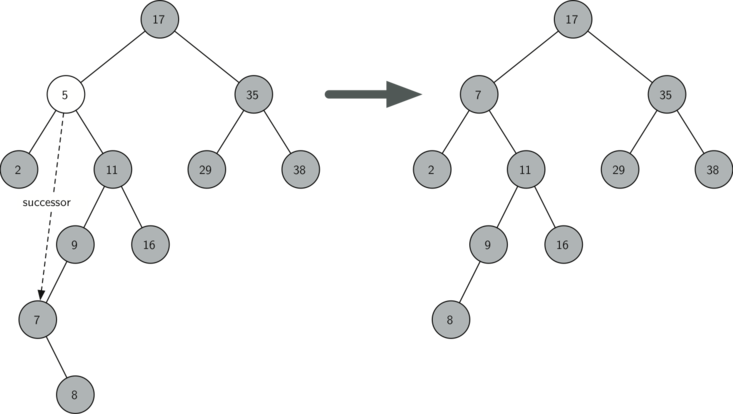

..  Copyright (C)  Brad Miller, David Ranum
    Permission is granted to copy, distribute and/or modify this document
    under the terms of the GNU Free Documentation License, Version 1.3 or 
    any later version published by the Free Software Foundation; with 
    Invariant Sections being Forward, Prefaces, and Contributor List, 
    no Front-Cover Texts, and no Back-Cover Texts.  A copy of the license
    is included in the section entitled "GNU Free Documentation License".
    
..  shortname:: BinarySearchTree
..  description:: What is a binary search tree, inserting and deleting

Binary Search Trees
-------------------

We have already seen two different ways to get key-value pairs in a
collection. Recall that these collections implement the **map** abstract
data type. The two implementations of a map ADT we discussed were binary
search on a list and hash tables. In this section we will study **binary
search trees** as yet another way to map from a key to a value. In this
case we are not interested in the exact placement of items in the tree,
but we are interested in using the binary tree structure to provide for
efficient searching.

Search Tree Operations
~~~~~~~~~~~~~~~~~~~~~~

Before we look at the implementation, let’s review the interface
provided by the map ADT. You will notice that this interface is very
similar to the Python dictionary.

-  ``Map()`` Create a new, empty map.

-  ``put(key,val)`` Add a new key-value pair to the map. If the key is
   already in the map then replace the old value with the new value.

-  ``get(key)`` Given a key, return the value stored in the map or
   ``None`` otherwise.

-  ``del`` Delete the key-value pair from the map using a statement of
   the form ``del map[key]``.

-  ``len()`` Return the number of key-value pairs stored in the map.

-  ``in`` Return ``True`` for a statement of the form ``key in map``, if
   the given key is in the map.

Search Tree Implementation
~~~~~~~~~~~~~~~~~~~~~~~~~~

A binary search tree relies on the property that
keys that are less than the parent are found in the left subtree, and
keys that are greater than the parent are found in the right subtree. We
will call this the **bst property**. As we implement the Map interface
as described above, the bst property will guide our implementation.
:ref:`Figure 1 <fig_simpleBST>` illustrates this property of a binary search
tree, showing the keys without any associated values. Notice that the
property holds for each parent and child. All of the keys in the left
subtree are less than the key in the root. All of the keys in the right
subtree are greater than the root.

   
.. _fig_simpleBST:

.. figure:: Figures/simpleBST.png
   :align: center

   A Simple Binary Search Tree
    

Now that you know what a binary search tree is, we will look at how a
binary search tree is constructed. The search tree in
:ref:`Figure 1 <fig_simpleBST>` represents the nodes that exist after we have
inserted the following keys in the order shown:
:math:`70,31,93,94,14,23,73`. Since 70 was the first key inserted into
the tree, it is the root. Next, 31 is less than 70, so it becomes the
left child of 70. Next, 93 is greater than 70, so it becomes the right
child of 70. Now we have two levels of the tree filled, so the next key
is going to be the left or right child of either 31 or 93. Since 94 is
greater than 70 and 93, it becomes the right child of 93. Similarly 14
is less than 70 and 31, so it becomes the left child of 31. 23 is also
less than 31, so it must be in the left subtree of 31. However, it is
greater than 14, so it becomes the right child of 14.

To implement the binary search tree, we will use the nodes and
references approach similar to the one we used to implement the linked
list, and the expression tree. However, because we must be able create
and work with a binary search tree that is empty, our implementation
will use two classes. The first class we will call ``BinarySearchTree``,
and the second class we will call ``TreeNode``. The ``BinarySearchTree``
class has a reference to the ``TreeNode`` that is the root of the binary
search tree. In most cases the external methods defined in the outer
class simply check to see if the tree is empty. If there are nodes in
the tree, the request is just passed on to a private method defined in
the ``BinarySearch`` tree class that takes the root as a parameter. In
the case where the tree is empty or we want to delete the key at the
root of the tree, we must take special action. The code for the
``BinarySearchTree`` class constructor along with a few other
miscellaneous functions is shown below.

::

    class BinarySearchTree:

        def __init__(self):
    	    self.root = None
    	    self.size = 0
	
        def length(self):
    	    return self.size

        def __len__(self):
    	    return self.size

        def __iter__(self):
    	    return self.root.__iter__()
	    

The ``TreeNode`` class provides many helper functions that make the work
done in the ``BinarySearchTree`` class methods much easier. The
constructor for a ``TreeNode``, along with these helper functions, is
shown in Listing {lst:bstInit}. As you can see in the listing many of
these helper functions help to classify a node according to its own
position as a child, (left or right) and the kind of children the node
has.

One big difference between the ``TreeNode`` class and the ``BinaryTree``
class from Section {sec:bintree} is that we will explicitly keep track
of the parent as an attribute of each node. You will see why this is
important when we discuss the implementation for the ``del`` operator.

Another interesting aspect of the implementation of ``TreeNode`` in
Listing {lst:bstInit} is that we use Python’s optional parameters.
Optional parameters make it easy for us to create a ``TreeNode`` under
several different circumstances. Sometimes we will want to construct a
new ``TreeNode`` that already has both a ``parent`` and a ``child``.
With an existing parent and child, we can pass parent and child as
parameters. At other times we will just create a ``TreeNode`` with the
key value pair, and we will not pass any parameters for ``parent`` or
``child``. In this case, the default values of the optional parameters
are used.

::

    class TreeNode:
       def __init__(self,key,val,left=None,right=None,
					   parent=None):
	    self.key = key
	    self.payload = val
	    self.leftChild = left
	    self.rightChild = right
	    self.parent = parent

	def hasLeftChild(self):
	    return self.leftChild

	def hasRightChild(self):
	    return self.rightChild
	
	def isLeftChild(self):
	    return self.parent and self.parent.leftChild == self

	def isRightChild(self):
	    return self.parent and self.parent.rightChild == self

	def isRoot(self):
	    return not self.parent

	def isLeaf(self):
	    return not (self.rightChild or self.leftChild)

	def hasAnyChildren(self):
	    return self.rightChild or self.leftChild

	def hasBothChildren(self):
	    return self.rightChild and self.leftChild
	
	def replaceNodeData(self,key,value,lc,rc):
	    self.key = key
	    self.payload = value
	    self.leftChild = lc
	    self.rightChild = rc
	    if self.hasLeftChild():
		self.leftChild.parent = self
	    if self.hasRightChild():
		self.rightChild.parent = self
		

Now that we have the ``BinarySearchTree`` shell and the ``TreeNode`` it
is time to write the ``put`` method that will allow us to build our
binary search tree. The ``put`` method is a method of the
``BinarySearchTree`` class. This method will check to see if the tree
already has a root. If there is not a root then ``put`` will create a
new ``TreeNode`` and install it as the root of the tree. If a root node
is already in place then ``put`` calls the private, recursive, helper
function ``_put`` to search the tree according to the following
algorithm:

-  Starting at the root of the tree, search the binary tree comparing
   the new key to the key in the current node. If the new key is less
   than the current node, search the left subtree. If the new key is
   greater than the current node, search the right subtree.

-  When there is no left (or right) child to search, we have found the
   position in the tree where the new node should be installed.

-  To add a node to the tree, create a new ``TreeNode`` object and
   insert the object at the point discovered in the previous step.

The listing below shows the Python code for inserting a new node in
the tree. The ``_put`` function is written recursively following the
steps outlined above. Notice that when a new child is inserted into the
tree, the ``currentNode`` is passed to the new tree as the parent.

One important problem with our implementation of insert is that
duplicate keys are not handled properly. As our tree is implemented a
duplicate key will create a new node with the same key value in the
right subtree of the node having the original key. The result of this is
that the node with the new key will never be found during a search. A
better way to handle the insertion of a duplicate key is for the value
associated with the new key to replace the old value. We leave fixing
this bug as an exercise for you.

::

    def put(self,key,val):
    	if self.root:
    	    self._put(key,val,self.root)
    	else:
    	    self.root = TreeNode(key,val)
    	self.size = self.size + 1

    def _put(self,key,val,currentNode):
    	if key < currentNode.key:
    	    if currentNode.hasLeftChild():
    		   self._put(key,val,currentNode.leftChild)
    	    else:
    		   currentNode.leftChild = TreeNode(key,val,parent=currentNode)
    	else:
    	    if currentNode.hasRightChild():
    		   self._put(key,val,currentNode.rightChild)
    	    else:
    		   currentNode.rightChild = TreeNode(key,val,parent=currentNode)

With the ``put`` method defined, we can easily overload the ``[]``
operator for assignment by having the ``__setitem__`` method call the
put method. This allows us to write Python statements like
``myZipTree['Plymouth'] = 55446``, just like a Python dictionary.

::

	def __setitem__(self,k,v):
	    self.put(k,v)

:ref:`Figure 2 <fig_bstput>` illustrates the process for inserting a new node
into a binary search tree. The lightly shaded nodes indicate the nodes
that were visited during the insertion process.

.. _fig_bstput:

.. figure:: Figures/bstput.png
   :align: center

   Inserting a Node with Key = 19

Once the tree is constructed, the next task is to implement the
retrieval of a value for a given key. The ``get`` method is even easier
than the ``put`` method because it simply searches the tree recursively
until it gets to a non-matching leaf node or finds a matching key. When
a matching key is found, the value stored in the payload of the node is
returned.

The following listing shows the code for ``get``, ``_get`` and
``__getitem__``. The search code in the ``_get`` method uses the same
logic for choosing the left or right child as the ``_put`` method. Notice
that the ``_get`` method returns a ``TreeNode`` to ``get``, this allows
``_get`` to be used as a flexible helper method for other
``BinarySearchTree`` methods that may need to make use of other data
from the ``TreeNode`` besides the payload.

By implementing the ``__getitem__`` method we can write a Python
statement that looks just like we are accessing a dictionary, when in
fact we are using a binary search tree, for example
``z = myZipTree['Fargo']}.  As you can see, all the ``__getitem__`` method does is call
``get``.

::

    def get(self,key):
    	if self.root:
    	    res = self._get(key,self.root)
    	    if res:
    		   return res.payload
    	    else:
    		   return None
    	else:
    	    return None

    def _get(self,key,currentNode):
    	if not currentNode:
    	    return None
    	elif currentNode.key == key:
    	    return currentNode
    	elif key < currentNode.key:
    	    return self._get(key,currentNode.leftChild)
    	else:
    	    return self._get(key,currentNode.rightChild)

    def __getitem__(self,key):
    	return self.get(key) 

Using ``get``, we can implement the ``in`` operation by writing a
``__contains__`` method for the ``BinarySearchTree``. The
``__contains__`` method will simply call ``get`` and return ``True``
if ``get`` returns a value, or ``False`` if it returns ``None``. The
code for ``__contains__`` is shown below.

::

    def __contains__(self,key):
    	if self._get(key,self.root):
    	    return True
    	else:
    	    return False

Recall that ``__contains__`` overloads the ``in`` operator and allows us
to write statements such as:

::

	if 'Northfield' in myZipTree:
	    print("oom ya ya")

Finally, we turn our attention to the most challenging method in the
binary search tree, the deletion of a key. The first task is to find the
node to delete by searching the tree. If the tree has more than one node
we search using the ``_get`` method to find the ``TreeNode`` that needs
to be removed. If the tree only has a single node, that means we are
removing the root of the tree, but we still must check to make sure the
key of the root matches the key that is to be deleted. In either case if
the key is not found the ``del`` operator raises an error.

::

    def delete(self,key):
       if self.size > 1:
          nodeToRemove = self._get(key,self.root)
    	  if nodeToRemove:
    	      self.remove(nodeToRemove)
    	      self.size = self.size-1
    	  else:
    	      raise KeyError('Error, key not in tree')
       elif self.size == 1 and self.root.key == key:
    	  self.root = None
    	  self.size = self.size - 1
       else:
    	  raise KeyError('Error, key not in tree')

    def __delitem__(self,key):
    	self.delete(key)

Once we’ve found the node containing the key we want to delete, there
are three cases that we must consider:

#. The node to be deleted has no children (see :ref:`Figure 3 <fig_bstdel1>`).

#. The node to be deleted has only one child (see :ref:`Figure 4 <fig_bstdel2>`).

#. The node to be deleted has two children (see :ref:`Figure 5 <fig_bstdel3>`).

The first case is straightforward. If the current node has no children
all we need to do is delete the node and remove the reference to this
node in the parent. The code for this case is shown in here.

::

    if currentNode.isLeaf():
    	if currentNode == currentNode.parent.leftChild:
    	    currentNode.parent.leftChild = None
    	else:
    	    currentNode.parent.rightChild = None

.. _fig_bstdel1:

.. figure:: Figures/bstdel1.png
   :align: center

   Deleting Node 16, a Node without Children

The second case is only slightly more complicated. If a node has only a
single child, then we can simply promote the child to take the place of
its parent. The code for this case is shown in the next listing. As
you look at this code you will see that there are six cases to consider.
Since the cases are symmetric with respect to either having a left or
right child we will just discuss the case where the current node has a
left child. The decision proceeds as follows:

#. If the current node is a left child then we only need to update the
   parent reference of the left child to point to the parent of the
   current node, and then update the left child reference of the parent
   to point to the current node’s left child.

#. If the current node is a right child then we only need to update the
   parent reference of the right child to point to the parent of the
   current node, and then update the right child reference of the parent
   to point to the current node’s right child.

#. If the current node has no parent, it must be the root. In this case
   we will just replace the ``key``, ``payload``, ``leftChild``, and
   ``rightChild`` data by calling the ``replaceNodeData`` method on the
   root.

::

    else: # this node has one child
       if currentNode.hasLeftChild():
    	  if currentNode.isLeftChild():
    	      currentNode.leftChild.parent = currentNode.parent
    	      currentNode.parent.leftChild = currentNode.leftChild
    	  elif currentNode.isRightChild():
    	      currentNode.leftChild.parent = currentNode.parent
    	      currentNode.parent.rightChild = currentNode.leftChild
    	  else:
    	      currentNode.replaceNodeData(currentNode.leftChild.key,
    				 currentNode.leftChild.payload,
    				 currentNode.leftChild.leftChild,
    				 currentNode.leftChild.rightChild)
       else:
    	  if currentNode.isLeftChild():
    	      currentNode.rightChild.parent = currentNode.parent
    	      currentNode.parent.leftChild = currentNode.rightChild
    	  elif currentNode.isRightChild():
    	      currentNode.rightChild.parent = currentNode.parent
    	      currentNode.parent.rightChild = currentNode.rightChild
    	  else:
    	      currentNode.replaceNodeData(currentNode.rightChild.key,
    				 currentNode.rightChild.payload,
    				 currentNode.rightChild.leftChild,
    				 currentNode.rightChild.rightChild)

.. _fig_bstdel2:

.. figure:: Figures/bstdel2.png
   :align: center

   Deleting Node 25, a Node That Has a Single Child

The third case is the most difficult case to handle. If a node has two
children, then it is unlikely that we can simply promote one of them to
take the node’s place. We can, however, search the tree for a node that
can be used to replace the one scheduled for deletion. What we need is a
node that will preserve the binary search tree relationships for both of
the existing left and right subtrees. The node that will do this is the
node that has the next-largest key in the tree. We call this node the
**successor**, and we will look at a way to find the successor shortly.
The successor is guaranteed to have no more than one child, so we know
how to remove it using the two cases for deletion that we have already
implemented. Once the successor has been removed, we simply put it in
the tree in place of the node to be deleted.

.. _fig_bstdel3:

    Deleting Node 5, a Node with Two Children

The code to handle the third case is shown in the next listing.
Notice that we make use of the helper methods ``findSuccessor`` and
``findMin`` to find the successor. To remove the successor, we make use
of the method ``spliceOut``. The reason we use ``spliceOut`` is that it
goes directly to the node we want to splice out and makes the right
changes. We could call ``delete`` recursively, but then we would waste
time re-searching for the key node.

::

   elif currentNode.hasBothChildren(): #interior
	   succ = currentNode.findSuccessor()
	   succ.spliceOut()
	   currentNode.key = succ.key
	   currentNode.payload = succ.payload

The code to find the successor is shown below and as
you can see is a method of the ``TreeNode`` class. This code makes use
of the same properties of binary search trees that cause an inorder
traversal to print out the nodes in the tree from smallest to largest.
There are three cases to consider when looking for the successor:

#. If the node has a right child, then the successor is the smallest key
   in the right subtree.

#. If the node has no right child and is the left child of its parent,
   then the parent is the successor.

#. If the node is the right child of its parent, and itself has no right
   child, then the successor to this node is the successor of its
   parent, excluding this node.

The first condition is the only one that matters for us when deleting a
node from a binary search tree. However, the ``findSuccessor`` method
has other uses that we will explore in the exercises at the end of this
chapter.

The ``findMin`` method is called to find the minimum key in a subtree.
You should convince yourself that the minimum valued key in any binary
search tree is the leftmost child of the tree. Therefore the ``findMin``
method simply follows the ``leftChild`` references in each node of the
subtree until it reaches a node that does not have a left child.

::

    def findSuccessor(self):
    	succ = None
    	if self.hasRightChild():
    	    succ = self.rightChild.findMin()
    	else:
    	    if self.parent:
    		   if self.isLeftChild():
    		       succ = self.parent
    		   else:
    		       self.parent.rightChild = None
    		       succ = self.parent.findSuccessor()
    		       self.parent.rightChild = self
    	return succ

    def findMin(self):
    	current = self
    	while current.hasLeftChild():
    	    current = current.leftChild
    	return current

::

    def spliceOut(self):
    	if self.isLeaf():
    	    if self.isLeftChild():
    		   self.parent.leftChild = None
    	    else:
    		   self.parent.rightChild = None
    	elif self.hasAnyChildren():
    	    if self.hasLeftChild():
    		   if self.isLeftChild():
    		      self.parent.leftChild = self.leftChild
    		   else:
    		      self.parent.rightChild = self.leftChild
    		   self.leftChild.parent = self.parent
    	    else:
    		   if self.isLeftChild():
    		      self.parent.leftChild = self.rightChild
    		   else:
    		      self.parent.rightChild = self.rightChild
    		   self.rightChild.parent = self.parent

The
complete listing for ``delete`` is given here for additional clarity.

::

    def remove(self,currentNode):
      if currentNode.isLeaf(): #leaf
    	if currentNode == currentNode.parent.leftChild:
    	    currentNode.parent.leftChild = None
    	else:
    	    currentNode.parent.rightChild = None
      elif currentNode.hasBothChildren(): #interior
    	succ = currentNode.findSuccessor()
    	succ.spliceOut()
    	currentNode.key = succ.key
    	currentNode.payload = succ.payload

      else: # this node has one child
    	if currentNode.hasLeftChild():
    	  if currentNode.isLeftChild():
    	      currentNode.leftChild.parent = currentNode.parent
    	      currentNode.parent.leftChild = currentNode.leftChild
    	  elif currentNode.isRightChild():
    	      currentNode.leftChild.parent = currentNode.parent
    	      currentNode.parent.rightChild = currentNode.leftChild
    	  else:
    	      currentNode.replaceNodeData(currentNode.leftChild.key,
    				 currentNode.leftChild.payload,
    				 currentNode.leftChild.leftChild,
    				 currentNode.leftChild.rightChild)
    	else:
    	  if currentNode.isLeftChild():
    	      currentNode.rightChild.parent = currentNode.parent
    	      currentNode.parent.leftChild = currentNode.rightChild
    	  elif currentNode.isRightChild():
    	      currentNode.rightChild.parent = currentNode.parent
    	      currentNode.parent.rightChild = currentNode.rightChild
    	  else:
    	      currentNode.replaceNodeData(currentNode.rightChild.key,
    				 currentNode.rightChild.payload,
    				 currentNode.rightChild.leftChild,
    				 currentNode.rightChild.rightChild)

We need to look at one last interface method for the binary search tree.
Suppose that we would like to simply iterate over all the keys in the
tree in order. This is definitely something we have done with
dictionaries, so why not trees? You already know how to traverse a
binary tree in order, using the ``inorder`` traversal algorithm.
However, writing an iterator requires a bit more work, since an iterator
should return only one node each time the iterator is called.

Python provides us with a very powerful function to use when creating an
iterator. The function is called ``yield``. ``yield`` is similar to
``return`` in that it returns a value to the caller. However, ``yield``
also takes the additional step of freezing the state of the function so
that the next time the function is called it continues executing from
the exact point it left off earlier. Functions that create objects that
can be iterated are called generator functions.

The code for an ``inorder`` iterator of a binary tree is shown in the next
listing. Look at this code carefully; at first glance you
might think that the code is not recursive. However, remember that
``__iter__`` overrides the ``for x in`` operation for iteration, so it
really is recursive! Because it is recursive over ``TreeNode`` instances
the ``__iter__`` method is defined in the ``TreeNode`` class.

::

    def __iter__(self):
       if self:
    	  if self.hasLeftChild():
    	  	 for elem in self.leftChiLd:
    		    yield elem
    	     yield self.key
    	  if self.hasRightChild():
    		 for elem in self.rightChild:
    		    yield elem

At this point you may want to download the entire file containing the
full version of the ``BinarySearchTree`` and ``TreeNode`` classes. You
can find this file (bst.py) on the support web site for this book at
``www.pythonworks.org``.

Search Tree Analysis
~~~~~~~~~~~~~~~~~~~~

With the implementation of a binary search tree now complete, we will do
a quick analysis of the methods we have implemented. Let’s first look at
the ``put`` method. The limiting factor on its performance is the height
of the binary tree. Recall from the vocabulary section that the height
of a tree is the number of edges between the root and the deepest leaf
node. The height is the limiting factor because when we are searching
for the appropriate place to insert a node into the tree, we will need
to do at most one comparison at each level of the tree.

What is the height of a binary tree likely to be? The answer to this
question depends on how the keys are added to the tree. If the keys are
added in a random order, the height of the tree is going to be around
:math:`\log_2{n}` where :math:`n` is the number of nodes in the
tree. This is because if the keys are randomly distributed, about half
of them will be less than the root and half will be greater than the
root. Remember that in a binary tree there is one node at the root, two
nodes in the next level, and four at the next. The number of nodes at
any particular level is :math:`2^d` where :math:`d` is the depth of
the level. The total number of nodes in a perfectly balanced binary tree
is :math:`2^{h+1}-1`, where :math:`h` represents the height of the
tree.

A perfectly balanced tree has the same number of nodes in the left
subtree as the right subtree. In a balanced binary tree, the worst-case
performance of ``put`` is :math:`O(\log_2{n})`, where :math:`n` is
the number of nodes in the tree. Notice that this is the inverse
relationship to the calculation in the previous paragraph. So
:math:`\log_2{n}` gives us the height of the tree, and represents the
maximum number of comparisons that ``put`` will need to do as it
searches for the proper place to insert a new node.

Unfortunately it is possible to construct a search tree that has height
:math:`n` simply by inserting the keys in sorted order! An example of
such a tree is shown in :ref:`Figure 6 <fig_skewedtree_analysis>`. In this case the
performance of the ``put`` method is :math:`O(n)`.

.. _fig_skewedtree_analysis:

.. figure:: Figures/skewedTree.png
   :align: center

   A skewed binary search tree would give poor performance

Now that you understand that the performance of
the ``put`` method is limited by the height of the tree, you can
probably guess that other methods, ``get, in,`` and ``del``, are limited
as well. Since ``get`` searches the tree to find the key, in the worst
case the tree is searched all the way to the bottom and no key is found.
At first glance ``del`` might seem more complicated, since it may need
to search for the successor before the deletion operation can complete.
But remember that the worst-case scenario to find the successor is also
just the height of the tree which means that you would simply double the
work. Since doubling is a constant factor it does not change worst case
analysis of :math:`O(n)` for an unbalanced tree.
