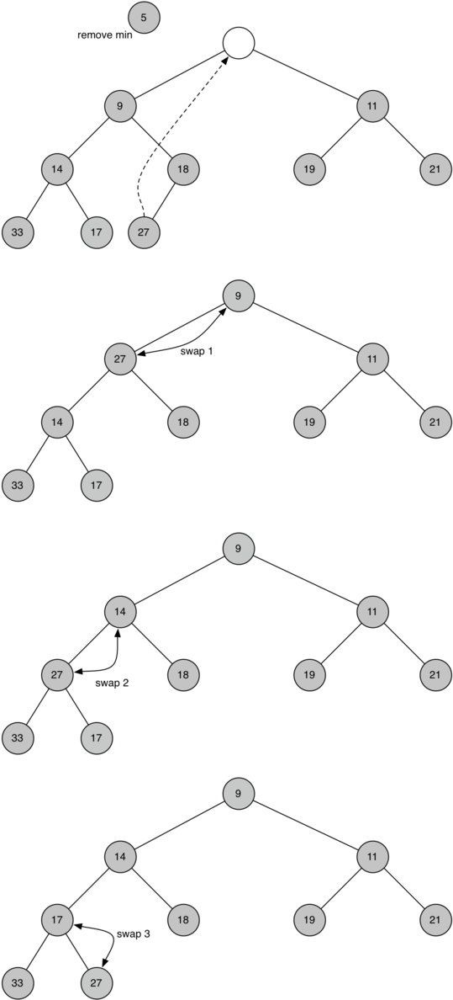
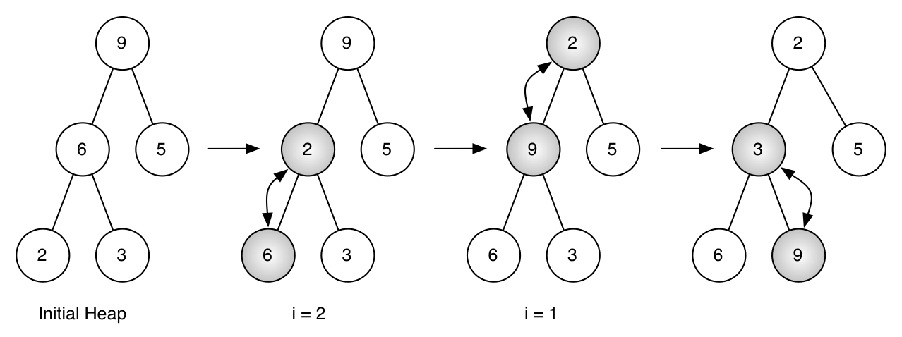

..  Copyright (C)  Brad Miller, David Ranum
    Permission is granted to copy, distribute and/or modify this document
    under the terms of the GNU Free Documentation License, Version 1.3 or 
    any later version published by the Free Software Foundation; with 
    Invariant Sections being Forward, Prefaces, and Contributor List, 
    no Front-Cover Texts, and no Back-Cover Texts.  A copy of the license
    is included in the section entitled "GNU Free Documentation License".
    
..  shortname:: Heap
..  description:: Introduction to the heap data structure.

Priority Queues with Binary Heaps
---------------------------------

In Chapter {chap:basicds} you learned about the first in first out data
structure called a queue. One important variation of a queue is called a
**priority queue**. A priority queue acts like a queue in that you
dequeue an item by removing it from the front. However, in a priority
queue the logical order of items inside a queue is determined by their
priority. The highest priority items are at the front of the queue and
the lowest priority items are at the back. Thus when you enqueue an item
on a priority queue, the new item may move all the way to the front. We
will see that the priority queue is a useful data structure for some of
the graph algorithms we will study in the next chapter.

You can probably think of a couple of easy ways to implement a priority
queue using sorting functions and lists. However, inserting into a list
is :math:`O(n)` and sorting a list is :math:`O(n \log{n})`. We can
do better. The classic way to implement a priority queue is using a data
structure called a **binary heap**. A binary heap will allow us both
enqueue and dequeue items in :math:`O(\log{n})`.

The binary heap is interesting to study because when we diagram the heap
it looks a lot like a tree, but when we implement it we use only a
single list as an internal representation. The binary heap has two
common variations: the **min heap**, in which the smallest key is always
at the front, and the **max heap**, in which the largest key value is
always at the front. In this section we will implement the min heap. We
leave a max heap implementation as an exercise.

Binary Heap Operations
~~~~~~~~~~~~~~~~~~~~~~

The basic operations we will implement for our binary heap are as
follows:

-  ``BinaryHeap()`` creates a new, empty, binary heap.

-  ``insert(k)`` adds a new item to the heap.

-  ``findMin()`` returns the item with the minimum key value, leaving
   item in the heap.

-  ``delMin()`` returns the item with the minimum key value, removing
   the item from the heap.

-  ``isEmpty()`` returns true if the heap is empty, false otherwise.

-  ``size()`` returns the number of items in the heap.

-  ``buildHeap(list)`` builds a new heap from a list of keys.

The following Python session demonstrates the use of some of the binary
heap methods.

.. activecode:: heap1

    from pythonds.trees.binheap import BinHeap
    bh = BinHeap()
    bh.insert(5)
    bh.insert(7)
    bh.insert(3)
    bh.insert(11)
    print(bh.delMin())

    print(bh.delMin())

    print(bh.delMin())

    print(bh.delMin())

Binary Heap Implementation
~~~~~~~~~~~~~~~~~~~~~~~~~~

The Structure Property
^^^^^^^^^^^^^^^^^^^^^^

In order to make our heap work efficiently, we will take advantage of
the logarithmic nature of the tree to represent our heap. You will learn
in section {sec:stanal} that in order to guarantee logarithmic
performance, we must keep our tree balanced. A balanced binary tree has
roughly the same number of nodes in the left and right subtrees of the
root. In our heap implementation we keep the tree balanced by creating a
**complete binary tree**. A complete binary tree is a tree in which each
level has all of its nodes. The exception to this is the bottom level of
the tree, which we fill in from left to right. :ref:`Figure x <fig_comptree>`
shows an example of a complete binary tree.

.. _fig_comptree:

.. figure:: Figures/compTree.png
   :align: center
   :alt: image

   A Complete Binary Tree

Another interesting property of a complete tree is that we can represent
it using a single list. We do not need to use nodes and references or
even lists of lists. Because the tree is complete, the left child of a
parent (at position :math:`p`) is the node that is found in position
:math:`2p` in the list. Similarly, the right child of the parent is at
position :math:`2p + 1` in the list. To find the parent of any node in
the tree, we can simply use Python’s integer division. Given that a node
is at position :math:`n` in the list, the parent is at position
:math:`n/2`. :ref:`Figure x <fig_heapOrder>` illustrates a complete binary tree
and also gives the list representation of the tree. The list
representation of the tree, along with the full structure property,
allows us to efficiently traverse a complete binary tree using only a
few simple mathematical operations. We will see that this also leads to
an efficient implementation of our binary heap.

The Heap Order Property
^^^^^^^^^^^^^^^^^^^^^^^

The method that we will use to store items in a heap relies on
maintaining the heap order property. The **heap order property** is as
follows: In a heap, for every node :math:`x` with parent :math:`p`,
the key in :math:`p` is smaller than or equal to the key in
:math:`x`. :ref:`Figure x <fig_heapOrder>` also illustrates a complete binary
tree that has the heap order property.

.. _fig_heapOrder:

.. figure:: Figures/heapOrder.png
   :align: center
   :alt: image

   A Complete Binary Tree, along with its List Representation

Heap Operations
^^^^^^^^^^^^^^^

We will begin our implementation of a binary heap with the constructor.
Since the entire binary heap can be represented by a single list, all
the constructor will do is initialize the list and an attribute
``currentSize`` to keep track of the current size of the heap.
Listing {lst:bh:init} shows the Python code for the constructor. You
will notice that an empty binary heap has a single zero as the first
element of ``heapList`` and that this zero is not used, but is there so
that simple integer division can be used in later methods.

::

    def __init__(self):
        self.heapList = [0]
        self.currentSize = 0

The next method we will implement is ``insert``. The easiest, and most
efficient, way to add an item to a list is to simply append the item to
the end of the list. The good news about appending is that it guarantees
that we will maintain the complete tree property. The bad news about
appending is that we will very likely violate the heap structure
property. However, it is possible to write a method that will allow us
to regain the heap structure property by comparing the newly added item
with its parent. If the newly added item is less than its parent, then
we can swap the item with its parent. :ref:`Figure x <fig_percUp>` shows the
series of swaps needed to percolate the newly added item up to its
proper position in the tree.

.. _fig_percUp:

.. figure:: Figures/percUp.png
   :align: center
   :alt: image

   Percolate the New Node up to Its Proper Position

Notice that when we percolate an item up, we are restoring the heap
property between the newly added item and the parent. We are also
preserving the heap property for any siblings. Of course, if the newly
added item is very small, we may still need to swap it up another level.
In fact, we may need to keep swapping until we get to the top of the
tree. Listing {lst:bh:helpers} shows the ``percUp`` method, which
percolates a new item as far up in the tree as it needs to go to
maintain the heap property. Here is where our wasted element in
``heapList`` is important. Notice that we can compute the parent of any
node by using simple integer division. The parent of the current node
can be computed by dividing the index of the current node by 2.

We are now ready to write the ``insert`` method. The Python code for
``insert`` is shown in Listing {lst:bh:add}. Most of the work in the
``insert`` method is really done by ``percUp``. Once a new item is
appended to the tree, ``percUp`` takes over and positions the new item
properly.

::

    def percUp(self,i):
        while i // 2 > 0:
          if self.heapList[i] < self.heapList[i // 2]:
             tmp = self.heapList[i // 2]
             self.heapList[i // 2] = self.heapList[i]
             self.heapList[i] = tmp
          i = i // 2

::

    def insert(self,k):
        self.heapList.append(k)
        self.currentSize = self.currentSize + 1
        self.percUp(self.currentSize)

With the ``insert`` method properly defined, we can now look at the
``delMin`` method. Since the heap property requires that the root of the
tree be the smallest item in the tree, finding the minimum item is easy.
The hard part of ``delMin`` is restoring full compliance with the heap
structure and heap order properties after the root has been removed. We
can restore our heap in two steps. First, we will restore the root item
by taking the last item in the list and moving it to the root position.
Moving the last item maintains our heap structure property. However, we
have probably destroyed the heap order property of our binary heap.
Second, we will restore the heap order property by pushing the new root
node down the tree to its proper position. :ref:`Figure x <fig_percDown>` shows
the series of swaps needed to move the new root node to its proper
position in the heap.

.. _fig_percdown:

   Percolating the Root Node down the Tree

In order to maintain the heap order property, all we need to do is swap
the root with its smallest child less than the root. After the initial
swap, we may repeat the swapping process with a node and its children
until the node is swapped into a position on the tree where it is
already less than both children. The code for percolating a node down
the tree is found in the ``percDown`` and ``minChild`` methods in
Listing {lst:bh:pdown}.

::

    def percDown(self,i):
        while (i * 2) <= self.currentSize:
            mc = self.minChild(i)
            if self.heapList[i] > self.heapList[mc]:
                tmp = self.heapList[i]
                self.heapList[i] = self.heapList[mc]
                self.heapList[mc] = tmp
            i = mc

    def minChild(self,i):
        if i * 2 + 1 > self.currentSize:
            return i * 2
        else:
            if self.heapList[i*2] < self.heapList[i*2+1]:
                return i * 2
            else:
                return i * 2 + 1

The code for the ``delmin`` operation is in Listing {lst:bh:del}. Note
that once again the hard work is handled by a helper function, in this
case ``percDown``.

::

    def delMin(self):
        retval = self.heapList[1]
        self.heapList[1] = self.heapList[self.currentSize]
        self.currentSize = self.currentSize - 1
        self.heapList.pop()
        self.percDown(1)
        return retval

To finish our discussion of binary heaps, we will look at a method to
build an entire heap from a list of keys. The first method you might
think of may be like the following. Given a list of keys, you could
easily build a heap by inserting each key one at a time. Since you are
starting with a list of one item, the list is sorted and you could use
binary search to find the right position to insert the next key at a
cost of approximately :math:`O(\log{n})` operations. However, remember
that inserting an item in the middle of the list may require
:math:`O(n)` operations to shift the rest of the list over to make
room for the new key. Therefore, to insert :math:`n` keys into the
heap would require a total of :math:`O(n \log{n})` operations.
However, if we start with an entire list then we can build the whole
heap in :math:`O(n)` operations. Listing {lst:bh:build} shows the code
to build the entire heap.

::

    def buildHeap(self,alist):
        i = len(alist) // 2
        self.currentSize = len(alist)
        self.heapList = [0] + alist[:]
        while (i > 0):  #// \label{lst:bh:loop}
            self.percDown(i)
            i = i - 1

.. _fig_buildheap:

   Building a Heap from the List [9, 6, 5, 2, 3]

:ref:`Figure x <fig_buildheap>` shows the swaps that the ``buildHeap`` method
makes as it moves the nodes in an initial tree of {[9, 6, 5, 2, 3]} into
their proper positions. Although we start out in the middle of the tree
and work our way back toward the root, the ``percDown`` method ensures
that the largest child is always moved down the tree. Because it is a
complete binary tree, any nodes past the halfway point will be leaves
and therefore have no children. Notice that when ``i=1``, we are
percolating down from the root of the tree, so this may require multiple
swaps. As you can see in the rightmost two subtrees of
:ref:`Figure x <fig_buildheap>`, first the 9 is moved out of the root position,
but after 9 is moved down one level in the tree, ``percDown`` ensures
that we check the next set of children farther down in the tree to
ensure that it is pushed as low as it can go. In this case it results in
a second swap with 3. Now that 9 has been moved to the lowest level of
the tree, no further swapping can be done. It is useful to compare the
list representation of this series of swaps as shown in
:ref:`Figure x <fig_buildheap>` with the tree representation.

    ::

              i = 2  [0, 9, 5, 6, 2, 3]
              i = 1  [0, 9, 2, 6, 5, 3]
              i = 0  [0, 2, 3, 6, 5, 9]

    {Building a Heap from the List [9, 5, 6, 2, 3]} {fig:bldheap}

The assertion that we can build the heap in :math:`O(n)` may seem a
bit mysterious at first, and a proof is beyond the scope of this book.
However, the key to understanding that you can build the heap in
:math:`O(n)` is to remember that the :math:`\log{n}` factor is
derived from the height of the tree. For most of the work in
``buildHeap``, the tree is shorter than :math:`\log{n}`.

Using the fact that you can build a heap from a list in :math:`O(n)`
time, you will construct a sorting algorithm that uses a heap and sorts
a list in :math:`O(n\log{n}))` as an exercise at the end of this
chapter.

