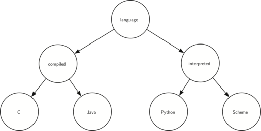

..  Copyright (C)  Brad Miller, David Ranum
    Permission is granted to copy, distribute and/or modify this document
    under the terms of the GNU Free Documentation License, Version 1.3 or 
    any later version published by the Free Software Foundation; with 
    Invariant Sections being Forward, Prefaces, and Contributor List, 
    no Front-Cover Texts, and no Back-Cover Texts.  A copy of the license
    is included in the section entitled "GNU Free Documentation License".
    
..  shortname:: TreeExercises
..  description:: Exercises for trees 

Summary
-------

In this chapter we have looked at the tree data structure. The tree data
structure enables us to write many interesting algorithms. In this
chapter we have looked at algorithms that use trees to do the following:

-  A binary tree for parsing and evaluating expressions.

-  A binary tree for implementing the map ADT.

-  A balanced binary tree (AVL tree) for implementing the map ADT.

-  A binary tree to implement a min heap.

-  A min heap used to implement a priority queue.

Key Terms
---------

============= ===================== ==================== 
     AVL tree           binary heap   binary search tree 
  binary tree      child / children complete binary tree 
         edge   heap order property               height 
  ``inorder``             leaf node                level 
          map          min/max heap                 node 
       parent                  path        ``postorder`` 
 ``preorder``        priority queue                 root 
     rotation               sibling            successor 
      subtree                  tree 
============= ===================== ==================== 

Discussion Questions
--------------------

#. Draw the tree structure resulting from the following set of tree
   function calls:

   ::

       >>> r = BinaryTree(3)
       >>> insertLeft(r,4)
       [3, [4, [], []], []]
       >>> insertLeft(r,5)
       [3, [5, [4, [], []], []], []]
       >>> insertRight(r,6)
       [3, [5, [4, [], []], []], [6, [], []]]
       >>> insertRight(r,7)
       [3, [5, [4, [], []], []], [7, [], [6, [], []]]]
       >>> setRootVal(r,9)
       >>> insertLeft(r,11)
       [9, [11, [5, [4, [], []], []], []], [7, [], [6, [], []]]]
	      

#. Trace the algorithm for creating an expression tree for the
   expression :math:`(4 * 8) / 6 - 3`.

#. Consider the following list of integers: [1,2,3,4,5,6,7,8,9,10]. Show
   the binary search tree resulting from inserting the integers in the
   list.

#. Consider the following list of integers: [10,9,8,7,6,5,4,3,2,1]. Show
   the binary search tree resulting from inserting the integers in the
   list.

#. Generate a random list of integers. Show the binary heap tree
   resulting from inserting the integers on the list one at a time.

#. Using the list from the previous question, show the binary heap tree
   resulting from using the list as a parameter to the ``buildHeap``
   method. Show both the tree and list form.

#. Draw the binary search tree that results from inserting the following
   keys in the order given: 68,88,61,89,94,50,4,76,66, and 82.

#. Generate a random list of integers. Draw the binary search tree
   resulting from inserting the integers on the list.

#. Consider the following list of integers: [1,2,3,4,5,6,7,8,9,10]. Show
   the binary heap resulting from inserting the integers one at a time.

#. Consider the following list of integers: [10,9,8,7,6,5,4,3,2,1]. Show
   the binary heap resulting from inserting the integers one at a time.

#. Consider the two different methods we used for implementing a binary
   tree. Why must we check before the call to ``preorder`` when
   implementing as a method, whereas we could check inside the call when
   implementing as a function?

#. Show the function calls needed to build the following binary tree.

#. Given the following tree, perform the appropriate rotations to bring
   it back into balance.

.. figure:: Figures/rotexer1.png
   :align: center

#. Using the following as a starting point, derive the equation
   that gives the updated balance factor for node D.

.. figure:: Figures/bfderive.png
   :align: center

Programming Exercises
---------------------

#. Extend the ``buildParseTree`` function to handle mathematical
   expressions that do not have spaces between every character.

#. Modify the ``buildParseTree`` and ``evaluate`` functions to handle
   boolean statements (and, or, and not). Remember that “not” is a unary
   operator, so this will complicate your code somewhat.

#. Using the ``findSuccessor`` method, write a non-recursive inorder
   traversal for a binary search tree.

#. Modify the code for a binary search tree to make it threaded. Write a
   non-recursive inorder traversal method for the threaded binary search
   tree. A threaded binary tree maintains a reference from each node to
   its successor.

#. Modify our implementation of the binary search tree so that it
   handles duplicate keys properly. That is, if a key is already in the
   tree then the new payload should replace the old rather than add
   another node with the same key.

#. Create a binary heap with a limited heap size. In other words, the
   heap only keeps track of the ``n`` most important items. If the heap
   grows in size to more than ``n`` items the least important item is
   dropped.

#. Clean up the ``printexp`` function so that it does not include an
   ‘extra’ set of parentheses around each number.

#. Using the ``buildHeap`` method, write a sorting function that can
   sort a list in :math:`O(n\log{n})` time.

#. Write a function that takes a parse tree for a mathematical
   expression and calculates the derivative of the expression with
   respect to some variable.

#. Implement a binary heap as a max heap.

#. Using the ``BinaryHeap`` class, implement a new class called
   ``PriorityQueue``. Your ``PriorityQueue`` class should implement the
   constructor, plus the ``enqueue`` and ``dequeue`` methods.

#. Implement the ``delete`` method for an AVL tree.