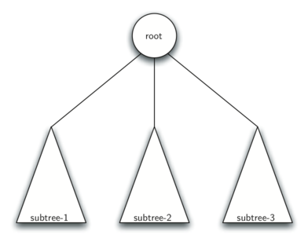

..  Copyright (C)  Brad Miller, David Ranum
    Permission is granted to copy, distribute and/or modify this document
    under the terms of the GNU Free Documentation License, Version 1.3 or 
    any later version published by the Free Software Foundation; with 
    Invariant Sections being Forward, Prefaces, and Contributor List, 
    no Front-Cover Texts, and no Back-Cover Texts.  A copy of the license
    is included in the section entitled "GNU Free Documentation License".
    
..  shortname:: Trees
..  description:: A general introduction to trees with emphasis on binary trees

Trees
=====

Objectives
----------

-  To understand what a tree data structure is and how it is used.

-  To see how trees can be used to implement a map data structure.

-  To implement trees using a list.

-  To implement trees using classes and references.

-  To implement trees as a recursive data structure.

-  To implement a priority queue using a heap.

Examples of Trees
-----------------

{sec:treeexamp} Now that we have studied linear data structures like
stacks and queues and have some experience with recursion, we will look
at a common data structure called the **tree**. Trees are used in many
areas of computer science, including operating systems, graphics,
database systems, and computer networking. Tree data structures have
many things in common with their botanical cousins. A tree data
structure has a root, branches, and leaves. The difference between a
tree in nature and a tree in computer science is that a tree data
structure has its root at the top and its leaves on the bottom.

Before we begin our study of tree data structures, let’s look at a few
common examples. Our first example of a tree is a classification tree
from biology. Figure {fig:biotree} shows an example of the biological
classification of some animals. From this simple example, we can learn
about several properties of trees. The first property this example
demonstrates is that trees are hierarchical. By hierarchical, we mean
that trees are structured in layers with the more general things near
the top and the more specific things near the bottom. The top of the
hierarchy is the Kingdom, the next layer of the tree (the “children” of
the layer above) is the Phylum, then the Class, and so on. However, no
matter how deep we go in the classification tree, all the organisms are
still animals.

.. _fig_biotree:

.. figure:: Figures/biology.png
   :scale: 50%
   :align: center
   :alt: image

   Taxonomy of Some Common Animals Shown as a Tree

Notice that you can start at the top of the tree and follow a path made
of circles and arrows all the way to the bottom. At each level of the
tree we might ask ourselves a question and then follow the path that
agrees with our answer. For example we might ask, “Is this animal a
Chordate or an Arthropod?” If the answer is “Chordate” then we follow
that path and ask, “Is this Chordate a Mammal?” If not, we are stuck
(but only in this simplified example). When we are at the Mammal level
we ask, “Is this Mammal a Primate or a Carnivore?” We can keep following
paths until we get to the very bottom of the tree where we have the
common name.

A second property of trees is that all of the children of one node are
independent of the children of another node. For example, the Genus
Felis has the children Domestica and Leo. The Genus Musca also has a
child named Domestica, but it is a different node and is independent of
the Domestica child of Felis. This means that we can change the node
that is the child of Musca without affecting the child of Felis.

A third property is that each leaf node is unique. We can specify a path
from the root of the tree to a leaf that uniquely identifies each
species in the animal kingdom; for example, Animalia
:math:`\rightarrow` Chordate :math:`\rightarrow` Mammal
:math:`\rightarrow` Carnivora :math:`\rightarrow` Felidae
:math:`\rightarrow `Felis:math:`\rightarrow` Domestica.

Another example of a tree structure that you probably use every day is a
file system. In a file system, directories, or folders, are structured
as a tree. Figure {fig:filetree} illustrates a small part of a Unix file
system hierarchy.

.. _fig_filetree:

.. figure:: Figures/directory.png
   :scale: 50%
   :align: center
   :alt: image

   A Small Part of the Unix File System Hierarchy

The file system tree has much in common with the biological
classification tree. You can follow a path from the root to any
directory. That path will uniquely identify that subdirectory (and all
the files in it). Another important property of trees, derived from
their hierarchical nature, is that you can move entire sections of a
tree (called a **subtree**) to a different position in the tree without
affecting the lower levels of the hierarchy. For example, we could take
the entire subtree staring with /etc/, detach etc/ from the root and
reattach it under usr/. This would change the unique pathname to httpd
from /etc/httpd to /usr/etc/httpd, but would not affect the contents or
any children of the httpd directory.

A final example of a tree is a web page. The following is an example of
a simple web page written using HTML. Figure {fig:html} shows the tree
that corresponds to each of the HTML tags used to create the page.

::

    <html xmlns="http://www.w3.org/1999/xhtml" 
	  xml:lang="en" lang="en">
    <head>
	<meta http-equiv="Content-Type" 
	      content="text/html; charset=utf-8" />
	<title>simple</title>
    </head>
    <body>
    <h1>A simple web page</h1>
    <ul>
	<li>List item one</li>
	<li>List item two</li>
    </ul>
    <h2><a href="http://www.cs.luther.edu">Luther CS </a><h2>
    </body>
    </html>

.. _fig_html:

.. figure:: Figures/htmltree.png
   :align: center
   :alt: image

   A Tree Corresponding to the Markup Elements of a Web Page

The HTML source code and the tree accompanying the source illustrate
another hierarchy. Notice that each level of the tree corresponds to a
level of nesting inside the HTML tags. The first tag in the source is
``<html>`` and the last is ``</html>`` All the rest of the tags in the
page are inside the pair. If you check, you will see that this nesting
property is true at all levels of the tree.

Vocabulary and Definitions
--------------------------

Now that we have looked at examples of trees, we will formally define a
tree and its components.

Node
    A node is a fundamental part of a tree. It can have a name, which we
    call the “key.” A node may also have additional information. We call
    this additional information the “payload.” While the payload
    information is not central to many tree algorithms, it is often
    critical in applications that make use of trees.

Edge
    An edge is another fundamental part of a tree. An edge connects two
    nodes to show that there is a relationship between them. Every node
    (except the root) is connected by exactly one incoming edge from
    another node. Each node may have several outgoing edges.

Root
    The root of the tree is the only node in the tree that has no
    incoming edges. In Figure {fig:filetree}, / is the root of the tree.

Path
    A path is an ordered list of nodes that are connected by edges. For
    example,
    Mammal :math:`\rightarrow` Carnivora :math:`\rightarrow` Felidae :math:`\rightarrow` Felis :math:`\rightarrow` Domestica
    is a path.

Children
    The set of nodes :math:`c` that have incoming edges from the same
    node to are said to be the children of that node. In Figure
    {fig:filetree}, nodes log/, spool/, and yp/ are the children of node
    var/.

Parent
    A node is the parent of all the nodes it connects to with outgoing
    edges. In Figure {fig:filetree} the node var/ is the parent of nodes
    log/, spool/, and yp/.

Sibling
    Nodes in the tree that are children of the same parent are said to
    be siblings. The nodes etc/ and usr/ are siblings in the filesystem
    tree.

Subtree
    A subtree is a set of nodes and edges comprised of a parent and all
    the descendants of that parent.

Leaf Node
    A leaf node is a node that has no children. For example, Human and
    Chimpanzee are leaf nodes in Figure {fig:biotree}.

Level
    The level of a node :math:`n` is the number of edges on the path
    from the root node to :math:`n`. For example, the level of the
    Felis node in Figure {fig:biotree} is five. By definition, the level
    of the root node is zero.

Height
    The height of a tree is equal to the maximum level of any node in
    the tree. The height of the tree in Figure {fig:filetree} is two.

With the basic vocabulary now defined, we can move on to a formal
definition of a tree. In fact, we will provide two definitions of a
tree. One definition involves nodes and edges. The second definition,
which will prove to be very useful, is a recursive definition.

*Definition One:* A tree consists of a set of nodes and a set of
edges that connect pairs of nodes. A tree has the following properties:

-  One node of the tree is designated as the root node.

-  Every node :math:`n`, except the root node, is connected by an edge
   from exactly one other node :math:`p`, where :math:`p` is the
   parent of :math:`n`.

-  A unique path traverses from the root to each node.

-  If each node in the tree has a maximum of two children, we say that
   the tree is a **binary tree**.

Figure {fig:nodeedgetree} illustrates a tree that fits definition one.
The arrowheads on the edges indicate the direction of the connection.

.. _fig_nodeedgetree:

.. figure:: Figures/treedef1.png
   :align: center
   :alt: image

   A Tree Consisting of a Set of Nodes and Edges

*Definition Two:* A tree is either empty or consists of a root and zero
or more subtrees, each of which is also a tree. The root of each subtree
is connected to the root of the parent tree by an edge.
Figure {fig:rectree} illustrates this recursive definition of a tree.
Using the recursive definition of a tree, we know that the tree in
Figure {fig:rectree} has at least four nodes, since each of the
triangles representing a subtree must have a root. It may have many more
nodes than that, but we do not know unless we look deeper into the tree.

   A recursive Definition of a tree

