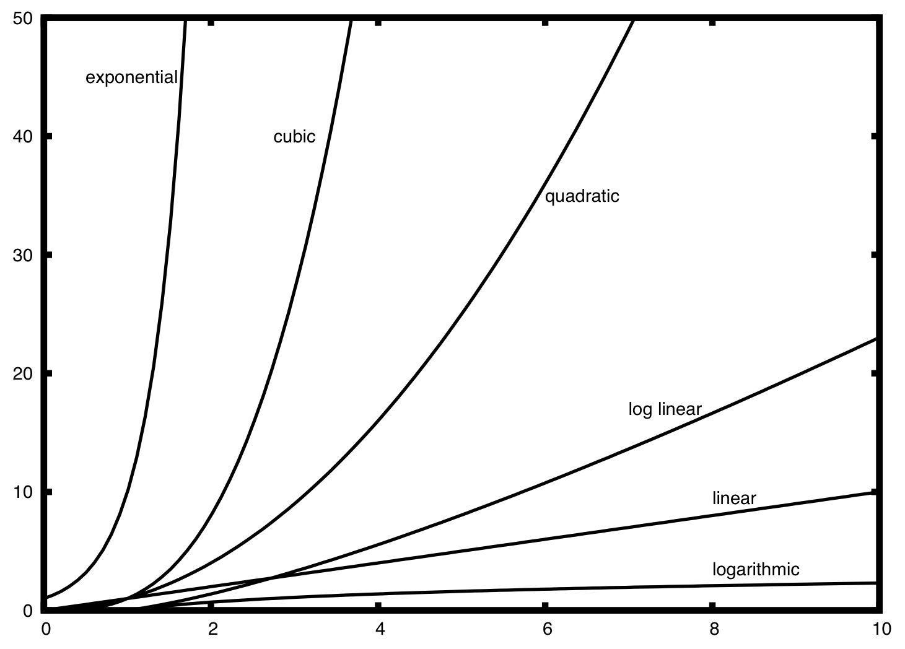
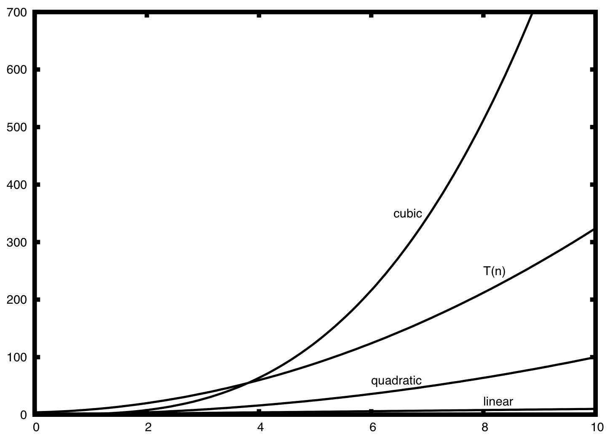
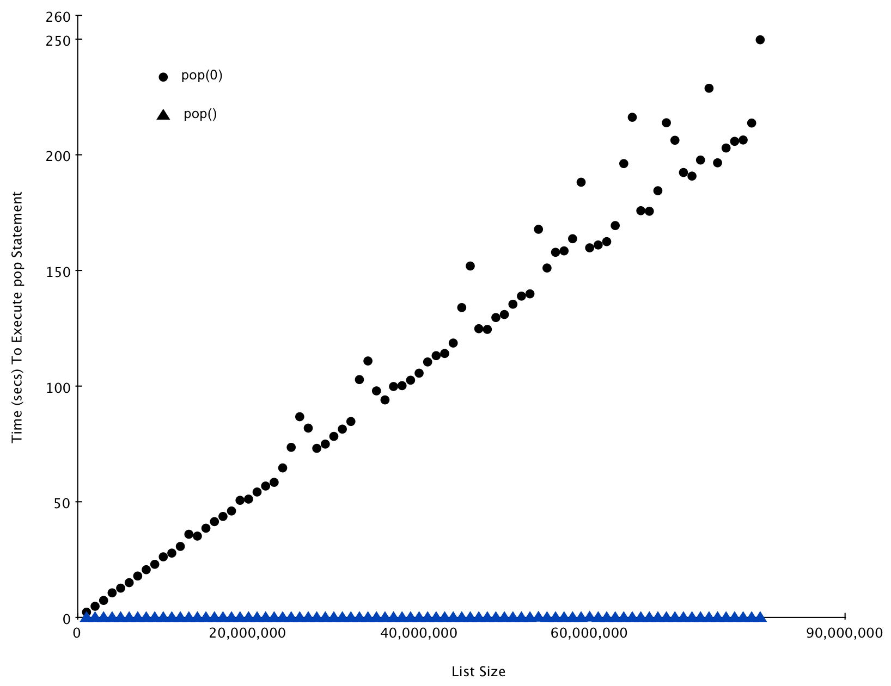
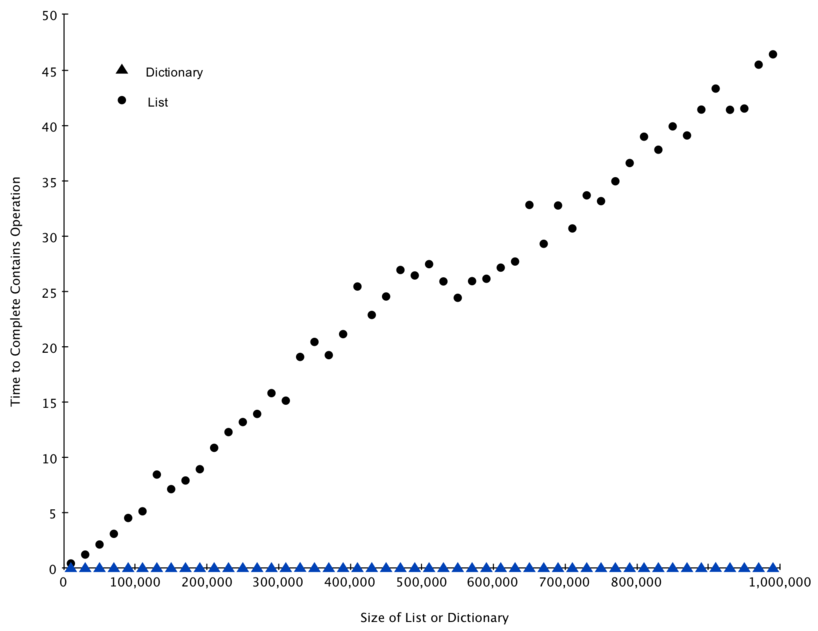

Algorithm Analysis
==================

{chap:anal}

Objectives
----------

-  To understand why algorithm analysis is important.

-  To be able to use “Big-O” to describe execution time.

-  To understand the “Big-O” execution time of common operations on
   Python lists and dictionaries.

-  To understand how the implementation of Python data impacts algorithm
   analysis.

-  To understand how to benchmark simple Python programs.

{escapeinside={#//}{^^M}}

What Is Algorithm Analysis?
---------------------------

{knuth} It is very common for beginning computer science students to
compare their programs with one another. You may also have noticed that
it is common for computer programs to look very similar, especially the
simple ones. An interesting question often arises. When two programs
solve the same problem but look different, is one program better than
the other?

In order to answer this question, we need to remember that there is an
important difference between a program and the underlying algorithm that
the program is representing. As we stated in Chapter 1, an algorithm is
a generic, step-by-step list of instructions for solving a problem. It
is a method for solving any instance of the problem such that given a
particular input, the algorithm produces the desired result. A program,
on the other hand, is an algorithm that has been encoded into some
programming language. There may be many programs for the same algorithm,
depending on the programmer and the programming language being used.

To explore this difference further, consider the function shown in
Listing {sum1}. This function solves a familiar problem, computing the
sum of the first *n* integers. The algorithm uses the idea of an
accumulator variable that is initialized to 0. The solution then
iterates through the *n* integers, adding each to the accumulator.

::

    [caption={Summation of the First \textit{n} Integers},label=sum1,index={sumOfN},float=htb]
    def sumOfN(n):
       theSum = 0
       for i in range(1,n+1):
           theSum = theSum + i

       return theSum

Now look at the function in Listing {sum2}. At first glance it may look
strange, but upon further inspection you can see that this function is
essentially doing the same thing as the previous one. The reason this is
not obvious is poor coding. We did not use good identifier names to
assist with readability, and we used an extra assignment statement
during the accumulation step that was not really necessary.

::

    [caption={Another Summation of the First \textit{n} Integers},label=sum2,float=htb]
    def foo(tom):
        fred = 0
        for bill in range(1,tom+1):
           barney = bill
           fred = fred + barney

         return fred

The question we raised earlier asked whether one function is better than
another. The answer depends on your criteria. The function ``sumOfN`` is
certainly better than the function ``foo`` if you are concerned with
readability. In fact, you have probably seen many examples of this in
your introductory programming course since one of the goals there is to
help you write programs that are easy to read and easy to understand. In
this course, however, we are also interested in characterizing the
algorithm itself. (We certainly hope that you will continue to strive to
write readable, understandable code.)

Algorithm analysis is concerned with comparing algorithms based upon the
amount of computing resources that each algorithm uses. We want to be
able to consider two algorithms and say that one is better than the
other because it is more efficient in its use of those resources or
perhaps because it simply uses fewer. From this perspective, the two
functions above seem very similar. They both use essentially the same
algorithm to solve the summation problem.

At this point, it is important to think more about what we really mean
by computing resources. There are two different ways to look at this.
One way is to consider the amount of space or memory an algorithm
requires to solve the problem. The amount of space required by a problem
solution is typically dictated by the problem instance itself. Every so
often, however, there are algorithms that have very specific space
requirements, and in those cases we will be very careful to explain the
variations.

As an alternative to space requirements, we can analyze and compare
algorithms based on the amount of time they require to execute. This
measure is sometimes referred to as the “execution time” or “running
time” of the algorithm. One way we can measure the execution time for
the function ``sumOfN`` is to do a benchmark analysis. This means that
we will track the actual time required for the program to compute its
result. In Python, we can benchmark a function by noting the starting
time and ending time with respect to the system we are using. In the
``time`` module there is a function called ``time`` that will return the
current system clock time in seconds since some arbitrary starting
point. By calling this function twice, at the beginning and at the end,
and then computing the difference, we can get an exact number of seconds
(fractions in most cases) for execution.

::

    [caption={Timing the Summation},label=sum11,index={sumOfN},float=htb]
    import time

    def sumOfN2(n):
       start = time.time()

       theSum = 0
       for i in range(1,n+1):
          theSum = theSum + i

       end = time.time()

       return theSum,end-start

Listing {sum11} shows the original ``sumOfN`` function with the timing
calls embedded before and after the summation. The function returns a
tuple consisting of the result and the amount of time (in seconds)
required for the calculation. If we perform 5 invocations of the
function, each computing the sum of the first 10,000 integers, we get
the following:

{}

::

    >>>for i in range(5):
           print("Sum is %d required %10.7f seconds"%sumOfN(10000))
    Sum is 50005000 required  0.0018950 seconds
    Sum is 50005000 required  0.0018620 seconds
    Sum is 50005000 required  0.0019171 seconds
    Sum is 50005000 required  0.0019162 seconds
    Sum is 50005000 required  0.0019360 seconds

We discover that the time is fairly consistent and it takes on average
about 0.0019 seconds to execute that code. What if we run the function
adding the first 100,000 integers?

::

    >>>for i in range(5):
           print("Sum is %d required %10.7f seconds"%sumOfN(100000))
    Sum is 5000050000 required  0.0199420 seconds
    Sum is 5000050000 required  0.0180972 seconds
    Sum is 5000050000 required  0.0194821 seconds
    Sum is 5000050000 required  0.0178988 seconds
    Sum is 5000050000 required  0.0188949 seconds
    >>> 

Again, the time required for each run, although longer, is very
consistent, averaging about 10 times more seconds. For ``n`` equal to
1,000,000 we get:

::

    >>>for i in range(5):
           print("Sum is %d required %10.7f seconds"%sumOfN(1000000))
    Sum is 500000500000 required  0.1948988 seconds
    Sum is 500000500000 required  0.1850290 seconds
    Sum is 500000500000 required  0.1809771 seconds
    Sum is 500000500000 required  0.1729250 seconds
    Sum is 500000500000 required  0.1646299 seconds
    >>>

In this case, the average again turns out to be about 10 times the
previous.

{} Now consider Listing {sum3}, which shows a different means of solving
the summation problem. This function, ``sumOfN3``, takes advantage of a
closed equation :math:`$\sum_{i=1}^{n} i = \frac {(n)(n+1)}{2}$` to
compute the sum of the first ``n`` integers without iterating.

::

    [caption={Summation Without Iteration},label=sum3,float=htb]
    def sumOfN3(n):
       return (n*(n+1))/2

If we do the same benchmark measurement for ``sumOfN3``, using five
different values for ``n`` (10,000, 100,000, 1,000,000, 10,000,000, and
100,000,000), we get the following results:

::

    Sum is 50005000 required 0.00000095 seconds
    Sum is 5000050000 required 0.00000191 seconds
    Sum is 500000500000 required 0.00000095 seconds
    Sum is 50000005000000 required 0.00000095 seconds
    Sum is 5000000050000000 required 0.00000119 seconds

There are two important things to notice about this output. First, the
times recorded above are shorter than any of the previous examples.
Second, they are very consistent no matter what the value of ``n``. It
appears that ``sumOfN3`` is hardly impacted by the number of integers
being added.

But what does this benchmark really tell us? Intuitively, we can see
that the iterative solutions seem to be doing more work since some
program steps are being repeated. This is likely the reason it is taking
longer. Also, the time required for the iterative solution seems to
increase as we increase the value of ``n``. However, there is a problem.
If we ran the same function on a different computer or used a different
programming language, we would likely get different results. It could
take even longer to perform ``sumOfN3`` if the computer were older.

We need a better way to characterize these algorithms with respect to
execution time. The benchmark technique computes the actual time to
execute. It does not really provide us with a useful measurement,
because it is dependent on a particular machine, program, time of day,
compiler, and programming language. Instead, we would like to have a
characterization that is independent of the program or computer being
used. This measure would then be useful for judging the algorithm alone
and could be used to compare algorithms across implementations.

Big-O Notation
~~~~~~~~~~~~~~

When trying to characterize an algorithm’s efficiency in terms of
execution time, independent of any particular program or computer, it is
important to quantify the number of operations or steps that the
algorithm will require. If each of these steps is considered to be a
basic unit of computation, then the execution time for an algorithm can
be expressed as the number of steps required to solve the problem.
Deciding on an appropriate basic unit of computation can be a
complicated problem and will depend on how the algorithm is implemented.

A good basic unit of computation for comparing the summation algorithms
shown earlier might be to count the number of assignment statements
performed to compute the sum. In the function ``sumOfN``, the number of
assignment statements is 1 (:math:`theSum =
0`) plus the value of *n* (the number of times we perform
:math:`theSum=theSum+i`). We can denote this by a function, call it T,
where :math:`T(n)=1 + n`. The parameter *n* is often referred to as
the “size of the problem,” and we can read this as “*T*(*n*) is the time
it takes to solve a problem of size *n*, namely 1+*n* steps.”

In the summation functions given above, it makes sense to use the number
of terms in the summation to denote the size of the problem. We can then
say that the sum of the first 100,000 integers is a bigger instance of
the summation problem than the sum of the first 1,000. Because of this,
it might seem reasonable that the time required to solve the larger case
would be greater than for the smaller case. Our goal then is to show how
the algorithm’s execution time changes with respect to the size of the
problem.

Computer scientists prefer to take this analysis technique one step
further. It turns out that the exact number of operations is not as
important as determining the most dominant part of the :math:`T(n)`
function. In other words, as the problem gets larger, some portion of
the :math:`T(n)` function tends to overpower the rest. This dominant
term is what, in the end, is used for comparison. The **order of
magnitude** function describes the part of :math:`T(n)` that increases
the fastest as the value of *n* increases. Order of magnitude is often
called **Big-O** notation (for “order”) and written as
:math:`O(f(n))`. It provides a useful approximation to the actual
number of steps in the computation. The function :math:`f(n)` provides
a simple representation of the dominant part of the original
:math:`T(n)`.

In the above example, :math:`T(n)=1+n`. As *n* gets large, the
constant 1 will become less and less significant to the final result. If
we are looking for an approximation for :math:`T(n)`, then we can drop
the 1 and simply say that the running time is :math:`O(n)`. It is
important to note that the 1 is certainly significant for
:math:`T(n)`. However, as *n* gets large, our approximation will be
just as accurate without it.

As another example, suppose that for some algorithm, the exact number of
steps is :math:`T(n)=5n^{2}+27n+1005`. When *n* is small, say 1 or 2,
the constant 1005 seems to be the dominant part of the function.
However, as *n* gets larger, the :math:`n^{2}` term becomes the most
important. In fact, when *n* is really large, the other two terms become
insignificant in the role that they play in determining the final
result. Again, to approximate :math:`T(n)` as *n* gets large, we can
ignore the other terms and focus on :math:`5n^{2}`. In addition, the
coefficient :math:`5` becomes insignificant as *n* gets large. We
would say then that the function :math:`T(n)` has an order of
magnitude :math:`f(n)=n^{2}`, or simply that it is :math:`O(n^{2})`.

Although we do not see this in the summation example, sometimes the
performance of an algorithm depends on the exact values of the data
rather than simply the size of the problem. For these kinds of
algorithms we need to characterize their performance in terms of best
case, **worst case**, or **average case** performance. The worst case
performance refers to a particular data set where the algorithm performs
especially poorly. Whereas a different data set for the exact same
algorithm might have extraordinarily good performance. However, in most
cases the algorithm performs somewhere in between these two extremes
(average case). It is important for a computer scientist to understand
these distinctions so they are not misled by one particular case.

================= ============= 
         **f(n)**      **Name** 
================= ============= 
      :math:`1`      Constant 
 :math:`\log n`   Logarithmic 
      :math:`n`        Linear 
:math:`n\log n`    Log Linear 
  :math:`n^{2}`     Quadratic 
  :math:`n^{3}`         Cubic 
  :math:`2^{n}`   Exponential 
================= ============= 

    {Common Functions for Big-O} {fntable}

A number of very common order of magnitude functions will come up over
and over as you study algorithms. These are shown in Table {fntable}. In
order to decide which of these functions is the dominant part of any
:math:`T(n)` function, we must see how they compare with one another
as *n* gets large. Figure {graphfigure} shows graphs of the common
functions from Table {fntable}. Notice that when *n* is small, the
functions are not very well defined with respect to one another. It is
hard to tell which is dominant. However, as *n* grows, there is a
definite relationship and it is easy to see how they compare with one
another.

    |image| {Plot of Common Big-O Functions} {graphfigure}

As a final example, suppose that we have the fragment of Python code
shown in Listing {dummycode}. Although this program does not really do
anything, it is instructive to see how we can take actual code and
analyze performance.

::

    [caption={Example Python Code},label=dummycode,float=htbp]
    a=5
    b=6
    c=10
    for i in range(n):
       for j in range(n):
          x = i * i
          y = j * j
          z = i * j
    for k in range(n):
       w = a*k + 45
       v = b*b
    d = 33

The number of assignment operations is the sum of four terms. The first
term is the constant 3, representing the three assignment statements at
the start of the fragment. The second term is :math:`3n^{2}`, since
there are three statements that are performed :math:`n^{2}` times due
to the nested iteration. The third term is :math:`2n`, two statements
iterated *n* times. Finally, the fourth term is the constant 1,
representing the final assignment statement. This gives us
:math:`T(n)=3+3n^{2}+2n+1=3n^{2}+2n+4`. By looking at the exponents,
we can easily see that the :math:`n^{2}` term will be dominant and
therefore this fragment of code is :math:`O(n^{2})`. Note that all of
the other terms as well as the coefficient on the dominant term can be
ignored as *n* grows larger.

    |image1| {Comparing :math:`T(n)` with Common Big-O Functions}
    {graphfigure2}

Figure {graphfigure2} shows a few of the common Big-O functions as they
compare with the :math:`T(n)` function discussed above. Note that
:math:`T(n)` is initially larger than the cubic function. However, as
n grows, the cubic function quickly overtakes :math:`T(n)`. It is easy
to see that :math:`T(n)` then follows the quadratic function as
:math:`n` continues to grow.

An Anagram Detection Example
~~~~~~~~~~~~~~~~~~~~~~~~~~~~

A good example problem for showing algorithms with different orders of
magnitude is the classic anagram detection problem for strings. One
string is an anagram of another if the second is simply a rearrangement
of the first. For example, ``'heart'`` and ``'earth'`` are anagrams. The
strings ``'python'`` and ``'typhon'`` are anagrams as well. For the sake
of simplicity, we will assume that the two strings in question are of
equal length and that they are made up of symbols from the set of 26
lowercase alphabetic characters. Our goal is to write a boolean function
that will take two strings and return whether they are anagrams.

Solution 1: Checking Off
^^^^^^^^^^^^^^^^^^^^^^^^

Our first solution to the anagram problem will check to see that each
character in the first string actually occurs in the second. If it is
possible to “checkoff” each character, then the two strings must be
anagrams. Checking off a character will be accomplished by replacing it
with the special Python value ``None``. However, since strings in Python
are immutable, the first step in the process will be to convert the
second string to a list. Each character from the first string can be
checked against the characters in the list and if found, checked off by
replacement. Listing {ana1} shows this function.

::

    [caption={Checking Off},label=ana1,index={anagramSolution},float=htb]
    def anagramSolution1(s1,s2):
        alist = list(s2)

        pos1 = 0
        stillOK = True

        while pos1 < len(s1) and stillOK:
            pos2 = 0
            found = False
            while pos2 < len(alist) and not found:
                if s1[pos1] == alist[pos2]:
                    found = True
                else:
                    pos2 = pos2 + 1

            if found:
                alist[pos2] = None
            else:
                stillOK = False

            pos1 = pos1 + 1

        return stillOK

To analyze this algorithm, we need to note that each of the *n*
characters in ``s1`` will cause an iteration through up to *n*
characters in the list from ``s2``. Each of the *n* positions in the
list will be visited once to match a character from ``s1``. The number
of visits then becomes the sum of the integers from 1 to *n*. We stated
earlier that this can be written as
:math:`$\sum_{i=1}^{n} i = \frac {n(n+1)}{2} = \frac {1}{2}n^{2} + \frac {1}{2}n $`
As *n* gets large, the :math:`n^{2}` term will dominate the
:math:`n` term and the :math:`\frac {1}{2}` can be ignored.
Therefore, this solution is :math:`O(n^{2})`.

Solution 2: Sort and Compare
^^^^^^^^^^^^^^^^^^^^^^^^^^^^

Another solution to the anagram problem will make use of the fact that
even though ``s1`` and ``s2`` are different, they are anagrams only if
they consist of exactly the same characters. So, if we begin by sorting
each string alphabetically, from a to z, we will end up with the same
string if the original two strings are anagrams. Listing {ana2} shows
this solution. Again, in Python we can use the built-in ``sort`` method
on lists by simply converting each string to a list at the start.

::

    [caption={Sort and Compare},label=ana2,index={anagramSolution2},float=htb]
    def anagramSolution2(s1,s2):
        alist1 = list(s1)
        alist2 = list(s2)

        alist1.sort()
        alist2.sort()

        pos = 0
        matches = True

        while pos < len(s1) and matches:
            if alist1[pos]==alist2[pos]:
                pos = pos + 1
            else:
                matches = False

        return matches

At first glance you may be tempted to think that this algorithm is
:math:`O(n)`, since there is one simple iteration to compare the *n*
characters after the sorting process. However, the two calls to the
Python ``sort`` method are not without their own cost. As we will see in
a later chapter, sorting is typically either :math:`O(n^{2})` or
:math:`O(n\log n)`, so the sorting operations dominate the iteration.
In the end, this algorithm will have the same order of magnitude as that
of the sorting process.

Solution 3: Brute Force
^^^^^^^^^^^^^^^^^^^^^^^

A **brute force** technique for solving a problem typically tries to
exhaust all possibilities. For the anagram detection problem, we can
simply generate a list of all possible strings using the characters from
``s1`` and then see if ``s2`` occurs. However, there is a difficulty
with this approach. When generating all possible strings from ``s1``,
there are *n* possible first characters, :math:`n-1` possible
characters for the second position, :math:`n-2` for the third, and so
on. The total number of candidate strings is
:math:`n*(n-1)*(n-2)*...*3*2*1`, which is :math:`n!`. Although some
of the strings may be duplicates the program cannot know this ahead of
time and so it will still generate :math:`n!` different strings.

It turns out that :math:`n!` grows even faster than :math:`2^{n}` as
*n* gets large. In fact, if ``s1`` were 20 characters long, there would
be :math:`20!=2,432,902,008,176,640,000` possible candidate strings.
If we processed one possibility every second, it would still take us
77,146,816,596 years to go through the entire list. This is probably not
going to be a good solution.

Solution 4: Count and Compare
^^^^^^^^^^^^^^^^^^^^^^^^^^^^^

Our final solution to the anagram problem takes advantage of the fact
that any two anagrams will have the same number of a’s, the same number
of b’s, the same number of c’s, and so on. In order to decide whether
two strings are anagrams, we will first count the number of times each
character occurs. Since there are 26 possible characters, we can use a
list of 26 counters, one for each possible character. Each time we see a
particular character, we will increment the counter at that position. In
the end, if the two lists of counters are identical, the strings must be
anagrams. Listing {ana4} shows this solution.

::

    [caption={Count and Compare},label=ana4,index={anagramSolution4},float=htb]
    def anagramSolution4(s1,s2):
        c1 = [0]*26
        c2 = [0]*26

        for i in range(len(s1)):
            pos = ord(s1[i])-ord('a')
            c1[pos] = c1[pos] + 1

        for i in range(len(s2)):
            pos = ord(s2[i])-ord('a')
            c2[pos] = c2[pos] + 1

        j = 0
        stillOK = True
        while j<26 and stillOK:
            if c1[j]==c2[j]:
                j = j + 1
            else:
                stillOK = False

        return stillOK

{}

Again, the solution has a number of iterations. However, unlike the
first solution, none of them are nested. The first two iterations used
to count the characters are both based on *n*. The third iteration,
comparing the two lists of counts, always takes 26 steps since there are
26 possible characters in the strings. Adding it all up gives us
:math:`T(n)=2n+26` steps. That is :math:`O(n)`. We have found a
linear order of magnitude algorithm for solving this problem.

Before leaving this example, we need to say something about space
requirements. Although the last solution was able to run in linear time,
it could only do so by using additional storage to keep the two lists of
character counts. In other words, this algorithm sacrificed space in
order to gain time.

This is a common occurrence. On many occasions you will need to make
decisions between time and space trade-offs. In this case, the amount of
extra space is not significant. However, if the underlying alphabet had
millions of characters, there would be more concern. As a computer
scientist, when given a choice of algorithms, it will be up to you to
determine the best use of computing resources given a particular
problem.

Performance of Python Data Structures
-------------------------------------

{sec:perf-pyth-data} Now that you have a general idea of Big-O notation
and the differences in between the different functions, our goal in this
section is to tell you about the Big-O performance for the operations on
Python lists and dictionaries. We will then show you some timing
experiments that illustrate the costs and benefits of using certain
operations on each data structure. It is important for you to understand
the efficiency of these Python data structures because they are the
building blocks we will use as we implement other data structures in the
remainder of the book. In this section we are not going to explain why
the performance is what it is. In later chapters you will see some
possible implementations of both lists and dictionaries and how the
performance depends on the implementation.

Lists
~~~~~

{sec:lists}

The designers of Python had many choices to make when they implemented
the list data structure. Each of these choices could have an impact on
how fast list operations perform. To help them make the right choices
they looked at the ways that people would most commonly use the list
data structure and they optimized their implementation of a list so that
the most common operations were very fast. Of course they also tried to
make the less common operations fast, but when a tradeoff had to be made
the performance of a less common operation was often sacrificed in favor
of the more common operation.

Two common operations are indexing and assigning to an index position.
Both of these operations take the same amount of time no matter how
large the list becomes. When an operation like this is independent of
the size of the list they are :math:`O(1)`.

Another very common programming task is to grow a list. There are two
ways to create a longer list either using the append method, or the
concatenation operator. The append method is :math:`O(1)`. However,
the concatenation operator is :math:`O(k)` where :math:`k` is the
size of the list that is being concatenated. This is important for you
to know because it can help you make your own programs more efficient by
choosing the right tool for the job.

Lets look at four different ways we might generate a list of ``n``
numbers starting with 0. First we’ll try a ``for`` loop and create the
list by concatenation, then we’ll use append rather than concatenation.
Next, we’ll try creating the list using list comprehension and finally,
and perhaps the most obvious way, using the range function wrapped by a
call to the list constructor. Listing {lst:mklist} shows the code for
making our list four different ways. In the remainder of this section we
will assume this code is saved in the file ``listfuns.py``.

::

    [caption={Four Ways to Make a List},label=lst:mklist,index={list performance},float=htb]
    def test1():
        l = []
        for i in range(1000):
            l = l + [i]

    def test2():
        l = []
        for i in range(1000):
            l.append(i)

    def test3():
        l = [i for i in range(1000)]

    def test4():
        l = list(range(1000))

To capture the time it takes for each of our functions to execute we
will use Python’s ``timeit`` module. The ``timeit`` module is designed
to allow Python developers to make cross-platform timing measurements by
running functions in a consistent environment and using timing
mechanisms that are as similar as possible across operating systems.

To use ``timeit`` you create a ``Timer`` object whose parameters are two
Python statements. The first parameter is a Python statement that you
want to time; the second parameter is a statement that will run once to
set up the test. The ``timeit`` module will then time how long it takes
to execute the statement some number of times. By default ``timeit``
will try to run the statement one million times. When its done it
returns the time as a floating point value representing the total number
of seconds. However, since it executes the statement a million times you
can read the result as the number of microseconds to execute the test
one time. You can also pass ``timeit`` a named parameter called
``number`` that allows you to specify how many times the test statement
is executed. The following session shows how long it takes to run each
of our test functions 1000 times.

::

    t1 = Timer("test1()", "from __main__ import test1")
    print("concat ",t1.timeit(number=1000), "milliseconds")
    t2 = Timer("test2()", "from __main__ import test2")
    print("append ",t2.timeit(number=1000), "milliseconds")
    t3 = Timer("test3()", "from __main__ import test3")
    print("comprehension ",t3.timeit(number=1000), "milliseconds")
    t4 = Timer("test4()", "from __main__ import test4")
    print("list range ",t4.timeit(number=1000), "milliseconds")

    concat  6.54352807999 milliseconds
    append  0.306292057037 milliseconds
    comprehension  0.147661924362 milliseconds
    list range  0.0655000209808 milliseconds

In the experiment above the statement that we are timing is the function
call to ``test1()``, ``test2()``, and so on. The setup statement may
look very strange to you, so let’s consider it in more detail. You are
probably very familiar with the ``from``, ``import`` statement, but this
is usually used at the beginning of a Python program file. In this case
the statement ``from __main__ import test1`` imports the function
``test1`` from the {\_\_main\_\_} namespace into the namespace that
``timeit`` sets up for the timing experiment. The ``timeit`` module does
this because it wants to run the timing tests in an environment that is
uncluttered by any stray variables you may have created, that may
interfere with your function’s performance in some unforeseen way.

From the experiment above it is clear that the append operation at 0.30
milliseconds is much faster than concatenation at 6.54 milliseconds. In
the above experiment we also show the times for two additional methods
for creating a list; using the list constructor with a call to ``range``
and a list comprehension. It is interesting to note that the list
comprehension is twice as fast as a ``for`` loop with an ``append``
operation.

One final observation about this little experiment is that all of the
times that you see above include some overhead for actually calling the
test function, but we can assume that the function call overhead is
identical in all four cases so we still get a meaningful comparison of
the operations. So it would not be accurate to say that the
concatenation operation takes 6.54 milliseconds but rather the
concatenation test function takes 6.54 milliseconds. As an exercise you
could test the time it takes to call an empty function and subtract that
from the numbers above.

================== ================== 
         Operation   Big-O Efficiency 
================== ================== 
          index []               O(1) 
  index assignment               O(1) 
            append               O(1) 
             pop()               O(1) 
            pop(i)               O(n) 
    insert(i,item)               O(n) 
      del operator               O(n) 
         iteration               O(n) 
     contains (in)               O(n) 
   get slice [x:y]               O(k) 
         del slice               O(n) 
         set slice             O(n+k) 
           reverse               O(n) 
       concatenate               O(k) 
              sort         O(n log n) 
          multiply              O(nk) 
================== ================== 

    {Big-O Efficiency of Python List Operations} {tab:listbigo}

Now that we have seen how performance can be measured concretely you can
look at Table {tab:listbigo} to see the Big-O efficiency of all the
basic list operations. After thinking carefully about
Table {tab:listbigo}, you may be wondering about the two different times
for ``pop``. When ``pop`` is called on the end of the list it takes
:math:`O(1)` but when pop is called on the first element in the list
or anywhere in the middle it is :math:`O(n)`. The reason for this lies
in how Python chooses to implement lists. When an item is taken from the
front of the list, in Python’s implementation, all the other elements in
the list are shifted one position closer to the beginning. This may seem
silly to you now, but if you look at Table {tab:listbigo} you will see
that this implementation also allows the index operation to be
:math:`O(1)`. This is a tradeoff that the Python implementors thought
was a good one.

As a way of demonstrating this difference in performance let’s do
another experiment using the ``timeit`` module. Our goal is to be able
to verify the performance of the ``pop`` operation on a list of a known
size when the program pops from the end of the list, and again when the
program pops from the beginning of the list. We will also want to
measure this time for lists of different sizes. What we would expect to
see is that the time required to pop from the end of the list will stay
constant even as the list grows in size, while the time to pop from the
beginning of the list will continue to increase as the list grows.

Listing {lst:popmeas} shows one attempt to measure the difference
between the two uses of pop. As you can see from this first example
popping from the end takes 0.0003 milliseconds, whereas popping from the
beginning takes 4.82 milliseconds. For a list of two million elements
this is a factor of 16,000.

There are a couple of things to notice about Listing {lst:popmeas}. The
first is the statement ``from __main__ import x``. Although we did not
define a function we do want to be able to use the list object x in our
test. This approach allows us to time just the single ``pop`` statement
and get the most accurate measure of the time for that single operation.
Because the timer repeats 1000 times it is also important to point out
that the list is decreasing in size by 1 each time through the loop. But
since the initial list is two million elements in size we only reduce
the overall size by :math:`0.05\%`

::

    [caption={Timing the Performance of \texttt{pop} },label=lst:popmeas,index={pop performance},float=htb]

    popzero = timeit.Timer("x.pop(0)",
                           "from __main__ import x")
    popend = timeit.Timer("x.pop()",
                          "from __main__ import x")

    x = list(range(2000000))
    popzero.timeit(number=1000)
    4.8213560581207275

    x = list(range(2000000))
    popend.timeit(number=1000)
    0.0003161430358886719

While our first test does show that ``pop(0)`` is indeed slower than
``pop()``, it does not validate the claim that ``pop(0)`` is
:math:`O(n)` while ``pop()`` is :math:`O(1)`. To validate that claim
we need to look at the performance of both calls over a range of list
sizes. Listing {lst:poplists} implements this test.

::

    [caption={Comparing Performance of \texttt{pop} for Different
      List Sizes},label=lst:poplists,index={pop performance},float=htb]

    popzero = Timer("x.pop(0)",
                    "from __main__ import x")
    popend = Timer("x.pop()",
                   "from __main__ import x")
    print("pop(0)   pop()")
    for i in range(1000000,100000001,1000000):
        x = list(range(i))
        pt = popend.timeit(number=1000)
        x = list(range(i))
        pz = popzero.timeit(number=1000)
        print("%15.5f, %15.5f" %(pz,pt))

Figure {fig:poptest} shows the results of our experiment. You can see
that as the list gets longer and longer the time it takes to ``pop(0)``
also increases while the time for ``pop`` stays very flat. This is
exactly what we would expect to see for a :math:`O(n)` and
:math:`O(1)` algorithm.

Some sources of error in our little experiment include the fact that
there are other processes running on the computer as we measure that may
slow down our code, so even though we try to minimize other things
happening on the computer there is bound to be some variation in time.
That is why the loop runs the test one thousand times in the first place
to statistically gather enough information to make the measurement
reliable.

    |image2| {Comparing the Performance of ``pop`` and ``pop(0)``}
    {fig:poptest}

Dictionaries
~~~~~~~~~~~~

{sec:dictionaries}

The second major Python data structure is the dictionary. As you
probably recall, dictionaries differ from lists in that you can access
items in a dictionary by a key rather than a position. Later in this
book you will see that there are many ways to implement a dictionary.
The thing that is most important to notice right now is that the get
item and set item operations on a dictionary are :math:`O(1)`. Another
important dictionary operation is the contains operation. Checking to
see whether a key is in the dictionary or not is also :math:`O(1)`.
The efficiency of all dictionary operations is summarized in
Table {tab:dictbigo}. One important side note on dictionary performance
is that the efficiencies we provide in the table are for average
performance. In some rare cases the contains, get item, and set item
operations can degenerate into :math:`O(n)` performance but we will
get into that in a later chapter when we talk about the different ways
that a dictionary could be implemented.

================== ================== 
         operation   Big-O Efficiency 
================== ================== 
              copy               O(n) 
          get item               O(1) 
          set item               O(1) 
       delete item               O(1) 
     contains (in)               O(1) 
         iteration               O(n) 
================== ================== 

    {Big-O Efficiency of Python Dictionary Operations} {tab:dictbigo}

For our last performance experiment we will compare the performance of
the contains operation between lists and dictionaries. In the process we
will confirm that the contains operator for lists is :math:`O(n)` and
the contains operator for dictionaries is :math:`O(1)`. The experiment
we will use to compare the two is simple. We’ll make a list with a range
of numbers in it. Then we will pick numbers at random and check to see
if the numbers are in the list. If our performance tables are correct
the bigger the list the longer it should take to determine if any one
number is contained in the list.

We will repeat the same experiment for a dictionary that contains
numbers as the keys. In this experiment we should see that determining
whether or not a number is in the dictionary is not only much faster,
but the time it takes to check should remain constant even as the
dictionary grows larger.

Listing {lst:listvdict} implements this comparison. Notice that we are
performing exactly the same operation, {number in container}. The
difference is that on line 7 ``x`` is a list, and on line 9 ``x`` is a
dictionary.

::

    [caption={Comparing Performance of Contains for List
        and Dictionary},label=lst:listvdict,index={dictionary performance},float=htb]
    import timeit
    import random

    for i in range(10000,1000001,20000):
        t = timeit.Timer("random.randrange(%d) in x"%i,
                         "from __main__ import random,x")
        x = list(range(i))
        lst_time = t.timeit(number=1000)
        x = {j:None for j in range(i)}
        d_time = t.timeit(number=1000)
        print("%d,%10.3f,%10.3f" % (i, lst_time, d_time))

Figure {fig:listvdict} summarizes the results of running
Listing {lst:listvdict}. You can see that the dictionary is consistently
faster. For the smallest list size of 10,000 elements a dictionary is
89.4 times faster than a list. For the largest list size of 990,000
elements the dictionary is 11,603 times faster! You can also see that
the time it takes for the contains operator on the list grows linearly
with the size of the list. This verifies the assertion that the contains
operator on a list is :math:`O(n)`. It can also be seen that the time
for the contains operator on a dictionary is constant even as the
dictionary size grows. In fact for a dictionary size of 10,000 the
contains operation took 0.004 milliseconds and for the dictionary size
of 990,000 it also took 0.004 milliseconds.

    |image3| {Comparing the ``in`` Operator for Python Lists and
    Dictionaries} {fig:listvdict}

Since Python is an evolving language, there are always changes going on
behind the scenes. The latest information on the performance of Python
data structures can be found on the Python website. As of this writing
the Python wiki has a nice time complexity page that can be found at
``http://wiki.python.org/moin/TimeComplexity``.

Summary
-------

-  Algorithm analysis is an implementation-independent way of measuring
   an algorithm.

-  Big-O notation allows algorithms to be classified by their dominant
   process with respect to the size of the problem.

Key Terms
---------

========================= ================ ==================== 
             average case   Big-O notation          brute force 
             checking off      exponential               linear 
               log linear      logarithmic   order of magnitude 
                quadratic  time complexity           worst case 
========================= ================ ==================== 

Discussion Questions
--------------------

#. Give the Big-O performance of the following code fragment:

   ::

       for i in range(n):
          for j in range(n):
             k = 2 + 2

#. Give the Big-O performance of the following code fragment:

   ::

       for i in range(n):
            k = 2 + 2

#. Give the Big-O performance of the following code fragment:

   ::

       i = n
       while i > 0:
          k = 2 + 2
          i = i // 2

#. Give the Big-O performance of the following code fragment:

   ::

       for i in range(n):
          for j in range(n):
             for k in range(n):
                k = 2 + 2

#. Give the Big-O performance of the following code fragment:

   ::

       i = n
       while i > 0:
          k = 2 + 2
          i = i // 2

#. Give the Big-O performance of the following code fragment:

   ::

       for i in range(n):
          k = 2 + 2
       for j in range(n):
          k = 2 + 2
       for k in range(n):
          k = 2 + 2

Programming Exercises
---------------------

{sec:exercises}

#. Devise an experiment to verify that the list index operator is
   :math:`O(1)`

#. Devise an experiment to verify that get item and set item are
   :math:`O(1)` for dictionaries.

#. Devise an experiment that compares the performance of the ``del``
   operator on lists and dictionaries.

#. Given a list of numbers in random order write a linear time algorithm
   to find the kth smallest number in the list. Explain why your
   algorithm is linear.

#. Can you improve the algorithm from the previous problem to be
   :math:`On\log(n)`?

