Basic Data Structures
=====================

Objectives
----------

-  To understand the abstract data types stack, queue, deque, and list.

-  To be able to implement the ADTs stack, queue, and deque using Python
   lists.

-  To understand the performance of the implementations of basic linear
   data structures.

-  To understand prefix, infix, and postfix expression formats.

-  To use stacks to evaluate postfix expressions.

-  To use stacks to convert expressions from infix to postfix.

-  To use queues for basic timing simulations.

-  To be able to recognize problem properties where stacks, queues, and
   deques are appropriate data structures.

-  To be able to implement the abstract data type list as a linked list
   using the node and reference pattern.

-  To be able to compare the performance of our linked list
   implementation with Python’s list implementation.

What Are Linear Structures?
---------------------------

We will begin our study of data structures by
considering four simple but very powerful concepts. Stacks, queues,
deques, and lists are examples of data collections whose items are
ordered depending on how they are added or removed. Once an item is
added, it stays in that position relative to the other elements that
came before and came after it. Collections such as these are often
referred to as **linear data structures**.

Linear structures can be thought of as having two ends. Sometimes these
ends are referred to as the “left” and the “right” or in some cases the
“front” and the “rear.” You could also call them the “top” and the
“bottom.” The names given to the ends are not significant. What
distinguishes one linear structure from another is the way in which
items are added and removed, in particular the location where these
additions and removals occur. For example, a structure might allow new
items to be added at only one end. Some structures might allow items to
be removed from either end.

These variations give rise to some of the most useful data structures in
computer science. They appear in many algorithms and can be used to
solve a variety of important problems.

Stacks
------

What is a Stack?
~~~~~~~~~~~~~~~~

A **stack** (sometimes called a “push-down stack”) is an ordered
collection of items where the addition of new items and the removal of
existing items always takes place at the same end. This end is commonly
referred to as the “top.” The end opposite the top is known as the
“base.”

The base of the stack is significant since items stored in the stack
that are closer to the base represent those that have been in the stack
the longest. The most recently added item is the one that is in position
to be removed first. This ordering principle is sometimes called
**LIFO**, **last-in first-out**. It provides an ordering based on length
of time in the collection. Newer items are near the top, while older
items are near the base.

Many examples of stacks occur in everyday situations. Almost any
cafeteria has a stack of trays or plates where you take the one at the
top, uncovering a new tray or plate for the next customer in line.
Imagine a stack of books on a desk (Figure {bookstack:fig}). The only
book whose cover is visible is the one on top. To access others in the
stack, we need to remove the ones that are sitting on top of them.
Figure {objectstack:fig} shows another stack. This one contains a number
of primitive Python data objects.

    |image| {A Stack of Books} {bookstack:fig}

    |image1| {A Stack of Primitive Python Objects} {objectstack:fig}

One of the most useful ideas related to stacks comes from the simple
observation of items as they are added and then removed. Assume you
start out with a clean desktop. Now place books one at a time on top of
each other. You are constructing a stack. Consider what happens when you
begin removing books. The order that they are removed is exactly the
reverse of the order that they were placed. Stacks are fundamentally
important, as they can be used to reverse the order of items. The order
of insertion is the reverse of the order of removal.
Figure {reversal:fig} shows the Python data object stack as it was
created and then again as items are removed. Note the order of the
objects.

    |image2| {The Reversal Property of Stacks} {reversal:fig}

Considering this reversal property, you can perhaps think of examples of
stacks that occur as you use your computer. For example, every web
browser has a Back button. As you navigate from web page to web page,
those pages are placed on a stack (actually it is the URLs that are
going on the stack). The current page that you are viewing is on the top
and the first page you looked at is at the base. If you click on the
Back button, you begin to move in reverse order through the pages.

The Stack Abstract Data Type
~~~~~~~~~~~~~~~~~~~~~~~~~~~~

The stack abstract data type is defined by the following structure and
operations. A stack is structured, as described above, as an ordered
collection of items where items are added to and removed from the end
called the “top.” Stacks are ordered LIFO. The stack operations are
given below.

-  ``Stack()`` creates a new stack that is empty. It needs no parameters
   and returns an empty stack.

-  ``push(item)`` adds a new item to the top of the stack. It needs the
   item and returns nothing.

-  ``pop()`` removes the top item from the stack. It needs no parameters
   and returns the item. The stack is modified.

-  ``peek()`` returns the top item from the stack but does not remove
   it. It needs no parameters. The stack is not modified.

-  ``isEmpty()`` tests to see whether the stack is empty. It needs no
   parameters and returns a boolean value.

-  ``size()`` returns the number of items on the stack. It needs no
   parameters and returns an integer.

For example, if ``s`` is a stack that has been created and starts out
empty, then Table {stackoperations} shows the results of a sequence of
stack operations. Under stack contents, the top item is listed at the
far right.

============================ ======================== ================== 
         **Stack Operation**       **Stack Contents**   **Return Value** 
============================ ======================== ================== 
             ``s.isEmpty()``                   ``[]``           ``True`` 
               ``s.push(4)``                  ``[4]``                    
           ``s.push('dog')``            ``[4,'dog']``                    
                ``s.peek()``            ``[4,'dog']``          ``'dog'`` 
            ``s.push(True)``       ``[4,'dog',True]``                    
                ``s.size()``       ``[4,'dog',True]``              ``3`` 
             ``s.isEmpty()``       ``[4,'dog',True]``          ``False`` 
             ``s.push(8.4)``   ``[4,'dog',True,8.4]``                    
                 ``s.pop()``       ``[4,'dog',True]``            ``8.4`` 
                 ``s.pop()``            ``[4,'dog']``           ``True`` 
                ``s.size()``            ``[4,'dog']``              ``2`` 
============================ ======================== ================== 

    {Sample Stack Operations} {stackoperations}

Implementing a Stack in Python
~~~~~~~~~~~~~~~~~~~~~~~~~~~~~~

Now that we have clearly defined the stack as an abstract data type we
will turn our attention to using Python to implement the stack. Recall
that when we give an abstract data type a physical implementation we
refer to the implementation as a data structure.

As we described in Chapter 1, in Python, as in any object-oriented
programming language, the implementation of choice for an abstract data
type such as a stack is the creation of a new class. The stack
operations are implemented as methods. Further, to implement a stack,
which is a collection of elements, it makes sense to utilize the power
and simplicity of the primitive collections provided by Python. We will
use a list.

Recall that the list class in Python provides an ordered collection
mechanism and a set of methods. For example, if we have the list
[2,5,3,6,7,4], we need only to decide which end of the list will be
considered the top of the stack and which will be the base. Once that
decision is made, the operations can be implemented using the list
methods such as ``append`` and ``pop``.

The following stack implementation (Listing {stackcode1}) assumes that
the end of the list will hold the top element of the stack. As the stack
grows (as ``push`` operations occur), new items will be added on the end
of the list. ``pop`` operations will manipulate that same end.

.. activecode:: stack_1

    class Stack:
        def __init__(self):
            self.items = []

        def isEmpty(self):
            return self.items == []

        def push(self, item):
            self.items.append(item)

        def pop(self):
            return self.items.pop()

        def peek(self):
            return self.items[len(self.items)-1]

        def size(self):
            return len(self.items)

The following interactive Python session shows the ``Stack`` class in
action as we perform the sequence of operations from
Table {stackoperations}.

.. activecode:: stack_ex_1
   :include:  stack_1
   
   s=Stack()
   print(s.isEmpty())
   s.push(4)
   s.push('dog')
   print(s.peek())
   s.push(True)
   print(s.size())
   print(s.isEmpty())
   s.push(8.4)
   print(s.popped())
   print(s.pop())
   print(s.size())
    

It is important to note that we could have chosen to implement the stack
using a list where the top is at the beginning instead of at the end. In
this case, the previous ``pop`` and ``append`` methods would no longer
work and we would have to index position 0 (the first item in the list)
explicitly using ``pop`` and ``insert``. The implementation is shown in
Listing {stackcode2}.

.. codelens:: stack_cl_1

   class Stack:
        def __init__(self):
            self.items = []

        def isEmpty(self):
            return self.items == []

        def push(self, item):
            self.items.insert(0,item)

        def pop(self):
            return self.items.pop(0)

        def peek(self):
            return self.items[0]

        def size(self):
            return len(self.items)

   s = Stack()
   s.push('hello')
   s.push('true')
   print(s.pop())

This ability to change the physical implementation of an abstract data
type while maintaining the logical characteristics is an example of
abstraction at work. However, even though the stack will work either
way, if we consider the performance of the two implementations, there is
definitely a difference. Recall that the ``append`` and ``pop()``
operations were both O(1). This means that the first implementation will
perform push and pop in constant time no matter how many items are on
the stack. The performance of the second implementation suffers in that
the ``insert(0)`` and ``pop(0)`` operations will both require O(n) for a
stack of size n. Clearly, even though the implementations are logically
equivalent, they would have very different timings when performing
benchmark testing.

Simple Balanced Parentheses
~~~~~~~~~~~~~~~~~~~~~~~~~~~

We now turn our attention to using stacks to solve real computer science
problems. You have no doubt written arithmetic expressions such as

:math:`$(5+6)*(7+8)/(4+3)
$`

where parentheses are used to order the performance of operations. You
may also have some experience programming in a language such as Lisp
with constructs like

::

    (defun square(n)
         (* n n))

This defines a function called ``square`` that will return the square of
its argument ``n``. Lisp is notorious for using lots and lots of
parentheses.

In both of these examples, parentheses must appear in a balanced
fashion. **Balanced parentheses** means that each opening symbol has a
corresponding closing symbol and the pairs of parentheses are properly
nested. Consider the following correctly balanced strings of
parentheses:

::

    (()()()())

    (((())))

    (()((())()))

Compare those with the following, which are not balanced:

::

    ((((((())

    ()))

    (()()(()

The ability to differentiate between parentheses that are correctly
balanced and those that are unbalanced is an important part of
recognizing many programming language structures.

The challenge then is to write an algorithm that will read a string of
parentheses from left to right and decide whether the symbols are
balanced. To solve this problem we need to make an important
observation. As you process symbols from left to right, the most recent
opening parenthesis must match the next closing symbol (see
Figure {parmatch}). Also, the first opening symbol processed may have to
wait until the very last symbol for its match. Closing symbols match
opening symbols in the reverse order of their appearance; they match
from the inside out. This is a clue that stacks can be used to solve the
problem.

    |image3| {Matching Parentheses} {parmatch}

Once you agree that a stack is the appropriate data structure for
keeping the parentheses, the statement of the algorithm is
straightforward. Starting with an empty stack, process the parenthesis
strings from left to right. If a symbol is an opening parenthesis, push
it on the stack as a signal that a corresponding closing symbol needs to
appear later. If, on the other hand, a symbol is a closing parenthesis,
pop the stack. As long as it is possible to pop the stack to match every
closing symbol, the parentheses remain balanced. If at any time there is
no opening symbol on the stack to match a closing symbol, the string is
not balanced properly. At the end of the string, when all symbols have
been processed, the stack should be empty. The Python code to implement
this algorithm is shown in Listing {parcheck1}.

.. _lst_parcheck1:

.. activecode:: parcheck1

    from pythonds.basic.stack import Stack

    def parChecker(symbolString):
        s = Stack()
        balanced = True
        index = 0
        while index < len(symbolString) and balanced:
            symbol = symbolString[index]
            if symbol == "(":
                s.push(symbol)
            else: 
                if s.isEmpty():
                    balanced = False
                else:
                    s.pop()

            index = index + 1

        if balanced and s.isEmpty():
            return True
        else:
            return False
    
    print(parChecker('((()))'))
    print(parChecker('(()'))

This function, ``parChecker``, assumes that a ``Stack`` class is
available and returns a boolean result as to whether the string of
parentheses is balanced. Note that the boolean variable ``balanced`` is
initialized to ``True`` as there is no reason to assume otherwise at the
start. If the current symbol is ``(``, then it is pushed on the stack
(lines 9–10). Note also in line 15 that ``pop`` simply removes a symbol
from the stack. The returned value is not used since we know it must be
an opening symbol seen earlier. At the end (lines 19–22), as long as the
expression is balanced and the stack has been completely cleaned off,
the string represents a correctly balanced sequence of parentheses.

Balanced Symbols (A General Case)
~~~~~~~~~~~~~~~~~~~~~~~~~~~~~~~~~

The balanced parentheses problem shown above is a specific case of a
more general situation that arises in many programming languages. The
general problem of balancing and nesting different kinds of opening and
closing symbols properly occurs frequently. For example, in Python
square brackets, [ and ], are used for lists; curly braces, { and }, are
used for dictionaries; and parentheses, ( and ), are used for tuples and
arithmetic expressions. It is possible to mix symbols as long as each
maintains its own open and close relationship. Strings of symbols such
as

::

    { { ( [ ] [ ] ) } ( ) } 

    [ [ { { ( ( ) ) } } ] ] 

    [ ] [ ] [ ] ( ) { } 

are properly balanced in that not only does each opening symbol have a
corresponding closing symbol, but the types of symbols match as well.

Compare those with the following strings that are not balanced:

::

    ( [ ) ] 

    ( ( ( ) ] ) )

    [ { ( ) ]

The simple parentheses checker from the previous section can easily be
extended to handle these new types of symbols. Recall that each opening
symbol is simply pushed on the stack to wait for the matching closing
symbol to appear later in the sequence. When a closing symbol does
appear, the only difference is that we must check to be sure that it
correctly matches the type of the opening symbol on top of the stack. If
the two symbols do not match, the string is not balanced. Once again, if
the entire string is processed and nothing is left on the stack, the
string is correctly balanced.

The Python program to implement this is shown in Listing {parcheck2}.
The only change appears in line 17 where we call a helper function to
assist with symbol-matching. Each symbol that is removed from the stack
must be checked to see that it matches the current closing symbol. If a
mismatch occurs, the boolean variable ``balanced`` is set to ``False``.

::

    [caption={Balanced Symbols--A General Case},label=parcheck2,index={parChecker},float=htb]
    from pythonds.basic import Stack
    def parChecker(symbolString):
        s = Stack()

        balanced = True
        index = 0

        while index < len(symbolString) and balanced:
            symbol = symbolString[index]
            if symbol in "([{":
                s.push(symbol)
            else:
                if s.isEmpty():
                    balanced = False
                else:
                    top = s.pop()
                    if not matches(top,symbol):
                           balanced = False

            index = index + 1

        if balanced and s.isEmpty():
            return True
        else:
            return False

    def matches(open,close):
        opens = "([{"
        closers = ")]}"

        return opens.index(open) == closers.index(close)

These two examples show that stacks are very important data structures
for the processing of language constructs in computer science. Almost
any notation you can think of has some type of nested symbol that must
be matched in a balanced order. There are a number of other important
uses for stacks in computer science. We will continue to explore them
next.

Converting Decimal Numbers to Binary Numbers
~~~~~~~~~~~~~~~~~~~~~~~~~~~~~~~~~~~~~~~~~~~~

{sec:dectobin} In your study of computer science, you have probably been
exposed in one way or another to the idea of a binary number. Binary
representation is important in computer science since all values stored
within a computer exist as a string of binary digits, a string of 0s and
1s. Without the ability to convert back and forth between common
representations and binary numbers, we would need to interact with
computers in very awkward ways.

Integer values are common data items. They are used in computer programs
and computation all the time. We learn about them in math class and of
course represent them using the decimal number system, or base 10. The
decimal number :math:`233_{10}` and its corresponding binary
equivalent :math:`11101001_{2}` are interpreted respectively as

:math:`2\times10^{2} + 3\times10^{1} + 3\times10^{0}`

and

:math:`1\times2^{7} + 1\times2^{6} + 1\times2^{5} + 0\times2^{4} + 1\times2^{3} + 0\times2^{2} + 0\times2^{1} + 1\times2^{0} `

But how can we easily convert integer values into binary numbers? The
answer is an algorithm called “Divide by 2” that uses a stack to keep
track of the digits for the binary result.

The Divide by 2 algorithm assumes that we start with an integer greater
than 0. A simple iteration then continually divides the decimal number
by 2 and keeps track of the remainder. The first division by 2 gives
information as to whether the value is even or odd. An even value will
have a remainder of 0. It will have the digit 0 in the ones place. An
odd value will have a remainder of 1 and will have the digit 1 in the
ones place. We think about building our binary number as a sequence of
digits; the first remainder we compute will actually be the last digit
in the sequence. As shown in Figure {decbinfig}, we again see the
reversal property that signals that a stack is likely to be the
appropriate data structure for solving the problem.

    |image4| {Decimal-to-Binary Conversion} {decbinfig}

The Python code in Listing {binconverter} implements the Divide by 2
algorithm. The function ``divideBy2`` takes an argument that is a
decimal number and repeatedly divides it by 2. Line 6 uses the built-in
modulo operator, %, to extract the remainder and line 7 then pushes it
on the stack. After the division process reaches 0, a binary string is
constructed in lines 10–12. Line 10 creates an empty string. The binary
digits are popped from the stack one at a time and appended to the
right-hand end of the string. The binary string is then returned.

.. activecode:: divby2

   from pythonds.basic.stack import Stack
   def divideBy2(decNumber):
       remstack = Stack()
   
       while decNumber > 0:
           rem = decNumber % 2
           remstack.push(rem)
           decNumber = decNumber // 2
   
       binString = ""
       while not remstack.isEmpty():
           binString = binString + str(remstack.pop())
   
       return binString
       
   print(divideBy2(42))

The algorithm for binary conversion can easily be extended to perform
the conversion for any base. In computer science it is common to use a
number of different encodings. The most common of these are binary,
octal (base 8), and hexadecimal (base 16).

The decimal number :math:`233` and its corresponding octal and
hexadecimal equivalents :math:`351_{8}` and :math:`E9_{16}` are
interpreted as

:math:`3\times8^{2} + 5\times8^{1} + 1\times8^{0}`

and

:math:`15\times16^{1} + 9\times16^{0}`

The function ``divideBy2`` can be modified to accept not only a decimal
value but also a base for the intended conversion. The “Divide by 2”
idea is simply replaced with a more general “Divide by base.” A new
function called ``baseConverter``, shown in Listing {baseconverter},
takes a decimal number and any base between 2 and 16 as parameters. The
remainders are still pushed onto the stack until the value being
converted becomes 0. The same left-to-right string construction
technique can be used with one slight change. Base 2 through base 10
numbers need a maximum of 10 digits, so the typical digit characters 0,
1, 2, 3, 4, 5, 6, 7, 8, and 9 work fine. The problem comes when we go
beyond base 10. We can no longer simply use the remainders, as they are
themselves represented as two-digit decimal numbers. Instead we need to
create a set of digits that can be used to represent those remainders
beyond 9.

.. activecode:: baseconvert

    from pythonds.basic.stack import Stack
    def baseConverter(decNumber,base):
        digits = "0123456789ABCDEF"

        remstack = Stack()

        while decNumber > 0:
            rem = decNumber % base
            remstack.push(rem)
            decNumber = decNumber // base

        newString = ""
        while not remstack.isEmpty():
            newString = newString + digits[remstack.pop()]

        return newString

    print(baseConverter(25))
A solution to this problem is to extend the digit set to include some
alphabet characters. For example, hexadecimal uses the ten decimal
digits along with the first six alphabet characters for the 16 digits.
To implement this, a digit string is created (line 3 in
Listing {baseconverter}) that stores the digits in their corresponding
positions. 0 is at position 0, 1 is at position 1, A is at position 10,
B is at position 11, and so on. When a remainder is removed from the
stack, it can be used to index into the digit string and the correct
resulting digit can be appended to the answer. For example, if the
remainder 13 is removed from the stack, the digit D is appended to the
resulting string.

Infix, Prefix and Postfix Expressions
~~~~~~~~~~~~~~~~~~~~~~~~~~~~~~~~~~~~~

When you write an arithmetic expression such as B \* C, the form of the
expression provides you with information so that you can interpret it
correctly. In this case we know that the variable B is being multiplied
by the variable C since the multiplication operator \* appears between
them in the expression. This type of notation is referred to as
**infix** since the operator is *in between* the two operands that it is
working on.

Consider another infix example, A + B \* C. The operators + and \* still
appear between the operands, but there is a problem. Which operands do
they work on? Does the + work on A and B or does the \* take B and C?
The expression seems ambiguous.

In fact, you have been reading and writing these types of expressions
for a long time and they do not cause you any problem. The reason for
this is that you know something about the operators + and \*. Each
operator has a **precedence** level. Operators of higher precedence are
used before operators of lower precedence. The only thing that can
change that order is the presence of parentheses. The precedence order
for arithmetic operators places multiplication and division above
addition and subtraction. If two operators of equal precedence appear,
then a left-to-right ordering or associativity is used.

Let’s interpret the troublesome expression A + B \* C using operator
precedence. B and C are multiplied first, and A is then added to that
result. (A + B) \* C would force the addition of A and B to be done
first before the multiplication. In expression A + B + C, by precedence
(via associativity), the leftmost + would be done first.

Although all this may be obvious to you, remember that computers need to
know exactly what operators to perform and in what order. One way to
write an expression that guarantees there will be no confusion with
respect to the order of operations is to create what is called a **fully
parenthesized** expression. This type of expression uses one pair of
parentheses for each operator. The parentheses dictate the order of
operations; there is no ambiguity. There is also no need to remember any
precedence rules.

The expression A + B \* C + D can be rewritten as ((A + (B \* C)) + D)
to show that the multiplication happens first, followed by the leftmost
addition. A + B + C + D can be written as (((A + B) + C) + D) since the
addition operations associate from left to right.

There are two other very important expression formats that may not seem
obvious to you at first. Consider the infix expression A + B. What would
happen if we moved the operator before the two operands? The resulting
expression would be + A B. Likewise, we could move the operator to the
end. We would get A B +. These look a bit strange.

These changes to the position of the operator with respect to the
operands create two new expression formats, **prefix** and **postfix**.
Prefix expression notation requires that all operators precede the two
operands that they work on. Postfix, on the other hand, requires that
its operators come after the corresponding operands. A few more examples
should help to make this a bit clearer (see Table {example1}).

A + B \* C would be written as + A \* B C in prefix. The multiplication
operator comes immediately before the operands B and C, denoting that \*
has precedence over +. The addition operator then appears before the A
and the result of the multiplication.

In postfix, the expression would be A B C \* +. Again, the order of
operations is preserved since the \* appears immediately after the B and
the C, denoting that \* has precedence, with + coming after. Although
the operators moved and now appear either before or after their
respective operands, the order of the operands stayed exactly the same
relative to one another.

============================ ======================= ======================== 
        **Infix Expression**   **Prefix Expression**   **Postfix Expression** 
============================ ======================= ======================== 
                       A + B                   + A B                    A B + 
                  A + B \* C              + A \* B C               A B C \* + 
============================ ======================= ======================== 

    {Examples of Infix, Prefix, and Postfix} {example1}

Now consider the infix expression (A + B) \* C. Recall that in this
case, infix requires the parentheses to force the performance of the
addition before the multiplication. However, when A + B was written in
prefix, the addition operator was simply moved before the operands, + A
B. The result of this operation becomes the first operand for the
multiplication. The multiplication operator is moved in front of the
entire expression, giving us \* + A B C. Likewise, in postfix A B +
forces the addition to happen first. The multiplication can be done to
that result and the remaining operand C. The proper postfix expression
is then A B + C \*.

Consider these three expressions again (see Table {parexample}).
Something very important has happened. Where did the parentheses go? Why
don’t we need them in prefix and postfix? The answer is that the
operators are no longer ambiguous with respect to the operands that they
work on. Only infix notation requires the additional symbols. The order
of operations within prefix and postfix expressions is completely
determined by the position of the operator and nothing else. In many
ways, this makes infix the least desirable notation to use.

============================ ======================= ======================== 
        **Infix Expression**   **Prefix Expression**   **Postfix Expression** 
============================ ======================= ======================== 
                (A + B) \* C              \* + A B C               A B + C \* 
============================ ======================= ======================== 

    {An Expression with Parentheses} {parexample}

Table {example3} shows some additional examples of infix expressions and
the equivalent prefix and postfix expressions. Be sure that you
understand how they are equivalent in terms of the order of the
operations being performed.

============================ ======================= ======================== 
        **Infix Expression**   **Prefix Expression**   **Postfix Expression** 
============================ ======================= ======================== 
              A + B \* C + D          + + A \* B C D           A B C \* + D + 
          (A + B) \* (C + D)          \* + A B + C D           A B + C D + \* 
             A \* B + C \* D         + \* A B \* C D          A B \* C D \* + 
               A + B + C + D           + + + A B C D            A B + C + D + 
============================ ======================= ======================== 

    {Additional Examples of Infix, Prefix, and Postfix} {example3}

Conversion of Infix Expressions to Prefix and Postfix
^^^^^^^^^^^^^^^^^^^^^^^^^^^^^^^^^^^^^^^^^^^^^^^^^^^^^

So far, we have used ad hoc methods to convert between infix expressions
and the equivalent prefix and postfix expression notations. As you might
expect, there are algorithmic ways to perform the conversion that allow
any expression of any complexity to be correctly transformed.

The first technique that we will consider uses the notion of a fully
parenthesized expression that was discussed earlier. Recall that A + B
\* C can be written as (A + (B \* C)) to show explicitly that the
multiplication has precedence over the addition. On closer observation,
however, you can see that each parenthesis pair also denotes the
beginning and the end of an operand pair with the corresponding operator
in the middle.

Look at the right parenthesis in the subexpression (B \* C) above. If we
were to move the multiplication symbol to that position and remove the
matching left parenthesis, giving us B C \*, we would in effect have
converted the subexpression to postfix notation. If the addition
operator were also moved to its corresponding right parenthesis position
and the matching left parenthesis were removed, the complete postfix
expression would result (see Figure {moveright:fig}).

    |image5| {Moving Operators to the Right for Postfix Notation}
    {moveright:fig}

If we do the same thing but instead of moving the symbol to the position
of the right parenthesis, we move it to the left, we get prefix notation
(see Figure {moveleft:fig}). The position of the parenthesis pair is
actually a clue to the final position of the enclosed operator.

    |image6| {Moving Operators to the Left for Prefix Notation}
    {moveleft:fig}

So in order to convert an expression, no matter how complex, to either
prefix or postfix notation, fully parenthesize the expression using the
order of operations. Then move the enclosed operator to the position of
either the left or the right parenthesis depending on whether you want
prefix or postfix notation.

Here is a more complex expression: (A + B) \* C - (D - E) \* (F + G).
Figure {complexmove:fig} shows the conversion to postfix and prefix
notations.

    |image7| {Converting a Complex Expression to Prefix and Postfix
    Notations} {complexmove:fig}

General Infix-to-Postfix Conversion
^^^^^^^^^^^^^^^^^^^^^^^^^^^^^^^^^^^

We need to develop an algorithm to convert any infix expression to a
postfix expression. To do this we will look closer at the conversion
process.

Consider once again the expression A + B \* C. As shown above,
A B C \* + is the postfix equivalent. We have already noted that the
operands A, B, and C stay in their relative positions. It is only the
operators that change position. Let’s look again at the operators in the
infix expression. The first operator that appears from left to right is
+. However, in the postfix expression, + is at the end since the next
operator, \*, has precedence over addition. The order of the operators
in the original expression is reversed in the resulting postfix
expression.

As we process the expression, the operators have to be saved somewhere
since their corresponding right operands are not seen yet. Also, the
order of these saved operators may need to be reversed due to their
precedence. This is the case with the addition and the multiplication in
this example. Since the addition operator comes before the
multiplication operator and has lower precedence, it needs to appear
after the multiplication operator is used. Because of this reversal of
order, it makes sense to consider using a stack to keep the operators
until they are needed.

What about (A + B) \* C? Recall that A B + C \* is the postfix
equivalent. Again, processing this infix expression from left to right,
we see + first. In this case, when we see \*, + has already been placed
in the result expression because it has precedence over \* by virtue of
the parentheses. We can now start to see how the conversion algorithm
will work. When we see a left parenthesis, we will save it to denote
that another operator of high precedence will be coming. That operator
will need to wait until the corresponding right parenthesis appears to
denote its position (recall the fully parenthesized technique). When
that right parenthesis does appear, the operator can be popped from the
stack.

As we scan the infix expression from left to right, we will use a stack
to keep the operators. This will provide the reversal that we noted in
the first example. The top of the stack will always be the most recently
saved operator. Whenever we read a new operator, we will need to
consider how that operator compares in precedence with the operators, if
any, already on the stack.

Assume the infix expression is a string of tokens delimited by spaces.
The operator tokens are \*, /, +, and -, along with the left and right
parentheses, ( and ). The operand tokens are the single-character
identifiers A, B, C, and so on. The following steps will produce a
string of tokens in postfix order.

#. Create an empty stack called ``opstack`` for keeping operators.
   Create an empty list for output.

#. Convert the input infix string to a list by using the string method
   ``split``.

#. Scan the token list from left to right.

   -  If the token is an operand, append it to the end of the output
      list.

   -  If the token is a left parenthesis, push it on the ``opstack``.

   -  If the token is a right parenthesis, pop the ``opstack`` until the
      corresponding left parenthesis is removed. Append each operator to
      the end of the output list.

   -  If the token is an operator, \*, /, +, or -, push it on the
      ``opstack``. However, first remove any operators already on the
      ``opstack`` that have higher or equal precedence and append them
      to the output list.

#. When the input expression has been completely processed, check the
   ``opstack``. Any operators still on the stack can be removed and
   appended to the end of the output list.

Figure {intopost:fig} shows the conversion algorithm working on the
expression A \* B + C \* D. Note that the first \* operator is removed
upon seeing the + operator. Also, + stays on the stack when the second
\* occurs, since multiplication has precedence over addition. At the end
of the infix expression the stack is popped twice, removing both
operators and placing + as the last operator in the postfix expression.

    |image8| {Converting A \* B + C \* D to Postfix Notation}
    {intopost:fig}

In order to code the algorithm in Python, we will use a dictionary
called ``prec`` to hold the precedence values for the operators. This
dictionary will map each operator to an integer that can be compared
against the precedence levels of other operators (we have arbitrarily
used the integers 3, 2, and 1). The left parenthesis will receive the
lowest value possible. This way any operator that is compared against it
will have higher precedence and will be placed on top of it. Note that
we have also imported the string module which contains a number of
predefined variables. In this case we are using a string containing all
possible upper-case alphabet characters ({string.ascii\_uppercase}) to
represent all possible operands. The complete conversion function is
shown in Listing {intopost}.

::

    [caption={Converting Infix Expressions to Postfix Expressions},label=intopost,index={infixToPostfix},float=htb]
    from pythonds.basic import Stack
    import string

    def infixToPostfix(infixexpr):
        prec = {}
        prec["*"] = 3
        prec["/"] = 3
        prec["+"] = 2
        prec["-"] = 2
        prec["("] = 1

        opStack = Stack()
        postfixList = []

        tokenList = infixexpr.split()

        for token in tokenList:
            if token in string.ascii_uppercase:
                postfixList.append(token)
            elif token == '(':
                opStack.push(token)
            elif token == ')':
                topToken = opStack.pop()
                while topToken != '(':
                    postfixList.append(topToken)
                    topToken = opStack.pop()
            else:
                while (not opStack.isEmpty()) and \
                   (prec[opStack.peek()] >= prec[token]):
                      postfixList.append(opStack.pop())
                opStack.push(token)

        while not opStack.isEmpty():
            postfixList.append(opStack.pop())

        return " ".join(postfixList)

--------------

A few examples of execution in the Python shell are shown below.

::

    [samepage=true]
    >>> infixtopostfix("( A + B ) * ( C + D )")
    'A B + C D + *'
    >>> infixtopostfix("( A + B ) * C")
    'A B + C *'
    >>> infixtopostfix("A + B * C")
    'A B C * +'
    >>> 

Postfix Evaluation
^^^^^^^^^^^^^^^^^^

As a final stack example, we will consider the evaluation of an
expression that is already in postfix notation. In this case, a stack is
again the data structure of choice. However, as you scan the postfix
expression, it is the operands that must wait, not the operators as in
the conversion algorithm above. Another way to think about the solution
is that whenever an operator is seen on the input, the two most recent
operands will be used in the evaluation.

To see this in more detail, consider the postfix expression
``4 5 6 * +``. As you scan the expression from left to right, you first
encounter the operands 4 and 5. At this point, you are still unsure what
to do with them until you see the next symbol. Placing each on the stack
ensures that they are available if an operator comes next.

In this case, the next symbol is another operand. So, as before, push it
and check the next symbol. Now we see an operator, \*. This means that
the two most recent operands need to be used in a multiplication
operation. By popping the stack twice, we can get the proper operands
and then perform the multiplication (in this case getting the result
30).

We can now handle this result by placing it back on the stack so that it
can be used as an operand for the later operators in the expression.
When the final operator is processed, there will be only one value left
on the stack. Pop and return it as the result of the expression.
Figure {evalpost1:fig} shows the stack contents as this entire example
expression is being processed.

    |image9| {Stack Contents During Evaluation} {evalpost1:fig}

Figure {evalpost2:fig} shows a slightly more complex example, 7 8 + 3 2
+ /. There are two things to note in this example. First, the stack size
grows, shrinks, and then grows again as the subexpressions are
evaluated. Second, the division operation needs to be handled carefully.
Recall that the operands in the postfix expression are in their original
order since postfix changes only the placement of operators. When the
operands for the division are popped from the stack, they are reversed.
Since division is *not* a commutative operator, in other words
:math:`15/5` is not the same as :math:`5/15`, we must be sure that
the order of the operands is not switched.

    |image10| {A More Complex Example of Evaluation} {evalpost2:fig}

Assume the postfix expression is a string of tokens delimited by spaces.
The operators are \*, /, +, and - and the operands are assumed to be
single-digit integer values. The output will be an integer result.

#. Create an empty stack called ``operandStack``.

#. Convert the string to a list by using the string method ``split``.

#. Scan the token list from left to right.

   -  If the token is an operand, convert it from a string to an integer
      and push the value onto the ``operandStack``.

   -  If the token is an operator, \*, /, +, or -, it will need two
      operands. Pop the ``operandStack`` twice. The first pop is the
      second operand and the second pop is the first operand. Perform
      the arithmetic operation. Push the result back on the
      ``operandStack``.

#. When the input expression has been completely processed, the result
   is on the stack. Pop the ``operandStack`` and return the value.

The complete function for the evaluation of postfix expressions is shown
in Listing {postfixeval}. To assist with the arithmetic, a helper
function ``doMath`` is defined that will take two operands and an
operator and then perform the proper arithmetic operation.

::

    [caption={Postfix Evaluation},label=postfixeval,index={postfixEval,doMath},float=htb]
    from pythonds.basic import Stack
    def postfixEval(postfixExpr):
        operandStack = Stack()

        tokenList = postfixExpr.split()

        for token in tokenList:
            if token in "0123456789":
                operandStack.push(int(token))
            else:
                operand2 = operandStack.pop()
                operand1 = operandStack.pop()
                result = doMath(token,operand1,operand2)
                operandStack.push(result)

        return operandStack.pop()

    def doMath(op, op1, op2):
        if op == "*":
            return op1 * op2
        elif op == "/":
            return op1 / op2
        elif op == "+":
            return op1 + op2
        else:
            return op1 - op2

It is important to note that in both the postfix conversion and the
postfix evaluation programs we assumed that there were no errors in the
input expression. Using these programs as a starting point, you can
easily see how error detection and reporting can be included. We leave
this as an exercise at the end of the chapter.

Queues
------

We now turn our attention to another linear data structure. This one is
called **queue**. Like stacks, queues are relatively simple and yet can
be used to solve a wide range of important problems.

What Is a Queue?
~~~~~~~~~~~~~~~~

A queue is an ordered collection of items where the addition of new
items happens at one end, called the “rear,” and the removal of existing
items occurs at the other end, commonly called the “front.” As an
element enters the queue it starts at the rear and makes its way toward
the front, waiting until that time when it is the next element to be
removed.

The most recently added item in the queue must wait at the end of the
collection. The item that has been in the collection the longest is at
the front. This ordering principle is sometimes called **FIFO**,
**first-in first-out**. It is also known as “first-come first-served.”

The simplest example of a queue is the typical line that we all
participate in from time to time. We wait in a line for a movie, we wait
in the check-out line at a grocery store, and we wait in the cafeteria
line (so that we can pop the tray stack). Well-behaved lines, or queues,
are very restrictive in that they have only one way in and only one way
out. There is no jumping in the middle and no leaving before you have
waited the necessary amount of time to get to the front.
Figure {qu:basicqueue:fig} shows a simple queue of Python data objects.

    |image11| {A Queue of Python Data Objects} {qu:basicqueue:fig}

Computer science also has common examples of queues. Our computer
laboratory has 30 computers networked with a single printer. When
students want to print, their print tasks “get in line” with all the
other printing tasks that are waiting. The first task in is the next to
be completed. If you are last in line, you must wait for all the other
tasks to print ahead of you. We will explore this interesting example in
more detail later.

In addition to printing queues, operating systems use a number of
different queues to control processes within a computer. The scheduling
of what gets done next is typically based on a queuing algorithm that
tries to execute programs as quickly as possible and serve as many users
as it can. Also, as we type, sometimes keystrokes get ahead of the
characters that appear on the screen. This is due to the computer doing
other work at that moment. The keystrokes are being placed in a
queue-like buffer so that they can eventually be displayed on the screen
in the proper order.

The Queue Abstract Data Type
~~~~~~~~~~~~~~~~~~~~~~~~~~~~

The queue abstract data type is defined by the following structure and
operations. A queue is structured, as described above, as an ordered
collection of items which are added at one end, called the “rear,” and
removed from the other end, called the “front.” Queues maintain a FIFO
ordering property. The queue operations are given below.

-  ``Queue()`` creates a new queue that is empty. It needs no parameters
   and returns an empty queue.

-  ``enqueue(item)`` adds a new item to the rear of the queue. It needs
   the item and returns nothing.

-  ``dequeue()`` removes the front item from the queue. It needs no
   parameters and returns the item. The queue is modified.

-  ``isEmpty()`` tests to see whether the queue is empty. It needs no
   parameters and returns a boolean value.

-  ``size()`` returns the number of items in the queue. It needs no
   parameters and returns an integer.

As an example, if we assume that ``q`` is a queue that has been created
and is currently empty, then Table {qu:queueoperations} shows the
results of a sequence of queue operations. The queue contents are shown
such that the front is on the right. 4 was the first item enqueued so it
is the first item returned by dequeue.

============================ ======================== ================== 
         **Queue Operation**       **Queue Contents**   **Return Value** 
============================ ======================== ================== 
             ``q.isEmpty()``                   ``[]``           ``True`` 
            ``q.enqueue(4)``                  ``[4]``                    
        ``q.enqueue('dog')``            ``['dog',4]``                    
         ``q.enqueue(True)``       ``[True,'dog',4]``                    
                ``q.size()``       ``[True,'dog',4]``              ``3`` 
             ``q.isEmpty()``       ``[True,'dog',3]``          ``False`` 
          ``q.enqueue(8.4)``   ``[8.4,True,'dog',4]``                    
             ``q.dequeue()``     ``[8.4,True,'dog']``              ``4`` 
             ``q.dequeue()``           ``[8.4,True]``          ``'dog'`` 
                ``q.size()``           ``[8.4,True]``              ``2`` 
============================ ======================== ================== 

    {Example Queue Operations} {qu:queueoperations}

Implementing a Queue in Python
~~~~~~~~~~~~~~~~~~~~~~~~~~~~~~

It is again appropriate to create a new class for the implementation of
the abstract data type queue. As before, we will use the power and
simplicity of the list collection to build the internal representation
of the queue.

We need to decide which end of the list to use as the rear and which to
use as the front. The implementation shown in Listing {qu:queuecode}
assumes that the rear is at position 0 in the list. This allows us to
use the ``insert`` function on lists to add new elements to the rear of
the queue. The ``pop`` operation can be used to remove the front element
(the last element of the list). Recall that this also means that enqueue
will be O(n) and dequeue will be O(1). {escapeinside={#//}{^^M}}

::

    [caption={Queue Implementation in Python},label=qu:queuecode,index={isEmpty,enqueue,dequeue,size},float=htb]
    class Queue:
        def __init__(self):
            self.items = []

        def isEmpty(self):
            return self.items == []

        def enqueue(self, item):
            self.items.insert(0,item)

        def dequeue(self):
            return self.items.pop()

        def size(self):
            return len(self.items)

The following interactive Python session shows the ``Queue`` class in
action as we perform the sequence of operations from
Table {qu:queueoperations}.

::

    >>> q=Queue()
    >>> q.isEmpty()
    True
    >>> q.enqueue('dog')
    >>> q.enqueue(4)
    >>> q=Queue()
    >>> q.isEmpty()
    True
    >>> q.enqueue(4)
    >>> q.enqueue('dog')
    >>> q.enqueue(True)

::

    >>> q.size()
    3
    >>> q.isEmpty()
    False
    >>> q.enqueue(8.4)
    >>> q.dequeue()
    4
    >>> q.dequeue()
    'dog'
    >>> q.size()
    2

Simulation: Hot Potato
~~~~~~~~~~~~~~~~~~~~~~

One of the typical applications for showing a queue in action is to
simulate a real situation that requires data to be managed in a FIFO
manner. To begin, let’s consider the children’s game Hot Potato. In this
game (see Figure {qu:hotpotato:fig}) children line up in a circle and
pass an item from neighbor to neighbor as fast as they can. At a certain
point in the game, the action is stopped and the child who has the item
(the potato) is removed from the circle. Play continues until only one
child is left.

    |image12| {A Six Person Game of Hot Potato} {qu:hotpotato:fig}

This game is a modern-day equivalent of the famous Josephus problem.
Based on a legend about the famous first-century historian Flavius
Josephus, the story is told that in the Jewish revolt against Rome,
Josephus and 39 of his comrades held out against the Romans in a cave.
With defeat imminent, they decided that they would rather die than be
slaves to the Romans. They arranged themselves in a circle. One man was
designated as number one, and proceeding clockwise they killed every
seventh man. Josephus, according to the legend, was among other things
an accomplished mathematician. He instantly figured out where he ought
to sit in order to be the last to go. When the time came, instead of
killing himself, he joined the Roman side. You can find many different
versions of this story. Some count every third man and some allow the
last man to escape on a horse. In any case, the idea is the same.

We will implement a general **simulation** of Hot Potato. Our program
will input a list of names and a constant, call it “num,” to be used for
counting. It will return the name of the last person remaining after
repetitive counting by ``num``. What happens at that point is up to you.

To simulate the circle, we will use a queue (see
Figure {qu:potatoqueue}). Assume that the child holding the potato will
be at the front of the queue. Upon passing the potato, the simulation
will simply dequeue and then immediately enqueue that child, putting her
at the end of the line. She will then wait until all the others have
been at the front before it will be her turn again. After ``num``
dequeue/enqueue operations, the child at the front will be removed
permanently and another cycle will begin. This process will continue
until only one name remains (the size of the queue is 1).

    |image13| {A Queue Implementation of Hot Potato} {qu:potatoqueue}

::

    [caption={Hot Potato Simulation},label=qu:josephussim,index={hotPotato},float=htb]
    from pythonds.basic import Queue
    def hotPotato(namelist, num):
        simqueue = Queue()
        for name in namelist:
            simqueue.enqueue(name)

        while simqueue.size() > 1:
            for i in range(num):
                simqueue.enqueue(simqueue.dequeue())

            simqueue.dequeue()

        return simqueue.dequeue()

The program is shown in Listing {qu:josephussim}. A call to the
``hotPotato`` function using 7 as the counting constant returns:

::

    >>> hotPotato(["Bill","David","Susan","Jane","Kent","Brad"],7)
    'Susan'

Note that in this example the value of the counting constant is greater
than the number of names in the list. This is not a problem since the
queue acts like a circle and counting continues back at the beginning
until the value is reached. Also, notice that the list is loaded into
the queue such that the first name on the list will be at the front of
the queue. ``Bill`` in this case is the first item in the list and
therefore moves to the front of the queue. A variation of this
implementation, described in the exercises, allows for a random counter.

Simulation: Printing Tasks
~~~~~~~~~~~~~~~~~~~~~~~~~~

A more interesting simulation allows us to study the behavior of the
printing queue described earlier in this section. Recall that as
students send printing tasks to the shared printer, the tasks are placed
in a queue to be processed in a first-come first-served manner. Many
questions arise with this configuration. The most important of these
might be whether the printer is capable of handling a certain amount of
work. If it cannot, students will be waiting too long for printing and
may miss their next class.

{} Consider the following situation in a computer science laboratory. On
any average day about 10 students are working in the lab at any given
hour. These students typically print up to twice during that time, and
the length of these tasks ranges from 1 to 20 pages. The printer in the
lab is older, capable of processing 10 pages per minute of draft
quality. The printer could be switched to give better quality, but then
it would produce only five pages per minute. The slower printing speed
could make students wait too long. What page rate should be used?

We could decide by building a simulation that models the laboratory. We
will need to construct representations for students, printing tasks, and
the printer (Figure {qu:labsim:fig}). As students submit printing tasks,
we will add them to a waiting list, a queue of print tasks attached to
the printer. When the printer completes a task, it will look at the
queue to see if there are any remaining tasks to process. Of interest
for us is the average amount of time students will wait for their papers
to be printed. This is equal to the average amount of time a task waits
in the queue.

    |image14| {Computer Science Laboratory Printing Queue}
    {qu:labsim:fig}

To model this situation we need to use some probabilities. For example,
students may print a paper from 1 to 20 pages in length. If each length
from 1 to 20 is equally likely, the actual length for a print task can
be simulated by using a random number between 1 and 20 inclusive. This
means that there is equal chance of any length from 1 to 20 appearing.

{} If there are 10 students in the lab and each prints twice, then there
are 20 print tasks per hour on average. What is the chance that at any
given second, a print task is going to be created? The way to answer
this is to consider the ratio of tasks to time. Twenty tasks per hour
means that on average there will be one task every 180 seconds:

:math:`$\label{taskequation}
\frac {20\ tasks}{1\ hour}
\times
\frac {1\ hour}  {60\ minutes}
\times
\frac {1\ minute} {60\ seconds}
=
\frac {1\ task} {180\ seconds}
$`

For every second we can simulate the chance that a print task occurs by
generating a random number between 1 and 180 inclusive. If the number is
180, we say a task has been created. Note that it is possible that many
tasks could be created in a row or we may wait quite a while for a task
to appear. That is the nature of simulation. You want to simulate the
real situation as closely as possible given that you know general
parameters.

Main Simulation Steps
^^^^^^^^^^^^^^^^^^^^^

Here is the main simulation.

#. Create a queue of print tasks. Each task will be given a timestamp
   upon its arrival. The queue is empty to start.

#. For each second (``currentSecond``):

   -  Does a new print task get created? If so, add it to the queue with
      the ``currentSecond`` as the timestamp.

   -  If the printer is not busy and if a task is waiting,

      -  Remove the next task from the print queue and assign it to the
         printer.

      -  Subtract the timestamp from the ``currentSecond`` to compute
         the waiting time for that task.

      -  Append the waiting time for that task to a list for later
         processing.

      -  Based on the number of pages in the print task, figure out how
         much time will be required.

   -  The printer now does one second of printing if necessary. It also
      subtracts one second from the time required for that task.

   -  If the task has been completed, in other words the time required
      has reached zero, the printer is no longer busy.

#. After the simulation is complete, compute the average waiting time
   from the list of waiting times generated.

Python Implementation
^^^^^^^^^^^^^^^^^^^^^

To design this simulation we will create classes for the three
real-world objects described above: ``Printer``, ``Task``, and
``PrintQueue``.

The ``Printer`` class (Listing {qu:printer}) will need to track whether
it has a current task. If it does, then it is busy (lines 13–17) and the
amount of time needed can be computed from the number of pages in the
task. The constructor will also allow the pages-per-minute setting to be
initialized. The ``tick`` method decrements the internal timer and sets
the printer to idle (line 11) if the task is completed.

::

    [caption={Printer Queue Simulation--The Printer Class},label=qu:printer,float=htb]
    class Printer:
        def __init__(self, ppm):
            self.pagerate = ppm
            self.currentTask = None
            self.timeRemaining = 0

        def tick(self):
            if self.currentTask != None:
                self.timeRemaining = self.timeRemaining - 1
                if self.timeRemaining <= 0:
                    self.currentTask = None

        def busy(self):
            if self.currentTask != None:
                return True
            else:
                return False

        def startNext(self,newtask):
            self.currentTask = newtask
            self.timeRemaining = newtask.getPages() \
                                 * 60/self.pagerate

The Task class (Listing {qu:task}) will represent a single printing
task. When the task is created, a random number generator will provide a
length from 1 to 20 pages. We have chosen to use the ``randrange``
function from the ``random`` module.

::

    >>> import random
    >>> random.randrange(1,21)
    18
    >>> random.randrange(1,21)
    8
    >>> 

Each task will also need to keep a timestamp to be used for computing
waiting time. This timestamp will represent the time that the task was
created and placed in the printer queue. The ``waitTime`` method can
then be used to retrieve the amount of time spent in the queue before
printing begins.

::

    [caption={Printer Queue Simulation--The Task Class},label=qu:task,float=htb]
    import random
    class Task:
        def __init__(self,time):
            self.timestamp = time
            self.pages = random.randrange(1,21)

        def getStamp(self):
            return self.timestamp

        def getPages(self):
            return self.pages

        def waitTime(self, currenttime):
            return currenttime - self.timestamp

The main simulation (Listing {qu:mainsim}) implements the algorithm
described above. The ``printQueue`` object is an instance of our
existing queue ADT. A boolean helper function, ``newPrintTask``, decides
whether a new printing task has been created. We have again chosen to
use the ``randrange`` function from the ``random`` module to return a
random integer between 1 and 180. Print tasks arrive once every 180
seconds. By arbitrarily choosing 180 from the range of random integers
(line 34), we can simulate this random event. The simulation function
allows us to set the total time and the pages per minute for the
printer.

::

    [caption={Printer Queue Simulation--The Main Simulation},label=qu:mainsim,float=htbp]
    from pythonds.basic import Queue

    import random

    def simulation(numSeconds, pagesPerMinute):

        labprinter = Printer(pagesPerMinute)
        printQueue = Queue()
        waitingtimes = []

        for currentSecond in range(numSeconds):

          if newPrintTask():
             task = Task(currentSecond)
             printQueue.enqueue(task)

          if (not labprinter.busy()) and \
                    (not printQueue.isEmpty()):
            nexttask = printQueue.dequeue()
            waitingtimes.append( \
                nexttask.waitTime(currentSecond))
            labprinter.startNext(nexttask)

          labprinter.tick()

        averageWait=sum(waitingtimes)/len(waitingtimes)
        print("Average Wait %6.2f secs %3d tasks remaining."\
                        %(averageWait,printQueue.size()))

    def newPrintTask():
        num = random.randrange(1,181)
        if num == 180:
            return True
        else:
            return False

{} When we run the simulation, we should not be concerned that the
results are different each time. This is due to the probabilistic nature
of the random numbers. We are interested in the trends that may be
occurring as the parameters to the simulation are adjusted. Here are
some results.

First, we will run the simulation for a period of 60 minutes (3,600
seconds) using a page rate of five pages per minute. In addition, we
will run 10 independent trials. Remember that because the simulation
works with random numbers each run will return different results.

::

    >>>for i in range(10):
          simulation(3600,5)

    Average Wait 165.38 secs 2 tasks remaining.
    Average Wait  95.07 secs 1 tasks remaining.
    Average Wait  65.05 secs 2 tasks remaining.
    Average Wait  99.74 secs 1 tasks remaining.
    Average Wait  17.27 secs 0 tasks remaining.
    Average Wait 239.61 secs 5 tasks remaining.
    Average Wait  75.11 secs 1 tasks remaining.
    Average Wait  48.33 secs 0 tasks remaining.
    Average Wait  39.31 secs 3 tasks remaining.
    Average Wait 376.05 secs 1 tasks remaining.

After running our 10 trials we can see that the mean average wait time
is 122.155 seconds. You can also see that there is a large variation in
the average weight time with a minimum average of 17.27 seconds and a
maximum of 239.61 seconds. You may also notice that in only two of the
cases were all the tasks completed.

Now, we will adjust the page rate to 10 pages per minute, and run the 10
trials again, with a faster page rate our hope would be that more tasks
would be completed in the one hour time frame.

::

    [samepage=true]
    >>>for i in range(10):
          simulation(3600,10)

    Average Wait   1.29 secs 0 tasks remaining.
    Average Wait   7.00 secs 0 tasks remaining.
    Average Wait  28.96 secs 1 tasks remaining.
    Average Wait  13.55 secs 0 tasks remaining.
    Average Wait  12.67 secs 0 tasks remaining.
    Average Wait   6.46 secs 0 tasks remaining.
    Average Wait  22.33 secs 0 tasks remaining.
    Average Wait  12.39 secs 0 tasks remaining.
    Average Wait   7.27 secs 0 tasks remaining.
    Average Wait  18.17 secs 0 tasks remaining.

Discussion
^^^^^^^^^^

We were trying to answer a question about whether the current printer
could handle the task load if it were set to print with a better quality
but slower page rate. The approach we took was to write a simulation
that modeled the printing tasks as random events of various lengths and
arrival times.

The output above shows that with 5 pages per minute printing, the
average waiting time varied from a low of 17 seconds to a high of 376
seconds (about 6 minutes). With a faster printing rate, the low value
was 1 second with a high of only 28. In addition, in 8 out of 10 runs at
5 pages per minute there were print tasks still waiting in the queue at
the end of the hour.

Therefore, we are perhaps persuaded that slowing the printer down to get
better quality may not be a good idea. Students cannot afford to wait
that long for their papers, especially when they need to be getting on
to their next class. A six-minute wait would simply be too long.

This type of simulation analysis allows us to answer many questions,
commonly known as “what if” questions. All we need to do is vary the
parameters used by the simulation and we can simulate any number of
interesting behaviors. For example,

-  What if enrollment goes up and the average number of students
   increases by 20?

-  What if it is Saturday and students are not needing to get to class?
   Can they afford to wait?

-  What if the size of the average print task decreases since Python is
   such a powerful language and programs tend to be much shorter?

These questions could all be answered by modifying the above simulation.
However, it is important to remember that the simulation is only as good
as the assumptions that are used to build it. Real data about the number
of print tasks per hour and the number of students per hour was
necessary to construct a robust simulation.

Deques
------

We will conclude this introduction to basic data structures by looking
at another variation on the theme of linear collections. However, unlike
stack and queue, the deque (pronounced “deck”) has very few
restrictions. Also, be careful that you do not confuse the spelling of
“deque” with the queue removal operation “dequeue.”

What Is a Deque?
~~~~~~~~~~~~~~~~

A **deque**, also known as a double-ended queue, is an ordered
collection of items similar to the queue. It has two ends, a front and a
rear, and the items remain positioned in the collection. What makes a
deque different is the unrestrictive nature of adding and removing
items. New items can be added at either the front or the rear. Likewise,
existing items can be removed from either end. In a sense, this hybrid
linear structure provides all the capabilities of stacks and queues in a
single data structure. Figure {basicdeque:fig} shows a deque of Python
data objects.

It is important to note that even though the deque can assume many of
the characteristics of stacks and queues, it does not require the LIFO
and FIFO orderings that are enforced by those data structures. It is up
to you to make consistent use of the addition and removal operations.

    |image15| {A Deque of Python Data Objects} {basicdeque:fig}

The Deque Abstract Data Type
~~~~~~~~~~~~~~~~~~~~~~~~~~~~

The deque abstract data type is defined by the following structure and
operations. A deque is structured, as described above, as an ordered
collection of items where items are added and removed from either end,
either front or rear. The deque operations are given below.

-  ``Deque()`` creates a new deque that is empty. It needs no parameters
   and returns an empty deque.

-  ``addFront(item)`` adds a new item to the front of the deque. It
   needs the item and returns nothing.

-  ``addRear(item)`` adds a new item to the rear of the deque. It needs
   the item and returns nothing.

-  ``removeFront()`` removes the front item from the deque. It needs no
   parameters and returns the item. The deque is modified.

-  ``removeRear()`` removes the rear item from the deque. It needs no
   parameters and returns the item. The deque is modified.

-  ``isEmpty()`` tests to see whether the deque is empty. It needs no
   parameters and returns a boolean value.

-  ``size()`` returns the number of items in the deque. It needs no
   parameters and returns an integer.

As an example, if we assume that ``d`` is a deque that has been created
and is currently empty, then Table {dequeoperations} shows the results
of a sequence of deque operations. Note that the contents in front are
listed on the right. It is very important to keep track of the front and
the rear as you move items in and out of the collection as things can
get a bit confusing.

============================ ============================ ================== 
         **Deque Operation**           **Deque Contents**   **Return Value** 
============================ ============================ ================== 
             ``d.isEmpty()``                       ``[]``           ``True`` 
            ``d.addRear(4)``                      ``[4]``                    
        ``d.addRear('dog')``               ``['dog',4,]``                    
       ``d.addFront('cat')``          ``['dog',4,'cat']``                    
        ``d.addFront(True)``     ``['dog',4,'cat',True]``                    
                ``d.size()``     ``['dog',4,'cat',True]``              ``4`` 
             ``d.isEmpty()``     ``['dog',4,'cat',True]``          ``False`` 
          ``d.addRear(8.4)`` ``[8.4,'dog',4,'cat',True]``                    
          ``d.removeRear()``     ``['dog',4,'cat',True]``            ``8.4`` 
         ``d.removeFront()``          ``['dog',4,'cat']``           ``True`` 
============================ ============================ ================== 

    {Examples of Deque Operations} {dequeoperations}

Implementing a Deque in Python
~~~~~~~~~~~~~~~~~~~~~~~~~~~~~~

As we have done in previous sections, we will create a new class for the
implementation of the abstract data type deque. Again, the Python list
will provide a very nice set of methods upon which to build the details
of the deque. Our implementation (Listing {dequecode}) will assume that
the rear of the deque is at position 0 in the list.

{escapeinside={#//}{^^M}}

::

    [caption={Deque Implementation in Python},label=dequecode,index={isEmpty,addFront,addRear,removeFront,removeRear,size},float=htb]
    class Deque:
        def __init__(self):
            self.items = []

        def isEmpty(self):
            return self.items == []

        def addFront(self, item):
            self.items.append(item)

        def addRear(self, item):
            self.items.insert(0,item)

        def removeFront(self):
            return self.items.pop()

        def removeRear(self):
            return self.items.pop(0)

        def size(self):
            return len(self.items)

In ``removeFront`` we use the ``pop`` method to remove the last element
from the list. However, in ``removeRear``, the ``pop(0)`` method must
remove the first element of the list. Likewise, we need to use the
``insert`` method (line 12) in ``addRear`` since the ``append`` method
assumes the addition of a new element to the end of the list.

The following interactive Python session shows the ``Deque`` class in
action as we perform the sequence of operations from
Table {dequeoperations}.

::

    >>> d=Deque()
    >>> d.isEmpty()
    True
    >>> d.addRear(4)
    >>> d.addRear('dog')
    >>> d.addFront('cat')
    >>> d.addFront(True)
    >>> d.size()
    4
    >>> d.isEmpty()
    False
    >>> d.addRear(8.4)
    >>> d.removeRear()
    8.4
    >>> d.removeFront()
    True

You can see many similarities to Python code already described for
stacks and queues. You are also likely to observe that in this
implementation adding and removing items from the front is O(1) whereas
adding and removing from the rear is O(n). This is to be expected given
the common operations that appear for adding and removing items. Again,
the important thing is to be certain that we know where the front and
rear are assigned in the implementation.

Palindrome-Checker
~~~~~~~~~~~~~~~~~~

An interesting problem that can be easily solved using the deque data
structure is the classic palindrome problem. A **palindrome** is a
string that reads the same forward and backward, for example, *radar*,
*toot*, and *madam*. We would like to construct an algorithm to input a
string of characters and check whether it is a palindrome.

The solution to this problem will use a deque to store the characters of
the string. We will process the string from left to right and add each
character to the rear of the deque. At this point, the deque will be
acting very much like an ordinary queue. However, we can now make use of
the dual functionality of the deque. The front of the deque will hold
the first character of the string and the rear of the deque will hold
the last character (see Figure {palindrome:fig}).

    |image16| {A Deque} {palindrome:fig}

Since we can remove both of them directly, we can compare them and
continue only if they match. If we can keep matching first and the last
items, we will eventually either run out of characters or be left with a
deque of size 1 depending on whether the length of the original string
was even or odd. In either case, the string must be a palindrome. The
complete function for palindrome-checking appears in
Listing {palchecker}.

::

    [caption={Palindrome Checker},label=palchecker,float=htbp]
    from pythonds.basic import Deque
    def palchecker(aString):
        chardeque = Deque()

        for ch in aString:
            chardeque.addRear(ch)

        stillEqual = True

        while chardeque.size() > 1 and stillEqual:
            first = chardeque.removeFront()
            last = chardeque.removeRear()
            if first != last:
                stillEqual = False

        return stillEqual

{} A few sample invocations of the function should suffice to show how
it works.

::

    >>> palchecker("lsdkjfskf")
    False
    >>> palchecker("toot")
    True

Lists
-----

Throughout the earlier sections of this chapter, we have used Python
lists to implement the abstract data types presented. The list is a
powerful, yet simple, collection mechanism that provides the programmer
with a wide variety of operations. However, not all programming
languages include a list collection. In these cases, the notion of a
list must be implemented by the programmer.

A **list** is a collection of items where each item holds a relative
position with respect to the others. More specifically, we will refer to
this type of list as an unordered list. We can consider the list as
having a first item, a second item, a third item, and so on. We can also
refer to the beginning of the list (the first item) or the end of the
list (the last item). For simplicity we will assume that lists cannot
contain duplicate items.

For example, the collection of integers 54, 26, 93, 17, 77, and 31 might
represent a simple unordered list of exam scores. Note that we have
written them as comma-delimited values, a common way of showing the list
structure. Of course, Python would show this list as
:math:`[54,26,93,17,77,31]`.

The Unordered List Abstract Data Type
~~~~~~~~~~~~~~~~~~~~~~~~~~~~~~~~~~~~~

The structure of an unordered list, as described above, is a collection
of items where each item holds a relative position with respect to the
others. Some possible unordered list operations are given below.

-  ``List()`` creates a new list that is empty. It needs no parameters
   and returns an empty list.

-  ``add(item)`` adds a new item to the list. It needs the item and
   returns nothing. Assume the item is not already in the list.

-  ``remove(item)`` removes the item from the list. It needs the item
   and modifies the list. Assume the item is present in the list.

-  ``search(item)`` searches for the item in the list. It needs the item
   and returns a boolean value.

-  ``isEmpty()`` tests to see whether the list is empty. It needs no
   parameters and returns a boolean value.

-  ``length()`` returns the number of items in the list. It needs no
   parameters and returns an integer.

-  ``append(item)`` adds a new item to the end of the list making it the
   last item in the collection. It needs the item and returns nothing.
   Assume the item is not already in the list.

-  ``index(item)`` returns the position of item in the list. It needs
   the item and returns the index. Assume the item is in the list.

-  ``insert(pos,item)`` adds a new item to the list at position pos. It
   needs the item and returns nothing. Assume the item is not already in
   the list and there are enough existing items to have position pos.

-  ``pop()`` removes and returns the last item in the list. It needs
   nothing and returns an item. Assume the list has at least one item.

-  ``pop(pos)`` removes and returns the item at position pos. It needs
   the position and returns the item. Assume the item is in the list.

Implementing an Unordered List: Linked Lists
~~~~~~~~~~~~~~~~~~~~~~~~~~~~~~~~~~~~~~~~~~~~

In order to implement an unordered list, we will construct what is
commonly known as a **linked list**. Recall that we need to be sure that
we can maintain the relative positioning of the items. However, there is
no requirement that we maintain that positioning in contiguous memory.
For example, consider the collection of items shown in
Figure {adv:idea}. It appears that these values have been placed
randomly. If we can maintain some explicit information in each item,
namely the location of the next item (see Figure {adv:idea2}), then the
relative position of each item can be expressed by simply following the
link from one item to the next.

    |image17| {Items Not Constrained in Their Physical Placement}
    {adv:idea}

    |image18| {Relative Positions Maintained by Explicit Links.}
    {adv:idea2}

It is important to note that the location of the first item of the list
must be explicitly specified. Once we know where the first item is, the
first item can tell us where the second is, and so on. The external
reference is often referred to as the **head** of the list. Similarly,
the last item needs to know that there is no next item.

The ``Node`` Class
^^^^^^^^^^^^^^^^^^

The basic building block for the linked list implementation is the
**node**. Each node object must hold at least two pieces of information.
First, the node must contain the list item itself. We will call this the
**data field** of the node. In addition, each node must hold a reference
to the next node. Listing {adv:nodeclass} shows the Python
implementation. To construct a node, you need to supply the initial data
value for the node. Evaluating the assignment statement below will yield
a node object containing the value 93 (see Figure {adv:node}). You
should note that we will typically represent a node object as shown in
Figure {adv:node2}. The ``Node`` class also includes the usual methods
to access and modify the data and the next reference.

::

        >>> temp = Node(93)
        >>> temp.getData()
        93

The special Python reference value ``None`` will play an important role
in the ``Node`` class and later in the linked list itself. A reference
to ``None`` will denote the fact that there is no next node. Note in the
constructor that a node is initially created with ``next`` set to
``None``. Since this is sometimes referred to as “grounding the node,”
we will use the standard ground symbol to denote a reference that is
referring to ``None``. It is always a good idea to explicitly assign
``None`` to your initial next reference values.

::

    [caption={A \texttt{Node} Class},label=adv:nodeclass,index={getData,getNext,setData,setNext},float=htb]
    class Node:
        def __init__(self,initdata):
            self.data = initdata
            self.next = None

        def getData(self):
            return self.data

        def getNext(self):
            return self.next

        def setData(self,newdata):
            self.data = newdata

        def setNext(self,newnext):
            self.next = newnext

    |image19| {A Node Object Contains the Item and a Reference to the
    Next Node} {adv:node}

    |image20| {A Typical Representation for a Node} {adv:node2}

The ``Unordered List`` Class
^^^^^^^^^^^^^^^^^^^^^^^^^^^^

As we suggested above, the unordered list will be built from a
collection of nodes, each linked to the next by explicit references. As
long as we know where to find the first node (containing the first
item), each item after that can be found by successively following the
next links. With this in mind, the ``UnorderedList`` class must maintain
a reference to the first node. Listing {adv:listclass} shows the
constructor. Note that each list object will maintain a single reference
to the head of the list.

Initially when we construct a list, there are no items. The assignment
statement

::

    >>> mylist = UnorderedList()

creates the linked list representation shown in
Figure {adv:initlinkedlist}. As we discussed in the ``Node`` class, the
special reference ``None`` will again be used to state that the head of
the list does not refer to anything. Eventually, the example list given
earlier will be represented by a linked list as shown in
Figure {adv:linkedlist}. The head of the list refers to the first node
which contains the first item of the list. In turn, that node holds a
reference to the next node (the next item) and so on. It is very
important to note that the list class itself does not contain any node
objects. Instead it contains a single reference to only the first node
in the linked structure.

    |image21| {An Empty List} {adv:initlinkedlist}

    |image22| {A Linked List of Integers} {adv:linkedlist}

::

    [caption={The \texttt{UnorderedList} Class Constructor},label=adv:listclass,float=htb]
    class UnorderedList:
        def __init__(self):
            self.head = None

The ``isEmpty`` method, shown in Listing {adv:isempty}, simply checks to
see if the head of the list is a reference to ``None``. The result of
the boolean expression ``self.head==None`` will only be true if there
are no nodes in the linked list. Since a new list is empty, the
constructor and the check for empty must be consistent with one another.
This shows the advantage to using the reference ``None`` to denote the
“end” of the linked structure. In Python, ``None`` can be compared to
any reference. Two references are equal if they both refer to the same
object. We will use this often in our remaining methods.

::

    [caption={The \texttt{isEmpty} Method},label=adv:isempty,index={isEmpty},float=htb]
    def isEmpty(self):
        return self.head == None

So, how do we get items into our list? We need to implement the ``add``
method. However, before we can do that, we need to address the important
question of where in the linked list to place the new item. Since this
list is unordered, the specific location of the new item with respect to
the other items already in the list is not important. The new item can
go anywhere. With that in mind, it makes sense to place the new item in
the easiest location possible.

Recall that the linked list structure provides us with only one entry
point, the head of the list. All of the other nodes can only be reached
by accessing the first node and then following ``next`` links. This
means that the easiest place to add the new node is right at the head,
or beginning, of the list. In other words, we will make the new item the
first item of the list and the existing items will need to be linked to
this new first item so that they follow.

The linked list shown in Figure {adv:linkedlist} was built by calling
the ``add`` method a number of times.

::

    >>> mylist.add(31)
    >>> mylist.add(77)
    >>> mylist.add(17)
    >>> mylist.add(93)
    >>> mylist.add(26)
    >>> mylist.add(54)

Note that since 31 is the first item added to the list, it will
eventually be the last node on the linked list as every other item is
added ahead of it. Also, since 54 is the last item added, it will become
the data value in the first node of the linked list.

The ``add`` method is shown in Listing {adv:add}. Each item of the list
must reside in a node object. Line 2 creates a new node and places the
item as its data. Now we must complete the process by linking the new
node into the existing structure. This requires two steps as shown in
Figure {adv:addtohead}. Step 1 (line 3) changes the ``next`` reference
of the new node to refer to the old first node of the list. Now that the
rest of the list has been properly attached to the new node, we can
modify the head of the list to refer to the new node. The assignment
statement in line 4 sets the head of the list.

The order of the two steps described above is very important. What
happens if the order of line 3 and line 4 is reversed? If the
modification of the head of the list happens first, the result can be
seen in Figure {adv:wrongorder}. Since the head was the only external
reference to the list nodes, all of the original nodes are lost and can
no longer be accessed.

::

    [caption={The \texttt{add} Method},label=adv:add,index={add},float=htb]
    def add(self,item):
        temp = Node(item)
        temp.setNext(self.head)
        self.head = temp

    |image23| {Adding a New Node is a Two-Step Process} {adv:addtohead}

    |image24| {Result of Reversing the Order of the Two Steps}
    {adv:wrongorder}

The next methods that we will implement–``length``, ``search``, and
``remove``–are all based on a technique known as **linked list
traversal**. Traversal refers to the process of systematically visiting
each node. To do this we use an external reference that starts at the
first node in the list. As we visit each node, we move the reference to
the next node by “traversing” the next reference.

To implement the ``length`` method, we need to traverse the linked list
and keep a count of the number of nodes that occurred.
Listing {adv:length} shows the Python code for counting the number of
nodes in the list. The external reference is called ``current`` and is
initialized to the head of the list in line 2. At the start of the
process we have not seen any nodes so the count is set to :math:`0`.
Lines 4–6 actually implement the traversal. As long as the current
reference has not seen the end of the list (``None``), we move current
along to the next node via the assignment statement in line 6. Again,
the ability to compare a reference to ``None`` is very useful. Every
time current moves to a new node, we add :math:`1` to ``count``.
Finally, ``count`` gets returned after the iteration stops.
Figure {adv:traversal} shows this process as it proceeds down the list.

::

    [caption={The \texttt{length} Method},label=adv:length,index={length},float=htb]
    def length(self):
        current = self.head
        count = 0
        while current != None:
            count = count + 1
            current = current.getNext()

        return count

    |image25| {Traversing the Linked List from the Head to the End}
    {adv:traversal}

{} Searching for a value in a linked list implementation of an unordered
list also uses the traversal technique. As we visit each node in the
linked list we will ask whether the data stored there matches the item
we are looking for. In this case, however, we may not have to traverse
all the way to the end of the list. In fact, if we do get to the end of
the list, that means that the item we are looking for must not be
present. Also, if we do find the item, there is no need to continue.

Listing {adv:search} shows the implementation for the ``search`` method.
As in the ``length`` method, the traversal is initialized to start at
the head of the list (line 2). We also use a boolean variable called
``found`` to remember whether we have located the item we are searching
for. Since we have not found the item at the start of the traversal,
``found`` can be set to ``False`` (line 3). The iteration in line 4
takes into account both conditions discussed above. As long as there are
more nodes to visit and we have not found the item we are looking for,
we continue to check the next node. The question in line 5 asks whether
the data item is present in the current node. If so, ``found`` can be
set to ``True``.

::

    [caption={The \texttt{search} Method},label=adv:search,index={search},float=htb]
    def search(self,item):
        current = self.head
        found = False
        while current != None and not found:
            if current.getData() == item:
                found = True
            else:
                current = current.getNext()

        return found

As an example, consider invoking the ``search`` method looking for the
item 17.

::

    >>> mylist.search(17)
    True

Since 17 is in the list, the traversal process needs to move only to the
node containing 17. At that point, the variable ``found`` is set to
``True`` and the ``while`` condition will fail, leading to the return
value seen above. This process can be seen in Figure {adv:searchpic}.

    |image26| {Successful Search for the Value 17} {adv:searchpic}

The ``remove`` method requires two logical steps. First, we need to
traverse the list looking for the item we want to remove. Once we find
the item (recall that we assume it is present), we must remove it. The
first step is very similar to ``search``. Starting with an external
reference set to the head of the list, we traverse the links until we
discover the item we are looking for. Since we assume that item is
present, we know that the iteration will stop before ``current`` gets to
``None``. This means that we can simply use the boolean ``found`` in the
condition.

When ``found`` becomes ``True``, ``current`` will be a reference to the
node containing the item to be removed. But how do we remove it? One
possibility would be to replace the value of the item with some marker
that suggests that the item is no longer present. The problem with this
approach is the number of nodes will no longer match the number of
items. It would be much better to remove the item by removing the entire
node.

In order to remove the node containing the item, we need to modify the
link in the previous node so that it refers to the node that comes after
``current``. Unfortunately, there is no way to go backward in the linked
list. Since ``current`` refers to the node ahead of the node where we
would like to make the change, it is too late to make the necessary
modification.

The solution to this dilemma is to use two external references as we
traverse down the linked list. ``current`` will behave just as it did
before, marking the current location of the traverse. The new reference,
which we will call ``previous``, will always travel one node behind
``current``. That way, when ``current`` stops at the node to be removed,
``previous`` will be referring to the proper place in the linked list
for the modification.

{} Listing {adv:remove} shows the complete ``remove`` method. Lines 2–3
assign initial values to the two references. Note that ``current``
starts out at the list head as in the other traversal examples.
``previous``, however, is assumed to always travel one node behind
current. For this reason, ``previous`` starts out with a value of
``None`` since there is no node before the head (see
Figure {adv:removeinit}). The boolean variable ``found`` will again be
used to control the iteration.

In lines 6–7 we ask whether the item stored in the current node is the
item we wish to remove. If so, ``found`` can be set to ``True``. If we
do not find the item, ``previous`` and ``current`` must both be moved
one node ahead. Again, the order of these two statements is crucial.
``previous`` must first be moved one node ahead to the location of
``current``. At that point, ``current`` can be moved. This process is
often referred to as “inch-worming” as ``previous`` must catch up to
``current`` before ``current`` moves ahead. Figure {adv:prevcurr} shows
the movement of ``previous`` and ``current`` as they progress down the
list looking for the node containing the value 17.

::

    [caption={The \texttt{remove} Method},label=adv:remove,index={remove},float=htb]
    def remove(self,item):
        current = self.head
        previous = None
        found = False
        while not found:
            if current.getData() == item:
                found = True
            else:
                previous = current
                current = current.getNext()

        if previous == None:
            self.head = current.getNext()
        else:
            previous.setNext(current.getNext())

    |image27| {Initial Values for the ``previous`` and ``current``
    References} {adv:removeinit}

    |image28| {``previous`` and ``current`` Move Down the List}
    {adv:prevcurr}

Once the searching step of the ``remove`` has been completed, we need to
remove the node from the linked list. Figure {adv:removepic1} shows the
link that must be modified. However, there is a special case that needs
to be addressed. If the item to be removed happens to be the first item
in the list, then ``current`` will reference the first node in the
linked list. This also means that ``previous`` will be ``None``. We said
earlier that ``previous`` would be referring to the node whose next
reference needs to be modified in order to complete the remove. In this
case, it is not ``previous`` but rather the head of the list that needs
to be changed (see Figure {adv:removehead}).

    |image29| {Removing an Item from the Middle of the List}
    {adv:removepic1}

    |image30| {Removing the First Node from the List} {adv:removehead}

Line 12 allows us to check whether we are dealing with the special case
described above. If ``previous`` did not move, it will still have the
value ``None`` when the boolean ``found`` becomes ``True``. In that case
(line 13) the head of the list is modified to refer to the node after
the current node, in effect removing the first node from the linked
list. However, if previous is not ``None``, the node to be removed is
somewhere down the linked list structure. In this case the previous
reference is providing us with the node whose next reference must be
changed. Line 15 uses the ``setNext`` method from ``previous`` to
accomplish the removal. Note that in both cases the destination of the
reference change is ``current.getNext()``. One question that often
arises is whether the two cases shown here will also handle the
situation where the item to be removed is in the last node of the linked
list. We leave that for you to consider.

The remaining methods ``append``, ``insert``, ``index``, and ``pop`` are
left as exercises. Remember that each of these must take into account
whether the change is taking place at the head of the list or someplace
else. Also, ``insert``, ``index``, and ``pop`` require that we name the
positions of the list. We will assume that position names are integers
starting with 0.

The Ordered List Abstract Data Type
~~~~~~~~~~~~~~~~~~~~~~~~~~~~~~~~~~~

We will now consider a type of list known as an ordered list. For
example, if the list of integers shown above were an ordered list
(ascending order), then it could be written as 17, 26, 31, 54, 77, and
93. Since 17 is the smallest item, it occupies the first position in the
list. Likewise, since 93 is the largest, it occupies the last position.

The structure of an ordered list is a collection of items where each
item holds a relative position that is based upon some underlying
characteristic of the item. The ordering is typically either ascending
or descending and we assume that list items have a meaningful comparison
operation that is already defined. Many of the ordered list operations
are the same as those of the unordered list.

-  ``OrderedList()`` creates a new ordered list that is empty. It needs
   no parameters and returns an empty list.

-  ``add(item)`` adds a new item to the list making sure that the order
   is preserved. It needs the item and returns nothing. Assume the item
   is not already in the list.

-  ``remove(item)`` removes the item from the list. It needs the item
   and modifies the list. Assume the item is present in the list.

-  ``search(item)`` searches for the item in the list. It needs the item
   and returns a boolean value.

-  ``isEmpty()`` tests to see whether the list is empty. It needs no
   parameters and returns a boolean value.

-  ``length()`` returns the number of items in the list. It needs no
   parameters and returns an integer.

-  ``index(item)`` returns the position of item in the list. It needs
   the item and returns the index. Assume the item is in the list.

-  ``pop()`` removes and returns the last item in the list. It needs
   nothing and returns an item. Assume the list has at least one item.

-  ``pop(pos)`` removes and returns the item at position pos. It needs
   the position and returns the item. Assume the item is in the list.

Implementing an Ordered List
~~~~~~~~~~~~~~~~~~~~~~~~~~~~

In order to implement the ordered list, we must remember that the
relative positions of the items are based on some underlying
characteristic. The ordered list of integers given above (17, 26, 31,
54, 77, and 93) can be represented by a linked structure as shown in
Figure {adv:orderlinked}. Again, the node and link structure is ideal
for representing the relative positioning of the items.

    |image31| {An Ordered Linked List} {adv:orderlinked}

To implement the ``OrderedList`` class, we will use the same technique
as seen previously with unordered lists. Once again, an empty list will
be denoted by a ``head`` reference to ``None`` (see
Listing {{adv:orderlist}).

::

    [caption={\texttt{OrderedList} Class Constructor},label=adv:orderlist,float=htb]
    class OrderedList:
        def __init__(self):
            self.head = None

As we consider the operations for the ordered list, we should note that
the ``isEmpty`` and ``length`` methods can be implemented the same as
with unordered lists since they deal only with the number of nodes in
the list without regard to the actual item values. Likewise, the
``remove`` method will work just fine since we still need to find the
item and then link around the node to remove it. The two remaining
methods, ``search`` and ``add``, will require some modification.

The search of an unordered linked list required that we traverse the
nodes one at a time until we either find the item we are looking for or
run out of nodes (``None``). It turns out that the same approach would
actually work with the ordered list and in fact in the case where we
find the item it is exactly what we need. However, in the case where the
item is not in the list, we can take advantage of the ordering to stop
the search as soon as possible.

For example, Figure {adv:stopearly} shows the ordered linked list as a
search is looking for the value 45. As we traverse, starting at the head
of the list, we first compare against 17. Since 17 is not the item we
are looking for, we move to the next node, in this case 26. Again, this
is not what we want, so we move on to 31 and then on to 54. Now, at this
point, something is different. Since 54 is not the item we are looking
for, our former strategy would be to move forward. However, due to the
fact that this is an ordered list, that will not be necessary. Once the
value in the node becomes greater than the item we are searching for,
the search can stop and return ``False``. There is no way the item could
exist further out in the linked list.

    |image32| {Searching an Ordered Linked List} {adv:stopearly}

Listing {adv:ordersearch} shows the complete ``search`` method. It is
easy to incorporate the new condition discussed above by adding another
boolean variable, ``stop``, and initializing it to ``False`` (line 4).
While ``stop`` is ``False`` (not ``stop``) we can continue to look
forward in the list (line 5). If any node is ever discovered that
contains data greater than the item we are looking for, we will set
``stop`` to ``True`` (lines 9–10). The remaining lines are identical to
the unordered list search.

::

    [caption={The Modified \texttt{search} Method for the Ordered List},label=adv:ordersearch,index={search},float=htb]
    def search(self,item):
        current = self.head
        found = False
        stop = False
        while current != None and not found and not stop:
            if current.getData() == item:
                found = True
            else:
                if current.getData() > item:
                    stop = True
                else:
                    current = current.getNext()

        return found

The most significant method modification will take place in ``add``.
Recall that for unordered lists, the ``add`` method could simply place a
new node at the head of the list. It was the easiest point of access.
Unfortunately, this will no longer work with ordered lists. It is now
necessary that we discover the specific place where a new item belongs
in the existing ordered list.

Assume we have the ordered list consisting of 17, 26, 54, 77, and 93 and
we want to add the value 31. The ``add`` method must decide that the new
item belongs between 26 and 54. Figure {adv:orderinsert} shows the setup
that we need. As we explained earlier, we need to traverse the linked
list looking for the place where the new node will be added. We know we
have found that place when either we run out of nodes (``current``
becomes ``None``) or the value of the current node becomes greater than
the item we wish to add. In our example, seeing the value 54 causes us
to stop.

    |image33| {Adding an Item to an Ordered Linked List}
    {adv:orderinsert}

As we saw with unordered lists, it is necessary to have an additional
reference, again called ``previous``, since ``current`` will not provide
access to the node that must be modified. Listing {adv:orderadd} shows
the complete ``add`` method. Lines 2–3 set up the two external
references and lines 9–10 again allow ``previous`` to follow one node
behind ``current`` every time through the iteration. The condition (line
5) allows the iteration to continue as long as there are more nodes and
the value in the current node is not larger than the item. In either
case, when the iteration fails, we have found the location for the new
node.

The remainder of the method completes the two-step process shown in
Figure {adv:orderinsert}. Once a new node has been created for the item,
the only remaining question is whether the new node will be added at the
beginning of the linked list or some place in the middle. Again,
``previous == None`` (line 13) can be used to provide the answer.

::

    [caption={The Modified \texttt{add} Method for the Ordered List},label=adv:orderadd,index={add},float=htb]
    def add(self,item):
        current = self.head
        previous = None
        stop = False
        while current != None and not stop:
            if current.getData() > item:
                stop = True
            else:
                previous = current
                current = current.getNext()

        temp = Node(item)
        if previous == None:
            temp.setNext(self.head)
            self.head = temp
        else:
            temp.setNext(current)
            previous.setNext(temp)

We leave the remaining methods as exercises. You should carefully
consider whether the unordered implementations will work given that the
list is now ordered.

Analysis of Linked Lists
^^^^^^^^^^^^^^^^^^^^^^^^

To analyze the complexity of the linked list operations, we need to
consider whether they require traversal. Consider a linked list that has
*n* nodes. The ``isEmpty`` method is :math:`O(1)` since it requires
one step to check the head reference for ``None``. ``length``, on the
other hand, will always require *n* steps since there is no way to know
how many nodes are in the linked list without traversing from head to
end. Therefore, ``length`` is :math:`O(n)`. Adding an item to an
unordered list will always be O(1) since we simply place the new node at
the head of the linked list. However, ``search`` and ``remove``, as well
as ``add`` for an ordered list, all require the traversal process.
Although on average they may need to traverse only half of the nodes,
these methods are all :math:`O(n)` since in the worst case each will
process every node in the list.

You may also have noticed that the performance of this implementation
differs from the actual performance given earlier for Python lists. This
suggests that linked lists are not the way Python lists are implemented.
The actual implementation of a Python list is based on the notion of an
array. We discuss this in more detail in Chapter 8.

Summary
-------

-  Linear data structures maintain their data in an ordered fashion.

-  Stacks are simple data structures that maintain a LIFO, last-in
   first-out, ordering.

-  The fundamental operations for a stack are ``push``, ``pop``, and
   ``isEmpty``.

-  Queues are simple data structures that maintain a FIFO, first-in
   first-out, ordering.

-  The fundamental operations for a queue are ``enqueue``, ``dequeue``,
   and ``isEmpty``.

-  Prefix, infix, and postfix are all ways to write expressions.

-  Stacks are very useful for designing algorithms to evaluate and
   translate expressions.

-  Stacks can provide a reversal characteristic.

-  Queues can assist in the construction of timing simulations.

-  Simulations use random number generators to create a real-life
   situation and allow us to answer “what if” types of questions.

-  Deques are data structures that allow hybrid behavior like that of
   stacks and queues.

-  The fundamental operations for a deque are ``addFront``, ``addRear``,
   ``removeFront``, ``removeRear``, and ``isEmpty``.

-  Lists are collections of items where each item holds a relative
   position.

-  A linked list implementation maintains logical order without
   requiring physical storage requirements.

-  Modification to the head of the linked list is a special case.

Key Terms
---------

============================= ========================== ======================= 
         balanced parentheses                 data field                   deque 
    first-in first-out (FIFO)        fully parenthesized                    head 
                        infix   last-in first-out (LIFO)   linear data structure 
                  linked list      linked list traversal                    list 
                         node                 palindrome                 postfix 
                   precedence                     prefix                   queue 
                   simulation                      stack                         
============================= ========================== ======================= 

Discussion Questions
--------------------

#. Convert the following values to binary using “divide by 2.” Show the
   stack of remainders.

   -  17

   -  45

   -  96

#. Convert the following infix expressions to prefix (use full
   parentheses):

   -  (A+B)\*(C+D)\*(E+F)

   -  A+((B+C)\*(D+E))

   -  A\*B\*C\*D+E+F

#. Convert the above infix expressions to postfix (use full
   parentheses).

#. Convert the above infix expressions to postfix using the direct
   conversion algorithm. Show the stack as the conversion takes place.

#. Evaluate the following postfix expressions. Show the stack as each
   operand and operator is processed.

   -  2 3 \* 4 +

   -  1 2 + 3 + 4 + 5 +

   -  1 2 3 4 5 \* + \* +

#. The alternative implementation of the ``Queue`` ADT is to use a list
   such that the rear of the queue is at the end of the list. What would
   this mean for Big-O performance?

#. What is the result of carrying out both steps of the linked list
   ``add`` method in reverse order? What kind of reference results? What
   types of problems may result?

#. Explain how the linked list ``remove`` method works when the item to
   be removed is in the last node.

#. Explain how the ``remove`` method works when the item is in the
   *only* node in the linked list.

Programming Exercises
---------------------

#. Modify the infix-to-postfix algorithm so that it can handle errors.

#. Modify the postfix evaluation algorithm so that it can handle errors.

#. Implement a direct infix evaluator that combines the functionality of
   infix-to-postfix conversion and the postfix evaluation algorithm.
   Your evaluator should process infix tokens from left to right and use
   two stacks, one for operators and one for operands, to perform the
   evaluation.

#. Turn your direct infix evaluator from the previous problem into a
   calculator.

#. Implement the ``Queue`` ADT, using a list such that the rear of the
   queue is at the end of the list.

#. Design and implement an experiment to do benchmark comparisons of the
   two queue implementations. What can you learn from such an
   experiment?

#. It is possible to implement a queue such that both enqueue and
   dequeue have :math:`O(1)` performance *on average*. In this case it
   means that most of the time enqueue and dequeue will be
   :math:`O(1)` except in one particular circumstance where dequeue
   will be :math:`O(n)`.

#. Consider a real life situation. Formulate a question and then design
   a simulation that can help to answer it. Possible situations include:

   -  Cars lined up at a car wash

   -  Customers at a grocery store check-out

   -  Airplanes taking off and landing on a runway

   -  A bank teller

   Be sure to state any assumptions that you make and provide any
   probabilistic data that must be considered as part of the scenario.

#. Modify the Hot Potato simulation to allow for a randomly chosen
   counting value so that each pass is not predictable from the previous
   one.

#. Implement a radix sorting machine. A radix sort for base 10 integers
   is a mechanical sorting technique that utilizes a collection of bins,
   one main bin and 10 digit bins. Each bin acts like a queue and
   maintains its values in the order that they arrive. The algorithm
   begins by placing each number in the main bin. Then it considers each
   value digit by digit. The first value is removed and placed in a
   digit bin corresponding to the digit being considered. For example,
   if the ones digit is being considered, 534 is placed in digit bin 4
   and 667 is placed in digit bin 7. Once all the values are placed in
   the corresponding digit bins, the values are collected from bin 0 to
   bin 9 and placed back in the main bin. The process continues with the
   tens digit, the hundreds, and so on. After the last digit is
   processed, the main bin contains the values in order.

#. Another example of the parentheses matching problem comes from
   hypertext markup language (HTML). In HTML, tags exist in both opening
   and closing forms and must be balanced to properly describe a web
   document. This very simple HTML document:

   ::

       <html>
          <head>
             <title>
                Example
             </title>
          </head>

          <body>
             <h1>Hello, world</h1>
          </body>
       </html>

   is intended only to show the matching and nesting structure for tags
   in the language. Write a program that can check an HTML document for
   proper opening and closing tags.

#. Extend the program from Listing 2.15 to handle palindromes with
   spaces. For example, I PREFER PI is a palindrome that reads the same
   forward and backward if you ignore the blank characters.

#. To implement the ``length`` method, we counted the number of nodes in
   the list. An alternative strategy would be to store the number of
   nodes in the list as an additional piece of data in the head of the
   list. Modify the ``UnorderedList`` class to include this information
   and rewrite the ``length`` method.

#. Implement the ``remove`` method so that it works correctly in the
   case where the item is not in the list.

#. Modify the list classes to allow duplicates. Which methods will be
   impacted by this change?

#. Implement {the \_\_str\_\_} method in the UnorderedList class. What
   would be a good string representation for a list?

#. Implement {the \_\_str\_\_} method so that lists are displayed the
   Python way (with square brackets).

#. Implement the remaining operations defined in the UnorderedList ADT
   (append, index, pop, insert).

#. Implement a slice method for the ``UnorderedList`` class. It should
   take two parameters, ``start`` and ``stop``, and return a copy of the
   list starting at the ``start`` position and going up to but not
   including the ``stop`` position.

#. Implement the remaining operations defined in the OrderedList ADT.

#. Consider the relationship between Unordered and Ordered lists. Is it
   possible that inheritance could be used to build a more efficient
   implementation? Implement this inheritance hierarchy.

#. Implement a stack using linked lists.

#. Implement a queue using linked lists.

#. Implement a deque using linked lists.

#. Design and implement an experiment that will compare the performance
   of a Python list with a list implemented as a linked list.

#. Design and implement an experiment that will compare the performance
   of the Python list based stack and queue with the linked list
   implementation.

#. The linked list implementation given above is called a singly linked
   list because each node has a single reference to the next node in
   sequence. An alternative implementation is known as a doubly linked
   list. In this implementation, each node has a reference to the next
   node (commonly called next) as well as a reference to the preceding
   node (commonly called back). The head reference also contains two
   references, one to the first node in the linked list and one to the
   last. Code this implementation in Python.

#. Create an implementation of a queue that would have an average
   performance of O(1) for enqueue and dequeue operations.

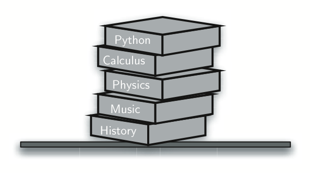
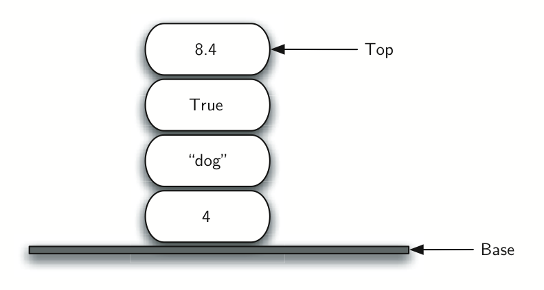
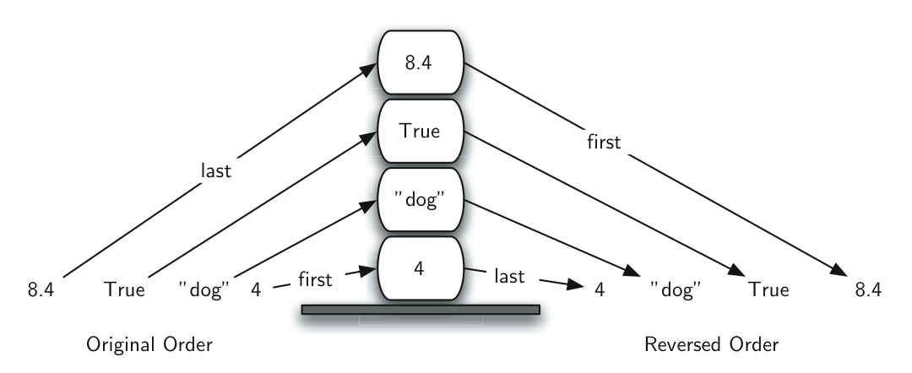
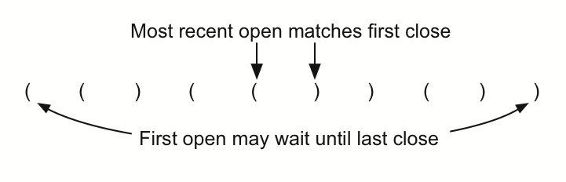
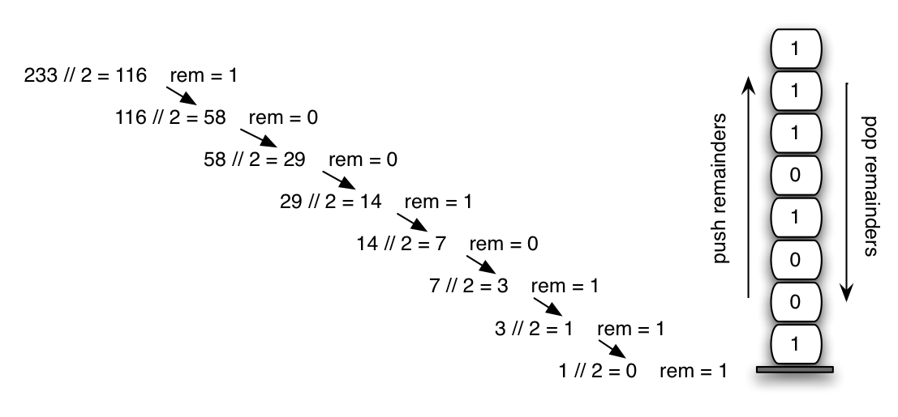
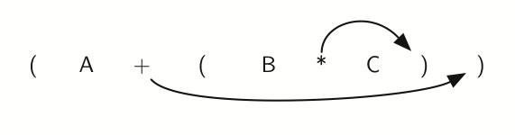
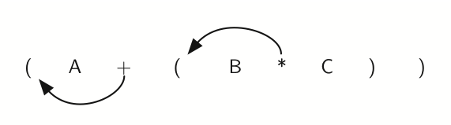
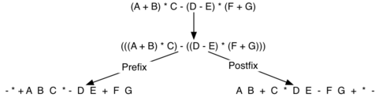
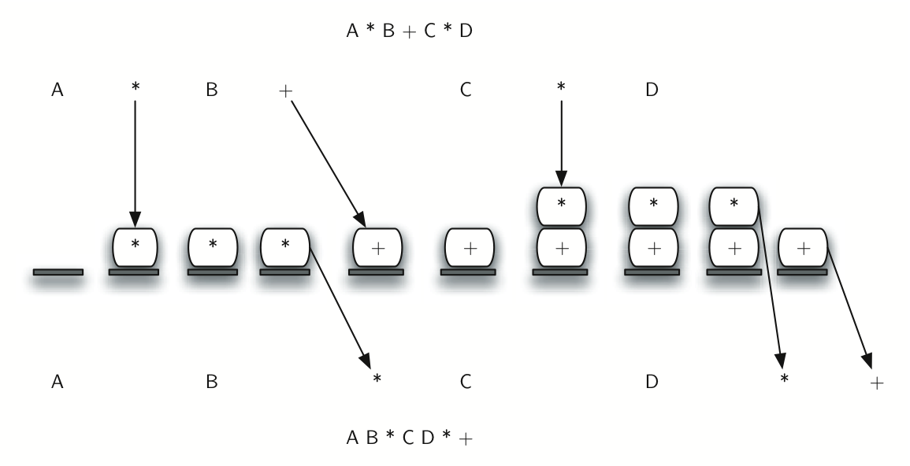
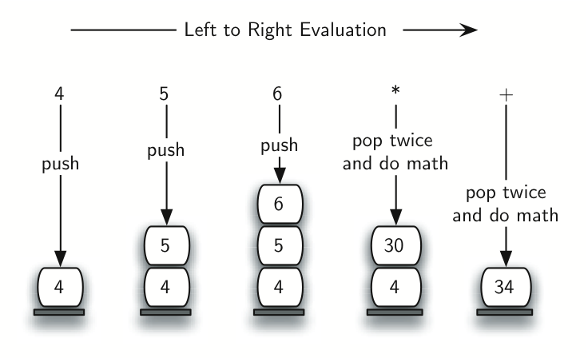
.. |image10| image:: BasicDS/Pictures/evalpostfix2.png
.. |image11| image:: BasicDS/Pictures/basicqueue.png
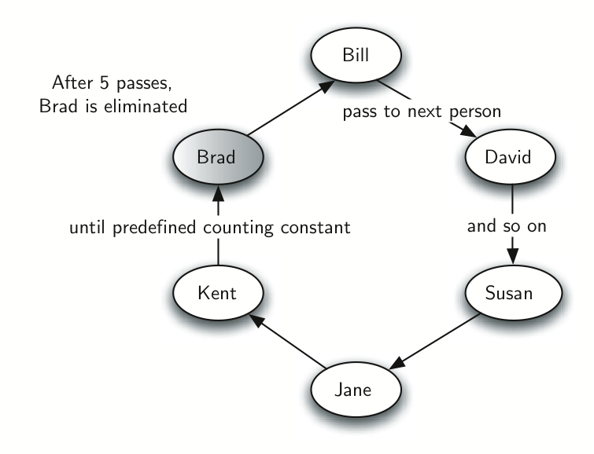
.. |image13| image:: BasicDS/Pictures/namequeue.png
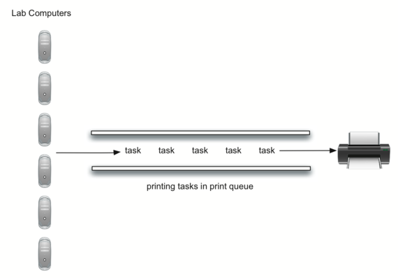
.. |image15| image:: BasicDS/Pictures/basicdeque.png
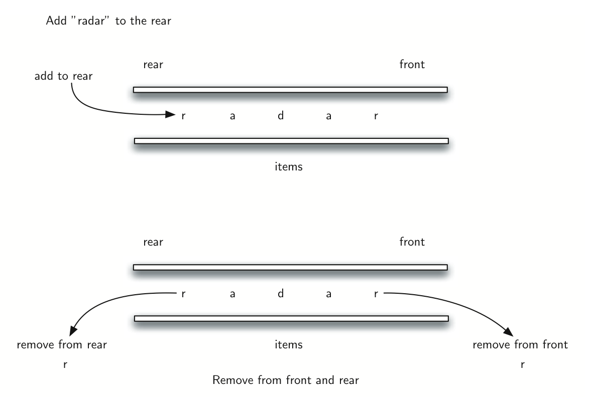
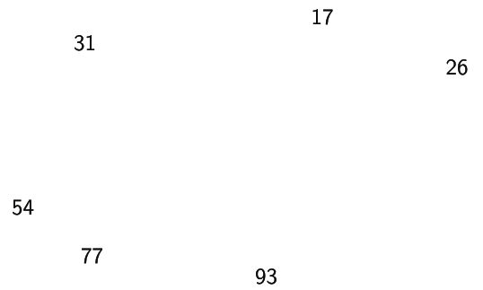
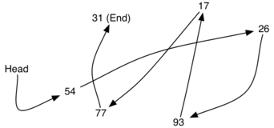
.. |image19| image:: BasicDS/Pictures/node.png
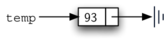
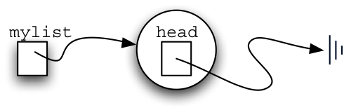
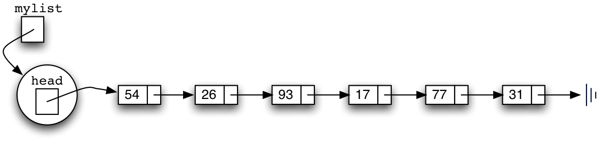
.. |image23| image:: BasicDS/Pictures/addtohead.png
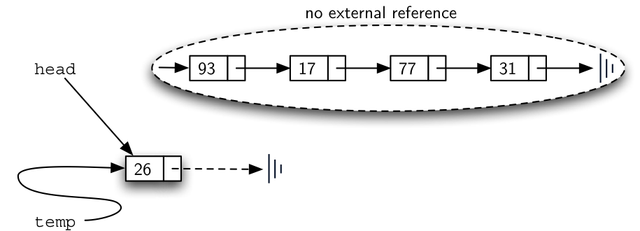
.. |image25| image:: BasicDS/Pictures/traversal.png
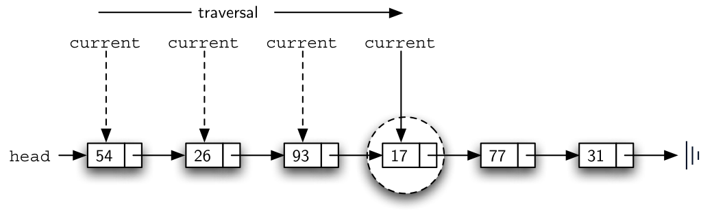
.. |image27| image:: BasicDS/Pictures/removeinit.png
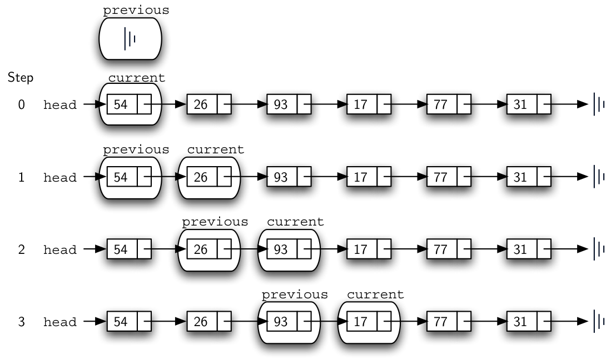
.. |image29| image:: BasicDS/Pictures/remove.png
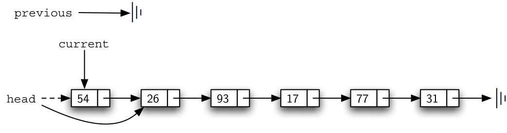
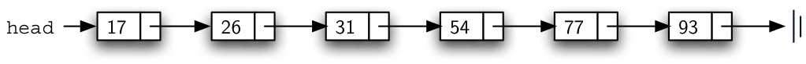
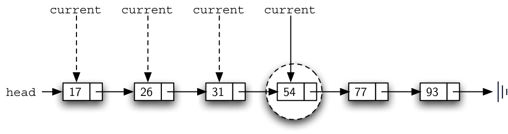
.. |image33| image:: BasicDS/Pictures/linkedlistinsert.png
