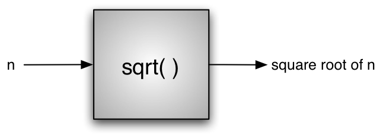
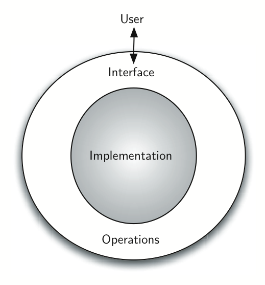
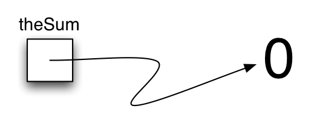
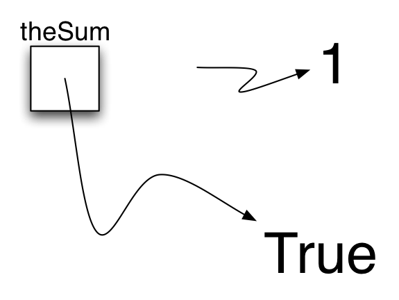
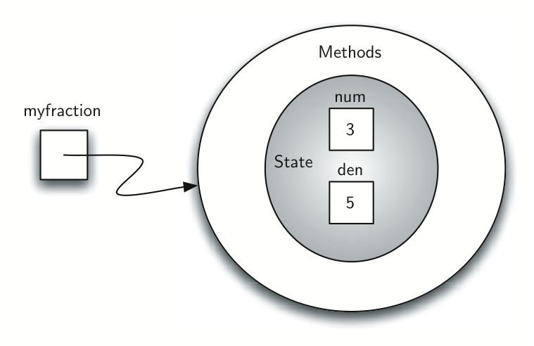
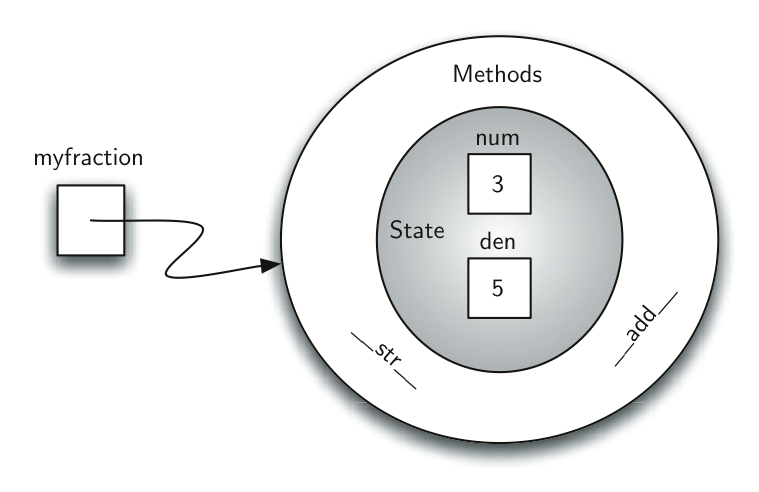
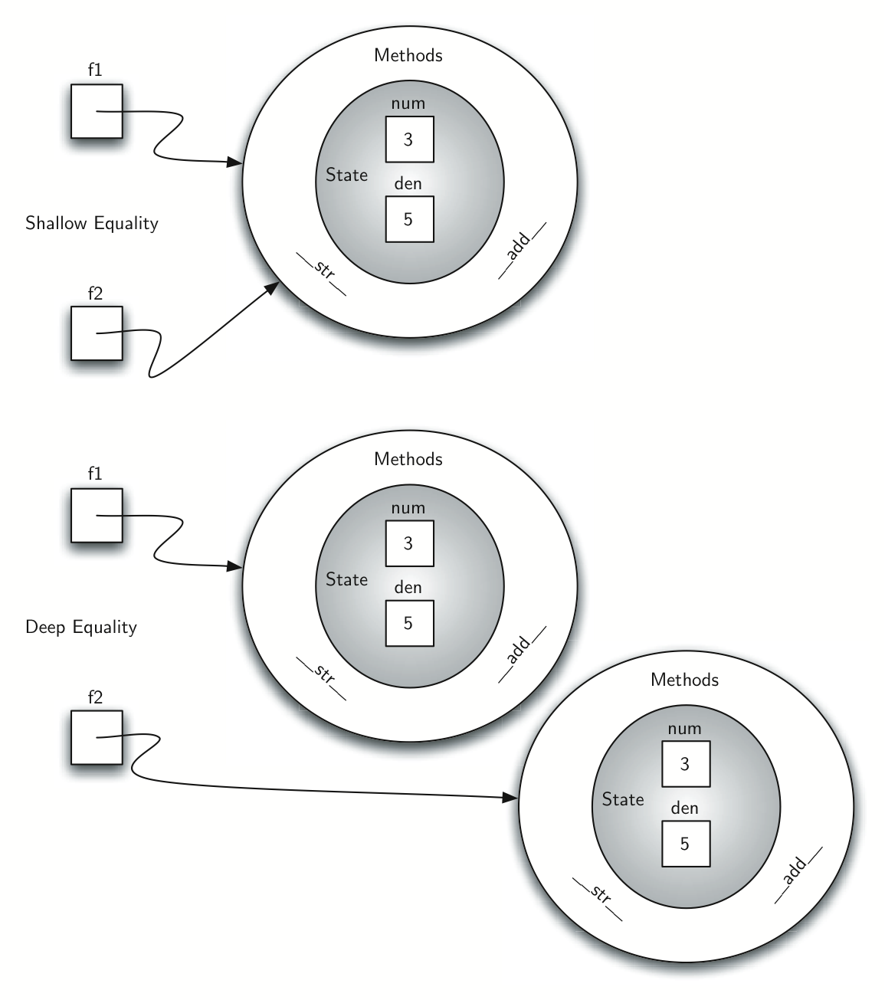
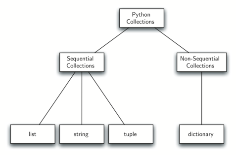
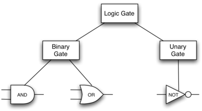

Introduction
============

.. highlight:: python
   :linenothreshold: 5

Objectives
----------

-  To review the ideas of computer science, programming, and
   problem-solving.

-  To understand abstraction and the role it plays in the
   problem-solving process.

-  To understand and implement the notion of an abstract data type.

-  To review the Python programming language.

Getting Started
---------------

The way we think about programming has undergone many changes in the
years since the first electronic computers required patch cables and
switches to convey instructions from human to machine. As is the case
with many aspects of society, changes in computing technology provide
computer scientists with a growing number of tools and platforms on
which to practice their craft. Advances such as faster processors,
high-speed networks, and large memory capacities have created a spiral
of complexity through which computer scientists must navigate.
Throughout all of this rapid evolution, a number of basic principles
have remained constant. The science of computing is concerned with using
computers to solve problems.

You have no doubt spent considerable time learning the basics of
problem-solving and hopefully feel confident in your ability to take a
problem statement and develop a solution. You have also learned that
writing computer programs is often hard. The complexity of large
problems and the corresponding complexity of the solutions can tend to
overshadow the fundamental ideas related to the problem-solving process.

This chapter emphasizes two important areas for the rest of the text.
First, it reviews the framework within which computer science and the
study of algorithms and data structures must fit, in particular, the
reasons why we need to study these topics and how understanding these
topics helps us to become better problem solvers. Second, we review the
Python programming language. Although we cannot provide a detailed,
exhaustive reference, we will give examples and explanations for the
basic constructs and ideas that will occur throughout the remaining
chapters.

What Is Computer Science?
-------------------------

Computer science is often difficult to define. This is probably due to
the unfortunate use of the word “computer” in the name. As you are
perhaps aware, computer science is not simply the study of computers.
Although computers play an important supporting role as a tool in the
discipline, they are just that–tools.

Computer science is the study of problems, problem-solving, and the
solutions that come out of the problem-solving process. Given a problem,
a computer scientist’s goal is to develop an **algorithm**, a
step-by-step list of instructions for solving any instance of the
problem that might arise. Algorithms are finite processes that if
followed will solve the problem. Algorithms are solutions.

Computer science can be thought of as the study of algorithms. However,
we must be careful to include the fact that some problems may not have a
solution. Although proving this statement is beyond the scope of this
text, the fact that some problems cannot be solved is important for
those who study computer science. We can fully define computer science,
then, by including both types of problems and stating that computer
science is the study of solutions to problems as well as the study of
problems with no solutions.

It is also very common to include the word **computable** when
describing problems and solutions. We say that a problem is computable
if an algorithm exists for solving it. An alternative definition for
computer science, then, is to say that computer science is the study of
problems that are and that are not computable, the study of the
existence and the nonexistence of algorithms. In any case, you will note
that the word “computer” did not come up at all. Solutions are
considered independent from the machine.

Computer science, as it pertains to the problem-solving process itself,
is also the study of **abstraction**. Abstraction allows us to view the
problem and solution in such a way as to separate the so-called logical
and physical perspectives. The basic idea is familiar to us in a common
example.

Consider the automobile that you may have driven to school or work
today. As a driver, a user of the car, you have certain interactions
that take place in order to utilize the car for its intended purpose.
You get in, insert the key, start the car, shift, brake, accelerate, and
steer in order to drive. From an abstraction point of view, we can say
that you are seeing the logical perspective of the automobile. You are
using the functions provided by the car designers for the purpose of
transporting you from one location to another. These functions are
sometimes also referred to as the **interface**.

On the other hand, the mechanic who must repair your automobile takes a
very different point of view. She not only knows how to drive but must
know all of the details necessary to carry out all the functions that we
take for granted. She needs to understand how the engine works, how the
transmission shifts gears, how temperature is controlled, and so on.
This is known as the physical perspective, the details that take place
“under the hood.”

The same thing happens when we use computers. Most people use computers
to write documents, send and receive email, surf the web, play music,
store images, and play games without any knowledge of the details that
take place to allow those types of applications to work. They view
computers from a logical or user perspective. Computer scientists,
programmers, technology support staff, and system administrators take a
very different view of the computer. They must know the details of how
operating systems work, how network protocols are configured, and how to
code various scripts that control function. They must be able to control
the low-level details that a user simply assumes.

The common point for both of these examples is that the user of the
abstraction, sometimes also called the client, does not need to know the
details as long as the user is aware of the way the interface works.
This interface is the way we as users communicate with the underlying
complexities of the implementation. As another example of abstraction,
consider the Python ``math`` module. Once we import the module, we can
perform computations such as

::

    >>> import math
    >>> math.sqrt(16)
    4.0
    >>>

This is an example of **procedural abstraction**. We do not necessarily
know how the square root is being calculated, but we know what the
function is called and how to use it. If we perform the import
correctly, we can assume that the function will provide us with the
correct results. We know that someone implemented a solution to the
square root problem but we only need to know how to use it. This is
sometimes referred to as a “black box” view of a process. We simply
describe the interface: the name of the function, what is needed (the
parameters), and what will be returned. The details are hidden inside
(:ref:`Figure 1 <fig_procabstraction>`).

.. _fig_procabstraction:

   Procedural Abstraction -- test

What Is Programming?
~~~~~~~~~~~~~~~~~~~~

**Programming** is the process of taking an algorithm and encoding it
into a notation, a programming language, so that it can be executed by a
computer. Although many programming languages and many different types
of computers exist, the important first step is the need to have the
solution. Without an algorithm there can be no program.

Computer science is not the study of programming. Programming, however,
is an important part of what a computer scientist does. Programming is
often the way that we create a representation for our solutions.
Therefore, this language representation and the process of creating it
becomes a fundamental part of the discipline.

Algorithms describe the solution to a problem in terms of the data
needed to represent the problem instance and the set of steps necessary
to produce the intended result. Programming languages must provide a
notational way to represent both the process and the data. To this end,
languages provide control constructs and data types.

Control constructs allow algorithmic steps to be represented in a
convenient yet unambiguous way. At a minimum, algorithms require
constructs that perform sequential processing, selection for
decision-making, and iteration for repetitive control. As long as the
language provides these basic statements, it can be used for algorithm
representation.

All data items in the computer are represented as strings of binary
digits. In order to give these strings meaning, we need to have **data
types**. Data types provide an interpretation for this binary data so
that we can think about the data in terms that make sense with respect
to the problem being solved. These low-level, built-in data types
(sometimes called the primitive data types) provide the building blocks
for algorithm development.

For example, most programming languages provide a data type for
integers. Strings of binary digits in the computer’s memory can be
interpreted as integers and given the typical meanings that we commonly
associate with integers (e.g. 23, 654, and -19). In addition, a data
type also provides a description of the operations that the data items
can participate in. With integers, operations such as addition,
subtraction, and multiplication are common. We have come to expect that
numeric types of data can participate in these arithmetic operations.

The difficulty that often arises for us is the fact that problems and
their solutions are very complex. These simple, language-provided
constructs and data types, although certainly sufficient to represent
complex solutions, are typically at a disadvantage as we work through
the problem-solving process. We need ways to control this complexity and
assist with the creation of solutions.

Why Study Data Structures and Abstract Data Types?
~~~~~~~~~~~~~~~~~~~~~~~~~~~~~~~~~~~~~~~~~~~~~~~~~~

To manage the complexity of problems and the problem-solving process,
computer scientists use abstractions to allow them to focus on the “big
picture” without getting lost in the details. By creating models of the
problem domain, we are able to utilize a better and more efficient
problem-solving process. These models allow us to describe the data that
our algorithms will manipulate in a much more consistent way with
respect to the problem itself.

Earlier, we referred to procedural abstraction as a process that hides
the details of a particular function to allow the user or client to view
it at a very high level. We now turn our attention to a similar idea,
that of **data abstraction**. An **abstract data type**, sometimes
abbreviated **ADT**, is a logical description of how we view the data
and the operations that are allowed without regard to how they will be
implemented. This means that we are concerned only with what the data is
representing and not with how it will eventually be constructed. By
providing this level of abstraction, we are creating an
**encapsulation** around the data. The idea is that by encapsulating the
details of the implementation, we are hiding them from the user’s view.
This is called **information hiding**.

:ref:`Figure 2 <fig_adt>` shows a picture of what an abstract data type is and how it
operates. The user interacts with the interface, using the operations
that have been specified by the abstract data type. The abstract data
type is the shell that the user interacts with. The implementation is
hidden one level deeper. The user is not concerned with the details of
the implementation.

.. _fig_adt:

   Abstract Data Type

The implementation of an abstract data type, often referred to as a
**data structure**, will require that we provide a physical view of the
data using some collection of programming constructs and primitive data
types. As we discussed earlier, the separation of these two perspectives
will allow us to define the complex data models for our problems without
giving any indication as to the details of how the model will actually
be built. This provides an **implementation-independent** view of the
data. Since there will usually be many different ways to implement an
abstract data type, this implementation independence allows the
programmer to switch the details of the implementation without changing
the way the user of the data interacts with it. The user can remain
focused on the problem-solving process.

Why Study Algorithms?
~~~~~~~~~~~~~~~~~~~~~

Computer scientists learn by experience. We learn by seeing others solve
problems and by solving problems by ourselves. Being exposed to
different problem-solving techniques and seeing how different algorithms
are designed helps us to take on the next challenging problem that we
are given. By considering a number of different algorithms, we can begin
to develop pattern recognition so that the next time a similar problem
arises, we are better able to solve it.

Algorithms are often quite different from one another. Consider the
example of ``sqrt`` seen earlier. It is entirely possible that there are
many different ways to implement the details to compute the square root
function. One algorithm may use many fewer resources than another. One
algorithm might take 10 times as long to return the result as the other.
We would like to have some way to compare these two solutions. Even
though they both work, one is perhaps “better” than the other. We might
suggest that one is more efficient or that one simply works faster or
uses less memory. As we study algorithms, we can learn analysis
techniques that allow us to compare and contrast solutions based solely
on their own characteristics, not the characteristics of the program or
computer used to implement them.

In the worst case scenario, we may have a problem that is intractable,
meaning that there is no algorithm that can solve the problem in a
realistic amount of time. It is important to be able to distinguish
between those problems that have solutions, those that do not, and those
where solutions exist but require too much time or other resources to
work reasonably.

There will often be trade-offs that we will need to identify and decide
upon. As computer scientists, in addition to our ability to solve
problems, we will also need to know and understand solution evaluation
techniques. In the end, there are often many ways to solve a problem.
Finding a solution and then deciding whether it is a good one are tasks
that we will do over and over again.

Review of Basic Python
----------------------

In this section, we will review the programming language Python and also
provide some more detailed examples of the ideas from the previous
section. If you are new to Python or find that you need more information
about any of the topics presented, we recommend that you consult the
resources listed at the end of this book.{oreilly04}{zelle04} Our goal
here is to reacquaint you with the language and also reinforce some of
the concepts that will be central to later chapters.

Python is a modern, easy-to-learn, object-oriented programming language.
It has a powerful set of built-in data types and easy-to-use control
constructs. Since Python is an interpreted language, it is most easily
reviewed by simply looking at and describing interactive sessions. You
should recall that the interpreter displays the familiar ``>>>`` prompt
and then evaluates the Python construct that you provide. For example,

::

    >>> print("Algorithms and Data Structures")
    Algorithms and Data Structures
    >>> 

shows the prompt, the ``print`` function, the result, and the next
prompt.

Getting Started with Data
~~~~~~~~~~~~~~~~~~~~~~~~~

We stated above that Python supports the object-oriented programming
paradigm. This means that Python considers data to be the focal point of
the problem-solving process. In Python, as well as in any other
object-oriented programming language, we define a **class** to be a
description of what the data look like (the state) and what the data can
do (the behavior). Classes are analogous to abstract data types because
a user of a class only sees the state and behavior of a data item. Data
items are called **objects** in the object-oriented paradigm. An object
is an instance of a class.

Built-in Atomic Data Types
^^^^^^^^^^^^^^^^^^^^^^^^^^

We will begin our review by considering the atomic data types. Python
has two main built-in numeric classes that implement the integer and
floating point data types. These Python classes are called ``int`` and
``float``. The standard arithmetic operations, +, -, \*, /, and \*\*
(exponentiation), can be used with parentheses forcing the order of
operations away from normal operator precedence. Other very useful
operations are the remainder (modulo) operator, %, and integer division,
//. Note that when two integers are divided, the result is a floating
point. The integer division operator returns the integer portion of the
quotient by truncating any fractional part.

.. activecode:: intro_1

    print 2+3*4
    print (2+3)*4
    print 2**10
    print 6/3
    print 7/3
    print 7//3
    print 7%3
    print 3/6
    print 3//6
    print 3%6
    print 2**100

The boolean data type, implemented as the Python ``bool`` class, will be
quite useful for representing truth values. The possible state values
for a boolean object are ``True`` and ``False`` with the standard
boolean operators, ``and``, ``or``, and ``not``.

::

    >>> True
    True
    >>> False
    False
    >>> False or True
    True
    >>> not (False or True)
    False
    >>> True and True
    True

Boolean data objects are also used as results for comparison operators
such as equality (==) and greater than (:math:`>`). In addition,
relational operators and logical operators can be combined together to
form complex logical questions. :ref:`Table 1 <tab_relational>` shows the relational
and logical operators with examples shown in the session that follows.

.. _tab_relational:

=========================== ============== ================================================================= 
         **Operation Name**   **Operator**                                                   **Explanation** 
=========================== ============== ================================================================= 
                  less than    :math:`<`                                                Less than operator 
               greater than    :math:`>`                                             Greater than operator 
         less than or equal   :math:`<=`                                    Less than or equal to operator 
      greater than or equal   :math:`>=`                                 Greater than or equal to operator 
                      equal   :math:`==`                                                 Equality operator 
                  not equal   :math:`!=`                                                Not equal operator 
                logical and  :math:`and`                          Both operands True for result to be True 
                 logical or   :math:`or`        One or the other operand is True for the result to be True 
                logical not  :math:`not`   Negates the truth value, False becomes True, True becomes False 
=========================== ============== ================================================================= 

    Relational and Logical Operators

.. activecode:: intro_2

    print(5==10)
    print(10 > 5)
    print((5 >= 1) and (5 <= 10))

Identifiers are used in programming languages as names. In Python,
identifiers start with a letter or an underscore (_), are case
sensitive, and can be of any length. Remember that it is always a good
idea to use names that convey meaning so that your program code is
easier to read and understand.

A Python variable is created when a name is used for the first time on
the left-hand side of an assignment statement. Assignment statements
provide a way to associate a name with a value. The variable will hold a
reference to a piece of data and not the data itself. Consider the
following session:

::

    >>> theSum = 0
    >>> theSum
    0
    >>> theSum = theSum + 1
    >>> theSum
    1
    >>> theSum = True
    >>> theSum
    True

The assignment statement ``theSum = 0`` creates a variable called
``theSum`` and lets it hold the reference to the data object ``0`` (see
:ref:`Figure 3 <fig_assignment1>`). In general, the right-hand side of the assignment
statement is evaluated and a reference to the resulting data object is
“assigned” to the name on the left-hand side. At this point in our
example, the type of the variable is integer as that is the type of the
data currently being referred to by ``thesum``. If the type of the data
changes (see :ref:`Figure 4 <fig_assignment2>`), as shown above with the boolean
value ``True``, so does the type of the variable (``thesum`` is now of
the type boolean). The assignment statement changes the reference being
held by the variable. This is a dynamic characteristic of Python. The
same variable can refer to many different types of data.

.. _fig_assignment1:

   Variables Hold References to Data Objects

.. _fig_assignment2:

   Assignment Changes the Reference

Built-in Collection Data Types
^^^^^^^^^^^^^^^^^^^^^^^^^^^^^^

In addition to the numeric and boolean classes, Python has a number of
very powerful built-in collection classes. Lists, strings, and tuples
are ordered collections that are very similar in general structure but
have specific differences that must be understood for them to be used
properly. Sets and dictionaries are unordered collections.

A **list** is an ordered collection of zero or more references to Python
data objects. Lists are written as comma-delimited values enclosed in
square brackets. The empty list is simply ``[ ]``. Lists are
heterogeneous, meaning that the data objects need not all be from the
same class and the collection can be assigned to a variable as below.
The following fragment shows a variety of Python data objects in a list.

::

    >>> [1,3,True,6.5]
    [1, 3, True, 6.5]
    >>> myList = [1,3,True,6.5]
    >>> myList
    [1, 3, True, 6.5]

Note that when Python evaluates a list, the list itself is returned.
However, in order to remember the list for later processing, its
reference needs to be assigned to a variable.

Since lists are considered to be sequentially ordered, they support a
number of operations that can be applied to any Python sequence.
:ref:`Table 2 <tab_sequence>` reviews these operations and the following session
gives examples of their use.

.. _tab_sequence:

=========================== ============== ======================================== 
         **Operation Name**   **Operator**                          **Explanation** 
=========================== ============== ======================================== 
                   indexing            [ ]          Access an element of a sequence 
              concatenation             \+          Combine sequences together
                 repetition             \*   Concatenate a repeated number of times 
                 membership             in     Ask whether an item is in a sequence 
                     length            len  Ask the number of items in the sequence 
                    slicing          [ : ]             Extract a part of a sequence 
=========================== ============== ======================================== 

    Operations on Any Sequence in Python

Note that the indices for lists (sequences) start counting with 0. The
slice operation, myList[1:3], returns a list of items starting with the
item indexed by 1 up to but not including the item indexed by 3.

Sometimes, you will want to initialize a list. This can quickly be
accomplished by using repetition. For example,

::

    >>> myList = [0] * 6
    >>> myList
    [0, 0, 0, 0, 0, 0]

One very important aside relating to the repetition operator is that the
result is a repetition of references to the data objects in the
sequence. This can best be seen by considering the following session:

.. activecode:: intro_3

    myList = [1,2,3,4]
    A = [myList]*3
    print(A)
    myList[2]=45
    print(A)

The variable ``A`` holds a collection of three references to the
original list called ``myList``. Note that a change to one element of
``myList`` shows up in all three occurrences in ``A``.

Lists support a number of methods that will be used to build data
structures. :ref:`Table 3 <tab_listmethods>` provides a summary. Examples of their
use follow.

.. _tab_listmethods:

======================== ========================== ======================================================= 
         **Method Name**                    **Use**                                         **Explanation** 
======================== ========================== ======================================================= 
              ``append``     ``alist.append(item)``                    Adds a new item to the end of a list 
              ``insert``   ``alist.insert(i,item)``           Inserts an item at the ith position in a list 
                 ``pop``            ``alist.pop()``             Removes and returns the last item in a list 
                 ``pop``           ``alist.pop(i)``              Removes and returns the ith item in a list 
                ``sort``           ``alist.sort()``                            Modifies a list to be sorted 
             ``reverse``        ``alist.reverse()``                  Modifies a list to be in reverse order 
                 ``del``           ``del alist[i]``                    Deletes the item in the ith position 
               ``index``      ``alist.index(item)``   Returns the index of the first occurrence of ``item`` 
               ``count``      ``alist.count(item)``           Returns the number of occurrences of ``item`` 
              ``remove``     ``alist.remove(item)``                Removes the first occurrence of ``item`` 
======================== ========================== ======================================================= 

    Methods Provided by Lists in Python

.. activecode:: intro_5

    myList = [1024, 3, True, 6.5]
    myList.append(False)
    print(myList)
    myList.insert(2,4.5)
    print(myList)
    print(myList.pop())
    print(myList)
    print(myList.pop(1))
    print(myList)
    myList.pop(2)
    print(myList)
    myList.sort()
    print(myList)
    myList.reverse()
    print(myList)
    print(myList.count(6.5))
    print(myList.index(4.5))
    myList.remove(6.5)
    print(myList)
    del myList[0]
    print(myList)

You can see that some of the methods, such as ``pop``, return a value
and also modify the list. Others, such as ``reverse``, simply modify the
list with no return value. ``pop`` will default to the end of the list
but can also remove and return a specific item. The index range starting
from 0 is again used for these methods. You should also notice the
familiar “dot” notation for asking an object to invoke a method.
``myList.append(False)`` can be read as “ask the object ``myList`` to
perform its ``append`` method and send it the value ``False``.” Even
simple data objects such as integers can invoke methods in this way.

::

    >>> (54).__add__(21)
    75
    >>> 

In this fragment we are asking the integer object ``54`` to execute its
``add`` method (called ``__add__`` in Python) and passing it ``21`` as
the value to add. The result is the sum, ``75``. Of course, we usually
write this as ``54+21``. We will say much more about these methods later
in this section.

One common Python function that is often discussed in conjunction with
lists is the ``range`` function. ``range`` produces a range object that
represents a sequence of values. By using the ``list`` function, it is
possible to see the value of the range object as a list. This is
illustrated below.

::

    >>> range(10)
    range(0, 10)
    >>> list(range(10))
    [0, 1, 2, 3, 4, 5, 6, 7, 8, 9]
    >>> range(5,10)
    range(5, 10)
    >>> list(range(5,10))
    [5, 6, 7, 8, 9]
    >>> list(range(5,10,2))
    [5, 7, 9]
    >>> list(range(10,1,-1))
    [10, 9, 8, 7, 6, 5, 4, 3, 2]
    >>> 

The range object represents a sequence of integers. By default, it will
start with 0. If you provide more parameters, it will start and end at
particular points and can even skip items. In our first example,
``range(10)``, the sequence starts with 0 and goes up to but does not
include 10. In our second example, ``range(5,10)`` starts at 5 and goes
up to but not including 10. ``range(5,10,2)`` performs similarly but
skips by twos (again, 10 is not included).

**Strings** are sequential collections of zero or more letters, numbers
and other symbols. We call these letters, numbers and other symbols
*characters*. Literal string values are differentiated from identifiers
by using quotation marks (either single or double).

::

    >>> "David"
    'David'
    >>> myName = "David"
    >>> myName[3]
    'i'
    >>> myName*2
    'DavidDavid'
    >>> len(myName)
    5
    >>> 

Since strings are sequences, all of the sequence operations described
above work as you would expect. In addition, strings have a number of
methods, some of which are shown in :ref:`Table 4<tab_stringmethods>`. For example,

::

    >>> myName
    'David'
    >>> myName.upper()
    'DAVID' 
    >>> myName.center(10)
    '  David   '
    >>> myName.find('v')
    2
    >>> myName.split('v')
    ['Da', 'id']

Of these, ``split`` will be very useful for processing data. ``split``
will take a string and return a list of strings using the split
character as a division point. In the example, ``v`` is the division
point. If no division is specified, the split method looks for
whitespace characters such as tab, newline and space.

.. _tab_stringmethods:

======================== ========================= ============================================================= 
         **Method Name**                   **Use**                                               **Explanation** 
======================== ========================= ============================================================= 
              ``center``     ``astring.center(w)``            Returns a string centered in a field of size ``w`` 
               ``count``   ``astring.count(item)``   Returns the number of occurrences of ``item`` in the string 
               ``ljust``      ``astring.ljust(w)``      Returns a string left-justified in a field of size ``w`` 
               ``lower``       ``astring.lower()``                             Returns a string in all lowercase 
               ``rjust``      ``astring.rjust(w)``     Returns a string right-justified in a field of size ``w`` 
                ``find``    ``astring.find(item)``         Returns the index of the first occurrence of ``item`` 
               ``split``  ``astring.split(schar)``                  Splits a string into substrings at ``schar`` 
======================== ========================= ============================================================= 

    Methods Provided by Strings in Python

A major difference between lists and strings is that lists can be
modified while strings cannot. This is referred to as **mutability**.
Lists are mutable; strings are immutable. For example, you can change an
item in a list by using indexing and assignment. With a string that
change is not allowed.

::

    >>> myList
    [1, 3, True, 6.5]
    >>> myList[0]=2**10
    >>> myList
    [1024, 3, True, 6.5]
    >>> 
    >>> myName
    'David'
    >>> myName[0]='X'

    Traceback (most recent call last):
      File "<pyshell#84>", line 1, in -toplevel-
        myName[0]='X'
    TypeError: object doesn't support item assignment
    >>> 

Tuples are very similar to lists in that they are heterogeneous
sequences of data. The difference is that a tuple is immutable, like a
string. A tuple cannot be changed. Tuples are written as comma-delimited
values enclosed in parentheses. As sequences, they can use any operation
described above. For example,

::

    >>> myTuple = (2,True,4.96)
    >>> myTuple
    (2, True, 4.96)
    >>> len(myTuple)
    3
    >>> myTuple[0]
    2
    >>> myTuple * 3
    (2, True, 4.96, 2, True, 4.96, 2, True, 4.96)
    >>> myTuple[0:2]
    (2, True)
    >>> 

However, if you try to change an item in a tuple, you will get an error.
Note that the error message provides location and reason for the
problem.

::

    >>> myTuple[1]=False

    Traceback (most recent call last):
      File "<pyshell#137>", line 1, in -toplevel-
        myTuple[1]=False
    TypeError: object doesn't support item assignment
    >>> 

A set is an unordered collection of zero or more immutable Python data
objects. Sets do not allow duplicates and are written as comma-delimited
values enclosed in curly braces. The empty set is represented by
``set()``. Sets are heterogeneous, and the collection can be assigned to
a variable as below.

::

    >>> {3,6,"cat",4.5,False}
    {False, 4.5, 3, 6, 'cat'}
    >>> mySet = {3,6,"cat",4.5,False}
    >>> mySet
    {False, 4.5, 3, 6, 'cat'}
    >>> 

Even though sets are not considered to be sequential, they do support a
few of the familiar operations presented earlier. :ref:`Table 5 <tab_setops>` reviews
these operations and the following session gives examples of their use.

.. _tab_setops:

=========================== ===================== =================================================================== 
         **Operation Name**          **Operator**                                                     **Explanation** 
=========================== ===================== =================================================================== 
                 membership                    in                                                      Set membership 
                     length                   len                                  Returns the cardinality of the set 
                      ``|``   ``aset | otherset``                  Returns a new set with all elements from both sets 
                      ``&``   ``aset & otherset``      Returns a new set with only those elements common to both sets 
                      ``-``   ``aset - otherset``   Returns a new set with all items from the first set not in second 
                     ``<=``  ``aset <= otherset``       Asks whether all elements of  the first set are in the second 
=========================== ===================== =================================================================== 

    Operations on a Set in Python

::

    >>> mySet
    {False, 4.5, 3, 6, 'cat'}
    >>> len(mySet)
    5
    >>> False in mySet
    True
    >>> "dog" in mySet
    False
    >>> 

Sets support a number of methods that should be familiar to those who
have worked with them in a mathematics setting. :ref:`Table 6 <tab_setmethods>`
provides a summary. Examples of their use follow. Note that ``union``,
``intersection``, ``issubset``, and ``difference`` all have operators
that can be used as well.

.. _tab_setmethods:

======================== ================================= ================================================================ 
         **Method Name**                           **Use**                                                  **Explanation** 
======================== ================================= ================================================================ 
               ``union``          ``aset.union(otherset)``               Returns a new set with all elements from both sets 
        ``intersection``   ``aset.intersection(otherset)``   Returns a new set with only those elements common to both sets 
          ``difference``     ``aset.difference(otherset)``    Returns a new set with all items from first set not in second 
            ``issubset``       ``aset.issubset(otherset)``            Asks whether all elements of one set are in the other 
                 ``add``                ``aset.add(item)``                                             Adds item to the set 
              ``remove``             ``aset.remove(item)``                                        Removes item from the set 
                 ``pop``                    ``aset.pop()``                        Removes an arbitrary element from the set 
               ``clear``                  ``aset.clear()``                                Removes all elements from the set 
======================== ================================= ================================================================ 

    Methods Provided by Sets in Python

::

    >>> mySet
    {False, 4.5, 3, 6, 'cat'}
    >>> yourSet = {99,3,100}
    >>> mySet.union(yourSet)
    {False, 4.5, 3, 100, 6, 'cat', 99}
    >>> mySet | yourSet
    {False, 4.5, 3, 100, 6, 'cat', 99}
    >>> mySet.intersection(yourSet)
    {3}
    >>> mySet & yourSet
    {3}
    >>> mySet.difference(yourSet)
    {False, 4.5, 6, 'cat'}
    >>> mySet - yourSet
    {False, 4.5, 6, 'cat'}
    >>> {3,100}.issubset(yourSet)
    True
    >>> {3,100}<=yourSet
    True
    >>> mySet.add("house")
    >>> mySet
    {False, 4.5, 3, 6, 'house', 'cat'}
    >>> mySet.remove(4.5)
    >>> mySet
    {False, 3, 6, 'house', 'cat'}
    >>> mySet.pop()
    False
    >>> mySet
    {3, 6, 'house', 'cat'}
    >>> mySet.clear()
    >>> mySet
    set()
    >>> 

Our final Python collection is an unordered structure called a
**dictionary**. Dictionaries are collections of associated pairs of
items where each pair consists of a key and a value. This key-value pair
is typically written as key:value. Dictionaries are written as
comma-delimited key:value pairs enclosed in curly braces. For example,

::

    >>> capitals = {'Iowa':'DesMoines','Wisconsin':'Madison'}
    >>> capitals  
    {'Wisconsin': 'Madison', 'Iowa': 'DesMoines'}
    >>>

We can manipulate a dictionary by accessing a value via its key or by
adding another key-value pair. The syntax for access looks much like a
sequence access except that instead of using the index of the item we
use the key value. To add a new value is similar.

.. activecode:: intro_7

    capitals = {'Iowa':'DesMoines','Wisconsin':'Madison'}
    print(capitals['Iowa'])
    capitals['Utah']='SaltLakeCity'
    print(capitals)
    capitals['California']='Sacramento'
    print(len(capitals))
    for k in capitals:
       print(capitals[k]," is the capital of ", k)

It is important to note that the dictionary is maintained in no
particular order with respect to the keys. The first pair added
(``'Utah':`` ``'SaltLakeCity'``) was placed first in the dictionary and
the second pair added (``'California':`` ``'Sacramento'``) was placed
last. The placement of a key is dependent on the idea of “hashing,”
which will be explained in more detail in Chapter 4. We also show the
length function performing the same role as with previous collections.

Dictionaries have both methods and operators. :ref:`Table x <tab_dictopers>` and
:ref:`Table x <tab_dictmethods>` describe them, and the sessions shows them in action. The
``keys``, ``values``, and ``items`` methods all return objects that
contain the values of interest. You can use the ``list`` function to
convert them to lists. You will also see that there are two variations
on the ``get`` method. If the key is not present in the dictionary,
``get`` will return ``None``. However, a second, optional parameter can
specify a return value instead.

.. _tab_dictopers:

===================== ================== ===================================================================== 
         **Operator**            **Use**                                                       **Explanation** 
===================== ================== ===================================================================== 
               ``[]``      ``myDict[k]``       Returns the value associated with ``k``, otherwise its an error 
               ``in``   ``key in adict``   Returns ``True`` if key is in the   dictionary, ``False`` otherwise 
              ``del`` del ``adict[key]``                                Removes the entry from the  dictionary 
===================== ================== ===================================================================== 

    Operators Provided by Dictionaries in Python

::

    >>> phoneext={'david':1410,'brad':1137}
    >>> phoneext
    {'brad': 1137, 'david': 1410}
    >>> phoneext.keys()
    dict_keys(['brad', 'david'])
    >>> list(phoneext.keys())
    ['brad', 'david']
    >>> phoneext.values()
    dict_values([1137, 1410])
    >>> list(phoneext.values())
    [1137, 1410]
    >>> phoneext.items()
    dict_items([('brad', 1137), ('david', 1410)])
    >>> list(phoneext.items())
    [('brad', 1137), ('david', 1410)]
    >>> phoneext.get("kent")
    >>> phoneext.get("kent","NO ENTRY")
    'NO ENTRY'
    >>> 

.. _tab_dictmethods:

======================== ==================== =============================================================== 
         **Method Name**              **Use**                                                 **Explanation** 
======================== ==================== =============================================================== 
                ``keys``     ``adict.keys()``       Returns the keys of the dictionary in a dict_keys object 
              ``values``   ``adict.values()``   Returns the values of the dictionary in a dict_values object 
               ``items``    ``adict.items()``             Returns the key-value pairs in a dict_items object 
                 ``get``     ``adict.get(k)``     Returns the value associated with ``k``, ``None`` otherwise 
                 ``get`` ``adict.get(k,alt)``      Returns the value associated with ``k``, ``alt`` otherwise 
======================== ==================== =============================================================== 

    {Methods Provided by Dictionaries in Python} {dictmethods}

.. actex:: scratch_test

Input and Output
~~~~~~~~~~~~~~~~

We often have a need to interact with users,
either to get data or to provide some sort of result. Most programs
today use a dialog bcox as a way of asking the user to provide some type
of input. While Python does have a way to create dialog boxes, there is
a much simpler function that we can use. Python provides us with a
function that allows us to ask a user to enter some data and returns a
reference to the data in the form of a string. The function is called
``input``.

Python’s input function takes a single parameter that is a string. This
string is often called the {**prompt**} because it contains some helpful
text prompting the user to enter something. For example, you might call
input as follows:

::

    aName = input('Please enter your name: ')

Now whatever the user types after the prompt will be stored in the
``aName`` variable. Using the input function, we can easily write
instructions that will prompt the user to enter data and then
incorporate that data into further processing. For example, in the
following two statements, the first asks the user for their name and the
second prints the result of some simple processing based on the string
that is provided.

.. activecode::  strstuff

    aName = input("Please enter your name ")
    print("Your name in all capitals is ",aName.upper(), 
          "and has length", len(aName))

It is important to note that the value returned from the ``input``
function will be a string representing the exact characters that were
entered after the prompt. If you want this string interpreted as another
type, you must provide the type conversion explicitly. In the statements
below, the string that is entered by the user is converted to a float so
that it can be used in further arithmetic processing.

::

    sradius = input("Please enter the radius of the circle ")
    radius = float(sradius)
    diameter = 2 * radius

String Formatting
^^^^^^^^^^^^^^^^^

We have already seen that the ``print``
function provides a very simple way to output values from a Python
program. ``print`` takes zero or more parameters and displays them using
a single blank as the default separator. It is possible to change the
separator character by setting the ``sep`` argument. In addition, each
print ends with a newline character by default. This behavior can be
changed by setting the ``end`` argument. These variations are shown in
the following session:

::

    >>> print("Hello")
    Hello
    >>> print("Hello","World")
    Hello World
    >>> print("Hello","World", sep="***")
    Hello***World
    >>> print("Hello","World", end="***")
    Hello World***>>> 

It is often useful to have more control over the look of your output.
Fortunately, Python provides us with an alternative called **formatted
strings**. A formatted string is a template in which words or spaces
that will remain constant are combined with placeholders for variables
that will be inserted into the string. For example, the statement

::

    print(aName, "is", age, "years old.")

contains the words ``is`` and ``years old``, but the name and the age
will change depending on the variable values at the time of execution.
Using a formatted string, we write the previous statement as

::

    print("%s is %d years old." % (aName, age))

This simple example illustrates a new string expression. The ``%``
operator is a string operator called the **format operator**. The left
side of the expression holds the template or format string, and the
right side holds a collection of values that will be substituted into
the format string. Note that the number of values in the collection on
the right side corresponds with the number of ``%`` characters in the
format string. Values are taken—in order, left to right—from the
collection and inserted into the format string.

Let’s look at both sides of this formatting expression in more detail.
The format string may contain one or more conversion specifications. A
conversion character tells the format operator what type of value is
going to be inserted into that position in the string. In the example
above, the ``%s`` specifies a string, while the ``%d`` specifies an
integer. Other possible type specifications include ``i``, ``u``, ``f``,
``e``, ``g``, ``c``, or ``%``. :ref:`Table 7 <tab_fmta>` summarizes all of the
various type specifications.

.. _tab_fmta:

========================== ==================================================================================================== 
             **Character**                                                                                    **Output Format** 
========================== ==================================================================================================== 
               ``d``,``i``                                                                                              Integer 
                     ``u``                                                                                     Unsigned integer 
                     ``f``                                                                            Floating point as m.ddddd 
                     ``e``                                                                      Floating point as m.ddddde+/-xx 
                     ``E``                                                                      Floating point as m.dddddE+/-xx 
                     ``g``   Use ``%e`` for exponents less than :math:`-4` or greater than :math:`+5`, otherwise use ``%f`` 
                     ``c``                                                                                     Single character 
                     ``s``   String, or any Python data object that can be converted to a string by using the ``str`` function. 
                     ``%``                                                                         Insert a literal % character 
========================== ==================================================================================================== 

    String Formatting Conversion Characters

In addition to the format character, you can also include a format
modifier between the ``%`` and the format character. Format modifiers may
be used to left-justify or right-justifiy the value with a specified
field width. Modifiers can also be used to specify the field width along
with a number of digits after the decimal point. :ref:`Table 8 <tab_fmtaddsa>`
explains these format modifiers

.. _tab_fmtaddsa:

========================= ============= ================================================================================================== 
             **Modifier**   **Example**                                                                                    **Description** 
========================= ============= ================================================================================================== 
                   number      ``%20d``                                                               Put the value in a field width of 20 
                        -     ``%-20d``                                        Put the value in a field 20 characters wide, left-justified 
                        +     ``%+20d``                                       Put the value in a field 20 characters wide, right-justified 
                        0     ``%020d``                           Put the value in a field 20 characters wide, fill in with leading zeros. 
                        .    ``%20.2f``   Put the value in a field 20 characters wide with 2 characters to the right of the decimal point. 
               ``(name)``  ``%(name)d``                              Get the value from the supplied dictionary using ``name`` as the key. 
========================= ============= ================================================================================================== 

    Additional formatting options

The right side of the format operator is a collection of values that
will be inserted into the format string. The collection will be either a
tuple or a dictionary. If the collection is a tuple, the values are
inserted in order of position. That is, the first element in the tuple
corresponds to the first format character in the format string. If the
collection is a dictionary, the values are inserted according to their
keys. In this case all format characters must use the ``(name)``
modifier to specify the name of the key.

::

    >>> price = 24
    >>> item = "banana"
    >>> print("The %s costs %d cents"%(item,price))
    The banana costs 24 cents
    >>> print("The %+10s costs %5.2f cents"%(item,price))
    The     banana costs 24.00 cents
    >>> print("The %+10s costs %10.2f cents"%(item,price))
    The     banana costs      24.00 cents
    >>> itemdict = {"item":"banana","cost":24}
    >>> print("The %(item)s costs %(cost)7.1f cents"%itemdict)
    The banana costs    24.0 cents
    >>> 

In addition to format strings that use format characters and format
modifiers, Python strings also include a ``format`` method that can be
used in conjunction with a new ``Formatter`` class to implement complex
string formatting. More about these features can be found in the Python
library reference manual.

Control Structures
~~~~~~~~~~~~~~~~~~

As we noted earlier, algorithms require two important control
structures: iteration and selection. Both of these are supported by
Python in various forms. The programmer can choose the statement that is
most useful for the given circumstance.

For iteration, Python provides a standard ``while`` statement and a very
powerful ``for`` statement. The while statement repeats a body of code
as long as a condition is true. For example,

::

    >>> counter = 1
    >>> while counter <= 5:
    ...     print("Hello, world")
    ...     counter = counter + 1

    Hello, world
    Hello, world
    Hello, world
    Hello, world
    Hello, world

prints out the phrase “Hello, world” five times. The condition on the
``while`` statement is evaluated at the start of each repetition. If the
condition is ``True``, the body of the statement will execute. It is
easy to see the structure of a Python ``while`` statement due to the
mandatory indentation pattern that the language enforces.

The ``while`` statement is a very general purpose iterative structure
that we will use in a number of different algorithms. In many cases, a
compound condition will control the iteration. A fragment such as

::

    while counter <= 10 and not done:
    ...

would cause the body of the statement to be executed only in the case
where both parts of the condition are satisfied. The value of the
variable ``counter`` would need to be less than or equal to 10 and the
value of the variable ``done`` would need to be ``False`` (``not False``
is ``True``) so that ``True and True`` results in ``True``.

Even though this type of construct is very useful in a wide variety of
situations, another iterative structure, the ``for`` statement, can be
used in conjunction with many of the Python collections. The ``for``
statement can be used to iterate over the members of a collection, so
long as the collection is a sequence. So, for example,

::

    >>> for item in [1,3,6,2,5]:
    ...    print(item)
    ... 
    1
    3
    6
    2
    5

assigns the variable ``item`` to be each successive value in the list
[1,3,6,2,5]. The body of the iteration is then executed. This works for
any collection that is a sequence (lists, tuples, and strings).

A common use of the ``for`` statement is to implement definite iteration
over a range of values. The statement

::

    >>> for item in range(5):
    ...    print(item**2)
    ... 
    0
    1
    4
    9
    16
    >>> 

will perform the ``print`` function five times. The ``range`` function
will return a range object representing the sequence 0,1,2,3,4 and each
value will be assigned to the variable ``item``. This value is then
squared and printed.

The other very useful version of this iteration structure is used to
process each character of a string. The following code fragment iterates
over a list of strings and for each string processes each character by
appending it to a list. The result is a list of all the letters in all
of the words.

.. activecode:: intro_8

    wordlist = ['cat','dog','rabbit']
    letterlist = [ ]
    for aword in wordlist:
        for aletter in aword:
            letterlist.append(aletter)
    print(letterlist)

Selection statements allow programmers to ask questions and then, based
on the result, perform different actions. Most programming languages
provide two versions of this useful construct: the ``ifelse`` and the
``if``. A simple example of a binary selection uses the ``ifelse``
statement.

::

    if n<0:
       print("Sorry, value is negative")
    else:
       print(math.sqrt(n))

In this example, the object referred to by ``n`` is checked to see if it
is less than zero. If it is, a message is printed stating that it is
negative. If it is not, the statement performs the ``else`` clause and
computes the square root.

Selection constructs, as with any control construct, can be nested so
that the result of one question helps decide whether to ask the next.
For example, assume that ``score`` is a variable holding a reference to
a score for a computer science test.

::

    if score >= 90:
       print('A')
    else:
       if score >=80:
          print('B')
       else
          if score >= 70:
             print('C')
          else:
             if score >= 60:
                print('D')
             else:
                print('F')

This fragment will classify a value called ``score`` by printing the
letter grade earned. If the score is greater than or equal to 90, the
statement will print ``A``. If it is not (``else``), the next question
is asked. If the score is greater than or equal to 80 then it must be
between 80 and 89 since the answer to the first question was false. In
this case print ``B`` is printed. You can see that the Python
indentation pattern helps to make sense of the association between
``if`` and ``else`` without requiring any additional syntactic elements.

An alternative syntax for this type of nested selection uses the
``elif`` keyword. The ``else`` and the next ``if`` are combined so as to
eliminate the need for additional nesting levels. Note that the final
``else`` is still necessary to provide the default case if all other
conditions fail.

::

    if score >= 90:
       print('A')
    elif score >=80:
       print('B')
    elif score >= 70:
       print('C')
    elif score >= 60:
       print('D')
    else:
       print('F')

Python also has a single way selection construct, the ``if`` statement.
With this statement, if the condition is true, an action is performed.
In the case where the condition is false, processing simply continues on
to the next statement after the ``if``. For example, the following
fragment will first check to see if the value of a variable ``n`` is
negative. If it is, then it is modified by the absolute value function.
Regardless, the next action is to compute the square root.

::

    if n<0:
       n = abs(n)
    print(math.sqrt(n))

.. admonition:: Self Check

    Test your understanding of what we have covered so far by trying the following
    exercise.  Modify the code from activecode_7 so that the final list only contains 
    a single copy of each letter.
  
    .. activecode:: self_check_1
  
       # the answer is: ['c', 'a', 't', 'd', 'o', 'g', 'r', 'b', 'i']

    

Returning to lists, there is an alternative method for creating a list
that uses iteration and selection constructs. The is known as a **list
comprehension**. A list comprehension allows you to easily create a list
based on some processing or selection criteria. For example, if we would
like to create a list of the first 10 perfect squares, we could use a
``for`` statement:

::

    >>> sqlist=[]
    >>> for x in range(1,11):
             sqlist.append(x*x)

    >>> sqlist
    [1, 4, 9, 16, 25, 36, 49, 64, 81, 100]
    >>> 

Using a list comprehension, we can do this in one step as

::

    >>> sqlist=[x*x for x in range(1,11)]
    >>> sqlist
    [1, 4, 9, 16, 25, 36, 49, 64, 81, 100]
    >>> 

The variable ``x`` takes on the values 1 through 10 as specified by the
``for`` construct. The value of ``x*x`` is then computed and added to
the list that is being constructed. The general syntax for a list
comprehension also allows a selection criteria to be added so that only
certain items get added. For example,

::

    >>> sqlist=[x*x for x in range(1,11) if x%2 != 0]
    >>> sqlist
    [1, 9, 25, 49, 81]
    >>> 

This list comprehension constructed a list that only contained the
squares of the odd numbers in the range from 1 to 10. Any sequence that
supports iteration can be used within a list comprehension to construct
a new list.

::

    >>>[ch.upper() for ch in 'comprehension' if ch not in 'aeiou']
    ['C', 'M', 'P', 'R', 'H', 'N', 'S', 'N']
    >>> 

.. admonition:: Self Check

    Test your understanding of list comprehensions by redoing activecode 7
    using list comprehensions.  For extra bonus points see if you can figure out 
    how to remove the duplicates using comprehensions too.
  
    .. activecode:: self_check_1
  
       # the answer is: ['c', 'a', 't', 'd', 'o', 'g', 'r', 'a', 'b', 'b', 'i', 't']

Exception Handling
~~~~~~~~~~~~~~~~~~

There are two types of errors that typically occur when writing
programs. The first, known as a syntax error, simply means that the
programmer has made a mistake in the structure of a statement or
expression. For example, it is incorrect to write a for statement and
forget the colon.

::

    >>> for i in range(10)
    SyntaxError: invalid syntax (<pyshell#61>, line 1)

In this case, the Python interpreter has found that it cannot complete
the processing of this instruction since it does not conform to the
rules of the language. Syntax errors are usually more frequent when you
are first learning a language.

The other type of error, known as a logic error, denotes a situation
where the program executes but gives the wrong result. This can be due
to an error in the underlying algorithm or an error in your translation
of that algorithm. In some cases, logic errors lead to very bad
situations such as trying to divide by zero or trying to access an item
in a list where the index of the item is outside the bounds of the list.
In this case, the logic error leads to a runtime error that causes the
program to terminate. These types of runtime errors are typically called
**exceptions**.

Most of the time, beginning programmers simply think of exceptions as
fatal runtime errors that cause the end of execution. However, most
programming languages provide a way to deal with these errors that will
allow the programmer to have some type of intervention if they so
choose. In addition, programmers can create their own exceptions if they
detect a situation in the program execution that warrants it.

When an exception occurs, we say that it has been “raised.” You can
“handle” the exception that has been raised by using a ``try``
statement. For example, consider the following session that asks the
user for an integer and then calls the square root function from the
math library. If the user enters a value that is greater than or equal
to 0, the print will show the square root. However, if the user enters a
negative value, the square root function will report a ``ValueError``
exception.

::

    >>> anumber = int(input("Please enter an integer "))
    Please enter an integer -23
    >>> print(math.sqrt(anumber))
    Traceback (most recent call last):
      File "<pyshell#102>", line 1, in <module>
        print(math.sqrt(anumber))
    ValueError: math domain error
    >>> 

We can handle this exception by calling the print function from within a
``try`` block. A corresponding ``except`` block “catches” the exception
and prints a message back to the user in the event that an exception
occurs. For example:

::

    >>> try:
           print(math.sqrt(anumber))
        except:
           print("Bad Value for square root")
           print("Using absolute value instead")
           print(math.sqrt(abs(anumber)))
        
    Bad Value for square root
    Using absolute value instead
    4.79583152331
    >>> 

will catch the fact that an exception is raised by ``sqrt`` and will
instead print the messages back to the user and use the absolute value
to be sure that we are taking the square root of a non-negative number.
This means that the program will not terminate but instead will continue
on to the next statements.

It is also possible for a programmer to cause a runtime exception by
using the ``raise`` statement. For example, instead of calling the
square root function with a negative number, we could have checked the
value first and then raised our own exception. The code fragment below
shows the result of creating a new ``RuntimeError`` exception. Note that
the program would still terminate but now the exception that caused the
termination is something explicitly created by the programmer.

::

    >>> if anumber < 0:
    ...    raise RuntimeError("You can't use a negative number")
    ... else:
    ...    print(math.sqrt(anumber))
    ... 
    Traceback (most recent call last):
      File "<stdin>", line 2, in <module>
    RuntimeError: You can't use a negative number
    >>> 

There are many kinds of exceptions that can be raised in addition to the
``RuntimeError`` shown above. See the Python reference manual for a list
of all the available exception types, and for how to create your own.

Defining Functions
~~~~~~~~~~~~~~~~~~

The earlier example of procedural abstraction called upon a Python
function called ``sqrt`` from the math module to compute the square
root. In general, we can hide the details of any computation by defining
a function. A function definition requires a name, a group of
parameters, and a body. It may also explicitly return a value. For
example, the simple function defined below returns the square of the
value you pass into it.

::

    >>> def square(n):
    ...    return n**2
    ... 
    >>> square(3)
    9
    >>> square(square(3))
    81
    >>> 

The syntax for this function definition includes the name, ``square``,
and a parenthesized list of formal parameters. For this function, ``n``
is the only formal parameter, which suggests that ``square`` needs only
one piece of data to do its work. The details, hidden “inside the box,”
simply compute the result of ``n**2`` and return it. We can invoke or
call the ``square`` function by asking the Python environment to
evaluate it, passing an actual parameter value, in this case, ``3``.
Note that the call to ``square`` returns an integer that can in turn be
passed to another invocation.

We could implement our own square root function by using a well-known
technique called “Newton’s Method.” Newton’s Method for approximating
square roots performs an iterative computation that converges on the
correct value. The equation
:math:`newguess = \frac {1}{2} * (oldguess + \frac {n}{oldguess})`
takes a value :math:`n` and repeatedly guesses the square root by
making each :math:`newguess` the :math:`oldguess` in the subsequent
iteration. The initial guess used here is :math:`\frac {n}{2}`.
:ref:`Listing 1 <lst_root>` shows a function definition that accepts a value
:math:`n` and returns the square root of :math:`n` after making 20
guesses. Again, the details of Newton’s Method are hidden inside the
function definition and the user does not have to know anything about
the implementation to use the function for its intended purpose.
:ref:`Listing 1 <lst_root>` also shows the use of the # character as a comment
marker. Any characters that follow the # on a line are ignored.

::

    >>>squareroot(9)
    3.0
    >>>squareroot(4563)
    67.549981495186216
    >>>

.. _lst_root:

::

    def squareroot(n):
        root = n/2    #initial guess will be 1/2 of n
        for k in range(20):
            root = (1/2)*(root + (n / root))

        return root

.. admonition:: Self Check

   Here's a self check that really covers everything so far.  You may have
   heard of the infinite monkey theorem?  The theorem states that a monkey hitting keys at random on a typewriter keyboard for an infinite amount of time will almost surely type a given text, such as the complete works of William Shakespeare.  Well, suppose we replace a monkey with a Python function.  How long do you think it would take for a Python function to generate just one sentence of Shakespeare?  The sentence we'll shoot for is:  "methinks it is like a weasel"

   You're not going to want to run this on in the browser, so fire up your favorite Python IDE.  the way we'll simulate this is to write a function that generates a string that is 27 characters long by choosing random letters from the 26 letters in the alphabet plus the space.  We'll write another function that will score each generated string by comparing the randomly generated string to the goal.  

   A third function will repeatedly call generate and score, then if 100% of the letters are correct we are done.  If the letters are not correct then we will generate a whole new string.To make it easier to follow your program's progress this third function should print out the best string generated so far and its score every 1000 tries.

.. admonition:: Self Check Challenge

    See if you can improve upon the program in the self check by keeping letters that are correct and only modifying one character in the best string so far.  This is a type of algorithm in the class of 'hill climbing' algorithms, that is we only keep the result if it is better than the previous one.

Object-Oriented Programming in Python: Defining Classes
~~~~~~~~~~~~~~~~~~~~~~~~~~~~~~~~~~~~~~~~~~~~~~~~~~~~~~~

We stated earlier that Python is an object-oriented programming
language. So far, we have used a number of built-in classes to show
examples of data and control structures. One of the most powerful
features in an object-oriented programming language is the ability to
allow a programmer (problem solver) to create new classes that model
data that is needed to solve the problem.

Remember that we use abstract data types to provide the logical
description of what a data object looks like (its state) and what it can
do (its methods). By building a class that implements an abstract data
type, a programmer can take advantage of the abstraction process and at
the same time provide the details necessary to actually use the
abstraction in a program. Whenever we want to implement an abstract data
type, we will do so with a new class.

A ``Fraction`` Class
^^^^^^^^^^^^^^^^^^^^

A very common example to show the details of implementing a user-defined
class is to construct a class to implement the abstract data type
``Fraction``. We have already seen that Python provides a number of
numeric classes for our use. There are times, however, that it would be
most appropriate to be able to create data objects that “look like”
fractions.

A fraction such as :math:`\frac {3}{5}` consists of two parts. The top
value, known as the numerator, can be any integer. The bottom value,
called the denominator, can be any integer greater than 0 (negative
fractions have a negative numerator). Although it is possible to create
a floating point approximation for any fraction, in this case we would
like to represent the fraction as an exact value.

The operations for the ``Fraction`` type will allow a ``Fraction`` data
object to behave like any other numeric value. We need to be able to
add, subtract, multiply, and divide fractions. We also want to be able
to show fractions using the standard “slash” form, for example 3/5. In
addition, all fraction methods should return results in their lowest
terms so that no matter what computation is performed, we always end up
with the most common form.

In Python, we define a new class by providing a name and a set of method
definitions that are syntactically similar to function definitions. For
this example,

::

    class Fraction:

       #the methods go here
       

provides the framework for us to define the methods. The first method
that all classes should provide is the constructor. The constructor
defines the way in which data objects are created. To create a
``Fraction`` object, we will need to provide two pieces of data, the
numerator and the denominator. In Python, the constructor method is
always called __init__ (two underscores before and after ``init``)
and is shown in :ref:`Listing 2 <lst_pyconstructor>`.

.. _lst_pyconstructor:

::

    class Fraction:

        def __init__(self,top,bottom):

            self.num = top
            self.den = bottom

Notice that the formal parameter list contains three items (``self``,
``top``, ``bottom``). ``self`` is a special parameter that will always
be used as a reference back to the object itself. It must always be the
first formal parameter; however, it will never be given an actual
parameter value upon invocation. As described earlier, fractions require
two pieces of state data, the numerator and the denominator. The
notation ``self.num`` in the constructor defines the ``fraction`` object
to have an internal data object called ``num`` as part of its state.
Likewise, ``self.den`` creates the denominator. The values of the two
formal parameters are initially assigned to the state, allowing the new
``fraction`` object to know its starting value.

To create an instance of the ``Fraction`` class, we must invoke the
constructor. This happens by using the name of the class and passing
actual values for the necessary state (note that we never directly
``invoke __init__``). For example,

::

    myfraction = Fraction(3,5)

creates an object called ``myfraction`` representing the fraction
:math:`\frac {3}{5}` (three-fifths). :ref:`Figure 5 <fig_fraction1>` shows this
object as it is now implemented.

.. _fig_fraction1:

   An Instance of the ``Fraction`` Class

The next thing we need to do is implement the behavior that the abstract
data type requires. To begin, consider what happens when we try to print
a ``Fraction`` object.

::

    >>> myf = Fraction(3,5)
    >>> print(myf)
    <__main__.Fraction instance at 0x409b1acc>

The ``fraction`` object, ``myf``, does not know how to respond to this
request to print. The ``print`` function requires that the object
convert itself into a string so that the string can be written to the
output. The only choice ``myf`` has is to show the actual reference that
is stored in the variable (the address itself). This is not what we
want.

There are two ways we can solve this problem. One is to define a method
called ``show`` that will allow the ``Fraction`` object to print itself
as a string. We can implement this method as shown in
:ref:`Listing 3 <lst_showmethod>`. If we create a ``Fraction`` object as before, we
can ask it to show itself, in other words, print itself in the proper
format. Unfortunately, this does not work in general. In order to make
printing work properly, we need to tell the ``Fraction`` class how to
convert itself into a string. This is what the ``print`` function needs
in order to do its job.

.. _lst_showmethod:

::

       def show(self):
            print(self.num,"/",self.den)

::

    >>> myf = Fraction(3,5)
    >>> myf.show()
    3 / 5
    >>> print(myf)
    <__main__.Fraction instance at 0x40bce9ac>
    >>> 

In Python, all classes have a set of standard methods that are provided
but may not work properly. One of these, ``__str__``, is the method to
convert an object into a string. The default implementation for this
method is to return the instance address string as we have already seen.
What we need to do is provide a “better” implementation for this method.
We will say that this implementation **overrides** the previous one, or
that it redefines the method’s behavior.

To do this, we simply define a method with the name ``__str__`` and
give it a new implementation as shown in :ref:`Listing 4 <lst_str>`. This definition
does not need any other information except the special parameter
``self``. In turn, the method will build a string representation by
converting each piece of internal state data to a string and then
placing a ``/`` character in between the strings using string
concatenation. The resulting string will be returned any time a
``Fraction`` object is asked to convert itself to a string. Notice the
various ways that this function is used.

.. _lst_str:

::

        def __str__(self):
            return str(self.num)+"/"+str(self.den)

::

    >>> myf = Fraction(3,5)
    >>> print(myf)
    3/5
    >>> print("I ate", myf, "of the pizza")
    I ate 3/5 of the pizza 
    >>> myf.__str__()
    '3/5'
    >>> str(myf)
    '3/5'
    >>> 

We can override many other methods for our new ``Fraction`` class. Some
of the most important of these are the basic arithmetic operations. We
would like to be able to create two ``Fraction`` objects and then add
them together using the standard “+” notation. At this point, if we try
to add two fractions, we get the following:

::

    >>> f1 = Fraction(1,4)
    >>> f2 = Fraction(1,2)
    >>> f1+f2

    Traceback (most recent call last):
      File "<pyshell#173>", line 1, in -toplevel-
        f1+f2
    TypeError: unsupported operand type(s) for +: 
              'instance' and 'instance'
    >>> 

If you look closely at the error, you see that the problem is that the
“+” operator does not understand the ``Fraction`` operands.

We can fix this by providing the ``Fraction`` class with a method that
overrides the addition method. In Python, this method is called
``__add__`` and it requires two parameters. The first, ``self``, is
always needed, and the second represents the other operand in the
expression. For example,

::

    f1.__add__(f2)

would ask the ``Fraction`` object ``f1`` to add the ``Fraction`` object
``f2`` to itself. This can be written in the standard notation,
``f1+f2``.

Two fractions must have the same denominator to be added. The easiest
way to make sure they have the same denominator is to simply use the
product of the two denominators as a common denominator so that
:math:`\frac {a}{b} + \frac {c}{d} = \frac {ad}{bd} + \frac {cb}{bd} = \frac{ad+cb}{bd}`
The implementation is shown in :ref:`Listing 5 <lst_addmethod>`. The addition
function returns a new ``Fraction`` object with the numerator and
denominator of the sum. We can use this method by writing a standard
arithmetic expression involving fractions, assigning the result of the
addition, and then printing our result. It is also worth noting that the
``\`` in line 3 is called the continuation character, which is necessary
when a Python statement is broken across more than one line.

.. _lst_addmethod:

::

       def __add__(self,otherfraction):

            newnum = self.num*otherfraction.den + \
                        self.den*otherfraction.num
            newden = self.den * otherfraction.den

            return Fraction(newnum,newden)

::

    >>> f1=Fraction(1,4)
    >>> f2=Fraction(1,2)
    >>> f3=f1+f2
    >>> print(f3)
    6/8
    >>> 

The addition method works as we desire, but one thing could be better.
Note that :math:`6/8` is the correct result
(:math:`\frac {1}{4} + \frac {1}{2}`) but that it is not in the
“lowest terms” representation. The best representation would be
:math:`3/4`. In order to be sure that our results are always in the
lowest terms, we need a helper function that knows how to reduce
fractions. This function will need to look for the greatest common
divisor, or GCD. We can then divide the numerator and the denominator by
the GCD and the result will be reduced to lowest terms.

The best-known algorithm for finding a greatest common divisor is
Euclid’s Algorithm, which will be discussed in detail in Chapter 8.
Euclid’s Algorithm states that the greatest common divisor of two
integers :math:`m` and :math:`n` is :math:`n` if :math:`n`
divides :math:`m` evenly. However, if :math:`n` does not divide
:math:`m` evenly, then the answer is the greatest common divisor of
:math:`n` and the remainder of :math:`m` divided by :math:`n`. We
will simply provide an iterative implementation here (see
:ref:`Listing 6 <lst_gcd>`). Note that this implementation of the GCD algorithm only
works when the denominator is positive. This is acceptable for our
fraction class because we have said that a negative fraction will be
represented by a negative numerator.

.. _lst_gcd:

.. activecode::  gcd_cl

    def gcd(m,n):
        while m%n != 0:
            oldm = m
            oldn = n

            m = oldn
            n = oldm%oldn
        return n

    print gcd(20,10)

Now we can use this function to help reduce any fraction. To put a
fraction in lowest terms, we will divide the numerator and the
denominator by their greatest common divisor. So, for the fraction
:math:`6/8`, the greatest common divisor is 2. Dividing the top and
the bottom by 2 creates a new fraction, :math:`3/4` (see
:ref:`Listing 7 <lst_newaddmethod>`).

::

    >>> f1=Fraction(1,4)
    >>> f2=Fraction(1,2)
    >>> f3=f1+f2
    >>> print(f3)
    3/4
    >>> 

.. _lst_newaddmethod:

::

        def __add__(self,otherfraction):
            newnum = self.num*otherfraction.den + \
                         self.den*otherfraction.num
            newden = self.den * otherfraction.den
            common = gcd(newnum,newden)
            return Fraction(newnum//common,newden//common)

.. _fig_fraction2:

   An Instance of the ``Fraction`` Class with Two Methods

Our ``Fraction`` object now has two very useful methods and looks
like :ref:`Figure 6 <fig_fraction2>`. An additional group of methods that we need to
include in our example ``Fraction`` class will allow two fractions to
compare themselves to one another. Assume we have two ``Fraction``
objects, ``f1`` and ``f2``. ``f1==f2`` will only be ``True`` if they are
references to the same object. Two different objects with the same
numerators and denominators would not be equal under this
implementation. This is called **shallow equality** (see
:ref:`Figure 7 <fig_fraction3>`).

.. _fig_fraction3:

   Shallow Equality Versus Deep Equality

We can create **deep equality** (see :ref:`Figure 7 <fig_fraction3>`)–equality by the
same value, not the same reference–by overriding the ``__eq__``
method. The ``__eq__`` method is another standard method available in
any class. The ``__eq__`` method compares two objects and returns
``True`` if their values are the same, ``False`` otherwise.

In the ``Fraction`` class, we can implement the ``__eq__`` method by
again putting the two fractions in common terms and then comparing the
numerators (see :ref:`Listing 8 <lst_cmpmethod>`). It is important to note that there
are other relational operators that can be overridden. For example, the
``__le__`` method provides the less than or equal functionality.

.. _lst_cmpmethod:

::

        def __eq__(self, other):
            firstnum = self.num * other.den
            secondnum = other.num * self.den
            
            return firstnum == secondnum

The complete ``Fraction`` class, up to this point, is shown in
:ref:`Listing 9 <lst_fractioncode>`. We leave the remaining arithmetic and relational
methods as exercises.

.. _lst_fractioncode:

.. activecode:: fraction_class
   :include: gcd_cl

   class Fraction:
        def __init__(self,top,bottom):
            self.num = top
            self.den = bottom

        def __str__(self):
            return str(self.num)+"/"+str(self.den)

        def show(self):
            print(self.num,"/",self.den)

        def __add__(self,otherfraction):
            newnum = self.num*otherfraction.den + \
                         self.den*otherfraction.num
            newden = self.den * otherfraction.den
            common = gcd(newnum,newden)
            return Fraction(newnum//common,newden//common)
        
        def __eq__(self, other):
            firstnum = self.num * other.den
            secondnum = other.num * self.den
            
            return firstnum == secondnum

   x = Fraction(1,2)
   y = Fraction(2,3)
   print(x+y)
   print(x == y)

Inheritance: Logic Gates and Circuits
^^^^^^^^^^^^^^^^^^^^^^^^^^^^^^^^^^^^^

Our final section will introduce another important aspect of
object-oriented programming. **Inheritance** is the ability for one
class to be related to another class in much the same way that people
can be related to one another. Children inherit characteristics from
their parents. Similarly, Python child classes can inherit
characteristic data and behavior from a parent class. These classes are
often referred to as **subclasses** and **superclasses**.

:ref:`Figure 8 <fig_inherit1>` shows the built-in Python collections and their
relationships to one another. We call a relationship structure such as
this an **inheritance hierarchy**. For example, the list is a child of
the sequential collection. In this case, we call the list the child and
the sequence the parent (or subclass list and superclass sequence). This
is often referred to as an ``IS-A Relationship`` (the list **IS-A**
sequential collection). This implies that lists inherit important
characteristics from sequences, namely the ordering of the underlying
data and operations such as concatenation, repetition, and indexing.

.. _fig_inherit1:

   An Inheritance Hierarchy for Python Collections

Lists, tuples, and strings are all types of sequential collections. They
all inherit common data organization and operations. However, each of
them is distinct based on whether the data is homogeneous and whether
the collection is immutable. The children all gain from their parents
but distinguish themselves by adding additional characteristics.

By organizing classes in this hierarchical fashion, object-oriented
programming languages allow previously written code to be extended to
meet the needs of a new situation. In addition, by organizing data in
this hierarchical manner, we can better understand the relationships
that exist. We can be more efficient in building our abstract
representations.

To explore this idea further, we will construct a **simulation**, an
application to simulate digital circuits. The basic building block for
this simulation will be the logic gate. These electronic switches
represent boolean algebra relationships between their input and their
output. In general, gates have a single output line. The value of the
output is dependent on the values given on the input lines.

AND gates have two input lines, each of which can be either 0 or 1
(representing ``False`` or ``True``, repectively). If both of the input
lines have the value 1, the resulting output is 1. However, if either or
both of the input lines is 0, the result is 0. OR gates also have two
input lines and produce a 1 if one or both of the input values is a 1.
In the case where both input lines are 0, the result is 0.

NOT gates differ from the other two gates in that they only have a
single input line. The output value is simply the opposite of the input
value. If 0 appears on the input, 1 is produced on the output.
Similarly, 1 produces 0. :ref:`Figure 9 <fig_truthtable>` shows how each of these
gates is typically represented. Each gate also has a **truth table** of
values showing the input-to-output mapping that is performed by the
gate.

.. _fig_truthtable:

.. figure:: Introduction/Figures/truthtable.png
   :align: center

   Three Types of Logic Gates

By combining these gates in various patterns and then applying a set of
input values, we can build circuits that have logical functions.
:ref:`Figure 10 <fig_circuit1>` shows a circuit consisting of two AND gates, one OR
gate, and a single NOT gate. The output lines from the two AND gates
feed directly into the OR gate, and the resulting output from the OR
gate is given to the NOT gate. If we apply a set of input values to the
four input lines (two for each AND gate), the values are processed and a
result appears at the output of the NOT gate. :ref:`Figure 10 <fig_circuit1>` also
shows an example with values.

.. _fig_circuit1:

.. figure:: Introduction/figures/circuit1.png
   :align: center

   Circuit

In order to implement a circuit, we will first build a representation
for logic gates. Logic gates are easily organized into a class
inheritance hierarchy as shown in :ref:`Figure 11 <fig_gates>`. At the top of the
hierarchy, the ``LogicGate`` class represents the most general
characteristics of logic gates: namely, a label for the gate and an
output line. The next level of subclasses breaks the logic gates into
two families, those that have one input line and those that have two.
Below that, the specific logic functions of each appear.

.. _fig_gates:

   An Inheritance Hierarchy for Logic Gates

We can now start to implement the classes by starting with the most
general, ``LogicGate``. As noted earlier, each gate has a label for
identification and a single output line. In addition, we need methods to
allow a user of a gate to ask the gate for its label.

The other behavior that every logic gate needs is the ability to know
its output value. This will require that the gate perform the
appropriate logic based on the current input. In order to produce
output, the gate needs to know specifically what that logic is. This
means calling a method to perform the logic computation. The complete
class is shown in :ref:`Listing 10 <lst_logicgateclass>`.

.. _lst_logicgateclass:

.. activecode:: logicgate_class

    class LogicGate:

        def __init__(self,n):
            self.label = n
            self.output = None

        def getLabel(self):
            return self.label

        def getOutput(self):
            self.output = self.performGateLogic()
            return self.output

At this point, we will not implement the ``performGateLogic`` function.
The reason for this is that we do not know how each gate will perform
its own logic operation. Those details will be included by each
individual gate that is added to the hierarchy. This is a very powerful
idea in object-oriented programming. We are writing a method that will
use code that does not exist yet. The parameter ``self`` is a reference
to the actual gate object invoking the method. Any new logic gate that
gets added to the hierarchy will simply need to implement the
``performGateLogic`` function and it will be used at the appropriate
time. Once done, the gate can provide its output value. This ability to
extend a hierarchy that currently exists and provide the specific
functions that the hierarchy needs to use the new class is extremely
important for reusing existing code.

We categorized the logic gates based on the number of input lines. The
AND gate has two input lines. The OR gate also has two input lines. NOT
gates have one input line. The ``BinaryGate`` class will be a subclass
of ``LogicGate`` and will add two input lines. The ``UnaryGate`` class
will also subclass ``LogicGate`` but will have only a single input line.
In computer circuit design, these lines are sometimes called “pins” so
we will use that terminology in our implementation.

.. activecode:: binarygate_class

    class BinaryGate(LogicGate):

        def __init__(self,n):
            LogicGate.__init__(self,n)

            self.pinA = None
            self.pinB = None

        def getPinA(self):
            return int(input("Enter Pin A input for gate "+ \
                               self.getLabel()+"-->"))

        def getPinB(self):
            return int(input("Enter Pin B input for gate "+ \
                               self.getLabel()+"-->"))

::

    class UnaryGate(LogicGate):

        def __init__(self,n):
            LogicGate.__init__(self,n)

            self.pin = None

        def getPin(self):
            return int(input("Enter Pin input for gate "+ \
                               self.getLabel()+"-->"))

Listings ``binarygateclass`` and ``unarygateclass`` implement these two
classes. The constructors in both of these classes start with an
explicit call to the constructor of the parent class using the ``super``
function. When creating an instance of the ``BinaryGate`` class, we
first want to initialize any data items that are inherited from
``LogicGate``. In this case, that means the label for the gate. The
constructor then goes on to add the two input lines (``pinA`` and
``pinB``). This is a very common pattern that you should always use when
building class hierarchies. Child class constructors need to call parent
class constructors and then move on to their own distinguishing data.

The only behavior that the ``BinaryGate`` class adds is the ability to
get the values from the two input lines. Since these values come from
some external place, we will simply ask the user via an input statement
to provide them. The same implementation occurs for the ``UnaryGate``
class except that there is only one input line.

Now that we have a general class for gates depending on the number of
input lines, we can build specific gates that have unique behavior. For
example, the ``AndGate`` class will be a subclass of ``BinaryGate``
since AND gates have two input lines. As before, the first line of the
constructor calls upon the parent class constructor (``BinaryGate``),
which in turn calls its parent class constructor (``LogicGate``). Note
that the ``AndGate`` class does not provide any new data since it
inherits two input lines, one output line, and a label.

.. _lst_andgateclass:

.. activecode:: andgate_class

    class AndGate(BinaryGate):

        def __init__(self,n):
            BinaryGate.__init__(self,n)

        def performGateLogic(self):

            a = self.getPinA()
            b = self.getPinB()
            if a==1 and b==1:
                return 1
            else:
                return 0

The only thing ``AndGate`` needs to add is the specific behavior that
performs the boolean operation that was described earlier. This is the
place where we can provide the ``performGateLogic`` method. For an AND
gate, this method first must get the two input values and then only
return 1 if both input values are 1. The complete class is shown in
:ref:`Listing 11 <lst_andgateclass>`.

We can show the ``AndGate`` class in action by creating an instance and
asking it to compute its output. The following session shows an
``AndGate`` object, ``g1``, that has an internal label ``"G1"``. When we
invoke the ``getOutput`` method, the object must first call its
``performGateLogic`` method which in turn queries the two input lines.
Once the values are provided, the correct output is shown.

.. activecode:: andgate_test
   :include: logicgate_class, binarygate_class, andgate_class

   g1 = AndGate("G1")
   print(g1.getOutput())

The same development can be done for OR gates and NOT gates. The
``OrGate`` class will also be a subclass of ``BinaryGate`` and the
``NotGate`` class will extend the ``UnaryGate`` class. Both of these
classes will need to provide their own ``performGateLogic`` functions,
as this is their specific behavior.

We can use a single gate by first constructing an instance of one of the
gate classes and then asking the gate for its output (which will in turn
need inputs to be provided). For example:

::

    >>> g2 = OrGate("G2")
    >>> g2.getOutput()
    Enter Pin A input for gate G2-->1
    Enter Pin B input for gate G2-->1
    1
    >>> g2.getOutput()
    Enter Pin A input for gate G2-->0
    Enter Pin B input for gate G2-->0
    0
    >>> g3 = NotGate("G3")
    >>> g3.getOutput()
    Enter Pin input for gate G3-->0
    1

Now that we have the basic gates working, we can turn our attention to
building circuits. In order to create a circuit, we need to connect
gates together, the output of one flowing into the input of another. To
do this, we will implement a new class called ``Connector``.

The ``Connector`` class will not reside in the gate hierarchy. It will,
however, use the gate hierarchy in that each connector will have two
gates, one on either end (see :ref:`Figure 12 <fig_connector>`). This relationship is
very important in object-oriented programming. It is called the **HAS-A
Relationship**. Recall earlier that we used the phrase “IS-A
Relationship” to say that a child class is related to a parent class,
for example ``UnaryGate`` IS-A ``LogicGate``.

.. _fig_connector:

.. figure:: Introduction/Figures/connector.png
   :align: center

   A Connector Connects the Output of One Gate to the Input of Another

Now, with the ``Connector`` class, we say that a ``Connector`` HAS-A
``LogicGate`` meaning that connectors will have instances of the
``LogicGate`` class within them but are not part of the hierarchy. When
designing classes, it is very important to distinguish between those
that have the IS-A relationship (which requires inheritance) and those
that have HAS-A relationships (with no inheritance).

:ref:`Listing 12 <lst_Connectorclass>` shows the ``Connector`` class. The two gate
instances within each connector object will be referred to as the
``fromgate`` and the ``togate``, recognizing that data values will
“flow” from the output of one gate into an input line of the next. The
call to ``setNextPin`` is very important for making connections (see
:ref:`Listing x <lst_setpin>`). We need to add this method to our gate classes so
that each ``togate`` can choose the proper input line for the
connection.

.. _lst_Connectorclass:

::

    class Connector:

        def __init__(self, fgate, tgate):
            self.fromgate = fgate
            self.togate = tgate

            tgate.setNextPin(self)

        def getFrom(self):
            return self.fromgate

        def getTo(self):
            return self.togate

In the ``BinaryGate`` class, for gates with two possible input lines,
the connector must be connected to only one line. If both of them are
available, we will choose ``pinA`` by default. If ``pinA`` is already
connected, then we will choose ``pinB``. It is not possible to connect
to a gate with no available input lines.

.. _lst_setpin:

::

        def setNextPin(self,source):
            if self.pinA == None:
                self.pinA = source
            else:
                if self.pinB == None:
                    self.pinB = source
                else:
                   raise RuntimeError("Error: NO EMPTY PINS")

Now it is possible to get input from two places: externally, as before,
and from the output of a gate that is connected to that input line. This
requires a change to the ``getPinA`` and ``getPinB`` methods (see
:ref:`Listing 13 <lst_newgetpin>`). If the input line is not connected to anything
(``None``), then ask the user externally as before. However, if there is
a connection, the connection is accessed and ``fromgate``’s output value
is retrieved. This in turn causes that gate to process its logic. This
continues until all input is available and the final output value
becomes the required input for the gate in question. In a sense, the
circuit works backwards to find the input necessary to finally produce
output.

.. _lst_newgetpin:

::

        def getPinA(self):
            if self.pinA == None:
                return input("Enter Pin A input for gate "+ \
                                   self.getName()+"-->")
            else:
                return self.pinA.getFrom().getOutput()

The following fragment constructs the circuit shown earlier in the
section:

::

    >>> g1 = AndGate("G1")
    >>> g2 = AndGate("G2")
    >>> g3 = OrGate("G3")
    >>> g4 = NotGate("G4")
    >>> c1 = Connector(g1,g3)
    >>> c2 = Connector(g2,g3)
    >>> c3 = Connector(g3,g4)

The outputs from the two AND gates (``g1`` and ``g2``) are connected to
the OR gate (``g3``) and that output is connected to the NOT gate
(``g4``). The output from the NOT gate is the output of the entire
circuit. For example:

::

    >>> g4.getOutput()
    Pin A input for gate G1-->0
    Pin B input for gate G1-->1
    Pin A input for gate G2-->1
    Pin B input for gate G2-->1
    0
    >>> 

A complete listing of the circuit simulation classes is available on the
companion website for this book ``http://www.pythonworks.org``.

--------------

Summary
-------

-  Computer science is the study of problem solving.

-  Computer science uses abstraction as a tool for representing both
   processes and data.

-  Abstract data types allow programmers to manage the complexity of a
   problem domain by hiding the details of the data.

-  Python is a powerful, yet easy-to-use, object-oriented language.

-  Lists, tuples, and strings are built in Python sequential
   collections.

-  Dictionaries and sets are nonsequential collections of data.

-  Classes allow programmers to implement abstract data types.

-  Programmers can override standard methods as well as create new
   methods.

-  Classes can be organized into hierarchies.

-  A class constructor should always invoke the constructor of its
   parent before continuing on with its own data and behavior.

Key Terms
---------

=========================== =================== ======================== 
         abstract data type         abstraction                algorithm 
=========================== =================== ======================== 
                      class          computable         data abstraction 
             data structure           data type            deep equality 
                 dictionary       encapsulation                exception 
            format operator   formatted strings       HAS-A relationship 
 implementation-independent  information hiding              inheritance 
      inheritance hierarchy           interface        IS-A relationship 
                       list  list comprehension                   method 
                 mutability              object   procedural abstraction 
                programming              prompt                 ``self`` 
           shallow equality          simulation                   string 
                   subclass          superclass              truth table 
=========================== =================== ======================== 

{tab:keywords}

Discussion Questions
--------------------

#. Construct a class hierarchy for people on a college campus. Include
   faculty, staff, and students. What do they have in common? What
   distinguishes them from one another?

#. Construct a class hierarchy for bank accounts.

#. Construct a class hierarchy for different types of computers.

#. Using the classes provided in the chapter, interactively construct a
   circuit and test it.

Programming Exercises
---------------------

#. Implement the simple methods ``getNum`` and ``getDen`` that will
   return the numerator and denominator of a fraction.

#. In many ways it would be better if all fractions were maintained in
   lowest terms right from the start. Modify the constructor for the
   ``Fraction`` class so that ``GCD`` is used to reduce fractions
   immediately. Notice that this means the ``__add__`` function no
   longer needs to reduce. Make the necessary modifications.

#. Implement the remaining simple arithmetic operators (``__sub__``,
   ``__mul__``, and ``__truediv__``).

#. Implement the remaining relational operators (``__gt__``,
   ``__ge__``, ``__lt__``, ``__le__``, and ``__ne__``)

#. Modify the constructor for the fraction class so that it checks to
   make sure that the numerator and denominator are both integers. If
   either is not an integer the constructor should raise an exception.

#. In the definition of fractions we assumed that negative fractions
   have a negative numerator and a positive denominator. Using a
   negative denominator would cause some of the relational operators to
   give incorrect results. In general, this is an unnecessary
   constraint. Modify the constructor to allow the user to pass a
   negative denominator so that all of the operators continue to work
   properly.

#. Research the ``__radd__`` method. How does it differ from
   ``__add__``? When is it used? Implement ``__radd__``.

#. Repeat the last question but this time consider the ``__iadd__``
   method.

#. Research the ``__repr__`` method. How does it differ from
   ``__str__``? When is it used? Implement ``__repr__``.

#. Research other types of gates that exist (such as NAND, NOR, and
   XOR). Add them to the circuit hierarchy. How much additional coding
   did you need to do?

#. The most simple arithmetic circuit is known as the half-adder.
   Research the simple half-adder circuit. Implement this circuit.

#. Now extend that circuit and implement an 8 bit full-adder.

#. The circuit simulation shown in this chapter works in a backward
   direction. In other words, given a circuit, the output is produced by
   working back through the input values, which in turn cause other
   outputs to be queried. This continues until external input lines are
   found, at which point the user is asked for values. Modify the
   implementation so that the action is in the forward direction; upon
   receiving inputs the circuit produces an output.

#. Design a class to represent a playing card. Now design a class to
   represent a deck of cards. Using these two classes, implement a
   favorite card game.

#. Find a Sudoku puzzle in the local newspaper. Write a program to solve
   the puzzle.

